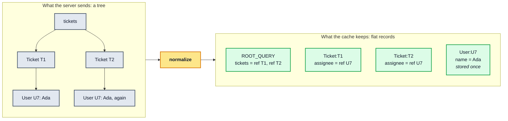
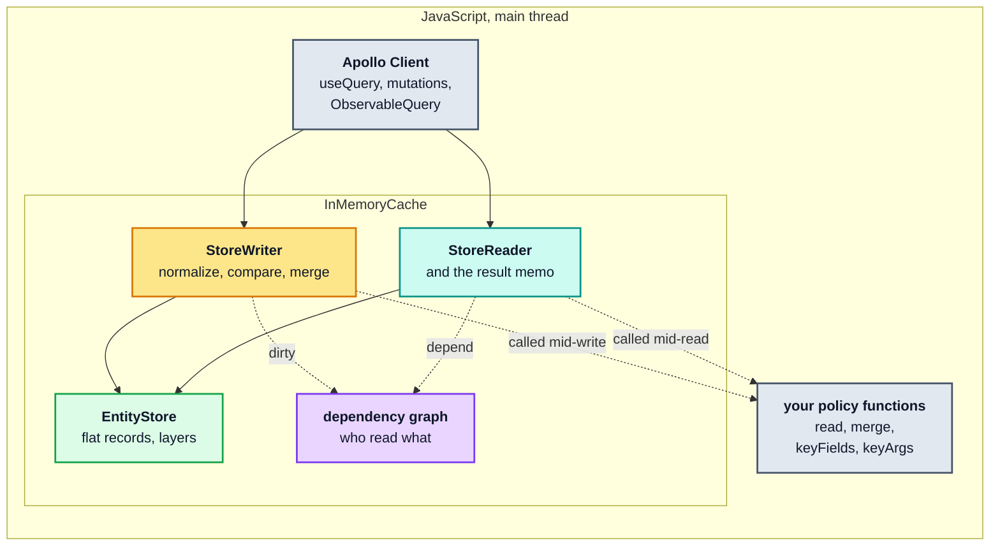
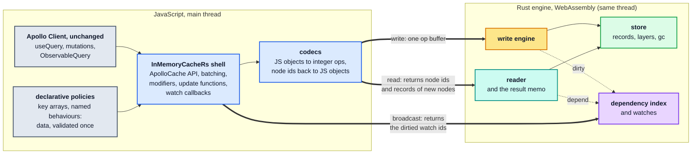

<h1 align="center">
  <a href="https://rustacean.net"></a>
  &nbsp;&nbsp;&nbsp;&nbsp;
  <a href="https://www.apollographql.com/docs/react/"><picture><source media="(prefers-color-scheme: dark)" srcset="https://raw.githubusercontent.com/convict-git/fast-gql-cache-rs/dnd-data/assets/logos/apollo-wordmark-white.svg"></picture></a>
  &nbsp;&nbsp;&nbsp;&nbsp;
  <a href="https://www.rust-lang.org"><picture><source media="(prefers-color-scheme: dark)" srcset="https://raw.githubusercontent.com/convict-git/fast-gql-cache-rs/dnd-data/assets/logos/rust-logo-white-outline.svg"></picture></a>
  &nbsp;&nbsp;&nbsp;&nbsp;
  <a href="https://webassembly.org"></a>
  <br>
  fast-gql-cache-rs 🦀
</h1>

<div align="center">

[](#where-we-are)
[](https://github.com/convict-git/fast-gql-cache-rs/issues/18)
[](https://github.com/sponsors/convict-git)
[](https://github.com/convict-git/fast-gql-cache-rs/actions/workflows/ci.yml)

**Apollo Client's normalized cache, with the engine rebuilt in Rust and compiled to
WebAssembly.**

</div>

`InMemoryCacheRs` is a replacement for Apollo Client's
[`InMemoryCache`](https://www.apollographql.com/docs/react/caching/overview), built for
applications that write a lot: polling dashboards, live feeds, subscriptions, big lists
that refresh every few seconds. It moves the cache's work into a Rust engine compiled to
WebAssembly, with the goal that every write gives the main thread back sooner.

**Same `ApolloClient`. Same hooks. Same queries. You swap one constructor:**

```diff
- const cache = new InMemoryCache({ typePolicies });
+ const cache = new InMemoryCacheRs({ typePolicies });
```

***(Policies have to be declarative: key arrays and named merge behaviours instead of
custom functions. See [the trade](#the-trade).)***

**Read the design:
[RFC 0001: The architecture of `InMemoryCacheRs`](docs/rfc/0001-inmemorycachers-architecture/README.md)**

## You probably don't need this

Apollo's `InMemoryCache` is excellent. It is mature, flexible and fast where it counts, and
for the vast majority of applications it is the right choice. If your app fetches a page,
renders it and moves on, you can close this tab and go ship something. We won't mind.

**But** you are in the right place if:

- **your workload writes constantly**: polling every few seconds, a subscription
  firehose, thousands of entities refreshed at once;
- **you have seen the profile**: `writeQuery` and `broadcastWatches` eating frames while
  scrolling stutters and typing lags;
- **you're fine with declarative cache policies**: key arrays and named merge behaviours
  instead of custom `read`/`merge` functions;
- **or you're curious** how far Rust and WebAssembly can push a cache that has to stay
  synchronous.

**Want it when it ships?** [Join the waitlist](https://github.com/convict-git/fast-gql-cache-rs/issues/18): one thumbs-up, no sign-up.
**Want it sooner?** [Sponsor the work](https://github.com/sponsors/convict-git).

## Wait, isn't a cache just a `Map`?

*Already know Apollo Client's cache? [Skip to where it hurts](#where-it-hurts).*

Not this one. If you haven't used Apollo Client: it is one of the most popular GraphQL
clients for React, and `InMemoryCache` is the part that holds your data. Calling it a cache
undersells it. It is a **reactive, normalized database that runs in the browser**:

- **Normalized.** A GraphQL response is a tree. The cache flattens it into records keyed by
  id, such as `User:U7`. Every query that shows Ada points at the same record, so when her
  name changes, every screen that shows her updates.
- **Reactive.** Each `useQuery` is a live view. When a write changes a field, the cache
  knows which results read that field. It re-reads only those results and re-renders only
  the components whose data actually changed.
- **Memoized.** Reading an unchanged query takes microseconds and returns the *same*
  objects (`===`), which is what lets React skip re-rendering.
- **Optimistic.** A mutation can show its expected result immediately, as a layer on top of
  the store, and remove that layer when the server responds.
- **Programmable.** Type policies decide identity, pagination and computed fields. `evict`
  and `gc()` clean up, and `extract`/`restore` carry the whole store across server-side
  rendering.



All of this runs synchronously, in JavaScript, on the main thread, alongside your rendering
and input handling. Most of the time, nobody notices.

## Where it hurts

`InMemoryCache` has one asymmetry: **reads are memoized, writes are not.** A read that hits
the memo is almost free. A write has no incremental path: it normalizes and compares the
*whole* payload before it knows what changed. Then every watcher of the changed data pays
for a re-read and a comparison.

From the [Apollo performance guide](docs/research/performance/README.md), for a list of 5 000 entities
(production build, median of five fresh runs):

| What happens | `InMemoryCache` |
| --- | --- |
| read the list, nothing changed | **3.8 µs** |
| write the list again with **one** entity changed | **72.18 ms** |
| re-read it after that one field changed | 19.53 ms |
| notify 200 watchers after a relevant write (2 000 entities) | 95.99 ms |
| memory kept for a query that is read and watched | **14.8×** the size of the store itself |

At 60 fps, a frame lasts 16.7 ms. A poll that changes one ticket out of 5 000 spends about
four frames just writing it. A write-heavy application pays on exactly the side Apollo
cannot memoize.

*These numbers were measured under Node. Browser measurements come with the vertical
slice ([§19](docs/rfc/0001-inmemorycachers-architecture/04-getting-there.md#19-performance-and-memory-targets)).*

## The idea

Apollo calls your policy functions (`read`, `merge`, `keyFields`, `keyArgs`) in the middle
of every read and write. As long as it does, the store, the reader and the writer have to
live in JavaScript next to those functions.

**So we make policies data.** You write key arrays and pick behaviours by name from a fixed
catalogue. With no application code left inside a read or a write, the whole engine can
move to Rust: the store, the writer, the reader, the result memo and invalidation.

**Before: `InMemoryCache`.** Everything is JavaScript, and your functions are called for
individual fields in the middle of reads and writes.



**After: `InMemoryCacheRs`.** A thin TypeScript shell keeps Apollo's API and runs the user
code that works on whole operations. A Rust engine does everything that is hot. Thick
arrows cross the JS ↔ WASM boundary.



Three rules carry the whole design:

1. **One store, in Rust.** JavaScript keeps objects only where their identity is
   observable: the results the cache hands out, the JSON values you wrote, and strings.
2. **Rust never calls JavaScript.** Every crossing is a call from JS into Rust that
   returns. User code runs between cache calls, which is where Apollo runs it already.
3. **Data crosses in bulk, as integers.** A write crosses once, as a buffer of ids and
   numbers. A read comes back as node ids, plus records for the nodes JavaScript hasn't
   seen yet.

## The trade

| You give up | You get (targets, not measurements yet) |
| --- | --- |
| custom `read` and `merge` functions, replaced by named descriptors that cover Apollo's pagination helpers and common idioms | writes at least **2× faster**, with 4× as the aim |
| `keyFields`/`keyArgs` functions and `dataIdFromObject`, replaced by key arrays | broadcasts to many watchers at least **2× faster** |
| a few rarely used features ([the full list](docs/compatibility.md#unsupported-features)) | at most **half the memory** per watched query |
| runtimes without WebAssembly | `evict` and `gc()` that actually give memory back, and `cache[Symbol.dispose]()` for caches built per request |

For a configuration that only uses keys and common policies, migrating means changing the
import and how the policies are written:

```ts
// Before
import { InMemoryCache } from "@apollo/client";
import { offsetLimitPagination } from "@apollo/client/utilities";

const cache = new InMemoryCache({
  typePolicies: {
    Query: { fields: { activity: offsetLimitPagination(["ticketId"]) } },
  },
});
```

```ts
// After (descriptor spelling not final yet)
import { ApolloClient } from "@apollo/client";
import { InMemoryCacheRs } from "fast-gql-cache-rs";

const cache = new InMemoryCacheRs({
  typePolicies: {
    Query: { fields: { activity: { keyArgs: ["ticketId"], merge: { list: "offset" } } } },
  },
});

const client = new ApolloClient({ link, cache }); // unchanged
```

A configuration that still contains a function fails loudly: TypeScript rejects it, and the
constructor throws an error that names every offending path. Nothing half-works.

You won't have to do this rewrite by hand. Once v1 is done, the project ships a
**migration skill**: an agent skill that coding agents such as Claude Code and Cursor load,
which rewrites imperative `typePolicies` into declarative ones and, for anything with no
declarative form, points to the replacement.

## How we're building it

A cache sits under every screen of an application, so "mostly works" doesn't count. The
project is set up so that it cannot quietly drift from Apollo:

- **Apollo is the oracle.** Apollo's own `InMemoryCache` test suite is ported and never
  rewritten to make it pass. A green run counts only for tests proven to reach Rust.
- **Byte-for-byte behaviour checks.** `npm run probe:parity` compares our cache's output
  with Apollo's. Any difference is a bug, or an entry in the
  [drift register](docs/compatibility.md#behaviour-drift) with a measured reason and tests
  that pin it.
- **Evidence before engine.** Faster is a hypothesis, not a promise. The two riskiest
  pieces, the encoder and the materializer, are prototyped and measured first, and each
  has a stop condition to meet before any engine work starts.
- **Every PR is measured.** The `benchmark` label runs the performance and memory probes
  against `main`, and a nightly job records the history
  ([benchmarking](docs/benchmarking.md)).
- **Decisions are written down.** [ADRs](docs/adr/) record every decision and the evidence
  for it, the [RFC](docs/rfc/0001-inmemorycachers-architecture/README.md) explains how they
  fit together, and [Unsupported features](docs/compatibility.md#unsupported-features)
  lists what won't work, with a workaround for each, before anyone migrates.
- **No leaks, by contract.** JavaScript's garbage collector can't see WebAssembly memory,
  so every cache owns its Rust allocations and frees them deterministically. A memory check
  that disposal returns the heap to its baseline is a release gate.

## Where we are

**Pre-alpha, not released.** The TypeScript shell implements Apollo's full cache API and
passes Apollo's own `InMemoryCache` test suite. So far that only proves the shell:
underneath, it still delegates to Apollo's internals, and the Rust engine is a stub.

- [x] **Phase 1**: the full `ApolloCache` API in TypeScript, delegating to Apollo; the
      ported parity suite; behaviour, performance and memory probes; the benchmark workflow
- [ ] **0. Evidence**: benchmark fixes, a frozen synthetic workload (polling first)
- [ ] **1. Boundary experiments**: the encoder (E10) and the materializer (E11), then fix the
      thresholds and stop conditions
- [ ] **2. The declarative profile**: types, validation, a migration guide
- [ ] **3. Vertical slice**: a real `ApolloClient` polling through the Rust engine, measured
      in a browser
- [ ] **4. v1**: the full engine, passing the full oracle, followed by the migration skill
      that rewrites imperative `typePolicies` into declarative ones
- [ ] **5. v2, the first release**: no patched Apollo imports, `Symbol.dispose`, a
      clean-install check
- [ ] **6. Beyond Apollo**: improvements Apollo's model can't make, each measured on its own

The gates for each step are in
[RFC §20](docs/rfc/0001-inmemorycachers-architecture/04-getting-there.md#20-where-we-are-and-the-plan).

### Measured against `InMemoryCache`

Each night that `main` has changed, a job runs the
[performance](docs/probes/cache-performance-probe.mjs) and
[memory](docs/probes/cache-memory-probe.mjs) probes on both caches, `InMemoryCacheRs`
and Apollo's `InMemoryCache`, on the same machine. Each point shows how many times
faster, or smaller, `InMemoryCacheRs` is than `InMemoryCache` at that commit. 1× is `InMemoryCache`, higher is better, and the 2× line is the target for writes,
broadcasts and memory from [the trade](#the-trade). Both charts sit at about 1× for now:
underneath, the engine is still Apollo's.

<a href="https://github.com/convict-git/fast-gql-cache-rs/tree/dnd-data/benchmarks"><picture><source media="(prefers-color-scheme: dark)" srcset="https://raw.githubusercontent.com/convict-git/fast-gql-cache-rs/dnd-data/benchmarks/charts/speed-dark.svg"></picture></a>

<a href="https://github.com/convict-git/fast-gql-cache-rs/tree/dnd-data/benchmarks"><picture><source media="(prefers-color-scheme: dark)" srcset="https://raw.githubusercontent.com/convict-git/fast-gql-cache-rs/dnd-data/benchmarks/charts/memory-dark.svg"></picture></a>

Every run and every measurement is on the
[`dnd-data/benchmarks`](https://github.com/convict-git/fast-gql-cache-rs/tree/dnd-data/benchmarks)
branch. [Benchmarking](docs/benchmarking.md) explains how the numbers are produced and
why you can trust them.

## FAQ

<details>
<summary><b>Can I use it today?</b></summary>

No. The package doesn't work outside this repository yet: it depends on a development-only
patch of `@apollo/client`, and its WebAssembly initialization isn't built. Nothing ships
for production use before v2. [Join the waitlist](https://github.com/convict-git/fast-gql-cache-rs/issues/18) if you'd like to know when it
does.

</details>

<details>
<summary><b>Is it really a drop-in replacement?</b></summary>

For declarative configurations, that's the goal. What Apollo Client relies on holds
exactly: the `ApolloCache` contract and synchronous read-your-writes. So does everything
you write yourself: config shapes, identity, descriptor and modifier semantics, `possibleTypes`,
and `extract`/`restore` contents. Incidental behaviour may differ, but only one registered
entry at a time ([ADR 0002](docs/adr/0002-compatibility-target.md)).

If your configuration uses functions, it needs a migration first, and most functions have
a declarative form: key arrays instead of `keyFields`/`keyArgs` functions, and named
descriptors instead of Apollo's pagination helpers and the common `merge` and `read`
idioms. The constructor names every path that still needs one. After v1, the
[migration skill](#the-trade) does that rewrite for you. And if a policy of yours has no
descriptor yet but solves a problem other apps share too,
[request a descriptor](https://github.com/convict-git/fast-gql-cache-rs/issues/new?template=descriptor-request.yml): the catalogue grows
one real use case at a time.

</details>

<details>
<summary><b>Why can't I keep my <code>read</code> and <code>merge</code> functions?</b></summary>

Because they run in the middle of every read and write, often once per field. Calling from
Rust back into JavaScript that often would cost more than the engine saves, and it would
keep the reader and the writer tied to JavaScript. Removing that one capability is what lets
everything else move to Rust.

Most policies don't need to be functions, though.
[Unsupported features](docs/compatibility.md#unsupported-features) lists each
function-based feature with its declarative replacement, and after v1 the
[migration skill](#the-trade) applies those replacements for you. If a policy of yours has
no replacement yet but expresses a pattern other apps are likely to share,
[request a descriptor](https://github.com/convict-git/fast-gql-cache-rs/issues/new?template=descriptor-request.yml) that describes the policy and
what it does. The catalogue grows by amendment, one real use case at a time. What stays
out is logic that computes values, such as a computed field, and that list gives the
alternative for each.

</details>

<details>
<summary><b>Why not move the cache to a Web Worker?</b></summary>

Every cache API is synchronous. Apollo Client writes a result and reads it back in the
same call stack, and a worker can't answer synchronously. The engine runs on the main
thread, like `InMemoryCache`. The goal is for it to do less work there, not to move the
work elsewhere.

</details>

<details>
<summary><b>Why Rust and WebAssembly, rather than a faster JavaScript cache?</b></summary>

Partly because exploring Rust and WebAssembly is the point of this project: a pure-JS
engine is out of scope. The declarative profile is also what makes a compact engine
possible, since results become integer records instead of a graph of JavaScript objects.
Where Rust and WebAssembly would lose, for example by walking JS objects property by
property or by copying every string across the boundary, the design keeps that work in
JavaScript. The [alternatives considered](docs/rfc/0001-inmemorycachers-architecture/04-getting-there.md#22-alternatives-considered)
list the rest.

</details>

<details>
<summary><b>Will it actually be faster?</b></summary>

We don't know yet, and we won't claim it until it's measured. The targets are at least 2×
on writes and broadcasts, half the memory per watched query, and warm reads within 2× of
Apollo's few microseconds. The boundary experiments come first, so if the crossing costs too
much, the work stops before any engine is built
([RFC §19](docs/rfc/0001-inmemorycachers-architecture/04-getting-there.md#19-performance-and-memory-targets)).

</details>

<details>
<summary><b>Does WebAssembly mean a setup step, or an async constructor?</b></summary>

Neither. `new InMemoryCacheRs()` is synchronous, like `new InMemoryCache()`. The
WebAssembly ships inside the package and compiles the first time you create a cache, and
CI keeps it within a size budget
([ADR 0003](docs/adr/0003-wasm-initialization.md)). This needs a runtime with WebAssembly,
Chrome 115 or later on the main thread, and `'wasm-unsafe-eval'` in any Content Security
Policy ([U9–U11](docs/compatibility.md#runtime-environment)).

</details>

<details>
<summary><b>I build a cache per request on the server. Will it leak?</b></summary>

It must not, and v2 doesn't ship until it's proven. JavaScript's garbage collector can't see
WebAssembly memory, so `cache[Symbol.dispose]()` (or `using cache = …`) frees everything a
cache allocated, deterministically. A finalizer is only a fallback.

</details>

<details>
<summary><b>Which Apollo Client versions?</b></summary>

`@apollo/client@4.2.11`, pinned as both the development and the peer dependency. Its
test suite is the oracle, so upgrading is its own change, re-verified against the new
oracle.

</details>

<details>
<summary><b>Is this an official Apollo, Rust or WebAssembly project?</b></summary>

No. It is an independent open-source project, not affiliated with or endorsed by Apollo
Graph, Inc., the Rust Foundation or the W3C WebAssembly Community Group. It builds on
Apollo Client and uses Apollo's test suite as its measure of correctness.

The logos at the top belong to their owners and appear only to say what the project is
built from: the Apollo wordmark (recoloured white for dark themes), the Rust logo by the
Rust Foundation under [CC-BY 4.0](https://creativecommons.org/licenses/by/4.0/), and the
WebAssembly logo and Ferris the crab, both dedicated to the public domain under
[CC0](https://creativecommons.org/publicdomain/zero/1.0/). Sources are listed on the
[`dnd-data/assets`](https://github.com/convict-git/fast-gql-cache-rs/tree/dnd-data/assets#logos) branch.

</details>

<details>
<summary><b>How can I help?</b></summary>

- Read [RFC 0001](docs/rfc/0001-inmemorycachers-architecture/README.md) and weigh in on its
  [open questions](docs/rfc/0001-inmemorycachers-architecture/04-getting-there.md#23-open-questions).
- Have a write-heavy workload? Describe its shape in a comment on the
  [waitlist issue](https://github.com/convict-git/fast-gql-cache-rs/issues/18): payload sizes, polling rate, how many watchers. The synthetic
  workload is frozen before the engine is built, so real shapes are most useful now.
- Check your cache configuration against
  [Unsupported features](docs/compatibility.md#unsupported-features) and tell us what
  would block you.

</details>

## Support the project

- **Join the waitlist.** React with a thumbs-up on the [waitlist issue](https://github.com/convict-git/fast-gql-cache-rs/issues/18), and
  subscribe to it if you'd like a notification when the first release ships. The badge at
  the top counts them.
- **Sponsor the work.** [GitHub Sponsors](https://github.com/sponsors/convict-git) helps fund the time it takes to build the
  engine and prove it against Apollo's own tests.
- **Help shape it.** See [How can I help?](#faq) in the FAQ.

## Go deeper: the research on Apollo's `InMemoryCache`

Before writing any Rust, we took Apollo's `InMemoryCache` (`@apollo/client@4.2.11`) apart:
how every path works, what each one costs, and what a replacement has to preserve. **These
guides describe Apollo's cache, not `InMemoryCacheRs`**; the design of `InMemoryCacheRs` is
[RFC 0001](docs/rfc/0001-inmemorycachers-architecture/README.md). They record what we've
found so far and will change as the work goes on. The [research](docs/research/README.md)
lists every chapter, and the [documentation home](docs/README.md) has reading paths and a
section-level table of contents.

<!-- toc:start -->

### [Apollo architecture guide](docs/research/architecture/README.md): what every path does

- [Part 0 — Orientation](docs/research/architecture/00-orientation.md)
- [Part 1 — Foundations](docs/research/architecture/01-foundations.md)
- [Part 2 — The normalized store](docs/research/architecture/02-normalized-store.md)
- [Part 3 — `Policies`](docs/research/architecture/03-policies.md)
- [Part 4 — `StoreWriter`](docs/research/architecture/04-store-writer.md)
- [Part 5 — `StoreReader`](docs/research/architecture/05-store-reader.md)
- [Part 6 — Reactivity](docs/research/architecture/06-reactivity.md)
- [Part 7 — Method-by-method reference](docs/research/architecture/07-method-reference.md)
- [Part 8 — The cache in the Apollo Client pipeline](docs/research/architecture/08-client-pipeline.md)
- [Part 9 — Invariants and a re-implementation checklist](docs/research/architecture/09-invariants-and-checklist.md)

### [Apollo performance guide](docs/research/performance/README.md): what every path costs

- [Part 1 — The cost model in one page](docs/research/performance/01-cost-model.md)
- [Part 2 — The write path](docs/research/performance/02-write-path.md)
- [Part 3 — The read path](docs/research/performance/03-read-path.md)
- [Part 4 — The dependency graph and broadcast](docs/research/performance/04-dependency-graph-and-broadcast.md)
- [Part 5 — Layers and optimistic updates](docs/research/performance/05-layers-and-optimistic-updates.md)
- [Part 6 — Lifecycle operations](docs/research/performance/06-lifecycle-operations.md)
- [Part 7 — Structural properties that stress the hot paths](docs/research/performance/07-structural-stress.md)
- [Part 8 — Worst-case shapes and a stress corpus](docs/research/performance/08-worst-case-shapes.md)
- [Part 9 — Optimization playbook](docs/research/performance/09-optimization-playbook.md)
- [Part 10 — Memory](docs/research/performance/10-memory.md)

### [Probes](docs/README.md#probes): executable checks

- [Behaviour probe](docs/probes/cache-behavior-probe.mjs): 78 assertions that pin the
  behaviour described in the Apollo architecture guide
- [Performance probe](docs/probes/cache-performance-probe.mjs): produces every table in the
  Apollo performance guide; its output is committed as
  [`cache-performance-probe.log`](docs/probes/cache-performance-probe.log)
- [Benchmarking](docs/benchmarking.md): how each PR's performance effect is measured
  (the `benchmark` label) and tracked nightly on the `dnd-data/benchmarks` branch

<!-- toc:end -->

## Setup dev environment

Versions are pinned: Node in `.nvmrc`, Rust (with the `wasm32-unknown-unknown` target,
`rustfmt` and `clippy`) in `rust-toolchain.toml`, dependencies in `package-lock.json` and
`wasm/Cargo.lock`. You need `git`, [`nvm`](https://github.com/nvm-sh/nvm) and
[`rustup`](https://rustup.rs).

```bash
git submodule update --init --recursive --depth 1
nvm install        # the Node version in .nvmrc
npm ci
# Installs the Rust toolchain rust-toolchain.toml pins. RUSTUP_PERMIT_COPY_RENAME
# avoids an EXDEV rename failure on overlayfs-backed containers (cloud CI/agents).
RUSTUP_PERMIT_COPY_RENAME=true rustup toolchain install
npm run wasm:dev   # builds pkg/, which typecheck and tests import
npm test
```

CI (`.github/workflows/ci.yml`) runs the same steps.

## License

- **Code** (everything that is not documentation, including the npm package and the Rust
  crate): dual-licensed under [MIT](LICENSE-MIT) or [Apache-2.0](LICENSE-APACHE), at your
  option. This is the convention across the Rust ecosystem.
- **Documentation** (this README's prose, `docs/` and its diagrams):
  [CC-BY 4.0](LICENSE-CC-BY). Reuse it anywhere, with credit to fast-gql-cache-rs and a
  link back. Code samples in the documentation are also available under the code licenses,
  so you can paste them without attribution overhead.
- **Third-party material**: code adapted from Apollo Client stays under Apollo's MIT
  license, and the logos belong to their owners. See
  [THIRD_PARTY_NOTICES.md](THIRD_PARTY_NOTICES.md).

Unless you say otherwise, any contribution you submit is licensed the same way as the file
it changes: code under MIT OR Apache-2.0, documentation under CC-BY 4.0, with no
additional terms.
