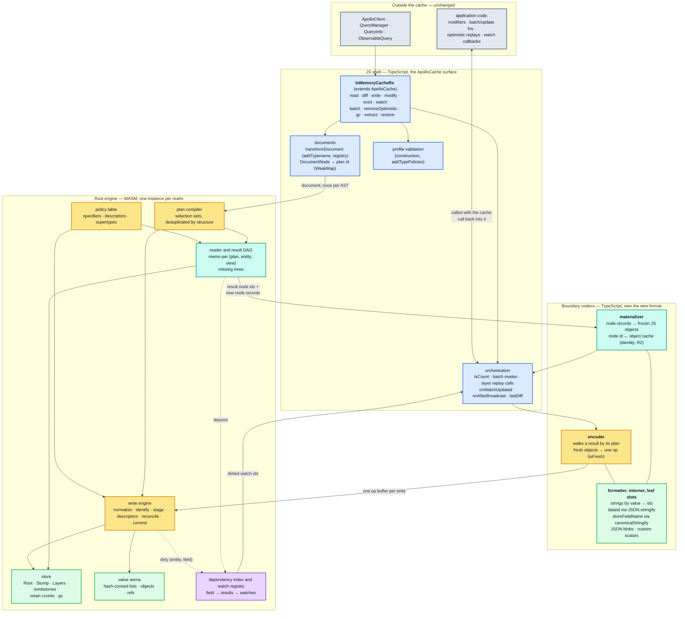
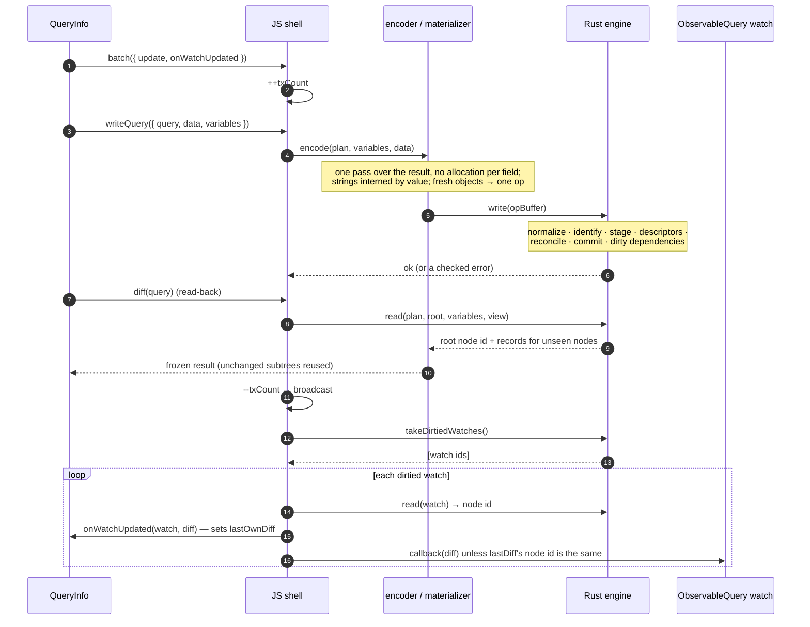

# Declarative policies, and a Rust engine that owns the store, the write, the read and invalidation

`InMemoryCacheRs` accepts only **declarative** cache configuration: `keyFields` and
`keyArgs` as specifier arrays or `false`, `possibleTypes` as a plain map, and `merge` (and a
few `read` behaviours) chosen from a **closed set of descriptors the cache defines**. It
rejects JavaScript functions in policies, at construction, with an error that names each
one. In exchange, no user code runs inside a read or a write. That removes the constraint
that shaped [ADR 0001](0001-js-rust-wasm-boundary.md): the store, the write engine, the
reader, the result memo and invalidation all move into Rust. JavaScript keeps the
`ApolloCache` API, the operation-level callbacks that API defines (modifiers, `update`
functions, watch callbacks), and two thin codecs that cross the boundary in bulk.

This record amends ADR 0001 (the boundary, contracts 2, 4–6, the migration order and V0)
and [ADR 0002](0002-compatibility-target.md) (tier 2). It leaves
[ADR 0003](0003-wasm-initialization.md) unchanged. It is proposed: nothing below has been
measured yet, and every performance statement is a hypothesis that the
[experiments and gates](#migration-order-and-gates) decide.

## Context

The maintainer's premise (2026-09-26): this cache is for write-heavy applications that
want performance more than flexibility. Giving up custom `read` functions, custom `merge`
functions and function-valued `keyFields`/`keyArgs` is worth it if the rest of the mental
model stays close to `InMemoryCache`. The constraints are stated to adopters up front.

ADR 0001 and ADR 0002 assumed the opposite. They put every user-authored function in tier 2,
so they had to let user code run in the middle of reads and writes, and that one
assumption forced most of ADR 0001:

| ADR 0001 decision | Forced by |
| --- | --- |
| the reader, the read memo and every `optimism` dependency stay in JS (A4) | dependency capture is ambient: user `read` functions and reactive variables register dependencies from inside the memoized read (F14) |
| policy `storage` stays in JS (F16) | only `read` and `merge` functions use it |
| a resumable write engine that flushes a dirty report before every callout (contracts 4–6) | `merge`, `keyFields` and `keyArgs` functions run mid-write, can read the cache and can throw (F6, F12, F15) |
| stored values as JS *slots* (A2), and stored-value identity (contract 2) | user functions and Apollo's `StoreReader` see JS identity (F3, F8) |
| V0: a Rust store under Apollo's reader and writer | the reader and writer could not move while they run user code |

**Where the time goes** ([performance Part 1](../performance/01-cost-model.md)), for a list
of 5 000 entities: a cold write takes 83.41 ms and a write of an identical payload 75.95 ms,
against 3.8 µs for a warm read. For a fresh payload a write has no "nothing changed" fast
path. Around every write sit the costs of reacting to it: a re-read after one dirty field
(19.53 ms), a broadcast to 200 watchers of one document (95.99 ms), and the
same broadcast when those watchers use separately parsed documents (7.42 s,
[§4.5](../performance/04-dependency-graph-and-broadcast.md#45-memo-fragmentation-by-document-identity)).
A write-heavy application pays all of them on every write. Apollo's reader stays in JS under
ADR 0001, so ADR 0001 could only reach the first.

**What the premise costs in tests.** By a pattern count over `src/__tests__`, 46 of the 266
ported test cases configure a `read`, `merge`, `keyFields` or `keyArgs` function, a custom
`dataIdFromObject`, a pagination helper or a reactive variable. The other 220 exercise only
declarative configuration and stay the oracle. The performance probe's sections 1–13 use no
policy functions, so ADR 0001's gates already measure the declarative workload. Two
behaviour-probe sections depend on functions: 10 (a concat `merge`) and 11 (`read`
functions, a reactive variable, a cache redirect).

## Decision

### 1. The declarative profile

An Apollo configuration that uses only the "accepted" column runs on `InMemoryCacheRs`
unchanged.

| Option | Accepted | Rejected at construction |
| --- | --- | --- |
| `typePolicies[T].keyFields` | `KeySpecifier` array, `false` | functions |
| `typePolicies[T].fields[f].keyArgs` | `KeySpecifier` array (`@directive` and `$variable` paths included), `false` | functions |
| `typePolicies[T].fields[f].merge`, `typePolicies[T].merge` | `true`, `false`, a [merge descriptor](#2-the-descriptor-vocabulary) | functions |
| `typePolicies[T].fields[f].read` | a [read descriptor](#2-the-descriptor-vocabulary) | functions |
| `typePolicies[T].queryType` / `mutationType` / `subscriptionType` | as Apollo | — |
| `possibleTypes` | exact type names | pattern entries (fuzzy subtypes, [architecture §3.6](../architecture/03-policies.md#36-fragmentmatches--type-condition-resolution)), until a regex engine earns its size |
| `dataIdFromObject` | — (the default `__typename:id` / `_id` behaviour is built in) | any value |
| `fragments` (fragment registry) | as Apollo | — |
| `resultCaching` | `true`, which is Apollo's default and the only mode | `false`: result caching is always on, and the option is not in `InMemoryCacheRsConfig` |
| `cache.policies.addTypePolicies` / `addPossibleTypes` | the same accepted shapes, validated the same way | the same rejected shapes |

`InMemoryCacheRsConfig` is our own type, so the rejected shapes are compile errors for
TypeScript users. For JavaScript users, the constructor and `addTypePolicies` **throw**
(decided by the maintainer; there is no warn-and-ignore mode). The error names every
offending path (`typePolicies.Query.fields.feed.merge`) and links the migration guide. The
profile ships first, on top of today's delegation, so adopters can check their
configuration before the engine exists ([step 0](#migration-order-and-gates)).

**Why `resultCaching: false` goes.** In Apollo it is a debugging tool: it makes a warm read
about 9 600× slower and a write about 14 % cheaper
([performance §3.1](../performance/03-read-path.md#31-the-memo-graph-is-the-read-path)).
Supporting it would mean a second read path with no memo and no dependency index, a second
set of rules for when the Root keeps `undefined` (F9), and a watch loop that recomputes
every watch. That is complexity on the boundary for a mode nobody should ship. `true` is
accepted as a no-op so that existing configurations that spell out the default still work.

### 2. The descriptor vocabulary

Users pick behaviours by name from a closed set that the cache implements in Rust. The
maintainer's direction (2026-09-26) is to cover as many real policies as possible this way.
The catalogue below comes from three sources:

- Apollo's caching and state-management guides
  (`apollo-client-sm/.claude/skills/apollo-client/references/caching.md`,
  `state-management.md`);
- Apollo's pagination helpers (`utilities/policies/pagination.ts`);
- the 43 `read` and `merge` functions in Apollo's own policy tests
  (`cache/inmemory/__tests__/policies.ts`).

Every descriptor reproduces the Apollo helper or idiom it replaces exactly, and ships with
the Apollo tests that exercise that idiom, converted to the descriptor. The spelling is
settled in step 0 ([open question 1](#open-questions-for-the-maintainer)). The semantics
are what this record fixes.

**Merge descriptors** (`merge:` on a field policy, or on a type policy where Apollo allows
it):

| Descriptor | Replaces | Semantics source |
| --- | --- | --- |
| `true` | `merge: true` (`mergeObjects`) | `mergeTrueFn`, `makeMergeObjectsFunction` (`cache/inmemory/policies.ts`) |
| `false` | `merge: false`: replace, and no data-loss warning | `mergeFalseFn` (the same file) |
| `{ list: "append" }` | `concatPagination()`, and `[...existing, ...incoming]` | `utilities/policies/pagination.ts`; `policies.ts` tests (756, 2094, 4483, 5772) |
| `{ list: "prepend" }` | `[...incoming, ...existing]` (newest first) | caching guide, `notifications` |
| `{ list: "append" \| "prepend", dedupe: "ref" }` | appending only references not already present | `policies.ts` tests (2870, 4930) |
| `{ list: "append" \| "prepend", dedupe: { by: KeySpecifier } }` | appending only items whose key is new | `policies.ts` test (2615, deduplication by `isbn`) |
| `{ list: "offset", offsetArg?: "offset" }` | `offsetLimitPagination()`: splice `incoming` at `args[offsetArg]` | `utilities/policies/pagination.ts`; the helper's comment invites renaming the argument, hence `offsetArg` |
| `{ ...a list descriptor, path: "items" }` | a list inside a wrapper object: `{ ...incoming, items: [...existing.items, ...incoming.items] }` | caching guide, `posts` |
| `{ connection: "relay" }` | `relayStylePagination()`, a paired read and merge | `utilities/policies/pagination.ts`, `utilities/policies/__tests__/relayStylePagination.test.ts` |
| `{ keep: "existing" }` | first write wins: `existing ?? incoming` | `policies.ts` test (6157) |
| `{ keepExistingWhen: { equal: [fieldNames] } }` | the version guard: keep the stored value when the named fields are unchanged | [performance §7.4](../performance/07-structural-stress.md#74-the-untyped-blob-pathology); the only descriptor with no Apollo helper |

**Read descriptors** (`read:`):

| Descriptor | Replaces | Semantics source |
| --- | --- | --- |
| `{ default: <JSON value> }` | `read(existing = value)`: a value when the field is missing | caching guide, `role` |
| `{ redirect: { typename, keyArgs: { keyField: argName } }, when?: "always" \| "missing" }` | the cache redirect, `toReference({ __typename, id: args.id })`; `"missing"` is the `existing \|\| toReference(...)` form | [architecture §3.4](../architecture/03-policies.md#34-readfield--the-field-read-entry-point); `policies.ts` test (4648); probe section 11 |
| `{ list: "slice", offsetArg?: "offset", limitArg?: "limit" }` | reading one page out of an offset-merged list | caching guide, custom pagination; `policies.ts` test (3385) |
| `{ list: "sort", by: KeySpecifier, order?: "asc" \| "desc" }` | sorting a list by a field of its items on read | `policies.ts` test (2634) |
| `{ connection: "relay" }` | the read half of `relayStylePagination()`: drop unreadable edges, derive `pageInfo` | `utilities/policies/pagination.ts` |

Lists always drop references to missing entities on read, as Apollo's reader does (R4), so
that needs no descriptor.

**Rules.**
- Pagination and connection descriptors default `keyArgs` to `false`, as the helpers do.
- A field with both a read and a merge descriptor counts as defining both, so the implicit
  `keyArgs: false` of
  [architecture §3.3](../architecture/03-policies.md#keyargs-specifiers) applies.
- A read and a merge descriptor on one field must agree on their list mode (`offset` with
  `slice`, `relay` with `relay`); validation rejects other pairs.
- The set grows by amending this record, one descriptor at a time, each with the Apollo
  tests it mirrors. Candidates are logged as adopters report policies the catalogue
  cannot express.

**What stays out, and where it goes instead.** These policies compute or transform values
with arbitrary code, and no closed vocabulary covers them without becoming a programming
language:

| Policy | Example | Migration |
| --- | --- | --- |
| computed fields | `fullName` from `firstName` and `lastName` (caching guide) | `@client` fields resolved by `LocalState` resolvers, which receive the parent object (`local-state/LocalState.ts`), or a selector in the component |
| fields backed by reactive variables | `isInCart` from `cartItemsVar()` (state-management guide) | `useReactiveVar` in the component, or local state written into the cache with `writeQuery` and read with `@client` |
| value transforms on read | `new Date(existing)`, `toLowerCase()` (caching guide, `policies.ts` tests) | parse scalars in a link or in the component |
| value transforms on write | unit conversion by argument, case normalization (`policies.ts` tests 554, 5695) | normalize in a link, or on the server |
| accumulating numbers, `storage`-backed state | `existing + incoming`, `storage.jobName` (`policies.ts` tests 2105, 2462) | state outside the cache |

### 3. The boundary

Colours follow the [architecture legend](../architecture/README.md#diagram-legend). Solid
arrows are synchronous calls or data hand-offs; dotted arrows are dependency registration
and invalidation. Every arrow into the Rust engine is a call from JS, and every arrow out of
it is a return value: Rust calls nothing.

| Stays in JS | Crosses (bulk, per operation) | Rust owns |
| --- | --- | --- |
| the `ApolloCache` surface, `txCount`, `batch` modes, `onWatchUpdated`, `onAfterBroadcast` | a write's op buffer, in | the normalized store, layers, snapshots, tombstones, retain counts, gc |
| modifiers, `update` and replay functions, watch callbacks: operation-level user code, run by JS between Rust calls | new result node records and dirtied watch ids, out | identity (entity keys), staging, descriptors, reconciliation, dirtying |
| document transforms and the fragment registry | a compiled document, once per AST | plans, the result memo, missing trees, the dependency index, the watch registry |
| string, `dataId` and `storeFieldName` formatting and interning; leaf slots (JSON blobs, custom scalars) | ids, not bytes | hash-consed stored values; result nodes, stable per memo entry |
| development-only work: freezing results, printing warnings Rust returns | | |

### 4. The contracts

These replace ADR 0001's contracts 2, 4, 5 and 6 and restate the rest.

1. **One store (C1, kept).** The Rust store is the only authoritative copy. The JS
   materialization cache is disposable: dropping any entry costs a re-materialization from
   Rust's nodes, never a re-read of the store and never a wrong answer.
2. **Rust calls no JavaScript.** The module imports nothing on any cache path. Every
   exported operation runs to completion and returns. User code runs only in the JS shell,
   between Rust calls, as it does in Apollo at operation level
   ([architecture §6.4](../architecture/06-reactivity.md#64-batch--the-transactional-api),
   §2.7, §2.10). With no callouts, ADR 0001's resumable engine, continuations, per-callout
   flushes and origin-classified exceptions (contracts 5 and 6) have nothing left to do.
3. **Synchronous read-your-writes (F1, kept).** A write is visible to the next read in the
   same call stack, because both are synchronous calls into the same store.
4. **Bulk crossings only.** Nothing crosses per field on a hot path. A write crosses as one
   op buffer. A read crosses as result node ids plus records for nodes the JS side has not
   seen. A crossing costs about 5 ns (F20); the cost is in the data, so the data crosses as
   integers.
5. **Observable bytes are formatted in JS, once per distinct value.** `dataId`s
   (`JSON.stringify` of the key object, P2), `storeFieldName`s (`canonicalStringify`,
   [architecture §3.3](../architecture/03-policies.md#33-field-identity-getstorefieldname)),
   `extract()` keys and missing-field messages are built by the same JS functions Apollo
   uses. The results are interned, and Rust computes over ids. Arguments come only from the
   document and the variables, so a plan binds its `storeFieldName`s once per
   (plan, variables), not once per entity. String values are interned by value in JS
   (`Map<string, id>`), so Rust never decodes UTF-8 on a hot path. This point is the
   hypothesis that experiment E10 tests.
6. **`isFresh` survives (F3, tier 2).** The materializer records `object → (node, plan)` in
   a `WeakMap`. When the encoder meets a result object the reader handed out and that node
   is still current for (plan, entity) in the store being written, it emits one "fresh" op
   and skips the subtree, as Apollo skips staging it. Without this, writing back a read
   result through a `concat` descriptor would append the page twice (E1).
7. **Identity (R2, a performance target, ADR 0002).** Result nodes are stable per memo
   entry, and the JS frontier maps each node to one frozen object, so unchanged subtrees
   come back `===`. [Section 5](#5-where-javascript-objects-live-the-frontier) has the
   mechanism and every case.
8. **Invalidation is Rust's (replaces contract 4).** Reads register dependencies on
   `(entity, storeFieldName)` and `__exists` in Rust. Writes dirty them there, with D1–D3
   and L5 as the specification. At the end of a transaction JS asks Rust which watches were
   **dirtied**. That set, not "changed", is what gate 1 and `onWatchUpdated` need (D7,
   [§9.3](../architecture/09-invariants-and-checklist.md#93-cross-boundary-requirements)).
   Propagation stops at the first ancestor that is already dirty, so a leaf change at
   depth `D` costs `O(D)`, not `optimism`'s `O(D²)`
   ([performance §3.3](../performance/03-read-path.md#33-invalidation-blast-radius--the-single-most-important-read-path-concept)).
9. **The equality gate (D5, kept).** The same root node id means equal, and the callback is
   skipped in `O(1)`. Different ids mean "compare": the gate runs `equal()` on the two
   materialized results, which is cheap because unchanged children are `===` and
   `@wry/equality` checks `===` before walking (`check`, `lib/index.js`, 0.5.7). A node id
   is a sufficient test for equality, never a necessary one, so it can skip work but can
   never suppress a callback that `equal()` would allow. When `lastDiff` was cleared (gate
   0 in
   [architecture §8.2](../architecture/08-client-pipeline.md#82-observablequery--the-caches-principal-client))
   the callback fires, as in Apollo. The
   `diff` object passed to `onWatchUpdated` is the one passed to the callback
   (`lastOwnDiff`), and `evict`, `modify` and `reset` stay instance-assignable
   ([§9.3](../architecture/09-invariants-and-checklist.md#93-cross-boundary-requirements)).
10. **State model (ADR 0001 contract 3, kept).** Absent, tombstone and snapshot per level;
    Present fields that may hold `undefined` (in the Root only transiently, since
    `resultCaching` is always on); reconciliation under `@wry/equality` rules (`-0` equals
    `0`, `NaN` equals `NaN`) and dirtying by `!==`. Own-property presence, stored-value
    identity, reconciliation equality and invalidation stay four separate contracts.
    Interning must not collapse them: two `NaN`s may share a value node and still dirty.
11. **Leaf values without a selection set are JS slots** (F5): custom scalars and JSON
    blobs, as [section 5](#5-where-javascript-objects-live-the-frontier) explains.
12. **Panic-free, one instance (ADR 0001 F15 and F19, kept).** Checked inputs and
    `Result`s, an audit and tests. A trap poisons every cache in the realm.
13. **Wasm memory views are re-acquired after every call** that can grow memory (F13).

### 5. Where JavaScript objects live: the frontier

Object identity is observable in a few places: read results (R2, React snapshots, memoized
children), write-backs (F3), leaf values the application wrote, and values handed to
modifiers. The design keeps a JS object exactly where identity is observable, and Rust holds
everything else as ids. The JS side of that split is the **frontier**. It has three parts,
all owned by the codecs:

| Part | Holds | Filled |
| --- | --- | --- |
| **result objects** | `node id → frozen object` for results the cache handed out, and `object → node` (`WeakMap`) for `isFresh` | lazily, by the read that needs them |
| **leaf slots** | values stored without a selection set: JSON blobs and custom scalars, kept as the object the application wrote | by the write that stores them |
| **interned strings** | `string ↔ id`, by value | by the encoder and the formatter |

Rust holds entities, fields, lists, references, embedded objects that have a selection
set, numbers, booleans, `null`, and ids into the frontier.

**The frontier is updated synchronously, and lazily.** It changes only inside the cache
call that needs it: a write fills leaf slots and strings; a read, `diff` or broadcast
materializes the result nodes it is about to return, and only the nodes that are new.
Nothing is materialized ahead of a read. A batch of 100 writes followed by one broadcast
materializes once, which is the saving `batch` exists for
([performance §4.6](../performance/04-dependency-graph-and-broadcast.md#46-batching)).

**Result nodes are stable per memo entry, not hash-consed globally.** A result node
belongs to one memo entry, (plan, entity or embedded parent, view). When an entry
recomputes, Rust compares its new content with its previous content shallowly: scalars by
id, children by node id. If they are equal, the entry keeps its old node, and nothing
above it changes. `optimism` has this short-circuit (`reportCleanChild`,
[architecture §1.1](../architecture/01-foundations.md#entry--the-dependency-graph)), but
Apollo can almost never use it, because `execSelectionSetImpl` builds a new object on
every run. Two things are deliberately not shared:

- equal embedded objects in two places of one result, or in two results;
- optimistic and root reads of the same data.

Global hash-consing would make each of those one object. Nobody observes that as a gain,
it changes identity in ways Apollo never does, and it would make the `isFresh` map
ambiguous about which entity an object came from. Stored *values*, which nobody sees as
objects, are still hash-consed (A6): that is what makes reconciliation `O(1)`.

**Lifetime: pinned plus LRU** (decided by the maintainer, 2026-09-26). The frontier holds an
object for as long as someone can still compare against it. Every node reachable from a
watch's current `lastDiff` is pinned, because Rust keeps a reachability count from watch
roots. Other nodes live in a bounded LRU, which is the guarantee Apollo gives. A `WeakRef`
variant was considered: it keeps identity exactly as long as any object holds the result,
at the cost of one `WeakRef` per node and garbage-collector-driven releases of Rust nodes.
It stays available if the memory probe shows the LRU evicting objects that are still held.
Dropping a frontier entry is always safe. The next read re-materializes the node from Rust, with the
same content and a new object, which is what Apollo does after an LRU eviction.

**Leaf slots.** A JSON blob or custom scalar is stored as the application's own object,
so a read returns that object, as Apollo does in production
([architecture §4.4](../architecture/04-store-writer.md#44-processfieldvalue--scalars-arrays-recursion)),
and a `Date` keeps its identity (F5). Rust stores the slot id. When a write meets a slot
field that is already stored:

- the same object (`===`) is unchanged, and nothing crosses;
- otherwise the write is two-phase. Rust stages it and returns the slot pairs that need
  `equal()`. JS compares them, then calls commit with the answers. JS drives both calls,
  so Rust still calls no JavaScript.

Interning blobs in Rust instead was rejected. It costs `O(B)` on every write (encode and
hash), where `equal()` stops at the first difference. It doubles the blob's memory. And it
loses the written object's identity. A descriptor that looks inside a blob
(`keepExistingWhenEqual`) gets the named fields extracted by the encoder, which already
holds the object.

**Values handed to user code.** Modifiers, `readField` inside modifiers, and `extract()`
receive materialized store values through a value-node cache. A modifier that returns the
value it received returns an object `===` to what was passed, so nothing changes, as in
Apollo. A modifier that returns an equal copy is encoded, gets the same value id, and
dirties nothing, as `storeObjectReconciler` does.

#### Every identity case

| # | Case | `InMemoryCache` | This design |
| --- | --- | --- | --- |
| 1 | warm re-read, nothing written | the same root object (R2) | the same node, the same object |
| 2 | one field of one item in a list of `N` changes | new root, list and item; `N − 1` items `===` | the same; the new list is built from `N` cached children, `O(N)` as in Apollo |
| 3 | an identical payload is rewritten (polling) | nothing dirtied; the same objects | equal value ids; nothing dirtied; nothing materialized |
| 4 | `INVALIDATE`, or a field `evict` that removes nothing | the entry recomputes into new, equal objects; the gate walks them and skips the callback | the entry keeps its node: the same objects, an `O(1)` gate |
| 5 | a layer is removed and the values underneath are equal | new objects on every dirtied path | kept nodes where the content is equal |
| 6 | a value goes A → B → A over two broadcasts | three distinct objects | three distinct objects |
| 7 | a read result is written back (F3) | `isFresh` skips staging after traversing the subtree | a `WeakMap` hit on a current node: one op, the subtree is not even walked |
| 8 | a component holds a result that the memo has evicted | the next read builds a new, equal object, which can cause an extra render | pinned while any watch's `lastDiff` reaches it; otherwise the LRU, as in Apollo |
| 9 | optimistic and root reads of the same data | different objects (L2) | different objects |
| 10 | equal embedded objects in two places | two objects | two objects |
| 11 | a JSON blob is read | the object the application wrote (production) | the same object (slot) |
| 12 | a JSON blob is rewritten with an equal new object | `equal()`, `O(B)`; the old object is kept | `equal()` in JS, `O(B)`; the old slot is kept |
| 13 | a JSON blob is rewritten with the same object | skipped by `===` | skipped by `===` |
| 14 | a custom scalar (`Date`, a class instance) | identity kept (F5) | identity kept (slot) |
| 15 | a modifier returns the value it received | no change | no change |
| 16 | `extract()` twice, no write in between | the same entity objects | the same objects while the value cache holds them (tier 3) |
| 17 | development builds | `maybeDeepFreeze` re-walks subtrees on every read ([performance §3.6](../performance/03-read-path.md#36-the-dev-build-tax)) | each object is frozen once, when it is materialized |

In no case does the design keep fewer objects stable than Apollo. In cases 4, 5, 7 and 8 it
keeps more, and a stable object is a skipped render. What it adds is cost: materializing
new nodes, and a JS lookup per child when a node is built. E11 measures that.

### 6. A network write, end to end

### 7. Memory

The [memory probe](../probes/cache-memory-probe.mjs) measures Apollo's `InMemoryCache`
([performance Part 10](../performance/10-memory.md)). Six results shape this design:

| Apollo, measured | This design |
| --- | --- |
| The store costs 662 B per entity; the root read's memo 4 366 B; a watched query's second memo set and last result another 4 774 B. Result caching is almost 14 times the store. | Result nodes are records of ids in Rust, and dependencies are `(entity, field)` integer pairs, not a key string and a `Set` per field. The frontier holds JS objects only for results that were handed out (section 5). |
| A cold write of 5 000 entities allocates 92 MiB and keeps 3 MiB of it. | The encoder writes into a reused op buffer, with no allocation per field. The engine stages into arenas that the next write reuses. |
| Memo bounds count entries, not bytes: a rolling window grows by about 97 KiB per page, and distinct documents by about 714 KiB each, until the entry limits. | The result memo is bounded in bytes, and a result that references an evicted or collected entity is released with it. |
| Evict plus `gc()` leaves 21 of 46 MiB, because dirty entries keep their last results. | `evict` and `gc` release the result nodes that depend on what they remove. |
| A watched query pays for two memo sets, even with no optimistic layer. | Step 4 builds the optimistic set from the root set's content when no layer shadows the data. |
| Layers and watch churn return their memory. | Kept: the probe's checks pin it. |

**What this design adds, and must bound.**
- **WASM linear memory never shrinks.** Its high-water mark is a cost the application
  keeps, so the probe checks that a second cache reuses it, and CI reports it.
- **The interned strings and the value arena grow with everything ever written, unless
  they are reclaimed.** Both are reference-counted, and entries are freed when their last
  store value, result node or frontier object goes. The probe's plateau checks exist to
  catch a table that only grows.
- **The frontier** is pinned plus an LRU (section 5), and the LRU is bounded in bytes.

**Memory guideposts**, like the speed ones, direct the work rather than gate it:
- **E10:** the encoder allocates at most 5 % of Apollo's write allocation for the same
  payload (4.6 MiB of 92 MiB at `N = 5 000`).
- **The slice:**
  - store plus root-read memo at most half of Apollo's per entity;
  - a watched query at most half;
  - allocation per write at most a quarter.
- **The full engine:** every memory check passes, including the three Apollo fails:
  - the rolling window plateaus;
  - document churn plateaus;
  - evict plus `gc()` returns the memory.

## Every earlier decision, revisited

| Decision | Source | Verdict | Why |
| --- | --- | --- | --- |
| No eventually consistent JS replica | ADR 0001, F1 | **kept** | read-your-writes is synchronous and client-visible |
| One authoritative store (C1) | ADR 0001 contract 1 | **kept** | the frontier is disposable except leaf slots, which the store references by id |
| All user code stays in JS | ADR 0001 boundary | **kept, narrowed** | only operation-level user code remains, and it already runs between cache calls |
| Reader, memo, `CacheGroup` and `optimism` stay in JS (A4) | ADR 0001 | **reversed** | F14's ambient capture came from `read` functions and reactive variables; without them a read's dependencies are store fields only, and Rust can record them |
| A Rust reader is parked | ADR 0001 considered options | **adopted** | the reason for parking it is gone |
| Policy `storage` in JS (F16) | ADR 0001 | **dropped** | only functions used it |
| Values as JS slots (A2) | ADR 0001 | **narrowed** to leaf values without a selection set | F8 (Apollo's `StoreReader` keyed on stored arrays) is moot once the reader is Rust's; strings cross as ids |
| Stored-value identity (contract 2) | ADR 0001 | **replaced** by contract 7 | nothing outside the engine keys on stored objects any more |
| State model (contract 3) | ADR 0001 | **kept** | store semantics, independent of user code |
| Dirty report per boundary return (contract 4) | ADR 0001 | **replaced** by contract 8 | JS holds no dependency graph to update |
| Callout order and flushes (contract 5, F12) | ADR 0001 | **dropped** | no callouts; mid-write reads by user code cannot happen |
| Resumable engine, continuations, exception origin (contract 6) | ADR 0001 | **dropped**, except panic-free and one instance | no callouts |
| Hash-consing (A6) | ADR 0001 contract 7 | **kept for stored values**; results get stable nodes per memo entry instead | global hash-consing of results would alias objects Apollo keeps apart ([section 5](#5-where-javascript-objects-live-the-frontier)) |
| Opaque JSON scalars keep JS `equal()` | ADR 0001 contract 7 | **kept, and extended to every JSON blob** | a slot keeps the written object's identity, costs nothing to cross, and `equal()` stops at the first difference |
| `resultCaching` option | Apollo's config | **removed**; always on | a second read path for a debugging mode ([section 1](#1-the-declarative-profile)) |
| No raw-bytes ingestion (F17) | ADR 0001 | **kept** | the cache never sees bytes; the encoder reads the parsed object |
| Migration order and V0 | ADR 0001 A1, A8 | **replaced** | V0 measures a per-field `store.get` boundary that this design never ships |
| V0's gates | ADR 0001 | **replaced** | [new gates](#migration-order-and-gates), same correctness bar, same probe sections |
| Worker-hosted store | ADR 0001 | **still rejected** | every API is synchronous |
| Tier 1, the client contract | ADR 0002 | **kept** | Apollo Client depends on it |
| Tier 2, the user-authored surface | ADR 0002 | **amended** | hard for the declarative profile, **unsupported** outside it ([below](#compatibility-amends-adr-0002)) |
| Tier 3 and the drift register | ADR 0002 | **kept** | the candidates stay candidates; the Rust engine makes several cheap to keep |
| `===` result stability is performance | ADR 0002 | **kept** | contract 7 delivers more than Apollo does |
| The oracle is Apollo's `InMemoryCache` | ADR 0002 | **kept** | for the declarative profile; the probes run both caches with descriptor-equivalent configuration where needed |
| Synchronous init from bundled bytes | ADR 0003 | **kept** | unaffected |
| 1 MB gzipped budget | ADR 0003 | **kept**, now binding | more logic moves into Rust; formatting stays in JS partly to stay under it |
| No public initializer | ADR 0003 | **kept** | unaffected |
| Phase 2 delegates to Apollo's `EntityStore`, `Policies`, `StoreReader`, `StoreWriter` | AGENTS.md | **ends** at step 3 | the patch shrinks as each import goes (AGENTS.md import rule 2) |

## Compatibility (amends ADR 0002)

- **Tier 1 is unchanged.** Every row of
  [§9.3](../architecture/09-invariants-and-checklist.md#93-cross-boundary-requirements) and
  the invariants ADR 0002 lists hold, L2 included: optimistic and root reads keep separate
  memo entries and separate result objects ([section 5](#5-where-javascript-objects-live-the-frontier)).
- **Tier 2 holds for the declarative profile** (section 1, section 2): identity, field keys,
  descriptor semantics including how often they apply (W2–W5, F3), `possibleTypes` for
  exact names, `evict`/`gc`/`retain`, and `extract()`/`restore()` contents.
- **Outside the profile is unsupported, not drift.** Custom `read`/`merge`/`keyFields`/
  `keyArgs` functions, `dataIdFromObject`, fuzzy `possibleTypes`, `resultCaching: false`,
  policy `storage`, and reactive variables *consumed by the cache* are rejected or have no
  effect. `makeVar`
  itself still works with `useReactiveVar`, and `broadcastWatches` stays callable for it
  ([architecture §6.6](../architecture/06-reactivity.md#66-reactive-variables)).
  `resolvesClientField` returns `true` only for fields with a read descriptor. The register
  gets an **Unsupported** section next to **Adopted**, and a migration guide with a
  replacement for each rejected shape: a descriptor, local state written with `writeQuery`,
  or `useReactiveVar`.
- **The oracle.** The 220 ported cases that use only declarative configuration keep
  Apollo's assertions. The 46 that configure functions move, per case, to one of two
  places. Where a descriptor expresses the same policy, they stay as a test whose
  configuration uses the descriptor, with Apollo's assertions. Otherwise they become a test
  that construction rejects the configuration. `probe:parity` runs sections 10 and 11 with
  descriptor-equivalent configuration against both caches, and excludes the reactive
  variable check.

## Migration order and gates

The experiments come first because they are cheap and they decide the design. The numbers
below are **guideposts, not commitments**: they say how far off an approach is, so that a
miss sends us to the alternatives (the `JSON.stringify` ingestion, the `WeakRef`
frontier, a different op format) rather than into engine work on a weak boundary. The
correctness bar is the one hard gate. The maintainer fixes numbers when there are
measurements to fix them against.

0. **The profile.** Ship `InMemoryCacheRsConfig`'s declarative types, the runtime
   validation and the migration guide on top of today's delegation, and convert the 46
   tests. Performance does not change; adopters can test their configuration.
1. **Boundary experiments**, with scripts and output recorded in the next ADR revision, as
   E1–E9 were.
   - **E10, the encoder.** Encode probe section 1's `N = 5 000` payload into an op buffer,
     with strings interned by value. Also measure the alternative: `JSON.stringify` plus a
     Rust parser, which loses contract 6 without a separate fresh-object pass. **Guidepost:**
     ≤ 10 ms, about 12 % of Apollo's 83.41 ms cold write.
   - **E11, the materializer.** Materialize section 2's `N = 5 000` result from node
     records, cold and after one dirty field, and measure the frontier's retained bytes
     against Apollo's result objects (memory probe, section 1).
     **Guideposts:** ≤ 25 ms cold (16 % of 155.23 ms),
     ≤ 1 ms after one dirty field.
2. **The vertical slice.** Root store, write engine, reader, watch registry and the
   `concat` descriptor, behind the full JS shell, with no layers. **Correctness is hard:**
   every ported test the slice's features reach, and ADR 0001's oracle cases that still
   apply (F3 with `concat`, F10, W1 and W2), pass. **Performance guideposts**, at `N = 5 000`,
   end to end:
   - at least 2× faster than Apollo on write cold, write identical and one field changed
     (probe section 1);
   - no section-2 read slower than Apollo's, and the warm read within 2× of 3.8 µs;
   - a broadcast to 200 watchers after a relevant write at least 2× faster (section 6);
   - the memory guideposts of [section 7](#7-memory).

   The aim beyond them is 4× on writes.
3. **The full engine.** Layers and replay orchestration, `modify`, `evict`, `gc`, `retain`,
   `extract`/`restore`, missing trees, development warnings, the remaining descriptors.
   Hard gate: the full declarative oracle and `probe:parity`. Guideposts: no performance
   measurement slower than Apollo's beyond noise, no memory measurement larger, and every
   memory check passing. Then remove the imports of
   `EntityStore`, `Policies`, `StoreReader` and `StoreWriter`, and their patch symbols.
4. **Beyond Apollo's model.** Each of these is measured and merged on its own:
   - plans deduplicated by structure, which removes the 128× document-fragmentation cliff
     ([§4.5](../performance/04-dependency-graph-and-broadcast.md#45-memo-fragmentation-by-document-identity));
   - result memory bounded by live results rather than a 50 000-entry LRU, which removes
     the cliff of [§4.3](../performance/04-dependency-graph-and-broadcast.md#43-the-memo-lru-cliff);
   - a first optimistic read with no layers active built from the root entries' content
     instead of a second cold read of the store, still with its own nodes
     ([§4.2](../performance/04-dependency-graph-and-broadcast.md#42-optimistic-reads-maintain-a-second-set-of-memo-entries)).

Throughout: the `.wasm` stays under 1 MB gzipped (ADR 0003), and every PR labelled
`benchmark` runs the memory probe beside the performance probe, with the same noise
control ([benchmarking.md](../benchmarking.md#memory)).

## Considered options

- **ADR 0001 as it stands: functions allowed, a hybrid engine.** Rejected under the
  premise. It keeps the resumable engine and the JS reader, and it can only reach the write
  path.
- **Pay for what you use: functions allowed, declarative fields fast.** This was the
  earlier recommendation in this conversation, and it is rejected. It keeps every
  mechanism ADR 0001 needs for callouts, and the reader stays in JS for any application
  that has one `read` function, so the broadcast and re-read costs stay where they are.
- **Fall back to Apollo's JS cache when a configuration has functions.** Rejected. That
  fallback *is* `InMemoryCache`, which such users should keep using, and it doubles what
  must be maintained and tested.
- **V0 first (ADR 0001).** Dropped. It measures a per-field `store.get` boundary under
  Apollo's reader, a boundary this design never ships. E10 and E11 retire the real
  boundary risk sooner.
- **Rust walks the JS result object itself.** Rejected. It costs a crossing per property
  and a UTF-16 → UTF-8 copy per string, the costs contract 4 exists to avoid.
- **Rust serializes results to a JSON string and JS calls `JSON.parse`.** Measured in E11
  as the alternative. It is fast to decode but rebuilds every object, which gives up
  contract 7 and with it `isFresh` and R2.
- **A JS mirror of the whole normalized store, patched by every Rust write.** Rejected.
  It would make `extract()` a shallow copy again and give modifiers stored objects
  directly, but it holds every entity twice, makes every write pay a JS patch per changed
  field (copy-on-write, because `extract()` hands the objects out), must mirror the layers
  too, and does nothing for reads: results would still be materialized, or read from the
  mirror by a JS reader, which is Apollo's cost again. The frontier mirrors only what is
  observable as an object.
- **Global hash-consing of results.** Rejected for results, kept for stored values. See
  [section 5](#5-where-javascript-objects-live-the-frontier).
- **JSON blobs interned in Rust.** Rejected. See
  [section 5](#5-where-javascript-objects-live-the-frontier), leaf slots.

## Consequences

- The biggest risk moves from the resumable engine to the codecs. They are the only
  per-field JS left, so E10 and E11 come before any engine work.
- The engine is larger than ADR 0001's V0. Formatting, documents and user code stay in JS,
  partly to keep the `.wasm` inside ADR 0003's budget.
- Some adopters cannot migrate, and that is by design. The guide states it up front, and
  the error at construction states it again.
- `extract()` becomes a materialization, `O(S · F)` against Apollo's `O(S)` shallow copy,
  and `restore()` stops adopting the caller's objects by reference (tier 3). SSR hydration
  pays this once per page.
- AGENTS.md's implementation-strategy section, ADR 0001 and ADR 0002 get "amended by ADR
  0004" notes, and the drift register gets its Unsupported section, when this record is
  accepted, not before.

## Open questions for the maintainer

Resolved on 2026-09-26:
- validation throws;
- `resultCaching` is removed (always on);
- the numbers are guideposts, not gates;
- descriptors cover as many policies as possible, so the whole catalogue of section 2 is
  in scope;
- the frontier's lifetime is pinned plus LRU.

1. **Descriptor spelling.** The catalogue fixes the semantics. The spelling is either
   plain objects (`merge: { list: "append" }`), or helper-style constructors named after
   Apollo's (`offsetLimitPagination()`), which make migration an import change. Helpers
   need either an export beyond the two AGENTS.md allows, or static methods on
   `InMemoryCacheRs`.

## Provenance

Written by `claude` on 2026-09-26, from the maintainer's premise, and revised the same day
with the maintainer's answers (validation throws, `resultCaching` removed, guideposts not
gates) and the frontier design of section 5, after rereading the
architecture and performance guides, ADRs 0001–0003, the ported test suites and both
probes. No experiment has been run for this record. The test counts come from a pattern
count over `src/__tests__` and should be confirmed case by case at step 0.
