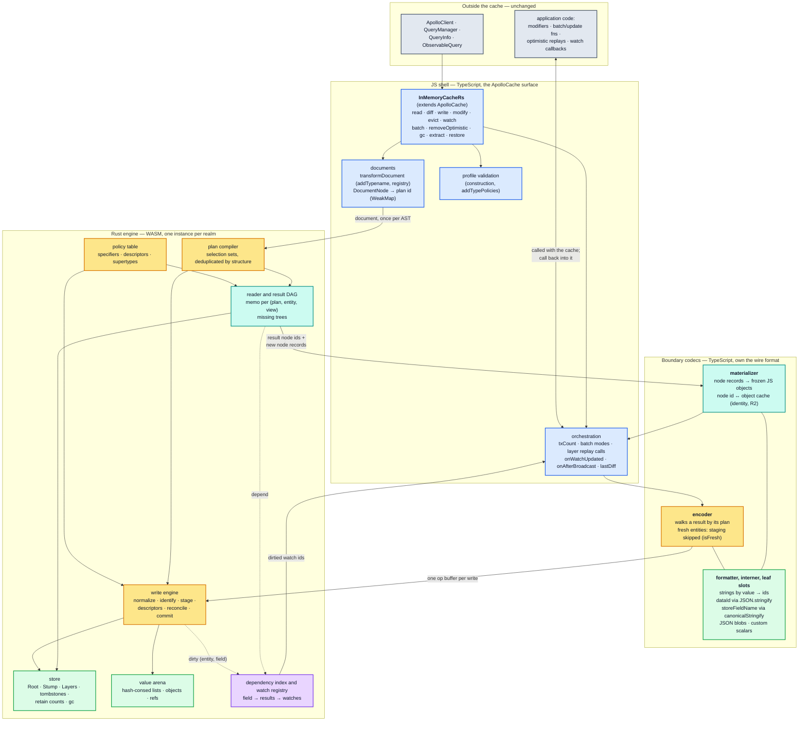
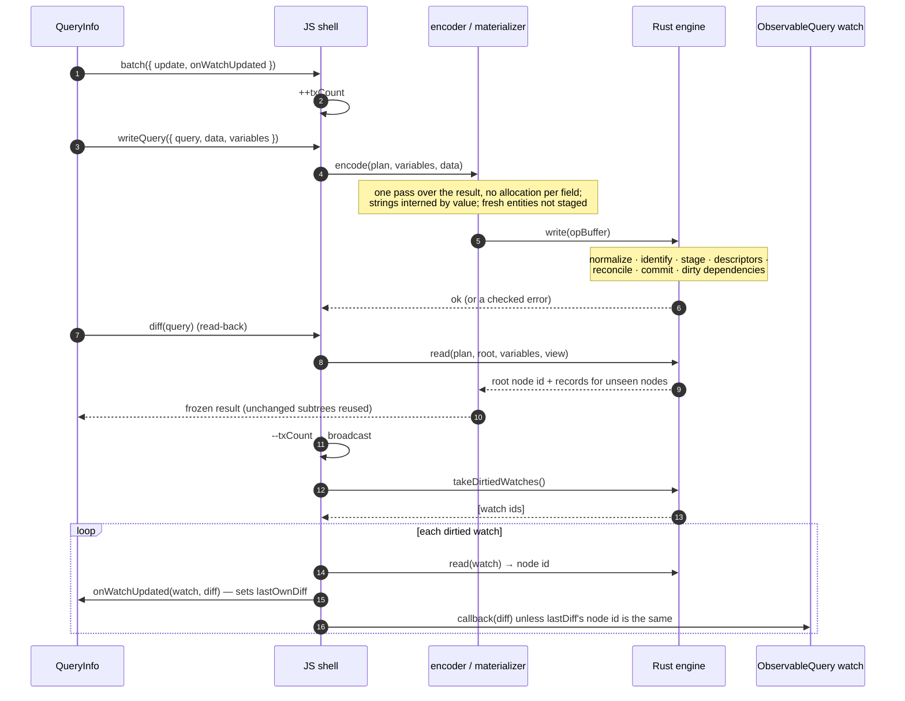

# Declarative policies, and a Rust engine that owns the store, the write, the read and invalidation

`InMemoryCacheRs` accepts only **declarative** cache configuration: `keyFields` and
`keyArgs` as specifier arrays or `false`, `possibleTypes` as a plain map, and `merge` (and a
few `read` behaviours) chosen from a **closed set of descriptors the cache defines**. It
rejects JavaScript functions in policies, at construction, with an error that names each
one. In exchange, no policy code runs inside a read or a write, and Rust never calls
JavaScript. That removes the constraint
that shaped [ADR 0001](0001-js-rust-wasm-boundary.md): the store, the write engine, the
reader, the result memo and invalidation all move into Rust. JavaScript keeps the
`ApolloCache` API, the operation-level callbacks that API defines (modifiers, `update`
functions, watch callbacks), and two thin codecs that cross the boundary in bulk.

This record amends ADR 0001 (the boundary, contracts 2, 4–6, the migration order and V0)
and [ADR 0002](0002-compatibility-target.md) (tier 2). It leaves
[ADR 0003](0003-wasm-initialization.md) unchanged. Nothing below has been
measured yet, and every performance statement is a hypothesis that the
[experiments and gates](#migration-order-and-gates) decide. It was revised after an
adversarial review on 2026-09-26 and accepted on 2026-09-27;
[that section](#review-of-2026-09-26) lists what the review changed, what the maintainer
decided, and what acceptance does not establish.

## Context

The maintainer's premise (2026-09-26): this cache is for write-heavy applications that
want performance more than flexibility. Giving up custom `read` functions, custom `merge`
functions and function-valued `keyFields`/`keyArgs` is worth it if the rest of the mental
model stays close to `InMemoryCache`. The constraints are stated to adopters up front.

ADR 0001 and ADR 0002 assumed the opposite. They put every user-authored function in tier 2,
so they had to let user code run in the middle of reads and writes, and that one
assumption forced most of ADR 0001:

| ADR 0001 decision | Forced by |
| --- | --- |
| the reader, the read memo and every `optimism` dependency stay in JS (A4) | dependency capture is ambient: user `read` functions and reactive variables register dependencies from inside the memoized read (F14) |
| policy `storage` stays in JS (F16) | `read` and `merge` functions use it (so do modifiers, which stay: section 3) |
| a resumable write engine that flushes a dirty report before every callout (contracts 4–6) | `merge`, `keyFields` and `keyArgs` functions run mid-write, can read the cache and can throw (F6, F12, F15) |
| stored values as JS *slots* (A2), and stored-value identity (contract 2) | user functions and Apollo's `StoreReader` see JS identity (F3, F8) |
| V0: a Rust store under Apollo's reader and writer | the reader and writer could not move while they run user code |

**Where the time goes** ([Apollo performance Part 1](../research/performance/01-cost-model.md)), for a list
of 5 000 entities: a cold write takes 83.41 ms and a write of an identical payload 75.95 ms,
against 3.8 µs for a warm read. For a fresh payload a write has no "nothing changed" fast
path. Around every write sit the costs of reacting to it: a re-read after one dirty field
(19.53 ms), a broadcast to 200 watchers of one document (95.99 ms), and the
same broadcast when those watchers use separately parsed documents (7.42 s,
[§4.5](../research/performance/04-dependency-graph-and-broadcast.md#45-memo-fragmentation-by-document-identity)).
A write-heavy application pays some of them on most writes, not all of them on every one:
an identical rewrite dirties nothing, an unrelated write wakes no watcher, and a batch shares
one broadcast. So the experiments measure real write, read-back and broadcast sequences on a
declared workload rather than adding these numbers up. Apollo's reader stays in JS under
ADR 0001, so ADR 0001 could only reach the first.

**What the premise costs in tests.** By a pattern count over `src/__tests__`, 46 of the 266
`it(` call sites (Jest runs 316 tests) configure a `read`, `merge`, `keyFields` or `keyArgs`
function, a custom `dataIdFromObject`, a pagination helper or a reactive variable. The count
is provisional: the step 2 inventory classifies every test. Those tests are not converted or
deleted; they stay as the untouched oracle ([Compatibility](#compatibility-amends-adr-0002)).
Five suites (`diffAgainstStore`, `readFromStore`, `writeToStore`, `roundtrip`,
`recordingCache`) drive Apollo's `StoreReader` and `StoreWriter` directly, so they need
twins that go through the public API before this engine can be judged by them. The
performance probe's sections 1–13 use no
policy functions, so ADR 0001's gates already measure the declarative workload. Two
behaviour-probe sections depend on functions: 10 (a concat `merge`) and 11 (`read`
functions, a reactive variable, a cache redirect).

## Decision

### 1. The declarative profile

An Apollo configuration that uses only the "accepted" column runs on `InMemoryCacheRs`
unchanged.

| Option | Accepted | Rejected at construction |
| --- | --- | --- |
| `typePolicies[T].keyFields` | `KeySpecifier` array, `false` | functions |
| `typePolicies[T].fields[f].keyArgs` | `KeySpecifier` array (`@directive` and `$variable` paths included), `false` | functions |
| `typePolicies[T].fields[f].merge`, `typePolicies[T].merge` | `true`, `false`, a [merge descriptor](#2-the-descriptor-vocabulary) | functions |
| `typePolicies[T].fields[f].read` | a [read descriptor](#2-the-descriptor-vocabulary) | functions |
| `typePolicies[T].queryType` / `mutationType` / `subscriptionType` | as Apollo | — |
| `possibleTypes` | exact type names | pattern entries (fuzzy subtypes, [Apollo architecture §3.6](../research/architecture/03-policies.md#36-fragmentmatches--type-condition-resolution)): any entry that is not a plain type name, which Apollo would compile into a `RegExp` (decided by the maintainer; [review](#review-of-2026-09-26)) |
| `dataIdFromObject` | — (the default `__typename:id` / `_id` behaviour is built in) | any value (confirmed by the maintainer in the review) |
| `fragments` (fragment registry) | as Apollo | — |
| `resultCaching` | `true`, which is Apollo's default and the only mode | `false`: result caching is always on, and the option is not in `InMemoryCacheRsConfig` |
| `cache.policies.addTypePolicies` / `addPossibleTypes` | the same accepted shapes, validated the same way, the whole argument before any of it applies | the same rejected shapes; nothing from a rejected call is applied |
| the rest of `cache.policies` | `identify` (Apollo's signature and its `[id, keyObject]` result) and `fragmentMatches(fragment, typename)` | every other member: Apollo's reader, writer and store call them, and applications use `cache.identify()`, `cache.fragmentMatches()`, `cache.evict()` and `cache.modify()` instead (decided by the maintainer, 2026-09-27) |
| values written into the cache | passive data: JSON values and plain `Date`s | nothing is rejected, since checking a Proxy runs its traps; class instances other than `Date`, getters, Proxies and custom coercion are documented as unsupported ([contract 2](#4-the-contracts)) |

`InMemoryCacheRsConfig` is our own type, so the rejected shapes are compile errors for
TypeScript users. For JavaScript users, the constructor and `addTypePolicies` **throw**
(decided by the maintainer; there is no warn-and-ignore mode). The error names every
offending path (`typePolicies.Query.fields.feed.merge`) and links the migration guide. The
profile ships at [step 2](#migration-order-and-gates), after E10 and E11 have been measured,
so adopters can check their configuration before the engine exists.

A subtype's policy is built from its supertypes' the first time it is used, and later
changes to a supertype do not reach it, as in Apollo (`cache/inmemory/policies.ts:649-669`).
The Rust policy table keeps that first-use snapshot rather than compiling policies eagerly.

**Why `resultCaching: false` goes.** In Apollo it is a debugging tool: it makes a warm read
about 9 600× slower and a write about 14 % cheaper
([Apollo performance §3.1](../research/performance/03-read-path.md#31-the-memo-graph-is-the-read-path)).
Supporting it would mean a second read path with no memo and no dependency index, a second
set of rules for when the Root keeps `undefined` (F9), and a watch loop that recomputes
every watch. That is complexity on the boundary for a mode nobody should ship. `true` is
accepted as a no-op so that existing configurations that spell out the default still work.

### 2. The descriptor vocabulary

Users pick behaviours by name from a closed set that the cache implements in Rust. The
maintainer's direction (2026-09-26) is to cover as many real policies as possible this way.
The catalogue below comes from three sources:

- Apollo's caching and state-management guides
  (`apollo-client-sm/.claude/skills/apollo-client/references/caching.md`,
  `state-management.md`);
- Apollo's pagination helpers (`utilities/policies/pagination.ts`);
- the 43 `read` and `merge` functions in Apollo's own policy tests
  (`cache/inmemory/__tests__/policies.ts`).

Every descriptor reproduces the Apollo helper or idiom it replaces exactly, and ships with
twins of the Apollo tests that exercise that idiom: the same scenario and assertions, with
Apollo's own helper on the `InMemoryCache` side and the descriptor on ours, never one
implementation on both sides. The originals stay as they are. The twins' cases are derived
branch by branch from the helper's source (for `offsetLimitPagination`: no `args`, a
default offset, the `keyArgs` parameter). The spelling is
settled in step 2 ([open question 1](#open-questions-for-the-maintainer)). The semantics
are what this record fixes.

**Merge descriptors** (`merge:` on a field policy, or on a type policy where Apollo allows
it):

| Descriptor | Replaces | Semantics source |
| --- | --- | --- |
| `true` | `merge: true` (`mergeObjects`) | `mergeTrueFn`, `makeMergeObjectsFunction` (`cache/inmemory/policies.ts`) |
| `false` | `merge: false`: replace, and no data-loss warning | `mergeFalseFn` (the same file) |
| `{ list: "append" }` | `concatPagination()`, and `[...existing, ...incoming]` | `utilities/policies/pagination.ts`; `policies.ts` tests (756, 2094, 4483, 5772) |
| `{ list: "prepend" }` | `[...incoming, ...existing]` (newest first) | caching guide, `notifications` |
| `{ list: "append" \| "prepend", dedupe: "ref" }` | appending only references not already present | `policies.ts` tests (2870, 4930) |
| `{ list: "append" \| "prepend", dedupe: { by: KeySpecifier } }` | appending only items whose key is new | `policies.ts` test (2615, deduplication by `isbn`) |
| `{ list: "offset", offsetArg?: "offset" }` | `offsetLimitPagination()`: splice `incoming` at `args[offsetArg]`, leaving holes before it; with no `args`, append | `utilities/policies/pagination.ts`; the helper's comment invites renaming the argument, hence `offsetArg` |
| `{ ...a list descriptor, path: "items" }` | a list inside a wrapper object: `{ ...incoming, items: [...existing.items, ...incoming.items] }` | caching guide, `posts` |
| `{ connection: "relay" }` | `relayStylePagination()`, a paired read and merge | `utilities/policies/pagination.ts`, `utilities/policies/__tests__/relayStylePagination.test.ts` |
| `{ keep: "existing" }` | first write wins: `existing ?? incoming` | `policies.ts` test (6157) |
| `{ keepExistingWhen: { equal: [fieldNames] } }` | the version guard: keep the stored value when the named fields are unchanged | [Apollo performance §7.4](../research/performance/07-structural-stress.md#74-the-untyped-blob-pathology); the only descriptor with no Apollo helper |

**Read descriptors** (`read:`):

| Descriptor | Replaces | Semantics source |
| --- | --- | --- |
| `{ default: <JSON value> }` | `read(existing = value)`: a value when the field is missing | caching guide, `role` |
| `{ redirect: { typename, keyArgs: { keyField: argName } }, when?: "always" \| "missing" }` | the cache redirect, `toReference({ __typename, id: args.id })`; `"missing"` is the `existing \|\| toReference(...)` form | [Apollo architecture §3.4](../research/architecture/03-policies.md#34-readfield--the-field-read-entry-point); `policies.ts` test (4648); probe section 11 |
| `{ list: "slice", offsetArg?: "offset", limitArg?: "limit" }` | reading one page out of an offset-merged list | caching guide, custom pagination; `policies.ts` test (3385) |
| `{ list: "sort", by: KeySpecifier, order?: "asc" \| "desc" }` | sorting a list by a field of its items on read | `policies.ts` test (2634) |
| `{ connection: "relay" }` | the read half of `relayStylePagination()`: drop unreadable edges, derive `pageInfo` | `utilities/policies/pagination.ts` |

Lists always drop references to missing entities on read, as Apollo's reader does (R4), so
that needs no descriptor.

**Rules.**
- Pagination and connection descriptors default `keyArgs` to `false`, as the helpers do.
- A field with both a read and a merge descriptor counts as defining both, so the implicit
  `keyArgs: false` of
  [Apollo architecture §3.3](../research/architecture/03-policies.md#keyargs-specifiers) applies.
- A read and a merge descriptor on one field must agree on their list mode (`offset` with
  `slice`, `relay` with `relay`); validation rejects other pairs.
- A list keeps holes distinct from `null` and `undefined`. `offsetLimitPagination` at
  offset 2 stores two holes, which a read skips; after a JSON `extract()`/`restore()` the
  holes are `null`s and read as `null` (review, #16). `extract()` emits the holes as holes.
- The set grows by amending this record, one descriptor at a time, each with the Apollo
  tests it mirrors. Candidates are logged as adopters report policies the catalogue
  cannot express, through a descriptor request
  (`.github/ISSUE_TEMPLATE/descriptor-request.yml`); a candidate qualifies when it is an
  idiom other applications share, not one application's logic.

**What stays out, and where it goes instead.** These policies compute or transform values
with arbitrary code, and no closed vocabulary covers them without becoming a programming
language:

| Policy | Example | Migration |
| --- | --- | --- |
| computed fields | `fullName` from `firstName` and `lastName` (caching guide) | `@client` fields resolved by `LocalState` resolvers, which receive the parent object (`local-state/LocalState.ts`), or a selector in the component |
| fields backed by reactive variables | `isInCart` from `cartItemsVar()` (state-management guide) | `useReactiveVar` in the component, or local state written into the cache with `writeQuery` and read with `@client` |
| value transforms on read | `new Date(existing)`, `toLowerCase()` (caching guide, `policies.ts` tests) | parse scalars in a link or in the component |
| value transforms on write | unit conversion by argument, case normalization (`policies.ts` tests 554, 5695) | normalize in a link, or on the server |
| accumulating numbers, `storage`-backed state | `existing + incoming`, `storage.jobName` (`policies.ts` tests 2105, 2462) | state outside the cache |

### 3. The boundary

```mermaid
flowchart TB
    subgraph outside["Outside the cache — unchanged"]
        AC["ApolloClient · QueryManager ·<br/>QueryInfo · ObservableQuery"]:::ext
        APP["application code:<br/>modifiers · batch/update fns ·<br/>optimistic replays · watch callbacks"]:::ext
    end

    subgraph shell["JS shell — TypeScript, the ApolloCache surface"]
        API["<b>InMemoryCacheRs</b> (extends ApolloCache)<br/>read · diff · write · modify · evict · watch<br/>batch · removeOptimistic · gc · extract · restore"]:::api
        ORCH["orchestration<br/>txCount · batch modes · layer replay calls<br/>onWatchUpdated · onAfterBroadcast · lastDiff"]:::api
        DOC["documents<br/>transformDocument (addTypename, registry)<br/>DocumentNode → plan id (WeakMap)"]:::api
        VAL["profile validation<br/>(construction, addTypePolicies)"]:::api
    end

    subgraph codecs["Boundary codecs — TypeScript, own the wire format"]
        ENC["<b>encoder</b><br/>walks a result by its plan<br/>fresh entities: staging skipped (isFresh)"]:::write
        MAT["<b>materializer</b><br/>node records → frozen JS objects<br/>node id ↔ object cache (identity, R2)"]:::read
        FMT["<b>formatter, interner, leaf slots</b><br/>strings by value → ids<br/>dataId via JSON.stringify<br/>storeFieldName via canonicalStringify<br/>JSON blobs · custom scalars"]:::store
    end

    subgraph rust["Rust engine — WASM, one instance per realm"]
        POL["policy table<br/>specifiers · descriptors · supertypes"]:::write
        PLAN["plan compiler<br/>selection sets, deduplicated by structure"]:::write
        WR["write engine<br/>normalize · identify · stage ·<br/>descriptors · reconcile · commit"]:::write
        ST["store<br/>Root · Stump · Layers · tombstones ·<br/>retain counts · gc"]:::store
        VAL2["value arena<br/>hash-consed lists · objects · refs"]:::store
        RD["reader and result DAG<br/>memo per (plan, entity, view)<br/>missing trees"]:::read
        DEP["dependency index and watch registry<br/>field → results → watches"]:::memo
    end

    AC --> API
    APP <-->|"called with the cache;<br/>call back into it"| ORCH
    API --> ORCH
    API --> DOC
    API --> VAL
    DOC -->|"document, once per AST"| PLAN
    ORCH --> ENC
    ENC -->|"one op buffer per write"| WR
    ENC --- FMT
    MAT --- FMT
    WR --> ST
    WR --> VAL2
    WR -.->|"dirty (entity, field)"| DEP
    RD --> ST
    RD -.->|"depend"| DEP
    POL --> WR
    POL --> RD
    PLAN --> WR
    PLAN --> RD
    DEP -->|"dirtied watch ids"| ORCH
    RD -->|"result node ids +<br/>new node records"| MAT
    MAT --> ORCH

    classDef api fill:#dbeafe,stroke:#2563eb,stroke-width:2px,color:#0f172a
    classDef read fill:#ccfbf1,stroke:#0d9488,stroke-width:2px,color:#0f172a
    classDef write fill:#fde68a,stroke:#d97706,stroke-width:2px,color:#0f172a
    classDef store fill:#dcfce7,stroke:#16a34a,stroke-width:2px,color:#0f172a
    classDef memo fill:#e9d5ff,stroke:#7c3aed,stroke-width:2px,color:#0f172a
    classDef ext fill:#e2e8f0,stroke:#475569,stroke-width:2px,color:#0f172a
```

Colours follow the [architecture legend](../research/architecture/README.md#diagram-legend). Solid
arrows are synchronous calls or data hand-offs; dotted arrows are dependency registration
and invalidation. Every arrow into the Rust engine is a call from JS, and every arrow out of
it is a return value: Rust calls nothing.

| Stays in JS | Crosses (bulk, per operation) | Rust owns |
| --- | --- | --- |
| the `ApolloCache` surface, `txCount`, `batch` modes, `onWatchUpdated`, `onAfterBroadcast` | a write's op buffer, in | the normalized store, layers, snapshots, tombstones, retain counts, gc |
| modifiers, `update` and replay functions, watch callbacks: operation-level user code, run by JS between Rust calls; policy `storage`, which modifiers receive | new result node records and dirtied watch ids, out | entity ids (formatted by the encoder, contract 5), staging, descriptors, reconciliation, dirtying |
| document transforms and the fragment registry | a compiled document, once per AST | plans, the result memo, missing trees, the dependency index, the watch registry |
| string, `dataId` and `storeFieldName` formatting and interning; leaf slots (JSON blobs, custom scalars) | ids, not bytes | hash-consed stored values; result nodes, stable per memo entry |
| development-only work: freezing results, printing warnings Rust returns | | |

### 4. The contracts

These replace ADR 0001's contracts 2, 4, 5 and 6 and restate the rest.

1. **One store (C1, kept).** The Rust store is the only authoritative copy. The JS
   materialization cache is disposable: dropping any entry costs a re-materialization from
   Rust's nodes, never a re-read of the store and never a wrong answer.
2. **Rust calls no JavaScript.** The module imports nothing on any cache path. Every
   exported operation runs to completion and returns. Operation-level user code runs in the
   JS shell, between Rust calls, as it does in Apollo
   ([Apollo architecture §6.4](../research/architecture/06-reactivity.md#64-batch--the-transactional-api),
   §2.7, §2.10). With no callouts, ADR 0001's resumable engine, continuations and
   per-callout flushes (contracts 5 and 6) have nothing left to do.

   **Application code can still run inside a write.** Rust stages a write, JS compares the
   stored leaf values that changed with `@wry/equality` (section 5, leaf slots), and Rust
   commits. That comparison runs the values' getters, `valueOf` and iterators. Apollo runs
   the same code at the same step, `storeObjectReconciler`, after the entities before it in
   the write are merged (review, #5, #7). So:
   - the supported input is passive data (section 1); values with getters, Proxies or
     custom coercion are **unsupported**, documented and not detected;
   - while a write is being encoded or compared, a cache call that mutates throws a checked
     re-entrancy error, and a read sees the store as it was before the write;
   - a throw during the comparison discards the staged write, so none of it is committed.
     The original value is rethrown, whatever it is, and watches are still broadcast in
     `finally`; a callback that throws there replaces it, as in Apollo (#10, #33).

   A supported input reaches the last point too: a JSON blob nested 10 000 levels deep
   overflows the stack in `equal()`. Apollo's production build has committed the entities
   before it by then; this design has committed none. That is a tier-3 drift of W1, and it
   gets its register entry, pinned by that deep-blob case, in the PR that implements the
   comparison. Getters and the like are not the "callbacks that read" whose mid-write
   visibility ADR 0002 puts in tier 2; that tier covers policy functions (decided by the
   maintainer; [review](#review-of-2026-09-26)).
3. **Synchronous read-your-writes (F1, kept).** A write is visible to the next read in the
   same call stack, because both are synchronous calls into the same store.
4. **Bulk crossings only.** Nothing crosses per field on a hot path. A write crosses as one
   op buffer. A read crosses as result node ids plus records for nodes the JS side has not
   seen. A crossing costs about 5 ns (F20); the cost is in the data, so the data crosses as
   integers.
5. **Observable bytes are formatted in JS, once per distinct value.** `dataId`s
   (`JSON.stringify` of the key object, P2), `storeFieldName`s (`canonicalStringify`,
   [Apollo architecture §3.3](../research/architecture/03-policies.md#33-field-identity-getstorefieldname)),
   `extract()` keys and missing-field messages are built by the same JS functions Apollo
   uses. The results are interned, and Rust computes over ids. A field's `storeFieldName`
   depends on the arguments *and* on the policy of the entity's typename: under one
   selection set, typename `A` with `keyArgs: false` stores `value`, and `B` with
   `keyArgs: ["x"]` stores `value:{"x":1}` (review, #15). So a plan binds each field once
   per (field, variables, effective typename policy), and a policy change bumps a policy
   epoch. The epoch governs new bindings only: like Apollo, it does not invalidate results
   already memoized (#17). Identity is the encoder's: it holds each entity's key values
   while it walks the result, evaluates the compiled `keyFields` and formats the `dataId`,
   so Rust never sees `keyFields`. For reads, JS precomputes, when it binds a plan, a
   default binding per field plus overrides for the typenames whose policies define that
   field, so Rust never has to ask JS mid-read; a typename first met later takes the
   default. This split is a prototype candidate that E10 measures, with redirects,
   composite keys and sorting over interned strings as its cases. String values are
   interned by value in JS (`Map<string, id>`), so Rust never decodes UTF-8 on a hot path.
6. **`isFresh` survives (F3, tier 2).** The materializer records `object → (node, plan)` in
   a `WeakMap`. When the encoder meets a result object the reader handed out and that node
   is still current for (plan, entity) in the store being written, it marks the entity
   fresh, and Rust skips staging that entity's own fields, as Apollo does. Without this,
   writing back a read result through a `concat` descriptor would append the page twice
   (E1). "Current" is exact because an entity entry that recomputes gets a new node
   (contract 7).

   The encoder **still walks the subtree** below a fresh entity, because Apollo does:
   it processes the children before it tests the parent's freshness
   (`cache/inmemory/writeToStore.ts:359-369`, `:478-483`), so a child can still be
   written. Read an embedded `Item` under `keyFields: false`, switch it to
   `keyFields: ["id"]` and write the saved result back: Apollo adds `Item:{"id":1}` and
   leaves `ROOT_QUERY.item` embedded (review, #40). Skipping the walk would lose that
   write, and marking the parent stale instead would turn the field into a reference.
   Skipping descendants is an optimization that needs its own proof that nothing
   below can be written differently. An unchanged policy epoch since the read is a
   candidate condition, not a proof (#43). Until such a proof exists the encoder walks
   every descendant, and this case stays in the oracle; E10 measures the walk.
7. **Identity (R2, a performance target, ADR 0002).** The JS frontier maps each result
   node to one frozen object, so unchanged subtrees come back `===`. Below the entity
   level, a memo entry that recomputes to equal content keeps its node. An **entity-level**
   entry that recomputes always gets a new node, even when its content is equal, because
   `isFresh` tests entity-level objects and Apollo's write-back semantics depend on it
   (decided by the maintainer; [review](#review-of-2026-09-26)).
   [Section 5](#5-where-javascript-objects-live-the-frontier) has the mechanism and every
   case.
8. **Invalidation is Rust's (replaces contract 4).** Reads register dependencies on
   `(entity, storeFieldName)` and `__exists` in Rust. Writes dirty them there, with D1–D3
   and L5 as the specification. At the end of a transaction JS asks Rust which watches were
   **dirtied**. That set, not "changed", is what gate 1 and `onWatchUpdated` need (D7,
   [§9.3](../research/architecture/09-invariants-and-checklist.md#93-cross-boundary-requirements)).
   Propagation stops at the first ancestor that is already dirty, so dirtying a leaf at
   depth `D` costs `O(D)`. `optimism`'s `O(D²)` is elsewhere: in the *re-read*, where each
   clean child reports up through every ancestor that is only dirty by a child
   ([Apollo performance §3.3](../research/performance/03-read-path.md#33-invalidation-blast-radius--the-single-most-important-read-path-concept)).
   The Rust reader is designed without a "dirty by a child" state to report through, so
   that its re-read is `O(D)`; E11 measures the re-read at `D` = 64 to 512, not only the dirtying (review,
   #23).
9. **The equality gate (D5, kept).** The same root node id means equal, and the callback is
   skipped in `O(1)`. Different ids mean "compare": the gate runs `equal()` on the two
   materialized results, which is cheap because unchanged children are `===` and
   `@wry/equality` checks `===` before walking (`check`, `lib/index.js`, 0.5.7). A node id
   is a sufficient test for equality, never a necessary one, so it can skip work but can
   never suppress a callback that `equal()` would allow. When `lastDiff` was cleared (gate
   0 in
   [Apollo architecture §8.2](../research/architecture/08-client-pipeline.md#82-observablequery--the-caches-principal-client))
   the callback fires, as in Apollo. "Same id" is sound only because node ids are never
   reused: they count up from 0, cross as `f64` (exact to 2⁵³), and running out raises a
   checked error rather than wrapping. A freed node's id can therefore outlive it in a
   `lastDiff` or the `isFresh` map without ever matching a new node. The
   `diff` object passed to `onWatchUpdated` is the one passed to the callback
   (`lastOwnDiff`), and `evict`, `modify` and `reset` stay instance-assignable
   ([§9.3](../research/architecture/09-invariants-and-checklist.md#93-cross-boundary-requirements)).
10. **State model (ADR 0001 contract 3, kept).** Absent, tombstone and snapshot per level;
    Present fields that may hold `undefined` (in the Root only transiently, since
    `resultCaching` is always on); reconciliation under `@wry/equality` rules (`-0` equals
    `0`, `NaN` equals `NaN`) and dirtying by `!==`. Own-property presence, stored-value
    identity, reconciliation equality and invalidation stay four separate contracts.
    Interning must not collapse them, so each stored-value node has two keys:
    - a **representation id**, by `Object.is`: `-0` and `+0` are different values, and
      each field keeps the sign it was written with, as in Apollo (review, #29);
    - an **equivalence id**, with `-0` read as `0` and one canonical `NaN`: equal
      equivalence ids mean reconciliation keeps the existing value, in `O(1)`.

    Dirtying stays `!==` on the field's stored value. So a scalar `NaN` rewrite dirties,
    while a list holding a `NaN` is kept by reference and does not (#37). The `O(1)` claim
    covers interned structures only: leaf slots still compare in JS.
11. **Leaf values without a selection set are JS slots** (F5): custom scalars and JSON
    blobs, as [section 5](#5-where-javascript-objects-live-the-frontier) explains.
12. **Panic-free, one instance (ADR 0001 F15 and F19, kept).** Checked inputs and
    `Result`s, an audit and tests. A trap poisons every cache in the realm. That is a
    deliberate, conservative policy (an abort skips destructors in the shared allocator and
    interner), not something ADR 0001's E7 showed: there, another object still worked. A
    trap is recognized by a poisoned flag the shell sets around its own Rust calls, never
    by the error's class, since user code can throw a `WebAssembly.RuntimeError` too (#33).
13. **Wasm memory views are re-acquired after every call** that can grow memory (F13).
14. **Ownership and disposal.** Every table belongs to one cache handle; nothing is shared
    between caches, although they share the WASM instance. Every holder of an id is
    counted: store values, result nodes and parents, compiled plans, materialization
    records, and a staged write while JS compares its slots. Slot and string ids that are
    reused carry a generation, so a stale JS lookup can never alias a new value. A cache's
    tables are freed by `cache[Symbol.dispose]()` (decided by the maintainer, v2), with a
    `FinalizationRegistry` as a fallback only: JavaScript may run finalizers late or never,
    and a server that builds a cache per request would otherwise leak WASM memory.
    [Section 7](#7-memory) has the requirements.

### 5. Where JavaScript objects live: the frontier

Object identity is observable in a few places: read results (R2, React snapshots, memoized
children), write-backs (F3), leaf values the application wrote, and values handed to
modifiers. The design keeps a JS object exactly where identity is observable, and Rust holds
everything else as ids. The JS side of that split is the **frontier**. It has three parts,
all owned by the codecs:

| Part | Holds | Filled |
| --- | --- | --- |
| **result objects** | `node id → frozen object` for results the cache handed out, and `object → node` (`WeakMap`) for `isFresh` | lazily, by the read that needs them |
| **leaf slots** | values stored without a selection set: JSON blobs and custom scalars, kept as the object the application wrote | by the write that stores them |
| **interned strings** | `string ↔ id`, by value | by the encoder and the formatter |

Rust holds entities, fields, lists, references, embedded objects that have a selection
set, numbers, booleans, `null`, and ids into the frontier.

**The frontier is updated synchronously, and lazily.** It changes only inside the cache
call that needs it: a write fills leaf slots and strings; a read, `diff` or broadcast
materializes the result nodes it is about to return, and only the nodes that are new.
Nothing is materialized ahead of a read. A batch of 100 writes followed by one broadcast
materializes once, which is the saving `batch` exists for
([Apollo performance §4.6](../research/performance/04-dependency-graph-and-broadcast.md#46-batching)).

**Result nodes are stable per memo entry, not hash-consed globally.** A result node
belongs to one memo entry, (plan, entity or embedded parent, view). When an entry *below
the entity level* recomputes, Rust compares its new content with its previous content
shallowly: scalars by id, children by node id. If they are equal, the entry keeps its old
node, and nothing above it changes. An entity-level entry always gets a new node when it
recomputes ([contract 7](#4-the-contracts)). `optimism` has this short-circuit (`reportCleanChild`,
[Apollo architecture §1.1](../research/architecture/01-foundations.md#entry--the-dependency-graph)), but
Apollo can almost never use it, because `execSelectionSetImpl` builds a new object on
every run. Two things are deliberately not shared:

- equal embedded objects in two places of one result, or in two results;
- optimistic and root reads of the same data.

Global hash-consing would make each of those one object. Nobody observes that as a gain,
it changes identity in ways Apollo never does, and it would make the `isFresh` map
ambiguous about which entity an object came from. Stored *values*, which nobody sees as
objects, are still hash-consed (A6): that is what makes reconciliation `O(1)`.

**Lifetime: pinned plus LRU** (decided by the maintainer, 2026-09-26). The frontier holds an
object for as long as someone can still compare against it. Every node reachable from a
watch's current `lastDiff` is pinned, because Rust keeps a reachability count from watch
roots. The pin follows the cache's own record of what it last delivered to each watch, and
is released at the next broadcast or when the watch is removed: `ObservableQuery` clears
`watch.lastDiff` itself (`core/ObservableQuery.ts:684`), so the watch object's field is not
a reliable signal. A pin is a performance measure only. `evict` and `gc` may free a pinned
node's record; its id stays valid for comparison because ids are never reused
(contract 9). Other nodes live in a bounded LRU, which is the guarantee Apollo gives. A `WeakRef`
variant was considered: it keeps identity exactly as long as any object holds the result,
at the cost of one `WeakRef` per node and garbage-collector-driven releases of Rust nodes.
It stays available if the memory probe shows the LRU evicting objects that are still held.
Dropping a frontier entry is always safe. The next read re-materializes the node from Rust, with the
same content and a new object, which is what Apollo does after an LRU eviction.

**Leaf slots.** A JSON blob or custom scalar is stored as the application's own object,
so a read returns that object, as Apollo does in production
([Apollo architecture §4.4](../research/architecture/04-store-writer.md#44-processfieldvalue--scalars-arrays-recursion)),
and a `Date` keeps its identity (F5). Rust stores the slot id. When a write meets a slot
field that is already stored:

- the same object (`===`) is unchanged, and nothing crosses;
- otherwise the write is two-phase. Rust stages it and returns the slot pairs that need
  `equal()`. JS compares them, then calls commit with the answers. JS drives both calls,
  so Rust still calls no JavaScript. The comparison can run application code, and
  [contract 2](#4-the-contracts) says what that code may do and what a throw leaves. E10
  measures comparing all pairs in one pass against Apollo's order (one entity at a time,
  each committed before the next), because polling hands every blob over as a new object.

Interning blobs in Rust instead was rejected. It costs `O(B)` on every write (encode and
hash), where `equal()` stops at the first difference. It doubles the blob's memory. And it
loses the written object's identity. A descriptor that looks inside a blob
(`keepExistingWhenEqual`) gets the named fields extracted by the encoder, which already
holds the object.

**Values handed to user code.** Modifiers, `readField` inside modifiers, and `extract()`
receive materialized store values through a value cache keyed by **occurrence**: the level
that owns the value, the entity, the `storeFieldName` and the field's version. It is never
keyed by value id alone. Apollo hands two equal lists stored on two entities over as two
arrays with two sets of references, and one occurrence as the same array across `modify`
calls and through `readField` (review, #11, #12); a Layer that inherits an unchanged Root
value shares the Root's occurrence. A modifier that returns the value it received returns
an object `===` to what was passed, so nothing changes, as in Apollo. A modifier that
returns an equal copy is encoded, gets the same value id, and dirties nothing, as
`storeObjectReconciler` does, yet `modify` still returns `true`, as Apollo's does: the
return value, equality and dirtying are separate.

These values are **frozen in every build** (decided by the maintainer). Apollo freezes them
only in development; in production a modifier that pushes onto the array it received
changes Apollo's store in place, with no broadcast. Here the store is in Rust, so the same
push would change only the cached JS copy, and the copy would disagree with the store.
Freezing turns that into a `TypeError`, which is what correct applications already never
meet, since Apollo's development build throws the same way. Leaf slots are never frozen:
they are the application's own objects. The PR that implements this adds the register
entry for the production difference.

#### Every identity case

| # | Case | `InMemoryCache` | This design |
| --- | --- | --- | --- |
| 1 | warm re-read, nothing written | the same root object (R2) | the same node, the same object |
| 2 | one field of one item in a list of `N` changes | new root, list and item; `N − 1` items `===` | the same; the new list is built from `N` cached children, `O(N)` as in Apollo |
| 3 | an identical payload is rewritten (polling) | nothing dirtied; the same objects | equal value ids; nothing dirtied; nothing materialized |
| 4 | `INVALIDATE`, or a field `evict` that removes nothing | the entry recomputes into new, equal objects; the gate walks them and skips the callback | an entity entry that recomputes gets a new node, as in Apollo, so `isFresh` stays exact ([review](#review-of-2026-09-26)); embedded objects and lists below it keep their nodes when equal |
| 5 | a layer is removed and the values underneath are equal | new objects on every dirtied path | as case 4: new entity-level nodes, kept embedded nodes where the content is equal |
| 6 | a value goes A → B → A over two broadcasts | three distinct objects | three distinct objects |
| 7 | a read result is written back (F3) | `isFresh` skips staging after traversing the subtree | a `WeakMap` hit on a current node skips staging the entity; the subtree is still walked, as in Apollo ([contract 6](#4-the-contracts)) |
| 8 | a component holds a result that the memo has evicted | the next read builds a new, equal object, which can cause an extra render | pinned while any watch's `lastDiff` reaches it; otherwise the LRU, as in Apollo |
| 9 | optimistic and root reads of the same data | different objects (L2) | different objects |
| 10 | equal embedded objects in two places | two objects | two objects |
| 11 | a JSON blob is read | the object the application wrote (production) | the same object (slot) |
| 12 | a JSON blob is rewritten with an equal new object | `equal()`, `O(B)`; the old object is kept | `equal()` in JS, `O(B)`; the old slot is kept |
| 13 | a JSON blob is rewritten with the same object | skipped by `===` | skipped by `===` |
| 14 | a plain `Date` scalar | identity kept (F5) | identity kept (slot); other class instances are outside the supported input (section 1) |
| 15 | a modifier returns the value it received | no change | no change |
| 16 | `extract()` twice, no write in between | the same entity objects | the same objects while the value cache holds them (tier 3) |
| 17 | development builds | `maybeDeepFreeze` re-walks subtrees on every read ([Apollo performance §3.6](../research/performance/03-read-path.md#36-the-dev-build-tax)) | each object is frozen once, when it is materialized |

In no case does the design keep fewer objects stable than Apollo. In cases 7 and 8 it keeps
more, and in cases 4 and 5 it keeps more below the entity level; a stable object is a
skipped render. What it adds is cost: materializing
new nodes, and a JS lookup per child when a node is built. E11 measures that.

### 6. A network write, end to end

```mermaid
sequenceDiagram
    autonumber
    participant QI as QueryInfo
    participant SH as JS shell
    participant EN as encoder / materializer
    participant RS as Rust engine
    participant OQ as ObservableQuery watch

    QI->>SH: batch({ update, onWatchUpdated })
    SH->>SH: ++txCount
    QI->>SH: writeQuery({ query, data, variables })
    SH->>EN: encode(plan, variables, data)
    Note over EN: one pass over the result, no allocation per field#59;<br/>strings interned by value#59; fresh entities not staged
    EN->>RS: write(opBuffer)
    Note over RS: normalize · identify · stage · descriptors ·<br/>reconcile · commit · dirty dependencies
    RS-->>SH: ok (or a checked error)
    QI->>SH: diff(query) (read-back)
    SH->>RS: read(plan, root, variables, view)
    RS-->>EN: root node id + records for unseen nodes
    EN-->>QI: frozen result (unchanged subtrees reused)
    SH->>SH: --txCount → broadcast
    SH->>RS: takeDirtiedWatches()
    RS-->>SH: [watch ids]
    loop each dirtied watch
        SH->>RS: read(watch) → node id
        SH->>QI: onWatchUpdated(watch, diff) — sets lastOwnDiff
        SH->>OQ: callback(diff) unless lastDiff's node id is the same
    end
```

### 7. Memory

The [memory probe](../probes/cache-memory-probe.mjs) measures Apollo's `InMemoryCache`
([Apollo performance Part 10](../research/performance/10-memory.md)). Six results shape this design:

| Apollo, measured | This design |
| --- | --- |
| The store costs 662 B per entity; the root read's memo 4 366 B; a watched query's second memo set and last result another 4 774 B. Result caching is almost 14 times the store. | Result nodes are records of ids in Rust, and dependencies are `(entity, field)` integer pairs, not a key string and a `Set` per field. The frontier holds JS objects only for results that were handed out (section 5). |
| A cold write of 5 000 entities allocates 92 MiB and keeps 3 MiB of it. | The encoder writes into a reused op buffer, with no allocation per field. The engine stages into arenas that the next write reuses. |
| Memo bounds count entries, not bytes: a rolling window grows by about 97 KiB per page, and distinct documents by about 714 KiB each, until the entry limits. | The result memo is bounded in bytes, and a result that references an evicted or collected entity is released with it. |
| Evict plus `gc()` leaves 21 of 46 MiB, because dirty entries keep their last results. | `evict` and `gc` release the result nodes that depend on what they remove. |
| A watched query pays for two memo sets, even with no optimistic layer. | Step 4 builds the optimistic set from the root set's content when no layer shadows the data. |
| Layers and watch churn return their memory. | Kept: the probe's checks pin it. |

**What this design adds, and must bound.**
- **WASM linear memory never shrinks.** Its high-water mark is a cost the application
  keeps, so the probe checks that a second cache reuses it, and CI reports it.
- **The interned strings and the value arena grow with everything ever written, unless
  they are reclaimed.** Both are reference-counted, and entries are freed when their last
  store value, result node or frontier object goes. The probe's plateau checks exist to
  catch a table that only grows.
- **The frontier** is pinned plus an LRU (section 5), and the LRU is bounded in bytes.
- **A dropped cache must give its WASM memory back.** JavaScript's garbage collector cannot
  see inside WASM memory, and a `FinalizationRegistry` callback may run late or never. Left
  to the finalizer alone, a server that builds a cache per request, or a test suite that
  builds thousands, leaks. So (contract 14, maintainer's decision, v2):
  - `cache[Symbol.dispose]()` frees every table of that cache's handle at once, so
    `using cache = new InMemoryCacheRs()` works. It is idempotent, and any later call on
    the cache throws a checked "disposed" error rather than touching freed memory.
  - The finalizer stays as a fallback for caches nobody disposes.
  - `ApolloClient` never disposes its cache (`stop()` and `clearStore()` do not), so the
    migration guide and the SSR guide say who calls it.
  - The memory probe checks, deterministically, that building and disposing many caches
    returns the WASM heap in use to its baseline, and reports what is left to the
    finalizer path separately. This check is a release blocker, not a guidepost.

**Measuring it** (review, #27–#30). The memory probe reports three separate quantities:
bytes in use, allocation traffic, and physical reservation (linear memory's high-water mark,
and RSS). A build that cannot report one says "unavailable", never zero. Allocation traffic
is defined before it is compared with V8's: a `realloc` that moves counts its new size.
Settling reports whether it converged, and a run that did not is invalid. Steady workloads
run at two lengths, and the leak metric is bytes per operation across them, against a
stated budget; a single finite run cannot show a plateau.

**Memory guideposts**, like the speed ones, direct the work rather than gate it:
- **E10:** the encoder allocates at most 5 % of Apollo's write allocation for the same
  payload (4.6 MiB of 92 MiB at `N = 5 000`).
- **The slice:**
  - store plus root-read memo at most half of Apollo's per entity;
  - a watched query at most half;
  - allocation per write at most a quarter.
- **The full engine:** every memory check passes, including the three Apollo fails:
  - the rolling window plateaus;
  - document churn plateaus;
  - evict plus `gc()` returns the memory.

## Every earlier decision, revisited

| Decision | Source | Verdict | Why |
| --- | --- | --- | --- |
| No eventually consistent JS replica | ADR 0001, F1 | **kept** | read-your-writes is synchronous and client-visible |
| One authoritative store (C1) | ADR 0001 contract 1 | **kept** | the frontier is disposable except leaf slots, which the store references by id |
| All user code stays in JS | ADR 0001 boundary | **kept, narrowed** | only operation-level user code remains, and it already runs between cache calls |
| Reader, memo, `CacheGroup` and `optimism` stay in JS (A4) | ADR 0001 | **reversed** | F14's ambient capture came from `read` functions and reactive variables; without them a read's dependencies are store fields only, and Rust can record them |
| A Rust reader is parked | ADR 0001 considered options | **adopted** | the reason for parking it is gone |
| Policy `storage` in JS (F16) | ADR 0001 | **kept**, for modifiers | modifiers receive `storage` with no policy function (review, #15) |
| Values as JS slots (A2) | ADR 0001 | **narrowed** to leaf values without a selection set | F8 (Apollo's `StoreReader` keyed on stored arrays) is moot once the reader is Rust's; strings cross as ids |
| Stored-value identity (contract 2) | ADR 0001 | **replaced** by contract 7 | nothing outside the engine keys on stored objects any more |
| State model (contract 3) | ADR 0001 | **kept** | store semantics, independent of user code |
| Dirty report per boundary return (contract 4) | ADR 0001 | **replaced** by contract 8 | JS holds no dependency graph to update |
| Callout order and flushes (contract 5, F12) | ADR 0001 | **dropped** | no policy callouts; the one place application code can still run mid-write, slot comparison, is governed by contract 2 |
| Resumable engine, continuations, exception origin (contract 6) | ADR 0001 | **dropped**, except panic-free, one instance, and traps told apart by a flag rather than a class (contract 12) | no callouts |
| Hash-consing (A6) | ADR 0001 contract 7 | **kept for stored values**, with a representation id and an equivalence id (contract 10); results get stable nodes per memo entry instead | global hash-consing of results would alias objects Apollo keeps apart ([section 5](#5-where-javascript-objects-live-the-frontier)) |
| Opaque JSON scalars keep JS `equal()` | ADR 0001 contract 7 | **kept, and extended to every JSON blob** | a slot keeps the written object's identity, costs nothing to cross, and `equal()` stops at the first difference |
| `resultCaching` option | Apollo's config | **removed**; always on | a second read path for a debugging mode ([section 1](#1-the-declarative-profile)) |
| No raw-bytes ingestion (F17) | ADR 0001 | **kept** | the cache never sees bytes; the encoder reads the parsed object |
| Migration order and V0 | ADR 0001 A1, A8 | **replaced** (the maintainer, in the review) | V0 measures a per-field `store.get` boundary that this design never ships |
| V0's gates | ADR 0001 | **replaced** | [new gates](#migration-order-and-gates), same correctness bar, same probe sections |
| Worker-hosted store | ADR 0001 | **still rejected** | every API is synchronous |
| Tier 1, the client contract | ADR 0002 | **kept** | Apollo Client depends on it |
| Tier 2, the user-authored surface | ADR 0002 | **amended** | hard for the declarative profile, **unsupported** outside it ([below](#compatibility-amends-adr-0002)) |
| Tier 3 and the drift register | ADR 0002 | **kept** | the candidates stay candidates; the Rust engine makes several cheap to keep |
| `===` result stability is performance | ADR 0002 | **kept** | contract 7 matches Apollo at the entity level and keeps more below it |
| The oracle is Apollo's `InMemoryCache` | ADR 0002 | **kept** | for the declarative profile; the probes run both caches with descriptor-equivalent configuration where needed |
| Synchronous init from bundled bytes | ADR 0003 | **kept** | unaffected |
| 1 MB budget | ADR 0003 | **kept**, now binding, and split into raw module size, transfer size and first-construction time | more logic moves into Rust; formatting stays in JS partly to stay under it. ADR 0001 calls the budget gzipped and ADR 0003 does not say; nothing enforces it in CI yet (review, #31) |
| No public initializer | ADR 0003 | **kept** | unaffected |
| Phase 2 delegates to Apollo's `EntityStore`, `Policies`, `StoreReader`, `StoreWriter` | AGENTS.md | **ends** at step 5 (v2) | the patch shrinks as each import goes (AGENTS.md import rule 2) and is gone before any release |

## Compatibility (amends ADR 0002)

- **Tier 1 is unchanged.** Every row of
  [§9.3](../research/architecture/09-invariants-and-checklist.md#93-cross-boundary-requirements) and
  the invariants ADR 0002 lists hold, L2 included: optimistic and root reads keep separate
  memo entries and separate result objects ([section 5](#5-where-javascript-objects-live-the-frontier)).
- **Tier 2 holds for the declarative profile** (section 1, section 2): identity, field keys,
  descriptor semantics including how often they apply (W2–W5, F3), `possibleTypes` for
  exact names, `evict`/`gc`/`retain`, and `extract()`/`restore()` contents.
- **Outside the profile is unsupported, not drift.** Custom `read`/`merge`/`keyFields`/
  `keyArgs` functions, `dataIdFromObject`, `resultCaching: false`, and reactive variables
  *consumed by the cache* are rejected or have no effect. (A cache only consumes a reactive
  variable when a `read` function calls it, so this goes with `read` functions.) Fuzzy
  `possibleTypes` entries are rejected too (section 1). Written values with getters,
  Proxies or custom coercion are unsupported without being rejected (contract 2). `makeVar`
  itself still works with `useReactiveVar`, and `broadcastWatches` stays callable for it
  ([Apollo architecture §6.6](../research/architecture/06-reactivity.md#66-reactive-variables)).
  `resolvesClientField` returns `true` only for fields with a read descriptor. Each
  unsupported shape is an entry in
  [Unsupported features](../compatibility.md#unsupported-features), with its replacement:
  a descriptor, local state written with `writeQuery`, or `useReactiveVar`. The migration
  guide expands on them.
- **Registered drifts this design brings**, each entered with its pinning test in the PR
  that implements it: modifier values frozen in production too (section 5), and a write
  that throws during slot comparison committing nothing (contract 2).
- **The oracle** (review, #15–#22).
  - Apollo's tests are never rewritten or deleted. A test whose configuration the profile
    rejects stays byte-for-byte, in a separate Jest project checked against a committed
    list of test ids expected to fail with the profile error; any other failure, or a
    listed test that starts passing, fails CI. The list holds ids and reasons, never
    assertions.
  - Where a descriptor expresses the policy, a twin runs the same scenario and assertions,
    with Apollo's helper on the `InMemoryCache` side and the descriptor on ours.
  - Every test is inventoried: the invariant it pins, the profile it needs, the backend it
    actually reaches and the build it holds in. Changed and new tests carry the annotation
    of [src/__tests__/README.md](../../src/__tests__/README.md).
  - Reach is proved, not assumed: a static import inventory, a Jest project in which
    Apollo's store, reader, writer and policies are replaced by throwing stubs, and
    per-operation counters of Rust calls. The detector must first classify today's
    delegating code as not reaching Rust.
  - The suites run in production and development builds, which differ (review, #9).
  - Apollo's client-level suites (`refetchQueries`, `ObservableQuery`, `watchFragment`,
    optimistic mutations) run unmodified against `InMemoryCacheRs` through
    `moduleNameMapper`, with every Apollo import mapped to the one installed build and a
    startup check that it is one.
  - Seeded, shrinkable sequences of operations run against both caches.
  - The review's reproductions join the oracle, among them: write-back after `INVALIDATE`
    and a reread (#12), write-back after a policy change that normalizes a child (#40),
    warmed versus newly parsed documents after `addTypePolicies` (#17), offset holes
    through a JSON round trip (#16), `-0`/`+0` (#29), and the deep JSON blob (contract 2).
  - `probe:parity` runs sections 10 and 11 with descriptor-equivalent configuration
    against both caches, and excludes the reactive variable check.

## Migration order and gates

The experiments come first because they are cheap and they decide the design. The numbers
below are **guideposts, not commitments**: they say how far off an approach is, so that a
miss sends us to the alternatives (the `JSON.stringify` ingestion, the `WeakRef`
frontier, a different op format) rather than into engine work on a weak boundary. The
correctness bar is the one hard gate. The maintainer fixes the numbers after E10 and E11,
before the vertical slice, together with the stop conditions below. Rust-WASM is a product
constraint (maintainer), so no pure-JS engine is built as an alternative.

Two milestones name the ends of the work. **v1** is correctness: the full engine passes the
declarative oracle (step 4), and development may still delegate through the Apollo patch
until then. **v2** is releasability: production code imports no patched symbol, caches can
be disposed, and the packed package works in a clean project (step 5). Nothing is released
for production use before v2.

0. **Evidence first**, on today's code, with no engine work (review, A5–A7):
   - the benchmark comparison fails, rather than passing with a note, when the base did not
     build or a measurement is missing; a zero base is compared by absolute difference;
     each side records a fingerprint of Node, lockfile, patch, `.wasm` and probe;
   - a same-commit A/A calibration and injected-slowdown runs give the false-detection
     rate and the smallest change a benchmark can see; a local 10-run pilot found the noise
     band ranging from ±2.4 % to ±8.1 % between identical runs (#26);
   - the memory probe's fixes of [section 7](#7-memory);
   - the reach detector, the production-build run and the client-level suites of
     [the oracle](#compatibility-amends-adr-0002);
   - the synthetic workload is frozen before any implementation: polling first (cold write,
     identical rewrite, one item changed, 1 % changed, full replacement; 0, 1 and 200
     watchers, shared and separately parsed documents, batched and not), with pagination
     and optimistic updates as regression cases; sizes 100 to 20 000; payload shape,
     change rate and exclusions stated. Every result from it is labelled synthetic.
1. **Boundary experiments**, with scripts and output recorded in the next ADR revision, as
   E1–E9 were. Each is measured inside real write, read-back and broadcast sequences of the
   workload, not alone.
   - **E10, the encoder.** Encode probe section 1's `N = 5 000` payload into an op buffer:
     formatting and interning, typename-dependent field bindings (contract 5), both keys
     of every stored value (contract 10), slot comparison in one pass against Apollo's
     entity-by-entity order (contract 2), allocation, and repeated polls. Also measure the
     alternative: `JSON.stringify` plus a Rust parser, which loses contract 6 without a
     separate fresh-object pass. **Guidepost:** ≤ 10 ms, about 12 % of Apollo's 83.41 ms
     cold write.
   - **E11, the materializer.** Materialize section 2's `N = 5 000` result from node
     records, cold and after one dirty field, with entity-level minting (contract 7),
     pinning and the LRU, freezing, and the frontier's retained bytes against Apollo's
     result objects (memory probe, section 1). Also the re-read after a leaf change at
     depth 64 to 512 (contract 8). **Guideposts:** ≤ 25 ms cold (16 % of 155.23 ms),
     ≤ 1 ms after one dirty field.

   The maintainer then fixes thresholds and **stop conditions**: the codecs' share of
   Apollo's end-to-end cost on the primary sequences, and any agreed oracle case that
   could only pass by letting application code run inside a Rust call.
2. **The profile.** `InMemoryCacheRsConfig`'s declarative types, the whole-argument runtime
   validation and the migration guide, on top of today's delegation; the test inventory,
   the excluded-test list and the descriptor twins of
   [the oracle](#compatibility-amends-adr-0002). Performance does not change; adopters can
   check their configuration.
3. **The vertical slice.** Root store, write engine, reader, watch registry and the
   `concat` descriptor, behind the full JS shell, with no layers, driven by a real
   `ApolloClient` polling a query with watches and batches. The constructor initializes
   the WASM as [ADR 0003](0003-wasm-initialization.md) decides, which is not implemented
   today (review, #1). **Correctness is hard:** every ported test the slice's features
   reach, and ADR 0001's oracle cases that still apply (F3 with `concat`, F10, W1 and
   W2), pass. **Performance guideposts**, at `N = 5 000`, end to end:
   - at least 2× faster than Apollo on write cold, write identical and one field changed
     (probe section 1);
   - no section-2 read slower than Apollo's, and the warm read within 2× of 3.8 µs;
   - a broadcast to 200 watchers after a relevant write at least 2× faster (section 6);
   - the memory guideposts of [section 7](#7-memory).

   The aim beyond them is 4× on writes. Whether the main thread comes back sooner in a
   browser is measured there, as frame and long-task latency with their tails, before any
   claim about interactivity.
4. **The full engine: v1.** Layers and replay orchestration, `modify`, `evict`, `gc`,
   `retain`, `extract`/`restore`, missing trees, development warnings, the remaining
   descriptors. Hard gate: the full declarative oracle, the client-level suites and
   `probe:parity`, in both builds. Guideposts: no performance measurement slower than
   Apollo's beyond noise, no memory measurement larger, and every memory check passing.
   Then remove the imports of `EntityStore`, `Policies`, `StoreReader` and `StoreWriter`.
   Once v1 is done, the migration skill follows
   ([maintainer decisions](#maintainer-decisions)).
5. **Releasable: v2.**
   - Production code imports no symbol that `patches/@apollo+client+4.2.11.patch`
     exports, and the patch leaves the production path. Vendoring the Apollo modules is
     not a way around it: `recallCache` and `forgetCache` act on a module-private
     `WeakMap`, so a copy would never reach the application's `makeVar` variables.
   - `cache[Symbol.dispose]()` and its deterministic memory check
     ([section 7](#7-memory)). This is required, not optional: without it a
     per-request cache on a server leaks.
   - A clean project installs the packed tarball and constructs, writes, reads and watches
     with no private setup, under Node, a browser and an SSR entry. (`npm run check:pack`
     already checks that the tarball carries every file it loads.)
6. **Beyond Apollo's model.** Each of these is measured and merged on its own:
   - plans deduplicated by structure, which removes the 128× document-fragmentation cliff
     ([§4.5](../research/performance/04-dependency-graph-and-broadcast.md#45-memo-fragmentation-by-document-identity)).
     It is observable: after `addTypePolicies`, Apollo keeps a warmed document's old result
     while a newly parsed identical document reads the new one (review, #17, #18). Sharing
     one plan makes them agree, so it needs its own oracle case and a register entry;
   - result memory bounded by live results rather than a 50 000-entry LRU, which removes
     the cliff of [§4.3](../research/performance/04-dependency-graph-and-broadcast.md#43-the-memo-lru-cliff);
   - a first optimistic read with no layers active built from the root entries' content
     instead of a second cold read of the store, still with its own nodes
     ([§4.2](../research/performance/04-dependency-graph-and-broadcast.md#42-optimistic-reads-maintain-a-second-set-of-memo-entries)).

Throughout: the `.wasm` stays within its size budgets (ADR 0003), and every PR labelled
`benchmark` runs the memory probe beside the performance probe, with the same noise
control ([benchmarking.md](../benchmarking.md#memory)). The benchmark's required check
certifies that a comparison ran, not that performance is acceptable; the workflow stays as
it is for now (maintainer).

## Considered options

- **ADR 0001 as it stands: functions allowed, a hybrid engine.** Rejected under the
  premise. It keeps the resumable engine and the JS reader, and it can only reach the write
  path.
- **Pay for what you use: functions allowed, declarative fields fast.** This was the
  earlier recommendation in this conversation, and it is rejected. It keeps every
  mechanism ADR 0001 needs for callouts, and the reader stays in JS for any application
  that has one `read` function, so the broadcast and re-read costs stay where they are.
- **Fall back to Apollo's JS cache when a configuration has functions.** Rejected. That
  fallback *is* `InMemoryCache`, which such users should keep using, and it doubles what
  must be maintained and tested.
- **V0 first (ADR 0001).** Dropped. It measures a per-field `store.get` boundary under
  Apollo's reader, a boundary this design never ships. E10 and E11 retire the real
  boundary risk sooner.
- **Rust walks the JS result object itself.** Rejected. It costs a crossing per property
  and a UTF-16 → UTF-8 copy per string, the costs contract 4 exists to avoid.
- **Rust serializes results to a JSON string and JS calls `JSON.parse`.** Measured in E11
  as the alternative. It is fast to decode but rebuilds every object, which gives up
  contract 7 and with it `isFresh` and R2.
- **A JS mirror of the whole normalized store, patched by every Rust write.** Rejected.
  It would make `extract()` a shallow copy again and give modifiers stored objects
  directly, but it holds every entity twice, makes every write pay a JS patch per changed
  field (copy-on-write, because `extract()` hands the objects out), must mirror the layers
  too, and does nothing for reads: results would still be materialized, or read from the
  mirror by a JS reader, which is Apollo's cost again. The frontier mirrors only what is
  observable as an object.
- **Global hash-consing of results.** Rejected for results, kept for stored values. See
  [section 5](#5-where-javascript-objects-live-the-frontier).
- **A pure-JS engine under the same profile.** Rejected by the maintainer in the review:
  Rust-WASM is a product constraint, so it is neither built nor measured as a control.
- **JSON blobs interned in Rust.** Rejected. See
  [section 5](#5-where-javascript-objects-live-the-frontier), leaf slots.

## Consequences

- The biggest risk moves from the resumable engine to the codecs. They are the only
  per-field JS left, so E10 and E11 come before any engine work.
- The engine is larger than ADR 0001's V0. Formatting, documents and user code stay in JS,
  partly to keep the `.wasm` inside ADR 0003's budget.
- Some adopters cannot migrate, and that is by design. The guide states it up front, and
  the error at construction states it again. Fewer are left out than the rejected shapes
  suggest: most function-valued policies have a declarative form, the migration skill
  rewrites them after v1, and an idiom the catalogue lacks can be requested as a
  descriptor.
- `extract()` becomes a materialization, `O(S · F)` against Apollo's `O(S)` shallow copy,
  and `restore()` stops adopting the caller's objects by reference (tier 3). SSR hydration
  pays this once per page.
- Nothing is released before v2 ([step 5](#migration-order-and-gates)): until then the
  package depends on a development-only patch of `@apollo/client`.
- AGENTS.md's implementation-strategy section, ADR 0001 and ADR 0002 get "amended by ADR
  0004" notes, and [Unsupported features](../compatibility.md#unsupported-features) lists
  what the profile leaves out, when this record is accepted, not before.

## Review of 2026-09-26

`claude` and Codex reviewed the progress so far and this record adversarially, on a local
brainstorm board (messages cited as `#n`; the board is not committed), with the maintainer
moderating. Every finding was reproduced against `apollo-client-sm/src/` or Apollo 4.2.11
itself, and the revision above folds them in.

### Acceptance

The maintainer accepted this record on 2026-09-27, after Codex acknowledged the revision
(#43). Acceptance fixes the direction, the contracts and the order of the work. It does not
establish performance, descriptor coverage, the correctness of a Rust engine that does not
exist yet, or release readiness: E10 and E11, the reach detector, differential and
client-level coverage in both builds, and v2's clean-install and disposal gates each still
need their own evidence.

### Maintainer decisions

- **`dataIdFromObject` is rejected**, as section 1 says.
- **Fuzzy `possibleTypes` entries are rejected** (section 1). Apollo compiles any entry that
  is not a plain type name into a `RegExp`, under a `TODO` saying it should not
  (`cache/inmemory/policies.ts:633-636`). It consults the patterns only while writing,
  when the result's shape suggests the fragment matches, prints a development warning when
  it infers a subtype, and cannot cache a negative answer, so it tests the patterns again
  for every non-matching check (`:770-800`). Reproducing that heuristic, and its
  dependence on the order of `addPossibleTypes` and first use, costs more than a feature
  Apollo does not document is worth. Listing the subtypes is the migration.
- **Application code that runs while a write compares stored values** (contract 2):
  impure values are unsupported, and a throw during the comparison commits nothing, as a
  registered tier-3 drift of W1. Getters are not the tier-2 "callbacks that read".
- **`addTypePolicies` and `addPossibleTypes` take the constructor's shapes and validation**,
  applied to the whole argument before any of it takes effect.
- **Rust-WASM is a product constraint.** No pure-JS engine is built or measured as an
  alternative.
- **E10 and E11 run before the profile ships** (step 2), and no ported test is converted
  or deleted.
- **Write-back semantics stay Apollo's** (contract 7, section 5 cases 4 and 5). Writing
  back a result read *before* an `INVALIDATE` and a reread still runs its merges, and
  writing back the reread result does not (`[1, 1]` against `[1]` with a concat merge,
  #12). Keeping one node across the recompute would make those two inputs one object.
- **Values handed to modifiers are frozen in every build** (section 5).
- **Caches get `[Symbol.dispose]()` in v2** (contract 14, section 7, step 5): a finalizer
  alone would leak WASM memory for caches built per request.
- **ADR 0001's V0 is replaced** by this record's order once it is accepted.
- **The Apollo patch stays until v2**, and nothing is released before v2 (step 5).
- **WASM initialization (ADR 0003) is implemented in the vertical slice** (step 3).
- **Tests added to or changed from the ported suites carry an annotation** that says where
  they come from and whether the implementation or the behaviour changed
  ([src/__tests__/README.md](../../src/__tests__/README.md)).
- **The benchmark workflow is unchanged for now.**
- **`cache.policies` keeps four methods** (2026-09-27): `addTypePolicies`,
  `addPossibleTypes`, `identify` with Apollo's signature and `[id, keyObject]` result, and
  `fragmentMatches(fragment, typename)`. Apollo Client never reads `cache.policies`; the
  other public members of Apollo's `Policies` exist for its reader, writer and store,
  which step 4 removes. `fragmentMatches` ignores Apollo's `result` and `variables`
  arguments, which only feed fuzzy matching. This narrows ADR 0002's tier-2 row
  "`cache.policies`' public methods" to these four.
- **A migration skill follows v1** (2026-09-28). Once v1 is done, the project ships an
  agent skill (a `SKILL.md` that coding agents such as Claude Code and Cursor load) that
  rewrites an application's imperative `typePolicies` into the declarative profile:
  `keyFields`/`keyArgs` functions into specifier arrays, Apollo's pagination helpers and
  the `merge` and `read` idioms the catalogue covers into descriptors, and, for a shape
  with no declarative form, the replacement that
  [Unsupported features](../compatibility.md#unsupported-features) gives. It works from
  the same catalogue and the same validation as the constructor, so it waits for v1,
  once step 4 has added the remaining descriptors. The migration guide of step 2 stays the reference it follows.

### What the review changed

| Where | Finding | Board |
| --- | --- | --- |
| contract 6, case 7 | a fresh entity's subtree must still be walked: Apollo writes children before testing the parent's freshness | #40 |
| contract 2 | application code can run inside a write: `equal()` calls the getters, `valueOf` and iterators of stored values, with no policy function anywhere | #5, #7–#10 |
| contract 5 | a field's `storeFieldName` depends on the entity's typename policy, not only on (plan, variables) | #15–#17 |
| contract 7, section 5 | stable nodes across a recompute and exact `isFresh` cannot both hold | #11–#14 |
| contract 8 | the `O(D²)` cost is in the re-read, not the dirtying | #23, #24 |
| contracts 9, 14 | node ids are never reused; every id holder is counted; slot and string ids carry generations | #13, #14, #27–#30 |
| contract 10 | `-0` and `+0` are stored separately, so each value has a representation id and an equivalence id | #29, #30 |
| contract 12 | whole-instance poisoning is a policy, and a trap is recognized by a flag, not a class | #31–#34 |
| section 1 | policy inheritance snapshots at first use; validation is whole-argument | #15–#17 |
| section 2 | `offsetLimitPagination` leaves holes, which reads skip and JSON round trips turn into `null` | #16 |
| section 3, revisited decisions | modifiers receive policy `storage`, so it stays | #15–#17 |
| section 5 | modifier values are cached per occurrence, and pins follow the cache's own record of each watch | #11–#14 |
| section 7 | memory is reported as in-use, traffic and reservation; runs report convergence; disposal | #27–#30 |
| context, compatibility, migration order | the oracle keeps Apollo's tests intact; reach is proved; both builds run; client suites run; evidence and a frozen workload come first; step 6's structural plan sharing is observable | #15–#26, #35–#38 |
| revisited decisions | the size budget is ambiguous across ADRs and not enforced | #31–#33 |

Outside this record, the review also found the published package unusable: the tarball
left out `pkg/`, and `optimism` and `@wry/equality` were undeclared. Both are fixed
(`files` names the `pkg/` files, `npm run check:pack` guards the tarball in CI, and both
are `dependencies`).

## Open questions for the maintainer

Resolved on 2026-09-26:
- validation throws;
- `resultCaching` is removed (always on);
- the numbers are guideposts, not gates;
- descriptors cover as many policies as possible, so the whole catalogue of section 2 is
  in scope;
- the frontier's lifetime is pinned plus LRU;
- after the review, the decisions in
  [its section](#review-of-2026-09-26).

1. **Descriptor spelling.** The catalogue fixes the semantics. The spelling is either
   plain objects (`merge: { list: "append" }`), or helper-style constructors named after
   Apollo's (`offsetLimitPagination()`), which make migration an import change. Helpers
   need either an export beyond the two AGENTS.md allows, or static methods on
   `InMemoryCacheRs`. Settled at step 2.

## Provenance

Written by `claude` on 2026-09-26, from the maintainer's premise, and revised the same day
with the maintainer's answers (validation throws, `resultCaching` removed, guideposts not
gates) and the frontier design of section 5, after rereading the
architecture and performance guides, ADRs 0001–0003, the ported test suites and both
probes. It was revised again after the adversarial review of 2026-09-26
([its section](#review-of-2026-09-26)), whose reproductions are Apollo experiments, and
accepted by the maintainer on 2026-09-27 after Codex's acknowledgement (#43). No experiment
has been run for this design itself. The test counts come from a pattern
count over `src/__tests__` and should be confirmed case by case at step 2.
