# Apollo Client `InMemoryCache` — Performance Deep Dive

> **Companion to** [`apollo-client-inmemory-cache.md`](./apollo-client-inmemory-cache.md).
> That document explains *what* every path does; this one explains *what every path
> costs*, *which paths dominate*, and *which shapes of data make them dominate harder*.
> Section numbers of the form §4.6 refer to the architecture document.
>
> **Source of truth.** `apollo-client-sm` at `ba511be` (`@apollo/client@4.2.11`).
>
> **Measurements.** Every number in this document is produced by
> [`probes/cache-performance-probe.mjs`](./probes/cache-performance-probe.mjs):
>
> ```bash
> node --expose-gc docs/probes/cache-performance-probe.mjs
> ```
>
> Numbers below are medians on Node v22.14.0, linux/x64, **production build**. Treat
> the absolute values as indicative and the **scaling exponents and ratios** as the
> real result — those are stable across machines.


---

## Table of contents

- [How to read this document](#how-to-read-this-document)
  - [Notation](#notation)
- [Part 1 — The cost model in one page](#part-1--the-cost-model-in-one-page)
  - [1.1 The four costs that matter](#11-the-four-costs-that-matter)
  - [1.2 Headline complexity table](#12-headline-complexity-table)
  - [1.3 Measured: the shape of the curves](#13-measured-the-shape-of-the-curves)
  - [1.4 The one diagram to remember](#14-the-one-diagram-to-remember)
- [Part 2 — The write path](#part-2--the-write-path)
  - [2.1 Where the time goes](#21-where-the-time-goes)
  - [2.2 The per-entity and per-field allocation budget](#22-the-per-entity-and-per-field-allocation-budget)
  - [2.3 The deep-equality tax](#23-the-deep-equality-tax)
  - [2.4 Field-key construction](#24-field-key-construction)
  - [2.5 Identity extraction](#25-identity-extraction)
  - [2.6 Merge functions](#26-merge-functions)
  - [2.7 Measured: write scaling](#27-measured-write-scaling)
- [Part 3 — The read path](#part-3--the-read-path)
  - [3.1 The memo graph *is* the read path](#31-the-memo-graph-is-the-read-path)
  - [3.2 The cost of a cold read](#32-the-cost-of-a-cold-read)
  - [3.3 Invalidation blast radius — the single most important read-path concept](#33-invalidation-blast-radius--the-single-most-important-read-path-concept)
  - [3.4 Structure sharing](#34-structure-sharing)
  - [3.5 Arrays](#35-arrays)
  - [3.6 The dev-build tax](#36-the-dev-build-tax)
- [Part 4 — The dependency graph and broadcast](#part-4--the-dependency-graph-and-broadcast)
  - [4.1 `depend` and `dirty`](#41-depend-and-dirty)
  - [4.2 Optimistic reads maintain a *second* set of memo entries](#42-optimistic-reads-maintain-a-second-set-of-memo-entries)
  - [4.3 The memo LRU cliff](#43-the-memo-lru-cliff)
  - [4.4 Broadcast fan-out](#44-broadcast-fan-out)
  - [4.5 Memo fragmentation by document identity](#45-memo-fragmentation-by-document-identity)
  - [4.6 Batching](#46-batching)
- [Part 5 — Layers and optimistic updates](#part-5--layers-and-optimistic-updates)
- [Part 6 — Lifecycle operations](#part-6--lifecycle-operations)
  - [6.1 `gc()` is `O(store)` unconditionally](#61-gc-is-ostore-unconditionally)
  - [6.2 `evict` is cheap, its consequences are not](#62-evict-is-cheap-its-consequences-are-not)
  - [6.3 `restore` versus `write`](#63-restore-versus-write)
- [Part 7 — Structural properties that stress the hot paths](#part-7--structural-properties-that-stress-the-hot-paths)
  - [7.0 The stress matrix](#70-the-stress-matrix)
  - [7.1 Depth (the worst offender)](#71-depth-the-worst-offender)
  - [7.2 Breadth](#72-breadth)
  - [7.3 Typed (normalized) versus untyped (embedded) data](#73-typed-normalized-versus-untyped-embedded-data)
  - [7.4 The untyped-blob pathology](#74-the-untyped-blob-pathology)
  - [7.5 Arrays of arrays](#75-arrays-of-arrays)
  - [7.6 Fan-in: many parents referencing one entity](#76-fan-in-many-parents-referencing-one-entity)
  - [7.7 Argument-heavy fields](#77-argument-heavy-fields)
  - [7.8 Polymorphism and fragments](#78-polymorphism-and-fragments)
  - [7.9 Cycles](#79-cycles)
- [Part 8 — Worst-case shapes and a stress corpus](#part-8--worst-case-shapes-and-a-stress-corpus)
  - [8.1 The four adversarial payloads](#81-the-four-adversarial-payloads)
  - [8.2 A stress-test corpus for a re-implementation](#82-a-stress-test-corpus-for-a-re-implementation)
- [Part 9 — Optimization playbook](#part-9--optimization-playbook)
  - [9.1 Decision tree](#91-decision-tree)
  - [9.2 Diagnostics](#92-diagnostics)
  - [9.3 Tuning knobs the cache actually exposes](#93-tuning-knobs-the-cache-actually-exposes)
  - [9.4 What a Rust/WASM re-implementation should target](#94-what-a-rustwasm-re-implementation-should-target)
- [Appendix A — Full probe output](#appendix-a--full-probe-output)

---

## How to read this document

```mermaid
flowchart LR
    P1["Part 1<br/>Cost model<br/>in one page"]:::api
    P2["Part 2<br/>Write path"]:::write
    P3["Part 3<br/>Read path"]:::read
    P4["Part 4<br/>Dependency graph<br/>&amp; broadcast"]:::memo
    P5["Part 5<br/>Layers"]:::dirty
    P6["Part 6<br/>Lifecycle ops"]:::store
    P7["Part 7<br/><b>Structural stress<br/>properties</b>"]:::api
    P8["Part 8<br/>Worst-case shapes<br/>&amp; a stress corpus"]:::dirty
    P9["Part 9<br/>Optimization<br/>playbook"]:::store

    P1 --> P2 --> P3 --> P4 --> P5 --> P6 --> P7 --> P8 --> P9

    classDef api fill:#dbeafe,stroke:#2563eb,stroke-width:2px,color:#0f172a
    classDef read fill:#ccfbf1,stroke:#0d9488,stroke-width:2px,color:#0f172a
    classDef write fill:#fde68a,stroke:#d97706,stroke-width:2px,color:#0f172a
    classDef store fill:#dcfce7,stroke:#16a34a,stroke-width:2px,color:#0f172a
    classDef memo fill:#e9d5ff,stroke:#7c3aed,stroke-width:2px,color:#0f172a
    classDef dirty fill:#fecaca,stroke:#dc2626,stroke-width:2px,color:#0f172a
```

**Part 7 is the answer to "what shapes stress the hot paths".** Parts 2–6 build the cost
model it depends on. If you only want the conclusion, read Part 1 and Part 7.

### Notation

| Symbol | Meaning |
| --- | --- |
| `E` | number of distinct **entities** touched by an operation |
| `F` | number of **fields** selected per entity |
| `D` | **depth** of the selection set / result tree |
| `N` | **length** of a list field |
| `W` | number of registered **watches** |
| `L` | number of stacked optimistic **layers** |
| `S` | total size of the **store** (number of `dataId` entries) |

---

## Part 1 — The cost model in one page

### 1.1 The four costs that matter

Almost all `InMemoryCache` time is one of four things. Everything else is noise.

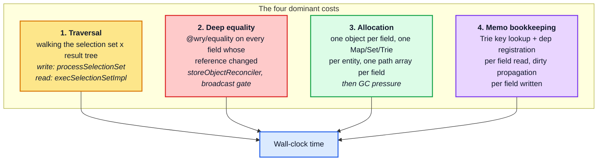

The single most important structural fact:

> **Reads are memoized per subtree; writes are not memoized at all.**
>
> A warm read of a 5 000-entity list costs microseconds. A write of the same
> data — even a byte-for-byte identical one — costs tens of milliseconds. There is no
> "nothing changed" fast path on the write side, because the writer cannot know nothing
> changed until it has normalized the payload and deep-compared every field.

### 1.2 Headline complexity table

| Operation | Complexity | Memoized? | Dominant term |
| --- | --- | --- | --- |
| `write` (entities are new) | `O(E · F)` | no | traversal + `identify` + allocation + dirtying every field |
| `write` (overwrite, identical payload) | `O(E · F)` + `O(bytes compared)` | no | `storeObjectReconciler` → `equal()` |
| `read` / `diff` (cold) | `O(E · F)` | — | traversal + `mergeDeepArray` |
| `read` / `diff` (warm, nothing dirty) | `O(1)` amortized | **yes** | one Trie lookup |
| `read` after `k` dirty entities | `O(k · F + ancestors)` | partial | recompute only invalidated subtrees |
| `broadcast` (nothing relevant dirty) | `O(W)` cheap checks | yes | `maybeBroadcastWatch` memo hit |
| `broadcast` (relevant write) | `O(W · affected subtree)` | partial | one re-read per distinct document |
| `modify` / `evict` (single id) | `O(F)`, `O(L · F)` with `L` layers | — | dirty propagation |
| `gc()` | `O(S · F)` **always** | no | mark-and-sweep over the whole store |
| `extract()` | `O(S · F)` | no | `toObject` + `__META` |
| `restore()` | `O(S)` | no | direct merge, no normalization |
| `removeOptimistic` (top layer) | `O(layer size)` | no | dirty the layer's fields |
| `removeOptimistic` (bottom of `L`) | `O(L · layer size)` | no | **replay every layer above** |

### 1.3 Measured: the shape of the curves

One list of `n` normalized entities, six scalar fields each, measured end to end:

| `n` | write cold | write identical payload | read cold | read warm | read after 1 dirty field |
| --- | --- | --- | --- | --- | --- |
| 100 | 1.50 ms | 796 µs | 1.56 ms | **2.9 µs** | 187 µs |
| 1 000 | 8.79 ms | 7.75 ms | 15.70 ms | **2.5 µs** | 1.66 ms |
| 5 000 | 44.00 ms | 39.65 ms | 78.63 ms | **2.7 µs** | 8.87 ms |
| 20 000 | 182.46 ms | 164.33 ms | 333.45 ms | **2.5 µs** | 45.08 ms |

Three readings, in descending order of importance:

1. **The warm-read column is flat.** 2.5–2.9 µs whether the list holds 100 entities or
   20 000. That is the memo graph doing its job, and it is why the read path rarely shows
   up in a profile of a healthy application.
2. **Writing a byte-identical payload costs 90 % of a cold write** — 164 ms against 182 ms
   at `n = 20 000`. Polling an unchanged response is almost as expensive as receiving a new
   one.
3. **One dirty field costs ~7× less than a cold read but still scales linearly.** 45 ms to
   re-read a 20 000-entity list after a single field changed. Memoization improves the
   constant here, not the exponent (§3.3).

> **Reading the `scale` column** in the tables that follow: it is the growth factor divided
> by the size ratio, so `1.00n` is linear, `2.00n` quadratic, and anything under about
> `0.3n` is flat. It is the number to trust — absolute timings vary by machine, exponents
> do not.

### 1.4 The one diagram to remember

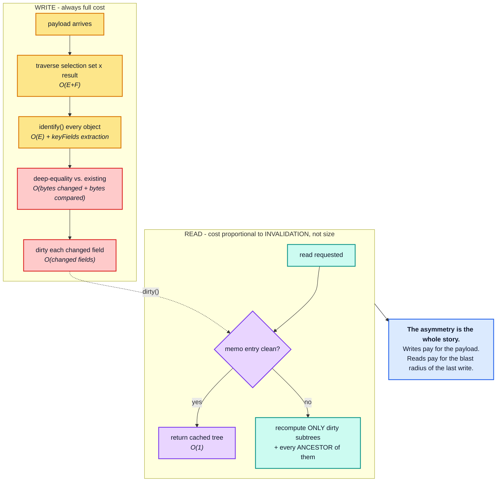

---

## Part 2 — The write path

### 2.1 Where the time goes

`StoreWriter.writeToStore` (§4.1) is two phases. Phase 1 is pure computation over the
payload; phase 2 touches the store.

```mermaid
flowchart TB
    START["writeToStore(store, { query, result, dataId, variables })"]:::api

    subgraph phase1["Phase 1 - staging (no store mutation)"]
        direction TB
        P1A["canonicalStringify(variables) -> varString<br/><i>once per write</i>"]:::memo
        P1B["processSelectionSet - recursive<br/><b>per entity:</b> new Set, new Map, new Trie<br/><b>per field:</b> new path array, getStoreFieldName,<br/>getChildMergeTree, getMergeFunction, DeepMerger.merge"]:::write
        P1C["policies.identify(result) per object<br/><i>keyFields extraction + canonicalStringify</i>"]:::write
        P1D["context.incomingById: Map&lt;dataId, staged&gt;<br/><i>duplicate entities collapse here</i>"]:::store
        P1A --> P1B --> P1C --> P1D
    end

    subgraph phase2["Phase 2 - effectful merge"]
        direction TB
        P2A["for each staged entity:<br/>applyMerges (user merge functions)"]:::write
        P2B["__DEV__ only: warnAboutDataLoss<br/><i>per field with a selection set</i>"]:::dirty
        P2C["store.merge(dataId, storeObject)<br/><b>new DeepMerger per entity</b><br/><b>equal() per changed field</b>"]:::dirty
        P2D["group.dirty(dataId, storeFieldName)<br/>per field that actually changed"]:::memo
        P2A --> P2B --> P2C --> P2D
    end

    START --> phase1 --> phase2 --> BC["broadcastWatches() unless txCount &gt; 0"]:::memo

    classDef api fill:#dbeafe,stroke:#2563eb,stroke-width:2px,color:#0f172a
    classDef write fill:#fde68a,stroke:#d97706,stroke-width:2px,color:#0f172a
    classDef store fill:#dcfce7,stroke:#16a34a,stroke-width:2px,color:#0f172a
    classDef memo fill:#e9d5ff,stroke:#7c3aed,stroke-width:2px,color:#0f172a
    classDef dirty fill:#fecaca,stroke:#dc2626,stroke-width:2px,color:#0f172a
```

### 2.2 The per-entity and per-field allocation budget

This is the part most people underestimate. Reading `processSelectionSet` allocation by
allocation:

```ts
private processSelectionSet({ dataId, result, selectionSet, context, mergeTree, path }) {
  let incoming: StoreObject = {};                    // 1 object per entity
  // ...
  const fieldNodeSet = new Set<FieldNode>();          // 1 Set per entity

  this.flattenFields(selectionSet, result, context, typename)  // 1 Map + 1 Trie per entity
    .forEach((context, field) => {
      const path = [...currentPath, field.name.value];          // 1 array of length D per FIELD
      // ...
      const storeFieldName = policies.getStoreFieldName({...}); // string build; canonicalStringify if args
      const childTree = getChildMergeTree(mergeTree, storeFieldName);
      let incomingValue = this.processFieldValue(value, field, context, childTree, path);
      const merge = policies.getMergeFunction(typename, field.name.value, childTypename);
      incoming = context.merge(incoming, { [storeFieldName]: incomingValue }); // 1 object per FIELD
    });
```

And inside `processFieldValue`, for a list:

```ts
if (isArray(value)) {
  return value.map((item, i) => {
    const value = this.processFieldValue(item, field, context, getChildMergeTree(mergeTree, i), [...path, i]);
    maybeRecycleChildMergeTree(mergeTree, i);
    return value;
  });
}
```

Per write of `E` entities with `F` fields each, at depth `D`, containing lists of total
length `N`:

| Allocation | Count | Note |
| --- | --- | --- |
| `incoming` store object | `E` | |
| `Set<FieldNode>` | `E` | |
| `Map<FieldNode, TContext>` (from `flattenFields`) | `E` | |
| `Trie` (`limitingTrie`) | `E` | fragment-revisit guard, discarded immediately |
| single-key object `{ [storeFieldName]: value }` | `E · F` | fed to `DeepMerger` |
| `path` array of length ≤ `D` | `E · F` + `N` | `[...currentPath, name]` and `[...path, i]` |
| `MergeTree` node | up to `E · F` | recycled via `maybeRecycleChildMergeTree` |
| `DeepMerger` for `store.merge` | `E` | one per entity, in phase 2 |

> **The `path` array is the sneaky one.** `[...currentPath, field.name.value]` copies the
> whole path at every field, so a selection set of depth `D` allocates
> `O(D)` words per field and `O(E · F · D)` words per write. Depth is therefore
> **quadratic-ish in allocation** even though the traversal itself is linear. Section 7.1
> measures this.

The one thing that is *not* re-allocated: `context.merge` is a single
`makeProcessedFieldsMerger()` for the whole write, and `DeepMerger.shallowCopyForMerge`
tracks `pastCopies` in a `Set`, so a given `incoming` object is copied **once** and then
mutated in place for the remaining `F − 1` fields. Building an entity is `O(F)`, not
`O(F²)`.

```ts
public shallowCopyForMerge<T>(value: T): T {
  if (isNonNullObject(value)) {
    if (!this.pastCopies.has(value)) {
      value = Array.isArray(value) ? value.slice(0) : { __proto__: Object.getPrototypeOf(value), ...value };
      this.pastCopies.add(value);
    }
  }
  return value;
}
```

The trade-off is memory: `pastCopies` retains every intermediate object for the duration of
the write, so peak memory during a large write is proportional to the payload, not to the
delta.

### 2.3 The deep-equality tax

The most expensive single line on the write path is in `entityStore.ts`:

```ts
function storeObjectReconciler(existingObject, incomingObject, property) {
  const existingValue = existingObject[property];
  const incomingValue = incomingObject[property];
  // Wherever there is a key collision, prefer the incoming value, unless
  // it is deeply equal to the existing value. It's worth checking deep
  // equality here (even though blindly returning incoming would be
  // logically correct) because preserving the referential identity of
  // existing data can prevent needless rereading and rerendering.
  return equal(existingValue, incomingValue) ? existingValue : incomingValue;
}
```

`equal` is `@wry/equality`'s cycle-tolerant deep comparison. It runs for **every field of
every entity whose incoming value is not `===` the stored value** — which, for data
arriving fresh off the network, is every field.

It does *not* run when the entity is new: `EntityStore.merge` calls
`new DeepMerger(storeObjectReconciler).merge(existing, incoming)`, and with no `existing`
there is nothing to reconcile. That is why creating an entity and overwriting it with
identical data cost about the same (§2.7) — one pays for dirtying, the other for comparing.

This is a deliberate trade: pay `O(size of the field value)` on the write to preserve
referential identity, so the read path's memo entries stay valid and React does not
re-render. The comment says so explicitly. But it means:

| Field value shape | Equality cost |
| --- | --- |
| scalar (`string`, `number`) | `O(1)` |
| `Reference` (`{ __ref }`) | `O(1)` — one key |
| array of `Reference` of length `N` | `O(N)` |
| **embedded object blob of size `B`** | `O(B)` — full recursive walk |
| **array of embedded blobs**, total size `B` | `O(B)` |

> **Consequence.** A single large untyped JSON blob stored in one cache field is
> deep-compared *in its entirety* on every write that touches that field, even when the
> field is unchanged. This is the number-one cause of "why is writing my unchanged payload
> so slow" (see §7.4).

### 2.4 Field-key construction

`getStoreFieldName` (§3.3) builds the storage key. Without arguments it is the field name;
with arguments it goes through `getStoreKeyName` → `canonicalStringify`.

It is worth being precise about what `canonicalStringify` memoizes, because it is easy to
assume more than it does:

```ts
// utilities/internal/canonicalStringify.ts
const keys = Object.keys(value);
if (keys.every(everyKeyInOrder)) return value;   // fast path: already sorted
const unsortedKey = JSON.stringify(keys);
let sortedKeys = sortingMap.get(unsortedKey);    // LRU of 1 000 KEY-SET PERMUTATIONS
```

The LRU maps a **key-set permutation** (`'["type","limit"]'`) to the sorted array of those
same keys. It does **not** memoize the serialized output. So:

- the full `JSON.stringify` walk runs on **every** call — `O(size of args)`, always;
- what is saved is the recursive `keys.sort()`, and only for objects whose keys were not
  already in order;
- the LRU is bounded by the number of distinct object **shapes** in the app, not by the
  number of distinct argument *values*, so it essentially never fills up. Fresh variable
  objects on every render cost nothing extra here.

There is no memoization one level up either: `Policies.getStoreFieldName` is called
per field per entity on both the read and the write path and rebuilds the key every time.
Argument cost is therefore paid per field occurrence, and it scales with the *size of the
argument structure*, not with how many distinct values it takes:

| argument nesting depth `d` | write, same `variables` object | write, **fresh** `variables` object each call |
| --- | --- | --- |
| 1 | 18.0 µs | 17.0 µs |
| 8 | 23.9 µs | 24.9 µs |
| 32 | 49.1 µs | 53.5 µs |
| 128 | 150.3 µs | 154.3 µs |

The two columns are identical within noise, which is the direct confirmation that nothing is
memoized per *value* — reusing the same `variables` object buys nothing. Cost tracks the
size of the argument structure, close to linearly.

Argument **count**, by contrast, vanishes into the noise as soon as there is a real result
to traverse: 0, 2, 8 and 24 arguments on a field over a 50-item result all write in
259–305 µs. Large or deep arguments cost; many shallow ones do not.

The resulting key is the fully serialized, key-sorted form, which is also what makes
`feed(type: "top", limit: 10)` and `feed(limit: 10, type: "top")` collide correctly:

```
search({"filter":{"a":2,"nested":{"a":2,"nested":{"a":2,"m":3,"z":1},"z":1},"z":1}})
```

### 2.5 Identity extraction

Every normalizable object pays `policies.identify` on write. Cost by configuration:

| `keyFields` configuration | write, 2 000 books | vs. default |
| --- | --- | --- |
| default (`__typename` + `id`) | 21.64 ms | 1.00× |
| `["isbn"]` | 27.94 ms | 1.29× |
| `["isbn", "title", "year"]` | 29.76 ms | 1.37× |
| `["isbn", "author", ["name"]]` (nested path) | 30.88 ms | 1.43× |
| `false` (object stays embedded) | 21.69 ms | 1.00× |

The ranking follows directly from `key-extractor.ts`:

- **default `__typename` + `id`** — two property reads, one string concat. Nothing else in
  the cache is this cheap, which is the practical argument for just having an `id`.
- **`keyFields: ["isbn"]`** — the specifier is compiled once, but per object it walks
  `collectSpecifierPaths` and `canonicalStringify`s the extracted key object. Adding more
  flat key paths grows this roughly linearly (1.29× for one, 1.37× for three).
- **nested path (`["isbn", "author", ["name"]]`)** — additionally descends into the
  sub-object via `extractKeyPath`, and `normalize`s (key-sorts) the extracted value.
- **`keyFields: false`** — skips `identify` entirely, but the object then stays *embedded*,
  which moves the cost to §2.3's deep equality on the parent field. Not free, just moved.

### 2.6 Merge functions

`applyMerges` (§4.6) walks the `MergeTree` after normalization. A user `merge` function
turns a field into a black box for the writer:

| Consequence | Why |
| --- | --- |
| the field's existing value is read back from the store | `existing` must be materialized before the call |
| the writer cannot skip the field | `merge` may produce anything |
| `equal()` still runs on the result | `store.merge` reconciles the merge function's output |
| pagination helpers copy the whole list | `[...existing, ...incoming]` is `O(N)` per page |

A `merge` on a list field turns each incremental page write from `O(page)` into
`O(accumulated list)`, so loading `P` pages of size `k` costs `O(P² · k)` in total. That is
usually acceptable (`P` is small), but it is the reason infinite scroll degrades:

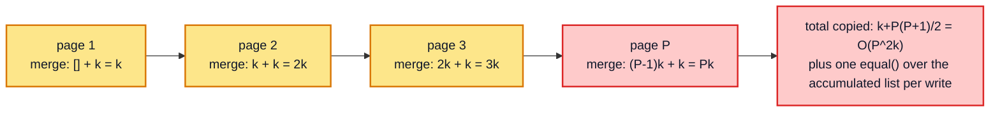

### 2.7 Measured: write scaling

`writeQuery` into a list of `n` normalized entities:

| `n` | cold | scale | identical payload | scale | one field changed | scale |
| --- | --- | --- | --- | --- | --- | --- |
| 100 | 1.50 ms | — | 796 µs | — | 757 µs | — |
| 1 000 | 8.79 ms | 0.59n | 7.75 ms | 0.97n | 7.62 ms | 1.01n |
| 5 000 | 44.00 ms | 1.00n | 39.65 ms | 1.02n | 39.68 ms | 1.04n |
| 20 000 | 182.46 ms | 1.04n | 164.33 ms | 1.04n | 166.83 ms | 1.05n |

Writes are **linear in `n` and insensitive to what actually changed**. The three columns
converge as `n` grows, because the traversal, the `identify` calls, the per-field
allocations and the `equal()` comparisons all happen regardless — dirtying fields is the
only part a no-op write avoids, and it is the cheapest part.

> There is no "nothing changed" fast path, and there cannot be one: the writer only learns
> that the payload is unchanged by normalizing it and comparing field by field. This is the
> single most useful fact for reasoning about polling and subscription workloads.

The `n = 100` cold cell looks anomalous — it drags the next row's `scale` well below `1.00n`
— so the probe re-measures the same three writes later in the process, once everything has
warmed up:

| write of 100 entities | time |
| --- | --- |
| cold `n = 100`, as measured first in the table above | 1.50 ms |
| the same write, re-measured into a **brand-new** cache | 875 µs |
| into a primed but **empty** cache | 840 µs |
| overwriting 100 **existing** entities | 718 µs |

Two effects, neither of them per-entity work. The first is **JIT**: the table's cold
`n = 100` is the first measurement the process makes, and re-measuring the identical
operation later costs 40 % less. The second is **one-time per-cache setup** — transforming
the document, materializing type policies, allocating a fresh `StoreReader`/`StoreWriter` —
which is the ~35 µs gap between the brand-new and primed caches.

With both removed, creating entities and overwriting them land within noise of each other:

> **Creating `n` entities costs the same as overwriting `n` identical ones.** The dirtying
> a creation performs is worth about as much as the `equal()` calls an overwrite performs.
> Per-entity write cost does not depend on whether the entity already existed.

---

## Part 3 — The read path

### 3.1 The memo graph *is* the read path

`StoreReader` wraps two functions with `optimism`'s `wrap` (§5.1):

```ts
this.executeSelectionSet = wrap((options) => { /* ... */ }, {
  max: cacheSizes["inMemoryCache.executeSelectionSet"] || defaultCacheSizes["inMemoryCache.executeSelectionSet"],
  keyArgs: execSelectionSetKeyArgs,
  makeCacheKey(selectionSet, parent, context) {
    if (supportsResultCaching(context.store)) {
      return context.store.makeCacheKey(selectionSet, isReference(parent) ? parent.__ref : parent, context.varString);
    }
  },
});
```

The memo key is `(selectionSetNode, dataId | object, varString)`, resolved through
`EntityStore.makeCacheKey` → `group.keyMaker.lookupArray(arguments)`, a three-level `Trie`
walk. Every entity × selection-set pair is one memo entry.

> This is why result caching is worth so much: a warm read is a handful of `Trie` node
> lookups, not a tree traversal.

Turning the memo graph off is the cleanest way to price it. Over 5 000 entities:

| | `resultCaching: true` | `resultCaching: false` | ratio |
| --- | --- | --- | --- |
| warm read | 1.8 µs | 28.33 ms | **16 000× slower** |
| write | 45.07 ms | 39.54 ms | 0.88× (12 % *cheaper*) |

Memoization is a read-path optimization **paid for on the write path** through dependency
bookkeeping. The read-side win is four orders of magnitude; the write-side cost is a modest
constant factor. That trade is the central design decision of the whole cache, and it is
why `resultCaching: false` is a debugging tool rather than a tuning knob.

### 3.2 The cost of a cold read

`execSelectionSetImpl` per entity:

```ts
const objectsToMerge: Record<string, any>[] = [];      // 1 array per entity
const missingMerger = new DeepMerger();                // 1 merger per entity, even when nothing is missing
const workSet = new Set(selectionSet.selections);      // 1 Set per entity

workSet.forEach((selection) => {
  // ... per field:
  let fieldValue = policies.readField({ fieldName, field, variables, from: objectOrReference }, context);
  // ... recursion for object/array fields
  if (fieldValue !== void 0) {
    objectsToMerge.push({ [resultName]: fieldValue });  // 1 object per FIELD
  }
});

const result = mergeDeepArray(objectsToMerge);         // 1 more DeepMerger; F-1 merges
const frozen = maybeDeepFreeze(finalResult);           // dev only: full recursive freeze
if (frozen.result) this.knownResults.set(frozen.result, selectionSet);
```

Per entity read: **one `Set`, two `DeepMerger`s, one array, `F` single-key objects**, plus
`F` `readField` calls each of which does a `group.depend(dataId, storeFieldName)`.

The symmetry with the write path is not accidental — both are "traverse the selection set,
allocate one object per field, merge them". The difference is only that the reader's result
is memoized.

### 3.3 Invalidation blast radius — the single most important read-path concept

A read costs nothing when its memo entry is clean. So the real question is never "how big is
my query" but **"how much of my memo graph does a write invalidate?"**

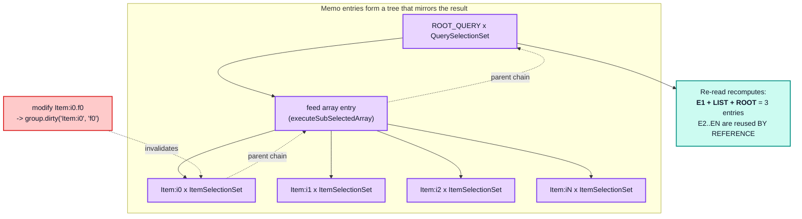

**Invalidation always propagates upward to the root**, never sideways:

| Change | Memo entries whose body re-executes |
| --- | --- |
| 1 field of 1 leaf entity in a flat list of `N` | `3` — the entity, the array, the root |
| 1 field of 1 entity at depth `D` | `D + 1` — the entity and every ancestor |
| 1 field of `k` entities in a flat list | `k + 2` |
| a field of `ROOT_QUERY` | `1` — but that entry is the whole result |

**Entries recomputed is not the same as work done.** Only three entries re-execute after a
point change in a list of `N`, but one of them is the array entry, and re-executing it
means a `filter` pass with `N` `canRead` calls plus an `N`-element `map` whose per-element
`executeSelectionSet` calls are memo *hits*. A memo hit is cheap — a three-level `Trie`
lookup plus an `optimism` dirty check — but it is not free, so the re-read is still `O(N)`:

`readQuery` over a list of `n` normalized entities:

| `n` | cold | scale | warm | scale | after 1 dirty field | scale |
| --- | --- | --- | --- | --- | --- | --- |
| 100 | 1.56 ms | — | 2.9 µs | — | 187 µs | — |
| 1 000 | 15.70 ms | 1.01n | 2.5 µs | 0.09n | 1.66 ms | 0.89n |
| 5 000 | 78.63 ms | 1.00n | 2.7 µs | 0.21n | 8.87 ms | 1.07n |
| 20 000 | 333.45 ms | 1.06n | 2.5 µs | 0.23n | 45.08 ms | 1.27n |

Read the `after 1 dirty` column against `cold`: at every size the re-read is **7–9.5× cheaper**
than a cold read and **scales the same way**. That factor is the value of structure sharing;
the linearity is the cost of the monolithic array entry.

Depth behaves completely differently. A single chain of `d` nested entities:

| `d` | write normalized | scale | read cold | scale | read warm | scale | **read after leaf change** | scale |
| --- | --- | --- | --- | --- | --- | --- | --- | --- |
| 4 | 68.2 µs | — | 74.4 µs | — | 2.8 µs | — | 71.7 µs | — |
| 16 | 170.5 µs | 0.63n | 206.4 µs | 0.69n | 2.7 µs | 0.24n | 220.6 µs | 0.77n |
| 64 | 610.2 µs | 0.89n | 737.3 µs | 0.89n | 2.4 µs | 0.22n | 1.26 ms | 1.43n |
| 128 | 1.15 ms | 0.94n | 1.37 ms | 0.93n | 2.4 µs | 0.50n | **3.45 ms** | 1.37n |

Two things stand out.

- **The leaf-change re-read scales superlinearly in `d`** — its `scale` column climbs to
  ~1.4 while `read cold` stays at ~0.9 (linear). Invalidating a leaf marks every ancestor
  `DirtyChild`; re-executing the root then walks back down re-verifying each level, and each
  level re-checks its own children. The bookkeeping compounds.
- **From `d = 16` upward, re-reading after a leaf change already costs more than a cold read
  of the entire chain**, and the gap widens: 2.5× at `d = 128`. The memo graph is not merely
  useless in this shape — it is a net cost.

Note also that `read warm` stays flat at ~2.5 µs regardless of depth. Depth is free when
nothing changed and disproportionately expensive when something did.

So the rule is sharper than "depth is expensive":

> **Breadth costs a linear factor with a small constant. Depth costs a superlinear factor
> and, past a point, more than recomputing from scratch.** Point mutations at the bottom of
> deep normalized chains are the single worst shape for the read path.

### 3.4 Structure sharing

The reason breadth is cheap is that untouched subtrees are returned by reference. Modifying
one field of one entity in a list of 500 and comparing the previous result tree against the
new one:

```
identical (===) array elements reused: 499/500
top-level result object reused:        false
feed array reused:                     false
```

Every untouched element object comes back **by reference**. That is what keeps React
re-renders proportional to what actually changed, and it is also what makes the write
path's deep-equality tax (§2.3) worth paying: `storeObjectReconciler` preserving
`existingValue` is what allows the reader's memo entries to survive.

Note what is *not* shared: the enclosing array. `executeSubSelectedArray` is one memo entry
for the whole array, so any element change rebuilds the array object (a shallow `map`) even
though every untouched element is reused. Consumers must therefore compare
element-by-element, not array-by-array — which is exactly what
`ObservableQuery`'s `equal(previousResult.data, diff.result)` does.

### 3.5 Arrays

`execSubSelectedArrayImpl` does two passes:

```ts
if (field.selectionSet) {
  array = array.filter((item) => item === undefined || context.store.canRead(item));
}
array = array.map((item, i) => { /* recurse */ });
```

- **`filter` allocates a second array** and calls `canRead` per element. `canRead` on a
  `Reference` is `store.has(__ref)`, which walks the layer chain and registers an
  `__exists` dependency. So an `N`-element list of references registers `N` extra
  dependencies beyond the per-field ones.
- **`map` allocates a third array.** For a list of references with a sub-selection, each
  element then goes through `executeSelectionSet` (memoized).
- **Nested arrays recurse into `executeSubSelectedArray`**, each level being its own memo
  entry keyed by `(fieldNode, arrayObject, varString)` — note that the key includes the
  **array instance**, so a rebuilt parent array produces a memo miss for its children's
  array entries.

`outer` groups each holding `inner` normalized rows:

| shape | write | scale | read cold | scale | read warm | scale | 1 row dirty | scale |
| --- | --- | --- | --- | --- | --- | --- | --- | --- |
| 10 × 10 | 596 µs | — | 838 µs | — | 2.6 µs | — | 78.1 µs | — |
| 10 × 100 | 4.52 ms | 0.76n | 8.62 ms | 1.03n | 2.3 µs | 0.09n | 306 µs | 0.39n |
| 100 × 100 | 47.74 ms | 1.06n | 88.20 ms | 1.02n | 2.1 µs | 0.09n | 570 µs | 0.19n |
| 100 × 500 | 251.86 ms | 1.06n | 472.01 ms | 1.07n | **2.21 ms** | **207.39n** | 2.27 ms | 0.80n |

Everything is linear in the total element count except one cell. The `100 × 500` warm read
is **three orders of magnitude** slower than every other warm read, and its scale column
reads `207.39n`.

That is not an array-nesting effect. `100 × 500` rows + 100 groups + `ROOT_QUERY` = 50 101
entities, just over the 50 000 `executeSelectionSet` limit — so the read evicts its own memo
entries as it walks. This is the LRU cliff of §4.3, reached by accident from a shape that
looks entirely unremarkable. It is the single best argument for checking memo sizes before
blaming the cache.

### 3.6 The dev-build tax

Same 5 000-entity shape, production build against development build:

| | production | development | ratio |
| --- | --- | --- | --- |
| write | 45.01 ms | 45.50 ms | 1.01× |
| read cold | 79.76 ms | 88.21 ms | 1.11× |
| results frozen | `false` | `true` | — |

`maybeDeepFreeze` walks every returned object recursively, and `getFieldValue` calls it on
every field value read out of the store:

```ts
public getFieldValue = <T = StoreValue>(objectOrReference, storeFieldName) =>
  maybeDeepFreeze(
    isReference(objectOrReference) ? this.get(objectOrReference.__ref, storeFieldName)
    : objectOrReference && objectOrReference[storeFieldName]
  ) as SafeReadonly<T>;
```

It short-circuits on already-frozen objects, so the steady-state overhead is modest, but it
is proportional to the volume of *newly created* result objects. Cold reads pay the most.
Never profile the development build.

---

## Part 4 — The dependency graph and broadcast

### 4.1 `depend` and `dirty`

```ts
public depend(dataId: string, storeFieldName: string) {
  if (this.d) {
    this.d(makeDepKey(dataId, storeFieldName));
    const fieldName = fieldNameFromStoreName(storeFieldName);
    if (fieldName !== storeFieldName) {
      // Fields with arguments that contribute extra identifying
      // information to the fieldName (thus forming the storeFieldName)
      // ...
      this.d(makeDepKey(dataId, fieldName));
    }
  }
  if (this.parent) {
    this.parent.depend(dataId, storeFieldName);
  }
}
```

Two costs hide here:

1. **A field with arguments registers *two* dependencies** — one on
   `feed({"offset":0})` and one on the bare `feed`. That is what makes
   `cache.modify({ fields: { feed } })` able to invalidate every argument variant of a
   field, and it doubles the dependency count for argument-bearing fields.
2. **`depend` recurses to parent groups.** Reading through the optimistic `Stump` registers
   in both the stump's group and the root's group, so an optimistic read costs twice the
   dependency bookkeeping of a root read.

### 4.2 Optimistic reads maintain a *second* set of memo entries

This is the least obvious cost in the whole cache, and it applies to every application
whether or not it uses optimistic updates.

`InMemoryCache.init()` carries a comment that has not been true since the `Stump` was
introduced:

```ts
// When no optimistic writes are currently active, cache.optimisticData ===
// cache.data, so there are no additional layers on top of the actual data.
// ...
this.optimisticData = rootStore.stump;
```

`optimisticData` is **always** the `Stump`, never the `Root`. The `Stump` owns its own
`CacheGroup`, hence its own `keyMaker` `Trie`, hence its own memo entries — with zero
optimistic layers active:

```
optimisticData === data      : false
optimisticData constructor   : Stump
groups are the same object   : false
optimistic group's parent    : the root group

executeSelectionSet memo entries, 2 000-entity list, ZERO optimistic layers:
  after write                  : 0
  after optimistic:false diff  : 2001
  after optimistic:true  diff  : 4002   (+2001 new)
  root result === optimistic result : false
```

And the second read gets no benefit from the first:

| | time |
| --- | --- |
| first `optimistic: true` diff, *after* a warm root read | 52.77 ms |
| the same diff once warm | 1.7 µs |

A warm root read buys the optimistic read nothing at all — it is a full cold read.

The consequence is structural, not incidental:

| Caller | `optimistic` | Memo set used |
| --- | --- | --- |
| `ObservableQuery`'s cache watch | `true` (hard-coded) | optimistic |
| `QueryManager.fetchQueryByPolicy`'s `readCache` | `true` | optimistic |
| `QueryInfo.markQueryResult`'s before/after diffs | `true` | optimistic |
| `cache.readQuery` / `readFragment` | `false` (default) | root |
| `QueryInfo.markMutationResult`'s `ROOT_MUTATION` diff | `false` | root |
| `ObservableQuery.notify`'s comparison | both | **both** |

So the memo budget for a watched query is **two entries per entity**, not one, and a
`cache.readQuery` from application code does not warm anything the watch will use. The
`executeSelectionSet` limit of 50 000 is therefore effectively 25 000 entities for watched
queries — which matters given §4.3 below.

### 4.3 The memo LRU cliff

Every memo is a **bounded** LRU. Exceeding a bound is not a gentle degradation:

Warm read cost as one query's entity count crosses the `executeSelectionSet` limit of
50 000:

| entities in the result | memo entries held | warm read | over the limit? |
| --- | --- | --- | --- |
| 10 101 | 10 101 | 1.8 µs | no |
| 40 101 | 40 101 | 1.7 µs | no |
| 49 101 | 49 101 | 1.7 µs | no |
| 50 101 | 50 000 | **2.17 ms** | **yes** |
| 60 101 | 50 000 | **116.95 ms** | **yes** |

1.7 µs at 49 101 entities; 2.17 ms — 1 300× more — at 50 101. Nothing about the data
changed; one thousand extra entities crossed a threshold.

Past the bound it keeps getting worse rather than settling: 2.17 ms at 1 % over, 117 ms at
20 % over. The further past the limit a single read reaches, the larger the fraction of it
that misses, until effectively none of the read is memoized.

A single query whose result contains more entities than `executeSelectionSet` can hold
evicts its own entries *while it is reading*, so by the time it finishes the earliest
entries are already gone. Every subsequent "warm" read is then a cold read. The transition
is abrupt because the eviction is LRU and the read order is stable: the reader always
re-requests the entries it evicted first.

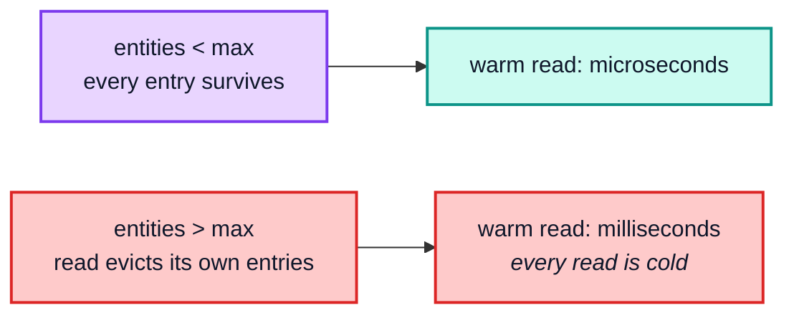

Two ways to hit it without noticing: one very large list, or (more commonly) many
moderately-sized queries whose combined entity × selection-set product exceeds the bound —
remembering to double the count for watched queries per §4.2.

### 4.4 Broadcast fan-out

One write with `w` watchers registered on the same query, over a 2 000-entity list:

| `w` | write that **dirties** what they watch | scale | write that touches **nothing** they watch | scale |
| --- | --- | --- | --- | --- |
| 1 | 22.57 ms | — | 101.4 µs | — |
| 10 | 22.18 ms | 0.10n | 136.4 µs | 0.13n |
| 50 | 22.28 ms | 0.20n | 273.7 µs | 0.40n |
| 200 | 23.20 ms | 0.26n | 695.9 µs | 0.64n |

The two columns behave differently, and both results are useful.

The **relevant** column is flat: 200 watchers cost 3 % more than one. Note what the
absolute number is made of — most of those 22 ms is the write of the 2 000-entity list
itself, and the *marginal* cost is about 3 µs per additional watcher. The watches share
`StoreReader` memo entries, so the first one processed recomputes the invalidated subtrees
and the remaining `W − 1` get memo hits. Broadcast cost is therefore governed by *how much
was invalidated*, not by how many watchers there are — as long as they share a document
(§4.5). The final `equal(lastDiff.result, diff.result)` in `broadcastWatch` stays cheap for
the same reason structure sharing keeps React fast: untouched subtrees come back `===` and
`equal` short-circuits on them (§3.4).

The **unrelated** column grows, but at roughly 3 µs per watcher — it is a per-watch
constant, not a per-watch re-read. That is the equality gate (§6.2): `maybeBroadcastWatch`
is itself memoized, so a watch whose dependencies were not dirtied returns its cached value
without computing a diff at all. Its key is built from the *store's* `CacheGroup` — the
`Stump`'s group for `optimistic: true` watches, the root's otherwise:

```ts
makeCacheKey: (c: Cache.WatchOptions) => {
  const store = c.optimistic ? this.optimisticData : this.data;
  if (supportsResultCaching(store)) {
    const { optimistic, id, variables } = c;
    return store.makeCacheKey(
      c.query,
      // ...if their callbacks are different, the (identical) result needs to
      // be delivered to each distinct callback. See issue #5733.
      c.callback,
      canonicalStringify({ optimistic, id, variables })
    );
  }
},
```

<sub>`inMemoryCache.ts` — `maybeBroadcastWatch`'s `makeCacheKey`</sub>

`c.callback` is part of the key on purpose, so `W` watchers on one query occupy `W` distinct
`maybeBroadcastWatch` entries even though they share every `StoreReader` entry underneath.
Budget for that against `cacheSizes["inMemoryCache.maybeBroadcastWatch"]` (§9). The
difference between the two columns is the difference between `O(W)` cheap checks and `O(W)`
full re-reads.

### 4.5 Memo fragmentation by document identity

Hold the watcher count fixed at 50 and vary only whether they share a document node:

| 50 watchers, one write | time |
| --- | --- |
| all on the **same** document | 22.78 ms |
| on 50 **structurally identical but separately parsed** documents | **3.37 s** |

**148× slower for the same query text, the same variables, and the same data.**

This is the sharpest performance cliff in the whole cache, and it is invisible in the data:
the memo key includes the `SelectionSetNode` **object**, so two structurally identical
queries parsed separately share **nothing**.

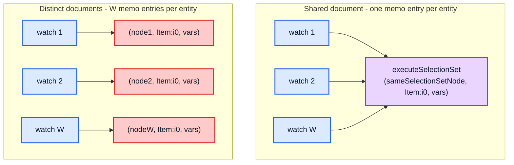

Three mechanisms normally prevent this, and all three must be working:

| Mechanism | What it de-duplicates |
| --- | --- |
| `graphql-tag`'s own document cache | identical `gql` template literals |
| `DocumentTransform`'s `WeakCache` | repeated `transformDocument` of the same input node |
| `InMemoryCache.addTypenameTransform`'s cache | the `__typename`-adding pass |

Building documents dynamically (string interpolation into `gql`, per-render document
construction, or a custom `DocumentTransform` with `cache: false` that is not itself
memoized) defeats all three, multiplies memo entries by the number of distinct documents,
and blows the 50 000-entry LRU — at which point reads stop being memoized at all and every
broadcast becomes a cold read.

### 4.6 Batching

100 writes with 1 watcher on a 2 000-entity list:

| | time |
| --- | --- |
| 100 separate writes (100 broadcasts) | 5.42 ms |
| the same 100 writes inside one `cache.batch` | 1.54 ms |
| | **3.5× faster** |

`txCount` (§6.3) suppresses broadcasts inside a transaction. The saving is not the writes —
those cost the same — it is the **avoided re-reads**: each broadcast recomputes every dirty
watcher's diff, and a diff over a large list is the dominant term.

---

## Part 5 — Layers and optimistic updates

`k` stacked optimistic layers over a 2 000-entity store:

| `k` | add + remove all | scale | warm read through | scale | remove the bottom one | scale | unwind **LIFO** | scale | unwind **FIFO** | scale |
| --- | --- | --- | --- | --- | --- | --- | --- | --- | --- | --- |
| 1 | 77.8 µs | — | 7.8 µs | — | 6.3 µs | — | 6.3 µs | — | 8.1 µs | — |
| 4 | 198.1 µs | 0.64n | 6.3 µs | 0.20n | 46.0 µs | 1.82n | 10.4 µs | 0.41n | 92.9 µs | 2.86n |
| 16 | 1.67 ms | 2.11n | 6.7 µs | 0.26n | 182.1 µs | 0.99n | 27.0 µs | 0.65n | 1.42 ms | 3.82n |
| 64 | 25.48 ms | 3.81n | 7.4 µs | 0.28n | 734.8 µs | 1.01n | **81.9 µs** | 0.76n | **24.43 ms** | 4.30n |

The last two columns are the same stack of 64 layers torn down in opposite orders:

> **Unwinding LIFO costs 82 µs. Unwinding FIFO costs 24.4 ms — 298× more.**

`Layer.removeLayer` recurses to its parent first, and if the parent chain changed it
rebuilds itself with `parent.addLayer(this.id, this.replay)` — whose constructor calls
`replay(this)`, re-running the layer's write. Popping from the top never changes anyone's
parent chain, so it is `O(k)`. Removing from the bottom replays everything above it, so a
full FIFO unwind is `O(k²)`. The `add+remove` column uses the FIFO order, which is why it
inherits the same quadratic scale.

The `read through` column is **flat**, which is not a contradiction: the read is warm, so it
is a memo hit at the top of the chain and never walks the layers at all. The `O(k)` lookup
chain is only paid on a memo miss.

Three distinct costs:

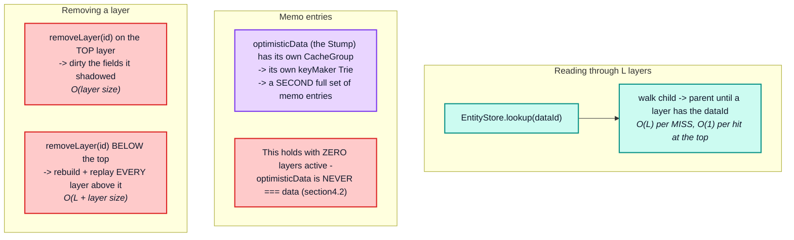

The practical rules that fall out:

- **Keep optimistic layers short-lived and few.** `QueryInfo` does this by construction: one
  layer per in-flight mutation, removed in the same `batch` that writes the server result
  (§8.5).
- **Remove layers in LIFO order.** Measured at 298× on a stack of 64 (82 µs against
  24.4 ms). Removing the bottom of a stack replays everything above it.
- **Every notification does two diffs.** `ObservableQuery.notify` compares the optimistic
  and non-optimistic reads (architecture §8.7). Contrary to what the stale comment in
  `init()` suggests, these never share memo entries (§4.2) — the second diff is a genuine
  second read, cheap only because it is separately memoized.
- **Adding a layer invalidates the optimistic memo set, not the root one.** A root write
  invalidates both, because `depend`/`dirty` propagate from the root group to its child.

---

## Part 6 — Lifecycle operations

Over a store of `n` entities:

| `n` | evict entity | evict field | `gc()` collecting **nothing** | scale | `gc()` collecting `n` | scale | `extract()` | scale | `restore()` | scale |
| --- | --- | --- | --- | --- | --- | --- | --- | --- | --- | --- |
| 1 000 | 22.1 µs | 20.7 µs | 1.03 ms | — | 3.91 ms | — | 175 µs | — | 1.54 ms | — |
| 5 000 | 21.1 µs | 21.7 µs | 5.16 ms | 1.00n | 19.93 ms | 1.02n | 1.20 ms | 1.38n | 8.89 ms | 1.15n |
| 20 000 | 22.5 µs | 23.2 µs | 27.41 ms | 1.33n | 83.55 ms | 1.05n | 6.04 ms | 1.25n | 37.66 ms | 1.06n |

Three results worth internalizing:

- **Eviction is flat** — ~22 µs whatever the store size. It touches one entity.
- **`gc()` costs the same whether or not it collects anything** — 27.41 ms over a
  20 000-entity store that is entirely reachable. A no-op `gc()` is not free, it is a full
  mark-and-sweep (§6.1).
- **`restore()` is ~4.8× cheaper than writing the same data** (37.66 ms against the
  182.46 ms cold write of §2.7) because the snapshot is already normalized (§6.3).

### 6.1 `gc()` is `O(store)` unconditionally

```ts
public gc() {
  const ids = this.getRootIdSet();
  const snapshot = this.toObject();
  ids.forEach((id) => {
    if (hasOwn.call(snapshot, id)) {
      Object.keys(this.findChildRefIds(id)).forEach(ids.add, ids);
      delete snapshot[id];
    }
  });
  const idsToRemove = Object.keys(snapshot);
  // ...
}
```

`toObject()` materializes the whole store (merging the layer chain if called on a layer),
and `findChildRefIds` walks every field of every reachable entity looking for `__ref`s. The
per-entity result is memoized in `this.refs[dataId]` and invalidated whenever that entity is
merged — so a `gc()` immediately after a large write re-walks everything that write touched.

There is no incremental mode. Do not call `gc()` on a timer; call it after bulk evictions.

`cache.gc({ resetResultCache: true })` additionally throws away `StoreReader`,
`StoreWriter`, `maybeBroadcastWatch` and both `CacheGroup` `keyMaker` Tries — that is a
memory reclamation tool, and it makes the **next** read of every query cold.

### 6.2 `evict` is cheap, its consequences are not

Evicting one entity is `O(F)` — `delete` routes through `modify` with a `DELETE` modifier
for every field, then dirties each removed field plus `__exists`. But every read that had a
dependency on it is now invalidated, and every list containing a reference to it must be
re-filtered by `canRead` on the next read (§3.5). The eviction is fast; the re-reads it
triggers are the cost.

One detail that matters with layers active: `InMemoryCache.evict` calls
`this.optimisticData.evict(options, this.data)`, and `EntityStore.evict` recurses to its
parent until it reaches that `limit`. So an evict walks the entire layer chain and is
`O(L · F)`, not `O(F)`, when optimistic layers are stacked. The `limit` argument is what
bounds the walk: normally `this.data` is the `Root`, so the eviction reaches all the way
down, but *during* an optimistic update `this.data` is temporarily the current `Layer`,
which stops the eviction from escaping it.

### 6.3 `restore` versus `write`

`restore` is dramatically cheaper than writing the same data because the snapshot is
*already normalized*: there is no selection-set traversal, no `identify`, no
`getStoreFieldName`, and no merge functions. It is a `merge` per top-level `dataId`.

This is the argument for SSR hydration via `extract`/`restore` rather than replaying
queries.

---

## Part 7 — Structural properties that stress the hot paths

This is the core of the question: **given deeply nested typed and untyped objects and
arrays, what shapes hurt, and which hot path do they hurt?**

### 7.0 The stress matrix

| # | Structural property | Primary hot path stressed | Cost | Symptom |
| --- | --- | --- | --- | --- |
| 1 | **Deep normalized chains** (`D` large) | read invalidation, write `path` allocation | point mutation → `O(D^1.4)` re-verification | one field changes, whole query recomputes — eventually costing *more* than a cold read |
| 2 | **Wide lists of entities** (`N` large) | write traversal, cold read, array memo entry | `O(N · F)` cold; `O(N)` with a small constant per point update | slow first paint, slow writes |
| 3 | **Large embedded (untyped) blobs** | `storeObjectReconciler` → `equal()` | `O(blob size)` per write, even when unchanged | identical payload writes are slow |
| 4 | **Total entities > memo capacity** | `executeSelectionSet` LRU | **cliff**: warm reads become cold reads | sudden, size-triggered collapse |
| 5 | **Any watched query** | duplicate optimistic memo set | 2× memo entries per entity | memo capacity exhausted at half the expected size |
| 6 | **Arrays of arrays** | `executeSubSelectedArray` memo keying | array-instance-keyed memos churn | cold reads on every parent change |
| 7 | **High entity fan-in** (many parents → same entity) | `context.written` de-dup, dirty fan-out | shared entries make this cheaper than it looks | one mutation re-renders everything |
| 8 | **Many fields per entity** (`F` large) | per-field allocation, `mergeDeepArray` | `O(F)` objects per entity per read *and* write | GC pressure |
| 9 | **Argument-heavy fields** | `canonicalStringify`, double `depend` | key building + 2× dependencies | slow writes with complex filters |
| 10 | **Polymorphic fragments** | `fragmentMatches`, `flattenFields` re-visits | selection sets flattened per `(clientOnly, deferred)` flavor | write cost grows with fragment count |
| 11 | **Many distinct documents** | memo key fragmentation | `W ×` memo entries, LRU thrash | broadcasts become cold reads |
| 12 | **`merge` functions on lists** | `applyMerges` | `O(accumulated)` per page | pagination degrades quadratically |
| 13 | **Deep optimistic layer stacks** | `lookup` chain, layer replay | `O(L)` per miss, `O(L²)` for out-of-order removal — measured 298× on 64 layers | janky optimistic UI |
| 14 | **Cyclic / self-referential graphs** | `context.written`, `equal`'s cycle handling | bounded, but with `Set`/array overhead | memory, not time |

Rows 4 and 5 are the two that produce *sudden* rather than gradual degradation, and they
interact: because every watched query keeps two memo sets, the effective entity budget for
watched data is half the configured limit.

### 7.1 Depth (the worst offender)

Depth hurts in three independent places:

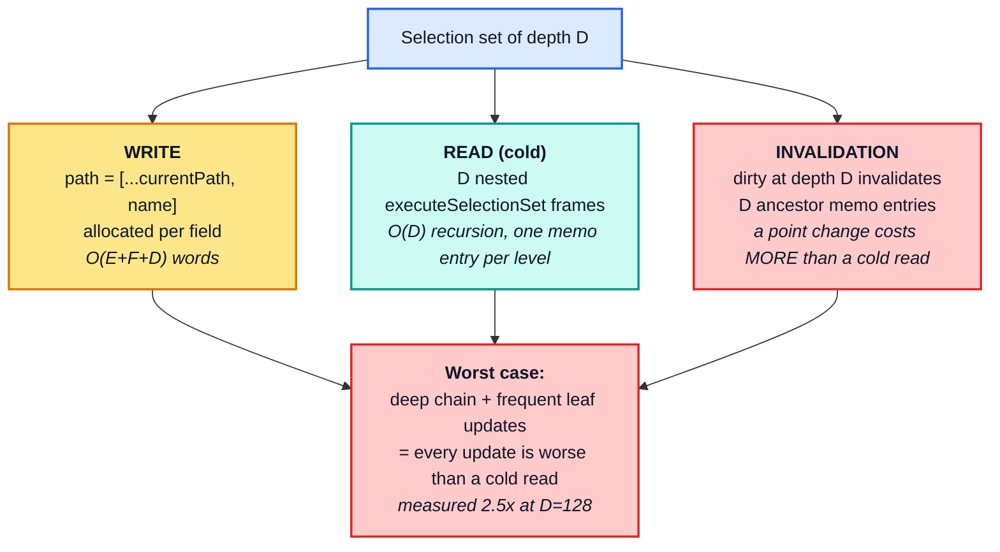

Compare with breadth: a leaf update in a list of `N` invalidates 3 memo entries regardless
of `N`. A leaf update at depth `D` invalidates `D + 1`. **Depth converts a point mutation
into something more expensive than recomputing the whole chain from scratch; breadth does
not** (§3.3).

The mitigation is not to flatten the schema — it is to make sure the deep path is *not* the
one that changes often, or to read the deep entity directly (`cache.readFragment` /
`useFragment` on the leaf entity) so the component subscribes to a shallow selection set
rooted at the leaf rather than to the whole chain.

### 7.2 Breadth

Breadth is the friendly dimension. Writes and cold reads are linear; warm reads and point
updates are effectively constant.

Where breadth *does* bite:

- **The array memo entry is monolithic.** `executeSubSelectedArray` produces one entry for
  the whole array, so any element change rebuilds an `N`-element array (a shallow `map`,
  plus a `filter` pass with `N` `canRead` calls).
- **`canRead` registers `N` `__exists` dependencies** per array read.
- **Cold reads after `resetResultCache`** are `O(N · F)` with no shortcut.

So `N` shows up as a constant factor on every broadcast that touches the list, even though
the per-element work is reused.

### 7.3 Typed (normalized) versus untyped (embedded) data

This is the central design choice, and it trades write cost against invalidation
granularity.

```mermaid
flowchart TB
    subgraph norm["Normalized (has __typename + id / keyFields)"]
        direction TB
        N1["one store entry per entity"]:::store
        N2["parent stores { __ref } - O(1) to compare"]:::store
        N3["dirty granularity: ONE FIELD of ONE entity"]:::memo
        N4["shared across every query that names it"]:::memo
        N5["<b>costs:</b> identify() per object,<br/>reference indirection on read,<br/>bigger store, gc must traverse it"]:::dirty
    end

    subgraph embed["Embedded (no id, or keyFields: false)"]
        direction TB
        E1["lives inside ONE parent field value"]:::store
        E2["parent stores the whole blob"]:::store
        E3["dirty granularity: THE WHOLE BLOB"]:::dirty
        E4["shared with nothing"]:::dirty
        E5["<b>costs:</b> equal() over the entire blob<br/>on every write touching that field,<br/>whole-blob invalidation"]:::dirty
        E6["<b>benefits:</b> no identify(), no indirection,<br/>fewer store entries, faster warm read"]:::store
    end

    classDef store fill:#dcfce7,stroke:#16a34a,stroke-width:2px,color:#0f172a
    classDef memo fill:#e9d5ff,stroke:#7c3aed,stroke-width:2px,color:#0f172a
    classDef dirty fill:#fecaca,stroke:#dc2626,stroke-width:2px,color:#0f172a
```

The same `n` objects with 6 scalar fields each, once normalized and once embedded in a
single field:

| `n` | write normalized | write embedded | read warm normalized | read warm embedded |
| --- | --- | --- | --- | --- |
| 100 | 874 µs | 711 µs | 2.9 µs | 3.0 µs |
| 1 000 | 8.14 ms | 5.86 ms | 2.5 µs | 2.5 µs |
| 5 000 | 44.10 ms | 28.91 ms | 2.6 µs | 2.6 µs |

Store entries at `n = 2 000`:

```
normalized: 2001 entries (1 root + n entities)
embedded:      1 entry   (root only — the whole list lives in one field)
```

Embedding writes about **1.5× faster** (no `identify`, no reference indirection) and reads
identically fast when warm. What it gives up is not speed, it is **granularity**: the whole
list is one cache field, so changing one element dirties all of it, and nothing is shared
with any other query. The 1.5× is the price of per-entity invalidation.

The rule of thumb that follows:

| Data | Prefer |
| --- | --- |
| shared, individually updated, referenced by several queries | **normalized** |
| a settings object, a chart series, a geometry payload, an opaque JSON column | **embedded** |
| large **and** frequently rewritten with mostly-identical content | **normalized** — otherwise `equal()` re-walks the blob every write |
| large **and** written once, read often | **embedded** — one `equal()` on write, free thereafter |

### 7.4 The untyped-blob pathology

The worst realistic shape is a large untyped object under a field that is rewritten often:

```graphql
query Dashboard {
  dashboard {
    __typename
    id
    layout      # a 500 KB untyped JSON blob, unchanged between polls
    widgets { __typename id value }
  }
}
```

Every poll writes `layout` again. `storeObjectReconciler` runs `equal(existingLayout,
incomingLayout)` over the entire 500 KB structure, concludes it is unchanged, returns
`existingValue`, and dirties nothing. **The cache does exactly the right thing and pays the
full price to discover it.**

Three ways out, in order of preference:

1. **Don't select the field when it isn't needed.** The cheapest work is work not done.
2. **Give it an identity** (`keyFields` on the blob's type, or a `read`/`merge` pair) so it
   becomes its own entity and the parent compares one `__ref`.
3. **A `merge` function that returns `existing` when a version/hash field is unchanged**,
   short-circuiting the deep comparison:

   ```ts
   typePolicies: {
     Dashboard: {
       fields: {
         layout: {
           merge(existing, incoming) {
             return existing && existing.version === incoming.version ? existing : incoming;
           },
         },
       },
     },
   }
   ```

   The `merge` function runs *instead of* the default reconciliation for that field, so the
   `O(blob)` comparison becomes `O(1)`.

### 7.5 Arrays of arrays

Nested arrays are the one place where the memo key works against you:

```ts
makeCacheKey({ field, array, context }) {
  if (supportsResultCaching(context.store)) {
    return context.store.makeCacheKey(field, array, context.varString);
  }
}
```

The key includes **the array instance from the store**, not its contents. That is correct
and fast — but it means an inner array's memo entry is only reused while the exact same
array object remains in the store. Rewriting the outer field with a structurally equal but
freshly allocated outer array produces a new outer array *only if* `equal()` says it
changed; if any element differs, the whole outer array is replaced and **every inner array
gets a new identity**, invalidating all of their memo entries at once.

Arrays of arrays of **plain scalars**, with no entities and no sub-selection, behave
completely differently from the normalized matrix in §3.5:

| shape | write | scale | read warm | scale |
| --- | --- | --- | --- | --- |
| 10 × 100 | 6.8 µs | — | 2.2 µs | — |
| 100 × 100 | 7.0 µs | 0.10n | 2.1 µs | 0.10n |
| 100 × 1 000 | 6.7 µs | 0.10n | 2.1 µs | 0.10n |

Constant, at 100 000 elements. Not linear — **constant**.

A list of scalars with **no sub-selection** is the degenerate — and cheapest — case.
`processFieldValue` returns immediately:

```ts
if (!field.selectionSet || value === null) {
  // In development, we need to clone scalar values so that they can be
  // safely frozen with maybeDeepFreeze in readFromStore.ts. In production,
  // it's cheaper to store the scalar values directly in the cache.
  return __DEV__ ? cloneDeep(value) : value;
}
```

In production the array from the network response is stored **by reference** — verified:
`cache.extract().ROOT_QUERY.matrix === theOriginalArray` is `true`, and so is
`stored[0] === matrix[0]`. Writing a 100 000-element nested scalar array into an empty
cache is therefore `O(1)`, and reading it back is a property lookup.

Three caveats follow directly:

- **In development it is `O(size)`** — `cloneDeep` copies the entire structure so
  `maybeDeepFreeze` cannot freeze the caller's object. Another reason not to profile the
  development build.
- **Overwriting is `O(size)`** even in production, because `storeObjectReconciler` runs
  `equal()` against the stored array.
- **It is atomic.** There is no sub-entry, no memo entry, and no way to update one element:
  any change replaces the whole value and dirties the single field.

### 7.6 Fan-in: many parents referencing one entity

Normalization's benefit is de-duplication; its cost is that a single entity update fans out
to every reader.

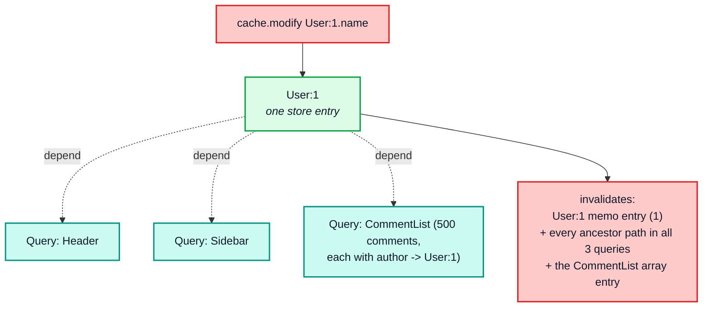

Because memo entries are keyed by `(selectionSet, dataId, varString)`, the `User:1 ×
AuthorFields` entry is shared by all 500 comments — it recomputes **once**. But each of the
500 `Comment:n × CommentFields` entries depended on the `author` field of its comment, not
on `User:1`'s fields, so those are *not* invalidated; only the shared author entry and the
ancestors that actually contain it are. Fan-in is therefore much cheaper than it looks,
provided the fragment used for the author is the same node everywhere (§4.3 again).

The genuinely expensive fan-in shape is **`@nonreactive` missing where it belongs**: a
selection that pulls a frequently-updated entity into a large list purely for display, with
no need to react to it. Adding `@nonreactive` to that fragment spread stops the enclosing
watch from depending on it at all (§4.3 of the architecture document).

### 7.7 Argument-heavy fields

The measurements are in §2.4. The summary: **argument count is free, argument size is not.**
Going from 0 to 24 arguments on a field is lost in the noise; going from a 1-level to a
128-level nested argument object takes the write from 18.0 µs to 150.3 µs, and using a fresh
`variables` object every call changes nothing.

Costs, in order:

1. `canonicalStringify(args)` — a full `JSON.stringify` walk of the argument structure on
   every call (§2.4). Only the *key sorting* is memoized, and only by shape, so the cost is
   proportional to argument size and is paid per field occurrence, not per distinct value.
2. `Policies.getStoreFieldName` is not memoized, so step 1 runs once per field per entity
   on both the read and the write path.
3. The resulting `storeFieldName` string is long, and it is used as a `Map` key, a
   dependency key (`makeDepKey`), and a property name — so long keys cost on every access.
4. `group.depend` registers **two** dependencies for argument-bearing fields.

`keyArgs` is the mitigation: restricting the key to the arguments that actually partition
the data both shortens the key and collapses variants that would otherwise be separate
cache fields.

### 7.8 Polymorphism and fragments

`flattenFields` guards against re-flattening with a `Trie` keyed by
`(selectionSet, clientOnly, deferred)`:

```ts
const visitedNode = limitingTrie.lookup(selectionSet, inheritedContext.clientOnly, inheritedContext.deferred);
if (visitedNode.visited) return;
visitedNode.visited = true;
```

So the same fragment can be flattened up to four times per entity (the four flavors of
`clientOnly × deferred`). The `Trie` itself is allocated per `processSelectionSet` call —
per entity — which makes fragment-heavy queries pay a fixed setup cost per entity.

On the read side, `execSelectionSetImpl` flattens fragments into a `Set` and relies on
`policies.fragmentMatches(fragment, typename)` per fragment per entity. With `possibleTypes`
configured that is a `Set`-like lookup; without it, the fuzzy-subtype fallback is a
per-fragment scan (§3.6) and warns.

### 7.9 Cycles

`context.written[dataId]` is an **array** of selection sets, and the comment explains why:

```ts
// Avoid processing the same entity object using the same selection
// set more than once. We use an array instead of a Set since most
// entity IDs will be written using only one selection set, so the
// size of this array is likely to be very small, meaning indexOf is
// likely to be faster than Set.prototype.has.
const sets = context.written[dataId] || (context.written[dataId] = []);
if (sets.indexOf(selectionSet) >= 0) return dataRef;
```

That assumption breaks in one specific shape: **one entity written through many different
selection sets in a single operation** — for instance a query that spreads a dozen
different fragments on the same object at different points in the tree. Then `indexOf` is a
linear scan of a growing array, executed once per (entity, selection set) pair, giving
`O(k²)` for `k` distinct selection sets per entity. `k` is small in practice; it is worth
knowing the bound exists.

Cycles themselves are safe: `equal` is cycle-tolerant, `findChildRefIds` uses a `workSet`,
and `context.written` terminates the write recursion.

---

## Part 8 — Worst-case shapes and a stress corpus

### 8.1 The four adversarial payloads

```mermaid
flowchart TB
    subgraph s1["Shape 1 - the deep chain"]
        A1["root -> child -> child -> ... (D = 128)<br/>every level normalized"]:::dirty
        A2["<b>stresses:</b> invalidation blast radius,<br/>path allocation, recursion depth"]:::dirty
        A1 --> A2
    end

    subgraph s2["Shape 2 - the fat blob"]
        B1["one field holding a 1 MB untyped object,<br/>rewritten every poll"]:::dirty
        B2["<b>stresses:</b> storeObjectReconciler equal(),<br/>cloneDeep in dev, DeepMerger pastCopies"]:::dirty
        B1 --> B2
    end

    subgraph s3["Shape 3 - the ragged matrix"]
        C1["groups: [ rows: [ cells: [...] ] ]<br/>three levels of arrays, entities at the leaves,<br/>total entities near the 50 000 memo limit"]:::dirty
        C2["<b>stresses:</b> array-instance memo keys,<br/>filter+map double allocation per level,<br/>and the LRU cliff (section4.3)"]:::dirty
        C1 --> C2
    end

    subgraph s4["Shape 4 - the document explosion"]
        D1["N components each building their own<br/>gql document at render time"]:::dirty
        D2["<b>stresses:</b> memo key fragmentation,<br/>LRU eviction, every broadcast cold"]:::dirty
        D1 --> D2
    end

    classDef dirty fill:#fecaca,stroke:#dc2626,stroke-width:2px,color:#0f172a
```

### 8.2 A stress-test corpus for a re-implementation

Any `InMemoryCache` replacement should be benchmarked against these axes, in this order,
because each isolates one hot path:

| Axis | Vary | Holds constant | Detects a regression in |
| --- | --- | --- | --- |
| breadth | `N` = 100 → 20 000 | `F`, `D` = 1 | traversal, allocation per entity |
| depth | `D` = 4 → 128 | `E`, `F` | invalidation propagation, path allocation |
| fields | `F` = 2 → 64 | `E`, `D` | per-field allocation, `mergeDeepArray` |
| blob size | embedded bytes 1 KB → 1 MB | everything else | `equal()` cost |
| array nesting | 1 → 3 levels | total elements | `executeSubSelectedArray` keying |
| arguments | 0 → 24 args, nested 1 → 128 | result size | `canonicalStringify` |
| watchers | `W` = 1 → 200, shared vs. distinct docs | store size | broadcast fan-out, memo sharing |
| layers | `L` = 1 → 64, LIFO vs. FIFO removal | store size | layer chain walk, replay |
| store size | `S` = 1 000 → 100 000 | operation | `gc`, `extract` |
| dirty fraction | 0% → 100% of entities changed | `E` | dirty propagation, re-read cost |
| memo capacity | entities either side of the LRU limit | query shape | eviction policy, cliff behaviour |
| optimistic vs. root reads | same query, both `optimistic` values | store size | memo-set separation (§4.2) |

The probe implements every one of these. The two that most often reveal a broken
re-implementation are **"read after 1 dirty"** (proves the memo graph is wired correctly)
and **"write identical"** (proves the equality short-circuit preserves referential
identity — if it does not, everything downstream re-renders forever).

---

## Part 9 — Optimization playbook

### 9.1 Decision tree

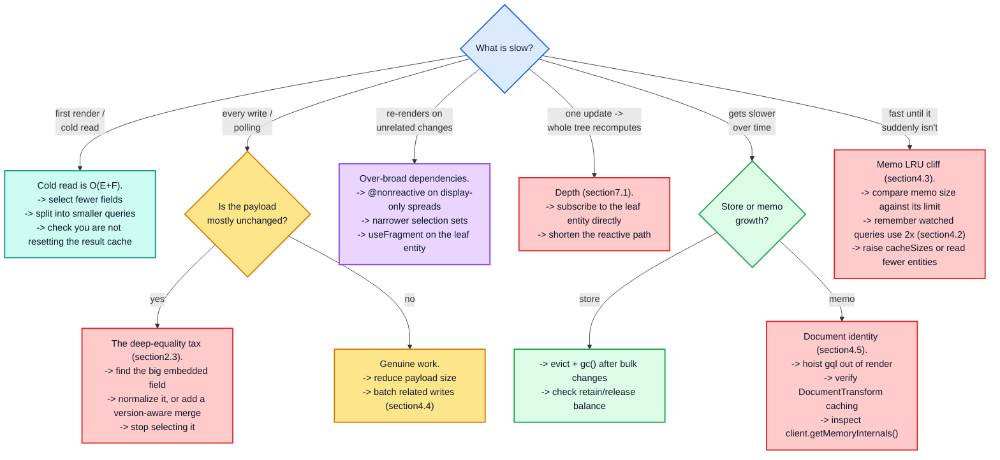

### 9.2 Diagnostics

| Question | How to answer it |
| --- | --- |
| Are my memo caches thrashing? | `client.getMemoryInternals()` (dev only) — compare `inMemoryCache.executeSelectionSet` size against its 50 000 limit. A size pinned exactly at the limit means you are over the cliff (§4.3) |
| How many entities does my store hold? | `Object.keys(cache.extract()).length` |
| Is a write actually changing anything? | write twice, compare `cache.extract()` — identical output means the second write was pure cost |
| Which field is the fat one? | sort `JSON.stringify(value).length` over `cache.extract().ROOT_QUERY` and each entity |
| Is a query re-reading when it should not? | wrap `watch.callback` and log; a callback per unrelated write means dependencies are too broad |
| Am I profiling the right build? | `Object.isFrozen(cache.readQuery(...))` — `true` means you are on the development build |
| Is my optimistic memo set doubling my footprint? | diff `cache["storeReader"]["executeSelectionSet"].size` around a `cache.diff({ optimistic: true })` — a non-zero delta after a warm root read confirms §4.2 |

### 9.3 Tuning knobs the cache actually exposes

| Knob | Effect | When to change it |
| --- | --- | --- |
| `cacheSizes["inMemoryCache.executeSelectionSet"]` | read memo capacity (default 50 000) | large stores with many distinct queries — remember watched queries consume two entries per entity (§4.2) |
| `cacheSizes["inMemoryCache.executeSubSelectedArray"]` | array memo capacity (default 10 000) | many long lists |
| `cacheSizes["inMemoryCache.maybeBroadcastWatch"]` | broadcast memo capacity (default 5 000) | more than a few thousand simultaneous watches |
| `cacheSizes["canonicalStringify"]` | key-sort memo, one entry per argument **shape** (default 1 000) | rarely — it is bounded by distinct object shapes, not values (§2.4) |
| `resultCaching: false` | disables the memo graph entirely | debugging only — see the measured cost below |
| `typePolicies[T].keyFields` | identity extraction cost and normalization granularity | see §7.3 |
| `typePolicies[T].fields[f].keyArgs` | shortens store field keys, collapses variants | argument-heavy fields |
| `possibleTypes` | turns fuzzy fragment matching into a lookup | any interface/union usage |

### 9.4 What a Rust/WASM re-implementation should target

Ranked by measured share of total time, with the caveat that the ranking shifts with shape:

1. **`equal()` in `storeObjectReconciler`** — the single hottest leaf function on the write
   path for realistic payloads. A Rust implementation can compare interned/hashed values
   instead of walking structures, turning `O(blob)` into `O(1)` for unchanged fields. This
   is the largest single win available.
2. **Allocation churn** — one object per field on both paths, plus a `path` array per field.
   Arena allocation and index-based paths remove essentially all of it.
3. **The traversal itself** — `processSelectionSet` / `execSelectionSetImpl`. A compiled
   selection-set plan (resolved field keys, merge functions, and key extractors bound once
   per document instead of per entity) removes the repeated `getStoreFieldName`,
   `getMergeFunction`, and `flattenFields` work.
4. **`canonicalStringify`** — replaceable with a structural hash; only the *stability* of
   the key matters, not its readability, except where it appears in `extract()` output. That
   caveat is real: store field keys are part of the serialized snapshot format (S5 in the
   architecture document's invariants), so the human-readable form must be preserved at the
   `extract`/`restore` boundary even if an internal representation differs.
5. **The memo graph** — the least attractive target. It is already close to optimal
   (`Trie` lookup + bitset-ish dirty propagation) and it is the part whose semantics are
   hardest to preserve. Invariants R1, R2 and D1–D3 in the architecture document are the
   contract; breaking them to gain speed makes the cache incorrect, not fast.

> The asymmetry from §1.1 is the guiding principle for a port: **optimize the write path,
> preserve the read path's semantics exactly.** Reads are already `O(1)` when warm; the
> value a re-implementation adds is on the side that has no memoization to hide behind.

---

## Appendix A — Full probe output

The complete measured output, including every scaling table reproduced above, is committed
at [`probes/cache-performance-probe.log`](./probes/cache-performance-probe.log) and can be
regenerated with:

```bash
node --expose-gc docs/probes/cache-performance-probe.mjs
```

Add `--quick` for a faster, coarser run, or `--json` for machine-readable output suitable
for tracking regressions in CI.
