# Apollo Client `InMemoryCache` — Maintainer's Deep Dive

> **Source of truth.** Everything below is derived from the `apollo-client-sm` submodule,
> pinned at `ba511be` (`@apollo/client@4.2.11`). Paths are relative to
> `apollo-client-sm/src/`. Snippets are verbatim; where a snippet is abbreviated it is
> marked with `// ...`.
>
> **Companion documents.**
> [`apollo-client-inmemory-cache-performance.md`](./apollo-client-inmemory-cache-performance.md)
> covers the cost model of every path described here.
> [`probes/cache-behavior-probe.mjs`](./probes/cache-behavior-probe.mjs) is an executable
> oracle: 78 assertions that pin the observable behaviour documented below.
> Run it with `node --conditions=development docs/probes/cache-behavior-probe.mjs`.

---

## How to read this document

The document is **topologically ordered**: nothing is explained before its dependencies.

| Part | Contents | Depends on |
| --- | --- | --- |
| [0](#part-0--orientation) | Orientation: mental model, file map, vocabulary | — |
| [1](#part-1--foundations) | Foundations: `optimism`, `Trie`, LRU caches, `DeepMerger`, `canonicalStringify` | — |
| [2](#part-2--the-normalized-store) | `EntityStore`, `Root`/`Stump`/`Layer`, `CacheGroup` | 1 |
| [3](#part-3--policies) | `Policies`: identity, field keys, read/merge functions, `fragmentMatches` | 1, 2 |
| [4](#part-4--storewriter) | `StoreWriter`: the write path | 1, 2, 3 |
| [5](#part-5--storereader) | `StoreReader`: the read path | 1, 2, 3 |
| [6](#part-6--reactivity) | Watches, broadcast, transactions, optimistic layers, reactive vars | 2, 4, 5 |
| [7](#part-7--method-by-method-reference) | Every `ApolloCache` method as implemented by `InMemoryCache` | 2–6 |
| [8](#part-8--the-cache-in-the-apollo-client-pipeline) | The cache in the wider client | 7 |
| [9](#part-9--invariants-and-a-re-implementation-checklist) | Invariants and a re-implementation checklist | all |

### Diagram legend

Every diagram uses one palette. Learn it once:

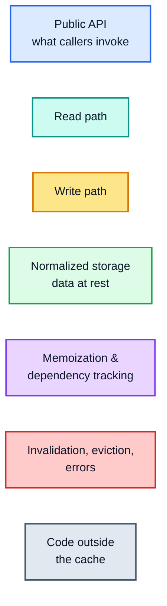
```mermaid
flowchart LR
    A["Public API<br/>what callers invoke"]:::api
    B["Read path"]:::read
    C["Write path"]:::write
    D["Normalized storage<br/>data at rest"]:::store
    E["Memoization &amp;<br/>dependency tracking"]:::memo
    F["Invalidation, eviction,<br/>errors"]:::dirty
    G["Code outside<br/>the cache"]:::ext

    classDef api fill:#dbeafe,stroke:#2563eb,stroke-width:2px,color:#0f172a
    classDef read fill:#ccfbf1,stroke:#0d9488,stroke-width:2px,color:#0f172a
    classDef write fill:#fde68a,stroke:#d97706,stroke-width:2px,color:#0f172a
    classDef store fill:#dcfce7,stroke:#16a34a,stroke-width:2px,color:#0f172a
    classDef memo fill:#e9d5ff,stroke:#7c3aed,stroke-width:2px,color:#0f172a
    classDef dirty fill:#fecaca,stroke:#dc2626,stroke-width:2px,color:#0f172a
    classDef ext fill:#e2e8f0,stroke:#475569,stroke-width:2px,color:#0f172a
```

Arrow conventions: a **solid arrow** is a synchronous call or a data hand-off; a
**dotted arrow** is a dependency registration or an invalidation signal.

---

## Part 0 — Orientation

### 0.1 The one-paragraph mental model

`InMemoryCache` is a **normalizing, dependency-tracking, layered document store for GraphQL
results**. Writes shred a response tree into a flat map of entities keyed by a stable
identity (`Todo:3`), replacing every identifiable child object with a `{ __ref }` pointer.
Reads walk a GraphQL selection set over that flat map and re-assemble a response-shaped
tree, memoizing every subtree keyed by `(selectionSet, parentEntity, variables)` and
recording exactly which `(entityId, fieldName)` pairs each memoized subtree consumed.
When a write changes a field, only the memoized subtrees that recorded a dependency on
that field are invalidated, so re-reading is proportional to what actually changed rather
than to the size of the query. Optimistic updates are a linked list of copy-on-write
layers stacked above the durable root, so they can be rolled back without touching
server data.

The [Demystifying Cache Normalization](https://www.apollographql.com/blog/demystifying-cache-normalization)
blog post describes the first sentence. This document covers the rest — the parts that
make the cache fast, reactive, and transactional.

### 0.2 The blog's example, as the cache actually stores it

The blog says the cache "splits results into objects, assigns identifiers, and stores them
flat". Here is the literal `cache.extract()` output for its `GetAllTodos` example, taken
from [section 1 of the probe](./probes/cache-behavior-probe.mjs):

```jsonc
{
  "Todo:1": { "__typename": "Todo", "id": 1, "text": "First todo",  "completed": true  },
  "Todo:2": { "__typename": "Todo", "id": 2, "text": "Second todo", "completed": false },
  "Todo:3": { "__typename": "Todo", "id": 3, "text": "Third todo",  "completed": false },
  "ROOT_QUERY": {
    "__typename": "Query",
    "todos": [{ "__ref": "Todo:1" }, { "__ref": "Todo:2" }, { "__ref": "Todo:3" }]
  }
}
```

And after the blog's `EditTodo` mutation, the mutation root records the operation under an
**argument-encoded field key**, while `Todo:3` is merged in place:

```jsonc
{
  "ROOT_MUTATION": {
    "__typename": "Mutation",
    "editTodo({\"id\":3,\"text\":\"Best todo\"})": {
      "__typename": "EditTodoResponse",
      "todo": { "__ref": "Todo:3" }
    }
  },
  "Todo:3": { "__typename": "Todo", "id": 3, "text": "Best todo", "completed": false }
}
```

Three things the blog does not mention are already visible here, and each is load-bearing
for the rest of this document:

1. `editTodo(...)` is a **`storeFieldName`**, not a field name. Arguments are serialised
   into the key by `canonicalStringify` so that key order in variables cannot produce two
   different entries for the same logical field ([§3.3](#33-field-identity-getstorefieldname)).
2. `EditTodoResponse` has no `id`, so it is **not** normalized. It is stored inline inside
   `ROOT_MUTATION` as a nested `StoreObject`. Only identifiable objects get hoisted
   ([§3.2](#32-entity-identity-policiesidentify)).
3. Every write **retains** the root id it wrote to, which is what keeps entities alive
   through garbage collection ([§2.9](#29-garbage-collection)).

### 0.3 File map

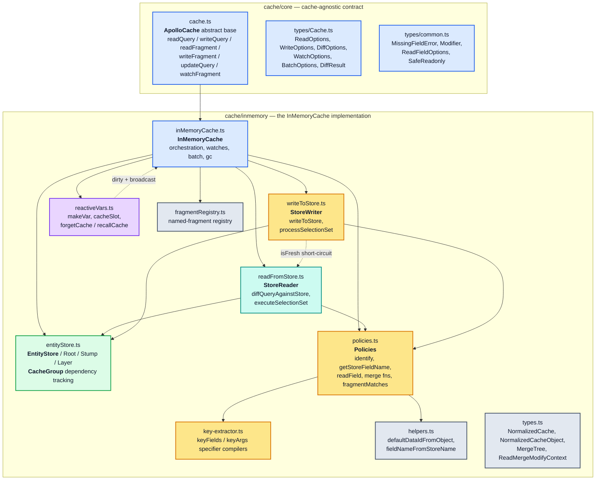
```mermaid
flowchart TB
    subgraph core["cache/core — cache-agnostic contract"]
        CACHE["cache.ts<br/><b>ApolloCache</b> abstract base<br/>readQuery / writeQuery / readFragment /<br/>writeFragment / updateQuery / watchFragment"]:::api
        CTYPES["types/Cache.ts<br/>ReadOptions, WriteOptions, DiffOptions,<br/>WatchOptions, BatchOptions, DiffResult"]:::api
        COMMON["types/common.ts<br/>MissingFieldError, Modifier,<br/>ReadFieldOptions, SafeReadonly"]:::api
    end

    subgraph inmem["cache/inmemory — the InMemoryCache implementation"]
        IMC["inMemoryCache.ts<br/><b>InMemoryCache</b><br/>orchestration, watches, batch, gc"]:::api
        ES["entityStore.ts<br/><b>EntityStore</b> / Root / Stump / Layer<br/><b>CacheGroup</b> dependency tracking"]:::store
        POL["policies.ts<br/><b>Policies</b><br/>identify, getStoreFieldName,<br/>readField, merge fns, fragmentMatches"]:::write
        KEX["key-extractor.ts<br/>keyFields / keyArgs specifier compilers"]:::write
        RD["readFromStore.ts<br/><b>StoreReader</b><br/>diffQueryAgainstStore,<br/>executeSelectionSet"]:::read
        WR["writeToStore.ts<br/><b>StoreWriter</b><br/>writeToStore,<br/>processSelectionSet"]:::write
        RV["reactiveVars.ts<br/>makeVar, cacheSlot,<br/>forgetCache / recallCache"]:::memo
        FR["fragmentRegistry.ts<br/>named-fragment registry"]:::ext
        HLP["helpers.ts<br/>defaultDataIdFromObject,<br/>fieldNameFromStoreName"]:::ext
        TY["types.ts<br/>NormalizedCache, NormalizedCacheObject,<br/>MergeTree, ReadMergeModifyContext"]:::ext
    end

    CACHE --> IMC
    IMC --> ES
    IMC --> POL
    IMC --> RD
    IMC --> WR
    IMC --> RV
    IMC --> FR
    POL --> KEX
    POL --> HLP
    RD --> ES
    RD --> POL
    WR --> ES
    WR --> POL
    WR -.->|"isFresh short-circuit"| RD
    RV -.->|"dirty + broadcast"| IMC

    classDef api fill:#dbeafe,stroke:#2563eb,stroke-width:2px,color:#0f172a
    classDef read fill:#ccfbf1,stroke:#0d9488,stroke-width:2px,color:#0f172a
    classDef write fill:#fde68a,stroke:#d97706,stroke-width:2px,color:#0f172a
    classDef store fill:#dcfce7,stroke:#16a34a,stroke-width:2px,color:#0f172a
    classDef memo fill:#e9d5ff,stroke:#7c3aed,stroke-width:2px,color:#0f172a
    classDef ext fill:#e2e8f0,stroke:#475569,stroke-width:2px,color:#0f172a
```

| File | Lines | Responsibility |
| --- | ---: | --- |
| `cache/core/cache.ts` | 934 | The `ApolloCache` contract plus the concrete convenience layer (`readQuery`, `writeFragment`, `updateQuery`, `watchFragment`) that every cache inherits. |
| `cache/core/types/Cache.ts` | 410 | Option and result types for the abstract methods. |
| `cache/core/types/common.ts` | 135 | `MissingFieldError`, `Modifier`, `ReadFieldOptions`. |
| `cache/inmemory/inMemoryCache.ts` | 610 | Orchestration only. Holds `data`/`optimisticData`, the watch set, `txCount`, and the `maybeBroadcastWatch` memoizer. Delegates all real work. |
| `cache/inmemory/entityStore.ts` | 883 | The normalized store, the layer chain, and the dependency graph. |
| `cache/inmemory/policies.ts` | 1216 | Every configuration-driven decision: identity, field keys, read/merge functions, fragment matching. |
| `cache/inmemory/key-extractor.ts` | 270 | Compiles `keyFields`/`keyArgs` specifier arrays into functions. |
| `cache/inmemory/readFromStore.ts` | 507 | The memoized read path. |
| `cache/inmemory/writeToStore.ts` | 967 | The two-phase write path. |
| `cache/inmemory/reactiveVars.ts` | 123 | `makeVar` and the cache↔variable attachment registry. |
| `cache/inmemory/fragmentRegistry.ts` | 179 | Optional registry so documents can reference fragments they don't declare. |
| `cache/inmemory/helpers.ts` | 151 | Small shared predicates and the default id function. |

### 0.4 Vocabulary

These terms are used with precision throughout. Confusing `fieldName` with
`storeFieldName`, or `dataId` with `Reference`, makes the rest of the code unreadable.

| Term | Type | Definition | Example |
| --- | --- | --- | --- |
| **`dataId`** | `string` | The cache-wide unique key of an entity. Produced by `Policies.identify`. | `"Todo:3"`, `"ROOT_QUERY"` |
| **`Reference`** | `{ __ref: string }` | A pointer to a `dataId`. The only way one entity refers to another. | `{ __ref: "Todo:3" }` |
| **`StoreObject`** | `Record<string, StoreValue>` | The flat, per-entity record. Values are scalars, `Reference`s, arrays, or nested non-normalized objects. | `{ __typename: "Todo", id: 3, text: "…" }` |
| **`StoreValue`** | union | Anything storable in a `StoreObject` field. | `3`, `{ __ref }`, `[{ __ref }]` |
| **`NormalizedCacheObject`** | `Record<dataId, StoreObject>` | The whole serializable store, plus an optional `__META`. | see §0.2 |
| **`fieldName`** | `string` | The GraphQL field name, without arguments. | `"feed"` |
| **`storeFieldName`** | `string` | The key actually used inside a `StoreObject`: `fieldName` plus a serialised argument/key suffix. | `feed({"type":"top"})` |
| **`resultKeyName`** | `string` | The key used in the *result* object — the alias if present, otherwise `fieldName`. Never appears in the store. | `"topFeed"` for `topFeed: feed(...)` |
| **`selectionSet`** | AST node | A `SelectionSetNode`. Used as an identity-comparable memoization key, so AST stability matters. | — |
| **`varString`** | `string` | `canonicalStringify(variables)`. Part of every read memo key. | `'{"limit":10}'` |
| **`layer`** | `EntityStore` | One copy-on-write frame of optimistic data. | — |
| **`CacheGroup`** | class | The dependency-tracking scope. Exactly two exist per cache: root and optimistic. | — |
| **`dep key`** | `string` | `storeFieldName + "#" + dataId` — the atom of the dependency graph. | `text#Todo:3` |

### 0.5 The whole machine in one diagram

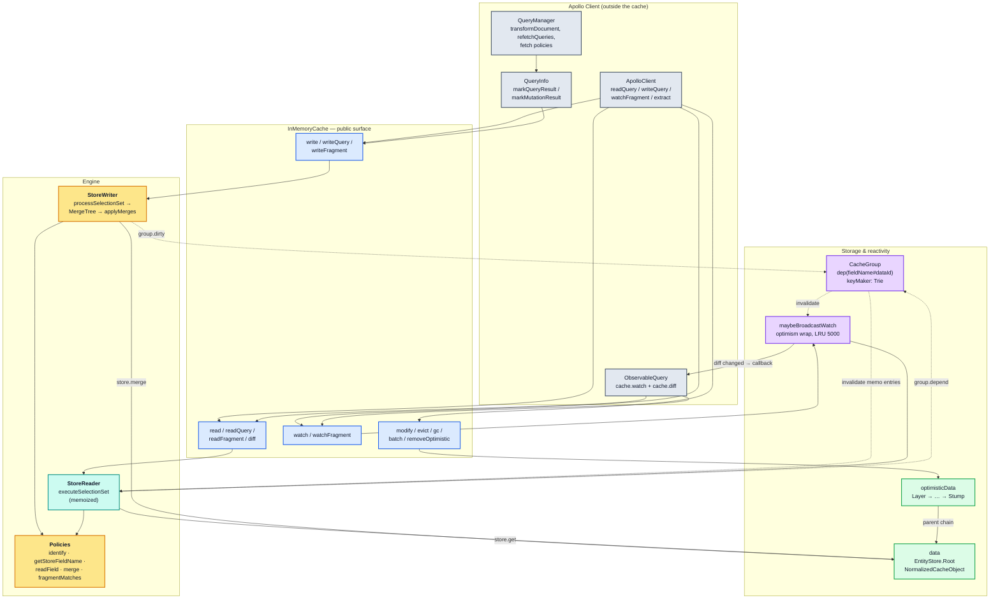
```mermaid
flowchart TB
    subgraph client["Apollo Client (outside the cache)"]
        direction LR
        AC["ApolloClient<br/>readQuery / writeQuery /<br/>watchFragment / extract"]:::ext
        QM["QueryManager<br/>transformDocument, refetchQueries,<br/>fetch policies"]:::ext
        OQ["ObservableQuery<br/>cache.watch + cache.diff"]:::ext
        QI["QueryInfo<br/>markQueryResult /<br/>markMutationResult"]:::ext
    end

    subgraph api["InMemoryCache — public surface"]
        direction LR
        W["write / writeQuery /<br/>writeFragment"]:::api
        R["read / readQuery /<br/>readFragment / diff"]:::api
        WATCH["watch / watchFragment"]:::api
        MUT["modify / evict / gc /<br/>batch / removeOptimistic"]:::api
    end

    subgraph engine["Engine"]
        direction TB
        SW["<b>StoreWriter</b><br/>processSelectionSet →<br/>MergeTree → applyMerges"]:::write
        SR["<b>StoreReader</b><br/>executeSelectionSet<br/>(memoized)"]:::read
        P["<b>Policies</b><br/>identify · getStoreFieldName ·<br/>readField · merge · fragmentMatches"]:::write
    end

    subgraph storage["Storage &amp; reactivity"]
        direction TB
        OD["optimisticData<br/>Layer → … → Stump"]:::store
        D["data<br/>EntityStore.Root<br/>NormalizedCacheObject"]:::store
        CG["CacheGroup<br/>dep(fieldName#dataId)<br/>keyMaker: Trie"]:::memo
        MBW["maybeBroadcastWatch<br/>optimism wrap, LRU 5000"]:::memo
    end

    AC --> W & R & WATCH & MUT
    QM --> QI --> W
    OQ --> WATCH
    OQ --> R

    W --> SW --> P
    R --> SR --> P
    SW -->|"store.merge"| D
    SW -.->|"group.dirty"| CG
    SR -->|"store.get"| D
    SR -.->|"group.depend"| CG
    OD -->|"parent chain"| D
    MUT --> OD

    CG -.->|"invalidate memo entries"| SR
    CG -.->|"invalidate"| MBW
    WATCH --> MBW --> SR
    MBW -->|"diff changed → callback"| OQ

    classDef api fill:#dbeafe,stroke:#2563eb,stroke-width:2px,color:#0f172a
    classDef read fill:#ccfbf1,stroke:#0d9488,stroke-width:2px,color:#0f172a
    classDef write fill:#fde68a,stroke:#d97706,stroke-width:2px,color:#0f172a
    classDef store fill:#dcfce7,stroke:#16a34a,stroke-width:2px,color:#0f172a
    classDef memo fill:#e9d5ff,stroke:#7c3aed,stroke-width:2px,color:#0f172a
    classDef ext fill:#e2e8f0,stroke:#475569,stroke-width:2px,color:#0f172a
```

The single most important structural fact in that diagram is the **dotted triangle**:
`StoreReader` *registers* dependencies in the `CacheGroup` while reading, `StoreWriter`
*dirties* them while writing, and the `CacheGroup` *invalidates* memoized read results and
watch broadcasts. Everything else is plumbing around that loop.

---

## Part 1 — Foundations

The cache is built on five small primitives. None of them are GraphQL-aware, and all of
them are load-bearing for correctness — not just performance. Re-implementing the cache
without equivalents for these is not possible.

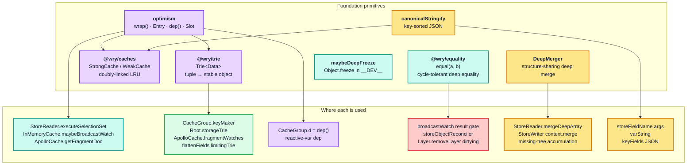
```mermaid
flowchart TB
    subgraph prims["Foundation primitives"]
        OPT["<b>optimism</b><br/>wrap() · Entry · dep() · Slot"]:::memo
        TRIE["<b>@wry/trie</b><br/>Trie&lt;Data&gt;<br/>tuple → stable object"]:::memo
        LRU["<b>@wry/caches</b><br/>StrongCache / WeakCache<br/>doubly-linked LRU"]:::memo
        EQ["<b>@wry/equality</b><br/>equal(a, b)<br/>cycle-tolerant deep equality"]:::read
        DM["<b>DeepMerger</b><br/>structure-sharing deep merge"]:::write
        CS["<b>canonicalStringify</b><br/>key-sorted JSON"]:::write
        FRZ["<b>maybeDeepFreeze</b><br/>Object.freeze in __DEV__"]:::read
    end

    OPT --> TRIE
    OPT --> LRU
    CS --> LRU

    subgraph uses["Where each is used"]
        U1["StoreReader.executeSelectionSet<br/>InMemoryCache.maybeBroadcastWatch<br/>ApolloCache.getFragmentDoc"]:::read
        U2["CacheGroup.keyMaker<br/>Root.storageTrie<br/>ApolloCache.fragmentWatches<br/>flattenFields limitingTrie"]:::store
        U3["CacheGroup.d = dep()<br/>reactive-var dep"]:::memo
        U4["broadcastWatch result gate<br/>storeObjectReconciler<br/>Layer.removeLayer dirtying"]:::dirty
        U5["StoreReader.mergeDeepArray<br/>StoreWriter context.merge<br/>missing-tree accumulation"]:::write
        U6["storeFieldName args<br/>varString<br/>keyFields JSON"]:::write
    end

    OPT --> U1
    OPT --> U3
    TRIE --> U2
    EQ --> U4
    DM --> U5
    CS --> U6

    classDef read fill:#ccfbf1,stroke:#0d9488,stroke-width:2px,color:#0f172a
    classDef write fill:#fde68a,stroke:#d97706,stroke-width:2px,color:#0f172a
    classDef store fill:#dcfce7,stroke:#16a34a,stroke-width:2px,color:#0f172a
    classDef memo fill:#e9d5ff,stroke:#7c3aed,stroke-width:2px,color:#0f172a
    classDef dirty fill:#fecaca,stroke:#dc2626,stroke-width:2px,color:#0f172a
```

### 1.1 `optimism` — memoization with automatic dependency tracking

`optimism@0.18.1` provides the reactive core. Two exports matter.

#### `wrap(fn, options)` → memoized function

`wrap` returns a function that caches results in an LRU keyed by
`makeCacheKey(keyArgs(...args))`. The crucial difference from ordinary memoization is that
each cached result is an **`Entry` node in a bipartite dependency graph**, and entries
recompute lazily when anything they read has been marked dirty.

```ts
// node_modules/optimism/src/index.ts
const optimistic = function (): TResult {
  const key = makeCacheKey.apply(null, keyArgs ? keyArgs.apply(null, arguments) : arguments);
  if (key === void 0) {
    return originalFunction.apply(null, arguments);   // memoization opted out
  }
  let entry = cache.get(key)!;
  if (!entry) {
    cache.set(key, entry = new Entry(originalFunction));
    // ...
  }
  const value = entry.recompute(Array.prototype.slice.call(arguments) as TArgs);
  cache.set(key, entry);                              // LRU: move to front
  // ...
  return value;
};
```

Note the first branch: **returning `undefined` from `makeCacheKey` disables memoization for
that call**. The cache uses this deliberately — `StoreReader`'s `makeCacheKey` returns
`undefined` when `supportsResultCaching(context.store)` is false, which is how
`resultCaching: false` is implemented without a second code path.

#### `Entry` — the dependency graph

```ts
// node_modules/optimism/src/entry.ts
export class Entry<TArgs extends any[], TValue> {
  public readonly parents = new Set<AnyEntry>();
  public readonly childValues = new Map<AnyEntry, Value<any>>();
  public dirtyChildren: Set<AnyEntry> | null = null;
  public dirty = true;
  public readonly value: Value<TValue> = [];

  public recompute(args: TArgs): TValue {
    assert(! this.recomputing, "already recomputing");
    rememberParent(this);
    return mightBeDirty(this) ? reallyRecompute(this, args) : valueGet(this.value);
  }
}
```

The mechanics that matter for the cache:

- **`parentEntrySlot`** is a dynamically-scoped variable holding the entry currently being
  recomputed. `rememberParent(child)` reads it, so any `wrap`ped call made *inside* another
  `wrap`ped call automatically becomes its child. **No explicit dependency wiring exists
  anywhere in the cache** — nesting is the wiring.
- **`setDirty()`** flips `dirty` and propagates *upward only* via `reportDirtyChild`,
  which returns early once a parent already knows it has a dirty child. Marking is
  therefore near-`O(1)` amortised, and recomputation is deferred to the next read.
- **`reportCleanChild`** is the subtle part. When a dirty child recomputes to a value that
  is `===` its previously recorded value, the parent is *not* dirtied:

  ```ts
  const childValue = parent.childValues.get(child)!;
  if (childValue.length === 0) {
    parent.childValues.set(child, valueCopy(child.value));
  } else if (! valueIs(childValue, child.value)) {
    parent.setDirty();
  }
  ```

  This is why a write that produces a deeply-equal value stops propagating at the first
  memoized frame instead of invalidating everything above it — and why
  `storeObjectReconciler` ([§2.6](#26-writes-merge-and-storeobjectreconciler)) works so
  hard to preserve `===`.

#### `dep()` — dependency leaves

```ts
// node_modules/optimism/src/dep.ts
export function dep<TKey>(options?: { subscribe: Dep<TKey>["subscribe"] }) {
  const depsByKey = new Map<TKey, Dep<TKey>>();
  function depend(key: TKey) {
    const parent = parentEntrySlot.getValue();
    if (parent) {
      let dep = depsByKey.get(key);
      if (!dep) depsByKey.set(key, dep = new Set as Dep<TKey>);
      parent.dependOn(dep);
      // ...
    }
  }
  depend.dirty = function dirty(key: TKey, entryMethodName?: EntryMethodName) {
    const dep = depsByKey.get(key);
    if (dep) {
      const m = (entryMethodName && hasOwnProperty.call(EntryMethods, entryMethodName))
        ? entryMethodName : "setDirty";
      arrayFromSet(dep).forEach(entry => entry[m]());
      depsByKey.delete(key);
      maybeUnsubscribe(dep);
    }
  };
  return depend as OptimisticDependencyFunction<TKey>;
}
```

A `dep` is a leaf in the graph: it has parents but no value and no children. `CacheGroup`
owns exactly one `dep` instance and uses field-level string keys
([§2.4](#24-cachegroup--the-dependency-graph)).

`dirty(key, method)` supports three escalation levels, all used by the cache:

| Method | Effect | Used for |
| --- | --- | --- |
| `setDirty` (default) | Mark entries stale; they stay in the LRU and keep their edges. | Ordinary field changes. |
| `dispose` | Detach the entry from parents/children but leave it in the LRU. | not used by the cache |
| `forget` | Fully remove the entry from the LRU and the graph. | `__exists` dirtying — see [§2.4](#24-cachegroup--the-dependency-graph). |

`depsByKey.delete(key)` after dirtying means dependency sets are **rebuilt on the next
read**, so the graph stays proportional to what is currently being observed.

#### `Slot` — dynamic scoping

`cacheSlot` ([§6.6](#66-reactive-variables)) and `parentEntrySlot` are `Slot` instances.
`slot.withValue(v, fn, args)` runs `fn` with `slot.getValue() === v`, restoring the
previous value afterwards. This is how a `read` function invoked several frames deep
inside `executeSelectionSet` can discover which cache it belongs to without threading it
through every signature.

### 1.2 `@wry/trie` — tuples as stable object identities

```ts
// node_modules/@wry/trie/src/index.ts
export class Trie<Data> {
  private weak?: WeakMap<any, Trie<Data>>;
  private strong?: Map<any, Trie<Data>>;
  private data?: Data;
  constructor(private weakness = true, private makeData: (array: any[]) => Data = defaultMakeData) {}

  public lookupArray<T extends IArguments | any[]>(array: T): Data {
    let node: Trie<Data> = this;
    forEach.call(array, key => node = node.getChildTrie(key));
    return hasOwnProperty.call(node, "data") ? node.data as Data : node.data = this.makeData(slice.call(array));
  }
}
```

`trie.lookupArray([a, b, c])` returns the *same object* every time it is called with the
same three values, comparing them by `===`. Object keys are held in a `WeakMap` (when
`weakness` is on) and primitives in a `Map`, so a trie can mix both.

This turns an argument tuple into a single identity usable as a `Map` key, which is what
makes `optimism` cache keys cheap. Five tries exist in the cache:

| Trie | Owner | Key tuple | Weak? |
| --- | --- | --- | --- |
| `keyMaker` | `CacheGroup` | varies per call site (see the `makeCacheKey` overloads) | yes |
| `storageTrie` | `EntityStore.Root` | `[entityIdOrObject, ...storeFieldNames]` | yes |
| `fragmentWatches` | `ApolloCache` | `[fragmentQueryDoc, canonicalStringify({id, optimistic, variables})]` | yes |
| `limitingTrie` | `StoreWriter.flattenFields` (per call) | `[selectionSet, clientOnly, deferred]` | **no** |
| `defaultKeyTrie` | `optimism` module-global | raw arguments | yes |

`CacheGroup.keyMaker` is declared with three typed overloads, which is the cleanest
inventory of what actually gets memoized in the read path:

```ts
// cache/inmemory/entityStore.ts — EntityStore#makeCacheKey
/** overload for `InMemoryCache.maybeBroadcastWatch` */
public makeCacheKey(document: DocumentNode, callback: Cache.WatchCallback<any>, details: string): object;
/** overload for `StoreReader.executeSelectionSet` */
public makeCacheKey(selectionSet: SelectionSetNode, parent: string | StoreObject, varString: string | undefined): object;
/** overload for `StoreReader.executeSubSelectedArray` */
public makeCacheKey(field: FieldNode, array: readonly any[], varString: string | undefined): object;
public makeCacheKey() { return this.group.keyMaker.lookupArray(arguments); }
```

Because `keyMaker` lives on the `CacheGroup`, and `resetCaching()` replaces it with a fresh
`Trie`, discarding a group's memo keys is a single pointer assignment.

### 1.3 `@wry/caches` — the LRU behind every memo

`StrongCache` and `WeakCache` are LRU maps built on a `Map`/`WeakMap` plus a doubly-linked
recency list. `WeakCache` additionally holds keys through `WeakRef` and deregisters
entries via `FinalizationRegistry`, so a memo keyed by a `DocumentNode` cannot pin that
document in memory.

Eviction is *not* eager. `wrap` only calls `cache.clean()` when no computation is in
flight:

```ts
// node_modules/optimism/src/index.ts
if (! parentEntrySlot.hasValue()) {
  caches.forEach(cache => cache.clean());
  caches.clear();
}
```

so a deep recursive read never has entries evicted out from under it mid-traversal.
`dispose` is wired to `entry.dispose()`, so evicting a memo entry dirties its parents —
eviction is a correctness-preserving operation, just a slow one.

Default sizes (`utilities/caching/sizes.ts`) are worth memorising, because they define the
working-set assumptions of the whole cache:

```ts
export const enum defaultCacheSizes {
  // ...
  canonicalStringify = 1000,
  "cache.fragmentQueryDocuments" = 1000,
  "inMemoryCache.maybeBroadcastWatch" = 5000,
  "inMemoryCache.executeSelectionSet" = 50000,
  "inMemoryCache.executeSubSelectedArray" = 10000,
}
```

### 1.4 `@wry/equality` — the change detector

`equal(a, b)` is a cycle-tolerant structural comparison. Three of its behaviours have
direct consequences in the cache:

- **`undefined`-valued keys are ignored.** `definedKeys` filters them out before comparing
  key counts, so `{ a: 1 }` and `{ a: 1, b: undefined }` are equal. This is why a Layer
  tombstone (`field: undefined`) does not spuriously differ from an absent field during
  `Layer.removeLayer` dirtying.
- **Non-native functions with identical source are equal.** Relevant when field policies
  end up inside compared values.
- **Termination on cycles** is guaranteed by a module-level `previousComparisons` map that
  is cleared in a `finally`.

The cache calls `equal` in exactly four places, and each is a *gate*, not a computation:

| Call site | Purpose |
| --- | --- |
| `storeObjectReconciler` | Preserve `===` when a written value matches what is stored. |
| `InMemoryCache.broadcastWatch` | Suppress a watcher callback when the recomputed diff is unchanged. |
| `Layer.removeLayer` | Dirty only the fields whose value will actually change on rollback. |
| `Policies.runMergeFunction` | Reuse a previous `@stream` merge result. |

### 1.5 `DeepMerger` — merging with maximal structure sharing

```ts
// utilities/internal/DeepMerger.ts
public merge(target: any, source: any, mergeOptions: DeepMerger.MergeOptions = {}): any {
  // ... atPath / array-truncation handling elided ...
  if (isNonNullObject(source) && isNonNullObject(target)) {
    Object.keys(source).forEach((sourceKey) => {
      if (hasOwnProperty.call(target, sourceKey)) {
        const targetValue = target[sourceKey];
        if (source[sourceKey] !== targetValue) {
          const result = this.reconciler(target, source, sourceKey);
          // A well-implemented reconciler may return targetValue to indicate
          // the merge changed nothing about the structure of the target.
          if (result !== targetValue) {
            target = this.shallowCopyForMerge(target);
            target[sourceKey] = result;
          }
        }
      } else {
        // If there is no collision, the target can safely share memory with
        // the source, and the recursion can terminate here.
        target = this.shallowCopyForMerge(target);
        target[sourceKey] = source[sourceKey];
      }
    });
    return target;
  }
  return source;
}
```

Three properties the cache depends on:

1. **Copy-on-write.** `target` is only shallow-copied when a key actually changes, so an
   unchanged merge returns the original object by identity.
2. **`pastCopies`** ensures each object is copied at most once per `DeepMerger` instance,
   which is why the writer allocates one merger per write
   (`makeProcessedFieldsMerger()`) and reuses it across the whole traversal.
3. **A pluggable `reconciler`** lets `EntityStore.merge` swap the default recursive merge
   for `storeObjectReconciler`, turning a deep merge into a *shallow field-wise* merge with
   an equality escape hatch.

`mergeDeepArray(sources)` folds a list with one shared merger. `StoreReader` uses it to
assemble a result object from one single-key object per field.

### 1.6 `canonicalStringify` — deterministic keys

```ts
// utilities/internal/canonicalStringify.ts
function stableObjectReplacer(key: string, value: any) {
  if (value && typeof value === "object") {
    const proto = Object.getPrototypeOf(value);
    if (proto === Object.prototype || proto === null) {
      const keys = Object.keys(value);
      if (keys.every(everyKeyInOrder)) return value;   // already sorted: no allocation
      const unsortedKey = JSON.stringify(keys);
      let sortedKeys = sortingMap.get(unsortedKey);
      // ...
    }
  }
  return value;
}
```

It is `JSON.stringify` with a replacer that emits object keys in sorted order, memoizing
*key-set permutations* (not values) in an LRU of 1000 entries. It is what makes
`feed({"limit":10,"type":"top"})` independent of the order the caller wrote the variables,
verified by the probe:

```
--- argument canonicalisation ---
{
  "unsortedInput": ["__typename", "search({\"where\":{\"a\":1,\"b\":2}})"],
  "sortedInput":   ["__typename", "search({\"where\":{\"a\":1,\"b\":2}})"]
}
  [PASS] canonicalStringify sorts nested argument keys so both writes collide
```

Non-plain objects (class instances, `Date`) are passed through untouched, so a `Date` in
variables serialises via its own `toJSON`.

### 1.7 `maybeDeepFreeze` — the immutability contract

```ts
export function maybeDeepFreeze<T>(obj: T): T {
  if (__DEV__) { deepFreeze(obj); }
  return obj;
}
```

`InMemoryCache` sets `assumeImmutableResults = true` (overriding the `ApolloCache` default
of `false`). The contract is: **read results and stored values are logically immutable**,
enforced with `Object.freeze` in development and merely assumed in production. Consumers
may therefore compare results with `===` instead of deep equality.

The write path pays for this contract with `cloneDeep`: because a scalar value from a user
result object may later be frozen when it is read back, the writer defensively clones
scalars in development so the caller's own object is never frozen:

```ts
// cache/inmemory/writeToStore.ts — StoreWriter#processFieldValue
if (!field.selectionSet || value === null) {
  // In development, we need to clone scalar values so that they can be
  // safely frozen with maybeDeepFreeze in readFromStore.ts. In production,
  // it's cheaper to store the scalar values directly in the cache.
  return __DEV__ ? cloneDeep(value) : value;
}
```

The probe confirms both halves of the contract (section 15): read results are deeply
frozen, and the caller's input object is not.

---

## Part 2 — The normalized store

`entityStore.ts` contains four classes and one free-standing dependency tracker. This is
where all state lives; `InMemoryCache` itself holds almost nothing.

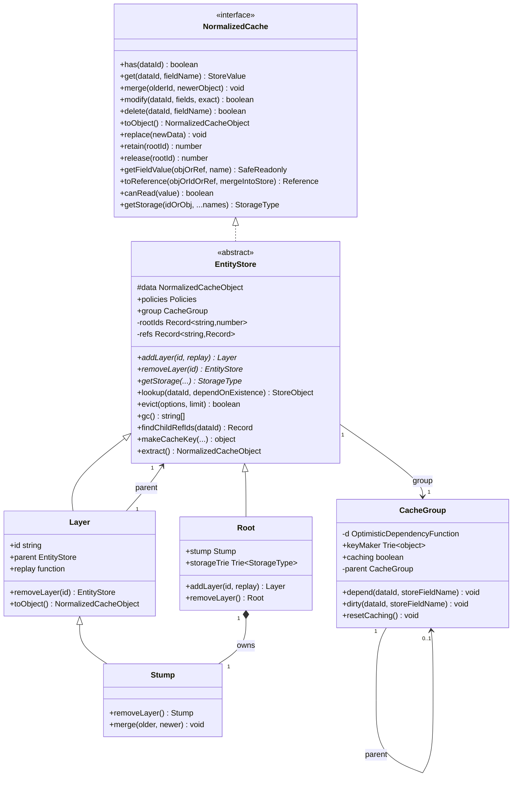
```mermaid
classDiagram
    class NormalizedCache {
        <<interface>>
        +has(dataId) boolean
        +get(dataId, fieldName) StoreValue
        +merge(olderId, newerObject) void
        +modify(dataId, fields, exact) boolean
        +delete(dataId, fieldName) boolean
        +toObject() NormalizedCacheObject
        +replace(newData) void
        +retain(rootId) number
        +release(rootId) number
        +getFieldValue(objOrRef, name) SafeReadonly
        +toReference(objOrIdOrRef, mergeIntoStore) Reference
        +canRead(value) boolean
        +getStorage(idOrObj, ...names) StorageType
    }
    class EntityStore {
        <<abstract>>
        #data NormalizedCacheObject
        +policies Policies
        +group CacheGroup
        -rootIds Record~string,number~
        -refs Record~string,Record~
        +addLayer(id, replay)* Layer
        +removeLayer(id)* EntityStore
        +getStorage(...)* StorageType
        +lookup(dataId, dependOnExistence) StoreObject
        +evict(options, limit) boolean
        +gc() string[]
        +findChildRefIds(dataId) Record
        +makeCacheKey(...) object
        +extract() NormalizedCacheObject
    }
    class Root {
        +stump Stump
        +storageTrie Trie~StorageType~
        +addLayer(id, replay) Layer
        +removeLayer() Root
    }
    class Layer {
        +id string
        +parent EntityStore
        +replay function
        +removeLayer(id) EntityStore
        +toObject() NormalizedCacheObject
    }
    class Stump {
        +removeLayer() Stump
        +merge(older, newer) void
    }
    class CacheGroup {
        -d OptimisticDependencyFunction
        +keyMaker Trie~object~
        +caching boolean
        -parent CacheGroup
        +depend(dataId, storeFieldName) void
        +dirty(dataId, storeFieldName) void
        +resetCaching() void
    }

    NormalizedCache <|.. EntityStore
    EntityStore <|-- Root
    EntityStore <|-- Layer
    Layer <|-- Stump
    Root "1" *-- "1" Stump : owns
    Layer "1" --> "1" EntityStore : parent
    EntityStore "1" --> "1" CacheGroup : group
    CacheGroup "1" --> "0..1" CacheGroup : parent
```

### 2.1 The layer chain

`InMemoryCache.init()` builds the initial two-node chain:

```ts
// cache/inmemory/inMemoryCache.ts
private init() {
  const rootStore = (this.data = new EntityStore.Root({
    policies: this.policies,
    resultCaching: this.config.resultCaching,
  }));
  // When no optimistic writes are currently active, cache.optimisticData ===
  // cache.data, so there are no additional layers on top of the actual data.
  // ...
  this.optimisticData = rootStore.stump;
  this.resetResultCache();
}
```

Read that comment carefully — it is slightly out of date. `optimisticData` is the
**`Stump`**, not the `Root`. The `Stump` is a permanently-installed empty `Layer` that
exists purely to own a *second* `CacheGroup`:

```ts
// cache/inmemory/entityStore.ts
class Stump extends Layer {
  constructor(root: Root) {
    super("EntityStore.Stump", root, () => {}, new CacheGroup(root.group.caching, root.group));
  }
  public removeLayer() { return this; }              // never removable
  public merge(older, newer) { return this.parent.merge(older, newer); }  // never stores
}
```

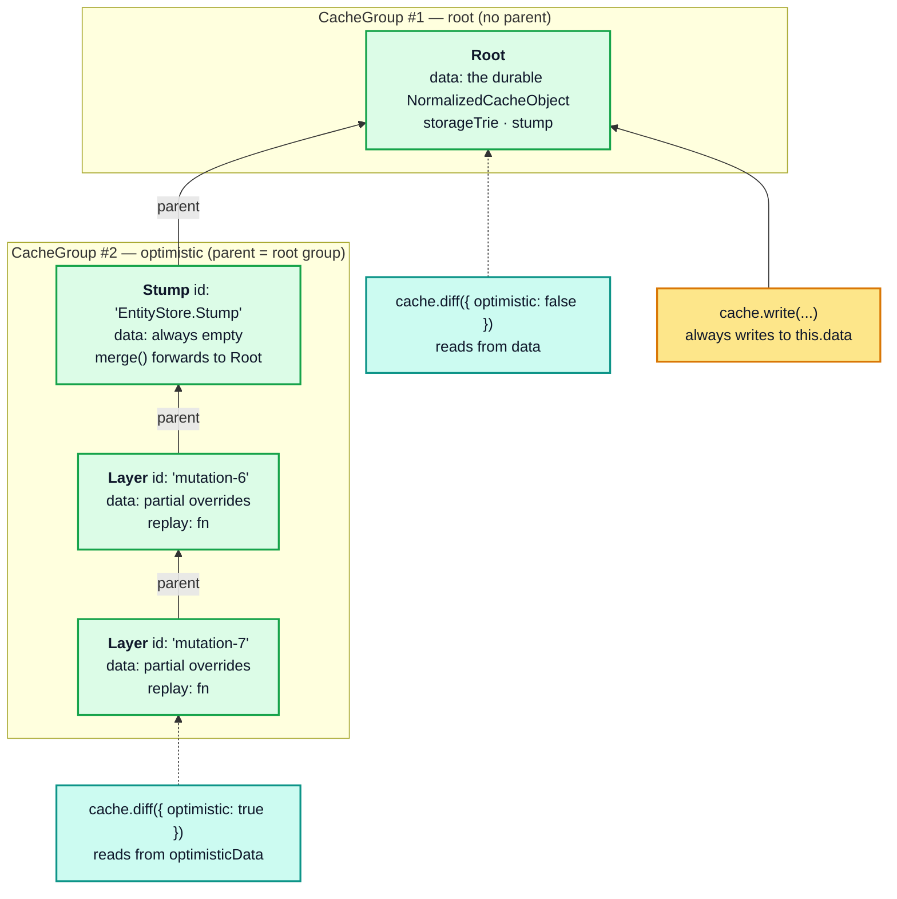
```mermaid
flowchart BT
    subgraph optimisticGroup["CacheGroup #2 — optimistic (parent = root group)"]
        direction BT
        L2["<b>Layer</b> id: 'mutation-7'<br/>data: partial overrides<br/>replay: fn"]:::store
        L1["<b>Layer</b> id: 'mutation-6'<br/>data: partial overrides<br/>replay: fn"]:::store
        ST["<b>Stump</b> id: 'EntityStore.Stump'<br/>data: always empty<br/>merge() forwards to Root"]:::store
    end
    subgraph rootGroup["CacheGroup #1 — root (no parent)"]
        RT["<b>Root</b><br/>data: the durable NormalizedCacheObject<br/>storageTrie · stump"]:::store
    end

    L2 -->|parent| L1 -->|parent| ST -->|parent| RT

    RD1["cache.diff({ optimistic: true })<br/>reads from optimisticData"]:::read -.-> L2
    RD2["cache.diff({ optimistic: false })<br/>reads from data"]:::read -.-> RT
    WRT["cache.write(...)<br/>always writes to this.data"]:::write --> RT

    classDef read fill:#ccfbf1,stroke:#0d9488,stroke-width:2px,color:#0f172a
    classDef write fill:#fde68a,stroke:#d97706,stroke-width:2px,color:#0f172a
    classDef store fill:#dcfce7,stroke:#16a34a,stroke-width:2px,color:#0f172a
```

Why the `Stump` exists at all: a `CacheGroup` is the invalidation scope, and optimistic and
non-optimistic reads must be invalidated independently. Without the `Stump`, optimistic
reads with zero active layers would register their dependencies in the root group,
polluting it. With it, `optimisticData` always has its own group even when nothing is
stacked, and layers added later share that same group
(`Layer.addLayer` passes `this.group` through), so the whole optimistic stack is one
invalidation scope no matter how deep it is.

> **Sharp edge.** `Stump.merge` forwards to the `Root`. So `cache.modify({ optimistic: true })`
> with **no active layers** mutates the durable root data, because `optimisticData` *is* the
> `Stump`. Optimistic isolation only exists inside `cache.batch({ optimistic: "someId" })`.

### 2.2 Reading a field through the chain

```ts
// cache/inmemory/entityStore.ts
public get(dataId: string, fieldName: string): StoreValue {
  this.group.depend(dataId, fieldName);
  if (hasOwn.call(this.data, dataId)) {
    const storeObject = this.data[dataId];
    if (storeObject && hasOwn.call(storeObject, fieldName)) {
      return storeObject[fieldName];
    }
  }
  if (fieldName === "__typename" && hasOwn.call(this.policies.rootTypenamesById, dataId)) {
    return this.policies.rootTypenamesById[dataId];
  }
  if (this instanceof Layer) {
    return this.parent.get(dataId, fieldName);
  }
}
```

Four behaviours packed into fifteen lines:

1. **`group.depend` runs first, unconditionally** — including for fields that turn out to
   be missing. Absence is a tracked dependency, so writing a previously-absent field
   correctly invalidates readers that observed it missing.
2. **Own-property checks, not truthiness.** A key present with value `undefined` **stops
   the lookup** and returns `undefined` without consulting the parent. That is the
   *tombstone* representation: a `Layer` deletes a field by storing `undefined` for it.
3. **Root `__typename` synthesis.** `ROOT_QUERY.__typename` resolves to `"Query"` even if
   nothing ever wrote it.
4. **Parent recursion** happens only for `Layer`s, so a chain of depth *d* costs at most
   *d* hash lookups.

`lookup(dataId, dependOnExistence?)` is the whole-object analogue. Its optional
`__exists` dependency is what `has()` uses:

```ts
protected lookup(dataId: string, dependOnExistence?: boolean): StoreObject | undefined {
  // The has method (above) calls lookup with dependOnExistence = true, so
  // that it can later be invalidated when we add or remove a StoreObject for
  // this dataId. Any consumer who cares about the contents of the StoreObject
  // should not rely on this dependency, since the contents could change
  // without the object being added or removed.
  if (dependOnExistence) this.group.depend(dataId, "__exists");
  if (hasOwn.call(this.data, dataId)) return this.data[dataId];
  if (this instanceof Layer) return this.parent.lookup(dataId, dependOnExistence);
  if (this.policies.rootTypenamesById[dataId]) return {};
}
```

The last line means `ROOT_QUERY`/`ROOT_MUTATION`/`ROOT_SUBSCRIPTION` always "exist" as
empty objects, which is why reading a never-written query yields "missing field" errors
rather than "dangling reference".

Three bound helpers are handed to user-supplied field policy functions and to
`StoreReader`:

```ts
public getFieldValue = <T = StoreValue>(objectOrReference, storeFieldName) =>
  maybeDeepFreeze(
    isReference(objectOrReference)
      ? this.get(objectOrReference.__ref, storeFieldName)
      : objectOrReference && objectOrReference[storeFieldName]
  ) as SafeReadonly<T>;

public canRead: CanReadFunction = (objOrRef) =>
  isReference(objOrRef) ? this.has(objOrRef.__ref) : typeof objOrRef === "object";

public toReference: ToReferenceFunction = (objOrIdOrRef, mergeIntoStore) => {
  if (typeof objOrIdOrRef === "string") return makeReference(objOrIdOrRef);
  if (isReference(objOrIdOrRef)) return objOrIdOrRef;
  const [id] = this.policies.identify(objOrIdOrRef);
  if (id) {
    const ref = makeReference(id);
    if (mergeIntoStore) this.merge(id, objOrIdOrRef);
    return ref;
  }
};
```

`canRead` is the dangling-reference filter: it is how `relayStylePagination`'s `read`
function drops edges whose nodes have been evicted, and how
`StoreReader.execSubSelectedArrayImpl` prunes arrays.

### 2.3 `NormalizedCacheObject` and `__META`

```ts
// cache/inmemory/types.ts
export interface NormalizedCacheObject {
  __META?: {
    // Well-known singleton IDs like ROOT_QUERY and ROOT_MUTATION are
    // always considered to be root IDs during cache.gc garbage
    // collection, but other IDs can become roots if they are written
    // directly with cache.writeFragment or retained explicitly with
    // cache.retain. When such IDs exist, we include them in the __META
    // section so that they can survive cache.{extract,restore}.
    extraRootIds: string[];
  };
  [dataId: string]: StoreObject | undefined;
}
```

`extract()` computes `__META` from the retainment table, and `replace()` re-retains them:

```ts
public extract(): NormalizedCacheObject {
  const obj = this.toObject();
  const extraRootIds: string[] = [];
  this.getRootIdSet().forEach((id) => {
    if (!hasOwn.call(this.policies.rootTypenamesById, id)) extraRootIds.push(id);
  });
  if (extraRootIds.length) obj.__META = { extraRootIds: extraRootIds.sort() };
  return obj;
}

public replace(newData: NormalizedCacheObject | null): void {
  Object.keys(this.data).forEach((dataId) => {
    if (!(newData && hasOwn.call(newData, dataId))) this.delete(dataId);
  });
  if (newData) {
    const { __META, ...rest } = newData;
    Object.keys(rest).forEach((dataId) => this.merge(dataId, rest[dataId] as StoreObject));
    if (__META) __META.extraRootIds.forEach(this.retain, this);
  }
}
```

Note that `replace` **merges** rather than assigns, so a restore over a non-empty store
unions the two. `InMemoryCache.restore` avoids that by calling `init()` first.

### 2.4 `CacheGroup` — the dependency graph

```ts
// cache/inmemory/entityStore.ts
class CacheGroup {
  private d: OptimisticDependencyFunction<string> | null = null;
  public keyMaker!: Trie<object>;

  constructor(public readonly caching: boolean, private parent: CacheGroup | null = null) {
    this.resetCaching();
  }

  public resetCaching() {
    this.d = this.caching ? dep<string>() : null;
    this.keyMaker = new Trie();
  }

  public depend(dataId: string, storeFieldName: string) {
    if (this.d) {
      this.d(makeDepKey(dataId, storeFieldName));
      const fieldName = fieldNameFromStoreName(storeFieldName);
      if (fieldName !== storeFieldName) {
        // Fields with arguments that contribute extra identifying
        // information to the fieldName (thus forming the storeFieldName)
        // depend not only on the full storeFieldName but also on the
        // short fieldName, so the field can be invalidated using either
        // level of specificity.
        this.d(makeDepKey(dataId, fieldName));
      }
      if (this.parent) { this.parent.depend(dataId, storeFieldName); }
    }
  }

  public dirty(dataId: string, storeFieldName: string) {
    if (this.d) {
      this.d.dirty(
        makeDepKey(dataId, storeFieldName),
        storeFieldName === "__exists" ? "forget" : "setDirty"
      );
    }
  }
}

function makeDepKey(dataId: string, storeFieldName: string) {
  // Since field names cannot have '#' characters in them, this method
  // of joining the field name and the ID should be unambiguous, and much
  // cheaper than JSON.stringify([dataId, fieldName]).
  return storeFieldName + "#" + dataId;
}
```

Four design decisions here deserve their own paragraph each.

**Two-level dependency keys.** Reading `feed({"type":"top"})` on `ROOT_QUERY` registers
*both* `feed({"type":"top"})#ROOT_QUERY` and `feed#ROOT_QUERY`. That lets
`cache.evict({ id: "ROOT_QUERY", fieldName: "feed" })` invalidate every argument variant
with a single dirty call, and it is why the probe shows a bare-`fieldName` eviction
removing all `feed(...)` keys.

**Parent chaining on `depend` only.** The optimistic group's parent is the root group, so
an optimistic read registers in *both* groups. But `dirty` never chains. The asymmetry
produces exactly the desired semantics:

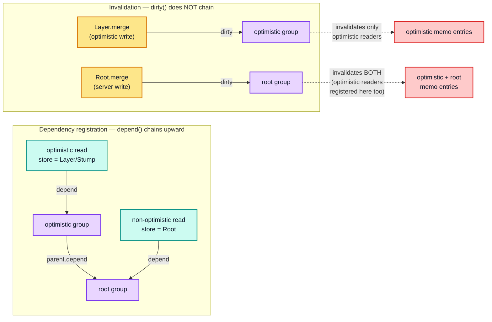
```mermaid
flowchart LR
    subgraph reads["Dependency registration — depend() chains upward"]
        ORD["optimistic read<br/>store = Layer/Stump"]:::read -->|depend| OG["optimistic group"]:::memo
        OG -->|"parent.depend"| RG["root group"]:::memo
        RRD["non-optimistic read<br/>store = Root"]:::read -->|depend| RG
    end
    subgraph writes["Invalidation — dirty() does NOT chain"]
        LW["Layer.merge<br/>(optimistic write)"]:::write -->|dirty| OG2["optimistic group"]:::memo
        RW["Root.merge<br/>(server write)"]:::write -->|dirty| RG2["root group"]:::memo
    end
    OG2 -.->|"invalidates only<br/>optimistic readers"| X1["optimistic memo entries"]:::dirty
    RG2 -.->|"invalidates BOTH<br/>(optimistic readers<br/>registered here too)"| X2["optimistic + root<br/>memo entries"]:::dirty

    classDef read fill:#ccfbf1,stroke:#0d9488,stroke-width:2px,color:#0f172a
    classDef write fill:#fde68a,stroke:#d97706,stroke-width:2px,color:#0f172a
    classDef memo fill:#e9d5ff,stroke:#7c3aed,stroke-width:2px,color:#0f172a
    classDef dirty fill:#fecaca,stroke:#dc2626,stroke-width:2px,color:#0f172a
```

A server write invalidates optimistic readers (they can see through to the root), while an
optimistic write leaves non-optimistic readers alone (they cannot see the layer). Exactly
right, and achieved with one `if (this.parent)`.

**`__exists` uses `forget`, not `setDirty`.** When an entity appears or disappears,
everything the memo layer believes about it is suspect, so the dependency set is removed
from the graph entirely rather than merely marked stale. The rationale is recorded in a
free function used by `StoreReader`:

```ts
export function maybeDependOnExistenceOfEntity(store: NormalizedCache, entityId: string) {
  if (supportsResultCaching(store)) {
    // We use this pseudo-field __exists elsewhere in the EntityStore code to
    // represent changes in the existence of the entity object identified by
    // entityId. This dependency gets reliably dirtied whenever an object with
    // this ID is deleted (or newly created) within this group, so any result
    // cache entries (for example, StoreReader#executeSelectionSet results) that
    // depend on __exists for this entityId will get dirtied as well, leading to
    // the eventual recomputation (instead of reuse) of those result objects the
    // next time someone reads them from the cache.
    store.group.depend(entityId, "__exists");
  }
}
```

**`caching: false` is a null object.** With `resultCaching: false`, `this.d` stays `null`,
so `depend`/`dirty` are no-ops, and `supportsResultCaching(store)` returns false, which in
turn makes every `makeCacheKey` return `undefined`, which in turn makes `optimism` bypass
memoization. One config flag disables three layers with no branching in the hot code.

### 2.5 State transitions of a single `(dataId, storeFieldName)`

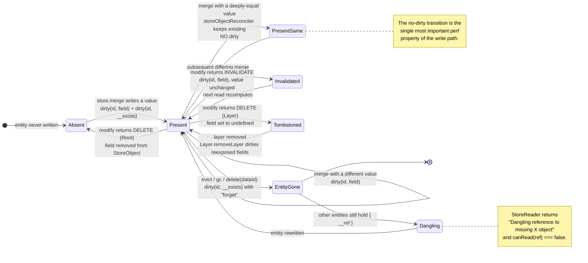
```mermaid
stateDiagram-v2
    direction LR
    [*] --> Absent : entity never written

    Absent --> Present : store.merge writes a value<br/>dirty(id, field) + dirty(id, __exists)
    Present --> Present : merge with a different value<br/>dirty(id, field)
    Present --> PresentSame : merge with a deeply-equal value<br/>storeObjectReconciler keeps existing<br/>NO dirty
    PresentSame --> Present : subsequent differing merge

    Present --> Invalidated : modify returns INVALIDATE<br/>dirty(id, field), value unchanged
    Invalidated --> Present : next read recomputes

    Present --> Absent : modify returns DELETE (Root)<br/>field removed from StoreObject
    Present --> Tombstoned : modify returns DELETE (Layer)<br/>field set to undefined
    Tombstoned --> Present : layer removed<br/>Layer.removeLayer dirties reexposed fields

    Present --> EntityGone : evict / gc / delete(dataId)<br/>dirty(id, __exists) with "forget"
    EntityGone --> Dangling : other entities still hold { __ref }
    Dangling --> Present : entity rewritten

    EntityGone --> [*]

    note right of PresentSame
        The no-dirty transition is the
        single most important perf
        property of the write path.
    end note
    note right of Dangling
        StoreReader returns
        "Dangling reference to missing X object"
        and canRead(ref) === false.
    end note
```

### 2.6 Writes: `merge` and `storeObjectReconciler`

```ts
// cache/inmemory/entityStore.ts
public merge(older: string | StoreObject, newer: StoreObject | string): void {
  let dataId: string | undefined;
  if (isReference(older)) older = older.__ref;
  if (isReference(newer)) newer = newer.__ref;

  const existing: StoreObject | undefined =
    typeof older === "string" ? this.lookup((dataId = older)) : older;
  const incoming: StoreObject | undefined =
    typeof newer === "string" ? this.lookup((dataId = newer)) : newer;

  if (!incoming) return;
  invariant(typeof dataId === "string", "store.merge expects a string ID");

  const merged: StoreObject = new DeepMerger({ reconciler: storeObjectReconciler })
    .merge(existing, incoming);

  // Even if merged === existing, existing may have come from a lower
  // layer, so we always need to set this.data[dataId] on this level.
  this.data[dataId] = merged;
  // ... dirtying, below
}
```

The reconciler is what makes the merge shallow-but-identity-preserving:

```ts
function storeObjectReconciler(existingObject, incomingObject, property): StoreValue {
  const existingValue = existingObject[property];
  const incomingValue = incomingObject[property];
  // Wherever there is a key collision, prefer the incoming value, unless
  // it is deeply equal to the existing value. It's worth checking deep
  // equality here (even though blindly returning incoming would be
  // logically correct) because preserving the referential identity of
  // existing data can prevent needless rereading and rerendering.
  return equal(existingValue, incomingValue) ? existingValue : incomingValue;
}
```

Because the reconciler never recurses, `EntityStore.merge` is a **field-wise** merge, not a
deep one. Nested non-normalized objects are replaced wholesale unless a merge function
intervened earlier in the write pipeline — which is precisely the "Cache data may be lost"
scenario ([§4.8](#48-warnaboutdataloss)). The probe pins this:

```
--- non-normalized child merge behaviour ---
{
  "withoutMergePolicy": { "__typename": "Prefs", "locale": "en" },
  "withMergeTrue":      { "__typename": "Prefs", "theme": "dark", "locale": "en" }
}
```

The dirtying half runs only when the merge actually changed something:

```ts
if (merged !== existing) {
  delete this.refs[dataId];                      // invalidate the findChildRefIds memo
  if (this.group.caching) {
    const fieldsToDirty: Record<string, 1> = {};
    if (!existing) fieldsToDirty.__exists = 1;   // entity newly created

    Object.keys(incoming).forEach((storeFieldName) => {
      if (!existing || existing[storeFieldName] !== merged[storeFieldName]) {
        fieldsToDirty[storeFieldName] = 1;

        // Also dirty fieldNameFromStoreName(storeFieldName) if it's
        // different from storeFieldName and this field does not have
        // keyArgs configured, ...
        const fieldName = fieldNameFromStoreName(storeFieldName);
        if (fieldName !== storeFieldName && !this.policies.hasKeyArgs(merged.__typename, fieldName)) {
          fieldsToDirty[fieldName] = 1;
        }

        // If merged[storeFieldName] has become undefined, and this is the
        // Root layer, actually delete the property from the merged object, ...
        if (merged[storeFieldName] === void 0 && !(this instanceof Layer)) {
          delete merged[storeFieldName];
        }
      }
    });

    if (fieldsToDirty.__typename && !(existing && existing.__typename) &&
        this.policies.rootTypenamesById[dataId] === merged.__typename) {
      delete fieldsToDirty.__typename;           // don't dirty synthesised root __typename
    }
    Object.keys(fieldsToDirty).forEach((fieldName) =>
      this.group.dirty(dataId as string, fieldName));
  }
}
```

Two asymmetries to internalise:

- **Only keys present in `incoming` are examined.** A merge cannot dirty a field it did not
  mention, which keeps invalidation proportional to the payload, not the entity.
- **`hasKeyArgs` gates short-name dirtying.** If a field has an explicit `keyArgs`
  configuration, the cache trusts that different argument variants are genuinely
  independent, so writing `feed:{"type":"top"}` does *not* dirty `feed`. Without `keyArgs`,
  it must assume variants are interrelated and dirty the short name too. This directly
  changes how much re-reading a paginated write triggers.

### 2.7 `modify` — user-controlled field surgery

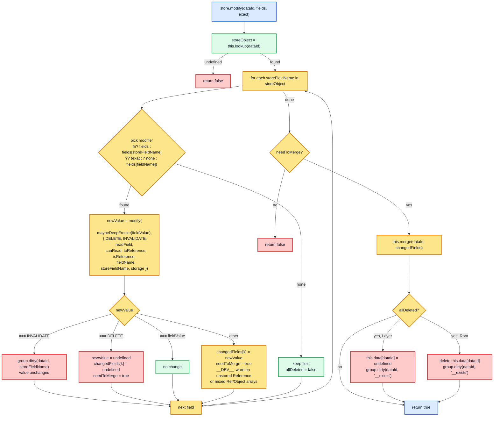
```mermaid
flowchart TB
    START["store.modify(dataId, fields, exact)"]:::api --> LK["storeObject = this.lookup(dataId)"]:::store
    LK -->|"undefined"| RF["return false"]:::dirty
    LK -->|"found"| LOOP["for each storeFieldName in storeObject"]:::write

    LOOP --> PICK{"pick modifier<br/>fn? fields :<br/>fields[storeFieldName]<br/>?? (exact ? none : fields[fieldName])"}:::write
    PICK -->|"none"| NEXT["keep field<br/>allDeleted = false"]:::store
    PICK -->|"found"| CALL["newValue = modify(<br/>  maybeDeepFreeze(fieldValue),<br/>  { DELETE, INVALIDATE, readField,<br/>    canRead, toReference, isReference,<br/>    fieldName, storeFieldName, storage })"]:::write

    CALL --> SW{"newValue"}:::write
    SW -->|"=== INVALIDATE"| INV["group.dirty(dataId, storeFieldName)<br/>value unchanged"]:::dirty
    SW -->|"=== DELETE"| DEL["newValue = undefined<br/>changedFields[k] = undefined<br/>needToMerge = true"]:::dirty
    SW -->|"=== fieldValue"| NOOP["no change"]:::store
    SW -->|"other"| CHG["changedFields[k] = newValue<br/>needToMerge = true<br/>__DEV__: warn on unstored Reference<br/>or mixed Ref/Object arrays"]:::write

    INV --> NEXT2["next field"]:::write
    DEL --> NEXT2
    NOOP --> NEXT2
    CHG --> NEXT2
    NEXT --> NEXT2
    NEXT2 --> LOOP

    LOOP -->|"done"| MERGE{"needToMerge?"}:::write
    MERGE -->|"no"| RF2["return false"]:::dirty
    MERGE -->|"yes"| DOMERGE["this.merge(dataId, changedFields)"]:::write
    DOMERGE --> ALLDEL{"allDeleted?"}:::write
    ALLDEL -->|"yes, Layer"| TOMB["this.data[dataId] = undefined<br/>group.dirty(dataId, '__exists')"]:::dirty
    ALLDEL -->|"yes, Root"| DELE["delete this.data[dataId]<br/>group.dirty(dataId, '__exists')"]:::dirty
    ALLDEL -->|"no"| RT["return true"]:::api
    TOMB --> RT
    DELE --> RT

    classDef api fill:#dbeafe,stroke:#2563eb,stroke-width:2px,color:#0f172a
    classDef write fill:#fde68a,stroke:#d97706,stroke-width:2px,color:#0f172a
    classDef store fill:#dcfce7,stroke:#16a34a,stroke-width:2px,color:#0f172a
    classDef dirty fill:#fecaca,stroke:#dc2626,stroke-width:2px,color:#0f172a
```

Key facts, all pinned by probe section 8:

- **`modify` iterates the *existing* `StoreObject`'s keys.** It cannot create a field that
  is not already there, and it does nothing at all for an unknown `dataId` (returns
  `false`, creates nothing).
- **Modifier lookup is two-level.** For `storeFieldName = 'feed({"type":"top"})'`, it tries
  `fields['feed({"type":"top"})']` first, then falls back to `fields.feed` unless `exact`.
  `exact` is `true` only when `delete()` was called with explicit `args`.
- **`DELETE` and `INVALIDATE` are branded empty objects** compared by identity
  (`const DELETE = {} as DeleteModifier`), so they cannot collide with user data.
- **`INVALIDATE` returns `false`** from `modify` overall (it sets no `changedFields`), even
  though it did dirty a dependency. The probe pins this asymmetry.
- **The `allDeleted` branch** is how deleting every field removes the entity, with the
  Root/Layer split described in §2.5.

`delete` is a thin wrapper that resolves an argument-specific `storeFieldName` first:

```ts
public delete(dataId: string, fieldName?: string, args?: Record<string, any>) {
  const storeObject = this.lookup(dataId);
  if (storeObject) {
    const typename = this.getFieldValue<string>(storeObject, "__typename");
    const storeFieldName =
      fieldName && args ? this.policies.getStoreFieldName({ typename, fieldName, args }) : fieldName;
    return this.modify(dataId, storeFieldName ? { [storeFieldName]: delModifier } : delModifier, !!args);
  }
  return false;
}
```

### 2.8 `evict` — deletion across the layer chain

```ts
public evict(options: Cache.EvictOptions, limit: EntityStore): boolean {
  let evicted = false;
  if (options.id) {
    if (hasOwn.call(this.data, options.id)) {
      evicted = this.delete(options.id, options.fieldName, options.args);
    }
    if (this instanceof Layer && this !== limit) {
      evicted = this.parent.evict(options, limit) || evicted;
    }
    // Always invalidate the field to trigger rereading of watched
    // queries, even if no cache data was modified by the eviction,
    // because queries may depend on computed fields with custom read
    // functions, whose values are not stored in the EntityStore.
    if (options.fieldName || evicted) {
      this.group.dirty(options.id, options.fieldName || "__exists");
    }
  }
  return evicted;
}
```

Eviction descends the chain, stopping at `limit`. `InMemoryCache.evict` supplies that
limit:

```ts
// Pass this.data as a limit on the depth of the eviction, so evictions
// during optimistic updates (when this.data is temporarily set equal to
// this.optimisticData) do not escape their optimistic Layer.
return this.optimisticData.evict(options, this.data);
```

Outside a transaction, `this.data` is the `Root`, so eviction reaches everything. Inside
`batch({ optimistic: "id" })`, `this.data` has been temporarily reassigned to the new
`Layer`, so `this !== limit` fails immediately and the eviction is confined to that layer —
an optimistic delete that rolls back cleanly.

The unconditional `group.dirty` when `fieldName` is supplied is the escape hatch for
`read` functions: a computed field has no stored value to compare, so eviction must dirty
it blindly.

### 2.9 Garbage collection

The cache is a **mark-and-sweep collector over the reference graph**, rooted at the
well-known root ids plus anything explicitly retained.

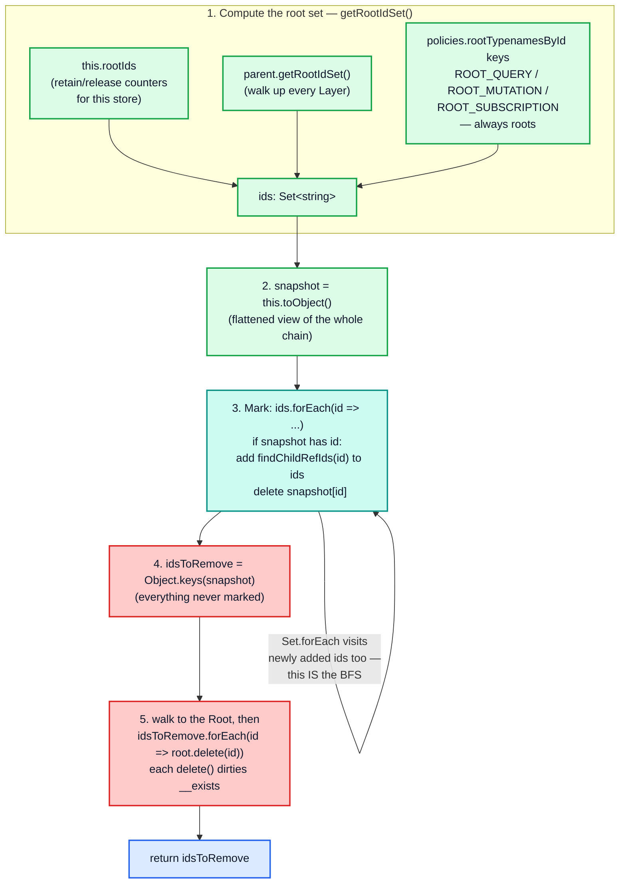
```mermaid
flowchart TB
    subgraph roots["1. Compute the root set — getRootIdSet()"]
        R1["this.rootIds<br/>(retain/release counters<br/>for this store)"]:::store
        R2["parent.getRootIdSet()<br/>(walk up every Layer)"]:::store
        R3["policies.rootTypenamesById keys<br/>ROOT_QUERY / ROOT_MUTATION /<br/>ROOT_SUBSCRIPTION<br/>— always roots"]:::store
        R1 --> RS["ids: Set&lt;string&gt;"]:::store
        R2 --> RS
        R3 --> RS
    end

    RS --> SNAP["2. snapshot = this.toObject()<br/>(flattened view of the whole chain)"]:::store

    SNAP --> MARK["3. Mark: ids.forEach(id =&gt; ...)<br/>if snapshot has id:<br/>  add findChildRefIds(id) to ids<br/>  delete snapshot[id]"]:::read
    MARK -->|"Set.forEach visits<br/>newly added ids too —<br/>this IS the BFS"| MARK

    MARK --> SWEEP["4. idsToRemove = Object.keys(snapshot)<br/>(everything never marked)"]:::dirty
    SWEEP --> DEL["5. walk to the Root, then<br/>idsToRemove.forEach(id =&gt; root.delete(id))<br/>each delete() dirties __exists"]:::dirty
    DEL --> RET["return idsToRemove"]:::api

    classDef api fill:#dbeafe,stroke:#2563eb,stroke-width:2px,color:#0f172a
    classDef read fill:#ccfbf1,stroke:#0d9488,stroke-width:2px,color:#0f172a
    classDef store fill:#dcfce7,stroke:#16a34a,stroke-width:2px,color:#0f172a
    classDef dirty fill:#fecaca,stroke:#dc2626,stroke-width:2px,color:#0f172a
```

```ts
public gc() {
  const ids = this.getRootIdSet();
  const snapshot = this.toObject();
  ids.forEach((id) => {
    if (hasOwn.call(snapshot, id)) {
      // Because we are iterating over an ECMAScript Set, the IDs we add here
      // will be visited in later iterations of the forEach loop only if they
      // were not previously contained by the Set.
      Object.keys(this.findChildRefIds(id)).forEach(ids.add, ids);
      // By removing IDs from the snapshot object here, we protect them from
      // getting removed from the root store layer below.
      delete snapshot[id];
    }
  });
  const idsToRemove = Object.keys(snapshot);
  if (idsToRemove.length) {
    let root: EntityStore = this;
    while (root instanceof Layer) root = root.parent;
    idsToRemove.forEach((id) => root.delete(id));
  }
  return idsToRemove;
}
```

The traversal exploits a specification guarantee: `Set.prototype.forEach` visits elements
added during iteration. The whole breadth-first mark phase is therefore one `forEach` with
no explicit queue.

`findChildRefIds` scans one entity for `{ __ref }` values, memoized per `dataId` and
invalidated by `delete this.refs[dataId]` inside `merge`:

```ts
public findChildRefIds(dataId: string): Record<string, true> {
  if (!hasOwn.call(this.refs, dataId)) {
    const found = (this.refs[dataId] = {} as Record<string, true>);
    const root = this.data[dataId];
    if (!root) return found;
    const workSet = new Set<Record<string | number, any>>([root]);
    // Within the store, only arrays and objects can contain child entity
    // references, so we can prune the traversal using this predicate:
    workSet.forEach((obj) => {
      if (isReference(obj)) {
        found[obj.__ref] = true;
        // In rare cases, a { __ref } Reference object may have other fields.
        // ... fall through to handle any other properties of obj.
      }
      if (isNonNullObject(obj)) {
        Object.keys(obj).forEach((key) => {
          const child = obj[key];
          if (isNonNullObject(child)) workSet.add(child);
        });
      }
    });
  }
  return this.refs[dataId];
}
```

Retention is a **counter**, not a flag:

```ts
public retain(rootId: string): number { return (this.rootIds[rootId] = (this.rootIds[rootId] || 0) + 1); }
public release(rootId: string): number {
  if (this.rootIds[rootId] > 0) {
    const count = --this.rootIds[rootId];
    if (!count) delete this.rootIds[rootId];
    return count;
  }
  return 0;
}
```

and the writer retains automatically:

```ts
// cache/inmemory/writeToStore.ts — end of writeToStore
// Any IDs written explicitly to the cache will be retained as
// reachable root IDs for garbage collection purposes. ...
store.retain(ref.__ref);
```

so `cache.writeFragment({ id: "Book:3", ... })` pins `Book:3` forever until released.
Probe section 9 pins the full lifecycle: unreachable entities collected, auto-retained
entities surviving, `__META` round-tripping through `extract`/`restore`, and the counter
semantics of `retain`/`release`.

> **`gc()` is never called automatically.** `InMemoryCache.gc()` exists but nothing in
> `src/core/**` invokes it. Unreferenced entities accumulate until application code (or
> Apollo DevTools) calls it.

### 2.10 Layer removal and replay

Removing an optimistic layer is the most intricate operation in `entityStore.ts`, because
the layers above the removed one must be **replayed** on top of the new parent.

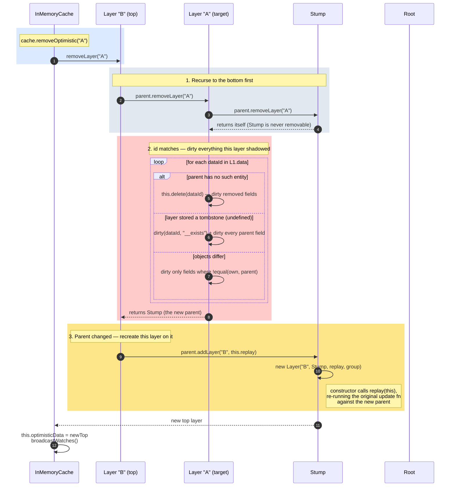
```mermaid
sequenceDiagram
    autonumber
    participant C as InMemoryCache
    participant L2 as Layer "B" (top)
    participant L1 as Layer "A" (target)
    participant ST as Stump
    participant RT as Root

    rect rgb(219, 234, 254)
    Note over C: cache.removeOptimistic("A")
    C->>L2: removeLayer("A")
    end

    rect rgb(226, 232, 240)
    Note over L2,ST: 1. Recurse to the bottom first
    L2->>L1: parent.removeLayer("A")
    L1->>ST: parent.removeLayer("A")
    ST-->>L1: returns itself (Stump is never removable)
    end

    rect rgb(254, 202, 202)
    Note over L1: 2. id matches — dirty everything this layer shadowed
    loop for each dataId in L1.data
        alt parent has no such entity
            L1->>L1: this.delete(dataId) — dirty removed fields
        else layer stored a tombstone (undefined)
            L1->>L1: dirty(dataId, "__exists") + dirty every parent field
        else objects differ
            L1->>L1: dirty only fields where !equal(own, parent)
        end
    end
    L1-->>L2: returns Stump (the new parent)
    end

    rect rgb(253, 230, 138)
    Note over L2: 3. Parent changed — recreate this layer on it
    L2->>ST: parent.addLayer("B", this.replay)
    ST->>ST: new Layer("B", Stump, replay, group)
    Note right of ST: constructor calls replay(this),<br/>re-running the original update fn<br/>against the new parent
    end

    ST-->>C: new top layer
    C->>C: this.optimisticData = newTop<br/>broadcastWatches()
```

```ts
// cache/inmemory/entityStore.ts — Layer#removeLayer
public removeLayer(layerId: string): EntityStore {
  // Remove all instances of the given id, not just the first one.
  const parent = this.parent.removeLayer(layerId);
  if (layerId === this.id) {
    if (this.group.caching) {
      // Dirty every ID we're removing. Technically we might be able to avoid
      // dirtying fields that have values in higher layers, but we don't have
      // easy access to higher layers here, and we're about to recreate those
      // layers anyway (see parent.addLayer below).
      Object.keys(this.data).forEach((dataId) => { /* three cases, above */ });
    }
    return parent;
  }
  // No changes are necessary if the parent chain remains identical.
  if (parent === this.parent) return this;
  // Recreate this layer on top of the new parent.
  return parent.addLayer(this.id, this.replay);
}
```

This is why `Layer` stores its `replay` function permanently, and why an optimistic
`update` function **must be pure and idempotent** — it can be re-executed any number of
times, against a different parent state each time. Probe section 6 demonstrates the
replay: with layer A writing `"optimistic-A"` and layer B appending `"+B"`, removing A
yields `"server+B"`, not `"optimistic-A"` or `"server"`.

---

## Part 3 — `Policies`

`EntityStore` knows how to store things but not *what to call them*. Every naming
decision — which objects become entities, what their ids are, what key a field is stored
under, whether a fragment applies — lives in `policies.ts`. It is the largest file in the
cache (1216 lines) and the only one that user configuration flows into.

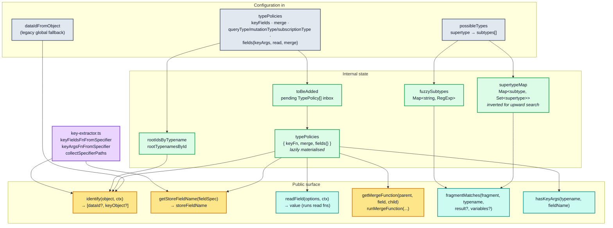
```mermaid
flowchart TB
    subgraph cfg["Configuration in"]
        TP["typePolicies<br/>keyFields · merge ·<br/>queryType/mutationType/subscriptionType ·<br/>fields{keyArgs, read, merge}"]:::ext
        PT["possibleTypes<br/>supertype → subtypes[]"]:::ext
        DIF["dataIdFromObject<br/>(legacy global fallback)"]:::ext
    end

    subgraph state["Internal state"]
        TPS["typePolicies<br/>{ keyFn, merge, fields{} }<br/><i>lazily materialised</i>"]:::store
        TBA["toBeAdded<br/>pending TypePolicy[] inbox"]:::store
        SM["supertypeMap<br/>Map&lt;subtype, Set&lt;supertype&gt;&gt;<br/><i>inverted for upward search</i>"]:::store
        FZ["fuzzySubtypes<br/>Map&lt;string, RegExp&gt;"]:::store
        RT["rootIdsByTypename<br/>rootTypenamesById"]:::store
    end

    subgraph api["Public surface"]
        ID["identify(object, ctx)<br/>→ [dataId?, keyObject?]"]:::write
        SFN["getStoreFieldName(fieldSpec)<br/>→ storeFieldName"]:::write
        RF["readField(options, ctx)<br/>→ value (runs read fns)"]:::read
        GM["getMergeFunction(parent, field, child)<br/>runMergeFunction(...)"]:::write
        FM["fragmentMatches(fragment, typename,<br/>result?, variables?)"]:::read
        HKA["hasKeyArgs(typename, fieldName)"]:::read
    end

    TP --> TBA --> TPS
    PT --> SM
    PT --> FZ
    TP --> RT
    DIF --> ID

    TPS --> ID & SFN & RF & GM & HKA
    SM --> FM
    FZ --> FM
    RT --> ID

    KEX["key-extractor.ts<br/>keyFieldsFnFromSpecifier<br/>keyArgsFnFromSpecifier<br/>collectSpecifierPaths"]:::memo
    KEX --> ID
    KEX --> SFN

    classDef read fill:#ccfbf1,stroke:#0d9488,stroke-width:2px,color:#0f172a
    classDef write fill:#fde68a,stroke:#d97706,stroke-width:2px,color:#0f172a
    classDef store fill:#dcfce7,stroke:#16a34a,stroke-width:2px,color:#0f172a
    classDef memo fill:#e9d5ff,stroke:#7c3aed,stroke-width:2px,color:#0f172a
    classDef ext fill:#e2e8f0,stroke:#475569,stroke-width:2px,color:#0f172a
```

### 3.1 Lazy materialisation and supertype inheritance

`addTypePolicies` does **not** install policies. It pushes them into a per-typename inbox:

```ts
// cache/inmemory/policies.ts
public addTypePolicies(typePolicies: TypePolicies) {
  Object.keys(typePolicies).forEach((typename) => {
    const { queryType, mutationType, subscriptionType, ...incoming } = typePolicies[typename];
    // Though {query,mutation,subscription}Type configurations are rare,
    // it's important to call setRootTypename as early as possible, ...
    if (queryType) this.setRootTypename("Query", typename);
    if (mutationType) this.setRootTypename("Mutation", typename);
    if (subscriptionType) this.setRootTypename("Subscription", typename);

    if (hasOwn.call(this.toBeAdded, typename)) {
      this.toBeAdded[typename].push(incoming);
    } else {
      this.toBeAdded[typename] = [incoming];
    }
  });
}
```

The inbox is drained by `getTypePolicy(typename)`, which runs its inheritance step **at most
once per typename** and then drains any pending updates:

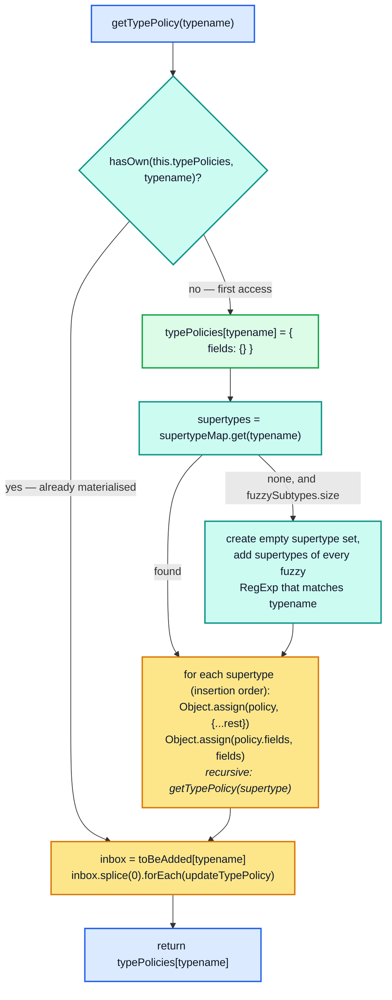
```mermaid
flowchart TB
    CALL["getTypePolicy(typename)"]:::api --> HAS{"hasOwn(this.typePolicies, typename)?"}:::read
    HAS -->|"yes — already materialised"| DRAIN
    HAS -->|"no — first access"| CREATE["typePolicies[typename] = { fields: {} }"]:::store
    CREATE --> SUP["supertypes = supertypeMap.get(typename)"]:::read
    SUP -->|"none, and fuzzySubtypes.size"| FUZZ["create empty supertype set,<br/>add supertypes of every fuzzy<br/>RegExp that matches typename"]:::read
    SUP -->|"found"| INH
    FUZZ --> INH["for each supertype (insertion order):<br/>Object.assign(policy, {...rest})<br/>Object.assign(policy.fields, fields)<br/><i>recursive: getTypePolicy(supertype)</i>"]:::write
    INH --> DRAIN["inbox = toBeAdded[typename]<br/>inbox.splice(0).forEach(updateTypePolicy)"]:::write
    DRAIN --> RET["return typePolicies[typename]"]:::api

    classDef api fill:#dbeafe,stroke:#2563eb,stroke-width:2px,color:#0f172a
    classDef read fill:#ccfbf1,stroke:#0d9488,stroke-width:2px,color:#0f172a
    classDef write fill:#fde68a,stroke:#d97706,stroke-width:2px,color:#0f172a
    classDef store fill:#dcfce7,stroke:#16a34a,stroke-width:2px,color:#0f172a
```

Three consequences that the source comments call out explicitly:

- **Order-independence, but only until first use.** You may add policies for a subtype
  before its supertype, as long as both are registered before the first `getTypePolicy`
  call for the subtype. After that, `// future changes to inherited supertype policies
  will not be reflected in this subtype policy, because this code runs at most once per
  typename.`
- **Field-policy inheritance is atomic.** `updateTypePolicy` refuses to merge an inherited
  field policy with a new one, because `read` and `merge` cooperate:

  ```ts
  // Field policy inheritance is atomic/shallow: you can't inherit a
  // field policy and then override just its read function, since read
  // and merge functions often need to cooperate, ...
  if (!existing || existing?.typename !== typename) {
    existing = existingFieldPolicies[fieldName] = { typename };
  }
  ```

  The `typename` stamp on `InternalFieldPolicy` exists solely to detect "this entry was
  inherited from a supertype, so replace it wholesale."
- **Root typenames are immutable after the first assignment.**
  `setRootTypename` throws `Cannot change root Query __typename more than once` if you try
  to move `ROOT_QUERY` twice.

### 3.2 Entity identity: `Policies.identify`

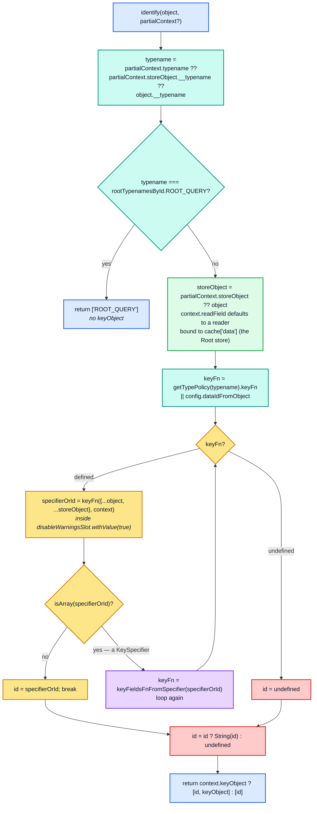
```mermaid
flowchart TB
    START["identify(object, partialContext?)"]:::api
    START --> TN["typename =<br/>partialContext.typename ??<br/>partialContext.storeObject.__typename ??<br/>object.__typename"]:::read
    TN --> RQ{"typename === rootTypenamesById.ROOT_QUERY?"}:::read
    RQ -->|"yes"| RETQ["return ['ROOT_QUERY']<br/><i>no keyObject</i>"]:::api
    RQ -->|"no"| CTX["storeObject = partialContext.storeObject ?? object<br/>context.readField defaults to a reader<br/>bound to cache['data'] (the Root store)"]:::store
    CTX --> PICK["keyFn = getTypePolicy(typename).keyFn<br/>|| config.dataIdFromObject"]:::read
    PICK --> LOOP{"keyFn?"}:::write
    LOOP -->|"undefined"| NOID["id = undefined"]:::dirty
    LOOP -->|"defined"| RUN["specifierOrId = keyFn({...object, ...storeObject}, context)<br/><i>inside disableWarningsSlot.withValue(true)</i>"]:::write
    RUN --> ARR{"isArray(specifierOrId)?"}:::write
    ARR -->|"yes — a KeySpecifier"| COMPILE["keyFn = keyFieldsFnFromSpecifier(specifierOrId)<br/>loop again"]:::memo
    COMPILE --> LOOP
    ARR -->|"no"| SET["id = specifierOrId; break"]:::write
    SET --> COERCE["id = id ? String(id) : undefined"]:::dirty
    NOID --> COERCE
    COERCE --> OUT["return context.keyObject ? [id, keyObject] : [id]"]:::api

    classDef api fill:#dbeafe,stroke:#2563eb,stroke-width:2px,color:#0f172a
    classDef read fill:#ccfbf1,stroke:#0d9488,stroke-width:2px,color:#0f172a
    classDef write fill:#fde68a,stroke:#d97706,stroke-width:2px,color:#0f172a
    classDef store fill:#dcfce7,stroke:#16a34a,stroke-width:2px,color:#0f172a
    classDef memo fill:#e9d5ff,stroke:#7c3aed,stroke-width:2px,color:#0f172a
    classDef dirty fill:#fecaca,stroke:#dc2626,stroke-width:2px,color:#0f172a
```

Details that are easy to miss and that change behaviour:

- **The `while (keyFn)` loop supports one indirection.** A `keyFields` *function* may
  return a `KeySpecifier` array, which is then compiled and re-invoked. This is how a
  dynamic policy can defer to the declarative machinery.
- **`{ ...object, ...storeObject }`** is the argument, not `object`. During a write,
  `storeObject` is the partially-built normalized object (aliases resolved, children
  already turned into `Reference`s), and `object` is the raw result. Spreading gives the
  key function de-aliased values with raw values as a fallback.
- **`id ? String(id) : void 0` swallows falsy ids.** An entity whose computed id is `0` or
  `""` is treated as unidentifiable. This is why `defaultDataIdFromObject` uses `id != null`
  checks internally and produces the string `"Todo:0"` rather than returning `0`.
- **Only `ROOT_QUERY` gets the shortcut.** The comment explains why:
  `// It should be possible to write root Query fields with writeFragment, using
  { __typename: "Query", ... } as the data, but it does not make sense to allow the same
  identification behavior for the Mutation and Subscription types`.
- **`context.keyObject` is an out-parameter.** Key functions write to it so
  `StoreWriter` can merge the identifying fields into the store even when the query never
  selected them ([§4.5](#45-identification-and-the-keyobject-back-channel)).
- **`disableWarningsSlot`** silences data-masking warnings while key fields are read, so
  identifying a masked object does not spam the console.

#### `defaultDataIdFromObject`

```ts
// cache/inmemory/helpers.ts
export function defaultDataIdFromObject(
  { __typename, id, _id }: Readonly<StoreObject>,
  context?: KeyFieldsContext
): string | undefined {
  if (typeof __typename === "string") {
    if (context) {
      context.keyObject =
        id != null ? { id }
        : _id != null ? { _id }
        : void 0;
    }
    // If there is no object.id, fall back to object._id.
    if (id == null && _id != null) { id = _id; }
    if (id != null) {
      return `${__typename}:${
        typeof id === "number" || typeof id === "string" ? id : JSON.stringify(id)
      }`;
    }
  }
}
```

Returning `undefined` — no `__typename`, or no `id`/`_id` — is the signal for
**"do not normalize"**. The object stays inline in its parent, exactly as
`EditTodoResponse` did in [§0.2](#02-the-blogs-example-as-the-cache-actually-stores-it).

#### `keyFields` specifiers

`keyFieldsFnFromSpecifier` compiles a `KeySpecifier` — a nested array of strings — into a
key function. The output format is `${typename}:${JSON.stringify(keyObject)}`:

```ts
// cache/inmemory/key-extractor.ts
return (
  info.keyFieldsFn ||
  (info.keyFieldsFn = (object, context) => {
    const extract: typeof extractKey = (from, key) => context.readField(key, from);

    const keyObject = (context.keyObject = collectSpecifierPaths(specifier, (schemaKeyPath) => {
      let extracted = extractKeyPath(
        context.storeObject,
        schemaKeyPath,
        // Using context.readField to extract paths from context.storeObject
        // allows the extraction to see through Reference objects and respect
        // custom read functions.
        extract
      );

      if (extracted === void 0 && object !== context.storeObject &&
          hasOwn.call(object, schemaKeyPath[0])) {
        // If context.storeObject fails to provide a value for the requested
        // path, fall back to the raw result object, ...
        extracted = extractKeyPath(object, schemaKeyPath, extractKey);
      }

      invariant(extracted !== void 0,
        `Missing field '%s' while extracting keyFields from %s`,
        schemaKeyPath.join("."), object);

      return extracted;
    }));

    return `${context.typename}:${JSON.stringify(keyObject)}`;
  })
);
```

The blog's nested example, `keyFields: ["title", "author", ["name"]]`, means "title, plus
`author.name`". `getSpecifierPaths` turns that flat-with-nesting notation into explicit
paths:

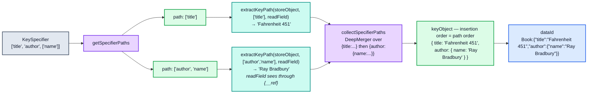
```mermaid
flowchart LR
    SPEC["KeySpecifier<br/>['title', 'author', ['name']]"]:::ext --> GSP["getSpecifierPaths"]:::memo
    GSP --> P1["path: ['title']"]:::store
    GSP --> P2["path: ['author', 'name']"]:::store
    P1 --> EX1["extractKeyPath(storeObject, ['title'], readField)<br/>→ 'Fahrenheit 451'"]:::read
    P2 --> EX2["extractKeyPath(storeObject, ['author','name'], readField)<br/>→ 'Ray Bradbury'<br/><i>readField sees through {__ref}</i>"]:::read
    EX1 --> CSP["collectSpecifierPaths<br/>DeepMerger over<br/>{title:...} then {author:{name:...}}"]:::memo
    EX2 --> CSP
    CSP --> KO["keyObject — insertion order = path order<br/>{ title: 'Fahrenheit 451',<br/>&nbsp; author: { name: 'Ray Bradbury' } }"]:::store
    KO --> OUT["dataId<br/>Book:{&quot;title&quot;:&quot;Fahrenheit 451&quot;,&quot;author&quot;:{&quot;name&quot;:&quot;Ray Bradbury&quot;}}"]:::api

    classDef api fill:#dbeafe,stroke:#2563eb,stroke-width:2px,color:#0f172a
    classDef read fill:#ccfbf1,stroke:#0d9488,stroke-width:2px,color:#0f172a
    classDef store fill:#dcfce7,stroke:#16a34a,stroke-width:2px,color:#0f172a
    classDef memo fill:#e9d5ff,stroke:#7c3aed,stroke-width:2px,color:#0f172a
    classDef ext fill:#e2e8f0,stroke:#475569,stroke-width:2px,color:#0f172a
```

**The specifier's order is part of the cache key.** `collectSpecifierPaths` merges path
fragments in path order into a fresh object, and `JSON.stringify` emits properties in
insertion order, so the specifier order survives into the `dataId` verbatim:

```
keyFields: ["title", "author", ["name"]]
  → Book:{"title":"Fahrenheit 451","author":{"name":"Ray Bradbury"}}
keyFields: ["author", ["name"], "title"]
  → Book:{"author":{"name":"Ray Bradbury"},"title":"Fahrenheit 451"}
```

Two policies that list the same fields in different orders produce **different ids for the
same object**. Reordering a `keyFields` array is a breaking change for any persisted
`extract()` snapshot. Probe section 2 pins the exact strings.

`extractKeyPath` finishes with `normalize`, which recursively **sorts the keys** of any
object it extracted:

```ts
function normalize<T>(value: T): T {
  // Usually the extracted value will be a scalar value, ... but just in case we get an
  // object or an array, we need to do some normalization of the order of (nested) keys.
  if (isNonNullObject(value)) {
    if (isArray(value)) return value.map(normalize) as any;
    return collectSpecifierPaths(Object.keys(value).sort(), (path) => extractKeyPath(value, path)) as T;
  }
  return value;
}
```

So an *object-valued* key field is order-insensitive, while the *specifier itself* is
order-sensitive. That asymmetry is deliberate but surprising.

A missing key field is a **thrown invariant**, not a silent fallback. `StoreWriter` catches
it only when an explicit `dataId` was supplied:

```ts
// cache/inmemory/writeToStore.ts
} catch (e) {
  // If dataId was provided, tolerate failure of policies.identify.
  if (!dataId) throw e;
}
```

### 3.3 Field identity: `getStoreFieldName`

This is the function that turns `feed(type: "top")` into the store key
`feed({"type":"top"})`.

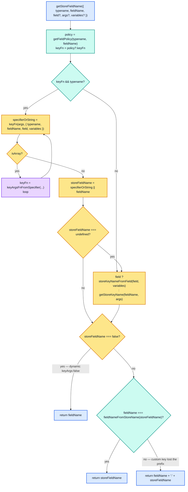
```mermaid
flowchart TB
    IN["getStoreFieldName({ typename, fieldName, field?, args?, variables? })"]:::api
    IN --> POL["policy = getFieldPolicy(typename, fieldName)<br/>keyFn = policy?.keyFn"]:::read
    POL --> HAS{"keyFn &amp;&amp; typename?"}:::read

    HAS -->|"yes"| KLOOP["specifierOrString = keyFn(args, { typename, fieldName, field, variables })"]:::write
    KLOOP --> KARR{"isArray?"}:::write
    KARR -->|"yes"| KCOMP["keyFn = keyArgsFnFromSpecifier(...)<br/>loop"]:::memo
    KCOMP --> KLOOP
    KARR -->|"no"| KSET["storeFieldName = specifierOrString || fieldName"]:::write

    HAS -->|"no"| DEF
    KSET --> UNDEF{"storeFieldName === undefined?"}:::write
    UNDEF -->|"yes"| DEF["field ?<br/>storeKeyNameFromField(field, variables)<br/>: getStoreKeyName(fieldName, args)"]:::write
    UNDEF -->|"no"| FALSE
    DEF --> FALSE{"storeFieldName === false?"}:::write
    FALSE -->|"yes — dynamic keyArgs:false"| RETF["return fieldName"]:::api
    FALSE -->|"no"| PREFIX{"fieldName === fieldNameFromStoreName(storeFieldName)?"}:::read
    PREFIX -->|"yes"| RET1["return storeFieldName"]:::api
    PREFIX -->|"no — custom key lost the prefix"| RET2["return fieldName + ':' + storeFieldName"]:::api

    classDef api fill:#dbeafe,stroke:#2563eb,stroke-width:2px,color:#0f172a
    classDef read fill:#ccfbf1,stroke:#0d9488,stroke-width:2px,color:#0f172a
    classDef write fill:#fde68a,stroke:#d97706,stroke-width:2px,color:#0f172a
    classDef memo fill:#e9d5ff,stroke:#7c3aed,stroke-width:2px,color:#0f172a
```

The **prefix repair** at the bottom is what guarantees `fieldNameFromStoreName` is always
invertible:

```ts
// Make sure custom field names start with the actual field.name.value
// of the field, so we can always figure out which properties of a
// StoreObject correspond to which original field names.
return fieldName === fieldNameFromStoreName(storeFieldName) ? storeFieldName
  : fieldName + ":" + storeFieldName;
```

`fieldNameFromStoreName` is a regex prefix match (`/^[_a-z][_0-9a-z]*/i`), so
`feed({"type":"top"})` → `feed`. A `keyArgs` function returning `"weird key"` would break
that inversion, so the result becomes `feed:weird key`. Everything downstream —
`CacheGroup.depend`'s two-level keys, `modify`'s two-level modifier lookup,
`evict({ fieldName })`, `merge`'s short-name dirtying — depends on this invariant.

The default (no `keyArgs`) path is `storeKeyNameFromField` → `getStoreKeyName`, which
serialises arguments with `canonicalStringify` and appends `@directive` info for
`@connection`-style directives. `canonicalStringify` sorting is what makes
`feed(type: "top", limit: 10)` and `feed(limit: 10, type: "top")` the same key.

#### `keyArgs` specifiers

`keyArgsFnFromSpecifier` supports three namespaces in a key path's first segment:

| Prefix | Source | Missing-value behaviour |
| --- | --- | --- |
| `"@directiveName"` | `field.directives` → `argumentsObjectFromField(d, variables)` | Directive absent → omitted from the key. Directive present without args → `null` recorded (presence itself is part of the key). |
| `"$variableName"` | `context.variables` | Variable absent → omitted. |
| anything else | the field's `args` object | Argument absent → omitted. |

```ts
const suffix = JSON.stringify(collected);
// If no arguments were passed to this field, and it didn't have any other
// field key contributions from directives or variables, hide the empty
// :{} suffix from the field key. ...
if (args || suffix !== "{}") { fieldName += ":" + suffix; }
return fieldName;
```

So `keyArgs: ["type"]` on a field called with `feed(type: "top", limit: 10)` produces
`feed:{"type":"top"}` — the `limit` argument no longer partitions the cache, which is the
foundation of every pagination policy. Compare with the default key
`feed({"limit":10,"type":"top"})`. Probe section 3 prints both.

`keyArgs: false` compiles to `simpleKeyArgsFn = (_args, context) => context.fieldName`, so
all argument variants collapse onto the bare field name.

There is one **implicit** `keyArgs` assignment worth memorising:

```ts
if (existing.read && existing.merge) {
  // If we have both a read and a merge function, assume
  // keyArgs:false, because read and merge together can take
  // responsibility for interpreting arguments in and out. ...
  existing.keyFn = existing.keyFn || simpleKeyArgsFn;
}
```

Defining both `read` and `merge` for a field silently turns on `keyArgs: false`. This also
makes `hasKeyArgs(typename, fieldName)` return `true`, which suppresses short-name dirtying
in `EntityStore.merge` ([§2.6](#26-writes-merge-and-storeobjectreconciler)).

#### Where `storeFieldName` is decided, end to end

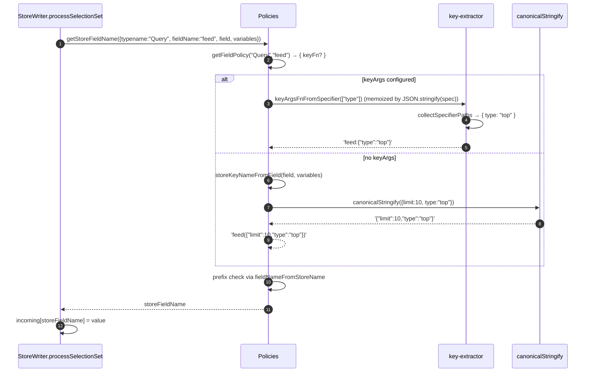
```mermaid
sequenceDiagram
    autonumber
    participant SW as StoreWriter.processSelectionSet
    participant P as Policies
    participant KE as key-extractor
    participant CS as canonicalStringify

    SW->>P: getStoreFieldName({typename:"Query", fieldName:"feed", field, variables})
    P->>P: getFieldPolicy("Query","feed") → { keyFn? }
    alt keyArgs configured
        P->>KE: keyArgsFnFromSpecifier(["type"])  (memoized by JSON.stringify(spec))
        KE->>KE: collectSpecifierPaths → { type: "top" }
        KE-->>P: 'feed:{"type":"top"}'
    else no keyArgs
        P->>P: storeKeyNameFromField(field, variables)
        P->>CS: canonicalStringify({limit:10, type:"top"})
        CS-->>P: '{"limit":10,"type":"top"}'
        P-->>P: 'feed({"limit":10,"type":"top"})'
    end
    P->>P: prefix check via fieldNameFromStoreName
    P-->>SW: storeFieldName
    SW->>SW: incoming[storeFieldName] = value
```

### 3.4 `readField` — the field read entry point

Every field read in the cache funnels through `Policies.readField`, whether it comes from
`StoreReader`, from a user `read` function, from a `modify` modifier, or from a `keyFields`
extractor.

```ts
public readField<V = StoreValue>(
  options: ReadFieldOptions,
  context: ReadMergeModifyContext
): SafeReadonly<V> | undefined {
  const objectOrReference = options.from;
  if (!objectOrReference) return;
  const nameOrField = options.field || options.fieldName;
  if (!nameOrField) return;

  if (options.typename === void 0) {
    const typename = context.store.getFieldValue<string>(objectOrReference, "__typename");
    if (typename) options.typename = typename;
  }

  const storeFieldName = this.getStoreFieldName(options);
  const fieldName = fieldNameFromStoreName(storeFieldName);
  const existing = context.store.getFieldValue<V>(objectOrReference, storeFieldName);
  const policy = this.getFieldPolicy(options.typename, fieldName);
  const read = policy && policy.read;

  if (read) {
    const readOptions = makeFieldFunctionOptions(
      this, objectOrReference, options, context,
      context.store.getStorage(
        isReference(objectOrReference) ? objectOrReference.__ref : objectOrReference,
        storeFieldName
      )
    );
    // Call read(existing, readOptions) with cacheSlot holding this.cache.
    return cacheSlot.withValue(this.cache, read, [existing, readOptions]) as SafeReadonly<V>;
  }

  return existing;
}
```

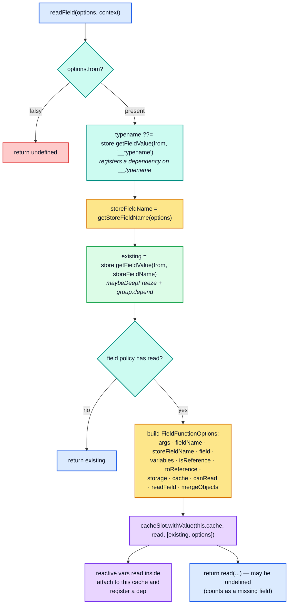
```mermaid
flowchart TB
    RFC["readField(options, context)"]:::api --> FROM{"options.from?"}:::read
    FROM -->|"falsy"| U1["return undefined"]:::dirty
    FROM -->|"present"| TN["typename ??= store.getFieldValue(from, '__typename')<br/><i>registers a dependency on __typename</i>"]:::read
    TN --> SFN["storeFieldName = getStoreFieldName(options)"]:::write
    SFN --> GET["existing = store.getFieldValue(from, storeFieldName)<br/><i>maybeDeepFreeze + group.depend</i>"]:::store
    GET --> RD{"field policy has read?"}:::read
    RD -->|"no"| RETE["return existing"]:::api
    RD -->|"yes"| OPTS["build FieldFunctionOptions:<br/>args · fieldName · storeFieldName · field ·<br/>variables · isReference · toReference ·<br/>storage · cache · canRead · readField · mergeObjects"]:::write
    OPTS --> SLOT["cacheSlot.withValue(this.cache, read, [existing, options])"]:::memo
    SLOT --> RV["reactive vars read inside<br/>attach to this cache and<br/>register a dep"]:::memo
    SLOT --> RETR["return read(...) — may be undefined<br/>(counts as a missing field)"]:::api

    classDef api fill:#dbeafe,stroke:#2563eb,stroke-width:2px,color:#0f172a
    classDef read fill:#ccfbf1,stroke:#0d9488,stroke-width:2px,color:#0f172a
    classDef write fill:#fde68a,stroke:#d97706,stroke-width:2px,color:#0f172a
    classDef store fill:#dcfce7,stroke:#16a34a,stroke-width:2px,color:#0f172a
    classDef memo fill:#e9d5ff,stroke:#7c3aed,stroke-width:2px,color:#0f172a
    classDef dirty fill:#fecaca,stroke:#dc2626,stroke-width:2px,color:#0f172a
```

Four properties of this function drive most of the cache's advanced behaviour:

1. **`read` functions run inside the memoized read.** They execute within the `optimism`
   `Entry` for `executeSelectionSet`, so *any* `store.get` they trigger (via `readField`)
   is recorded as a dependency of the enclosing memoized subtree. A cache redirect —
   `read: (_, { args, toReference }) => toReference({ __typename: "Book", id: args.id })` —
   therefore correctly invalidates when the target entity changes. Probe section 12 pins
   this.
2. **`cacheSlot` is how reactive variables find their cache.** `makeVar`'s getter calls
   `cacheSlot.getValue()`; if a cache is present it attaches itself and registers a
   dependency on the variable. Without the slot, a reactive variable read inside a `read`
   function could not know which cache to notify.
3. **`options.storage` is per-`(entity, storeFieldName)` and survives across reads.**
   `Root.storageTrie` (a `Trie<StorageType>`) hands out a stable object identity for the
   path `(idOrObj, ...storeFieldNames)`. This is where `relayStylePagination` keeps its
   cursor bookkeeping.
4. **Returning `undefined` from a `read` function means "missing".** `StoreReader` treats
   `undefined` exactly as it treats an absent store field, producing a `MissingFieldError`
   entry. Returning `null` is a real value.

`normalizeReadFieldOptions` is the adapter that lets `readField` be called in four ways:

```ts
export function normalizeReadFieldOptions(readFieldArgs, objectOrReference, variables) {
  const { 0: fieldNameOrOptions, 1: from, length: argc } = readFieldArgs;
  let options: ReadFieldOptions;
  if (typeof fieldNameOrOptions === "string") {
    options = {
      fieldName: fieldNameOrOptions,
      // Default to objectOrReference only when no second argument was
      // passed for the from parameter, not when undefined is explicitly
      // passed as the second argument.
      from: argc > 1 ? from : objectOrReference,
    };
  } else {
    options = { ...fieldNameOrOptions };
    // Default to objectOrReference only when fieldNameOrOptions.from is
    // actually omitted, rather than just undefined.
    if (!hasOwn.call(options, "from")) { options.from = objectOrReference; }
  }
  if (__DEV__ && options.from === void 0) {
    invariant.warn(`Undefined 'from' passed to readField with arguments %s`, ...);
  }
  if (void 0 === options.variables) { options.variables = variables; }
  return options;
}
```

Both defaulting rules use *arity/own-property* checks rather than `=== undefined`, so
`readField("name", undefined)` is an error you get warned about instead of silently reading
from the current object.

### 3.5 Merge functions

Three layers of configuration can supply a merge function, resolved by
`getMergeFunction(parentTypename, fieldName, childTypename)`:

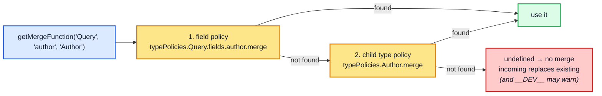
```mermaid
flowchart LR
    Q["getMergeFunction('Query', 'author', 'Author')"]:::api --> F["1. field policy<br/>typePolicies.Query.fields.author.merge"]:::write
    F -->|"found"| USE["use it"]:::store
    F -->|"not found"| T["2. child type policy<br/>typePolicies.Author.merge"]:::write
    T -->|"found"| USE
    T -->|"not found"| NONE["undefined → no merge<br/>incoming replaces existing<br/><i>(and __DEV__ may warn)</i>"]:::dirty

    classDef api fill:#dbeafe,stroke:#2563eb,stroke-width:2px,color:#0f172a
    classDef write fill:#fde68a,stroke:#d97706,stroke-width:2px,color:#0f172a
    classDef store fill:#dcfce7,stroke:#16a34a,stroke-width:2px,color:#0f172a
    classDef dirty fill:#fecaca,stroke:#dc2626,stroke-width:2px,color:#0f172a
```

Field policies win over type policies. `merge: true` and `merge: false` are compiled to
singleton functions at configuration time:

```ts
const mergeTrueFn: FieldMergeFunction<any> = (existing, incoming, { mergeObjects }) =>
  mergeObjects(existing, incoming);
const mergeFalseFn: FieldMergeFunction<any> = (_, incoming) => incoming;
```

and `runMergeFunction` short-circuits on their **identity**, avoiding the cost of building
a `FieldMergeFunctionOptions` object:

```ts
public runMergeFunction(existing, incoming, { field, typename, merge, path }, context, storage?) {
  const existingData = existing;   // Preserve the value in case `context.overwrite` is set.
  if (merge === mergeTrueFn) {
    // Instead of going to the trouble of creating a full FieldFunctionOptions
    // object and calling mergeTrueFn, we can simply call mergeObjects, ...
    return makeMergeObjectsFunction(context.store)(existing as StoreObject, incoming as StoreObject);
  }
  if (merge === mergeFalseFn) { return incoming; }

  // If cache.writeQuery or cache.writeFragment was called with options.overwrite
  // set to true, we still call merge functions, but the existing data is always
  // undefined, ...
  if (context.overwrite) { existing = void 0; }
  // ... @stream memoization elided ...
  const result = merge(existing, incoming, makeMergeFieldFunctionOptions(/* ... */));
  return result;
}
```

Note that `overwrite: true` does **not** skip merge functions; it blanks `existing` and
passes the original through as `options.existingData`.

#### `mergeObjects`

```ts
function makeMergeObjectsFunction(store: NormalizedCache): MergeObjectsFunction {
  return function mergeObjects(existing, incoming) {
    if (isArray(existing) || isArray(incoming)) {
      throw newInvariantError("Cannot automatically merge arrays");
    }
    if (isNonNullObject(existing) && isNonNullObject(incoming)) {
      const eType = store.getFieldValue(existing, "__typename");
      const iType = store.getFieldValue(incoming, "__typename");
      const typesDiffer = eType && iType && eType !== iType;
      if (typesDiffer) { return incoming; }

      if (isReference(existing) && storeValueIsStoreObject(incoming)) {
        // Update the normalized EntityStore for the entity identified by
        // existing.__ref, preferring/overwriting any fields contributed by the
        // newer incoming StoreObject.
        store.merge(existing.__ref, incoming);
        return existing;
      }
      if (storeValueIsStoreObject(existing) && isReference(incoming)) {
        // Update the normalized EntityStore for the entity identified by
        // incoming.__ref, taking fields from the older existing object only if
        // those fields are not already present in the newer StoreObject ...
        store.merge(existing, incoming.__ref);
        return incoming;
      }
      if (storeValueIsStoreObject(existing) && storeValueIsStoreObject(incoming)) {
        return { ...existing, ...incoming };
      }
    }
    return incoming;
  };
}
```

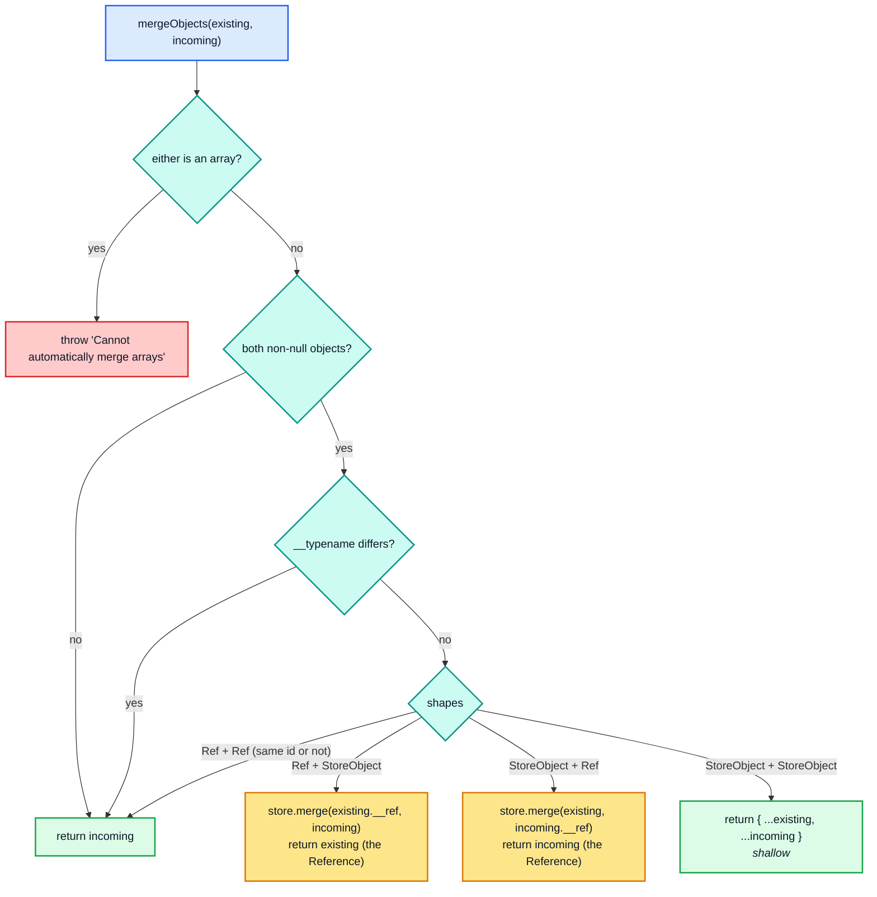
```mermaid
flowchart TB
    MO["mergeObjects(existing, incoming)"]:::api --> ARR{"either is an array?"}:::read
    ARR -->|"yes"| THROW["throw 'Cannot automatically merge arrays'"]:::dirty
    ARR -->|"no"| OBJ{"both non-null objects?"}:::read
    OBJ -->|"no"| INC["return incoming"]:::store
    OBJ -->|"yes"| TYP{"__typename differs?"}:::read
    TYP -->|"yes"| INC
    TYP -->|"no"| CASE{"shapes"}:::read
    CASE -->|"Ref + StoreObject"| C1["store.merge(existing.__ref, incoming)<br/>return existing (the Reference)"]:::write
    CASE -->|"StoreObject + Ref"| C2["store.merge(existing, incoming.__ref)<br/>return incoming (the Reference)"]:::write
    CASE -->|"StoreObject + StoreObject"| C3["return { ...existing, ...incoming }<br/><i>shallow</i>"]:::store
    CASE -->|"Ref + Ref (same id or not)"| INC

    classDef api fill:#dbeafe,stroke:#2563eb,stroke-width:2px,color:#0f172a
    classDef read fill:#ccfbf1,stroke:#0d9488,stroke-width:2px,color:#0f172a
    classDef write fill:#fde68a,stroke:#d97706,stroke-width:2px,color:#0f172a
    classDef store fill:#dcfce7,stroke:#16a34a,stroke-width:2px,color:#0f172a
    classDef dirty fill:#fecaca,stroke:#dc2626,stroke-width:2px,color:#0f172a
```

The two mixed cases have a **side effect on the store**, writing directly rather than
returning a value to be written. That is why `StoreWriter.applyMerges` has to check
`isReference(applied)` before merging the result again:

```ts
// cache/inmemory/writeToStore.ts
if (isReference(applied)) {
  // Assume References returned by applyMerges have already been merged
  // into the store. See makeMergeObjectsFunction in policies.ts for an
  // example of how this can happen.
  return;
}
```

`mergeObjects` is also **shallow** for the object/object case, so `merge: true` on a
grandparent does not recursively protect grandchildren. Probe section 10 shows
`mergeObjects` deduplicating a `Reference` against a `StoreObject` and shows the shallow
spread losing nothing only because both objects were complete.

### 3.6 `fragmentMatches` — type-condition resolution

Without `possibleTypes`, the rule is trivially strict:

```ts
public fragmentMatches(fragment, typename, result?, variables?): boolean {
  if (!fragment.typeCondition) return true;
  // If the fragment has a type condition but the object we're matching
  // against does not have a __typename, the fragment cannot match.
  if (!typename) return false;
  const supertype = fragment.typeCondition.name.value;
  // Common case: fragment type condition and __typename are the same.
  if (typename === supertype) return true;
  // ... possibleTypes search ...
  return false;
}
```

With `possibleTypes`, the search runs **upwards** over the inverted map:

```mermaid
flowchart TB
    subgraph inv["Why the map is inverted"]
        CFG["possibleTypes: {<br/>&nbsp; Character: ['Jedi', 'Droid'],<br/>&nbsp; Jedi: ['Padawan']<br/>}"]:::ext
        CFG --> MAP["supertypeMap:<br/>Character → {}<br/>Jedi → { Character }<br/>Droid → { Character }<br/>Padawan → { Jedi }"]:::store
    end

    subgraph bfs["fragmentMatches('Character', typename = 'Padawan')"]
        S0["workQueue = [ supertypeSet('Padawan') = { Jedi } ]"]:::read
        S0 --> S1{"does { Jedi } contain 'Character'?"}:::read
        S1 -->|"no"| S2["enqueue supertypeSet('Jedi') = { Character }"]:::read
        S2 --> S3{"does { Character } contain 'Character'?"}:::read
        S3 -->|"yes"| S4["memoize: supertypeSet('Padawan').add('Character')<br/>return true"]:::memo
    end

    subgraph fz["Fuzzy subtypes — writes only"]
        F0["typename unmatched after<br/>the non-fuzzy queue is exhausted"]:::dirty
        F0 --> F1{"result provided AND<br/>selectionSetMatchesResult(fragment, result)?"}:::read
        F1 -->|"no"| F2["return false"]:::dirty
        F1 -->|"yes"| F3["enqueue supertypes of every fuzzy RegExp<br/>that fully matches typename;<br/>__DEV__ warns 'Inferring subtype X of supertype Y'"]:::write
    end

    classDef read fill:#ccfbf1,stroke:#0d9488,stroke-width:2px,color:#0f172a
    classDef write fill:#fde68a,stroke:#d97706,stroke-width:2px,color:#0f172a
    classDef store fill:#dcfce7,stroke:#16a34a,stroke-width:2px,color:#0f172a
    classDef memo fill:#e9d5ff,stroke:#7c3aed,stroke-width:2px,color:#0f172a
    classDef dirty fill:#fecaca,stroke:#dc2626,stroke-width:2px,color:#0f172a
    classDef ext fill:#e2e8f0,stroke:#475569,stroke-width:2px,color:#0f172a
```

Three subtleties:

- **Positive results are memoized; negative results are not.**
  `// Unfortunately, we cannot safely cache negative results, because new possibleTypes
  data could always be added to the Policies class.` A deep interface hierarchy therefore
  pays full BFS cost on every *miss*, forever.
- **Fuzzy subtypes only apply while writing.** `StoreReader` calls `fragmentMatches` with
  no `result` argument, so `needToCheckFuzzySubtypes` is always false there. Read and write
  can therefore disagree about a fuzzy fragment — deliberately, since only the write path
  has a result object to shape-match against.
- **The queue grows during iteration.** `for (let i = 0; i < workQueue.length; ++i)` is an
  explicit BFS with dedup via `workQueue.indexOf(supertypeSet) < 0`, which is a linear scan
  — fine for the small sets that real schemas produce.

`selectionSetMatchesResult` is the shape test used for fuzzy matching. It requires every
non-skipped field of the fragment to be an own property of the result, recursively, and it
maps over arrays:

```ts
// cache/inmemory/helpers.ts
export function selectionSetMatchesResult(selectionSet, result, variables): boolean {
  if (isNonNullObject(result)) {
    return isArray(result) ?
        result.every((item) => selectionSetMatchesResult(selectionSet, item, variables))
      : selectionSet.selections.every((field) => {
          if (isField(field) && shouldInclude(field, variables)) {
            const key = resultKeyNameFromField(field);
            return hasOwn.call(result, key) &&
              (!field.selectionSet ||
                selectionSetMatchesResult(field.selectionSet, result[key], variables));
          }
          // If the selection has been skipped with @skip(true) or @include(false), it
          // should not count against the matching. ...
          return true;
        });
  }
  return false;
}
```

Probe section 13 pins interface/union matching, including the "no `possibleTypes` means no
match" case.

---

## Part 4 — `StoreWriter`

`writeToStore.ts` (967 lines) turns a response-shaped tree into a set of `StoreObject`
patches. Its defining structural choice is that it is **two-phase**: the entire result is
shredded into a staging map first, and only then is anything written to the
`EntityStore`.

```mermaid
flowchart TB
    subgraph phase1["Phase 1 — pure. No store mutation."]
        direction TB
        PSS["processSelectionSet<br/>recursive descent over<br/>(result, selectionSet)"]:::write
        FF["flattenFields<br/>field collection +<br/>@client / @defer flavors"]:::write
        PFV["processFieldValue<br/>arrays, scalars, recursion"]:::write
        ID["policies.identify<br/>→ dataId + keyObject"]:::write
        STAGE["context.incomingById<br/>Map&lt;dataId, {storeObject, mergeTree, fieldNodeSet}&gt;"]:::store
        MT["mergeTree<br/>where merge functions live,<br/>mirroring the result shape"]:::memo

        PSS --> FF --> PSS
        PSS --> PFV --> PSS
        PSS --> ID
        PSS --> STAGE
        PSS --> MT
    end

    subgraph phase2["Phase 2 — effectful. One pass over incomingById."]
        direction TB
        AM["applyMerges<br/>run user merge functions<br/>bottom-up"]:::write
        WARN["__DEV__ warnAboutDataLoss"]:::dirty
        SM["store.merge(dataId, storeObject)<br/>→ dirties CacheGroup"]:::store
        RET["store.retain(ref.__ref)"]:::store
        AM --> WARN --> SM --> RET
    end

    IN["writeToStore(store, options)"]:::api --> phase1 --> phase2 --> OUT["return Reference"]:::api

    classDef api fill:#dbeafe,stroke:#2563eb,stroke-width:2px,color:#0f172a
    classDef write fill:#fde68a,stroke:#d97706,stroke-width:2px,color:#0f172a
    classDef store fill:#dcfce7,stroke:#16a34a,stroke-width:2px,color:#0f172a
    classDef memo fill:#e9d5ff,stroke:#7c3aed,stroke-width:2px,color:#0f172a
    classDef dirty fill:#fecaca,stroke:#dc2626,stroke-width:2px,color:#0f172a
```

Why two phases matter: a single result can mention the same entity in several places
(`{ me { id name }, admin { id email } }` where both resolve to `User:1`). Staging lets
those contributions be **combined into one `store.merge` call**, so the entity is dirtied
once, with one final value, rather than being written twice and broadcasting an
intermediate state. It also means a write that throws partway through leaves the store
untouched.

### 4.1 `writeToStore` — the driver

```ts
public writeToStore(store, { query, result, dataId, variables, overwrite, extensions }): Reference | undefined {
  const operationDefinition = getOperationDefinition(query)!;
  const merger = makeProcessedFieldsMerger();

  variables = { ...getDefaultValues(operationDefinition), ...variables! };

  const context: WriteContext = {
    store,
    written: {},
    merge<T>(existing: T, incoming: T) { return merger.merge(existing, incoming) as T; },
    variables: variables as OperationVariables,
    varString: canonicalStringify(variables),
    ...extractFragmentContext(query, this.fragments),
    overwrite: !!overwrite,
    incomingById: new Map(),
    clientOnly: false,
    deferred: false,
    flavors: new Map(),
    extensions,
  };

  const ref = this.processSelectionSet({
    result: result || {}, dataId,
    selectionSet: operationDefinition.selectionSet,
    mergeTree: { map: new Map() }, context, path: [],
  });

  if (!isReference(ref)) { throw newInvariantError(`Could not identify object %s`, result); }
  // ... phase 2, below ...
  store.retain(ref.__ref);
  return ref;
}
```

Field-by-field, `WriteContext` is the whole design:

| Field | Purpose | Lifetime |
| --- | --- | --- |
| `store` | Destination `NormalizedCache`. Read during phase 1 (for `__typename` inference and `readField`), written only in phase 2. | write |
| `written` | `{ [dataId]: SelectionSetNode[] }` — the cycle breaker. | write |
| `merge` | One shared `DeepMerger`. Its `pastCopies` set means an object copied once during this write is mutated in place afterwards. | write |
| `variables` / `varString` | Operation variables with defaults applied, plus their canonical serialisation (used by `isFresh`). | write |
| `fragmentMap` / `lookupFragment` | Fragments defined in the document, plus the `FragmentRegistry` fallback. | write |
| `overwrite` | `writeQuery({ overwrite: true })`. Blanks `existing` inside merge functions and disables the data-loss warning. | write |
| `incomingById` | The staging map. | write |
| `clientOnly` / `deferred` / `flavors` | Directive state, propagated down the tree. `flavors` interns the at-most-four context variants. | write |
| `extensions` | Server extensions, including `@stream` bookkeeping. | write |

The `flavors` map is a small but characteristic optimisation:

```ts
// Since there are only four possible combinations of context.clientOnly and
// context.deferred values, we should need at most four "flavors" of any given
// WriteContext. To avoid creating multiple copies of the same context, we cache
// the contexts in the context.flavors Map ...
function getContextFlavor<TContext extends FlavorableWriteContext>(context, clientOnly, deferred): TContext {
  const key = `${clientOnly}${deferred}`;
  let flavored = context.flavors.get(key);
  if (!flavored) {
    context.flavors.set(key, (flavored =
      context.clientOnly === clientOnly && context.deferred === deferred ? context
      : { ...context, clientOnly, deferred }));
  }
  return flavored as TContext;
}
```

### 4.2 `processSelectionSet` — the recursive core

```mermaid
flowchart TB
    IN["processSelectionSet({ dataId?, result, selectionSet, context, mergeTree, path })"]:::api
    IN --> TYN["typename =<br/>rootTypenamesById[dataId]<br/>?? getTypenameFromResult(result, selectionSet, fragmentMap)<br/>?? store.get(dataId, '__typename')"]:::read
    TYN --> SEED["incoming = {}<br/>if typename is a string: incoming.__typename = typename"]:::store
    SEED --> FLAT["fields = flattenFields(selectionSet, result, context, typename)<br/><i>Map&lt;FieldNode, WriteContext&gt;</i>"]:::write

    FLAT --> LOOP["for each (field, fieldContext)"]:::write
    LOOP --> RK["resultFieldKey = alias ?? field.name<br/>value = result[resultFieldKey]<br/>path = [...path, field.name.value]"]:::read
    RK --> DEF{"value === undefined?"}:::read
    DEF -->|"yes"| MISS["__DEV__ and not @client / @defer /<br/>auto-added __typename / read-function field<br/>→ invariant.error 'Missing field ... while writing result'"]:::dirty
    DEF -->|"no"| SFN["storeFieldName = policies.getStoreFieldName({typename, fieldName, field, variables})"]:::write
    SFN --> CT["childTree = getChildMergeTree(mergeTree, storeFieldName)"]:::memo
    CT --> PFV["incomingValue = processFieldValue(value, field, ctx', childTree, path)<br/><i>ctx' resets clientOnly/deferred when field has a selectionSet</i>"]:::write
    PFV --> CTN["childTypename = readField('__typename', incomingValue)<br/><i>only when field.selectionSet and value is Ref/StoreObject</i>"]:::read
    CTN --> MRG{"policies.getMergeFunction(typename, fieldName, childTypename)"}:::write
    MRG -->|"found"| INFO["childTree.info = { field, typename, merge, path }"]:::memo
    MRG -->|"none, but @stream"| STR["childTree.info = { ..., merge: defaultStreamFieldMergeFn }"]:::memo
    MRG -->|"none"| REC["maybeRecycleChildMergeTree — return the empty tree to the pool"]:::memo
    INFO --> ACC
    STR --> ACC
    REC --> ACC["incoming = context.merge(incoming, { [storeFieldName]: incomingValue })"]:::store
    ACC --> LOOP

    LOOP -->|"done"| IDF["policies.identify(result, { typename, selectionSet, fragmentMap, storeObject: incoming, readField })<br/>dataId ??= id<br/>if keyObject: incoming = context.merge(incoming, keyObject)<br/><i>try/catch: rethrow only if no explicit dataId</i>"]:::write
    IDF --> HASID{"typeof dataId === 'string'?"}:::read
    HASID -->|"no — not normalizable"| RETI["return incoming (inline StoreObject)"]:::api
    HASID -->|"yes"| CYC{"context.written[dataId] already<br/>contains this selectionSet?"}:::read
    CYC -->|"yes"| RETR1["return makeReference(dataId) — cycle broken"]:::api
    CYC -->|"no"| PUSH["written[dataId].push(selectionSet)"]:::store
    PUSH --> FRESH{"reader.isFresh(result, dataRef, selectionSet, context)?"}:::memo
    FRESH -->|"yes"| RETR2["return dataRef — subtree provably unchanged"]:::api
    FRESH -->|"no"| STG["stage into context.incomingById:<br/>merge storeObject, mergeMergeTrees, union fieldNodeSet"]:::store
    STG --> RETR3["return dataRef"]:::api

    classDef api fill:#dbeafe,stroke:#2563eb,stroke-width:2px,color:#0f172a
    classDef read fill:#ccfbf1,stroke:#0d9488,stroke-width:2px,color:#0f172a
    classDef write fill:#fde68a,stroke:#d97706,stroke-width:2px,color:#0f172a
    classDef store fill:#dcfce7,stroke:#16a34a,stroke-width:2px,color:#0f172a
    classDef memo fill:#e9d5ff,stroke:#7c3aed,stroke-width:2px,color:#0f172a
    classDef dirty fill:#fecaca,stroke:#dc2626,stroke-width:2px,color:#0f172a
```

Three details to internalise.

**Typename inference has three sources, in order.** `getTypenameFromResult` scans the
selection set for a `__typename` field (honouring aliases), then falls back to
`result.__typename`, then recurses into fragments. If all of that fails and a `dataId` was
supplied, the *existing store value* is consulted. This is what lets
`cache.writeFragment({ id: "Todo:3", fragment })` work when the fragment has no
`__typename` selection.

**`resultKeyNameFromField` reads the result; `getStoreFieldName` writes the store.** The
alias lives only on the read side:

```ts
const resultFieldKey = resultKeyNameFromField(field);   // alias ?? name  — indexes `result`
const value = result[resultFieldKey];
const storeFieldName = policies.getStoreFieldName({ typename, fieldName: field.name.value, ... });
incoming = context.merge(incoming, { [storeFieldName]: incomingValue });   // indexes the store
```

Aliases therefore never reach the store, and two aliases of the same field with the same
arguments collide onto one `storeFieldName` — deliberately, since they are the same data.

**The directive flavor resets on descent.**

```ts
let incomingValue = this.processFieldValue(
  value, field,
  // Reset context.clientOnly and context.deferred to their default
  // values before processing nested selection sets.
  field.selectionSet ? getContextFlavor(context, false, false) : context,
  childTree, path
);
```

`@client` and `@defer` mark *this* field as locally-resolved or deferred; they do not make
the entire subtree client-only. The reset is why a `@client` field whose sub-selections come
from the server still gets the "Missing field" diagnostic for genuinely absent children.

### 4.3 `flattenFields` — field collection with directive tracking

This implements the GraphQL spec's *CollectFields* with two additions.

```ts
private flattenFields<TContext extends ...>(
  selectionSet, result, context,
  typename = getTypenameFromResult(result, selectionSet, context.fragmentMap)
): Map<FieldNode, TContext> {
  const fieldMap = new Map<FieldNode, TContext>();
  const { policies } = this.cache;

  const limitingTrie = new Trie<{ visited?: boolean }>(false);  // No need for WeakMap, since limitingTrie does not escape.

  (function flatten(this: void, selectionSet, inheritedContext) {
    const visitedNode = limitingTrie.lookup(
      selectionSet,
      // Because we take inheritedClientOnly and inheritedDeferred into
      // consideration here (in addition to selectionSet), it's possible for
      // the same selection set to be flattened more than once, ...
      inheritedContext.clientOnly,
      inheritedContext.deferred
    );
    if (visitedNode.visited) return;
    visitedNode.visited = true;

    selectionSet.selections.forEach((selection) => {
      if (!shouldInclude(selection, context.variables)) return;

      let { clientOnly, deferred } = inheritedContext;
      if (!(clientOnly && deferred) && isNonEmptyArray(selection.directives)) {
        selection.directives.forEach((dir) => {
          const name = dir.name.value;
          if (name === "client") clientOnly = true;
          if (name === "defer") {
            const args = argumentsObjectFromField(dir, context.variables);
            // The @defer directive takes an optional args.if boolean argument, ...
            // Note that @defer(if: false) does not make context.deferred false, but
            // instead behaves as if there was no @defer directive.
            if (!args || (args as { if?: boolean }).if !== false) { deferred = true; }
          }
        });
      }

      if (isField(selection)) {
        const existing = fieldMap.get(selection);
        if (existing) {
          // If this field has been visited along another recursive path
          // before, the final context should have clientOnly or deferred set
          // to true only if *all* paths have the directive (hence the &&).
          clientOnly = clientOnly && existing.clientOnly;
          deferred = deferred && existing.deferred;
        }
        fieldMap.set(selection, getContextFlavor(context, clientOnly, deferred));
      } else {
        const fragment = getFragmentFromSelection(selection, context.lookupFragment);
        if (!fragment && selection.kind === Kind.FRAGMENT_SPREAD) {
          throw newInvariantError(`No fragment named %s`, selection.name.value);
        }
        if (fragment && policies.fragmentMatches(fragment, typename, result, context.variables)) {
          flatten(fragment.selectionSet, getContextFlavor(context, clientOnly, deferred));
        }
      }
    });
  })(selectionSet, context);

  return fieldMap;
}
```

```mermaid
flowchart TB
    subgraph trie["limitingTrie — the visited set"]
        K["key = (selectionSet, clientOnly, deferred)"]:::memo
        K --> N["node.visited"]:::memo
        NOTE["The spec dedupes on fragment name.<br/>Apollo dedupes on selectionSet identity<br/>(1:1 with the name) plus directive state,<br/>because the same fragment may be spread<br/>once inside @client and once outside."]:::ext
    end

    subgraph result["Output: Map&lt;FieldNode, WriteContext&gt;"]
        M1["FieldNode is the map key,<br/>so the SAME field spread through two<br/>fragments appears once"]:::store
        M2["Its context is the AND of all paths:<br/>clientOnly only if every path was @client"]:::store
    end

    subgraph skip["Directive handling"]
        S1["@skip / @include<br/>evaluated by shouldInclude —<br/>excluded fields never enter the map"]:::dirty
        S2["@client → clientOnly = true"]:::write
        S3["@defer → deferred = true,<br/>unless @defer(if: false)"]:::write
    end

    classDef write fill:#fde68a,stroke:#d97706,stroke-width:2px,color:#0f172a
    classDef store fill:#dcfce7,stroke:#16a34a,stroke-width:2px,color:#0f172a
    classDef memo fill:#e9d5ff,stroke:#7c3aed,stroke-width:2px,color:#0f172a
    classDef dirty fill:#fecaca,stroke:#dc2626,stroke-width:2px,color:#0f172a
    classDef ext fill:#e2e8f0,stroke:#475569,stroke-width:2px,color:#0f172a
```

The `clientOnly = clientOnly && existing.clientOnly` conjunction only affects diagnostics:
`clientOnly`/`deferred` suppress the "Missing field" error, so a field that is required on
*some* path must still be present.

Note the asymmetry with the reader: `StoreWriter.flattenFields` passes `result` and
`variables` to `fragmentMatches` (enabling fuzzy subtype inference), while
`StoreReader.execSelectionSetImpl` calls `policies.fragmentMatches(fragment, typename)`
with neither.

### 4.4 `processFieldValue` — scalars, arrays, recursion

```ts
private processFieldValue(value, field, context, mergeTree, path): StoreValue {
  if (!field.selectionSet || value === null) {
    // In development, we need to clone scalar values so that they can be
    // safely frozen with maybeDeepFreeze in readFromStore.ts. In production,
    // it's cheaper to store the scalar values directly in the cache.
    return __DEV__ ? cloneDeep(value) : value;
  }

  if (isArray(value)) {
    return value.map((item, i) => {
      const value = this.processFieldValue(item, field, context, getChildMergeTree(mergeTree, i), [...path, i]);
      maybeRecycleChildMergeTree(mergeTree, i);
      return value;
    });
  }

  return this.processSelectionSet({ result: value, selectionSet: field.selectionSet, context, mergeTree, path });
}
```

Three consequences:

- **A leaf field's value is stored by reference in production and deep-cloned in
  development.** The clone exists so `maybeDeepFreeze` on the read side cannot freeze an
  object the caller still holds. Probe section 15 confirms the caller's input object is not
  aliased into the store.
- **Arrays are not entities.** They are stored as plain arrays whose elements may be
  `Reference`s. There is no array identity in the store, which is exactly why paginated
  list fields need a `merge` function: without one, `EntityStore.merge`'s reconciler
  replaces the whole array.
- **`mergeTree` mirrors the result shape, including array indices.** `getChildMergeTree`
  keys on `string | number`, and `path` accumulates numeric indices, so a merge function
  configured on `Query.feed` receives a `path` like `["feed"]` while its nested object
  merges see `["feed", 3, "author"]`.

`emptyMergeTreePool` is a free list. Empty child trees are returned to it after each array
element and after each field with no merge function, so a large result does not allocate a
`{ info, map }` pair per node:

```ts
const emptyMergeTreePool: MergeTree[] = [];
function getChildMergeTree({ map }: MergeTree, name: string | number): MergeTree {
  if (!map.has(name)) { map.set(name, emptyMergeTreePool.pop() || { map: new Map() }); }
  return map.get(name)!;
}
function maybeRecycleChildMergeTree({ map }: MergeTree, name: string | number) {
  const childTree = map.get(name);
  if (childTree && mergeTreeIsEmpty(childTree)) { emptyMergeTreePool.push(childTree); map.delete(name); }
}
```

This is also why `processSelectionSet` stores `mergeTree: mergeTreeIsEmpty(mergeTree) ? void 0 : mergeTree`
into `incomingById` — `// empty MergeTrees may be recycled by maybeRecycleChildMergeTree and
reused for entirely different parts of the result tree.`

### 4.5 Identification and the `keyObject` back-channel

```ts
try {
  const [id, keyObject] = policies.identify(result, {
    typename, selectionSet, fragmentMap: context.fragmentMap,
    storeObject: incoming, readField,
  });
  // If dataId was not provided, fall back to the id just generated by policies.identify.
  dataId = dataId || id;
  // Write any key fields that were used during identification, even if
  // they were not mentioned in the original query.
  if (keyObject) { incoming = context.merge(incoming, keyObject); }
} catch (e) {
  // If dataId was provided, tolerate failure of policies.identify.
  if (!dataId) throw e;
}
```

`identify` is called with the **raw result** as `object` and the **partially-built
normalized object** as `storeObject`, so key extraction sees de-aliased values and already-
normalized child `Reference`s. The `keyObject` that comes back is merged into `incoming`,
which is how `Todo:3` ends up with an `id` field in the store even for a query that only
selected `text`.

The local `readField` closure is what makes nested `keyFields` work during a write:

```ts
const readField: ReadFieldFunction = (...args) => {
  const options = normalizeReadFieldOptions(args, incoming, context.variables);
  if (isReference(options.from)) {
    const info = context.incomingById.get(options.from.__ref);
    if (info) {
      const result = policies.readField({ ...options, from: info.storeObject }, context);
      if (result !== void 0) { return result; }
    }
  }
  return policies.readField(options, context);
};
```

Because phase 1 has not written anything yet, `Book.author` is a `Reference` to an entity
that exists only in `incomingById`. Reading `author.name` for a `keyFields: ["author", ["name"]]`
specifier has to consult the staging map first, then fall back to the durable store.

```mermaid
sequenceDiagram
    autonumber
    participant PSS as processSelectionSet(Book)
    participant KE as keyFieldsFn
    participant RFC as readField closure
    participant STG as context.incomingById
    participant ES as EntityStore

    Note over PSS: children already processed —<br/>incoming.author === { __ref: "Author:7" }<br/>but Author:7 is NOT in the store yet
    PSS->>KE: identify(result, { storeObject: incoming, readField })
    KE->>RFC: readField("name", { __ref: "Author:7" })
    RFC->>STG: incomingById.get("Author:7")
    alt staged in this write
        STG-->>RFC: { storeObject: { __typename:"Author", name:"Ray Bradbury" } }
        RFC-->>KE: "Ray Bradbury"
    else not staged (pre-existing entity)
        RFC->>ES: policies.readField(options, context)
        ES-->>RFC: value from the durable store
    end
    KE-->>PSS: dataId + keyObject
```

### 4.6 `MergeTree` and `applyMerges`

A `MergeTree` is a sparse overlay on the result shape recording **where user merge
functions must run**:

```ts
export interface MergeInfo { field: FieldNode; typename: string | undefined; merge: FieldMergeFunction; path: Array<string | number>; }
export interface MergeTree { info?: MergeInfo; map: Map<string | number, MergeTree>; }
```

```mermaid
flowchart TB
    subgraph shape["Result shape"]
        R["ROOT_QUERY"]:::store
        R --> F["feed({...})<br/>[ item0, item1 ]"]:::store
        F --> I0["item 0<br/>→ Post:1"]:::store
        I0 --> C["comments<br/>[ ... ]"]:::store
    end
    subgraph tree["MergeTree for ROOT_QUERY"]
        T0["{ map: { 'feed({...})' → T1 } }"]:::memo
        T1["{ info: { merge: relayStylePagination.merge,<br/>&nbsp; field, typename:'Query', path:['feed'] },<br/>&nbsp; map: {} }"]:::memo
        T0 --> T1
    end
    subgraph tree2["MergeTree for Post:1 (its own incomingById entry)"]
        U0["{ map: { comments → U1 } }"]:::memo
        U1["{ info: { merge: mergeTrueFn, path:['feed',0,'comments'] } }"]:::memo
        U0 --> U1
    end
    NOTE["Each normalized entity gets its own MergeTree<br/>in incomingById. Nesting inside a tree stops at<br/>entity boundaries, because processSelectionSet<br/>starts a fresh tree per entity — but `path` keeps<br/>accumulating across boundaries, so merge functions<br/>see the full response path."]:::ext

    classDef store fill:#dcfce7,stroke:#16a34a,stroke-width:2px,color:#0f172a
    classDef memo fill:#e9d5ff,stroke:#7c3aed,stroke-width:2px,color:#0f172a
    classDef ext fill:#e2e8f0,stroke:#475569,stroke-width:2px,color:#0f172a
```

`applyMerges` walks that tree **depth-first, children before parents**, so a merge function
always sees children that have already been merged:

```ts
private applyMerges<T extends StoreValue>(mergeTree, existing, incoming: T, context, getStorageArgs?): T | Reference {
  if (mergeTree.map.size && !isReference(incoming)) {
    const e =
      // Items in the same position in different arrays are not
      // necessarily related to each other, so when incoming is an array
      // we process its elements as if there was no existing data.
      (!isArray(incoming) &&
        // Likewise, existing must be either a Reference or a StoreObject
        // in order for its fields to be safe to merge ...
        (isReference(existing) || storeValueIsStoreObject(existing))) ? existing : void 0;

    const i = incoming as StoreObject | StoreValue[];

    // The options.storage objects provided to read and merge functions
    // are derived from the identity of the parent object plus a
    // sequence of storeFieldName strings/numbers ...
    if (e && !getStorageArgs) { getStorageArgs = [isReference(e) ? e.__ref : e]; }

    let changedFields: Map<string | number, StoreValue> | undefined;
    const getValue = (from, name) =>
      isArray(from) ? (typeof name === "number" ? from[name] : void 0)
                    : context.store.getFieldValue(from, String(name));

    mergeTree.map.forEach((childTree, storeFieldName) => {
      const eVal = getValue(e, storeFieldName);
      const iVal = getValue(i, storeFieldName);
      // If we have no incoming data, leave any existing data untouched.
      if (void 0 === iVal) return;
      if (getStorageArgs) { getStorageArgs.push(storeFieldName); }
      const aVal = this.applyMerges(childTree, eVal, iVal, context, getStorageArgs);
      if (aVal !== iVal) { changedFields = changedFields || new Map(); changedFields.set(storeFieldName, aVal); }
      if (getStorageArgs) { invariant(getStorageArgs.pop() === storeFieldName); }
    });

    if (changedFields) {
      // Shallow clone i so we can add changed fields to it.
      incoming = (isArray(i) ? i.slice(0) : { ...i }) as T;
      changedFields.forEach((value, name) => { (incoming as any)[name] = value; });
    }
  }

  if (mergeTree.info) {
    return this.cache.policies.runMergeFunction(existing, incoming, mergeTree.info, context,
      getStorageArgs && context.store.getStorage(...getStorageArgs));
  }

  return incoming;
}
```

Four invariants worth memorising:

1. **Arrays never pair up with existing arrays.** `!isArray(incoming)` guards `e`, so an
   array's elements are merged as if there were no existing data. Positional merging of
   array items is explicitly rejected. Only a merge function on the array field itself can
   do anything smarter.
2. **`getStorageArgs` is a mutable path stack** whose push/pop discipline is asserted with
   `invariant(getStorageArgs.pop() === storeFieldName)`. It builds the `Trie` key that
   `Root.getStorage` uses to hand out a stable `options.storage`.
3. **Copy-on-write.** `incoming` is cloned only if a child merge actually returned something
   different, which keeps identity stable for unchanged subtrees.
4. **`undefined` incoming values are skipped**, so a merge tree node with no corresponding
   incoming data leaves existing data untouched.

Because two `processSelectionSet` visits can contribute to the same entity, their trees are
unioned by `mergeMergeTrees`, which shares structure aggressively:

```ts
function mergeMergeTrees(left, right): MergeTree {
  if (left === right || !right || mergeTreeIsEmpty(right)) return left!;
  if (!left || mergeTreeIsEmpty(left)) return right;
  const info = left.info && right.info ? { ...left.info, ...right.info } : left.info || right.info;
  const needToMergeMaps = left.map.size && right.map.size;
  const map = needToMergeMaps ? new Map() : left.map.size ? left.map : right.map;
  // ... key-wise recursive merge ...
}
```

Note `{ ...left.info, ...right.info }`: when two visits disagree about the merge function,
**the later visit wins**.

### 4.7 The cycle breaker and the `isFresh` short-circuit

```ts
// Avoid processing the same entity object using the same selection
// set more than once. We use an array instead of a Set since most
// entity IDs will be written using only one selection set, so the
// size of this array is likely to be very small, meaning indexOf is
// likely to be faster than Set.prototype.has.
const sets = context.written[dataId] || (context.written[dataId] = []);
if (sets.indexOf(selectionSet) >= 0) return dataRef;
sets.push(selectionSet);

// If we're about to write a result object into the store, but we
// happen to know that the exact same (===) result object would be
// returned if we were to reread the result with the same inputs,
// then we can skip the rest of the processSelectionSet work for
// this object, and immediately return a Reference to it.
if (this.reader && this.reader.isFresh(result, dataRef, selectionSet, context)) {
  return dataRef;
}
```

The first guard is a correctness requirement: a cyclic result (`user.friends[0].friends[0] === user`)
would otherwise recurse forever. The `(dataId, selectionSet)` pair — not `dataId` alone —
is the key, so the same entity written through two different selection sets is processed
twice, as it must be.

The second guard is the **writer consulting the reader's memo**:

```ts
// cache/inmemory/readFromStore.ts
public isFresh(result, parent, selectionSet, context): boolean {
  if (supportsResultCaching(context.store) && this.knownResults.get(result) === selectionSet) {
    const latest = this.executeSelectionSet.peek(selectionSet, parent, context);
    if (latest && result === latest.result) { return true; }
  }
  return false;
}
```

```mermaid
flowchart LR
    W["StoreWriter<br/>about to shred a subtree"]:::write -->|"isFresh(result, ref, selectionSet, context)"| R["StoreReader"]:::read
    R --> KR{"knownResults.get(result) === selectionSet?<br/><i>WeakMap populated by execSelectionSetImpl</i>"}:::memo
    KR -->|"no"| F["false — do the work"]:::dirty
    KR -->|"yes"| PK{"executeSelectionSet.peek(...)<br/>returns an entry whose<br/>.result === result?"}:::memo
    PK -->|"no (dirty or evicted)"| F
    PK -->|"yes"| T["true — return the Reference,<br/>skip the entire subtree"]:::store

    classDef read fill:#ccfbf1,stroke:#0d9488,stroke-width:2px,color:#0f172a
    classDef write fill:#fde68a,stroke:#d97706,stroke-width:2px,color:#0f172a
    classDef store fill:#dcfce7,stroke:#16a34a,stroke-width:2px,color:#0f172a
    classDef memo fill:#e9d5ff,stroke:#7c3aed,stroke-width:2px,color:#0f172a
    classDef dirty fill:#fecaca,stroke:#dc2626,stroke-width:2px,color:#0f172a
```

`peek` is used rather than a normal call so that a stale entry is **not** recomputed and no
dependency is registered. This is the optimisation that makes the extremely common
"write back the object you just read" pattern nearly free — a `readQuery` → mutate one
field → `writeQuery` round trip re-shreds only the changed spine, because every untouched
subtree is `===` to the frozen object the reader handed out.

### 4.8 `warnAboutDataLoss`

```ts
if (__DEV__ && !context.overwrite) {
  const fieldsWithSelectionSets: Record<string, true> = {};
  fieldNodeSet.forEach((field) => { if (field.selectionSet) { fieldsWithSelectionSets[field.name.value] = true; } });
  const hasSelectionSet = (storeFieldName: string) =>
    fieldsWithSelectionSets[fieldNameFromStoreName(storeFieldName)] === true;
  const hasMergeFunction = (storeFieldName: string) => {
    const childTree = mergeTree && mergeTree.map.get(storeFieldName);
    return Boolean(childTree && childTree.info && childTree.info.merge);
  };
  Object.keys(storeObject).forEach((storeFieldName) => {
    // If a merge function was defined for this field, trust that it
    // did the right thing about (not) clobbering data. If the field
    // has no selection set, it's a scalar field, so it doesn't need
    // a merge function (even if it's an object, like JSON data).
    if (hasSelectionSet(storeFieldName) && !hasMergeFunction(storeFieldName)) {
      warnAboutDataLoss(entityRef, storeObject, storeFieldName, context.store);
    }
  });
}
```

The famous *"Cache data may be lost when replacing the X field of a Y object"* warning.
`warnAboutDataLoss` then applies four suppressions before emitting:

```mermaid
flowchart TB
    C["candidate field:<br/>has a selection set, no merge function"]:::dirty --> G1{"existing child is<br/>an object?"}:::read
    G1 -->|"no"| SK["silent"]:::store
    G1 -->|"yes"| G2{"incoming child is<br/>an object?"}:::read
    G2 -->|"no"| SK
    G2 -->|"yes"| G3{"isReference(existing)?"}:::read
    G3 -->|"yes — data lives elsewhere,<br/>replacing a pointer is safe"| SK
    G3 -->|"no"| G4{"equal(existing, incoming)?"}:::read
    G4 -->|"yes"| SK
    G4 -->|"no"| G5{"every key of existing<br/>is present in incoming?"}:::read
    G5 -->|"yes — nothing is actually lost"| SK
    G5 -->|"no"| G6{"already warned for<br/>`${parentType}.${fieldName}`?"}:::read
    G6 -->|"yes"| SK
    G6 -->|"no"| WARN["invariant.warn(...)<br/>module-level `warnings` Set<br/>dedupes for the process lifetime"]:::dirty

    classDef read fill:#ccfbf1,stroke:#0d9488,stroke-width:2px,color:#0f172a
    classDef store fill:#dcfce7,stroke:#16a34a,stroke-width:2px,color:#0f172a
    classDef dirty fill:#fecaca,stroke:#dc2626,stroke-width:2px,color:#0f172a
```

The warning is purely diagnostic — the clobbering happens regardless. It is also
`// unused in production, and thus should be pruned by any well-configured minifier.`

### 4.9 The full write, end to end

```mermaid
sequenceDiagram
    autonumber
    participant U as caller
    participant IMC as InMemoryCache
    participant SW as StoreWriter
    participant P as Policies
    participant SR as StoreReader
    participant ES as EntityStore.Root
    participant CG as CacheGroup

    U->>IMC: writeQuery({ query, data, variables })
    IMC->>IMC: write({ ...opts, dataId: "ROOT_QUERY", result: data })
    IMC->>IMC: ++txCount  (suppresses broadcasts)
    IMC->>SW: writeToStore(this.data, options)

    rect rgb(253, 230, 138)
    Note over SW,P: PHASE 1 — pure
    SW->>SW: build WriteContext (variables + defaults, varString, fragmentMap)
    loop recursive descent
        SW->>SW: flattenFields → Map<FieldNode, ctx>
        SW->>P: getStoreFieldName(...) per field
        SW->>SW: processFieldValue → recurse / map arrays / cloneDeep scalars
        SW->>P: getMergeFunction(parent, field, child) → mergeTree.info
        SW->>P: identify(result, { storeObject: incoming, readField })
        SW->>SR: isFresh(result, ref, selectionSet, context)?
        SR-->>SW: true → skip subtree
        SW->>SW: stage into incomingById
    end
    end

    rect rgb(220, 252, 231)
    Note over SW,CG: PHASE 2 — effectful
    loop for each staged (dataId, storeObject, mergeTree)
        SW->>SW: applyMerges (children first)
        SW->>P: runMergeFunction(existing, incoming, info, context, storage)
        Note right of P: user merge fn runs here,<br/>may itself call store.merge<br/>via mergeObjects
        SW->>SW: __DEV__ warnAboutDataLoss
        SW->>ES: store.merge(dataId, storeObject)
        ES->>ES: DeepMerger + storeObjectReconciler
        ES->>CG: dirty(dataId, storeFieldName) per changed field
    end
    SW->>ES: store.retain(ref.__ref)
    end

    SW-->>IMC: Reference
    IMC->>IMC: --txCount === 0 && broadcast !== false
    IMC->>IMC: broadcastWatches()
```

### 4.10 Write-path state transitions

```mermaid
stateDiagram-v2
    direction TB
    [*] --> Raw : GraphQL result tree

    Raw --> Flattened : flattenFields<br/>fragments inlined, @skip/@include applied
    Flattened --> Shredded : processFieldValue + processSelectionSet<br/>identifiable children → Reference
    Shredded --> Identified : policies.identify<br/>keyObject merged into incoming

    Identified --> Staged : incomingById.set(dataId, ...)
    Identified --> Inline : no dataId — object stays nested in its parent
    Identified --> Skipped : written[dataId] contains selectionSet<br/>(cycle) OR reader.isFresh (unchanged)

    Staged --> Merged : applyMerges → runMergeFunction
    Merged --> Committed : store.merge(dataId, storeObject)
    Committed --> Dirtied : group.dirty per changed field
    Committed --> Quiet : storeObjectReconciler found deep equality —<br/>no dirty, no broadcast
    Committed --> Retained : store.retain(ref.__ref)

    Dirtied --> [*]
    Quiet --> [*]
    Retained --> [*]
    Inline --> [*]
    Skipped --> [*]
```

---

## Part 5 — `StoreReader`

`readFromStore.ts` is only 507 lines, but it is where the cache earns its performance. It
walks a selection set over the flat store and re-assembles a response tree, memoizing every
subtree and recording every field it touched.

```mermaid
flowchart TB
    ENTRY["diffQueryAgainstStore({ store, query, rootId, variables, returnPartialData })"]:::api
    ENTRY --> VARS["variables = compact(getDefaultValues(getQueryDefinition(query)), variables)<br/>varString = canonicalStringify(variables)"]:::read
    VARS --> CTX["ReadContext = { store, query, policies, variables, varString,<br/>fragmentMap, lookupFragment }"]:::store
    CTX --> ESS["<b>executeSelectionSet</b> (memoized, LRU 50 000)<br/>key = store.makeCacheKey(selectionSet, parentIdOrObject, varString)"]:::memo

    ESS --> IMPL["execSelectionSetImpl"]:::read
    IMPL -->|"field with sub-selection"| ESS
    IMPL -->|"array field"| ESA["<b>executeSubSelectedArray</b> (memoized, LRU 10 000)<br/>key = store.makeCacheKey(fieldNode, arrayIdentity, varString)"]:::memo
    ESA --> AIMPL["execSubSelectedArrayImpl"]:::read
    AIMPL --> ESS
    AIMPL --> ESA

    IMPL -->|"every field read"| PRF["policies.readField → store.getFieldValue<br/>→ group.depend(dataId, storeFieldName)"]:::store

    ESS --> OUT["ExecResult { result, missing? }"]:::read
    OUT --> DIFF["Cache.DiffResult { result, complete, missing }"]:::api

    classDef api fill:#dbeafe,stroke:#2563eb,stroke-width:2px,color:#0f172a
    classDef read fill:#ccfbf1,stroke:#0d9488,stroke-width:2px,color:#0f172a
    classDef store fill:#dcfce7,stroke:#16a34a,stroke-width:2px,color:#0f172a
    classDef memo fill:#e9d5ff,stroke:#7c3aed,stroke-width:2px,color:#0f172a
```

### 5.1 The two memoized functions

```ts
// cache/inmemory/readFromStore.ts
function execSelectionSetKeyArgs(options: ExecSelectionSetOptions): ExecSelectionSetKeyArgs {
  return [options.selectionSet, options.objectOrReference, options.context];
}

this.executeSelectionSet = wrap(
  (options) => {
    const peekArgs = execSelectionSetKeyArgs(options);
    const other = this.executeSelectionSet.peek(...peekArgs);
    if (other) {
      // If we previously read this result with canonization enabled, we can
      // return that canonized result as-is.
      return other;
    }
    maybeDependOnExistenceOfEntity(options.context.store, options.enclosingRef.__ref);
    // Finally, if we didn't find any useful previous results, run the real
    // execSelectionSetImpl method with the given options.
    return this.execSelectionSetImpl(options);
  },
  {
    max: cacheSizes["inMemoryCache.executeSelectionSet"] || defaultCacheSizes["inMemoryCache.executeSelectionSet"],
    keyArgs: execSelectionSetKeyArgs,
    // Note that the parameters of makeCacheKey are determined by the
    // array returned by keyArgs.
    makeCacheKey(selectionSet, parent, context) {
      if (supportsResultCaching(context.store)) {
        return context.store.makeCacheKey(
          selectionSet,
          isReference(parent) ? parent.__ref : parent,
          context.varString
        );
      }
    },
  }
);
```

| | `executeSelectionSet` | `executeSubSelectedArray` |
| --- | --- | --- |
| Default LRU size | 50 000 | 10 000 |
| Cache key | `(selectionSet, parentDataId \| parentObject, varString)` | `(fieldNode, arrayIdentity, varString)` |
| Key stability requires | stable `SelectionSetNode` identity (i.e. `gql` template caching or `DocumentTransform` memoization) | stable **array identity** in the store |
| Returns | `{ result, missing? }`, deep-frozen in `__DEV__` | `{ result, missing? }`, **not** frozen |

Two things to note about the keys.

**`varString`, not `variables`.** Two reads with structurally-equal but distinct variables
objects share one memo entry. This is why `canonicalStringify` sorting matters on the read
side too.

**The array field's key is the array's object identity.** `store.makeCacheKey` is
`CacheGroup.keyMaker.lookupArray`, a `Trie` that mixes `WeakMap` (objects) and `Map`
(primitives), so passing the array itself gives a per-array memo entry that becomes
collectable when the store replaces the array. That is also why
`storeObjectReconciler`'s deep-equality check is load-bearing: if a re-written array is
deeply equal, the store keeps the *old* array object, so the array memo entry survives.

> **Vestigial code.** The `peek` at the top of the `executeSelectionSet` wrapper can never
> return a value. `optimism`'s `recomputeNewValue` sets `entry.value.length = 0` before
> invoking the wrapped function, and `Entry.peek()` requires `value.length === 1`. The
> `peek` and its `keyArgs` used to differ in a `canonizeResults` flag (Apollo Client 3.x);
> with canonization removed, `peekArgs` are identical to the live call's key args, so the
> lookup always finds the entry currently being recomputed and returns `undefined`. A
> re-implementation should not port it.

`supportsResultCaching` is the single switch that disables all of this:

```ts
// cache/inmemory/entityStore.ts
export function supportsResultCaching(store: any): store is EntityStore {
  // When result caching is disabled, store.depend will be null.
  return !!(store instanceof EntityStore && store.group.caching);
}
```

When it returns `false`, `makeCacheKey` returns `undefined`, and `optimism`'s `wrap`
bypasses the `Entry` machinery entirely (`if (key === void 0) return originalFunction.apply(...)`).

### 5.2 `diffQueryAgainstStore`

```ts
public diffQueryAgainstStore<T>({
  store, query, rootId = "ROOT_QUERY", variables, returnPartialData = true,
}: DiffQueryAgainstStoreOptions): Cache.DiffResult<T> {
  const policies = this.config.cache.policies;
  variables = compact(getDefaultValues(getQueryDefinition(query)), variables);
  const rootRef = makeReference(rootId);
  const execResult = this.executeSelectionSet({
    selectionSet: getMainDefinition(query).selectionSet,
    objectOrReference: rootRef,
    enclosingRef: rootRef,
    context: {
      store, query, policies, variables,
      varString: canonicalStringify(variables),
      ...extractFragmentContext(query, this.config.fragments),
    },
  });

  let missing: MissingFieldError | undefined;
  if (execResult.missing) {
    missing = new MissingFieldError(firstMissing(execResult.missing)!, execResult.missing, query, variables);
  }
  const complete = !missing;
  const { result } = execResult;

  return {
    result:
      complete ? result
      : returnPartialData ?
        Object.keys(result).length === 0 ? null : result
      : null,
    complete,
    missing,
  } as Cache.DiffResult<T>;
}
```

```mermaid
flowchart TB
    R["execResult = { result, missing? }"]:::read --> M{"execResult.missing?"}:::read
    M -->|"no"| C1["complete: true<br/>result: the full tree"]:::store
    M -->|"yes"| MFE["missing = new MissingFieldError(<br/>&nbsp; firstMissing(tree), tree, query, variables)"]:::dirty
    MFE --> RP{"returnPartialData?"}:::read
    RP -->|"false"| C2["complete: false<br/><b>result: null</b>"]:::dirty
    RP -->|"true"| EMPTY{"Object.keys(result).length === 0?"}:::read
    EMPTY -->|"yes"| C3["complete: false<br/><b>result: null</b><br/><i>nothing at all was readable</i>"]:::dirty
    EMPTY -->|"no"| C4["complete: false<br/><b>result: partial tree</b>"]:::read

    classDef read fill:#ccfbf1,stroke:#0d9488,stroke-width:2px,color:#0f172a
    classDef store fill:#dcfce7,stroke:#16a34a,stroke-width:2px,color:#0f172a
    classDef dirty fill:#fecaca,stroke:#dc2626,stroke-width:2px,color:#0f172a
```

`diff` defaults `returnPartialData` to `true`; `InMemoryCache.read` defaults it to `false`,
with the reason spelled out in the source:

```ts
// cache/inmemory/inMemoryCache.ts
const {
  // Since read returns data or null, without any additional metadata
  // about whether/where there might have been missing fields, the
  // default behavior cannot be returnPartialData = true (like it is
  // for the diff method), since defaulting to true would violate the
  // integrity of the T in the return type. ...
  returnPartialData = false,
} = options;
```

`firstMissing` extracts a human-readable headline from the `MissingTree` by abusing
`JSON.stringify`'s replacer as a visitor:

```ts
function firstMissing(tree: MissingTree): string | undefined {
  try {
    JSON.stringify(tree, (_, value) => { if (typeof value === "string") throw value; return value; });
  } catch (result) { return result as string; }
}
```

### 5.3 `execSelectionSetImpl`

```mermaid
flowchart TB
    IN["execSelectionSetImpl({ selectionSet, objectOrReference, enclosingRef, context })"]:::api
    IN --> DANG{"isReference(obj) AND<br/>not a root id AND<br/>!store.has(obj.__ref)?"}:::read
    DANG -->|"yes"| DRET["return { result: {},<br/>missing: 'Dangling reference to missing X object' }<br/><i>store.has registered a __exists dependency</i>"]:::dirty
    DANG -->|"no"| TN["typename = store.getFieldValue(obj, '__typename')<br/>objectsToMerge = []<br/>if typename and not a root typename:<br/>&nbsp; objectsToMerge.push({ __typename })"]:::read

    TN --> WS["workSet = new Set(selectionSet.selections)"]:::store
    WS --> FE["workSet.forEach(selection)"]:::read
    FE --> SI{"shouldInclude(selection, variables)?"}:::read
    SI -->|"no — @skip/@include"| FE
    SI -->|"yes"| KIND{"isField(selection)?"}:::read

    KIND -->|"no — fragment"| FR["fragment = getFragmentFromSelection(selection, lookupFragment)<br/>throw if a named spread is unresolvable<br/>if policies.fragmentMatches(fragment, typename):<br/>&nbsp; <b>workSet.add(...fragment.selections)</b><br/><i>Set.forEach visits them in this same loop</i>"]:::write
    FR --> FE

    KIND -->|"yes"| RF["fieldValue = policies.readField({ fieldName, field, variables, from: obj }, context)<br/>resultName = alias ?? fieldName"]:::store
    RF --> UND{"fieldValue === undefined?"}:::read
    UND -->|"yes"| MISSING["record missing[resultName] =<br/>&quot;Can't find field 'x' on Y object&quot;<br/><i>unless __typename was auto-added</i>"]:::dirty
    UND -->|"no"| ARR{"isArray(fieldValue)?"}:::read
    ARR -->|"yes, length &gt; 0"| SUB["executeSubSelectedArray({ field, array, enclosingRef, context })"]:::memo
    ARR -->|"no"| SEL{"selection.selectionSet?"}:::read
    SEL -->|"absent — scalar"| KEEP["keep fieldValue as-is"]:::store
    SEL -->|"present and fieldValue != null"| REC["executeSelectionSet({ selectionSet, objectOrReference: fieldValue,<br/>enclosingRef: isReference(fieldValue) ? fieldValue : enclosingRef, context })"]:::memo
    SUB --> PUSH
    KEEP --> PUSH
    REC --> PUSH["if fieldValue !== undefined:<br/>objectsToMerge.push({ [resultName]: fieldValue })"]:::store
    MISSING --> FE
    PUSH --> FE

    FE -->|"done"| MERGE["result = mergeDeepArray(objectsToMerge)"]:::write
    MERGE --> FRZ["frozen = maybeDeepFreeze({ result, missing })<br/>knownResults.set(frozen.result, selectionSet)"]:::memo
    FRZ --> RET["return frozen"]:::api

    classDef api fill:#dbeafe,stroke:#2563eb,stroke-width:2px,color:#0f172a
    classDef read fill:#ccfbf1,stroke:#0d9488,stroke-width:2px,color:#0f172a
    classDef write fill:#fde68a,stroke:#d97706,stroke-width:2px,color:#0f172a
    classDef store fill:#dcfce7,stroke:#16a34a,stroke-width:2px,color:#0f172a
    classDef memo fill:#e9d5ff,stroke:#7c3aed,stroke-width:2px,color:#0f172a
    classDef dirty fill:#fecaca,stroke:#dc2626,stroke-width:2px,color:#0f172a
```

Six things to know precisely.

**`enclosingRef` versus `objectOrReference`.** `objectOrReference` is what we are reading
*from*; `enclosingRef` is the nearest **normalized** ancestor. Non-normalized nested objects
do not have an id of their own, so their existence dependency has to be attributed to the
entity that contains them:

```ts
enclosingRef: isReference(fieldValue) ? fieldValue : enclosingRef,
```

`maybeDependOnExistenceOfEntity(store, enclosingRef.__ref)` runs on every memoized call, so
deleting entity `X` invalidates every memo entry that was reading *inside* `X`, including
subtrees for its inline objects.

**Fragments are flattened by growing the `Set` mid-iteration.**
`fragment.selectionSet.selections.forEach(workSet.add, workSet)` relies on the same
`Set.prototype.forEach` guarantee that `gc()` uses. There is no separate recursion and no
`limitingTrie` here — unlike the writer, the reader has no `@client`/`@defer` state to
track, and duplicate `FieldNode`s are naturally deduped by the `Set`.

**The reader calls `fragmentMatches` with only two arguments.**
`policies.fragmentMatches(fragment, typename)` — no `result`, no `variables` — so fuzzy
subtype inference never happens while reading ([§3.6](#36-fragmentmatches--type-condition-resolution)).

**`undefined` means missing; `null` is a value.** A `read` function returning `undefined`
produces a `MissingFieldError` entry exactly like an absent store field.

**Empty arrays skip the array memo.** `if (fieldValue.length > 0)` — a zero-length array is
passed straight through, avoiding a pointless `Entry`.

**`__typename` is seeded first and can be overwritten.**
`objectsToMerge.push({ __typename: typename })` happens before the field loop, so an
explicitly-selected (or aliased) `__typename` field wins in `mergeDeepArray`.

The final assembly is a left-fold of single-key objects:

```ts
// utilities/internal/mergeDeepArray.ts
export function mergeDeepArray<T>(sources: T[]): T {
  let target = sources[0] || ({} as T);
  const count = sources.length;
  if (count > 1) {
    const merger = new DeepMerger();
    for (let i = 1; i < count; ++i) { target = merger.merge(target, sources[i]); }
  }
  return target;
}
```

Because each source has exactly one key, `DeepMerger` almost always takes its
no-collision branch (`target = shallowCopyForMerge(target); target[key] = source[key]`),
and its `pastCopies` set means only **one** copy is made per result object no matter how
many fields there are. Collisions occur only when two fragments select the same result key,
in which case the values are recursively merged.

### 5.4 `execSubSelectedArrayImpl`

```ts
private execSubSelectedArrayImpl({ field, array, enclosingRef, context }): ExecResult {
  let missing: MissingTree | undefined;
  let missingMerger = new DeepMerger();

  function handleMissing<T>(childResult: ExecResult<T>, i: number): T {
    if (childResult.missing) { missing = missingMerger.merge(missing, { [i]: childResult.missing }); }
    return childResult.result;
  }

  if (field.selectionSet) {
    array = array.filter((item) => item === undefined || context.store.canRead(item));
  }

  array = array.map((item, i) => {
    if (item === null) { return null; }                       // null value in array
    if (isArray(item)) {                                      // This is a nested array, recurse
      return handleMissing(this.executeSubSelectedArray({ field, array: item, enclosingRef, context }), i);
    }
    if (field.selectionSet) {                                 // This is an object, run the selection set on it
      return handleMissing(this.executeSelectionSet({
        selectionSet: field.selectionSet,
        objectOrReference: item,
        enclosingRef: isReference(item) ? item : enclosingRef,
        context,
      }), i);
    }
    if (__DEV__) { assertSelectionSetForIdValue(context.store, field, item); }
    return item;
  });

  return { result: array, missing };
}
```

```mermaid
flowchart TB
    A["array from the store<br/>[ Ref(A), Ref(B-evicted), null, [nested], scalar ]"]:::store
    A --> F{"field.selectionSet?"}:::read
    F -->|"yes"| FILT["<b>filter</b>: keep item if<br/>item === undefined || store.canRead(item)<br/><i>dangling References are dropped —<br/>the array silently shrinks</i>"]:::dirty
    F -->|"no"| MAP
    FILT --> MAP["map each item"]:::read
    MAP --> N1["null → null"]:::store
    MAP --> N2["array → recurse executeSubSelectedArray"]:::memo
    MAP --> N3["object/Reference (with selectionSet)<br/>→ executeSelectionSet"]:::memo
    MAP --> N4["scalar (no selectionSet)<br/>→ pass through<br/>__DEV__: assertSelectionSetForIdValue"]:::store
    N1 --> OUT["{ result: newArray, missing }"]:::read
    N2 --> OUT
    N3 --> OUT
    N4 --> OUT

    classDef read fill:#ccfbf1,stroke:#0d9488,stroke-width:2px,color:#0f172a
    classDef store fill:#dcfce7,stroke:#16a34a,stroke-width:2px,color:#0f172a
    classDef memo fill:#e9d5ff,stroke:#7c3aed,stroke-width:2px,color:#0f172a
    classDef dirty fill:#fecaca,stroke:#dc2626,stroke-width:2px,color:#0f172a
```

The `canRead` filter is the reason evicting an entity does **not** make queries that list it
incomplete — the item just disappears from the array, and `complete` stays `true`. A
dangling reference in a *singular* field has no such escape hatch, and surfaces as a
`Dangling reference to missing X object` entry from the guard at the top of
`execSelectionSetImpl`. Probe section 13 pins both halves:

```jsonc
// after cache.evict({ id: "Todo:2" }) on a 3-element list field
{
  "rootQueryStillHoldsThreeRefs": 3,      // the store still contains the stale { __ref }
  "readBack": { "todos": [ { "id": 1, … }, { "id": 3, … } ] },
  "complete": true                        // ← no missing-field error
}

// after cache.evict({ id: "Todo:9" }) on a singular field
{
  "complete": false,
  "missing": { "featured": "Dangling reference to missing Todo:9 object" }
}
```

The stale `Reference` is not removed from `ROOT_QUERY.todos` — only `gc()` or an explicit
`cache.modify` will do that. If you need the eviction to be visible to consumers, use a
`read` function or `cache.modify` on the owning field.

Note also that the array's `missing` tree is keyed by **post-filter index**, so a missing
field on the third surviving item is reported at index `2` even if the original array had
five entries.

`assertSelectionSetForIdValue` is a development-only guard that catches a schema/query
mismatch — a `Reference` reached through a field that has no selection set:

```ts
function assertSelectionSetForIdValue(store, field, fieldValue) {
  if (!field.selectionSet) {
    const workSet = new Set([fieldValue]);
    workSet.forEach((value) => {
      if (isNonNullObject(value)) {
        invariant(!isReference(value),
          `Missing selection set for object of type %s returned for query field %s`,
          getTypenameFromStoreObject(store, value), field.name.value);
        Object.values(value).forEach(workSet.add, workSet);
      }
    });
  }
}
```

### 5.5 The missing tree

`MissingTree` is a recursive structure mirroring the result shape, with a string at each
leaf:

```ts
// cache/core/types/common.ts
export type MissingTree = string | { readonly [key: string]: MissingTree };
```

Both `execSelectionSetImpl` and `execSubSelectedArrayImpl` build it with a **dedicated
`DeepMerger`** (`missingMerger`), because the missing tree can collect entries from
multiple fragments and array indices for the same key.

```mermaid
flowchart LR
    subgraph q["Query"]
        QQ["{ todos { id text author { name } } }"]:::ext
    end
    subgraph s["Store — Todo:2 has no author, Author:1 has no name"]
        SS["ROOT_QUERY.todos = [Ref(Todo:1), Ref(Todo:2)]"]:::store
    end
    subgraph m["MissingTree"]
        MT["{ todos: {<br/>&nbsp; 0: { author: { name: &quot;Can't find field 'name' on Author:1 object&quot; } },<br/>&nbsp; 1: { author: &quot;Can't find field 'author' on Todo:2 object&quot; }<br/>} }"]:::dirty
    end
    subgraph e["MissingFieldError"]
        ME["message = firstMissing(tree)<br/>path    = the whole tree<br/>missing = the whole tree<br/>query, variables"]:::dirty
    end
    q --> s --> m --> e

    classDef store fill:#dcfce7,stroke:#16a34a,stroke-width:2px,color:#0f172a
    classDef dirty fill:#fecaca,stroke:#dc2626,stroke-width:2px,color:#0f172a
    classDef ext fill:#e2e8f0,stroke:#475569,stroke-width:2px,color:#0f172a
```

`MissingFieldError`'s constructor accepts either a tree or an array path and normalises to a
tree:

```ts
if (Array.isArray(this.path)) {
  this.missing = this.message;
  for (let i = this.path.length - 1; i >= 0; --i) { this.missing = { [this.path[i]]: this.missing }; }
} else {
  this.missing = this.path;
}
// We're not using `Object.setPrototypeOf` here as it isn't fully supported on Android ...
(this as any).__proto__ = MissingFieldError.prototype;
```

Probe section 5 pins the exact strings, including the dangling-reference message.

### 5.6 Immutability and `knownResults`

```ts
const result = mergeDeepArray(objectsToMerge);
const finalResult: ExecResult = { result, missing };
const frozen = maybeDeepFreeze(finalResult);

// Store this result with its selection set so that we can quickly
// recognize it again in the StoreReader#isFresh method.
if (frozen.result) { this.knownResults.set(frozen.result, selectionSet); }

return frozen;
```

`maybeDeepFreeze` is a no-op outside `__DEV__`, but the contract holds in both builds:
`InMemoryCache.assumeImmutableResults = true`, so **callers must never mutate a read
result.** The freeze in development is what turns a violation into a `TypeError` instead of
silent cache corruption. Probe section 15 verifies that the root object, nested child
objects, and arrays are all frozen.

`knownResults` is a `WeakMap<result, SelectionSetNode>` and is the read side of the
`isFresh` handshake described in [§4.7](#47-the-cycle-breaker-and-the-isfresh-short-circuit).
It is `Weak` so a discarded result does not pin its selection set.

### 5.7 What a read leaves behind

A single `diff` produces two artefacts: the frozen result tree, and a bipartite dependency
graph connecting `optimism` `Entry` objects to `(dataId, storeFieldName)` dep keys.

```mermaid
flowchart TB
    subgraph entries["optimism Entry graph (parent → child via parentEntrySlot)"]
        E0["Entry: maybeBroadcastWatch(watch)"]:::memo
        E1["Entry: executeSelectionSet<br/>(rootSelectionSet, 'ROOT_QUERY', varString)"]:::memo
        E2["Entry: executeSubSelectedArray<br/>(todosFieldNode, arrayObj, varString)"]:::memo
        E3["Entry: executeSelectionSet<br/>(todoSelectionSet, 'Todo:1', varString)"]:::memo
        E4["Entry: executeSelectionSet<br/>(todoSelectionSet, 'Todo:2', varString)"]:::memo
        E0 --> E1 --> E2
        E2 --> E3
        E2 --> E4
    end

    subgraph deps["CacheGroup dep leaves — key = storeFieldName + '#' + dataId"]
        D1["__exists#ROOT_QUERY"]:::store
        D2["todos#ROOT_QUERY"]:::store
        D3["__exists#Todo:1"]:::store
        D4["id#Todo:1"]:::store
        D5["text#Todo:1"]:::store
        D6["__exists#Todo:2"]:::store
        D7["id#Todo:2"]:::store
        D8["text#Todo:2"]:::store
    end

    E1 -.->|depend| D1
    E1 -.->|depend| D2
    E3 -.->|depend| D3
    E3 -.->|depend| D4
    E3 -.->|depend| D5
    E4 -.->|depend| D6
    E4 -.->|depend| D7
    E4 -.->|depend| D8

    W["store.merge('Todo:2', { text: 'changed' })"]:::write
    W ==>|"dirty"| D8
    D8 ==>|"setDirty"| E4
    E4 ==>|"reportDirtyChild"| E2
    E2 ==>|"reportDirtyChild"| E1
    E1 ==>|"reportDirtyChild"| E0

    NOTE["Only E4 recomputes from scratch.<br/>E3 is reused by identity.<br/>E2 and E1 rebuild their spine but reuse<br/>every unchanged child result object."]:::ext

    classDef write fill:#fde68a,stroke:#d97706,stroke-width:2px,color:#0f172a
    classDef store fill:#dcfce7,stroke:#16a34a,stroke-width:2px,color:#0f172a
    classDef memo fill:#e9d5ff,stroke:#7c3aed,stroke-width:2px,color:#0f172a
    classDef ext fill:#e2e8f0,stroke:#475569,stroke-width:2px,color:#0f172a
```

The parent/child edges are wired without any explicit bookkeeping in the cache code. When
`executeSelectionSet` recomputes, `optimism` installs its `Entry` into `parentEntrySlot`;
any nested memoized call reads that slot and registers itself as a child
(`rememberParent`). The cache never says "this subtree depends on that subtree" — it falls
out of the call stack.

Invalidation is likewise two-stage, which is what preserves referential identity:

- `setDirty()` on a leaf marks the owning `Entry` dirty and propagates *"may be dirty"*
  upward (`reportDirtyChild`).
- On the next read, a parent whose children are merely *possibly* dirty recomputes those
  children first. If a child's recomputed value is `===` to what the parent recorded
  (`reportCleanChild` → `valueIs`), the parent is **not** dirtied and returns its cached
  value untouched.

So an edit that a `read` function normalises away — or a write whose value was deeply equal
— stops propagating at the first level where the value stabilises. Probe section 4
demonstrates the identity guarantees: re-reading an unchanged query returns the identical
object; writing an unrelated entity leaves the previous result identical; writing a nested
entity produces a new root object but preserves the identity of untouched siblings.

### 5.8 Reading with `optimistic: true`

The only difference is which store is handed in:

```ts
// cache/inmemory/inMemoryCache.ts
public diff<TData, TVariables>(options) {
  return this.storeReader.diffQueryAgainstStore({
    ...options,
    store: options.optimistic ? this.optimisticData : this.data,
    rootId: options.id || "ROOT_QUERY",
    config: this.config,
  });
}
```

Because `store` is part of the `ReadContext` and `makeCacheKey` delegates to
`context.store.makeCacheKey` — which is `this.group.keyMaker.lookupArray` — **optimistic and
non-optimistic reads land in different `Trie`s and therefore different memo entries**, even
for identical `(selectionSet, parent, varString)` triples. They are also registered in
different `CacheGroup`s, which is what makes the invalidation asymmetry of
[§2.4](#24-cachegroup--the-dependency-graph) work.

```mermaid
flowchart LR
    RD1["diff({ optimistic: true })"]:::api --> S1["store = optimisticData (Stump/Layer)"]:::store
    RD2["diff({ optimistic: false })"]:::api --> S2["store = data (Root)"]:::store
    S1 --> G1["optimistic CacheGroup<br/>keyMaker: Trie #2"]:::memo
    S2 --> G2["root CacheGroup<br/>keyMaker: Trie #1"]:::memo
    G1 --> E1["Entry set A"]:::memo
    G2 --> E2["Entry set B"]:::memo
    NOTE["Same query, same variables →<br/>two independent memo entries and<br/>two independent result objects."]:::ext

    classDef api fill:#dbeafe,stroke:#2563eb,stroke-width:2px,color:#0f172a
    classDef store fill:#dcfce7,stroke:#16a34a,stroke-width:2px,color:#0f172a
    classDef memo fill:#e9d5ff,stroke:#7c3aed,stroke-width:2px,color:#0f172a
    classDef ext fill:#e2e8f0,stroke:#475569,stroke-width:2px,color:#0f172a
```

<!-- CHUNK-MARKER -->


