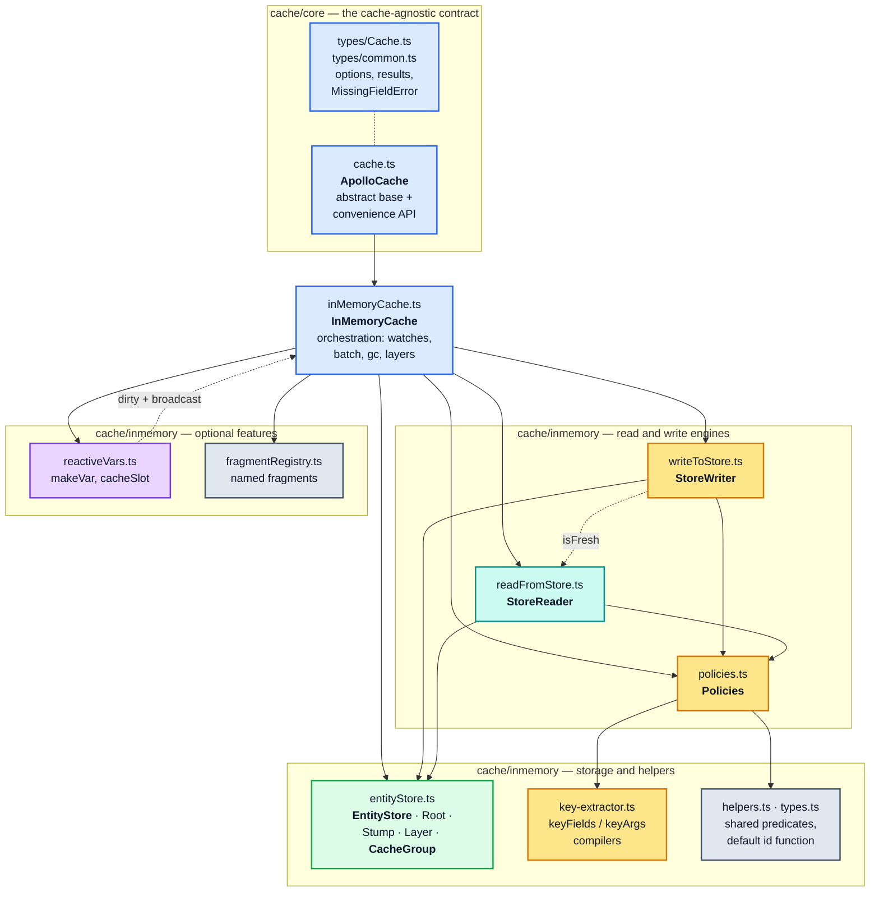
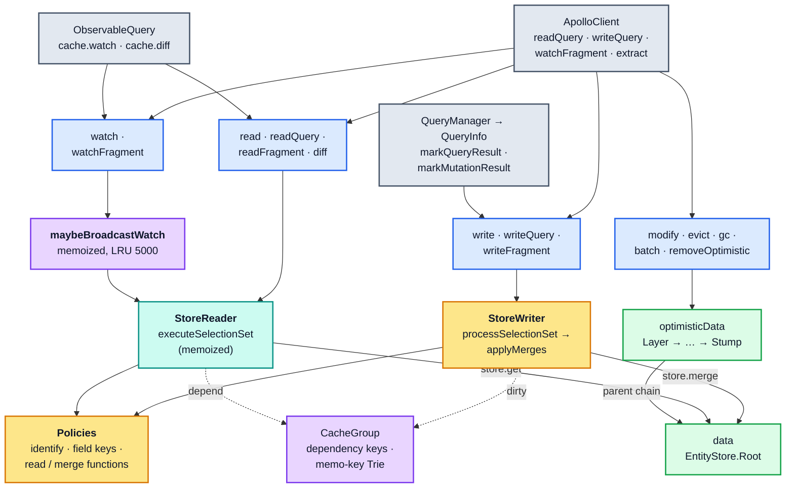
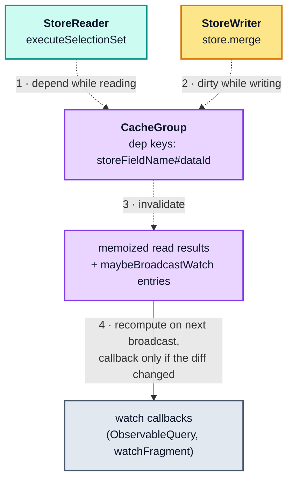

# Part 0 — Orientation

[Documentation](../README.md) › [Architecture guide](README.md) · [← Architecture guide](README.md) · [Part 1 →](01-foundations.md)

## 0.1 The one-paragraph mental model

`InMemoryCache` is a **normalizing, dependency-tracking, layered document store for GraphQL
results**. Writes shred a response tree into a flat map of entities keyed by a stable
identity (`Todo:3`), replacing every identifiable child object with a `{ __ref }` pointer.
Reads walk a GraphQL selection set over that flat map and re-assemble a response-shaped
tree, memoizing every subtree keyed by `(selectionSet, parentEntity, variables)` and
recording exactly which `(entityId, storeFieldName)` pairs each memoized subtree consumed.
When a write changes a field, only the memoized subtrees that recorded a dependency on
that field, plus the subtrees that contain them, are recomputed; every untouched subtree
is reused by reference. Re-reading therefore follows what actually changed rather than
the size of the query. Optimistic updates are a linked list of copy-on-write
layers stacked above the durable root, so they can be rolled back without touching
server data.

The [Demystifying Cache Normalization](https://www.apollographql.com/blog/demystifying-cache-normalization)
blog post describes the first sentence. This document covers the rest — the parts that
make the cache fast, reactive, and transactional.

## 0.2 The blog's example, as the cache actually stores it

The blog says the cache "splits results into objects, assigns identifiers, and stores them
flat". Here is the literal `cache.extract()` output for its `GetAllTodos` example, taken
from [section 1 of the probe](../probes/cache-behavior-probe.mjs):

```jsonc
{
  "Todo:1": { "__typename": "Todo", "id": 1, "text": "First todo",  "completed": true  },
  "Todo:2": { "__typename": "Todo", "id": 2, "text": "Second todo", "completed": false },
  "Todo:3": { "__typename": "Todo", "id": 3, "text": "Third todo",  "completed": false },
  "ROOT_QUERY": {
    "__typename": "Query",
    "todos": [{ "__ref": "Todo:1" }, { "__ref": "Todo:2" }, { "__ref": "Todo:3" }]
  }
}
```

Writing the blog's `EditTodo` mutation result records the operation on the mutation root
under an **argument-encoded field key**, while `Todo:3` is merged in place:

```jsonc
{
  "ROOT_MUTATION": {
    "__typename": "Mutation",
    "editTodo({\"id\":3,\"text\":\"Best todo\"})": {
      "__typename": "EditTodoResponse",
      "todo": { "__ref": "Todo:3" }
    }
  },
  "Todo:3": { "__typename": "Todo", "id": 3, "text": "Best todo", "completed": false }
}
```

The probe writes the mutation result straight into the cache, which is what this snapshot
shows. When the same mutation runs through `client.mutate`, `QueryInfo.markMutationResult`
deletes every `ROOT_MUTATION` field except `__typename` once the `update` function has run
(unless `keepRootFields: true`), so `editTodo(...)` does not stay in the store. `Todo:3`
does stay ([§8.5](08-client-pipeline.md#85-mutations--optimistic-layer-final-write-root-field-scrub)).

Three things the blog does not mention are already visible here, and each is load-bearing
for the rest of this document:

1. `editTodo(...)` is a **`storeFieldName`**, not a field name. Arguments are serialised
   into the key by `canonicalStringify` so that key order in variables cannot produce two
   different entries for the same logical field ([§3.3](03-policies.md#33-field-identity-getstorefieldname)).
2. `EditTodoResponse` has no `id`, so it is **not** normalized. It is stored inline inside
   `ROOT_MUTATION` as a nested `StoreObject`. Only identifiable objects get hoisted
   ([§3.2](03-policies.md#32-entity-identity-policiesidentify)).
3. Every write **retains** the id it wrote to. `ROOT_QUERY` and `ROOT_MUTATION` are
   garbage-collection roots anyway, but for a `writeFragment` target this retention is what
   keeps the entity alive through garbage collection ([§2.9](02-normalized-store.md#29-garbage-collection)).

## 0.3 File map



| File | Lines | Responsibility |
| --- | ---: | --- |
| `cache/core/cache.ts` | 934 | The `ApolloCache` contract plus the concrete convenience layer (`readQuery`, `writeFragment`, `updateQuery`, `watchFragment`) that every cache inherits. |
| `cache/core/types/Cache.ts` | 410 | Option and result types for the abstract methods. |
| `cache/core/types/common.ts` | 135 | `MissingFieldError`, `Modifier`, `ReadFieldOptions`. |
| `cache/inmemory/inMemoryCache.ts` | 610 | Orchestration only. Holds `data`/`optimisticData`, the watch set, `txCount`, and the `maybeBroadcastWatch` memoizer. Delegates all real work. |
| `cache/inmemory/entityStore.ts` | 883 | The normalized store, the layer chain, and the dependency graph. |
| `cache/inmemory/policies.ts` | 1216 | Every configuration-driven decision: identity, field keys, read/merge functions, fragment matching. |
| `cache/inmemory/key-extractor.ts` | 270 | Compiles `keyFields`/`keyArgs` specifier arrays into functions. |
| `cache/inmemory/readFromStore.ts` | 507 | The memoized read path. |
| `cache/inmemory/writeToStore.ts` | 967 | The two-phase write path. |
| `cache/inmemory/reactiveVars.ts` | 123 | `makeVar` and the cache↔variable attachment registry. |
| `cache/inmemory/fragmentRegistry.ts` | 179 | Optional registry so documents can reference fragments they don't declare. |
| `cache/inmemory/helpers.ts` | 151 | Small shared predicates and the default id function. |

## 0.4 Vocabulary

These terms are used with precision throughout. Confusing `fieldName` with
`storeFieldName`, or `dataId` with `Reference`, makes the rest of the code unreadable.

| Term | Type | Definition | Example |
| --- | --- | --- | --- |
| **`dataId`** | `string` | The cache-wide unique key of an entity. Produced by `Policies.identify`. | `"Todo:3"`, `"ROOT_QUERY"` |
| **`Reference`** | `{ __ref: string }` | A pointer to a `dataId`. The only way one entity refers to another. | `{ __ref: "Todo:3" }` |
| **`StoreObject`** | `Record<string, StoreValue>` | The flat, per-entity record. Values are scalars, `Reference`s, arrays, or nested non-normalized objects. | `{ __typename: "Todo", id: 3, text: "…" }` |
| **`StoreValue`** | union | Anything storable in a `StoreObject` field. | `3`, `{ __ref }`, `[{ __ref }]` |
| **`NormalizedCacheObject`** | `Record<dataId, StoreObject>` | The whole serializable store, plus an optional `__META`. | see [§0.2](#02-the-blogs-example-as-the-cache-actually-stores-it) |
| **`fieldName`** | `string` | The GraphQL field name, without arguments. | `"feed"` |
| **`storeFieldName`** | `string` | The key actually used inside a `StoreObject`: `fieldName` plus a serialised argument/key suffix. | `feed({"type":"top"})` |
| **`resultKeyName`** | `string` | The key used in the *result* object — the alias if present, otherwise `fieldName`. Never appears in the store. | `"topFeed"` for `topFeed: feed(...)` |
| **`selectionSet`** | AST node | A `SelectionSetNode`. Used as an identity-comparable memoization key, so AST stability matters. | — |
| **`varString`** | `string` | `canonicalStringify(variables)`. Part of every read memo key. | `'{"limit":10}'` |
| **`layer`** | `EntityStore` | One copy-on-write frame of optimistic data. | — |
| **`CacheGroup`** | class | The dependency-tracking scope. Exactly two exist per cache: root and optimistic. | — |
| **`dep key`** | `string` | `storeFieldName + "#" + dataId` — the atom of the dependency graph. | `text#Todo:3` |

## 0.5 The whole machine in one diagram



The two dotted edges are the most important structural fact in that diagram. They are
two sides of one loop:



`StoreReader` *registers* dependencies in the `CacheGroup` while reading, `StoreWriter`
*dirties* them while writing, and the `CacheGroup` *invalidates* the memoized read results
and the `maybeBroadcastWatch` entries built on them. The next broadcast recomputes only
those entries, and a watch callback fires only when its diff actually changed
([§6.2](06-reactivity.md#62-broadcastwatch-and-the-equality-gate)). Everything else is plumbing around that
loop.

<!-- nav:bottom -->

---

| ← Previous | Up | Next → |
| :-- | :-: | --: |
| [Architecture guide](README.md) | [Architecture guide](README.md) | [Part 1 — Foundations](01-foundations.md) |
