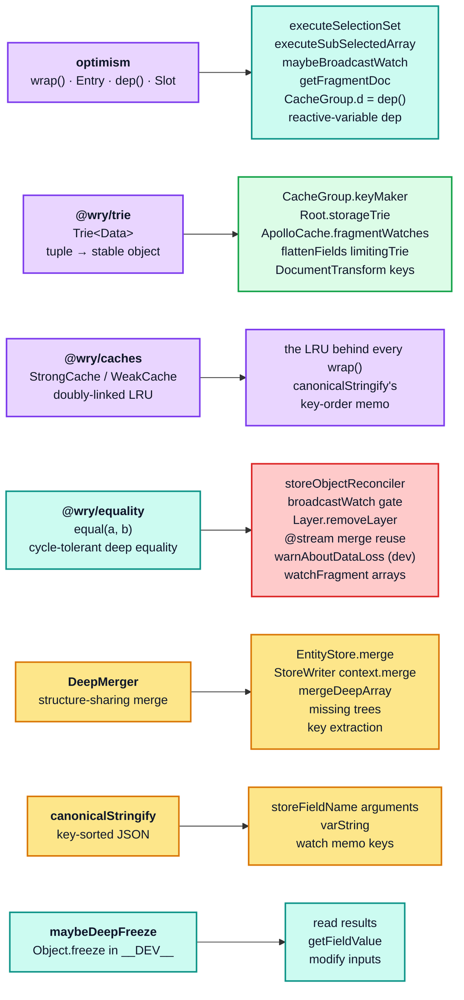

# Part 1 — Foundations

[Documentation](../README.md) › [Architecture guide](README.md) · [← Part 0](00-orientation.md) · [Part 2 →](02-normalized-store.md)

The cache is built on seven small primitives. None of them are GraphQL-aware, and all of
them are load-bearing for correctness, not just performance. Re-implementing the cache
without equivalents for these is not possible. (`optimism` itself is built on `@wry/trie`
for its default cache keys and on `@wry/caches` for its LRU.)



## 1.1 `optimism` — memoization with automatic dependency tracking

`optimism@0.18.1` provides the reactive core. Two exports matter.

### `wrap(fn, options)` → memoized function

`wrap` returns a function that caches results in an LRU keyed by
`makeCacheKey(keyArgs(...args))`. The crucial difference from ordinary memoization is that
each cached result is an **`Entry` node in a bipartite dependency graph**, and entries
recompute lazily when anything they read has been marked dirty.

```ts
// node_modules/optimism/src/index.ts
const optimistic = function (): TResult {
  const key = makeCacheKey.apply(null, keyArgs ? keyArgs.apply(null, arguments) : arguments);
  if (key === void 0) {
    return originalFunction.apply(null, arguments);   // memoization opted out
  }
  let entry = cache.get(key)!;
  if (!entry) {
    cache.set(key, entry = new Entry(originalFunction));
    // ...
  }
  const value = entry.recompute(Array.prototype.slice.call(arguments) as TArgs);
  cache.set(key, entry);                              // LRU: move to front
  // ...
  return value;
};
```

Note the first branch: **returning `undefined` from `makeCacheKey` disables memoization for
that call**. The cache uses this deliberately — `StoreReader`'s `makeCacheKey` returns
`undefined` when `supportsResultCaching(context.store)` is false, which is how
`resultCaching: false` is implemented without a second code path.

### `Entry` — the dependency graph

```ts
// node_modules/optimism/src/entry.ts
export class Entry<TArgs extends any[], TValue> {
  public readonly parents = new Set<AnyEntry>();
  public readonly childValues = new Map<AnyEntry, Value<any>>();
  public dirtyChildren: Set<AnyEntry> | null = null;
  public dirty = true;
  public readonly value: Value<TValue> = [];

  public recompute(args: TArgs): TValue {
    assert(! this.recomputing, "already recomputing");
    rememberParent(this);
    return mightBeDirty(this) ? reallyRecompute(this, args) : valueGet(this.value);
  }
}
```

The mechanics that matter for the cache:

- **`parentEntrySlot`** is a dynamically-scoped variable holding the entry currently being
  recomputed. `rememberParent(child)` reads it, so any `wrap`ped call made *inside* another
  `wrap`ped call automatically becomes its child. **No explicit dependency wiring exists
  anywhere in the cache** — nesting is the wiring.
- **`setDirty()`** flips `dirty` and reports upward through `reportDirtyChild`, which adds
  the child to each parent's `dirtyChildren` set and keeps climbing only from parents that
  were clean until then. A mark costs one step per ancestor that newly becomes "possibly
  dirty" and stops at ancestors that already knew. Recomputation waits for the next read.
- **An entry with any possibly-dirty child reruns its whole function.** `recompute` checks
  `mightBeDirty(this)` (`dirty`, or a non-empty `dirtyChildren`) and, if it is true, calls
  `reallyRecompute`. That forgets the entry's children and dependencies and runs the wrapped
  function again. optimism 0.18.1 has no "check the children first" pass. The rerun is cheap
  for unchanged children, because they answer from their own memo entries.
- **`reportCleanChild`** holds the one short-circuit. Suppose a child is recomputed through
  some *other* parent before this parent is read. The parent then compares the child's new
  value with the value it recorded. If they are `===`, it removes the child from
  `dirtyChildren` and can become clean without rerunning:

  ```ts
  const childValue = parent.childValues.get(child)!;
  if (childValue.length === 0) {
    parent.childValues.set(child, valueCopy(child.value));
  } else if (! valueIs(childValue, child.value)) {
    parent.setDirty();
  }
  ```

  In the cache this short-circuit rarely fires. `execSelectionSetImpl` and
  `execSubSelectedArrayImpl` build a new result object every time they run, so a recomputed
  child is never `===` its previous value. A deeply-equal write is stopped one step earlier:
  `storeObjectReconciler` ([§2.6](02-normalized-store.md#26-writes-merge-and-storeobjectreconciler)) keeps the
  existing value, the merge dirties nothing, and no entry is marked at all. A write that
  does change a field makes every ancestor entry rerun, while untouched subtrees come back
  by reference ([§5.7](05-store-reader.md#57-what-a-read-leaves-behind)).

### `dep()` — dependency leaves

```ts
// node_modules/optimism/src/dep.ts
export function dep<TKey>(options?: { subscribe: Dep<TKey>["subscribe"] }) {
  const depsByKey = new Map<TKey, Dep<TKey>>();
  function depend(key: TKey) {
    const parent = parentEntrySlot.getValue();
    if (parent) {
      let dep = depsByKey.get(key);
      if (!dep) depsByKey.set(key, dep = new Set as Dep<TKey>);
      parent.dependOn(dep);
      // ...
    }
  }
  depend.dirty = function dirty(key: TKey, entryMethodName?: EntryMethodName) {
    const dep = depsByKey.get(key);
    if (dep) {
      const m = (entryMethodName && hasOwnProperty.call(EntryMethods, entryMethodName))
        ? entryMethodName : "setDirty";
      arrayFromSet(dep).forEach(entry => entry[m]());
      depsByKey.delete(key);
      maybeUnsubscribe(dep);
    }
  };
  return depend as OptimisticDependencyFunction<TKey>;
}
```

A `dep` is a leaf in the graph: it has parents but no value and no children. `CacheGroup`
owns exactly one `dep` instance and uses field-level string keys
([§2.4](02-normalized-store.md#24-cachegroup--the-dependency-graph)).

`dirty(key, method)` supports three escalation levels. The cache uses two of them:

| Method | Effect | Used for |
| --- | --- | --- |
| `setDirty` (default) | Mark entries stale; they stay in the LRU and keep their edges. | Ordinary field changes. |
| `dispose` | Detach the entry from parents/children but leave it in the LRU. | not used by the cache |
| `forget` | Fully remove the entry from the LRU and the graph. | `__exists` dirtying — see [§2.4](02-normalized-store.md#24-cachegroup--the-dependency-graph). |

`depsByKey.delete(key)` after dirtying means dependency sets are **rebuilt on the next
read**, so the graph stays proportional to what is currently being observed.

### `Slot` — dynamic scoping

`cacheSlot` ([§6.6](06-reactivity.md#66-reactive-variables)) and `parentEntrySlot` are `Slot` instances.
`slot.withValue(v, fn, args)` runs `fn` with `slot.getValue() === v`, restoring the
previous value afterwards. This is how a reactive variable called from inside a `read`
function, several frames deep inside `executeSelectionSet`, discovers which cache is
reading it: `Policies.readField` runs every `read` function inside
`cacheSlot.withValue(this.cache, ...)`. Nothing has to thread the cache through every
signature. (The `read` function itself already receives the cache as `options.cache`.)

## 1.2 `@wry/trie` — tuples as stable object identities

```ts
// node_modules/@wry/trie/src/index.ts
export class Trie<Data> {
  private weak?: WeakMap<any, Trie<Data>>;
  private strong?: Map<any, Trie<Data>>;
  private data?: Data;
  constructor(private weakness = true, private makeData: (array: any[]) => Data = defaultMakeData) {}

  public lookupArray<T extends IArguments | any[]>(array: T): Data {
    let node: Trie<Data> = this;
    forEach.call(array, key => node = node.getChildTrie(key));
    return hasOwnProperty.call(node, "data") ? node.data as Data : node.data = this.makeData(slice.call(array));
  }
}
```

`trie.lookupArray([a, b, c])` returns the *same object* every time it is called with the
same three values, comparing them by `===`. Object keys are held in a `WeakMap` (when
`weakness` is on) and primitives in a `Map`, so a trie can mix both.

This turns an argument tuple into a single identity usable as a `Map` key, which is what
makes `optimism` cache keys cheap. Six kinds of trie take part:

| Trie | Owner | Key tuple | Weak? |
| --- | --- | --- | --- |
| `keyMaker` | `CacheGroup` (one per group, so two per cache) | varies per call site (see the `makeCacheKey` overloads) | yes |
| `storageTrie` | `EntityStore.Root` | `[entityIdOrObject, ...storeFieldNames]` | yes |
| `fragmentWatches` | `ApolloCache` | `[fragmentQueryDoc, canonicalStringify({id, optimistic, variables})]` | yes |
| `limitingTrie` | `StoreWriter.flattenFields` (per call) | `[selectionSet, clientOnly, deferred]` | **no** |
| `stableCacheKeys` | `DocumentTransform` (the cache's `addTypenameTransform`) | `getCacheKey(document)`, which is `[document]` by default | yes |
| `defaultKeyTrie` | `optimism` module-global | the raw arguments; `getFragmentDoc` prepends the cache instance through `bindCacheKey(this)` | yes |

`CacheGroup.keyMaker` is declared with three typed overloads, which is the cleanest
inventory of what actually gets memoized in the read path:

```ts
// cache/inmemory/entityStore.ts — EntityStore#makeCacheKey
/** overload for `InMemoryCache.maybeBroadcastWatch` */
public makeCacheKey(document: DocumentNode, callback: Cache.WatchCallback<any>, details: string): object;
/** overload for `StoreReader.executeSelectionSet` */
public makeCacheKey(selectionSet: SelectionSetNode, parent: string | StoreObject, varString: string | undefined): object;
/** overload for `StoreReader.executeSubSelectedArray` */
public makeCacheKey(field: FieldNode, array: readonly any[], varString: string | undefined): object;
public makeCacheKey() { return this.group.keyMaker.lookupArray(arguments); }
```

Because `keyMaker` lives on the `CacheGroup`, and `resetCaching()` replaces it with a fresh
`Trie`, discarding a group's memo keys is a single pointer assignment.

## 1.3 `@wry/caches` — the LRU behind every memo

`StrongCache` and `WeakCache` are LRU maps built on a `Map`/`WeakMap` plus a doubly-linked
recency list. `WeakCache` additionally holds keys through `WeakRef` and deregisters
entries via `FinalizationRegistry`, so a memo keyed by a `DocumentNode` cannot pin that
document in memory.

Eviction is *not* eager. `wrap` only calls `cache.clean()` when no computation is in
flight:

```ts
// node_modules/optimism/src/index.ts
if (! parentEntrySlot.hasValue()) {
  caches.forEach(cache => cache.clean());
  caches.clear();
}
```

so a deep recursive read never has entries evicted out from under it mid-traversal.
`dispose` is wired to `entry.dispose()`, so evicting a memo entry dirties its parents —
eviction is a correctness-preserving operation, just a slow one.

Default sizes (`utilities/caching/sizes.ts`) are worth memorising, because they define the
working-set assumptions of the whole cache:

```ts
export const enum defaultCacheSizes {
  // ...
  canonicalStringify = 1000,
  "cache.fragmentQueryDocuments" = 1000,
  "inMemoryCache.maybeBroadcastWatch" = 5000,
  "inMemoryCache.executeSelectionSet" = 50000,
  "inMemoryCache.executeSubSelectedArray" = 10000,
}
```

## 1.4 `@wry/equality` — the change detector

`equal(a, b)` is a cycle-tolerant structural comparison. Three of its behaviours matter
here:

- **`undefined`-valued keys are ignored.** `definedKeys` filters them out before comparing
  key counts, so `{ a: 1 }` and `{ a: 1, b: undefined }` are equal. Two objects that differ
  only by an `undefined`-valued key therefore never count as a change.
- **Non-native functions with identical source are equal.** This only matters if functions
  end up inside compared values, which does not happen with JSON results.
- **Termination on cycles** is guaranteed by a module-level `previousComparisons` map that
  is cleared in a `finally`.

The cache calls `equal` in six places. Each one is a *gate* that decides whether work can
be skipped, not part of a computation:

| Call site | Purpose |
| --- | --- |
| `storeObjectReconciler` | Keep the stored value (and its `===` identity) when a written value is deeply equal to it. |
| `InMemoryCache.broadcastWatch` | Skip a watcher callback when the recomputed diff is unchanged. |
| `Layer.removeLayer` | Dirty only the fields whose value actually changes when the layer goes away. |
| `Policies.runMergeFunction` | Reuse a previous `@stream` merge result. |
| `warnAboutDataLoss` (development only) | Stay silent when the replaced object is deeply equal. |
| `ApolloCache.watchFragment` (array `from`) | Reuse the previous combined result when nothing changed. |

## 1.5 `DeepMerger` — merging with maximal structure sharing

```ts
// utilities/internal/DeepMerger.ts
public merge(target: any, source: any, mergeOptions: DeepMerger.MergeOptions = {}): any {
  // ... atPath / array-truncation handling elided ...
  if (isNonNullObject(source) && isNonNullObject(target)) {
    Object.keys(source).forEach((sourceKey) => {
      if (hasOwnProperty.call(target, sourceKey)) {
        const targetValue = target[sourceKey];
        if (source[sourceKey] !== targetValue) {
          const result = this.reconciler(target, source, sourceKey);
          // A well-implemented reconciler may return targetValue to indicate
          // the merge changed nothing about the structure of the target.
          if (result !== targetValue) {
            target = this.shallowCopyForMerge(target);
            target[sourceKey] = result;
          }
        }
      } else {
        // If there is no collision, the target can safely share memory with
        // the source, and the recursion can terminate here.
        target = this.shallowCopyForMerge(target);
        target[sourceKey] = source[sourceKey];
      }
    });
    return target;
  }
  return source;
}
```

Three properties the cache depends on:

1. **Copy-on-write.** `target` is only shallow-copied when a key actually changes, so an
   unchanged merge returns the original object by identity.
2. **`pastCopies`** ensures each object is copied at most once per `DeepMerger` instance,
   which is why the writer allocates one merger per write
   (`makeProcessedFieldsMerger()`) and reuses it across the whole traversal.
3. **A pluggable `reconciler`** lets `EntityStore.merge` swap the default recursive merge
   for `storeObjectReconciler`, turning a deep merge into a *shallow field-wise* merge with
   an equality escape hatch.

`mergeDeepArray(sources)` folds a list with one shared merger. `StoreReader` uses it to
assemble a result object from one single-key object per field.

## 1.6 `canonicalStringify` — deterministic keys

```ts
// utilities/internal/canonicalStringify.ts
function stableObjectReplacer(key: string, value: any) {
  if (value && typeof value === "object") {
    const proto = Object.getPrototypeOf(value);
    if (proto === Object.prototype || proto === null) {
      const keys = Object.keys(value);
      if (keys.every(everyKeyInOrder)) return value;   // already sorted: no allocation
      const unsortedKey = JSON.stringify(keys);
      let sortedKeys = sortingMap.get(unsortedKey);
      // ...
    }
  }
  return value;
}
```

It is `JSON.stringify` with a replacer that emits object keys in sorted order, memoizing
*key-set permutations* (not values) in an LRU of 1000 entries. It is what makes
`feed({"limit":10,"type":"top"})` independent of the order the caller wrote the variables,
verified by the probe:

```
--- argument canonicalisation ---
{
  "unsortedInput": ["__typename", "search({\"where\":{\"a\":1,\"b\":2}})"],
  "sortedInput":   ["__typename", "search({\"where\":{\"a\":1,\"b\":2}})"]
}
  [PASS] canonicalStringify sorts nested argument keys so both writes collide
```

`JSON.stringify` calls a value's `toJSON` before the replacer sees it, so a `Date` in
variables arrives as a string. Other non-plain objects (class instances) are passed through
untouched, which means their keys are *not* sorted.

`canonicalStringify` builds the default `storeFieldName` argument suffix, `varString`, and
the watch memo keys. It is **not** what builds `keyFields` ids or `keyArgs` suffixes: those
use plain `JSON.stringify` over an object assembled in specifier order
([§3.2](03-policies.md#32-entity-identity-policiesidentify), [§3.3](03-policies.md#33-field-identity-getstorefieldname)).

## 1.7 `maybeDeepFreeze` — the immutability contract

```ts
export function maybeDeepFreeze<T>(obj: T): T {
  if (__DEV__) { deepFreeze(obj); }
  return obj;
}
```

`InMemoryCache` sets `assumeImmutableResults = true` (overriding the `ApolloCache` default
of `false`). The contract is: **read results and stored values are logically immutable**,
enforced with `Object.freeze` in development and merely assumed in production. Consumers
may therefore compare results with `===` instead of deep equality.

The write path pays for this contract with `cloneDeep`: because a scalar value from a user
result object may later be frozen when it is read back, the writer defensively clones
scalars in development so the caller's own object is never frozen:

```ts
// cache/inmemory/writeToStore.ts — StoreWriter#processFieldValue
if (!field.selectionSet || value === null) {
  // In development, we need to clone scalar values so that they can be
  // safely frozen with maybeDeepFreeze in readFromStore.ts. In production,
  // it's cheaper to store the scalar values directly in the cache.
  return __DEV__ ? cloneDeep(value) : value;
}
```

The probe confirms both halves of the contract (section 15): read results are deeply
frozen, and the caller's input object is not.

<!-- nav:bottom -->

---

| ← Previous | Up | Next → |
| :-- | :-: | --: |
| [Part 0 — Orientation](00-orientation.md) | [Architecture guide](README.md) | [Part 2 — The normalized store](02-normalized-store.md) |
