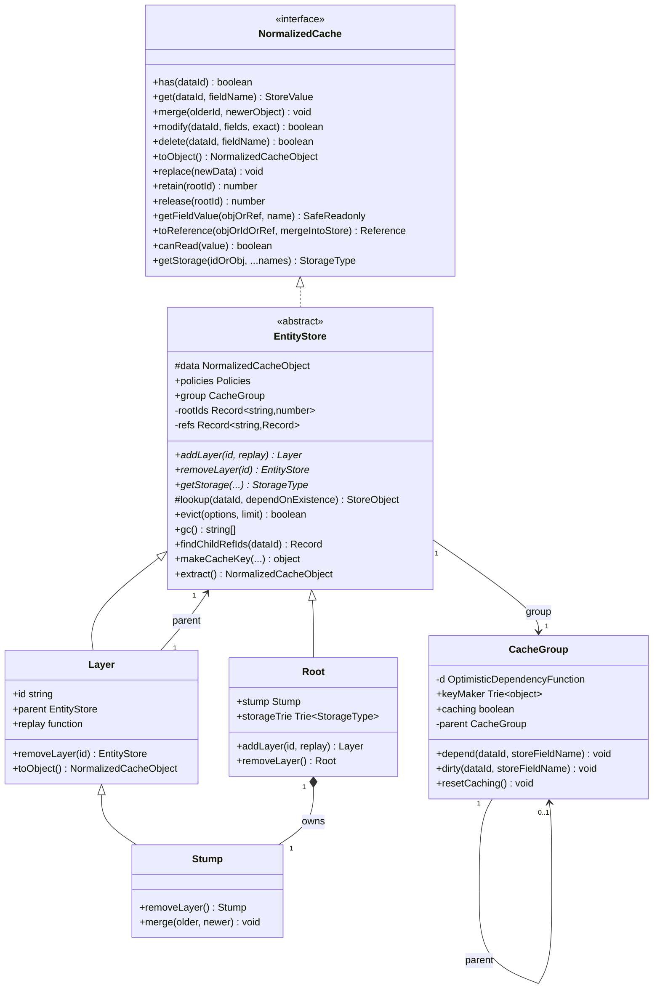
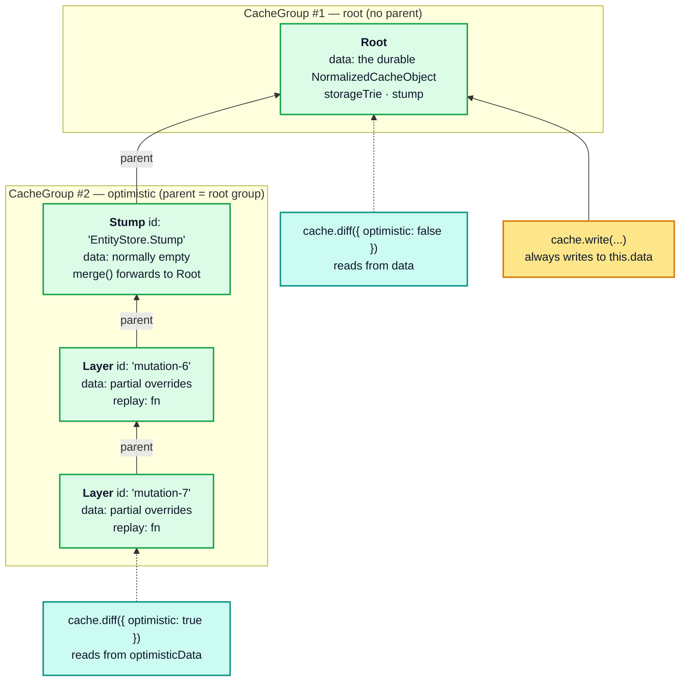
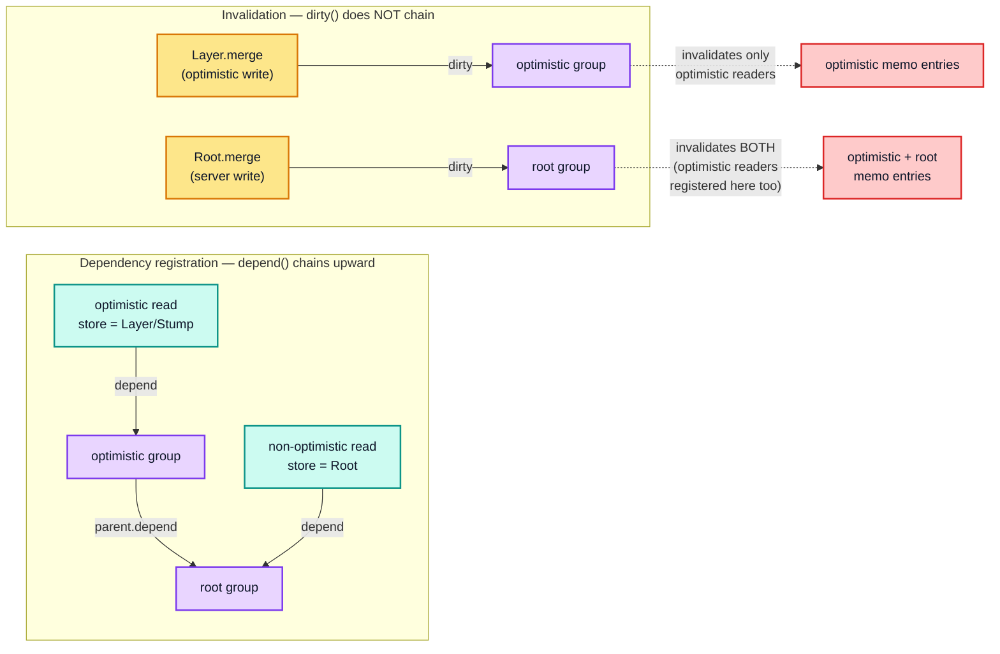
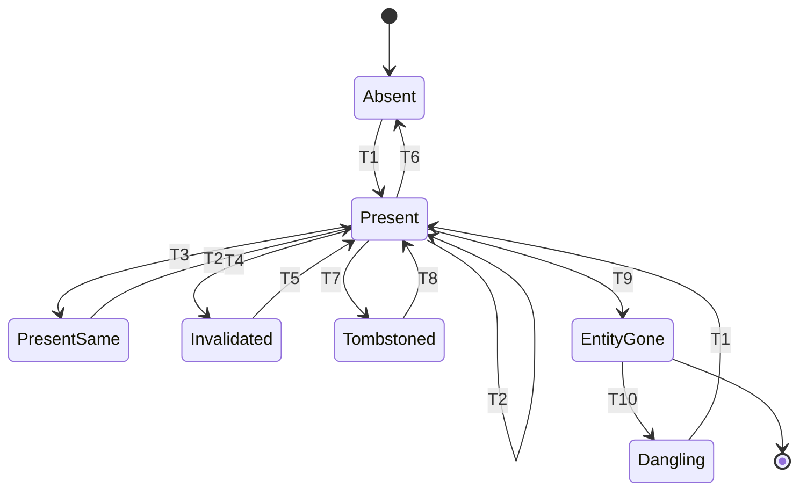
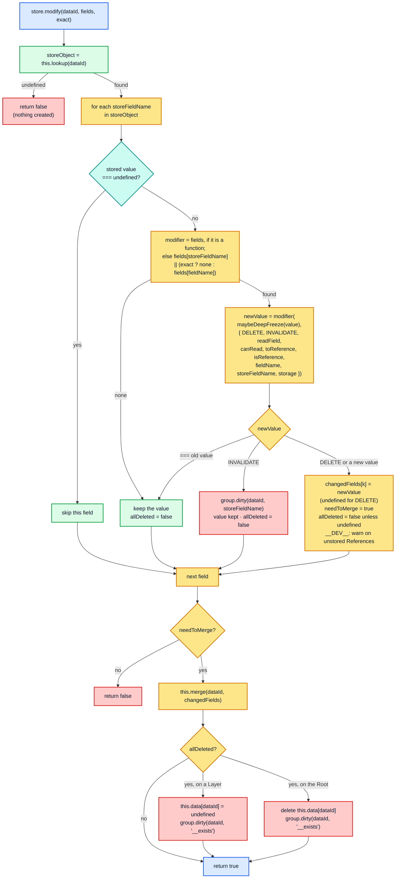
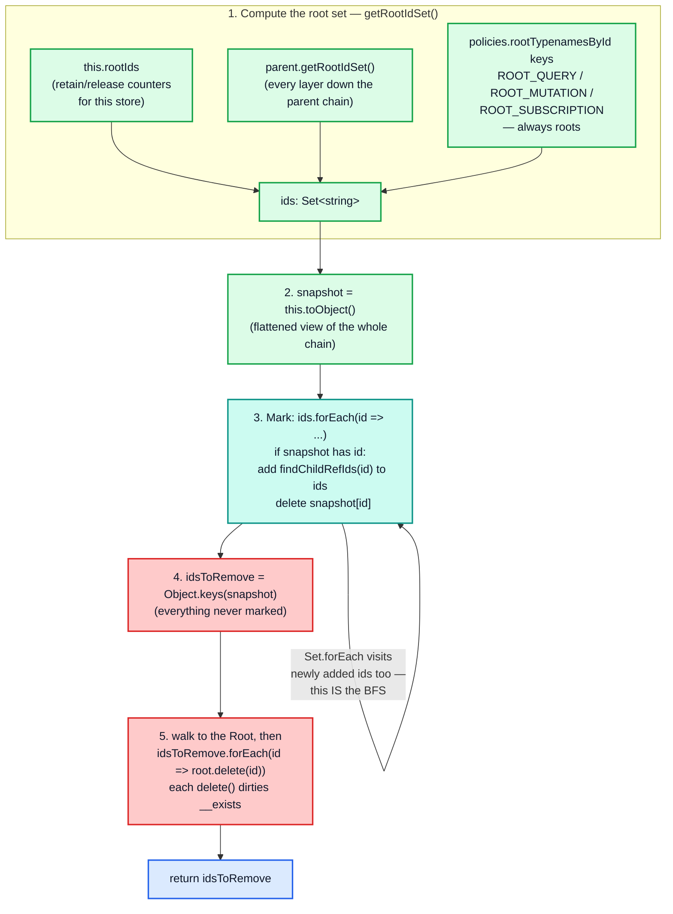
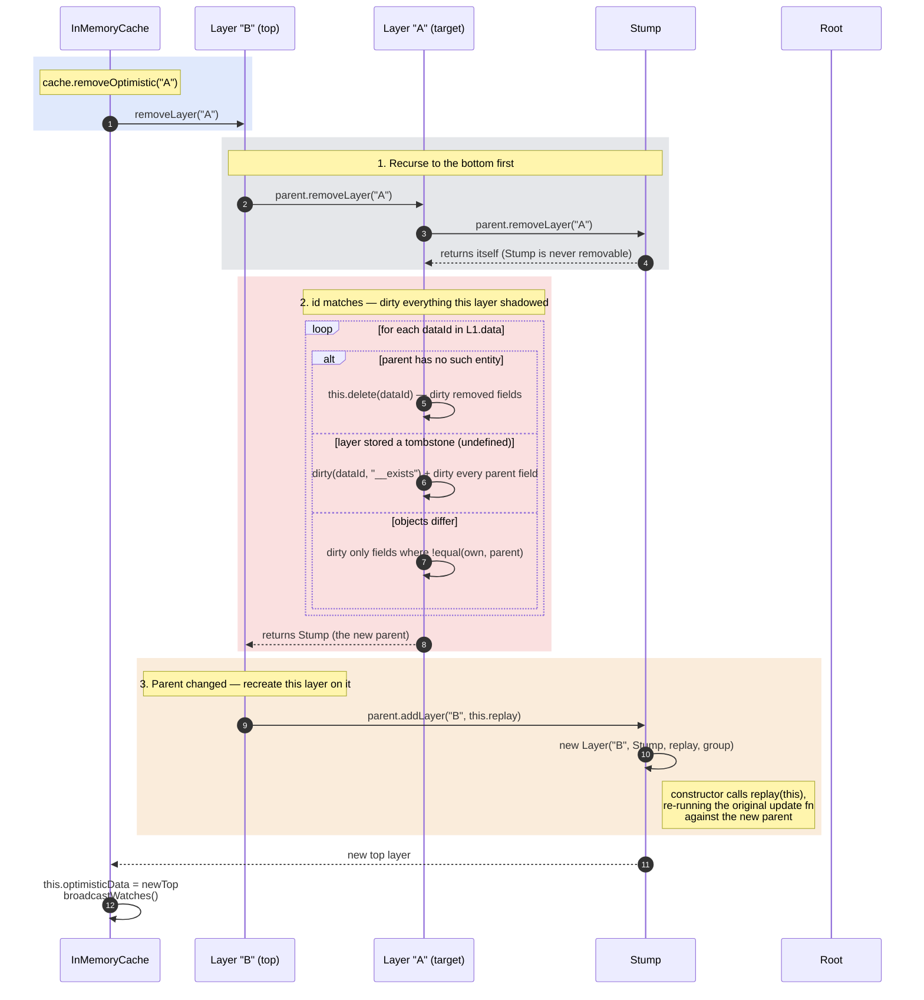

# Part 2 — The normalized store

[Documentation](../README.md) › [Architecture guide](README.md) · [← Part 1](01-foundations.md) · [Part 3 →](03-policies.md)

`entityStore.ts` contains the four store classes (`EntityStore`, `Root`, `Layer`, `Stump`)
and the `CacheGroup` dependency tracker. This is where all state lives; `InMemoryCache`
itself holds almost nothing.



## 2.1 The layer chain

`InMemoryCache.init()` builds the initial two-node chain:

```ts
// cache/inmemory/inMemoryCache.ts
private init() {
  const rootStore = (this.data = new EntityStore.Root({
    policies: this.policies,
    resultCaching: this.config.resultCaching,
  }));
  // When no optimistic writes are currently active, cache.optimisticData ===
  // cache.data, so there are no additional layers on top of the actual data.
  // ...
  this.optimisticData = rootStore.stump;
  this.resetResultCache();
}
```

Read that comment carefully — it is slightly out of date. `optimisticData` is the
**`Stump`**, not the `Root`. The `Stump` is a permanently-installed empty `Layer` that
exists purely to own a *second* `CacheGroup`:

```ts
// cache/inmemory/entityStore.ts
class Stump extends Layer {
  constructor(root: Root) {
    super("EntityStore.Stump", root, () => {}, new CacheGroup(root.group.caching, root.group));
  }
  public removeLayer() { return this; }              // never removable
  public merge(older, newer) { return this.parent.merge(older, newer); }  // never stores
}
```



Why the `Stump` exists at all: a `CacheGroup` is the invalidation scope, and an optimistic
layer's writes dirty only the layer's own group. Every `Layer` shares the group of the
`Stump` below it (`Layer.addLayer` passes `this.group` through). Optimistic reads made
while no layer exists go through the `Stump`, so they register in that same group. When a
layer is added later and its update function writes, it dirties exactly the group those
readers registered in. Without the `Stump`, those readers would have registered only in the
root group, and a later layer write would never invalidate them. With it, the whole
optimistic stack is one invalidation scope no matter how deep it is, and it exists before
the first layer does.

> **Sharp edge.** `Stump.merge` forwards to the `Root`. So `cache.modify({ optimistic: true })`
> with **no active layers** changes the durable root data, because `optimisticData` *is* the
> `Stump`. With layers active, the same call writes into the **top** layer instead, and that
> change is lost as soon as the layer is rebuilt or removed, because it is not part of any
> layer's replay function. Isolated, replayable optimistic writes only happen inside
> `cache.batch({ optimistic: "someId" })`.
>
> One corner case breaks "the `Stump` is always empty". If a modifier deletes **every**
> field of an entity through the `Stump`, `EntityStore.modify` forwards the field deletions
> to the `Root` (leaving an empty `{}` there), but then records the entity-level tombstone
> (`data[dataId] = undefined`) on `this`, which is the `Stump`. Optimistic reads then see
> the entity as deleted, while non-optimistic reads see an empty object.

## 2.2 Reading a field through the chain

```ts
// cache/inmemory/entityStore.ts
public get(dataId: string, fieldName: string): StoreValue {
  this.group.depend(dataId, fieldName);
  if (hasOwn.call(this.data, dataId)) {
    const storeObject = this.data[dataId];
    if (storeObject && hasOwn.call(storeObject, fieldName)) {
      return storeObject[fieldName];
    }
  }
  if (fieldName === "__typename" && hasOwn.call(this.policies.rootTypenamesById, dataId)) {
    return this.policies.rootTypenamesById[dataId];
  }
  if (this instanceof Layer) {
    return this.parent.get(dataId, fieldName);
  }
}
```

Four behaviours packed into fifteen lines:

1. **`group.depend` runs first, unconditionally** — including for fields that turn out to
   be missing. Absence is a tracked dependency, so writing a previously-absent field
   correctly invalidates readers that observed it missing.
2. **Own-property checks, not truthiness.** A *field* key present with value `undefined`
   **stops the lookup** and returns `undefined` without consulting the parent. That is the
   field *tombstone*: a `Layer` deletes a field by storing `undefined` for it. (An
   *entity* tombstone, `data[dataId] === undefined`, does not stop `get`: `storeObject` is
   falsy, so the call falls through to the parent. Readers still see such an entity as
   gone, because `StoreReader` checks `has()`, which goes through `lookup`, before reading
   fields from a `Reference`.)
3. **Root `__typename` synthesis.** `ROOT_QUERY.__typename` resolves to `"Query"` even if
   nothing ever wrote it.
4. **Parent recursion** happens only for `Layer`s. A chain of depth *d* costs `O(d)`: at
   each level, a couple of own-property checks plus another `group.depend` call (all
   layers share one group, so these repeat the same idempotent registration).

`lookup(dataId, dependOnExistence?)` is the whole-object analogue. Its optional
`__exists` dependency is what `has()` uses:

```ts
protected lookup(dataId: string, dependOnExistence?: boolean): StoreObject | undefined {
  // The has method (above) calls lookup with dependOnExistence = true, so
  // that it can later be invalidated when we add or remove a StoreObject for
  // this dataId. Any consumer who cares about the contents of the StoreObject
  // should not rely on this dependency, since the contents could change
  // without the object being added or removed.
  if (dependOnExistence) this.group.depend(dataId, "__exists");
  if (hasOwn.call(this.data, dataId)) return this.data[dataId];
  if (this instanceof Layer) return this.parent.lookup(dataId, dependOnExistence);
  if (this.policies.rootTypenamesById[dataId]) return {};
}
```

The last line means `ROOT_QUERY`/`ROOT_MUTATION`/`ROOT_SUBSCRIPTION` always "exist" as
empty objects, so `has("ROOT_QUERY")` is `true` before anything is written.
(`execSelectionSetImpl` also exempts root ids from its dangling-reference check
explicitly, so reading a never-written query yields "missing field" errors rather than
"dangling reference".) It also means `merge` finds an `existing` object for a root id the
first time it is written, so creating `ROOT_QUERY` does not dirty `__exists`.

Three bound helpers are handed to user-supplied field policy functions and to
`StoreReader`:

```ts
public getFieldValue = <T = StoreValue>(objectOrReference, storeFieldName) =>
  maybeDeepFreeze(
    isReference(objectOrReference)
      ? this.get(objectOrReference.__ref, storeFieldName)
      : objectOrReference && objectOrReference[storeFieldName]
  ) as SafeReadonly<T>;

public canRead: CanReadFunction = (objOrRef) =>
  isReference(objOrRef) ? this.has(objOrRef.__ref) : typeof objOrRef === "object";

public toReference: ToReferenceFunction = (objOrIdOrRef, mergeIntoStore) => {
  if (typeof objOrIdOrRef === "string") return makeReference(objOrIdOrRef);
  if (isReference(objOrIdOrRef)) return objOrIdOrRef;
  const [id] = this.policies.identify(objOrIdOrRef);
  if (id) {
    const ref = makeReference(id);
    if (mergeIntoStore) this.merge(id, objOrIdOrRef);
    return ref;
  }
};
```

`canRead` is the dangling-reference filter: it is how `relayStylePagination`'s `read`
function drops edges whose nodes have been evicted, and how
`StoreReader.execSubSelectedArrayImpl` prunes arrays.

## 2.3 `NormalizedCacheObject` and `__META`

```ts
// cache/inmemory/types.ts
export interface NormalizedCacheObject {
  __META?: {
    // Well-known singleton IDs like ROOT_QUERY and ROOT_MUTATION are
    // always considered to be root IDs during cache.gc garbage
    // collection, but other IDs can become roots if they are written
    // directly with cache.writeFragment or retained explicitly with
    // cache.retain. When such IDs exist, we include them in the __META
    // section so that they can survive cache.{extract,restore}.
    extraRootIds: string[];
  };
  [dataId: string]: StoreObject | undefined;
}
```

`extract()` computes `__META` from the retainment table, and `replace()` re-retains them:

```ts
public extract(): NormalizedCacheObject {
  const obj = this.toObject();
  const extraRootIds: string[] = [];
  this.getRootIdSet().forEach((id) => {
    if (!hasOwn.call(this.policies.rootTypenamesById, id)) extraRootIds.push(id);
  });
  if (extraRootIds.length) obj.__META = { extraRootIds: extraRootIds.sort() };
  return obj;
}

public replace(newData: NormalizedCacheObject | null): void {
  Object.keys(this.data).forEach((dataId) => {
    if (!(newData && hasOwn.call(newData, dataId))) this.delete(dataId);
  });
  if (newData) {
    const { __META, ...rest } = newData;
    Object.keys(rest).forEach((dataId) => this.merge(dataId, rest[dataId] as StoreObject));
    if (__META) __META.extraRootIds.forEach(this.retain, this);
  }
}
```

Note what `replace` does over a non-empty store. Entities absent from `newData` are
deleted, but entities present in both are **merged** field by field, so fields that the
snapshot lacks survive from the old data. `InMemoryCache.restore` avoids that by calling
`init()` first, so it always replaces into a fresh, empty `Root`.

Merging into an empty `Root` has one more consequence: `DeepMerger.merge(undefined,
incoming)` returns `incoming` itself, so each entity object in the snapshot is **adopted by
reference**, not copied. After `restore(snapshot)`, `cache.extract()[id] === snapshot[id]`.
In development builds, later reads freeze those objects, which means they freeze parts of
the caller's snapshot. Pass a copy if the snapshot is used elsewhere.

## 2.4 `CacheGroup` — the dependency graph

```ts
// cache/inmemory/entityStore.ts
class CacheGroup {
  private d: OptimisticDependencyFunction<string> | null = null;
  public keyMaker!: Trie<object>;

  constructor(public readonly caching: boolean, private parent: CacheGroup | null = null) {
    this.resetCaching();
  }

  public resetCaching() {
    this.d = this.caching ? dep<string>() : null;
    this.keyMaker = new Trie();
  }

  public depend(dataId: string, storeFieldName: string) {
    if (this.d) {
      this.d(makeDepKey(dataId, storeFieldName));
      const fieldName = fieldNameFromStoreName(storeFieldName);
      if (fieldName !== storeFieldName) {
        // Fields with arguments that contribute extra identifying
        // information to the fieldName (thus forming the storeFieldName)
        // depend not only on the full storeFieldName but also on the
        // short fieldName, so the field can be invalidated using either
        // level of specificity.
        this.d(makeDepKey(dataId, fieldName));
      }
      if (this.parent) { this.parent.depend(dataId, storeFieldName); }
    }
  }

  public dirty(dataId: string, storeFieldName: string) {
    if (this.d) {
      this.d.dirty(
        makeDepKey(dataId, storeFieldName),
        storeFieldName === "__exists" ? "forget" : "setDirty"
      );
    }
  }
}

function makeDepKey(dataId: string, storeFieldName: string) {
  // Since field names cannot have '#' characters in them, this method
  // of joining the field name and the ID should be unambiguous, and much
  // cheaper than JSON.stringify([dataId, fieldName]).
  return storeFieldName + "#" + dataId;
}
```

Four design decisions here deserve their own paragraph each.

**Two-level dependency keys.** Reading `feed({"type":"top"})` on `ROOT_QUERY` registers
*both* `feed({"type":"top"})#ROOT_QUERY` and `feed#ROOT_QUERY`. That lets a single
`dirty(id, "feed")` invalidate readers of every argument variant. Two places use it:
`cache.evict({ id, fieldName: "feed" })`, which always dirties the bare field name, and
`EntityStore.merge`, which also dirties the bare name when the field has no `keyArgs`
([§2.6](#26-writes-merge-and-storeobjectreconciler)). The dependency keys only invalidate
readers; they remove nothing. The probe's bare-`fieldName` eviction removes every
`feed(...)` key for a different reason: `EntityStore.modify` runs with `exact: false` and
matches each `storeFieldName` by its `fieldNameFromStoreName` prefix
([§2.7](#27-modify--user-controlled-field-surgery)).

**Parent chaining on `depend` only.** The optimistic group's parent is the root group, so
an optimistic read registers in *both* groups. But `dirty` never chains. The asymmetry
produces exactly the desired semantics:



A server write invalidates optimistic readers (they can see through to the root), while an
optimistic write leaves non-optimistic readers alone (they cannot see the layer). Exactly
right, and achieved with one `if (this.parent)`.

**`__exists` uses `forget`, not `setDirty`.** When an entity appears or disappears,
everything the memo layer believes about it is suspect. So every memo entry that depended
on `__exists` for that id is evicted from its LRU (`forget` → `cache.delete` → `dispose`,
which also dirties its parents and detaches it from the graph), rather than merely marked
stale. The dependency set itself is dropped after any `dirty` call, whichever method is
used. The rationale is recorded in a free function used by `StoreReader`:

```ts
export function maybeDependOnExistenceOfEntity(store: NormalizedCache, entityId: string) {
  if (supportsResultCaching(store)) {
    // We use this pseudo-field __exists elsewhere in the EntityStore code to
    // represent changes in the existence of the entity object identified by
    // entityId. This dependency gets reliably dirtied whenever an object with
    // this ID is deleted (or newly created) within this group, so any result
    // cache entries (for example, StoreReader#executeSelectionSet results) that
    // depend on __exists for this entityId will get dirtied as well, leading to
    // the eventual recomputation (instead of reuse) of those result objects the
    // next time someone reads them from the cache.
    store.group.depend(entityId, "__exists");
  }
}
```

**`caching: false` is a null object.** With `resultCaching: false`, `this.d` stays `null`,
so `depend`/`dirty` are no-ops, and `supportsResultCaching(store)` returns false, which in
turn makes every `makeCacheKey` return `undefined`, which in turn makes `optimism` bypass
memoization. One config flag disables dependency tracking, the read memo and the broadcast
memo, at the cost of only a few null checks in the hot code.

One side effect is easy to miss. `EntityStore.merge` skips its whole dirtying block when
`group.caching` is false, and that block is also where the `Root` deletes keys whose value
became `undefined`. So with `resultCaching: false`, a `DELETE` modifier leaves the key on
the `Root`'s object with the value `undefined` instead of removing it.

## 2.5 State transitions of a single `(dataId, storeFieldName)`



| # | Trigger | Effect on the store | Dependencies dirtied |
| --- | --- | --- | --- |
| T1 | `store.merge` writes a value | field stored | `(id, field)`; also `(id, __exists)` if the entity did not exist (never for root ids, which always "exist") |
| T2 | `merge` with a different value | field replaced | `(id, field)`, plus the bare field name when the field has arguments and no `keyArgs` |
| T3 | `merge` with a deeply-equal value | `storeObjectReconciler` keeps the existing value | **none** — the single most important performance property of the write path |
| T4 | a `modify` modifier returns `INVALIDATE` | value unchanged | `(id, field)` |
| T5 | the next read | memo entries that depended on the field recompute | — |
| T6 | `DELETE` on the `Root` | key removed from the `StoreObject` (with `resultCaching: false` the key stays, holding `undefined`) | `(id, field)` |
| T7 | `DELETE` on a `Layer` | field set to `undefined` (a tombstone) | `(id, field)` in the optimistic group |
| T8 | the layer is removed | tombstone gone, parent value visible again | `Layer.removeLayer` dirties the re-exposed fields |
| T9 | `evict` / `gc` / `delete(dataId)` | whole entity removed | every field, then `(id, __exists)` with `"forget"` |
| T10 | other entities still hold `{ __ref }` | nothing changes by itself | — `StoreReader` reports `Dangling reference to missing X object`, and `canRead(ref) === false` |

## 2.6 Writes: `merge` and `storeObjectReconciler`

```ts
// cache/inmemory/entityStore.ts
public merge(older: string | StoreObject, newer: StoreObject | string): void {
  let dataId: string | undefined;
  if (isReference(older)) older = older.__ref;
  if (isReference(newer)) newer = newer.__ref;

  const existing: StoreObject | undefined =
    typeof older === "string" ? this.lookup((dataId = older)) : older;
  const incoming: StoreObject | undefined =
    typeof newer === "string" ? this.lookup((dataId = newer)) : newer;

  if (!incoming) return;
  invariant(typeof dataId === "string", "store.merge expects a string ID");

  const merged: StoreObject = new DeepMerger({ reconciler: storeObjectReconciler })
    .merge(existing, incoming);

  // Even if merged === existing, existing may have come from a lower
  // layer, so we always need to set this.data[dataId] on this level.
  this.data[dataId] = merged;
  // ... dirtying, below
}
```

The reconciler is what makes the merge shallow-but-identity-preserving:

```ts
function storeObjectReconciler(existingObject, incomingObject, property): StoreValue {
  const existingValue = existingObject[property];
  const incomingValue = incomingObject[property];
  // Wherever there is a key collision, prefer the incoming value, unless
  // it is deeply equal to the existing value. It's worth checking deep
  // equality here (even though blindly returning incoming would be
  // logically correct) because preserving the referential identity of
  // existing data can prevent needless rereading and rerendering.
  return equal(existingValue, incomingValue) ? existingValue : incomingValue;
}
```

Because the reconciler never recurses, `EntityStore.merge` is a **field-wise** merge, not a
deep one. Nested non-normalized objects are replaced wholesale unless a merge function
intervened earlier in the write pipeline — which is precisely the "Cache data may be lost"
scenario ([§4.8](04-store-writer.md#48-warnaboutdataloss)). The probe pins this:

```
--- non-normalized child merge behaviour ---
{
  "withoutMergePolicy": { "__typename": "Prefs", "locale": "en" },
  "withMergeTrue":      { "__typename": "Prefs", "theme": "dark", "locale": "en" }
}
```

The dirtying half runs only when the merge actually changed something:

```ts
if (merged !== existing) {
  delete this.refs[dataId];                      // invalidate the findChildRefIds memo
  if (this.group.caching) {
    const fieldsToDirty: Record<string, 1> = {};
    if (!existing) fieldsToDirty.__exists = 1;   // entity newly created

    Object.keys(incoming).forEach((storeFieldName) => {
      if (!existing || existing[storeFieldName] !== merged[storeFieldName]) {
        fieldsToDirty[storeFieldName] = 1;

        // Also dirty fieldNameFromStoreName(storeFieldName) if it's
        // different from storeFieldName and this field does not have
        // keyArgs configured, ...
        const fieldName = fieldNameFromStoreName(storeFieldName);
        if (fieldName !== storeFieldName && !this.policies.hasKeyArgs(merged.__typename, fieldName)) {
          fieldsToDirty[fieldName] = 1;
        }

        // If merged[storeFieldName] has become undefined, and this is the
        // Root layer, actually delete the property from the merged object, ...
        if (merged[storeFieldName] === void 0 && !(this instanceof Layer)) {
          delete merged[storeFieldName];
        }
      }
    });

    if (fieldsToDirty.__typename && !(existing && existing.__typename) &&
        this.policies.rootTypenamesById[dataId] === merged.__typename) {
      delete fieldsToDirty.__typename;           // don't dirty synthesised root __typename
    }
    Object.keys(fieldsToDirty).forEach((fieldName) =>
      this.group.dirty(dataId as string, fieldName));
  }
}
```

Two asymmetries to internalise:

- **Only keys present in `incoming` are examined.** A merge cannot dirty a field it did not
  mention, which keeps invalidation proportional to the payload, not the entity.
- **`hasKeyArgs` gates short-name dirtying.** If a field has a key function, the cache
  trusts that different argument variants are genuinely independent, so writing
  `feed:{"type":"top"}` does *not* dirty `feed`. A field gets a key function from an
  explicit `keyArgs` (array, function or `false`), and also, implicitly, from defining both
  `read` and `merge` ([§3.3](03-policies.md#33-field-identity-getstorefieldname)). Without one, the cache
  must assume variants are interrelated and dirty the short name too. This directly changes
  how much re-reading a paginated write triggers.

## 2.7 `modify` — user-controlled field surgery



Key facts, all pinned by probe section 8:

- **`modify` iterates the *existing* `StoreObject`'s keys.** It cannot create a field that
  is not already there, and it does nothing at all for an unknown `dataId` (returns
  `false`, creates nothing).
- **Modifier lookup is two-level.** For `storeFieldName = 'feed({"type":"top"})'`, it tries
  `fields['feed({"type":"top"})']` first, then falls back to `fields.feed` unless `exact`.
  `exact` is `true` only when `delete()` was called with explicit `args`.
- **`DELETE` and `INVALIDATE` are branded empty objects** compared by identity
  (`const DELETE = {} as DeleteModifier`), so they cannot collide with user data.
- **`INVALIDATE` returns `false`** from `modify` overall (it sets no `changedFields`), even
  though it did dirty a dependency. The probe pins this asymmetry.
- **The `allDeleted` branch** is how deleting every field removes the entity, with the
  Root/Layer split described in [§2.5](#25-state-transitions-of-a-single-dataid-storefieldname).

`delete` is a thin wrapper that resolves an argument-specific `storeFieldName` first:

```ts
public delete(dataId: string, fieldName?: string, args?: Record<string, any>) {
  const storeObject = this.lookup(dataId);
  if (storeObject) {
    const typename = this.getFieldValue<string>(storeObject, "__typename");
    const storeFieldName =
      fieldName && args ? this.policies.getStoreFieldName({ typename, fieldName, args }) : fieldName;
    return this.modify(dataId, storeFieldName ? { [storeFieldName]: delModifier } : delModifier, !!args);
  }
  return false;
}
```

## 2.8 `evict` — deletion across the layer chain

```ts
public evict(options: Cache.EvictOptions, limit: EntityStore): boolean {
  let evicted = false;
  if (options.id) {
    if (hasOwn.call(this.data, options.id)) {
      evicted = this.delete(options.id, options.fieldName, options.args);
    }
    if (this instanceof Layer && this !== limit) {
      evicted = this.parent.evict(options, limit) || evicted;
    }
    // Always invalidate the field to trigger rereading of watched
    // queries, even if no cache data was modified by the eviction,
    // because queries may depend on computed fields with custom read
    // functions, whose values are not stored in the EntityStore.
    if (options.fieldName || evicted) {
      this.group.dirty(options.id, options.fieldName || "__exists");
    }
  }
  return evicted;
}
```

Eviction descends the chain, stopping at `limit`. `InMemoryCache.evict` supplies that
limit:

```ts
// Pass this.data as a limit on the depth of the eviction, so evictions
// during optimistic updates (when this.data is temporarily set equal to
// this.optimisticData) do not escape their optimistic Layer.
return this.optimisticData.evict(options, this.data);
```

Outside a transaction, `this.data` is the `Root`, so eviction walks every layer down to
the `Root`, deleting the id from each level that holds it (layers get tombstones, the `Root`
loses the entity).

Inside `batch({ optimistic: "id" })`, `this.data` has been temporarily reassigned to the
new `Layer`, so `this !== limit` fails at the very first level and the walk never reaches
the parents. The limit keeps an eviction from escaping the layer, but it also means the
eviction only sees data **stored in that layer itself**. A freshly added layer holds
nothing but what its own update function has written so far, so evicting an entity or a
field that lives in the `Root` is a **no-op**: `evict` returns `false`, and optimistic
reads still see the data (verified: `cache.batch({ optimistic: "x", update: c =>
c.evict({ id: "Todo:1" }) })` leaves `Todo:1` readable with `optimistic: true`). An
optimistic deletion that works, and rolls back cleanly, is a `modify` that returns
`DELETE`: `modify` reads through the chain with `lookup` and writes the tombstones into the
layer.

The unconditional `group.dirty` when `fieldName` is supplied is the escape hatch for
`read` functions: a computed field has no stored value to compare, so eviction must dirty
it blindly.

## 2.9 Garbage collection

The cache is a **mark-and-sweep collector over the reference graph**, rooted at the
well-known root ids plus anything explicitly retained.



```ts
public gc() {
  const ids = this.getRootIdSet();
  const snapshot = this.toObject();
  ids.forEach((id) => {
    if (hasOwn.call(snapshot, id)) {
      // Because we are iterating over an ECMAScript Set, the IDs we add here
      // will be visited in later iterations of the forEach loop only if they
      // were not previously contained by the Set.
      Object.keys(this.findChildRefIds(id)).forEach(ids.add, ids);
      // By removing IDs from the snapshot object here, we protect them from
      // getting removed from the root store layer below.
      delete snapshot[id];
    }
  });
  const idsToRemove = Object.keys(snapshot);
  if (idsToRemove.length) {
    let root: EntityStore = this;
    while (root instanceof Layer) root = root.parent;
    idsToRemove.forEach((id) => root.delete(id));
  }
  return idsToRemove;
}
```

The traversal exploits a specification guarantee: `Set.prototype.forEach` visits elements
added during iteration. The whole breadth-first mark phase is therefore one `forEach` with
no explicit queue.

`gc()` removes unreachable **entities**; it never rewrites fields. A dangling `{ __ref }`
left behind by `evict` stays inside whatever list or field holds it, before and after
`gc()` (probe section 13). Only a `cache.modify` of the owning field, or a new write of
it, removes the stale reference.

`findChildRefIds` scans one entity for `{ __ref }` values, memoized per `dataId` and
invalidated by `delete this.refs[dataId]` inside `merge`:

```ts
public findChildRefIds(dataId: string): Record<string, true> {
  if (!hasOwn.call(this.refs, dataId)) {
    const found = (this.refs[dataId] = {} as Record<string, true>);
    const root = this.data[dataId];
    if (!root) return found;
    const workSet = new Set<Record<string | number, any>>([root]);
    // Within the store, only arrays and objects can contain child entity
    // references, so we can prune the traversal using this predicate:
    workSet.forEach((obj) => {
      if (isReference(obj)) {
        found[obj.__ref] = true;
        // In rare cases, a { __ref } Reference object may have other fields.
        // ... fall through to handle any other properties of obj.
      }
      if (isNonNullObject(obj)) {
        Object.keys(obj).forEach((key) => {
          const child = obj[key];
          if (isNonNullObject(child)) workSet.add(child);
        });
      }
    });
  }
  return this.refs[dataId];
}
```

Retention is a **counter**, not a flag:

```ts
public retain(rootId: string): number { return (this.rootIds[rootId] = (this.rootIds[rootId] || 0) + 1); }
public release(rootId: string): number {
  if (this.rootIds[rootId] > 0) {
    const count = --this.rootIds[rootId];
    if (!count) delete this.rootIds[rootId];
    return count;
  }
  return 0;
}
```

and the writer retains automatically:

```ts
// cache/inmemory/writeToStore.ts — end of writeToStore
// Any IDs written explicitly to the cache will be retained as
// reachable root IDs for garbage collection purposes. ...
store.retain(ref.__ref);
```

so `cache.writeFragment({ id: "Book:3", ... })` makes `Book:3` a garbage-collection root.
Because the counter goes up on **every** write, three `writeFragment` calls for the same
id leave a count of 3, and it takes three `release("Book:3")` calls before `gc()` can
collect it. Probe section 9 pins the full lifecycle: unreachable entities collected,
auto-retained entities surviving, `__META` round-tripping through `extract`/`restore`, and
the counter semantics of `retain`/`release`.

> **`gc()` is never called automatically.** `InMemoryCache.gc()` exists but nothing in
> `src/` outside the cache invokes it. Unreferenced entities accumulate until application
> code calls it.

## 2.10 Layer removal and replay

Removing an optimistic layer is the most intricate operation in `entityStore.ts`, because
the layers above the removed one must be **replayed** on top of the new parent.



```ts
// cache/inmemory/entityStore.ts — Layer#removeLayer
public removeLayer(layerId: string): EntityStore {
  // Remove all instances of the given id, not just the first one.
  const parent = this.parent.removeLayer(layerId);
  if (layerId === this.id) {
    if (this.group.caching) {
      // Dirty every ID we're removing. Technically we might be able to avoid
      // dirtying fields that have values in higher layers, but we don't have
      // easy access to higher layers here, and we're about to recreate those
      // layers anyway (see parent.addLayer below).
      Object.keys(this.data).forEach((dataId) => { /* three cases, above */ });
    }
    return parent;
  }
  // No changes are necessary if the parent chain remains identical.
  if (parent === this.parent) return this;
  // Recreate this layer on top of the new parent.
  return parent.addLayer(this.id, this.replay);
}
```

This is why `Layer` stores its `replay` function permanently, and why an optimistic
`update` function **must be pure and idempotent** — it can be re-executed any number of
times, against a different parent state each time. Probe section 6 demonstrates the
replay: with layer A writing `"optimistic-A"` and layer B appending `"+B"`, removing A
yields `"server+B"`, not `"optimistic-A"` or `"server"`.

<!-- nav:bottom -->

---

| ← Previous | Up | Next → |
| :-- | :-: | --: |
| [Part 1 — Foundations](01-foundations.md) | [Architecture guide](README.md) | [Part 3 — `Policies`](03-policies.md) |
