# Part 3 — `Policies`

[Documentation](../README.md) › [Architecture guide](README.md) · [← Part 2](02-normalized-store.md) · [Part 4 →](04-store-writer.md)

`EntityStore` knows how to store things but not *what to call them*. Every naming
decision — which objects become entities, what their ids are, what key a field is stored
under, whether a fragment applies — lives in `policies.ts`. It is the largest file in the
cache (1216 lines), and it is where `typePolicies`, `possibleTypes` and `dataIdFromObject`
flow in. (The other two configuration options go elsewhere: `resultCaching` to the
`EntityStore.Root`, and `fragments` to the reader, the writer and `transformDocument`.)

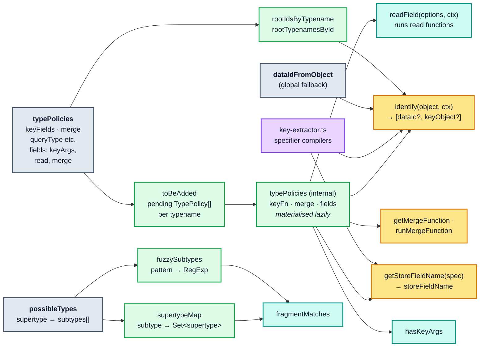

## 3.1 Lazy materialisation and supertype inheritance

`addTypePolicies` does **not** install policies. It pushes them into a per-typename inbox:

```ts
// cache/inmemory/policies.ts
public addTypePolicies(typePolicies: TypePolicies) {
  Object.keys(typePolicies).forEach((typename) => {
    const { queryType, mutationType, subscriptionType, ...incoming } = typePolicies[typename];
    // Though {query,mutation,subscription}Type configurations are rare,
    // it's important to call setRootTypename as early as possible, ...
    if (queryType) this.setRootTypename("Query", typename);
    if (mutationType) this.setRootTypename("Mutation", typename);
    if (subscriptionType) this.setRootTypename("Subscription", typename);

    if (hasOwn.call(this.toBeAdded, typename)) {
      this.toBeAdded[typename].push(incoming);
    } else {
      this.toBeAdded[typename] = [incoming];
    }
  });
}
```

The inbox is drained by `getTypePolicy(typename)`, which runs its inheritance step **at most
once per typename** and then drains any pending updates:

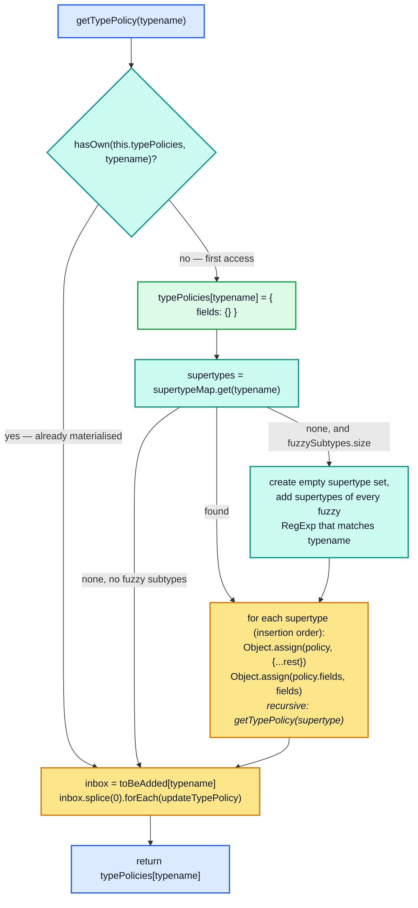

Three consequences that the source comments call out explicitly:

- **Order-independence, but only until first use.** You may add policies for a subtype
  before its supertype, as long as both are registered before the first `getTypePolicy`
  call for the subtype. After that, `// future changes to inherited supertype policies
  will not be reflected in this subtype policy, because this code runs at most once per
  typename.`
- **Field-policy inheritance is atomic.** `updateTypePolicy` refuses to merge an inherited
  field policy with a new one, because `read` and `merge` cooperate:

  ```ts
  // Field policy inheritance is atomic/shallow: you can't inherit a
  // field policy and then override just its read function, since read
  // and merge functions often need to cooperate, ...
  if (!existing || existing?.typename !== typename) {
    existing = existingFieldPolicies[fieldName] = { typename };
  }
  ```

  The `typename` stamp on `InternalFieldPolicy` exists solely to detect "this entry was
  inherited from a supertype, so replace it wholesale."
- **Root typenames are immutable after the first assignment.**
  `setRootTypename` throws `Cannot change root Query __typename more than once` if you try
  to move `ROOT_QUERY` twice.

## 3.2 Entity identity: `Policies.identify`

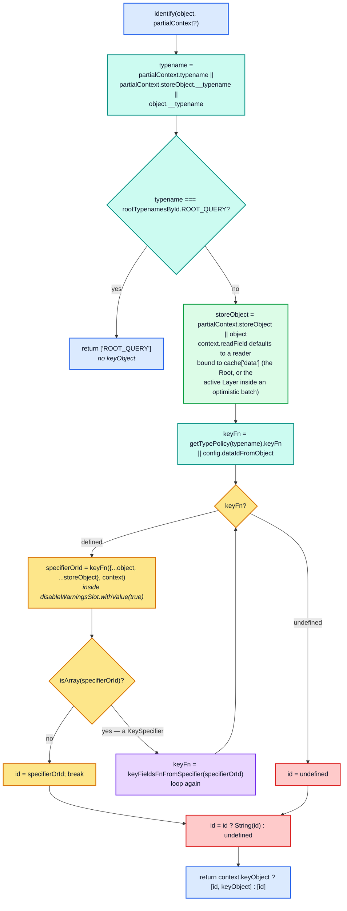

Details that are easy to miss and that change behaviour:

- **The `while (keyFn)` loop supports indirection.** A `keyFields` *function* may return a
  `KeySpecifier` array, which is then compiled and re-invoked. Compiled specifier functions
  always return a string, so in practice there is at most one extra round. This is how a
  dynamic policy can defer to the declarative machinery.
- **`{ ...object, ...storeObject }`** is the argument, not `object`. During a write,
  `storeObject` is the partially-built normalized object (aliases resolved, children
  already turned into `Reference`s), and `object` is the raw result. Spreading gives the
  key function de-aliased values with raw values as a fallback.
- **`id ? String(id) : void 0` swallows falsy ids.** A key function that returns `0` or
  `""` makes the object unidentifiable. `defaultDataIdFromObject` is not affected: it checks
  the object's `id` with `!= null` and always returns a prefixed string such as `"Todo:0"`.
- **Only `ROOT_QUERY` gets the shortcut.** The comment explains why:
  `// It should be possible to write root Query fields with writeFragment, using
  { __typename: "Query", ... } as the data, but it does not make sense to allow the same
  identification behavior for the Mutation and Subscription types`.
- **`context.keyObject` is an out-parameter.** Key functions write to it so
  `StoreWriter` can merge the identifying fields into the store even when the query never
  selected them ([§4.5](04-store-writer.md#45-identification-and-the-keyobject-back-channel)).
- **`disableWarningsSlot`** silences data-masking warnings while key fields are read, so
  identifying a masked object does not spam the console.

### `defaultDataIdFromObject`

```ts
// cache/inmemory/helpers.ts
export function defaultDataIdFromObject(
  { __typename, id, _id }: Readonly<StoreObject>,
  context?: KeyFieldsContext
): string | undefined {
  if (typeof __typename === "string") {
    if (context) {
      context.keyObject =
        id != null ? { id }
        : _id != null ? { _id }
        : void 0;
    }
    // If there is no object.id, fall back to object._id.
    if (id == null && _id != null) { id = _id; }
    if (id != null) {
      return `${__typename}:${
        typeof id === "number" || typeof id === "string" ? id : JSON.stringify(id)
      }`;
    }
  }
}
```

Returning `undefined` — no `__typename`, or no `id`/`_id` — is the signal for
**"do not normalize"**. The object stays inline in its parent, exactly as
`EditTodoResponse` did in [§0.2](00-orientation.md#02-the-blogs-example-as-the-cache-actually-stores-it).

### `keyFields` specifiers

`keyFieldsFnFromSpecifier` compiles a `KeySpecifier` — a nested array of strings — into a
key function. The output format is `${typename}:${JSON.stringify(keyObject)}`:

```ts
// cache/inmemory/key-extractor.ts
return (
  info.keyFieldsFn ||
  (info.keyFieldsFn = (object, context) => {
    const extract: typeof extractKey = (from, key) => context.readField(key, from);

    const keyObject = (context.keyObject = collectSpecifierPaths(specifier, (schemaKeyPath) => {
      let extracted = extractKeyPath(
        context.storeObject,
        schemaKeyPath,
        // Using context.readField to extract paths from context.storeObject
        // allows the extraction to see through Reference objects and respect
        // custom read functions.
        extract
      );

      if (extracted === void 0 && object !== context.storeObject &&
          hasOwn.call(object, schemaKeyPath[0])) {
        // If context.storeObject fails to provide a value for the requested
        // path, fall back to the raw result object, ...
        extracted = extractKeyPath(object, schemaKeyPath, extractKey);
      }

      invariant(extracted !== void 0,
        `Missing field '%s' while extracting keyFields from %s`,
        schemaKeyPath.join("."), object);

      return extracted;
    }));

    return `${context.typename}:${JSON.stringify(keyObject)}`;
  })
);
```

The blog's nested example, `keyFields: ["title", "author", ["name"]]`, means "title, plus
`author.name`". `getSpecifierPaths` turns that flat-with-nesting notation into explicit
paths:

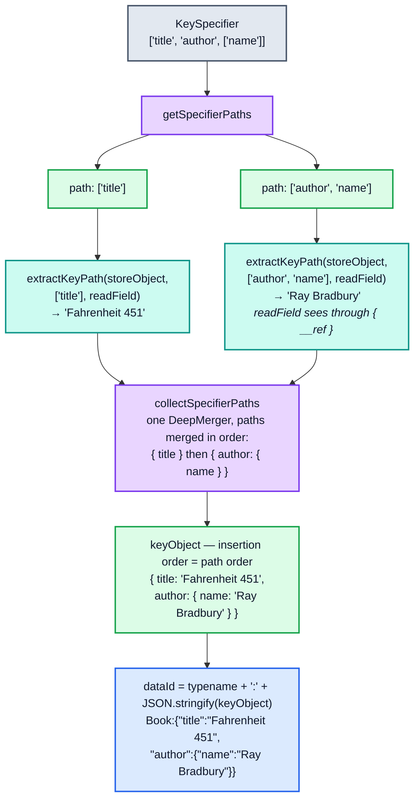

**The specifier's order is part of the cache key.** `collectSpecifierPaths` merges path
fragments in path order into a fresh object, and `JSON.stringify` emits properties in
insertion order, so the specifier order survives into the `dataId` verbatim:

```
keyFields: ["title", "author", ["name"]]
  → Book:{"title":"Fahrenheit 451","author":{"name":"Ray Bradbury"}}
keyFields: ["author", ["name"], "title"]
  → Book:{"author":{"name":"Ray Bradbury"},"title":"Fahrenheit 451"}
```

Two policies that list the same fields in different orders produce **different ids for the
same object**. Reordering a `keyFields` array is a breaking change for any persisted
`extract()` snapshot. Probe section 2 pins the exact strings.

`extractKeyPath` finishes with `normalize`, which recursively **sorts the keys** of any
object it extracted:

```ts
function normalize<T>(value: T): T {
  // Usually the extracted value will be a scalar value, ... but just in case we get an
  // object or an array, we need to do some normalization of the order of (nested) keys.
  if (isNonNullObject(value)) {
    if (isArray(value)) return value.map(normalize) as any;
    return collectSpecifierPaths(Object.keys(value).sort(), (path) => extractKeyPath(value, path)) as T;
  }
  return value;
}
```

So an *object-valued* key field is order-insensitive, while the *specifier itself* is
order-sensitive. That asymmetry is deliberate but surprising.

A missing key field is a **thrown invariant**, not a silent fallback. `StoreWriter` catches
it only when an explicit `dataId` was supplied:

```ts
// cache/inmemory/writeToStore.ts
} catch (e) {
  // If dataId was provided, tolerate failure of policies.identify.
  if (!dataId) throw e;
}
```

## 3.3 Field identity: `getStoreFieldName`

This is the function that turns `feed(type: "top")` into the store key
`feed({"type":"top"})`.

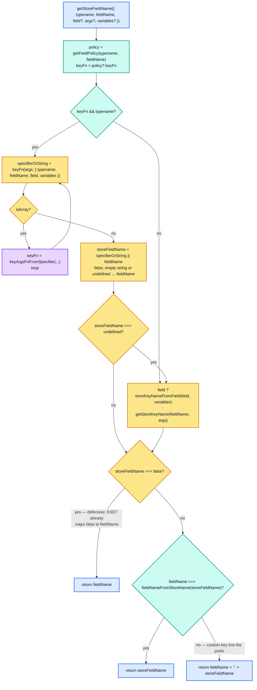

The **prefix repair** at the bottom is what guarantees `fieldNameFromStoreName` is always
invertible:

```ts
// Make sure custom field names start with the actual field.name.value
// of the field, so we can always figure out which properties of a
// StoreObject correspond to which original field names.
return fieldName === fieldNameFromStoreName(storeFieldName) ? storeFieldName
  : fieldName + ":" + storeFieldName;
```

`fieldNameFromStoreName` is a regex prefix match (`/^[_a-z][_0-9a-z]*/i`), so
`feed({"type":"top"})` → `feed`. A `keyArgs` function returning `"weird key"` would break
that inversion, so the result becomes `feed:weird key`. Everything downstream —
`CacheGroup.depend`'s two-level keys, `modify`'s two-level modifier lookup,
`evict({ fieldName })`, `merge`'s short-name dirtying — depends on this invariant.

The default (no `keyArgs`) path is `storeKeyNameFromField` → `getStoreKeyName`, which
serialises the arguments with `canonicalStringify`. `canonicalStringify` sorting is what
makes `feed(type: "top", limit: 10)` and `feed(limit: 10, type: "top")` the same key.
Directives affect the default key in two ways:

- `@connection(key: "k")` **replaces** the field name with `k` when the field has
  arguments. With `filter: ["a", ...]`, only those arguments are appended, as
  `k({"a":...})`. (The prefix repair above then turns `k` into `feed:k`.)
- Directives outside a fixed known list are **appended**: `@name` or `@name({...args})`.
  The known list (`connection`, `include`, `skip`, `client`, `rest`, `export`,
  `nonreactive`, `stream`) never appears in the key.

### `keyArgs` specifiers

`keyArgsFnFromSpecifier` supports three namespaces in a key path's first segment:

| Prefix | Source | Missing-value behaviour |
| --- | --- | --- |
| `"@directiveName"` | `field.directives` → `argumentsObjectFromField(d, variables)` | Directive absent → omitted from the key. Directive present without args → `null` recorded (presence itself is part of the key). |
| `"$variableName"` | `context.variables` | Variable absent → omitted. |
| anything else | the field's `args` object | Argument absent → omitted. |

```ts
const suffix = JSON.stringify(collected);
// If no arguments were passed to this field, and it didn't have any other
// field key contributions from directives or variables, hide the empty
// :{} suffix from the field key. ...
if (args || suffix !== "{}") { fieldName += ":" + suffix; }
return fieldName;
```

So `keyArgs: ["type"]` on a field called with `feed(type: "top", limit: 10)` produces
`feed:{"type":"top"}` — the `limit` argument no longer partitions the cache, which is the
foundation of every pagination policy. Compare with the default key
`feed({"limit":10,"type":"top"})`. Probe section 3 prints both.

`keyArgs: false` compiles to `simpleKeyArgsFn = (_args, context) => context.fieldName`, so
all argument variants collapse onto the bare field name.

There is one **implicit** `keyArgs` assignment worth memorising:

```ts
if (existing.read && existing.merge) {
  // If we have both a read and a merge function, assume
  // keyArgs:false, because read and merge together can take
  // responsibility for interpreting arguments in and out. ...
  existing.keyFn = existing.keyFn || simpleKeyArgsFn;
}
```

Defining both `read` and `merge` for a field silently turns on `keyArgs: false`. This also
makes `hasKeyArgs(typename, fieldName)` return `true`, which suppresses short-name dirtying
in `EntityStore.merge` ([§2.6](02-normalized-store.md#26-writes-merge-and-storeobjectreconciler)).

### Where `storeFieldName` is decided, end to end

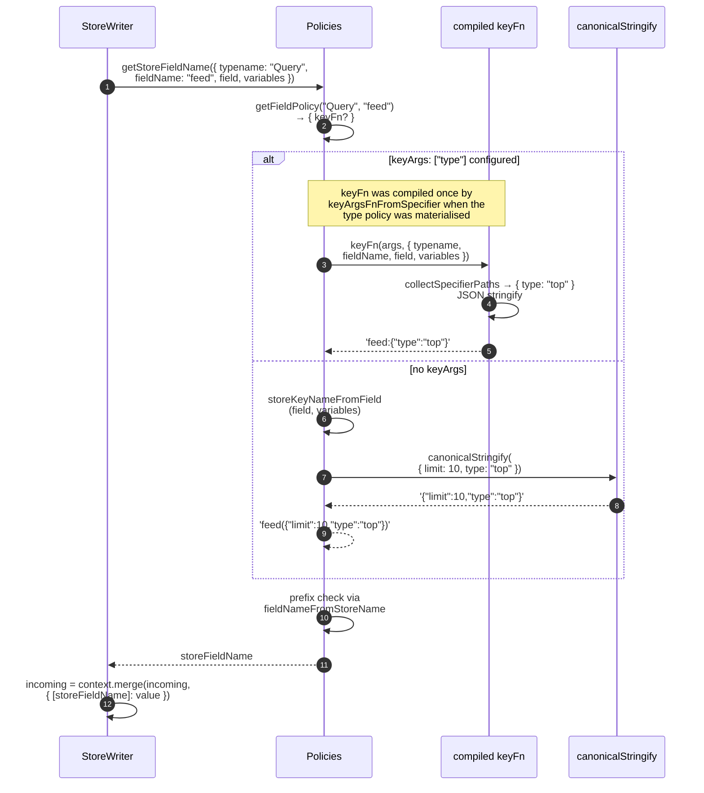

## 3.4 `readField` — the field read entry point

Every field read in the cache funnels through `Policies.readField`, whether it comes from
`StoreReader`, from a user `read` function, from a `modify` modifier, or from a `keyFields`
extractor.

```ts
public readField<V = StoreValue>(
  options: ReadFieldOptions,
  context: ReadMergeModifyContext
): SafeReadonly<V> | undefined {
  const objectOrReference = options.from;
  if (!objectOrReference) return;
  const nameOrField = options.field || options.fieldName;
  if (!nameOrField) return;

  if (options.typename === void 0) {
    const typename = context.store.getFieldValue<string>(objectOrReference, "__typename");
    if (typename) options.typename = typename;
  }

  const storeFieldName = this.getStoreFieldName(options);
  const fieldName = fieldNameFromStoreName(storeFieldName);
  const existing = context.store.getFieldValue<V>(objectOrReference, storeFieldName);
  const policy = this.getFieldPolicy(options.typename, fieldName);
  const read = policy && policy.read;

  if (read) {
    const readOptions = makeFieldFunctionOptions(
      this, objectOrReference, options, context,
      context.store.getStorage(
        isReference(objectOrReference) ? objectOrReference.__ref : objectOrReference,
        storeFieldName
      )
    );
    // Call read(existing, readOptions) with cacheSlot holding this.cache.
    return cacheSlot.withValue(this.cache, read, [existing, readOptions]) as SafeReadonly<V>;
  }

  return existing;
}
```

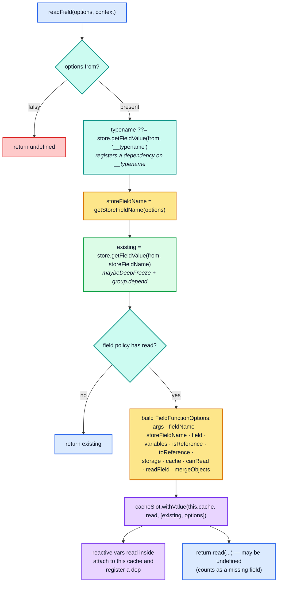

Four properties of this function drive most of the cache's advanced behaviour:

1. **`read` functions run inside the memoized read.** They execute within the `optimism`
   `Entry` for `executeSelectionSet`, so *any* `store.get` they trigger (via `readField`)
   is recorded as a dependency of the enclosing memoized subtree. A cache redirect,
   `read: (_, { args, toReference }) => toReference({ __typename: "Book", id: args.id })`,
   reads nothing from the store itself: it just returns a `Reference`. It still stays
   current, because `StoreReader` then reads the target through its own
   `executeSelectionSet` entry, a child of the current one. That child depends on the
   target's fields and, through `has()`, on its `__exists`, so both the target's creation
   and later changes invalidate the redirecting query. Probe section 11 pins the redirect
   itself; the invalidation was verified separately with a `cache.watch`.
2. **`cacheSlot` is how reactive variables find their cache.** `makeVar`'s getter calls
   `cacheSlot.getValue()`; if a cache is present it attaches itself and registers a
   dependency on the variable. Without the slot, a reactive variable read inside a `read`
   function could not know which cache to notify.
3. **`options.storage` is per-`(entity, storeFieldName)` and survives across reads.**
   `Root.storageTrie` (a `Trie<StorageType>`) hands out a stable object identity for the
   path `(idOrObj, ...storeFieldNames)`. It is a scratch space for custom `read` and
   `merge` functions. (Apollo's own pagination helpers do not use it:
   `relayStylePagination` keeps its cursors inside the stored field value.) For a
   non-normalized parent the path starts with the object itself, held weakly, so the
   storage lives only as long as that object does.
4. **Returning `undefined` from a `read` function means "missing".** `StoreReader` treats
   `undefined` exactly as it treats an absent store field, producing a `MissingFieldError`
   entry. Returning `null` is a real value.

`normalizeReadFieldOptions` is the adapter that lets `readField` be called in four ways:

```ts
export function normalizeReadFieldOptions(readFieldArgs, objectOrReference, variables) {
  const { 0: fieldNameOrOptions, 1: from, length: argc } = readFieldArgs;
  let options: ReadFieldOptions;
  if (typeof fieldNameOrOptions === "string") {
    options = {
      fieldName: fieldNameOrOptions,
      // Default to objectOrReference only when no second argument was
      // passed for the from parameter, not when undefined is explicitly
      // passed as the second argument.
      from: argc > 1 ? from : objectOrReference,
    };
  } else {
    options = { ...fieldNameOrOptions };
    // Default to objectOrReference only when fieldNameOrOptions.from is
    // actually omitted, rather than just undefined.
    if (!hasOwn.call(options, "from")) { options.from = objectOrReference; }
  }
  if (__DEV__ && options.from === void 0) {
    invariant.warn(`Undefined 'from' passed to readField with arguments %s`, ...);
  }
  if (void 0 === options.variables) { options.variables = variables; }
  return options;
}
```

Both defaulting rules use *arity/own-property* checks rather than `=== undefined`, so
`readField("name", undefined)` reads from `undefined` (and returns `undefined`) instead of
silently reading from the current object. Development builds also warn about it.

## 3.5 Merge functions

Two places in the configuration can supply a merge function, resolved by
`getMergeFunction(parentTypename, fieldName, childTypename)`. (When neither does, the
writer falls back to a built-in merge only for `@stream` list fields.)

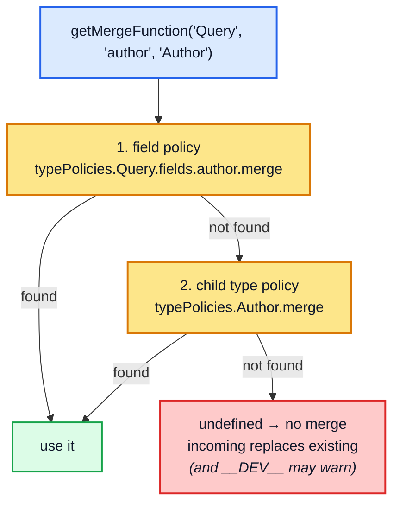

Field policies win over type policies. `merge: true` and `merge: false` are compiled to
singleton functions at configuration time:

```ts
const mergeTrueFn: FieldMergeFunction<any> = (existing, incoming, { mergeObjects }) =>
  mergeObjects(existing, incoming);
const mergeFalseFn: FieldMergeFunction<any> = (_, incoming) => incoming;
```

and `runMergeFunction` short-circuits on their **identity**, avoiding the cost of building
a `FieldMergeFunctionOptions` object:

```ts
public runMergeFunction(existing, incoming, { field, typename, merge, path }, context, storage?) {
  const existingData = existing;   // Preserve the value in case `context.overwrite` is set.
  if (merge === mergeTrueFn) {
    // Instead of going to the trouble of creating a full FieldFunctionOptions
    // object and calling mergeTrueFn, we can simply call mergeObjects, ...
    return makeMergeObjectsFunction(context.store)(existing as StoreObject, incoming as StoreObject);
  }
  if (merge === mergeFalseFn) { return incoming; }

  // If cache.writeQuery or cache.writeFragment was called with options.overwrite
  // set to true, we still call merge functions, but the existing data is always
  // undefined, ...
  if (context.overwrite) { existing = void 0; }
  // ... @stream memoization elided ...
  const result = merge(existing, incoming, makeMergeFieldFunctionOptions(/* ... */));
  return result;
}
```

Note that `overwrite: true` does **not** skip custom merge functions: it blanks `existing`
and passes the original through as `options.existingData`. The two singletons are checked
*before* that line, so they ignore `overwrite`: a field with `merge: true` still merges
the incoming object with the stored one during an overwrite (verified: with
`overwrite: true`, a `merge: true` field keeps a stored `theme` that the incoming object
lacks, while a custom merge function receives `existing === undefined`).

### `mergeObjects`

```ts
function makeMergeObjectsFunction(store: NormalizedCache): MergeObjectsFunction {
  return function mergeObjects(existing, incoming) {
    if (isArray(existing) || isArray(incoming)) {
      throw newInvariantError("Cannot automatically merge arrays");
    }
    if (isNonNullObject(existing) && isNonNullObject(incoming)) {
      const eType = store.getFieldValue(existing, "__typename");
      const iType = store.getFieldValue(incoming, "__typename");
      const typesDiffer = eType && iType && eType !== iType;
      if (typesDiffer) { return incoming; }

      if (isReference(existing) && storeValueIsStoreObject(incoming)) {
        // Update the normalized EntityStore for the entity identified by
        // existing.__ref, preferring/overwriting any fields contributed by the
        // newer incoming StoreObject.
        store.merge(existing.__ref, incoming);
        return existing;
      }
      if (storeValueIsStoreObject(existing) && isReference(incoming)) {
        // Update the normalized EntityStore for the entity identified by
        // incoming.__ref, taking fields from the older existing object only if
        // those fields are not already present in the newer StoreObject ...
        store.merge(existing, incoming.__ref);
        return incoming;
      }
      if (storeValueIsStoreObject(existing) && storeValueIsStoreObject(incoming)) {
        return { ...existing, ...incoming };
      }
    }
    return incoming;
  };
}
```

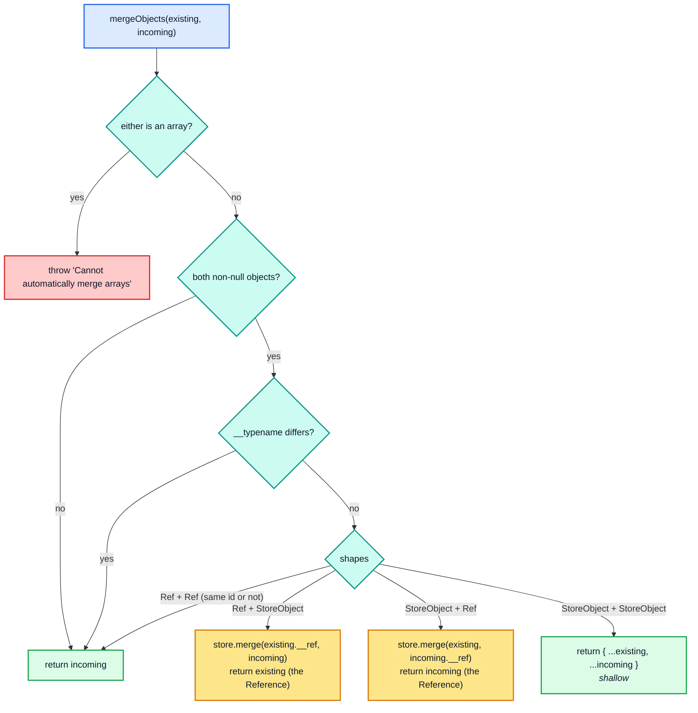

The two mixed cases have a **side effect on the store**, writing directly rather than
returning a value to be written. That is why `StoreWriter.writeToStore` checks whether
`applyMerges` returned a `Reference` before merging the result again:

```ts
// cache/inmemory/writeToStore.ts
if (isReference(applied)) {
  // Assume References returned by applyMerges have already been merged
  // into the store. See makeMergeObjectsFunction in policies.ts for an
  // example of how this can happen.
  return;
}
```

`mergeObjects` is also **shallow** for the object/object case, so `merge: true` on a
grandparent does not recursively protect grandchildren (unless they have merge functions
of their own). Probe section 10 shows the object/object case: `merge: true` on a
non-normalized type combines two partial writes (`{ theme }` then `{ locale }`), which the
default field-wise replace would lose. It does not exercise the mixed
`Reference`/`StoreObject` cases.

## 3.6 `fragmentMatches` — type-condition resolution

Without `possibleTypes`, the rule is trivially strict:

```ts
public fragmentMatches(fragment, typename, result?, variables?): boolean {
  if (!fragment.typeCondition) return true;
  // If the fragment has a type condition but the object we're matching
  // against does not have a __typename, the fragment cannot match.
  if (!typename) return false;
  const supertype = fragment.typeCondition.name.value;
  // Common case: fragment type condition and __typename are the same.
  if (typename === supertype) return true;
  // ... possibleTypes search ...
  return false;
}
```

With `possibleTypes`, the search runs **upwards** over the inverted map:

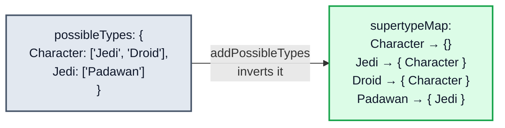

The search for `fragmentMatches(fragment on Character, 'Padawan')` then walks upwards:

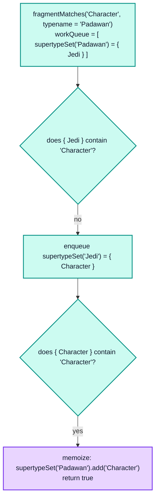

Fuzzy subtypes (a `possibleTypes` entry that is not a plain type name, such as
`"Jedi.*"`) are consulted only while writing, and only after the normal search fails:

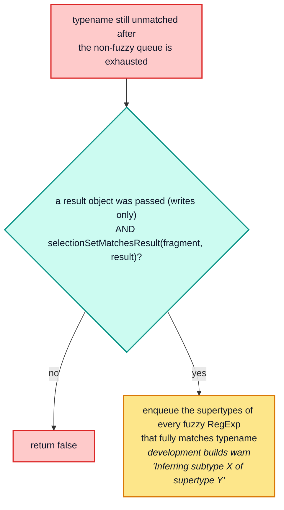

Three subtleties:

- **Positive results are memoized; negative results are not.**
  `// Unfortunately, we cannot safely cache negative results, because new possibleTypes
  data could always be added to the Policies class.` A deep interface hierarchy therefore
  pays full BFS cost on every *miss*, forever.
- **Fuzzy subtypes only apply while writing.** `StoreReader` calls `fragmentMatches` with
  no `result` argument, so `needToCheckFuzzySubtypes` is always false there. Read and write
  can therefore disagree about a fuzzy fragment — deliberately, since only the write path
  has a result object to shape-match against.
- **The queue grows during iteration.** `for (let i = 0; i < workQueue.length; ++i)` is an
  explicit BFS with dedup via `workQueue.indexOf(supertypeSet) < 0`, which is a linear scan
  — fine for the small sets that real schemas produce.

`selectionSetMatchesResult` is the shape test used for fuzzy matching. It requires every
non-skipped field of the fragment to be an own property of the result, recursively, and it
maps over arrays:

```ts
// cache/inmemory/helpers.ts
export function selectionSetMatchesResult(selectionSet, result, variables): boolean {
  if (isNonNullObject(result)) {
    return isArray(result) ?
        result.every((item) => selectionSetMatchesResult(selectionSet, item, variables))
      : selectionSet.selections.every((field) => {
          if (isField(field) && shouldInclude(field, variables)) {
            const key = resultKeyNameFromField(field);
            return hasOwn.call(result, key) &&
              (!field.selectionSet ||
                selectionSetMatchesResult(field.selectionSet, result[key], variables));
          }
          // If the selection has been skipped with @skip(true) or @include(false), it
          // should not count against the matching. ...
          return true;
        });
  }
  return false;
}
```

Probe section 12 pins interface/union matching: an exact typename match, a direct subtype,
a transitive subtype, and an unrelated typename that does not match. Without any
`possibleTypes`, only an exact typename match (or a fragment with no type condition)
matches; there is no fallback and no warning.

<!-- nav:bottom -->

---

| ← Previous | Up | Next → |
| :-- | :-: | --: |
| [Part 2 — The normalized store](02-normalized-store.md) | [Architecture guide](README.md) | [Part 4 — `StoreWriter`](04-store-writer.md) |
