# Part 4 — `StoreWriter`

[Documentation](../README.md) › [Architecture guide](README.md) · [← Part 3](03-policies.md) · [Part 5 →](05-store-reader.md)

`writeToStore.ts` (967 lines) turns a response-shaped tree into a set of `StoreObject`
patches. Its defining structural choice is that it is **two-phase**: the entire result is
shredded into a staging map first, and only then is anything written to the
`EntityStore`.

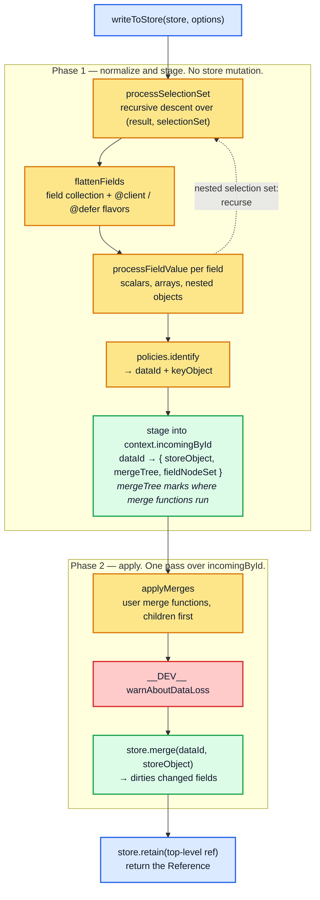

Why two phases matter: a single result can mention the same entity in several places
(`{ me { id name }, admin { id email } }` where both resolve to `User:1`). Staging lets
those contributions be **combined into one `store.merge` call**, so the entity is merged
and dirtied once, with one final value.

It also means an error during phase 1 (for example a missing `keyFields` field) leaves the
store untouched. Phase 2 is not atomic, though. User merge functions run there, one entity
at a time, so a merge function that throws leaves every entity merged before it in the
store (verified: when a merge function on `B` throws, the `A:1` entity written earlier in
the same `writeQuery` stays in the store).

## 4.1 `writeToStore` — the driver

```ts
public writeToStore(store, { query, result, dataId, variables, overwrite, extensions }): Reference | undefined {
  const operationDefinition = getOperationDefinition(query)!;
  const merger = makeProcessedFieldsMerger();

  variables = { ...getDefaultValues(operationDefinition), ...variables! };

  const context: WriteContext = {
    store,
    written: {},
    merge<T>(existing: T, incoming: T) { return merger.merge(existing, incoming) as T; },
    variables: variables as OperationVariables,
    varString: canonicalStringify(variables),
    ...extractFragmentContext(query, this.fragments),
    overwrite: !!overwrite,
    incomingById: new Map(),
    clientOnly: false,
    deferred: false,
    flavors: new Map(),
    extensions,
  };

  const ref = this.processSelectionSet({
    result: result || {}, dataId,
    selectionSet: operationDefinition.selectionSet,
    mergeTree: { map: new Map() }, context, path: [],
  });

  if (!isReference(ref)) { throw newInvariantError(`Could not identify object %s`, result); }
  // ... phase 2, below ...
  store.retain(ref.__ref);
  return ref;
}
```

Field-by-field, `WriteContext` is the whole design:

| Field | Purpose | Lifetime |
| --- | --- | --- |
| `store` | Destination `NormalizedCache`. Read during phase 1 (for `__typename` inference and `readField`), written only in phase 2. | write |
| `written` | `{ [dataId]: SelectionSetNode[] }` — the duplicate guard: an entity already processed with the same selection set is skipped ([§4.7](#47-the-duplicate-guard-and-the-isfresh-short-circuit)). | write |
| `merge` | One shared `DeepMerger`. Its `pastCopies` set means an object copied once during this write is mutated in place afterwards. | write |
| `variables` / `varString` | Operation variables with defaults applied, plus their canonical serialisation (used by `isFresh`). | write |
| `fragmentMap` / `lookupFragment` | Fragments defined in the document, plus the `FragmentRegistry` fallback. | write |
| `overwrite` | `writeQuery({ overwrite: true })`. Blanks `existing` inside custom merge functions (not `merge: true`/`false`, [§3.5](03-policies.md#35-merge-functions)) and disables the data-loss warning. | write |
| `incomingById` | The staging map. | write |
| `clientOnly` / `deferred` / `flavors` | Directive state, propagated down the tree. `flavors` interns the at-most-four context variants. | write |
| `extensions` | Server extensions, including `@stream` bookkeeping. | write |

The `flavors` map is a small but characteristic optimisation:

```ts
// Since there are only four possible combinations of context.clientOnly and
// context.deferred values, we should need at most four "flavors" of any given
// WriteContext. To avoid creating multiple copies of the same context, we cache
// the contexts in the context.flavors Map ...
function getContextFlavor<TContext extends FlavorableWriteContext>(context, clientOnly, deferred): TContext {
  const key = `${clientOnly}${deferred}`;
  let flavored = context.flavors.get(key);
  if (!flavored) {
    context.flavors.set(key, (flavored =
      context.clientOnly === clientOnly && context.deferred === deferred ? context
      : { ...context, clientOnly, deferred }));
  }
  return flavored as TContext;
}
```

## 4.2 `processSelectionSet` — the recursive core

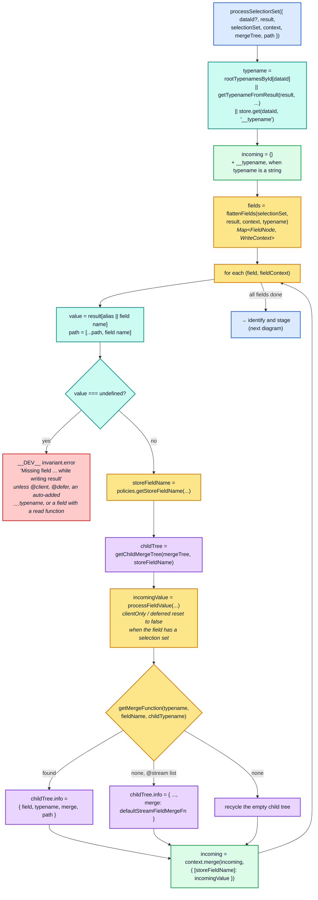

Once every field is processed, the object is identified and then either returned inline
or staged under its `dataId`:

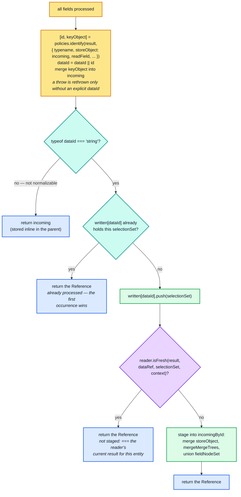

Three details to internalise.

**Typename inference has three sources, in order.**

1. For a root id (`ROOT_QUERY` and friends), `rootTypenamesById[dataId]`.
2. `getTypenameFromResult`. If the selection set selects `__typename` (possibly under an
   alias), it returns that result value *even when it is `undefined`*. Only when
   `__typename` is not selected does it fall back to `result.__typename`, and then recurse
   into fragments.
3. If all of that fails and a `dataId` was supplied, the *existing store value*
   (`store.get(dataId, "__typename")`).

The third source is what lets `cache.writeFragment({ id: "Todo:3", fragment })` work when
neither the fragment nor the data carries a `__typename`.

**`resultKeyNameFromField` reads the result; `getStoreFieldName` writes the store.** The
alias lives only on the read side:

```ts
const resultFieldKey = resultKeyNameFromField(field);   // alias ?? name  — indexes `result`
const value = result[resultFieldKey];
const storeFieldName = policies.getStoreFieldName({ typename, fieldName: field.name.value, ... });
incoming = context.merge(incoming, { [storeFieldName]: incomingValue });   // indexes the store
```

Aliases therefore never reach the store, and two aliases of the same field with the same
arguments collide onto one `storeFieldName` — deliberately, since they are the same data.

**The directive flavor resets on descent.**

```ts
let incomingValue = this.processFieldValue(
  value, field,
  // Reset context.clientOnly and context.deferred to their default
  // values before processing nested selection sets.
  field.selectionSet ? getContextFlavor(context, false, false) : context,
  childTree, path
);
```

`@client` and `@defer` exempt *this* field from the "Missing field" diagnostic: the field
may legitimately be absent from the written data. They do not exempt its subtree. Once a
`@client` or `@defer` field is present with an object value, its children are checked like
any other fields.

## 4.3 `flattenFields` — field collection with directive tracking

This implements the GraphQL spec's *CollectFields* with two additions.

```ts
private flattenFields<TContext extends ...>(
  selectionSet, result, context,
  typename = getTypenameFromResult(result, selectionSet, context.fragmentMap)
): Map<FieldNode, TContext> {
  const fieldMap = new Map<FieldNode, TContext>();
  const { policies } = this.cache;

  const limitingTrie = new Trie<{ visited?: boolean }>(false);  // No need for WeakMap, since limitingTrie does not escape.

  (function flatten(this: void, selectionSet, inheritedContext) {
    const visitedNode = limitingTrie.lookup(
      selectionSet,
      // Because we take inheritedClientOnly and inheritedDeferred into
      // consideration here (in addition to selectionSet), it's possible for
      // the same selection set to be flattened more than once, ...
      inheritedContext.clientOnly,
      inheritedContext.deferred
    );
    if (visitedNode.visited) return;
    visitedNode.visited = true;

    selectionSet.selections.forEach((selection) => {
      if (!shouldInclude(selection, context.variables)) return;

      let { clientOnly, deferred } = inheritedContext;
      if (!(clientOnly && deferred) && isNonEmptyArray(selection.directives)) {
        selection.directives.forEach((dir) => {
          const name = dir.name.value;
          if (name === "client") clientOnly = true;
          if (name === "defer") {
            const args = argumentsObjectFromField(dir, context.variables);
            // The @defer directive takes an optional args.if boolean argument, ...
            // Note that @defer(if: false) does not make context.deferred false, but
            // instead behaves as if there was no @defer directive.
            if (!args || (args as { if?: boolean }).if !== false) { deferred = true; }
          }
        });
      }

      if (isField(selection)) {
        const existing = fieldMap.get(selection);
        if (existing) {
          // If this field has been visited along another recursive path
          // before, the final context should have clientOnly or deferred set
          // to true only if *all* paths have the directive (hence the &&).
          clientOnly = clientOnly && existing.clientOnly;
          deferred = deferred && existing.deferred;
        }
        fieldMap.set(selection, getContextFlavor(context, clientOnly, deferred));
      } else {
        const fragment = getFragmentFromSelection(selection, context.lookupFragment);
        if (!fragment && selection.kind === Kind.FRAGMENT_SPREAD) {
          throw newInvariantError(`No fragment named %s`, selection.name.value);
        }
        if (fragment && policies.fragmentMatches(fragment, typename, result, context.variables)) {
          flatten(fragment.selectionSet, getContextFlavor(context, clientOnly, deferred));
        }
      }
    });
  })(selectionSet, context);

  return fieldMap;
}
```

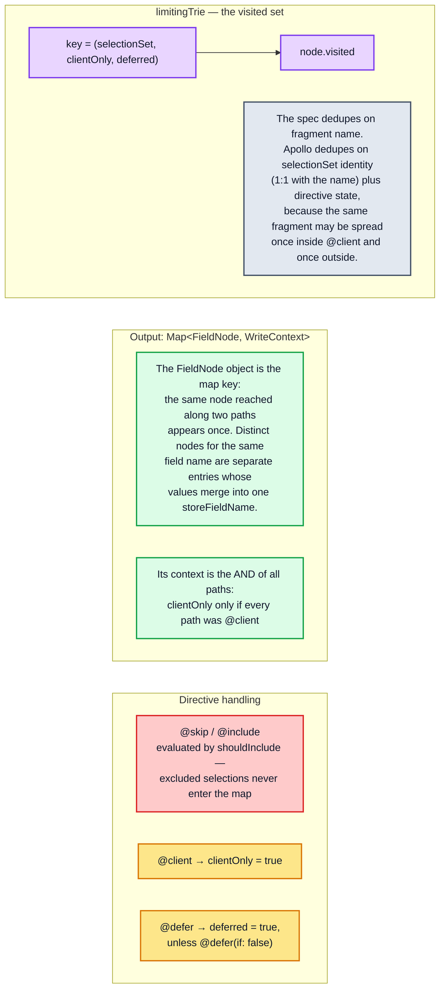

The `clientOnly = clientOnly && existing.clientOnly` conjunction only affects diagnostics:
`clientOnly`/`deferred` suppress the "Missing field" error, so a field that is required on
*some* path must still be present.

Note the asymmetry with the reader: `StoreWriter.flattenFields` passes `result` and
`variables` to `fragmentMatches` (enabling fuzzy subtype inference), while
`StoreReader.execSelectionSetImpl` calls `policies.fragmentMatches(fragment, typename)`
with neither.

## 4.4 `processFieldValue` — scalars, arrays, recursion

```ts
private processFieldValue(value, field, context, mergeTree, path): StoreValue {
  if (!field.selectionSet || value === null) {
    // In development, we need to clone scalar values so that they can be
    // safely frozen with maybeDeepFreeze in readFromStore.ts. In production,
    // it's cheaper to store the scalar values directly in the cache.
    return __DEV__ ? cloneDeep(value) : value;
  }

  if (isArray(value)) {
    return value.map((item, i) => {
      const value = this.processFieldValue(item, field, context, getChildMergeTree(mergeTree, i), [...path, i]);
      maybeRecycleChildMergeTree(mergeTree, i);
      return value;
    });
  }

  return this.processSelectionSet({ result: value, selectionSet: field.selectionSet, context, mergeTree, path });
}
```

Three consequences:

- **A leaf field's value is stored by reference in production and deep-cloned in
  development.** The clone exists so `maybeDeepFreeze` on the read side cannot freeze an
  object the caller still holds. Probe section 15 confirms the caller's input object is not
  aliased into the store.
- **Arrays are not entities.** They are stored as plain arrays whose elements may be
  `Reference`s. There is no array identity in the store, which is exactly why paginated
  list fields need a `merge` function: without one, `EntityStore.merge`'s reconciler
  replaces the whole array.
- **`mergeTree` mirrors the result shape, including array indices.** `getChildMergeTree`
  keys on `string | number`, and `path` accumulates numeric indices, so the `MergeInfo`
  recorded for `Query.feed` carries `path: ["feed"]`, while a merge nested inside the
  fourth list item carries `["feed", 3, "author"]`. The path is internal bookkeeping (it
  locates `@stream` state); it is not passed to user merge functions.

`emptyMergeTreePool` is a free list. Empty child trees are returned to it after each array
element and after each field with no merge function, so a large result does not allocate a
`{ info, map }` pair per node:

```ts
const emptyMergeTreePool: MergeTree[] = [];
function getChildMergeTree({ map }: MergeTree, name: string | number): MergeTree {
  if (!map.has(name)) { map.set(name, emptyMergeTreePool.pop() || { map: new Map() }); }
  return map.get(name)!;
}
function maybeRecycleChildMergeTree({ map }: MergeTree, name: string | number) {
  const childTree = map.get(name);
  if (childTree && mergeTreeIsEmpty(childTree)) { emptyMergeTreePool.push(childTree); map.delete(name); }
}
```

This is also why `processSelectionSet` stores `mergeTree: mergeTreeIsEmpty(mergeTree) ? void 0 : mergeTree`
into `incomingById` — `// empty MergeTrees may be recycled by maybeRecycleChildMergeTree and
reused for entirely different parts of the result tree.`

## 4.5 Identification and the `keyObject` back-channel

```ts
try {
  const [id, keyObject] = policies.identify(result, {
    typename, selectionSet, fragmentMap: context.fragmentMap,
    storeObject: incoming, readField,
  });
  // If dataId was not provided, fall back to the id just generated by policies.identify.
  dataId = dataId || id;
  // Write any key fields that were used during identification, even if
  // they were not mentioned in the original query.
  if (keyObject) { incoming = context.merge(incoming, keyObject); }
} catch (e) {
  // If dataId was provided, tolerate failure of policies.identify.
  if (!dataId) throw e;
}
```

`identify` is called with the **raw result** as `object` and the **partially-built
normalized object** as `storeObject`, so key extraction sees de-aliased values and already-
normalized child `Reference`s. The `keyObject` that comes back is merged into `incoming`,
which is how `Todo:3` ends up with an `id` field in the store even for a query that only
selected `text`.

The local `readField` closure is what makes nested `keyFields` work during a write:

```ts
const readField: ReadFieldFunction = (...args) => {
  const options = normalizeReadFieldOptions(args, incoming, context.variables);
  if (isReference(options.from)) {
    const info = context.incomingById.get(options.from.__ref);
    if (info) {
      const result = policies.readField({ ...options, from: info.storeObject }, context);
      if (result !== void 0) { return result; }
    }
  }
  return policies.readField(options, context);
};
```

Because phase 1 has not written anything yet, `Book.author` is a `Reference` to an entity
that exists only in `incomingById`. Reading `author.name` for a `keyFields: ["author", ["name"]]`
specifier has to consult the staging map first, then fall back to the durable store.

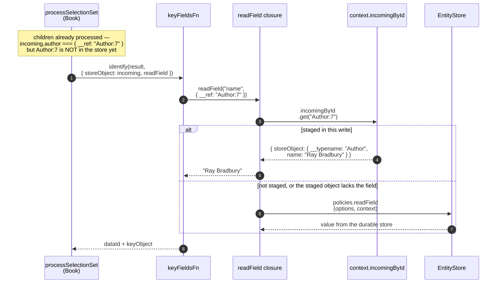

## 4.6 `MergeTree` and `applyMerges`

A `MergeTree` is a sparse overlay on the result shape recording **where user merge
functions must run**:

```ts
export interface MergeInfo { field: FieldNode; typename: string | undefined; merge: FieldMergeFunction; path: Array<string | number>; }
export interface MergeTree { info?: MergeInfo; map: Map<string | number, MergeTree>; }
```

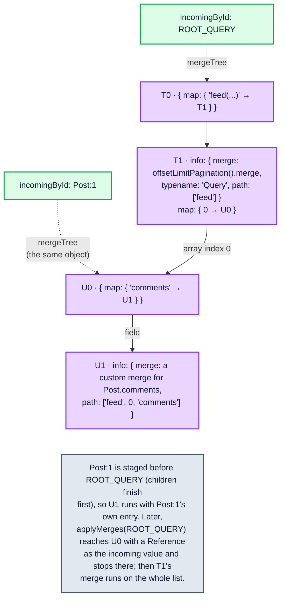

`applyMerges` walks that tree **depth-first, children before parents**, so a merge function
always sees children that have already been merged:

```ts
private applyMerges<T extends StoreValue>(mergeTree, existing, incoming: T, context, getStorageArgs?): T | Reference {
  if (mergeTree.map.size && !isReference(incoming)) {
    const e =
      // Items in the same position in different arrays are not
      // necessarily related to each other, so when incoming is an array
      // we process its elements as if there was no existing data.
      (!isArray(incoming) &&
        // Likewise, existing must be either a Reference or a StoreObject
        // in order for its fields to be safe to merge ...
        (isReference(existing) || storeValueIsStoreObject(existing))) ? existing : void 0;

    const i = incoming as StoreObject | StoreValue[];

    // The options.storage objects provided to read and merge functions
    // are derived from the identity of the parent object plus a
    // sequence of storeFieldName strings/numbers ...
    if (e && !getStorageArgs) { getStorageArgs = [isReference(e) ? e.__ref : e]; }

    let changedFields: Map<string | number, StoreValue> | undefined;
    const getValue = (from, name) =>
      isArray(from) ? (typeof name === "number" ? from[name] : void 0)
                    : context.store.getFieldValue(from, String(name));

    mergeTree.map.forEach((childTree, storeFieldName) => {
      const eVal = getValue(e, storeFieldName);
      const iVal = getValue(i, storeFieldName);
      // If we have no incoming data, leave any existing data untouched.
      if (void 0 === iVal) return;
      if (getStorageArgs) { getStorageArgs.push(storeFieldName); }
      const aVal = this.applyMerges(childTree, eVal, iVal, context, getStorageArgs);
      if (aVal !== iVal) { changedFields = changedFields || new Map(); changedFields.set(storeFieldName, aVal); }
      if (getStorageArgs) { invariant(getStorageArgs.pop() === storeFieldName); }
    });

    if (changedFields) {
      // Shallow clone i so we can add changed fields to it.
      incoming = (isArray(i) ? i.slice(0) : { ...i }) as T;
      changedFields.forEach((value, name) => { (incoming as any)[name] = value; });
    }
  }

  if (mergeTree.info) {
    return this.cache.policies.runMergeFunction(existing, incoming, mergeTree.info, context,
      getStorageArgs && context.store.getStorage(...getStorageArgs));
  }

  return incoming;
}
```

Four invariants worth memorising:

1. **Arrays never pair up with existing arrays.** `!isArray(incoming)` guards `e`, so an
   array's elements are merged as if there were no existing data. Positional merging of
   array items is explicitly rejected. Only a merge function on the array field itself can
   do anything smarter.
2. **`getStorageArgs` is a mutable path stack** whose push/pop discipline is asserted with
   `invariant(getStorageArgs.pop() === storeFieldName)`. It builds the `Trie` key that
   `Root.getStorage` uses to hand out a stable `options.storage`.
3. **Copy-on-write.** `incoming` is cloned only if a child merge actually returned something
   different, which keeps identity stable for unchanged subtrees.
4. **`undefined` incoming values are skipped**, so a merge tree node with no corresponding
   incoming data leaves existing data untouched.

Because two `processSelectionSet` visits can contribute to the same entity, their trees are
unioned by `mergeMergeTrees`, which shares structure aggressively:

```ts
function mergeMergeTrees(left, right): MergeTree {
  if (left === right || !right || mergeTreeIsEmpty(right)) return left!;
  if (!left || mergeTreeIsEmpty(left)) return right;
  const info = left.info && right.info ? { ...left.info, ...right.info } : left.info || right.info;
  const needToMergeMaps = left.map.size && right.map.size;
  const map = needToMergeMaps ? new Map() : left.map.size ? left.map : right.map;
  // ... key-wise recursive merge ...
}
```

Note `{ ...left.info, ...right.info }`: when two visits disagree about the merge function,
**the later visit wins**.

## 4.7 The duplicate guard and the `isFresh` short-circuit

```ts
// Avoid processing the same entity object using the same selection
// set more than once. We use an array instead of a Set since most
// entity IDs will be written using only one selection set, so the
// size of this array is likely to be very small, meaning indexOf is
// likely to be faster than Set.prototype.has.
const sets = context.written[dataId] || (context.written[dataId] = []);
if (sets.indexOf(selectionSet) >= 0) return dataRef;
sets.push(selectionSet);

// If we're about to write a result object into the store, but we
// happen to know that the exact same (===) result object would be
// returned if we were to reread the result with the same inputs,
// then we can skip the rest of the processSelectionSet work for
// this object, and immediately return a Reference to it.
if (this.reader && this.reader.isFresh(result, dataRef, selectionSet, context)) {
  return dataRef;
}
```

The first guard is a **deduplication**, not a cycle breaker. The recursion follows the
query's selection sets, which are finite, so it always terminates, even if result objects
form a JavaScript cycle. What the guard catches is the same entity reached again with the
same `SelectionSetNode`, for example the same item twice in a list, or one fragment spread
reaching the entity along two paths. The second occurrence is not processed at all, so
**the first occurrence wins**. (Verified: writing `todos: [{ id: 1, text: "first" }, { id:
1, text: "second" }]` stores `text: "first"`.) The key is the `(dataId, selectionSet)`
pair, not `dataId` alone, so the same entity written through two *different* selection
sets is processed twice and both contributions are merged, the later one winning on
conflicting fields.

The second guard is the **writer consulting the reader's memo**:

```ts
// cache/inmemory/readFromStore.ts
public isFresh(result, parent, selectionSet, context): boolean {
  if (supportsResultCaching(context.store) && this.knownResults.get(result) === selectionSet) {
    const latest = this.executeSelectionSet.peek(selectionSet, parent, context);
    if (latest && result === latest.result) { return true; }
  }
  return false;
}
```

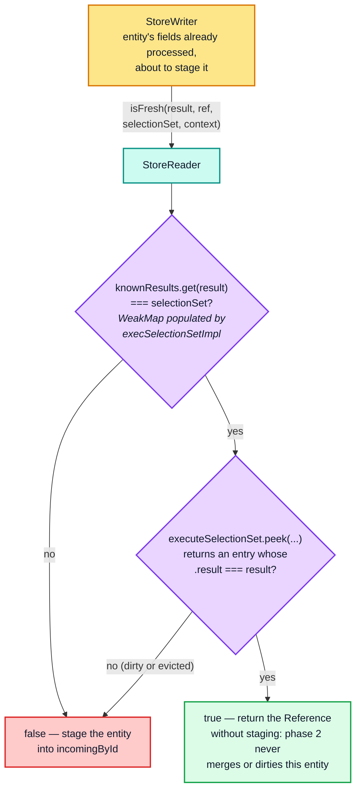

`peek` is used rather than a normal call so that a stale entry is **not** recomputed (and,
since no memoized computation is running during a write, no dependency is registered).
This is the optimisation behind the common "write back the object you just read" pattern.
In a `readQuery` → immutable update of one field → `writeQuery` round trip, only the objects
along the changed path are new. Every untouched entity is still `===` to the object the
reader returned, so the writer does not stage it, and phase 2 never merges, compares or
dirties it. The check does **not** skip the traversal. `processSelectionSet` reaches it only
after it has processed the entity's fields, recursed into its children and called
`identify`, so a write-back still walks the whole result tree. (Verified: writing an
unchanged `readQuery` result back calls a `keyFields` function for every entity but
`store.merge` for none of them. After one book's title is changed, only that `Book` and
`ROOT_QUERY` are merged.) The peek looks in the memo of the
store being written (normally the `Root`), so this works for results from a
non-optimistic read (the `readQuery` default) of the same query and variables.

## 4.8 `warnAboutDataLoss`

```ts
if (__DEV__ && !context.overwrite) {
  const fieldsWithSelectionSets: Record<string, true> = {};
  fieldNodeSet.forEach((field) => { if (field.selectionSet) { fieldsWithSelectionSets[field.name.value] = true; } });
  const hasSelectionSet = (storeFieldName: string) =>
    fieldsWithSelectionSets[fieldNameFromStoreName(storeFieldName)] === true;
  const hasMergeFunction = (storeFieldName: string) => {
    const childTree = mergeTree && mergeTree.map.get(storeFieldName);
    return Boolean(childTree && childTree.info && childTree.info.merge);
  };
  Object.keys(storeObject).forEach((storeFieldName) => {
    // If a merge function was defined for this field, trust that it
    // did the right thing about (not) clobbering data. If the field
    // has no selection set, it's a scalar field, so it doesn't need
    // a merge function (even if it's an object, like JSON data).
    if (hasSelectionSet(storeFieldName) && !hasMergeFunction(storeFieldName)) {
      warnAboutDataLoss(entityRef, storeObject, storeFieldName, context.store);
    }
  });
}
```

The famous *"Cache data may be lost when replacing the X field of a Y object"* warning.
`warnAboutDataLoss` then applies six checks, any of which keeps it silent:

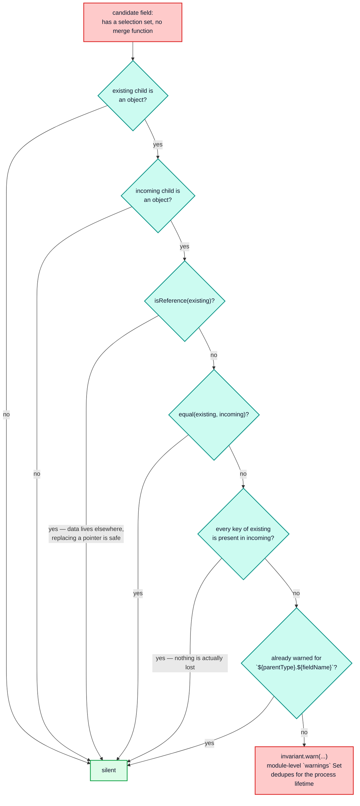

The warning is purely diagnostic — the clobbering happens regardless. It is also
`// unused in production, and thus should be pruned by any well-configured minifier.`

## 4.9 The full write, end to end

The write runs in two phases inside one transaction. Phase 1 normalizes the result
without touching the store:

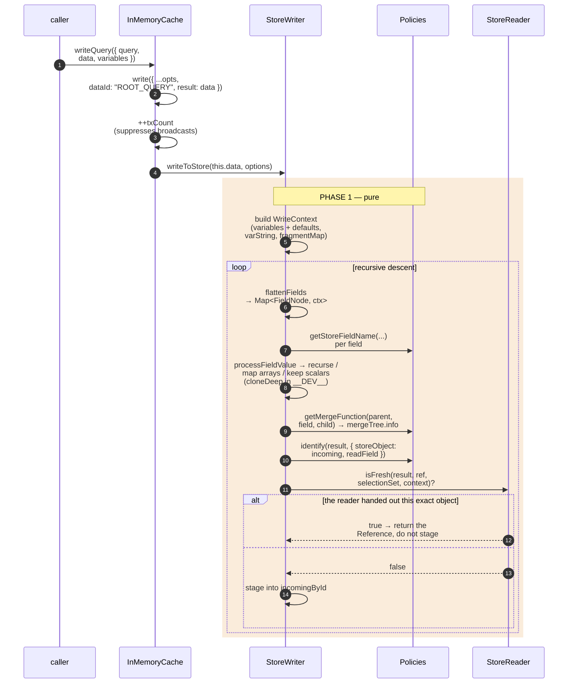

Phase 2 applies the staged entities to the store, and the broadcast runs when the
transaction closes:

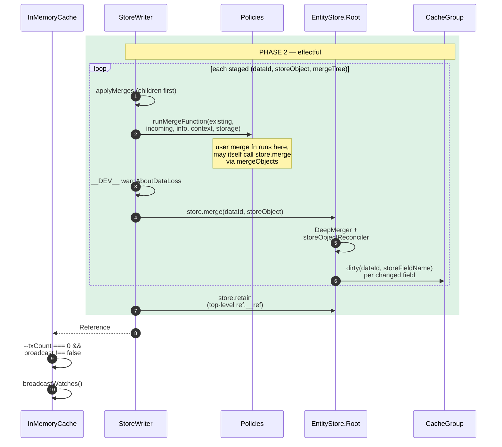

## 4.10 Write-path state transitions

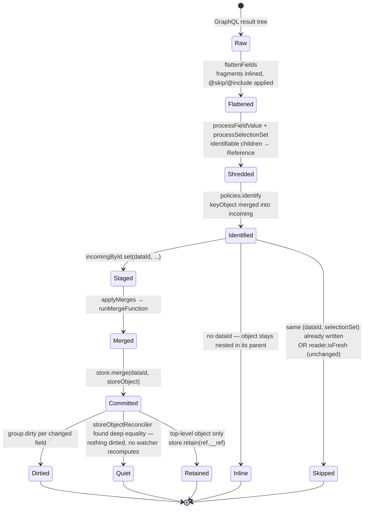

<!-- nav:bottom -->

---

| ← Previous | Up | Next → |
| :-- | :-: | --: |
| [Part 3 — `Policies`](03-policies.md) | [Architecture guide](README.md) | [Part 5 — `StoreReader`](05-store-reader.md) |
