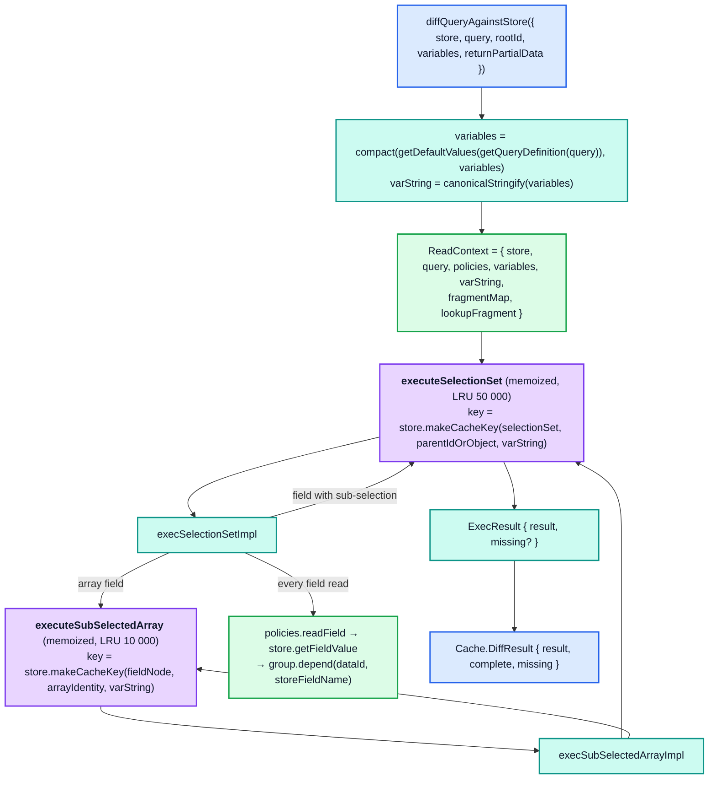
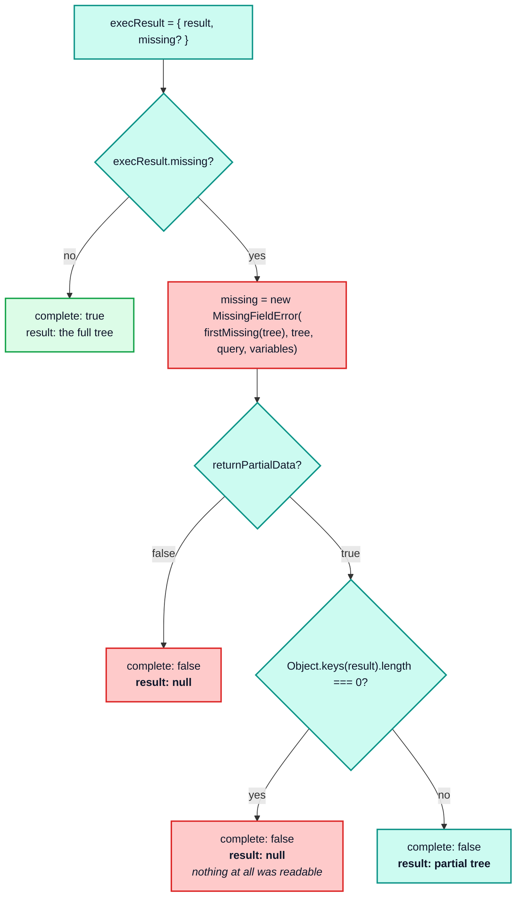
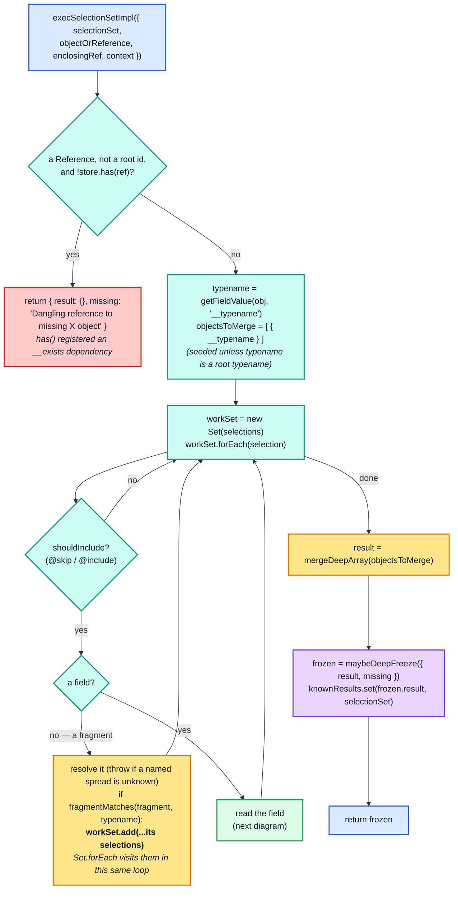
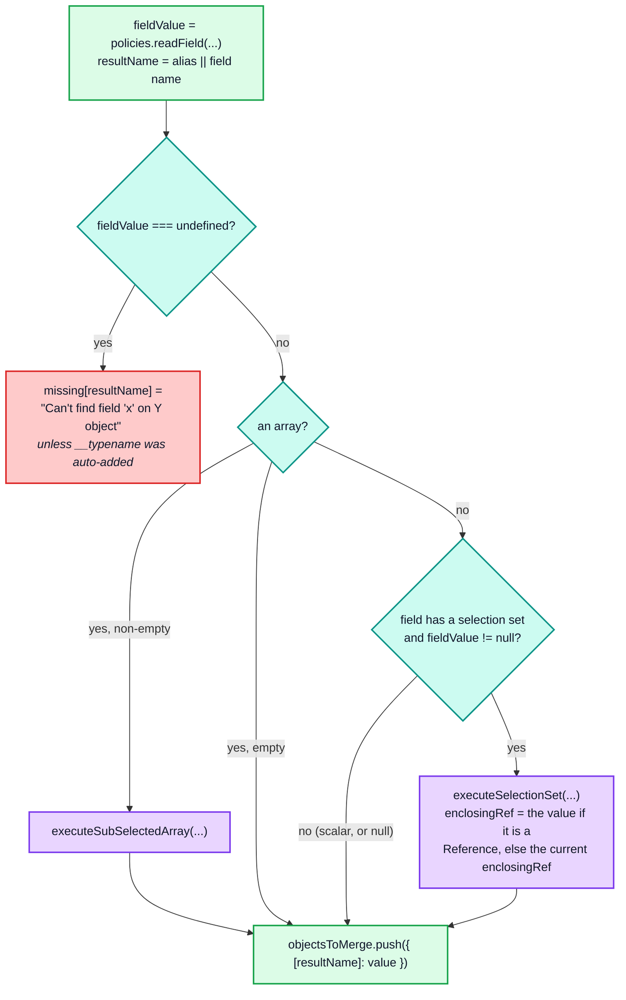
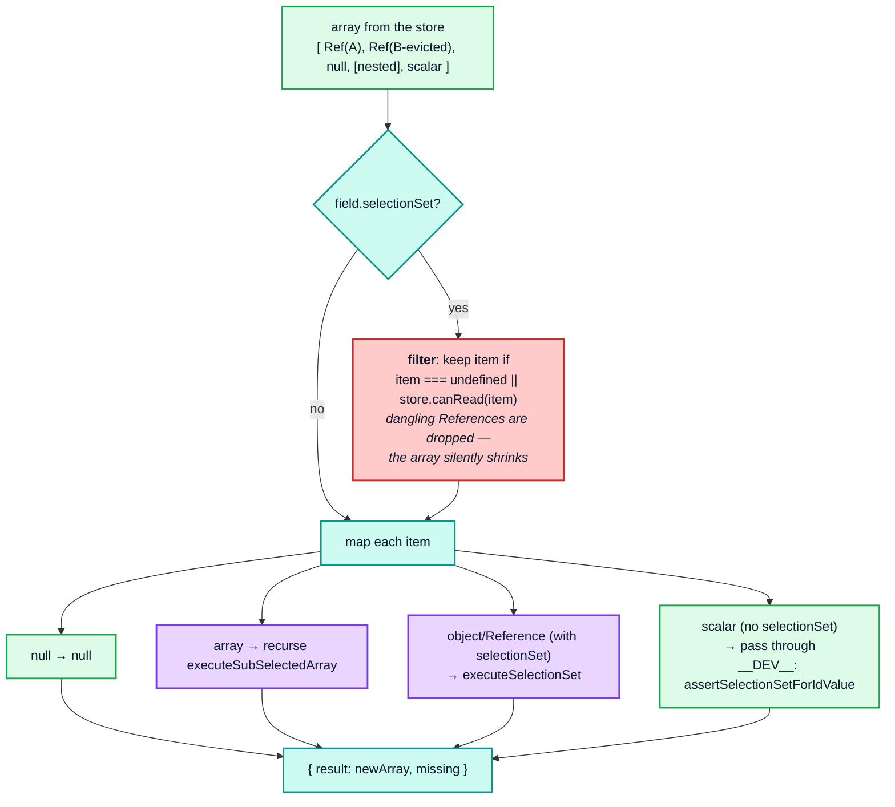
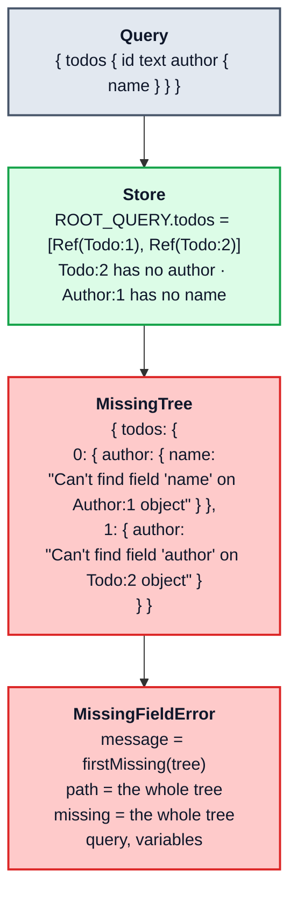
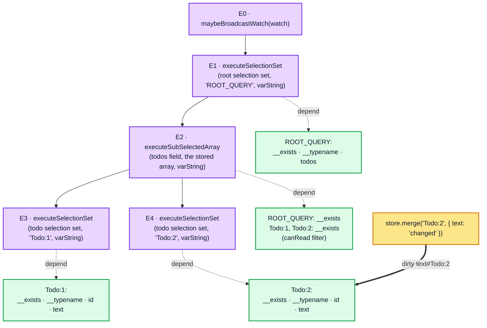
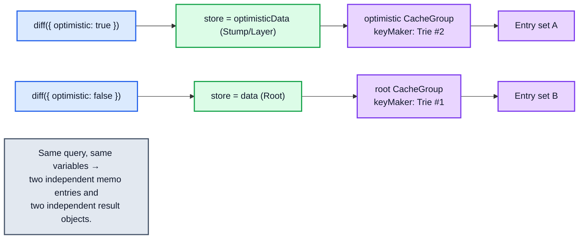

# Part 5 — `StoreReader`

[Documentation](../README.md) › [Architecture guide](README.md) · [← Part 4](04-store-writer.md) · [Part 6 →](06-reactivity.md)

`readFromStore.ts` is only 507 lines, but it is where the cache earns its performance. It
walks a selection set over the flat store and re-assembles a response tree, memoizing every
subtree and recording every field it touched.



## 5.1 The two memoized functions

```ts
// cache/inmemory/readFromStore.ts
function execSelectionSetKeyArgs(options: ExecSelectionSetOptions): ExecSelectionSetKeyArgs {
  return [options.selectionSet, options.objectOrReference, options.context];
}

this.executeSelectionSet = wrap(
  (options) => {
    const peekArgs = execSelectionSetKeyArgs(options);
    const other = this.executeSelectionSet.peek(...peekArgs);
    if (other) {
      // If we previously read this result with canonization enabled, we can
      // return that canonized result as-is.
      return other;
    }
    maybeDependOnExistenceOfEntity(options.context.store, options.enclosingRef.__ref);
    // Finally, if we didn't find any useful previous results, run the real
    // execSelectionSetImpl method with the given options.
    return this.execSelectionSetImpl(options);
  },
  {
    max: cacheSizes["inMemoryCache.executeSelectionSet"] || defaultCacheSizes["inMemoryCache.executeSelectionSet"],
    keyArgs: execSelectionSetKeyArgs,
    // Note that the parameters of makeCacheKey are determined by the
    // array returned by keyArgs.
    makeCacheKey(selectionSet, parent, context) {
      if (supportsResultCaching(context.store)) {
        return context.store.makeCacheKey(
          selectionSet,
          isReference(parent) ? parent.__ref : parent,
          context.varString
        );
      }
    },
  }
);
```

| | `executeSelectionSet` | `executeSubSelectedArray` |
| --- | --- | --- |
| Default LRU size | 50 000 | 10 000 |
| Cache key | `(selectionSet, parentDataId \| parentObject, varString)` | `(fieldNode, arrayIdentity, varString)` |
| Key stability requires | stable `SelectionSetNode` identity (i.e. `gql` template caching or `DocumentTransform` memoization) | stable **array identity** in the store |
| Returns | `{ result, missing? }`, deep-frozen in `__DEV__` | `{ result, missing? }`, not frozen here; the array is frozen later, when the enclosing `executeSelectionSet` result is frozen |

Two things to note about the keys.

**`varString`, not `variables`.** Two reads with structurally-equal but distinct variables
objects share one memo entry. This is why `canonicalStringify` sorting matters on the read
side too.

**The array field's key is the array's object identity.** `store.makeCacheKey` is
`CacheGroup.keyMaker.lookupArray`, a `Trie` that mixes `WeakMap` (objects) and `Map`
(primitives), so passing the array itself gives a per-array memo entry that becomes
collectable when the store replaces the array. That is also why
`storeObjectReconciler`'s deep-equality check is load-bearing: if a re-written array is
deeply equal, the store keeps the *old* array object, so the array memo entry survives.

> **Vestigial code.** The `peek` at the top of the `executeSelectionSet` wrapper can never
> return a value. `optimism`'s `recomputeNewValue` sets `entry.value.length = 0` before
> invoking the wrapped function, and `Entry.peek()` requires `value.length === 1`. The
> `peek` and its `keyArgs` used to differ in a `canonizeResults` flag (Apollo Client 3.x);
> with canonization removed, `peekArgs` are identical to the live call's key args, so the
> lookup always finds the entry currently being recomputed and returns `undefined`. A
> re-implementation should not port it.

`supportsResultCaching` is the single switch that disables all of this:

```ts
// cache/inmemory/entityStore.ts
export abstract class EntityStore implements NormalizedCache {
  // ...
  public get supportsResultCaching(): boolean {
    return this.group.caching;
  }
}

export function supportsResultCaching(store: any): store is EntityStore {
  // When result caching is disabled, store.depend will be null.
  return !!(store && store.supportsResultCaching);
}
```

The free function is a duck-typed guard, not an `instanceof` check: anything exposing a
truthy `supportsResultCaching` passes. On a real `EntityStore` the getter forwards to
`this.group.caching`, which is `false` for every group when the cache was constructed with
`resultCaching: false`.

When it returns `false`, `makeCacheKey` returns `undefined`, and `optimism`'s `wrap`
bypasses the `Entry` machinery entirely (`if (key === void 0) return originalFunction.apply(...)`).

## 5.2 `diffQueryAgainstStore`

```ts
public diffQueryAgainstStore<T>({
  store, query, rootId = "ROOT_QUERY", variables, returnPartialData = true,
}: DiffQueryAgainstStoreOptions): Cache.DiffResult<T> {
  const policies = this.config.cache.policies;
  variables = compact(getDefaultValues(getQueryDefinition(query)), variables);
  const rootRef = makeReference(rootId);
  const execResult = this.executeSelectionSet({
    selectionSet: getMainDefinition(query).selectionSet,
    objectOrReference: rootRef,
    enclosingRef: rootRef,
    context: {
      store, query, policies, variables,
      varString: canonicalStringify(variables),
      ...extractFragmentContext(query, this.config.fragments),
    },
  });

  let missing: MissingFieldError | undefined;
  if (execResult.missing) {
    missing = new MissingFieldError(firstMissing(execResult.missing)!, execResult.missing, query, variables);
  }
  const complete = !missing;
  const { result } = execResult;

  return {
    result:
      complete ? result
      : returnPartialData ?
        Object.keys(result).length === 0 ? null : result
      : null,
    complete,
    missing,
  } as Cache.DiffResult<T>;
}
```



`diff` defaults `returnPartialData` to `true`; `InMemoryCache.read` defaults it to `false`,
with the reason spelled out in the source:

```ts
// cache/inmemory/inMemoryCache.ts
const {
  // Since read returns data or null, without any additional metadata
  // about whether/where there might have been missing fields, the
  // default behavior cannot be returnPartialData = true (like it is
  // for the diff method), since defaulting to true would violate the
  // integrity of the T in the return type. ...
  returnPartialData = false,
} = options;
```

`firstMissing` extracts a human-readable headline from the `MissingTree` by abusing
`JSON.stringify`'s replacer as a visitor:

```ts
function firstMissing(tree: MissingTree): string | undefined {
  try {
    JSON.stringify(tree, (_, value) => { if (typeof value === "string") throw value; return value; });
  } catch (result) { return result as string; }
}
```

## 5.3 `execSelectionSetImpl`



Each field is read like this:



Six things to know precisely.

**`enclosingRef` versus `objectOrReference`.** `objectOrReference` is what we are reading
*from*; `enclosingRef` is the nearest **normalized** ancestor. Non-normalized nested objects
do not have an id of their own, so their existence dependency has to be attributed to the
entity that contains them:

```ts
enclosingRef: isReference(fieldValue) ? fieldValue : enclosingRef,
```

`maybeDependOnExistenceOfEntity(store, enclosingRef.__ref)` runs inside every
`executeSelectionSet` and `executeSubSelectedArray` computation, so deleting entity `X`
invalidates every memo entry that was reading *inside* `X`, including subtrees for its
inline objects.

**Fragments are flattened by growing the `Set` mid-iteration.**
`fragment.selectionSet.selections.forEach(workSet.add, workSet)` relies on the same
`Set.prototype.forEach` guarantee that `gc()` uses. There is no separate recursion and no
`limitingTrie` here — unlike the writer, the reader has no `@client`/`@defer` state to
track, and duplicate `FieldNode`s are naturally deduped by the `Set`.

**The reader calls `fragmentMatches` with only two arguments.**
`policies.fragmentMatches(fragment, typename)` — no `result`, no `variables` — so fuzzy
subtype inference never happens while reading ([§3.6](03-policies.md#36-fragmentmatches--type-condition-resolution)).

**`undefined` means missing; `null` is a value.** A `read` function returning `undefined`
produces a `MissingFieldError` entry exactly like an absent store field.

**Empty arrays skip the array memo.** `if (fieldValue.length > 0)` — a zero-length array is
passed straight through, avoiding a pointless `Entry`.

**`__typename` is seeded first.** `objectsToMerge.push({ __typename: typename })` happens
before the field loop, so every non-root object in a read result carries `__typename`,
**even when the query did not select it** (verified: `readQuery` of `{ todos { id } }`
returns `{ __typename: "Todo", id: 1 }` items). An explicitly selected `__typename`
field writes the same key later and wins in `mergeDeepArray`. An *aliased* one
(`t: __typename`) adds a second key instead: the result has both `__typename` and `t`.

The final assembly is a left-fold of single-key objects:

```ts
// utilities/internal/mergeDeepArray.ts
export function mergeDeepArray<T>(sources: T[]): T {
  let target = sources[0] || ({} as T);
  const count = sources.length;
  if (count > 1) {
    const merger = new DeepMerger();
    for (let i = 1; i < count; ++i) { target = merger.merge(target, sources[i]); }
  }
  return target;
}
```

Because each source has exactly one key, `DeepMerger` almost always takes its
no-collision branch (`target = shallowCopyForMerge(target); target[key] = source[key]`),
and its `pastCopies` set means only **one** copy is made per result object no matter how
many fields there are. Collisions occur only when two fragments select the same result key,
in which case the values are recursively merged.

## 5.4 `execSubSelectedArrayImpl`

```ts
private execSubSelectedArrayImpl({ field, array, enclosingRef, context }): ExecResult {
  let missing: MissingTree | undefined;
  let missingMerger = new DeepMerger();

  function handleMissing<T>(childResult: ExecResult<T>, i: number): T {
    if (childResult.missing) { missing = missingMerger.merge(missing, { [i]: childResult.missing }); }
    return childResult.result;
  }

  if (field.selectionSet) {
    array = array.filter((item) => item === undefined || context.store.canRead(item));
  }

  array = array.map((item, i) => {
    if (item === null) { return null; }                       // null value in array
    if (isArray(item)) {                                      // This is a nested array, recurse
      return handleMissing(this.executeSubSelectedArray({ field, array: item, enclosingRef, context }), i);
    }
    if (field.selectionSet) {                                 // This is an object, run the selection set on it
      return handleMissing(this.executeSelectionSet({
        selectionSet: field.selectionSet,
        objectOrReference: item,
        enclosingRef: isReference(item) ? item : enclosingRef,
        context,
      }), i);
    }
    if (__DEV__) { assertSelectionSetForIdValue(context.store, field, item); }
    return item;
  });

  return { result: array, missing };
}
```



The `canRead` filter is the reason evicting an entity does **not** make queries that list it
incomplete — the item just disappears from the array, and `complete` stays `true`. A
dangling reference in a *singular* field has no such escape hatch, and surfaces as a
`Dangling reference to missing X object` entry from the guard at the top of
`execSelectionSetImpl`. Probe section 13 pins both halves:

```jsonc
// after cache.evict({ id: "Todo:2" }) on a 3-element list field
{
  "rootQueryStillHoldsThreeRefs": 3,      // the store still contains the stale { __ref }
  "readBack": { "todos": [ { "id": 1, … }, { "id": 3, … } ] },
  "complete": true                        // ← no missing-field error
}

// after cache.evict({ id: "Todo:9" }) on a singular field
{
  "complete": false,
  "missing": { "featured": "Dangling reference to missing Todo:9 object" }
}
```

The stale `Reference` stays in `ROOT_QUERY.todos`. `gc()` does not remove it either: it
deletes unreachable entities, not references (probe section 13 checks this). Only a
`cache.modify` of the owning field, or a new write of it, removes it. Readers never see
it, because the filter drops it on every read; the cost is that the filter keeps running
over it.

Note also that the array's `missing` tree is keyed by **post-filter index**, so a missing
field on the third surviving item is reported at index `2` even if the original array had
five entries.

`assertSelectionSetForIdValue` is a development-only guard that catches a schema/query
mismatch — a `Reference` reached through a field that has no selection set:

```ts
function assertSelectionSetForIdValue(store, field, fieldValue) {
  if (!field.selectionSet) {
    const workSet = new Set([fieldValue]);
    workSet.forEach((value) => {
      if (isNonNullObject(value)) {
        invariant(!isReference(value),
          `Missing selection set for object of type %s returned for query field %s`,
          getTypenameFromStoreObject(store, value), field.name.value);
        Object.values(value).forEach(workSet.add, workSet);
      }
    });
  }
}
```

## 5.5 The missing tree

`MissingTree` is a recursive structure mirroring the result shape, with a string at each
leaf:

```ts
// cache/core/types/common.ts
export type MissingTree = string | { readonly [key: string]: MissingTree };
```

Both `execSelectionSetImpl` and `execSubSelectedArrayImpl` build it with a **dedicated
`DeepMerger`** (`missingMerger`), because the missing tree can collect entries from
multiple fragments and array indices for the same key.



`MissingFieldError`'s constructor accepts either a tree or an array path and normalises to a
tree:

```ts
if (Array.isArray(this.path)) {
  this.missing = this.message;
  for (let i = this.path.length - 1; i >= 0; --i) { this.missing = { [this.path[i]]: this.missing }; }
} else {
  this.missing = this.path;
}
// We're not using `Object.setPrototypeOf` here as it isn't fully supported on Android ...
(this as any).__proto__ = MissingFieldError.prototype;
```

Probe section 5 pins the exact strings, including the dangling-reference message.

## 5.6 Immutability and `knownResults`

```ts
const result = mergeDeepArray(objectsToMerge);
const finalResult: ExecResult = { result, missing };
const frozen = maybeDeepFreeze(finalResult);

// Store this result with its selection set so that we can quickly
// recognize it again in the StoreReader#isFresh method.
if (frozen.result) { this.knownResults.set(frozen.result, selectionSet); }

return frozen;
```

`maybeDeepFreeze` is a no-op outside `__DEV__`, but the contract holds in both builds:
`InMemoryCache.assumeImmutableResults = true`, so **callers must never mutate a read
result.** The freeze in development is what turns a violation into a `TypeError` instead of
silent cache corruption. Probe section 15 verifies that the root object, nested child
objects, and arrays are all frozen.

`knownResults` is a `WeakMap<result, SelectionSetNode>` and is the read side of the
`isFresh` handshake described in [§4.7](04-store-writer.md#47-the-duplicate-guard-and-the-isfresh-short-circuit).
It is `Weak` so a discarded result does not pin its selection set.

## 5.7 What a read leaves behind

A single `diff` produces two artefacts: the frozen result tree, and a bipartite dependency
graph connecting `optimism` `Entry` objects to `(dataId, storeFieldName)` dep keys.



When the write dirties `text#Todo:2`, `E4` is marked dirty, and `E2`, `E1` and `E0` learn
that they have a dirty child. The next broadcast reruns `E0`, `E1`, `E2` and `E4`. `E3`
answers from its memo entry, so the `Todo:1` result object is reused by reference, while
`E2` builds a new array and `E1` a new root object.

The parent/child edges are wired without any explicit bookkeeping in the cache code. When
`executeSelectionSet` recomputes, `optimism` installs its `Entry` into `parentEntrySlot`;
any nested memoized call reads that slot and registers itself as a child
(`rememberParent`). The cache never says "this subtree depends on that subtree" — it falls
out of the call stack.

Invalidation is two-stage:

- `setDirty()` on a leaf marks the owning `Entry` dirty and propagates *"may be dirty"*
  upward (`reportDirtyChild`), stopping at ancestors that already knew.
- On the next read, every entry on the path from the root to the dirty entry reruns its
  function, because optimism 0.18.1 reruns any entry that has a possibly-dirty child
  ([§1.1](01-foundations.md#entry--the-dependency-graph)). Each rerun is cheap for the
  untouched parts: sibling subtrees answer from their own clean memo entries, so their
  result objects come back by reference.

That is where referential identity comes from: untouched subtrees are *reused*, while every
object on the changed path is *new*. Nothing stops part-way up the path. Because
`execSelectionSetImpl` always builds a new result object, a recomputed child never equals
its previous value, so every ancestor gets a new result too. Two consequences, both
verified:

- **A deeply-equal write recomputes nothing.** `storeObjectReconciler` keeps the stored
  value, so no dependency is dirtied at all and the next read returns the identical root
  object.
- **An edit that a `read` function normalises away still produces new objects** along the
  path (for example, a `read` that lower-cases `text` when the stored value changes from
  `"A"` to `"a"`). The data is deeply equal, but the root result and the changed item are
  new objects; only untouched siblings are reused. The broadcast equality gate
  ([§6.2](06-reactivity.md#62-broadcastwatch-and-the-equality-gate)) is what keeps such a
  change from reaching watch callbacks.

Probe section 4 demonstrates the identity guarantees: re-reading an unchanged query returns
the identical object, writing deeply-equal data preserves it, a real change produces a new
enclosing result object, and untouched subtrees are shared with the previous read.

## 5.8 Reading with `optimistic: true`

The only difference is which store is handed in:

```ts
// cache/inmemory/inMemoryCache.ts
public diff<TData, TVariables>(options) {
  return this.storeReader.diffQueryAgainstStore({
    ...options,
    store: options.optimistic ? this.optimisticData : this.data,
    rootId: options.id || "ROOT_QUERY",
    config: this.config,
  });
}
```

Because `store` is part of the `ReadContext` and `makeCacheKey` delegates to
`context.store.makeCacheKey` — which is `this.group.keyMaker.lookupArray` — **optimistic and
non-optimistic reads land in different `Trie`s and therefore different memo entries**, even
for identical `(selectionSet, parent, varString)` triples. They are also registered in
different `CacheGroup`s, which is what makes the invalidation asymmetry of
[§2.4](02-normalized-store.md#24-cachegroup--the-dependency-graph) work.



<!-- nav:bottom -->

---

| ← Previous | Up | Next → |
| :-- | :-: | --: |
| [Part 4 — `StoreWriter`](04-store-writer.md) | [Architecture guide](README.md) | [Part 6 — Reactivity](06-reactivity.md) |
