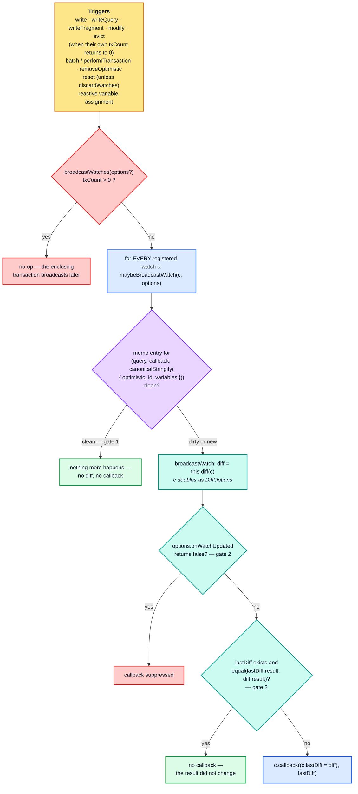
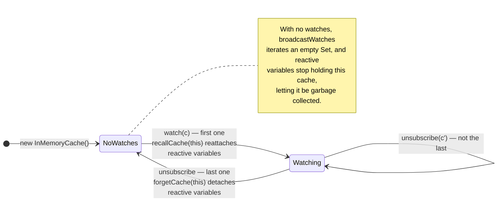
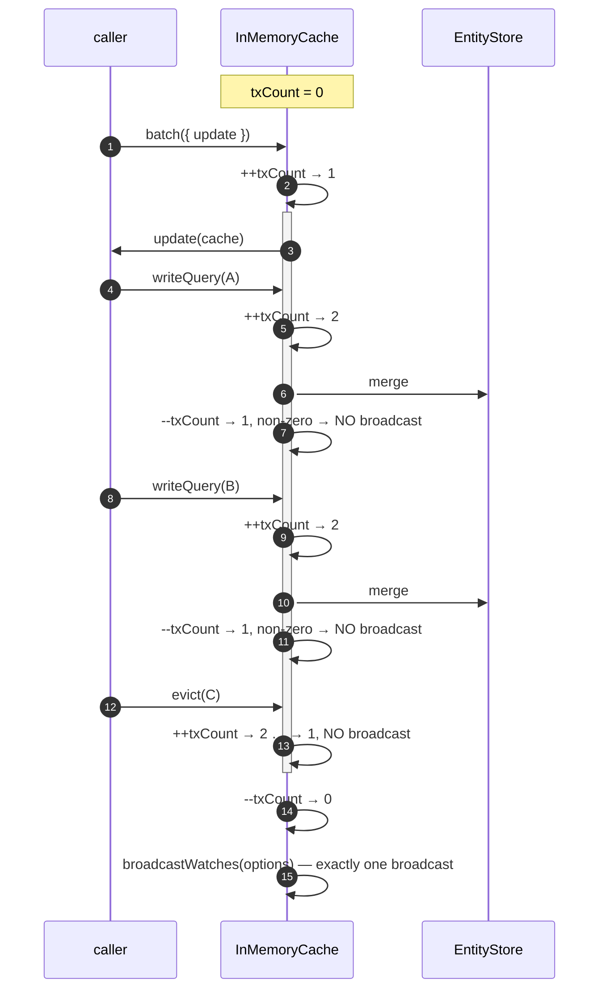
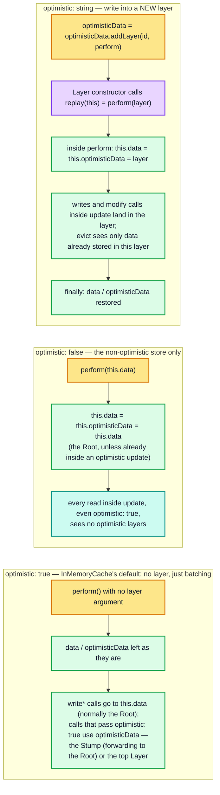
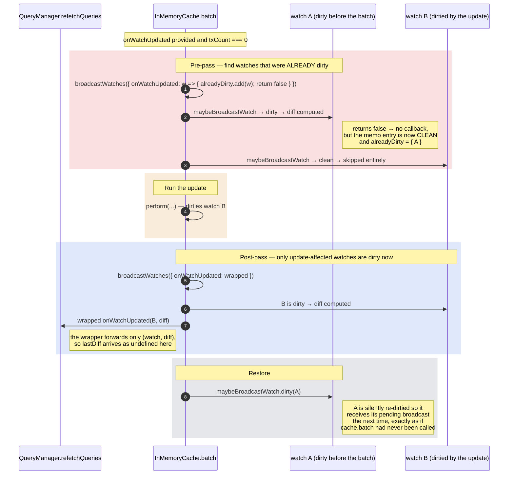
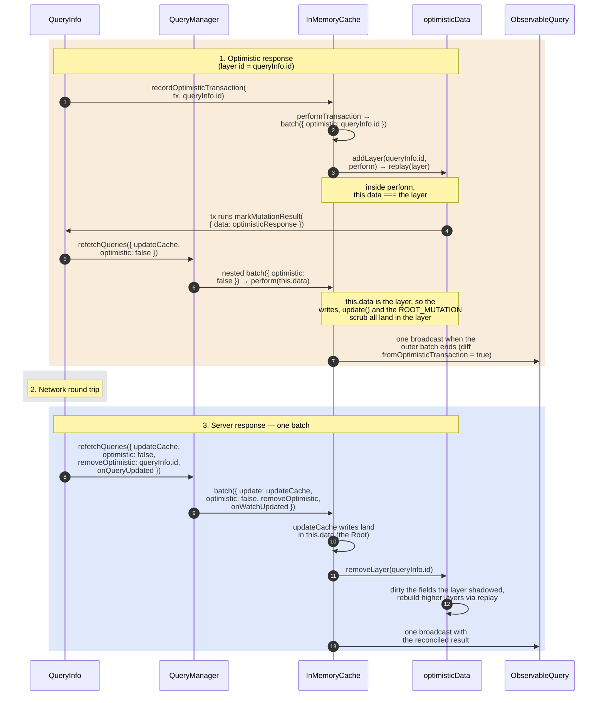
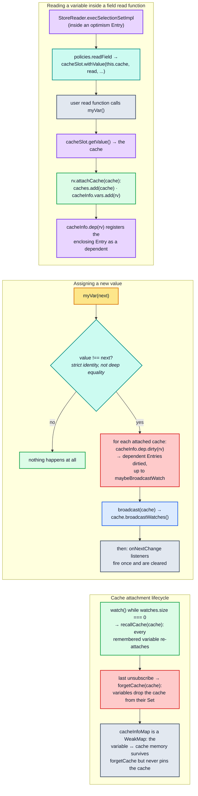
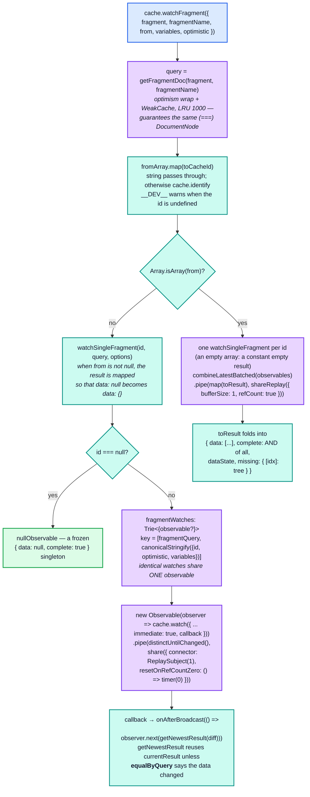

# Part 6 — Reactivity

[Documentation](../README.md) › [Architecture guide](README.md) · [← Part 5](05-store-reader.md) · [Part 7 →](07-method-reference.md)

Parts 2–5 covered storage, naming, writing, and reading. This part covers the machinery
that turns a write into a notification: `watch`, `broadcastWatches`, `txCount`, `batch`,
optimistic layers, and reactive variables.



There are **three independent gates** between a write and a callback, and understanding
which one fired is the key to debugging "my component did not re-render":

| Gate | Mechanism | Skips |
| --- | --- | --- |
| 1. Memo gate | `maybeBroadcastWatch`'s `optimism` entry is clean | the `diff` **and** the callback |
| 2. `onWatchUpdated` gate | caller returned `false` | the callback |
| 3. Equality gate | `equal(lastDiff.result, diff.result)` | the callback |

Gate 1 is the important one: it limits the *expensive* part of a broadcast (the diff and
the callback) to the watches whose dependencies were actually dirtied. The loop itself
still visits every registered watch, and for each one builds its memo key: a
`canonicalStringify` of `{ optimistic, id, variables }` plus a `Trie` lookup. So a
broadcast costs a small constant per registered watch, plus a re-read per affected watch.

The `txCount` check lives inside `broadcastWatches` itself, so every trigger is subject to
it, including `removeOptimistic`, `reset` and reactive-variable assignments (which call
`broadcastWatches()` directly). Inside a `batch`, none of them broadcasts until the batch
finishes.

## 6.1 `watch`

```ts
public watch<TData, TVariables>(watch: Cache.WatchOptions<TData, TVariables>): () => void {
  if (!this.watches.size) {
    // In case we previously called forgetCache(this) because this.watches became
    // empty (see below), reattach this cache to any reactive variables on which it
    // previously depended. ...
    recallCache(this);
  }
  this.watches.add(watch);
  if (watch.immediate) { this.maybeBroadcastWatch(watch); }
  return () => {
    // Once we remove the last watch from this.watches, cache.broadcastWatches
    // no longer does anything, so we preemptively tell the reactive variable
    // system to exclude this cache from future broadcasts.
    if (this.watches.delete(watch) && !this.watches.size) { forgetCache(this); }
    // Remove this watch from the LRU cache managed by the maybeBroadcastWatch
    // OptimisticWrapperFunction, to prevent memory leaks involving the closure
    // of watch.callback.
    this.maybeBroadcastWatch.forget(watch);
  };
}
```



The `WatchOptions` object itself is the identity used everywhere: it is the `Set` member,
the `maybeBroadcastWatch` argument, the mutable holder of `lastDiff`, and (via
`makeCacheKey`) part of the memo key through `c.callback`. The comment explains why the
callback is in the key:

```ts
// Different watches can have the same query, optimistic
// status, rootId, and variables, but if their callbacks are
// different, the (identical) result needs to be delivered to
// each distinct callback. ...
c.callback,
```

`maybeBroadcastWatch.forget(watch)` on unsubscribe is a deliberate leak fix; the source
comment says it prevents "memory leaks involving the closure of `watch.callback`". Without
it, the memo entry keyed partly by that callback would stay in the 5 000-entry LRU, along
with its dependency edges to the `executeSelectionSet` entries it read, until LRU pressure
evicted it. (The entry's function is the shared `broadcastWatch` wrapper, not a closure
over the callback.)

## 6.2 `broadcastWatch` and the equality gate

```ts
// This method is wrapped by maybeBroadcastWatch, which is called by
// broadcastWatches, so that we compute and broadcast results only when
// the data that would be broadcast might have changed. It would be
// simpler to check for changes after recomputing a result but before
// broadcasting it, but this wrapping approach allows us to skip both
// the recomputation and the broadcast, in most cases.
private broadcastWatch(c: Cache.WatchOptions, options?: BroadcastOptions) {
  const { lastDiff } = c;

  // Both WatchOptions and DiffOptions extend ReadOptions, and DiffOptions
  // currently requires no additional properties, so we can use c (a
  // WatchOptions object) as DiffOptions, without having to allocate a new
  // object, ...
  const diff = this.diff<any>(c);

  if (options) {
    if (c.optimistic && typeof options.optimistic === "string") {
      diff.fromOptimisticTransaction = true;
    }
    if (options.onWatchUpdated && options.onWatchUpdated.call(this, c, diff, lastDiff) === false) {
      // Returning false from the onWatchUpdated callback will prevent
      // calling c.callback(diff) for this watcher.
      return;
    }
  }

  if (!lastDiff || !equal(lastDiff.result, diff.result)) {
    c.callback((c.lastDiff = diff), lastDiff);
  }
}
```

The equality gate matters even though gate 1 exists, because a dirty memo entry does not
imply a changed result. `cache.modify` returning `INVALIDATE`, an evicted field with a
`read` function, or a reactive variable reassigned to an equal-but-not-identical value can
all dirty the entry while producing an identical diff. Probe section 8 shows an
`INVALIDATE` modify dirtying the watch and leaving the delivery count at `1`.

A value-preserving *write* is a different case: `storeObjectReconciler` dirties nothing,
so gate 1 stops it before any diff is computed. Probe section 7 shows the delivery count
staying at `1`; counting `broadcastWatch` calls confirms that no diff ran at all (zero
calls for the no-op write, one call for the `INVALIDATE`).

`broadcastWatches` wraps the whole loop in an `onAfterBroadcast` collector:

```ts
protected broadcastWatches(options?: BroadcastOptions) {
  if (!this.txCount) {
    const prevOnAfter = this.onAfterBroadcast;
    const callbacks = new Set<() => void>();
    this.onAfterBroadcast = (cb: () => void) => { callbacks.add(cb); };
    try {
      this.watches.forEach((c) => this.maybeBroadcastWatch(c, options));
      callbacks.forEach((cb) => cb());
    } finally {
      this.onAfterBroadcast = prevOnAfter;
    }
  }
}
```

`ApolloCache.onAfterBroadcast` defaults to `(cb) => cb()`. During a broadcast it is swapped
for a collector so that `watchFragment` observers all emit *after* every watch has been
diffed — otherwise a subscriber reacting to the first fragment could observe a
half-broadcast cache. The base-class comment states the intent: `// Can be overridden by
subclasses to delay calling the provided callback until after all broadcasts have been
completed`.

## 6.3 `txCount` — broadcast batching

`txCount` is a plain counter, incremented by `write`, `modify`, `evict` and `batch`.
(`removeOptimistic`, `reset`, `restore` and `gc` do not touch it.)



Each method's `finally` block follows the same shape:

```ts
try {
  ++this.txCount;
  return this.storeWriter.writeToStore(this.data, options);
} finally {
  if (!--this.txCount && options.broadcast !== false) { this.broadcastWatches(); }
}
```

Note that `broadcast: false` only suppresses the broadcast **that this call would have
triggered**. It does not un-dirty anything, so the next unrelated broadcast will still
deliver the change. It is a batching hint, not a mute button.

## 6.4 `batch` — the transactional API

`InMemoryCache.batch` is the most intricate method in the class. It has three orthogonal
concerns: which layer the update writes to, when the optimistic layer is removed, and how
`onWatchUpdated` interacts with watches that were *already* dirty.

```ts
public batch<TUpdateResult>(options: Cache.BatchOptions<InMemoryCache, TUpdateResult>): TUpdateResult {
  const { update, optimistic = true, removeOptimistic, onWatchUpdated } = options;

  let updateResult: TUpdateResult;
  const perform = (layer?: EntityStore): TUpdateResult => {
    const { data, optimisticData } = this;
    ++this.txCount;
    if (layer) { this.data = this.optimisticData = layer; }
    try {
      return (updateResult = update(this));
    } finally {
      --this.txCount;
      this.data = data;
      this.optimisticData = optimisticData;
    }
  };

  const alreadyDirty = new Set<Cache.WatchOptions>();

  if (onWatchUpdated && !this.txCount) {
    // If an options.onWatchUpdated callback is provided, we want to call it
    // with only the Cache.WatchOptions objects affected by options.update,
    // but there might be dirty watchers already waiting to be broadcast that
    // have nothing to do with the update. ...
    this.broadcastWatches({
      ...options,
      onWatchUpdated(watch) { alreadyDirty.add(watch); return false; },
    });
  }

  if (typeof optimistic === "string") {
    // Note that there can be multiple layers with the same optimistic ID.
    // When removeOptimistic(id) is called for that id, all matching layers
    // will be removed, and the remaining layers will be reapplied.
    this.optimisticData = this.optimisticData.addLayer(optimistic, perform);
  } else if (optimistic === false) {
    // Ensure both this.data and this.optimisticData refer to the root
    // (non-optimistic) layer of the cache during the update. ...
    perform(this.data);
  } else {
    // Otherwise, leave this.data and this.optimisticData unchanged and run
    // the update with broadcast batching.
    perform();
  }

  if (typeof removeOptimistic === "string") {
    this.optimisticData = this.optimisticData.removeLayer(removeOptimistic);
  }
  // ... broadcast, below ...
  return updateResult!;
}
```

### The three `optimistic` modes



Two points about these modes are easy to get wrong:

- **`optimistic: true` does not make an update optimistic, and it changes no reads.** It
  simply leaves `data` and `optimisticData` alone. `write*` calls still go to `this.data`,
  and only calls that themselves pass `optimistic: true` use the optimistic stack.
- **The default is `true` in the implementation, but the JSDoc says otherwise.**
  `InMemoryCache.batch` destructures `optimistic = true`, while the `Cache.BatchOptions`
  JSDoc says `@defaultValue false`. The implementation is what runs.

The `perform` closure being passed as the layer's `replay` function is the crux of
[§2.10](02-normalized-store.md#210-layer-removal-and-replay): `Layer`'s constructor invokes `replay(this)`
immediately, and `Layer.removeLayer` invokes it again whenever a lower layer is removed and
this one must be rebuilt. `perform` reassigns `this.data`/`this.optimisticData` to the layer
each time, so the same update function is re-run against a different parent state.

### The `alreadyDirty` dance



```ts
// Note: if this.txCount > 0, then alreadyDirty.size === 0, so this code
// takes the else branch and calls this.broadcastWatches(options), which
// does nothing when this.txCount > 0.
if (onWatchUpdated && alreadyDirty.size) {
  this.broadcastWatches({
    ...options,
    onWatchUpdated(watch, diff) {
      const result = onWatchUpdated.call(this, watch, diff);
      if (result !== false) {
        // Since onWatchUpdated did not return false, this diff is
        // about to be broadcast to watch.callback, so we don't need
        // to re-dirty it with the other alreadyDirty watches below.
        alreadyDirty.delete(watch);
      }
      return result;
    },
  });
  // Silently re-dirty any watches that were already dirty before the update
  // was performed, and were not broadcast just now.
  if (alreadyDirty.size) {
    alreadyDirty.forEach((watch) => this.maybeBroadcastWatch.dirty(watch));
  }
} else {
  // If alreadyDirty is empty or we don't have an onWatchUpdated
  // function, we don't need to go to the trouble of wrapping
  // options.onWatchUpdated.
  this.broadcastWatches(options);
}
```

This exists so that `client.mutate({ update, onQueryUpdated })` reports **only** the queries
its own `update` function affected, without permanently swallowing unrelated pending
broadcasts. `QueryManager.refetchQueries` is the primary consumer.

One asymmetry follows from the code above. When `alreadyDirty` is non-empty, the post-pass
wrapper calls `onWatchUpdated.call(this, watch, diff)` and drops the third argument, so the
caller's `onWatchUpdated` (and, through `refetchQueries`, `onQueryUpdated`) receives
`lastDiff === undefined`. When `alreadyDirty` is empty, `options` is passed straight
through and `lastDiff` is delivered normally.

`performTransaction` is a thin adapter kept for backwards compatibility:

```ts
public performTransaction(update: (cache: InMemoryCache) => any, optimisticId?: string | null) {
  return this.batch({ update, optimistic: optimisticId || optimisticId !== null });
}
```

Read the `optimistic` expression carefully: a string id passes through; `null` becomes
`false`; `undefined` becomes `true`.

## 6.5 Optimistic lifecycle, end to end



Two properties follow from doing the write and the layer removal inside **one** `batch`:

- The consumer never observes the intermediate state where the optimistic layer is gone but
  the server data has not landed.
- Exactly one broadcast occurs, so there is one re-render rather than two.

`removeOptimistic` on its own does broadcast unconditionally when the chain changed:

```ts
public removeOptimistic(idToRemove: string) {
  const newOptimisticData = this.optimisticData.removeLayer(idToRemove);
  if (newOptimisticData !== this.optimisticData) {
    this.optimisticData = newOptimisticData;
    this.broadcastWatches();
  }
}
```

`removeOptimistic` does not touch `txCount` itself, but `broadcastWatches` checks it, so a
call made inside a transaction still does not broadcast until the transaction ends. (The
`Cache.BatchOptions` docs note that calling `removeOptimistic` from inside a transaction's
update function may not be safe, which is why `batch` has its own `removeOptimistic`
option.) If the mutation fails, `QueryManager` calls `cache.removeOptimistic(queryInfo.id)`
directly and then `broadcastQueries()`.

Probe section 6 pins the observable layer semantics: stacking, isolation of optimistic
writes from `optimistic: false` reads, and replay-on-removal producing `"server+B"` when
layer A is removed from under layer B.

## 6.6 Reactive variables

`makeVar` creates a function that is both a getter and a setter, plus a small registry
tying variables to caches.

```ts
// cache/inmemory/reactiveVars.ts
export const cacheSlot = new Slot<ApolloCache>();

const cacheInfoMap = new WeakMap<ApolloCache, {
  vars: Set<ReactiveVar<any>>;
  dep: OptimisticDependencyFunction<ReactiveVar<any>>;
}>();

export function makeVar<T>(value: T): ReactiveVar<T> {
  const caches = new Set<ApolloCache>();
  const listeners = new Set<ReactiveListener<T>>();

  const rv: ReactiveVar<T> = function (newValue) {
    if (arguments.length > 0) {
      if (value !== newValue) {
        value = newValue!;
        caches.forEach((cache) => {
          // Invalidate any fields with custom read functions that
          // consumed this variable, so query results involving those
          // fields will be recomputed the next time we read them.
          getCacheInfo(cache).dep.dirty(rv);
          // Broadcast changes to any caches that have previously read
          // from this variable.
          broadcast(cache);
        });
        // Finally, notify any listeners added via rv.onNextChange.
        const oldListeners = Array.from(listeners);
        listeners.clear();
        oldListeners.forEach((listener) => listener(value));
      }
    } else {
      // When reading from the variable, obtain the current cache from
      // context via cacheSlot. This isn't entirely foolproof, but it's
      // the same system that powers varDep.
      const cache = cacheSlot.getValue();
      if (cache) { attach(cache); getCacheInfo(cache).dep(rv); }
    }
    return value;
  };
  // ... onNextChange / attachCache / forgetCache ...
  return rv;
}
```



Four consequences worth stating explicitly:

- **Reactive variables live outside the store.** They are not in `extract()`, they survive
  `reset()` and `restore()`, and they are not garbage collected by `gc()`.
- **The change test is `!==`, not `equal`.** Assigning a structurally-identical new array
  triggers a full invalidation cascade.
- **Attachment happens on read, not on declaration.** A variable that no `read` function has
  ever consumed within a given cache will never broadcast to it. This is why
  `makeVar`-driven UI that bypasses the cache needs `useReactiveVar` rather than a query.
- **`dep.dirty(rv)` and `broadcast(cache)` are separate.** The first invalidates memoized
  reads; the second kicks the watch loop. Both are needed: dirtying alone would leave the
  new value undelivered until something else broadcast.

Probe section 11 shows a `read` function reading a reactive variable, the variable being
reassigned, and the watcher receiving the recomputed field.

## 6.7 `watchFragment` — the observable layer on top of `watch`

`watchFragment` lives in `ApolloCache`, not `InMemoryCache`, and is a fairly thick RxJS
wrapper over `watch`.



The distinguishing detail is `equalByQuery` rather than `equal`:

```ts
function getNewestResult(diff: Cache.DiffResult<TData>) {
  const data = diff.result;
  if (!currentResult ||
      !equalByQuery(fragmentQuery, { data: currentResult.data }, { data }, options.variables)) {
    currentResult = { data, dataState: diff.complete ? "complete" : "partial", complete: diff.complete } as ...;
    if (diff.missing) { currentResult.missing = diff.missing.missing; }
  }
  return currentResult;
}
```

`equalByQuery` walks the *selection set* rather than the raw objects, and it **ignores
fields marked `@nonreactive`**. So a fragment can opt a field out of triggering updates
while still reading it. Plain `equal` could not express that.

Three more mechanisms in this code that exist purely to avoid redundant work:

- **`fragmentWatches` Trie** dedupes identical `(query, id, optimistic, variables)` watches
  into one shared observable, removed via `this.fragmentWatches.removeArray(cacheKey)` in
  the teardown.
- **`resetOnRefCountZero: () => timer(0)`** debounces teardown so a synchronous
  unsubscribe/resubscribe (React strict mode, or a re-render) does not tear down and rebuild
  the underlying `cache.watch`.
- **`combineLatestBatched`** batches twice. It subscribes once per *distinct* source
  observable and writes that value into every index that shares it, so an array of
  fragments watching the same entity emits once, not once per element. It also reads each
  source's `dirty` flag (set in the watch callback, cleared after `onAfterBroadcast`) and
  waits until every dirty source has emitted, so one broadcast that changes several
  different entities produces a single array emission.

For a single, non-null `from`, the returned observable maps `data: null` to `data: {}`. The
source comment explains this as backward compatibility: `null` was not allowed there when
`watchFragment` was introduced, and only an explicit `from: null` (or an array `from`)
yields `null` data.

<!-- nav:bottom -->

---

| ← Previous | Up | Next → |
| :-- | :-: | --: |
| [Part 5 — `StoreReader`](05-store-reader.md) | [Architecture guide](README.md) | [Part 7 — Method-by-method reference](07-method-reference.md) |
