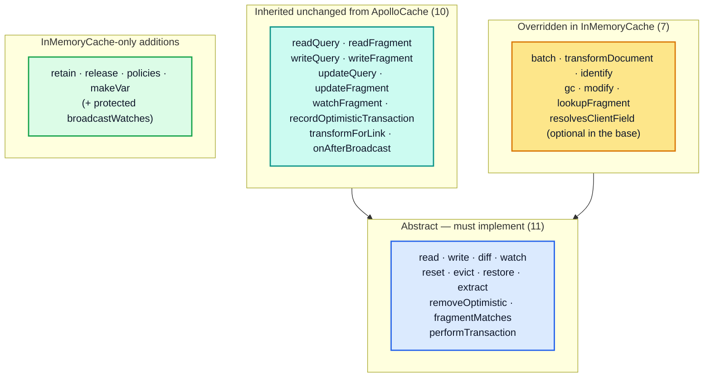
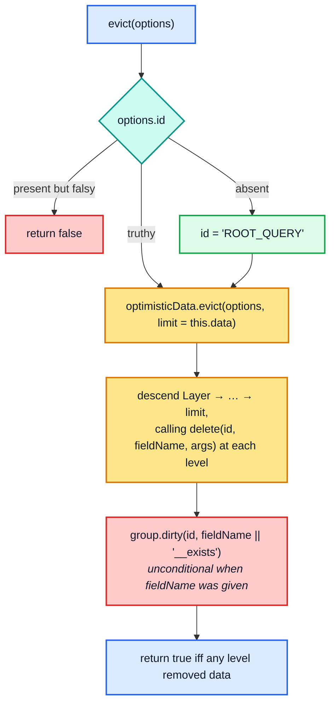
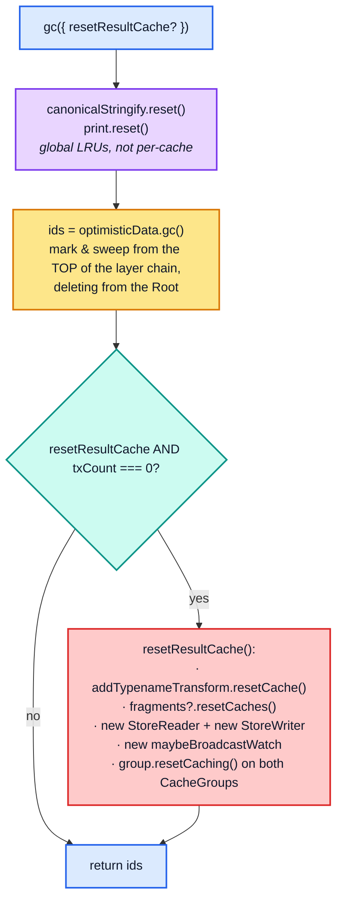
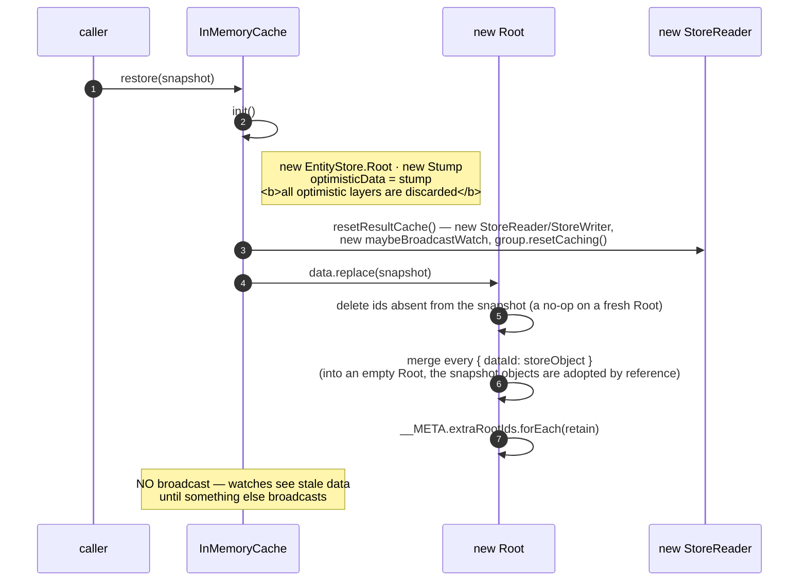
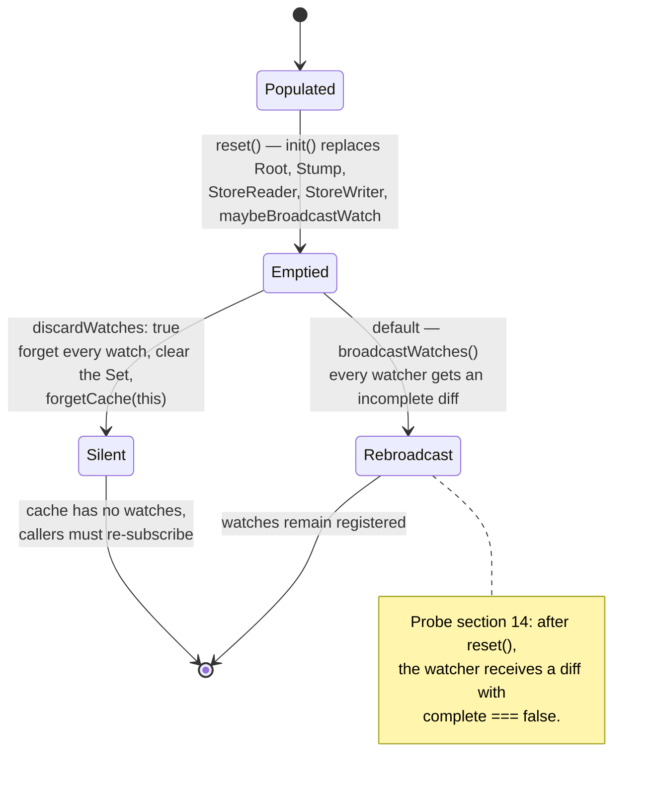
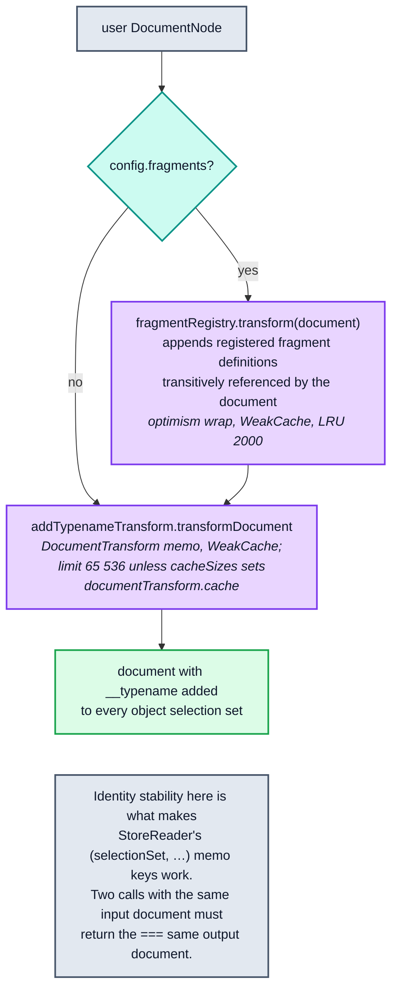
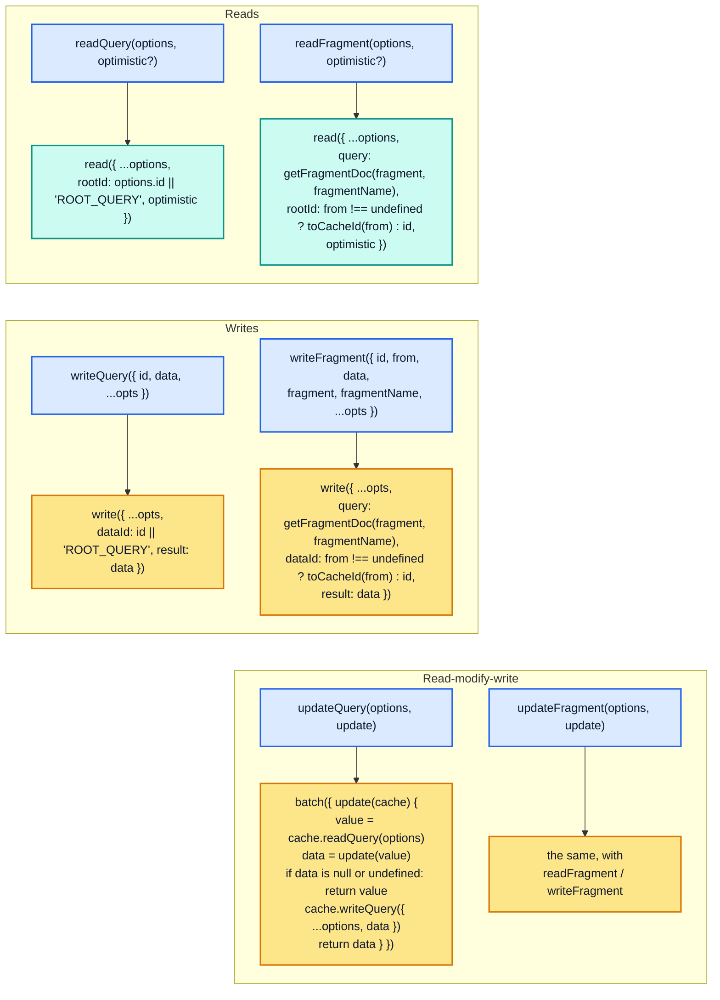

# Part 7 — Method-by-method reference

[Documentation](../README.md) › [Architecture guide](README.md) · [← Part 6](06-reactivity.md) · [Part 8 →](08-client-pipeline.md)

Everything below is `ApolloCache`'s surface as `InMemoryCache` implements it. The
classification matters for a re-implementation: **abstract** methods must be written from
scratch, **concrete-inherited** methods come for free and only require the abstract ones to
behave correctly, and **overridden** methods replace a base-class default.



The dependency order is strict: implement `write`, `read`/`diff`, `watch`,
`performTransaction` and `identify` correctly and the ten inherited methods work
automatically, because each is expressed purely in terms of them. (`identify` is needed
because `readFragment`, `writeFragment` and `watchFragment` resolve a `from` object with
it; the base implementation returns `undefined`.)

| Method | Kind | Reduces to | Broadcasts? | `txCount`? |
| --- | --- | --- | --- | --- |
| [`read`](#71-read) | abstract | `storeReader.diffQueryAgainstStore(...).result` | no | no |
| [`diff`](#72-diff) | abstract | `storeReader.diffQueryAgainstStore` | no | no |
| [`write`](#73-write) | abstract | `storeWriter.writeToStore(this.data, …)` | yes | yes |
| [`modify`](#74-modify) | override | `store.modify(id ?? "ROOT_QUERY", fields, false)` | yes | yes |
| [`evict`](#75-evict) | abstract | `optimisticData.evict(options, this.data)` | yes | yes |
| [`watch`](#76-watch) | abstract | `watches.add` + optional immediate broadcast | on `immediate` | no |
| [`batch`](#77-batch--performtransaction) | override | layer juggling + `broadcastWatches` | yes | yes |
| [`performTransaction`](#77-batch--performtransaction) | abstract | `batch` | via `batch` | via `batch` |
| [`recordOptimisticTransaction`](#77-batch--performtransaction) | inherited | `performTransaction(tx, id)` | via `batch` | via `batch` |
| [`removeOptimistic`](#78-removeoptimistic) | abstract | `optimisticData.removeLayer` | yes, if changed | no |
| [`gc`](#79-gc) | override | `optimisticData.gc()` | **no** | reads it |
| [`retain` / `release`](#710-retain--release) | addition | `EntityStore.retain/release` | no | no |
| [`extract`](#711-extract) | abstract | `(optimistic ? optimisticData : data).extract()` | no | no |
| [`restore`](#712-restore) | abstract | `init()` + `data.replace(data)` | no | no |
| [`reset`](#713-reset) | abstract | `init()` + broadcast or discard | yes (default) | no |
| [`identify`](#714-identify) | override | `policies.identify(object)[0]` | no | no |
| [`transformDocument`](#715-transformdocument--transformforlink) | override | fragment registry + `addTypename` | no | no |
| [`transformForLink`](#715-transformdocument--transformforlink) | inherited | identity | no | no |
| [`fragmentMatches`](#716-fragmentmatches--lookupfragment--resolvesclientfield) | abstract | `policies.fragmentMatches(f, t)` | no | no |
| [`lookupFragment`](#716-fragmentmatches--lookupfragment--resolvesclientfield) | override | `config.fragments?.lookup(name)` | no | no |
| [`resolvesClientField`](#716-fragmentmatches--lookupfragment--resolvesclientfield) | override | `!!policies.getReadFunction(t, f)` | no | no |
| [`readQuery` / `readFragment`](#717-the-inherited-convenience-layer) | inherited | `read` | no | no |
| [`writeQuery` / `writeFragment`](#717-the-inherited-convenience-layer) | inherited | `write` | via `write` | via `write` |
| [`updateQuery` / `updateFragment`](#717-the-inherited-convenience-layer) | inherited | `batch(read → update → write)` | once | via `batch` |
| [`watchFragment`](06-reactivity.md#67-watchfragment--the-observable-layer-on-top-of-watch) | inherited | `watch` + RxJS | via `watch` | no |

---

## 7.1 `read`

```ts
public read<TData>(options: Cache.ReadOptions<TData, OperationVariables>): TData | DeepPartial<TData> | null {
  const { returnPartialData = false } = options;
  return this.storeReader.diffQueryAgainstStore<TData>({
    ...options,
    store: options.optimistic ? this.optimisticData : this.data,
    config: this.config,
    returnPartialData,
  }).result;
}
```

**Data flow.** `options.rootId` (default `"ROOT_QUERY"`) → `makeReference` → memoized
`executeSelectionSet` → deep-frozen result tree. See [Part 5](05-store-reader.md).

**Code flow.** Pure delegation. The only decisions are the store selection and the
`returnPartialData` default flip.

**State transitions.** None in the store, but a read is not side-effect-free: it
**creates memo entries** and **registers dependencies** in the selected `CacheGroup`, and
may **attach reactive variables** to the cache via `cacheSlot`.

**Lifecycle.** Memo entries live in `StoreReader`'s two LRU caches until they are evicted
by size, forgotten through an `__exists` change, or discarded wholesale by
`resetResultCache()`. A write that merely dirties an entry leaves it in the LRU; the entry
recomputes on its next read.

**Sharp edges.**
- `read` discards the missing-field information that `diff` returns. Use `diff` when you
  need to know *what* was missing.
- With `returnPartialData: false` (the default) a single missing field collapses the whole
  result to `null`.
- The returned object is frozen in development and must be treated as immutable in
  production.

---

## 7.2 `diff`

```ts
public diff<TData, TVariables>(options: Cache.DiffOptions<TData, TVariables>): Cache.DiffResult<TData> {
  return this.storeReader.diffQueryAgainstStore({
    ...options,
    store: options.optimistic ? this.optimisticData : this.data,
    rootId: options.id || "ROOT_QUERY",
    config: this.config,
  });
}
```

The same read, exposing `{ result, complete, missing }`. Note the option name change:
`diff` takes `id`, `read` takes `rootId`.

`Cache.DiffResult` also carries `fromOptimisticTransaction`, which is stamped on by
`broadcastWatch` — never by `diff` itself:

```ts
if (c.optimistic && typeof options.optimistic === "string") { diff.fromOptimisticTransaction = true; }
```

Nothing in Apollo Client 4.2.11 reads that flag: `ObservableQuery.notify` compares an
optimistic and a non-optimistic diff instead, and its comment says the flag "is not
available through the `cache.diff` code path" ([§8.7](08-client-pipeline.md#87-broadcast--notify--reobserve)).

**Consumers.** `ObservableQuery.getCacheDiff`, `QueryInfo.markQueryResult` (to capture
`lastDiff` before writing), `QueryInfo.markMutationResult` (reading `ROOT_MUTATION`),
`QueryManager`'s `readCache`, `LocalState`, and `broadcastWatch`.

---

## 7.3 `write`

```ts
public write<TData, TVariables>(options: Cache.WriteOptions<TData, TVariables>): Reference | undefined {
  try {
    ++this.txCount;
    return this.storeWriter.writeToStore(this.data, options);
  } finally {
    if (!--this.txCount && options.broadcast !== false) { this.broadcastWatches(); }
  }
}
```

**Note `this.data`, not `this.optimisticData`.** Writes always target the current "data"
store. Outside a transaction that is the `Root`; inside `batch({ optimistic: "id" })`,
`perform` has temporarily reassigned `this.data` to the new `Layer`, so the same line writes
optimistically. That single indirection is the entire optimistic write mechanism.

**Data flow / code flow.** [Part 4](04-store-writer.md).

**State transitions.** For each staged entity: `Absent → Present`, `Present → Present`
(dirty), or `Present → PresentSame` (no dirty). Plus `store.retain(ref.__ref)` on the root
id written.

**Lifecycle.** Returns the `Reference` to the root object written, or throws
`Could not identify object` if the top-level result cannot be identified and no `dataId`
was supplied.

**Sharp edges.**
- Writing the same entity through two selection sets in one call merges both contributions
  before a single `store.merge`. Writing it twice through the *same* selection set (for
  example, twice in one list) keeps only the first occurrence
  ([§4.7](04-store-writer.md#47-the-duplicate-guard-and-the-isfresh-short-circuit)).
- `overwrite: true` blanks `existing` inside custom merge functions and suppresses the
  data-loss warning; it does not skip merge functions. `merge: true` and `merge: false`
  ignore it ([§3.5](03-policies.md#35-merge-functions)).
- `broadcast: false` suppresses only this call's broadcast.

---

## 7.4 `modify`

```ts
public modify<Entity>(options: Cache.ModifyOptions<Entity>): boolean {
  if (hasOwn.call(options, "id") && !options.id) {
    // ... we want options.id to default to ROOT_QUERY only when no options.id was
    // provided. If the caller attempts to pass options.id with a falsy/undefined value
    // (perhaps because cache.identify failed), we should not assume the goal was to
    // modify the ROOT_QUERY object. We could throw, but it seems natural to return
    // false to indicate that nothing was modified.
    return false;
  }
  const store = (options.optimistic) ? this.optimisticData : this.data;   // Defaults to false.
  try {
    ++this.txCount;
    return store.modify(options.id || "ROOT_QUERY", options.fields, false);
  } finally {
    if (!--this.txCount && options.broadcast !== false) { this.broadcastWatches(); }
  }
}
```

**Data flow / code flow.** [§2.7](02-normalized-store.md#27-modify--user-controlled-field-surgery).

**Return value semantics.** `true` iff at least one modifier produced a *different* value
(or `DELETE`). `INVALIDATE` returns `false` despite dirtying a dependency. An unknown
`dataId` returns `false` and creates nothing.

**Sharp edges.**
- `optimistic` **defaults to `false`** here, unlike `batch` (`true`) and `watchFragment`
  (`true`).
- `optimistic: true` with no active layers writes to the `Stump`, which forwards to the
  `Root`, so it is *not* isolated. With layers active it writes into the top layer, where
  the change is lost whenever that layer is rebuilt or removed. See the sharp-edge note in
  [§2.1](02-normalized-store.md#21-the-layer-chain).
- The `exact` argument is hard-coded `false` here, so `fields.feed` matches every
  `feed(...)` variant. Only `EntityStore.delete(id, fieldName, args)` passes `exact: true`.
- Modifiers see the **store representation**: children are `Reference`s, not nested objects.

---

## 7.5 `evict`

```ts
public evict(options: Cache.EvictOptions): boolean {
  if (!options.id) {
    if (hasOwn.call(options, "id")) {
      // See comment in modify method about why we return false when
      // options.id exists but is falsy/undefined.
      return false;
    }
    options = { ...options, id: "ROOT_QUERY" };
  }
  try {
    ++this.txCount;
    // Pass this.data as a limit on the depth of the eviction, so evictions
    // during optimistic updates (when this.data is temporarily set equal to
    // this.optimisticData) do not escape their optimistic Layer.
    return this.optimisticData.evict(options, this.data);
  } finally {
    if (!--this.txCount && options.broadcast !== false) { this.broadcastWatches(); }
  }
}
```



**Argument resolution.** `{ id }` removes the whole entity. `{ id, fieldName }` removes
**every** argument variant of that field, because `EntityStore.modify` is called with
`exact: false`. `{ id, fieldName, args }` resolves one `storeFieldName` via
`policies.getStoreFieldName` and removes exactly that key. Probe section 13 pins all three.

**Sharp edges.**
- Eviction leaves **dangling references** behind, and `gc()` does not remove them; only a
  `cache.modify` of the owning field (or a new write of it) does. Reads paper
  over them in list fields ([§5.4](05-store-reader.md#54-execsubselectedarrayimpl)) but not in singular fields.
- Evicting from `ROOT_QUERY` is how you invalidate a whole query's cached root fields; the
  entities themselves survive until `gc()`.
- The unconditional `group.dirty` when `fieldName` is present exists so that fields backed
  by a `read` function — which have no stored value to remove — still invalidate.

---

## 7.6 `watch`

Covered in [§6.1](06-reactivity.md#61-watch). Summary of the contract a re-implementation must honour:

| Requirement | Why |
| --- | --- |
| `immediate: true` delivers synchronously, before `watch()` returns | `watchFragment` relies on it to seed `currentResult` |
| The returned unsubscribe is idempotent and detaches reactive variables when the last watch goes | prevents broadcast storms and memory retention |
| `c.lastDiff` is mutated in place by `broadcastWatch`, and can be cleared by the watcher | it is the equality gate's baseline; `ObservableQuery` clears it to force later broadcasts through ([§8.2](08-client-pipeline.md#82-observablequery--the-caches-principal-client)) |
| A callback is skipped when `equal(lastDiff.result, diff.result)` | otherwise every unrelated write re-renders every component |
| `watch.callback` participates in the broadcast memo key | two watches with identical options but different callbacks must both fire |

---

## 7.7 `batch` / `performTransaction`

Covered in [§6.4](06-reactivity.md#64-batch--the-transactional-api). The `ApolloCache` base class provides
a default `batch` implemented on top of `performTransaction`:

```ts
// cache/core/cache.ts
public batch<U>(options: Cache.BatchOptions<this, U>): U {
  const optimisticId =
    typeof options.optimistic === "string" ? options.optimistic
    : options.optimistic === false ? null
    : void 0;
  let updateResult: U;
  this.performTransaction(() => (updateResult = options.update(this)), optimisticId);
  return updateResult!;
}
```

`InMemoryCache` overrides it because the base version cannot support `onWatchUpdated` or
`removeOptimistic`. `InMemoryCache.performTransaction` then delegates *back* to the
overridden `batch`, so the two are mutually recursive only in the type system, not at
runtime.

`recordOptimisticTransaction` is inherited unchanged:

```ts
public recordOptimisticTransaction(transaction: Transaction, optimisticId: string) {
  this.performTransaction(transaction, optimisticId);
}
```

`QueryInfo.markMutationOptimistic` is its only in-tree caller.

---

## 7.8 `removeOptimistic`

Covered in [§2.10](02-normalized-store.md#210-layer-removal-and-replay) and [§6.5](06-reactivity.md#65-optimistic-lifecycle-end-to-end).

**Contract.** Removes **all** layers with the given id (there may be several), replays every
layer above them onto the new parent, dirties every field the removed layers shadowed, and
broadcasts once — but only if the chain actually changed.

**Sharp edge.** Because layers are replayed, the `update` function passed to
`batch({ optimistic: id })` may run an arbitrary number of times. It must be pure and
idempotent, and must not close over mutable external state.

---

## 7.9 `gc`

```ts
public gc(options?: { resetResultCache?: boolean }) {
  canonicalStringify.reset();
  print.reset();
  const ids = this.optimisticData.gc();
  if (options && !this.txCount && options.resetResultCache) { this.resetResultCache(); }
  return ids;
}
```



**Sharp edges.**
- **`gc()` never broadcasts.** It deletes entities and dirties `__exists` dependencies, but
  the resulting notifications are only delivered by the *next* broadcast from some other
  operation.
- **Nothing calls `gc()` automatically.** No code in `src/core/**` invokes it. Unreachable
  entities accumulate indefinitely unless the application (or Apollo DevTools) calls it.
- `resetResultCache: true` throws away every memoized read in the cache, so the next read of
  every watched query is a full recomputation. The comment in `StoreReader`'s constructor
  notes this is the intended garbage-collection path for the memo caches:
  `// memoized functions in this class will be "garbage-collected" by recreating the whole
  StoreReader in InMemoryCache.resetResultsCache`.
- It resets **global** caches (`canonicalStringify`, `print`) shared by every cache instance
  in the process.

---

## 7.10 `retain` / `release`

```ts
// Call this method to ensure the given root ID remains in the cache after
// garbage collection, along with its transitive child entities. Note that
// the cache automatically retains all directly written entities. By default,
// the retainment persists after optimistic updates are removed. ...
public retain(rootId: string, optimistic?: boolean): number {
  return (optimistic ? this.optimisticData : this.data).retain(rootId);
}
public release(rootId: string, optimistic?: boolean): number {
  return (optimistic ? this.optimisticData : this.data).release(rootId);
}
```

Retention is a **counter**, so `retain` twice needs `release` twice. `StoreWriter` calls
`store.retain(ref.__ref)` at the end of every write, which is why
`writeFragment({ id: "Book:3" })` makes `Book:3` a gc root until released the same number of
times. `extract()` serialises the non-well-known root ids into `__META.extraRootIds`, and
`replace()` re-retains them, so retention survives a round trip.

---

## 7.11 `extract`

```ts
public extract(optimistic: boolean = false): NormalizedCacheObject {
  return (optimistic ? this.optimisticData : this.data).extract();
}
```

`EntityStore.extract` flattens the layer chain via `toObject()` and appends
`__META.extraRootIds` (sorted, so snapshots are stable). `Layer.toObject` is:

```ts
public toObject(): NormalizedCacheObject {
  return { ...this.parent.toObject(), ...this.data };
}
```

so `extract(true)` gives the flattened optimistic view with layer data shadowing the root.
Tombstones (`undefined` values stored by a layer) survive into the extracted object as
explicit `undefined` properties — a detail that matters if you `JSON.stringify` the result,
since `JSON.stringify` drops them.

---

## 7.12 `restore`

```ts
public restore(data: NormalizedCacheObject): this {
  this.init();
  // Since calling this.init() discards/replaces the entire StoreReader, along
  // with the result caches it maintains, this.data.replace(data) won't have
  // to bother deleting the old data.
  if (data) this.data.replace(data);
  return this;
}
```



**Sharp edges.**
- `restore` does **not** broadcast. `reset` does. If you restore into a cache with live
  watches, you must trigger a broadcast yourself.
- `EntityStore.replace` deletes entities missing from the snapshot but **merges** the ones
  present in both, field by field. `restore` sidesteps that by calling `init()` first, so it
  always fills a fresh `Root`.
- The snapshot's entity objects become the store's objects: `restore` does not copy them
  (verified: `cache.extract()[id] === snapshot[id]`). In development builds, later reads
  freeze them. Pass a copy if the snapshot object is used elsewhere.
- Retain *counts* do not round-trip: each id in `__META.extraRootIds` is retained exactly
  once, however many times it was retained before `extract()`.
- Optimistic layers are silently dropped.

---

## 7.13 `reset`

```ts
public reset(options?: Cache.ResetOptions): Promise<void> {
  this.init();
  canonicalStringify.reset();

  if (options && options.discardWatches) {
    // Similar to what happens in the unsubscribe function returned by
    // cache.watch, applied to all current watches.
    this.watches.forEach((watch) => this.maybeBroadcastWatch.forget(watch));
    this.watches.clear();
    forgetCache(this);
  } else {
    // Calling this.init() above unblocks all maybeBroadcastWatch caching, so
    // this.broadcastWatches() triggers a broadcast to every current watcher
    // (letting them know their data is now missing). This default behavior is
    // convenient because it means the watches do not have to be manually
    // reestablished after resetting the cache. ...
    this.broadcastWatches();
  }
  return Promise.resolve();
}
```



The `Promise<void>` return exists so subclasses can reset asynchronously;
`InMemoryCache`'s work is entirely synchronous.

---

## 7.14 `identify`

```ts
// Returns the canonical ID for a given StoreObject, obeying typePolicies
// and keyFields (and dataIdFromObject, if you still use that). At minimum,
// the object must contain a __typename and any primary key fields required
// to identify entities of that type. If you pass a query result object, be
// sure that none of the primary key fields have been renamed by aliasing.
// If you pass a Reference object, its __ref ID string will be returned.
public identify(object: StoreObject | Reference): string | undefined {
  if (isReference(object)) return object.__ref;
  try {
    return this.policies.identify(object)[0];
  } catch (e) {
    invariant.warn(e);
  }
}
```

Note the `try/catch`: unlike the write path, a missing key field here **logs the error as a
warning and returns `undefined`** rather than throwing. `watchFragment` adds its own
development warning whenever the resulting id is `undefined`, which also covers objects
that are simply not identifiable (no error is thrown for those).

Calling `cache.identify(obj)` passes no `partialContext`, so `context.storeObject` defaults
to `object` itself and `readField` is bound to `policies.cache["data"]`: the `Root`,
except inside an optimistic `batch`, where `data` is temporarily the active layer.

---

## 7.15 `transformDocument` / `transformForLink`

```ts
public transformDocument(document: DocumentNode): DocumentNode {
  return this.addTypenameTransform.transformDocument(this.addFragmentsToDocument(document));
}
private addFragmentsToDocument(document: DocumentNode) {
  const { fragments } = this.config;
  return fragments ? fragments.transform(document) : document;
}
```



`defaultCacheSizes` declares `"documentTransform.cache" = 2000`, but `DocumentTransform`
passes `cacheSizes["documentTransform.cache"]` to `wrap` *without* falling back to that
default. When the size is not configured, `optimism`'s own default of `2^16` applies
(verified on a live cache: the `addTypenameTransform` memo reports `max = 65536`).

`addTypenameToDocument.added(field)` is later consulted by both the reader and the writer to
suppress diagnostics for `__typename` fields the cache itself injected — the writer skips
the "Missing field" error, and the reader skips the missing-field entry.

`transformForLink` is the base-class identity function; `InMemoryCache` does not override
it. `QueryManager` calls it before each link request
(`mutation = this.cache.transformForLink(this.transform(mutation))`), so a cache
implementation can strip cache-only additions before the document goes to the server.

---

## 7.16 `fragmentMatches` / `lookupFragment` / `resolvesClientField`

```ts
public fragmentMatches(fragment: InlineFragmentNode | FragmentDefinitionNode, typename: string): boolean {
  return this.policies.fragmentMatches(fragment, typename);
}
public lookupFragment(fragmentName: string): FragmentDefinitionNode | null {
  return this.config.fragments?.lookup(fragmentName) || null;
}
public resolvesClientField(typename: string, fieldName: string): boolean {
  return !!this.policies.getReadFunction(typename, fieldName);
}
```

These three are the cache's contract with subsystems *outside* the cache:

| Method | Consumer | What breaks without it |
| --- | --- | --- |
| `fragmentMatches` | data masking, local resolvers | masking cannot decide whether an inline fragment on an interface applies, so it is effectively disabled — the base class comment says exactly this |
| `lookupFragment` | data masking (`maskDefinition`) | masking cannot resolve a spread whose definition lives only in the fragment registry. (The reader and writer do not call it: `extractFragmentContext` asks the registry directly.) |
| `resolvesClientField` | `LocalState` | a `@client` field with a cache `read` function would be set to `null` and warned about, instead of being left `undefined` for the cache to fill in |

---

## 7.17 The inherited convenience layer

All six of these are defined once in `ApolloCache` and inherited unchanged.



Details that matter:

- **`getFragmentDoc` must be memoized.** It wraps `getFragmentQueryDocument` with
  `wrap(..., { cache: WeakCache, makeCacheKey: bindCacheKey(this) })` (LRU 1000). Without a
  stable `===` output document, every `readFragment` would produce a fresh
  `SelectionSetNode` and miss `StoreReader`'s memo entirely. Each cache instance has its
  own wrapped function, so entries are never shared between caches anyway;
  `bindCacheKey(this)` exists for memory. The key trie it uses is `optimism`'s
  module-global `defaultKeyTrie`, and putting the cache instance first in the key path
  lets those trie nodes be collected together with the cache. The `WeakCache` lets entries
  die with their fragment documents.
- **`from` wins over `id`.** `readFragment` and `writeFragment` use
  `from !== undefined ? toCacheId(from) : id`. With neither, `rootId` is `undefined` and
  the read falls back to `ROOT_QUERY`.
- **`writeFragment` with a `dataId` that `identify` cannot derive is still legal.** It
  passes `dataId` explicitly, and `processSelectionSet` catches the `identify` failure
  (`if (!dataId) throw e`).
- **`updateQuery`/`updateFragment` return the *new* data** if the updater produced any, and
  the previously-read value otherwise. Returning `undefined` or `null` from the updater is
  the documented way to abort without writing.
- **`toCacheId`** is `typeof from === "string" ? from : this.identify(from)`, so `from`
  accepts a `StoreObject`, a `Reference`, a masked `FragmentType`, or a raw id string.

---

## 7.18 What `InMemoryCache` deliberately does *not* implement

| Base-class member | `InMemoryCache` behaviour |
| --- | --- |
| `transformForLink` | inherited identity — the cache does not strip anything for the link chain |
| `onAfterBroadcast` | inherited default `(cb) => cb()`, but temporarily replaced by a collector inside `broadcastWatches` |
| `assumeImmutableResults` | overridden to `true` (base default is `false`) |

The `assumeImmutableResults` override is a capability declaration, not a configuration knob:

```ts
// Override the default value, since InMemoryCache result objects are frozen
// in development and expected to remain logically immutable in production.
public readonly assumeImmutableResults = true;
```

It flows outward — `ApolloClient` defaults its own `assumeImmutableResults` option to
`cache.assumeImmutableResults`, and `QueryManager` republishes it as a public readonly
property — but as of 4.2.11 nothing inside `src/` branches on it. Treat it as the cache
advertising its immutability contract to application and integration code rather than as a
switch that changes client behaviour.

<!-- nav:bottom -->

---

| ← Previous | Up | Next → |
| :-- | :-: | --: |
| [Part 6 — Reactivity](06-reactivity.md) | [Architecture guide](README.md) | [Part 8 — The cache in the Apollo Client pipeline](08-client-pipeline.md) |
