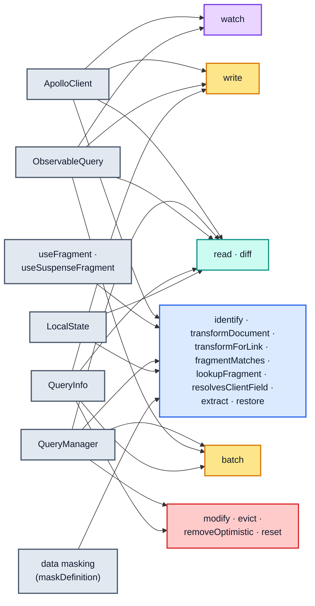
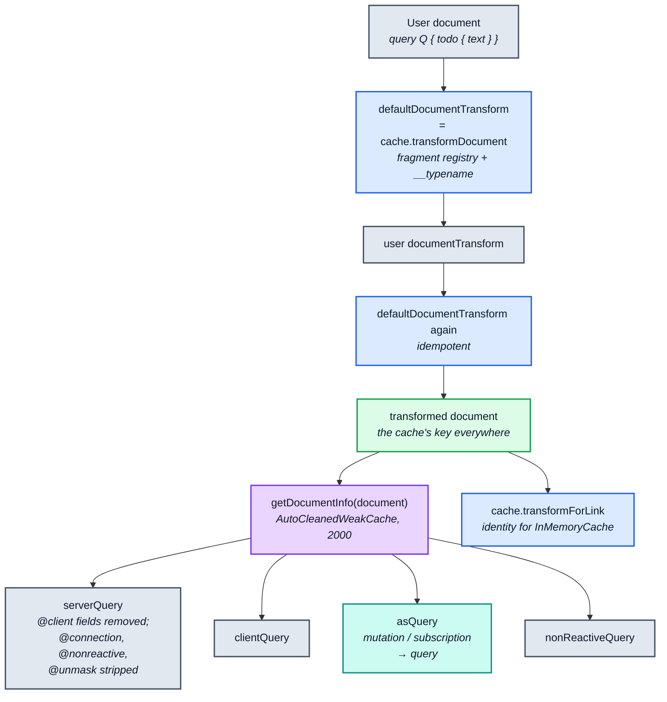
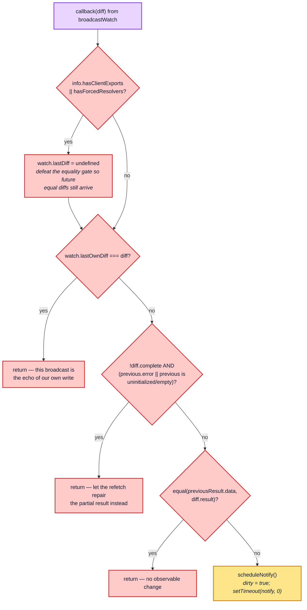
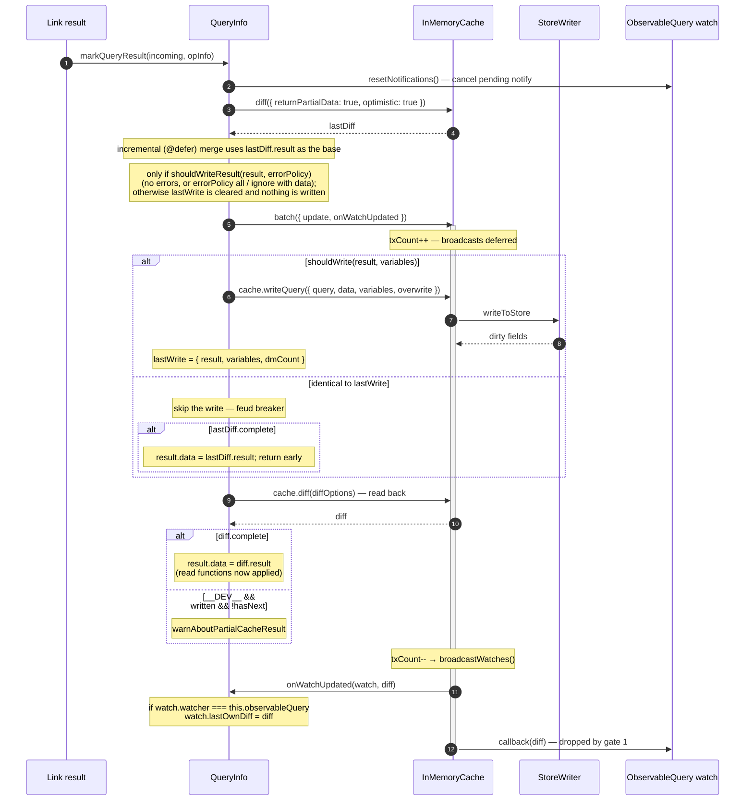
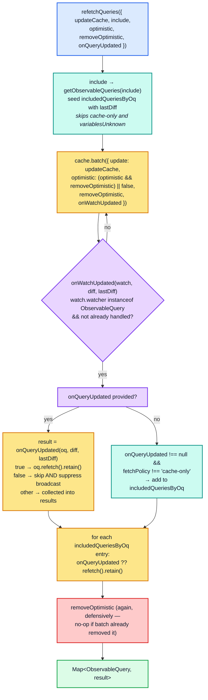
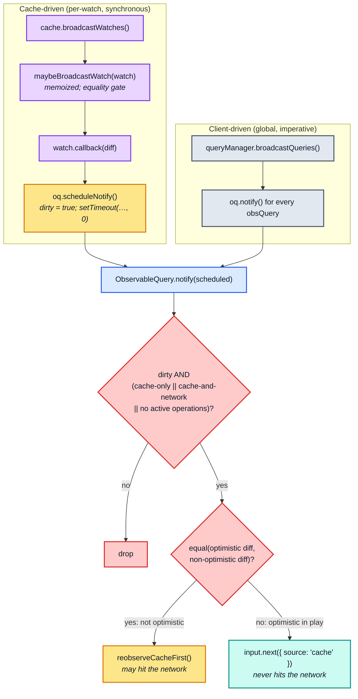

# Part 8 — The cache in the Apollo Client pipeline

[Documentation](../README.md) › [Architecture guide](README.md) · [← Part 7](07-method-reference.md) · [Part 9 →](09-invariants-and-checklist.md)

Parts 0–7 treated the cache as a closed system. This part opens the boundary: who calls
which method, in what order, and — most importantly — **which client behaviours are actually
cache behaviours in disguise**. Several things people believe are `InMemoryCache` features
(deduplicated notifications, "the query didn't re-render", `@nonreactive`) live partly or
wholly in `QueryManager` and `ObservableQuery`.

## 8.0 The call map

Every arrow below is a real call site in `src/` (outside `src/cache/` itself), found by
searching for every cache-method call; the table under the diagram lists them. Nothing else
in `src/` calls the cache.



| Caller | Cache methods it calls |
| --- | --- |
| `ApolloClient` | `readQuery`, `readFragment` (both after applying the client's document transform), `writeQuery`, `writeFragment` (each followed by `queryManager.broadcastQueries()` unless `broadcast: false`), `watchFragment` (transformed; development builds also run masking over each result), `extract`, `restore` |
| `useFragment`, `useSuspenseFragment` | `identify` |
| `QueryManager` | `transformDocument` (inside its `DocumentTransform`), `transformForLink`, `diff` (`fetchQueryByPolicy`'s `readCache`), `batch` (`refetchQueries`), `removeOptimistic` (failed mutations, `refetchQueries`), `reset` (`clearStore`) |
| `ObservableQuery` | `diff` (`getCacheDiff`), `watch` (`resubscribeCache`), `batch` with `updateQuery` / `writeQuery` inside (`fetchMore`), `writeQuery` (`updateQuery`) |
| `QueryInfo` | `diff`, `batch` and `writeQuery` (`markQueryResult`), `write` and `modify` (`markMutationResult`), `recordOptimisticTransaction` (`markMutationOptimistic`), `write` (`markSubscriptionResult`); it also wraps `evict`, `modify` and `reset` ([§8.4](#84-queryinfomarkqueryresult--the-write-path-and-the-feud-breaker)) |
| `LocalState` | `diff` (twice, `optimistic: false`), `fragmentMatches`, `resolvesClientField` |
| data masking (`maskDefinition`) | `fragmentMatches`, `lookupFragment` |

Read the map as three tiers:

| Tier | Members | Cache relationship |
| --- | --- | --- |
| **Owner** | `ApolloClient` | constructs the cache and forwards the convenience API, adding its document transform on reads and a `broadcastQueries()` after writes |
| **Orchestrators** | `QueryManager`, `ObservableQuery`, `QueryInfo` | drive the network-result lifecycle: they write results, watch queries, and run transactions |
| **Consultants** | `LocalState`, masking, `useFragment` | read data or metadata only: `diff`, `fragmentMatches`, `lookupFragment`, `resolvesClientField`, `identify` |

## 8.1 Document transforms — what the cache sees is not what you wrote

`QueryManager` wraps `cache.transformDocument` in a `DocumentTransform` and — critically —
disables that transform's own cache:

```ts
const defaultDocumentTransform = new DocumentTransform(
  (document) => this.cache.transformDocument(document),
  // Allow the apollo cache to manage its own transform caches
  { cache: false }
);
```

When a user transform is configured, the default transform runs **twice**, sandwiching it:

```ts
this.documentTransform =
  documentTransform ?
    defaultDocumentTransform
      .concat(documentTransform)
      // The custom document transform may add new fragment spreads or new
      // field selections, so we want to give the cache a chance to run
      // again. For example, the InMemoryCache adds __typename to field
      // selections and fragments from the fragment registry.
      .concat(defaultDocumentTransform)
  : defaultDocumentTransform;
```

This is why [§7.15](07-method-reference.md#715-transformdocument--transformforlink)'s `transformDocument` must be **idempotent**: the second pass sees a
document that already has `__typename` everywhere and must return it unchanged. When the
user transform returns its input as-is, the second pass is also an identity in the `===`
sense: `DocumentTransform.transformDocument` keeps a `WeakSet` of the documents it
produced and returns any of them unchanged.



Two derived documents matter to the cache:

- **`asQuery`** rewrites `operation: "mutation" | "subscription"` to `"query"`. The reader
  needs it: `diffQueryAgainstStore` calls `getQueryDefinition`, which only accepts a query
  document. `QueryInfo.markMutationResult` therefore passes `asQuery` to `cache.diff` ("The
  cache complains if passed a mutation where it expects a query"). The writer does not
  need it: `writeToStore` uses `getOperationDefinition`, and `markMutationResult` writes
  the mutation document itself to `ROOT_MUTATION`.
- **`serverQuery`** is what the link chain sees: `@client` fields are removed entirely, and
  the `@connection`, `@nonreactive` and `@unmask` directives are stripped. The cache never
  sees `serverQuery`; it always works with the full transformed document. That is why
  `@connection` can shape store keys
  ([§3.3](03-policies.md#33-field-identity-getstorefieldname)) and why `@nonreactive` is
  still present for `ObservableQuery` and `watchFragment` to honour ([§8.9](#89-data-masking),
  [§6.7](06-reactivity.md#67-watchfragment--the-observable-layer-on-top-of-watch)).

> **Sharp edge.** The document identity that reaches the cache is the *transformed* one,
> and `StoreReader`'s memo keys are the `SelectionSetNode` objects inside it. Two documents
> that print identically but are distinct objects produce distinct memo entries.
> `DocumentTransform`'s memo does **not** collapse them: it is keyed by the input document's
> identity, so each distinct input gets its own output. What normally prevents duplicates
> is `graphql-tag`, whose `gql` returns the same parsed object for identical source text.

## 8.2 `ObservableQuery` — the cache's principal client

An `ObservableQuery` holds **exactly one** cache watch at a time, installed by
`resubscribeCache()` and torn down on query/variable change:

```ts
const watch: ObservableQuery.CacheWatchOptions<TData, TVariables> = {
  query,
  variables,
  optimistic: true,
  watcher: this,
  callback: (diff) => { /* ... */ },
};
const cancelWatch = this.cache.watch(watch);
```

`watcher: this` is an extension field on the watch object. It is how `onWatchUpdated`
callbacks in `QueryInfo` ([§8.4](#84-queryinfomarkqueryresult--the-write-path-and-the-feud-breaker)) and `QueryManager.refetchQueries` ([§8.6](#86-refetchqueries--the-batch-and-collect-protocol)) recognise "is
this watch mine?"

Three fetch policies **do not watch at all**:

```ts
const shouldUnsubscribe =
  fetchPolicy === "standby" ||
  fetchPolicy === "no-cache" ||
  this.waitForNetworkResult;
```

`waitForNetworkResult` is initialised to `fetchPolicy === "network-only"` and cleared the
first time a network notification arrives, at which point `resubscribeCache()` runs again.
So a `network-only` query is *invisible to the cache's broadcast* until its first response
lands.

### The watch callback's four gates



Gate 0 is a deliberate defeat of the cache's own optimisation. The comment is explicit
about the coupling:

```ts
// This is based on an implementation detail of `InMemoryCache`, which
// is not optimal - but the only alternative to this would be to
// resubscribe to the cache asynchonouly, which would bear the risk of
// missing further synchronous updates.
watch.lastDiff = undefined;
```

Recall from [§6.2](06-reactivity.md#62-broadcastwatch-and-the-equality-gate) that `broadcastWatch` skips the callback when `equal(lastDiff.result,
diff.result)`. A query with `@client @export` variables or forced resolvers may produce a
*different* final result from an *identical* cache diff, so it clears `lastDiff` to force
every future broadcast through.

Gate 1 is the "own write" suppression. `QueryInfo.markQueryResult` passes an
`onWatchUpdated` to its `batch`. When the batch's closing broadcast reaches this watch,
`onWatchUpdated` stamps `watch.lastOwnDiff = diff` and, because it does not return
`false`, `broadcastWatch` then hands **that same `diff` object** to the callback, which
drops it by **reference identity**, not deep equality. The doc comment on the field explains why full suppression
is not an option:

```ts
/**
 * @internal
 * We cannot suppress the broadcast completely, since that would
 * ...
 * Without the `own B` being broadcast, the `cache.watch` would swallow
 * C.
 * So instead we track the last "own diff" and suppress further processing
 * in the callback.
 */
lastOwnDiff?: Cache.DiffResult<TData>;
```

Suppressing the broadcast would leave `watch.lastDiff` stale at `A`, and the *next*
genuine change `C` would be compared against `A` instead of `B`. The watch must see `B` to
keep its equality baseline honest — it just must not act on it.

## 8.3 Fetch policies as a cache-interaction table

`fetchQueryByPolicy` is where a fetch policy becomes concrete cache calls. Its `readCache`
helper is fixed:

```ts
const readCache = () =>
  this.cache.diff<any>({
    query,
    variables,
    returnPartialData: true,
    optimistic: true,
  });
```

Note `returnPartialData: true` unconditionally — the *user's* `returnPartialData` is applied
later in `toResult`, which blanks `data` to `undefined` when `!diff.complete`. The cache is
always asked for everything it has.

| `fetchPolicy` | Reads cache? | Watches cache? | Writes result? | Emission shape |
| --- | --- | --- | --- | --- |
| `cache-first` | yes | yes | `MERGE` | cache alone if `complete`; else cache-then-link when `returnPartialData`, else link only |
| `cache-and-network` | yes | yes | `MERGE` | `concat(cache, link)` when `complete \|\| returnPartialData` |
| `cache-only` | yes | yes | — | cache only, `NetworkStatus.ready` |
| `network-only` | no | **after first result** | `MERGE`/`OVERWRITE` | link only |
| `no-cache` | no | no | `FORBID` | link only |
| `standby` | no | no | — | `EMPTY` |

`CacheWriteBehavior` is chosen once per fetch and threaded into `QueryInfo`:

```ts
const cacheWriteBehavior =
  fetchPolicy === "no-cache" ? CacheWriteBehavior.FORBID
    // Watched queries must opt into overwriting existing data on refetch,
    // by passing refetchWritePolicy: "overwrite" in their WatchQueryOptions.
  : (
    networkStatus === NetworkStatus.refetch &&
    normalized.refetchWritePolicy !== "merge"
  ) ?
    CacheWriteBehavior.OVERWRITE
  : CacheWriteBehavior.MERGE;
```

| Behaviour | Effect on the cache |
| --- | --- |
| `FORBID` | no `diff`, no `write` — `markQueryResult` returns the raw network result |
| `OVERWRITE` | `writeQuery({ overwrite: true })` → `StoreWriter` sets `overwrite` in `WriteContext`, which suppresses `warnAboutDataLoss` **and** makes paginated `merge` functions receive `existing === undefined` |
| `MERGE` | the normal write |

`OVERWRITE` is the mechanism behind `refetchWritePolicy: "overwrite"` (the default for
refetches). Without it, a refetch of `feed(offset: 0)` would append to the existing list via
the user's `merge` function rather than replacing it.

## 8.4 `QueryInfo.markQueryResult` — the write path and the feud breaker

This is the single most important cache interaction in the client. Every network result for
a watched query goes through it.



Three things deserve emphasis.

**Why a `batch` at all.** The comment says it plainly:

```ts
// Using a transaction here so we have a chance to read the result
// back from the cache before the watch callback fires as a result
// of writeQuery, so we can store the new diff quietly and ignore
// it when we receive it redundantly from the watch callback.
```

The `update` function writes *and then* re-reads, all while `txCount > 0`. Only when the
batch unwinds does the broadcast fire. During that broadcast, `onWatchUpdated` tags the
watch with `lastOwnDiff` immediately before the same diff reaches the watch's callback.

**The read-back replaces the network result.** If the cache can produce a complete result,
`result.data` becomes the *cache's* version, not the server's:

```ts
if (diff.complete) {
  result = { ...result, data: diff.result };
}
```

This is how `read` functions, `merge` functions, and normalization-driven cross-query
consistency reach the caller. It is also why a `read` function that drops a field triggers
`warnAboutPartialCacheResult` — the client wrote data it then could not read back, so it
falls back to the raw network result and loses all `read`-function output.

**The feud breaker.** `shouldWrite` guards against two queries repeatedly clobbering each
other's version of the same entity:

```ts
private shouldWrite(result, variables) {
  const { lastWrite } = this;
  return !(
    lastWrite &&
    // If cache.evict has been called since the last time we wrote this
    // data into the cache, there's a chance writing this result into
    // the cache will repair what was evicted.
    lastWrite.dmCount === destructiveMethodCounts.get(this.cache) &&
    equal(variables, lastWrite.variables) &&
    equal(result.data, lastWrite.result.data) &&
    result.extensions?.[streamInfoSymbol] ===
      lastWrite.result.extensions?.[streamInfoSymbol]
  );
}
```

`destructiveMethodCounts` is maintained by monkey-patching the cache — the one place in
Apollo Client where the cache's own methods are wrapped from outside:

```ts
function wrapDestructiveCacheMethod(cache: ApolloCache, methodName: "evict" | "modify" | "reset") {
  const original = cache[methodName];
  if (typeof original === "function") {
    cache[methodName] = function () {
      destructiveMethodCounts.set(cache, (destructiveMethodCounts.get(cache)! + 1) % 1e15);
      return original.apply(this, arguments);
    };
  }
}
```

The counter is installed once per cache (guarded by `destructiveMethodCounts.has(cache)`)
by the first `QueryInfo` constructed for that cache. Any `evict`/`modify`/`reset` bumps it,
which forces the next identical network result to be written again, because eviction may
have removed exactly the data this result would restore.

"Any" includes Apollo's own calls. `markMutationResult` scrubs `ROOT_MUTATION` with
`cache.modify` ([§8.5](#85-mutations--optimistic-layer-final-write-root-field-scrub)) through the patched method, so every completed mutation (without
`keepRootFields`) bumps the counter too. After a mutation, the next network result of every
query is written even if it equals that query's previous result.

> **Re-implementation note.** A drop-in `InMemoryCache` replacement must keep `evict`,
> `modify` and `reset` as **writable own-or-prototype properties assignable on the
> instance**. If they were defined as non-writable, or as class fields captured by internal
> closures that bypass the patched property, the feud breaker silently stops seeing
> destructive operations and stale results stop being repaired.

## 8.5 Mutations — optimistic layer, final write, root-field scrub

```mermaid
stateDiagram-v2
    direction TB
    [*] --> Optimistic: optimisticResponse provided
    [*] --> InFlight: no optimisticResponse

    Optimistic: markMutationOptimistic
    Optimistic: recordOptimisticTransaction(tx, queryInfo.id)
    Optimistic: → Layer(id = queryInfo.id) on optimisticData
    Optimistic: writes ROOT_MUTATION + runs update() in the layer
    Optimistic --> InFlight: link request starts

    InFlight --> Success: link emits result
    InFlight --> Failure: link errors

    Success: markMutationResult
    Success: refetchQueries({ optimistic:false, removeOptimistic: id })
    Success: → cache.batch removes the layer AND writes root, one broadcast
    Success --> Scrubbed

    Scrubbed: cache.modify({ id: "ROOT_MUTATION", fields → DELETE })
    Scrubbed: keeps only __typename
    Scrubbed --> [*]

    Failure: cache.removeOptimistic(queryInfo.id)
    Failure: broadcastQueries()
    Failure --> [*]
```



The optimistic entry point is tiny — it simply replays the *whole* result-marking path
inside a recorded transaction:

```ts
this.cache.recordOptimisticTransaction((cache) => {
  try {
    this.markMutationResult({ data }, mutation, cache as TCache);
  } catch (error) {
    invariant.error(error);
  }
}, this.id);
```

The same code runs against two targets. The transaction receives the `InMemoryCache`
itself, but during the optimistic `perform`, `cache.data` *is* the new layer. All of
`markMutationResult`'s writes go through `refetchQueries` → `cache.batch({ optimistic:
false })`, which writes to `this.data`, so the optimistic run lands in the layer, while the
real run (outside any transaction) lands in the `Root`. This is why `update` functions must
be pure enough to run twice, and again on every replay of the layer.

The layer id is `queryInfo.id` (a per-`QueryManager` counter stringified), and the same
string is passed as `removeOptimistic` to the final `refetchQueries`, so removal and the
authoritative write collapse into a single `batch` and therefore a single broadcast ([§6.4](06-reactivity.md#64-batch--the-transactional-api)).

Three cache-visible details:

- **`ROOT_MUTATION` is written and then scrubbed.** The write is needed because
  `markMutationResult` re-reads `ROOT_MUTATION` with `cache.diff` (using `asQuery`) and, if
  that read is complete, passes the read-back data (with `read`-function output applied)
  to the `update` function. The scrub is a `modify` rather than an `evict`, as the source's
  TODO explains, so that it can be rolled back inside an optimistic layer:

  ```ts
  // TODO Do this with cache.evict({ id: 'ROOT_MUTATION' }) but make it
  // shallow to allow rolling back optimistic evictions.
  cache.modify({
    id: "ROOT_MUTATION",
    fields(value, { fieldName, DELETE }) {
      return fieldName === "__typename" ? value : DELETE;
    },
  });
  ```

  `keepRootFields: true` skips it. Entities referenced from `ROOT_MUTATION` survive the
  scrub — only the root's own fields go, and the entities are reachable from `ROOT_QUERY`
  or retained elsewhere (or become garbage at the next `gc()`).
- **`updateQueries` reads through `getCacheDiff({ optimistic: false })`** and only runs the
  reducer when `complete` — an incomplete query is skipped silently.
- **Nothing is scrubbed while `hasNext`** (`@defer` still streaming), so partial mutation
  payloads accumulate on `ROOT_MUTATION` until the final chunk.

## 8.6 `refetchQueries` — the batch-and-collect protocol

`QueryManager.refetchQueries` is the most elaborate `cache.batch` caller in the codebase,
and the reason `onWatchUpdated`'s return value is meaningful ([§6.4](06-reactivity.md#64-batch--the-transactional-api)).



The `optimistic` translation is the subtle part:

```ts
optimistic: (optimistic && removeOptimistic) || false,
```

`refetchQueries` accepts only `true`/`false`, but `cache.batch` accepts `false | true |
string`. `true` is translated into the **string** form, which ([§6.4](06-reactivity.md#64-batch--the-transactional-api)) creates a temporary
layer, runs `updateCache` inside it, and, paired with `removeOptimistic`, removes that
layer again *before* the batch's single broadcast. The watches the update dirtied still
recompute in that broadcast, and each one is reported to `onWatchUpdated` (and so to
`onQueryUpdated`). By then the cache is back to its previous state. The result: "find the
queries this update would affect, and refetch or inspect them, without keeping the
update". The comment spells out the deliberate non-support:

```ts
// In other words, we are deliberately not supporting the use case of
// writing to an *existing* optimistic layer (using the refetchQueries
// updateCache function), since that would potentially interfere with
// other optimistic updates in progress.
```

`onQueryUpdated` returning `false` is the client-level way to **suppress a cache broadcast
to a specific watcher**: it propagates back into `broadcastWatches`'s `onWatchUpdated`
return check ([§6.4](06-reactivity.md#64-batch--the-transactional-api)). Code that holds the cache can do the same directly with
`cache.batch({ update, onWatchUpdated: () => false })`. Note also the `lastDiff` asymmetry
described at the end of [§6.4](06-reactivity.md#64-batch--the-transactional-api): when watches were already dirty before the batch,
`onQueryUpdated` receives `lastDiff === undefined`.

## 8.7 Broadcast → notify → reobserve

There are two independent notification systems, and confusing them is a common source of
bugs. The cache's broadcast is *per-watch and synchronous*; `QueryManager.broadcastQueries`
is *global and imperative*.



`broadcastQueries` is deliberately dumb:

```ts
public broadcastQueries() {
  if (this.onBroadcast) this.onBroadcast();
  this.obsQueries.forEach((observableQuery) => observableQuery.notify());
}
```

It does not re-read anything by itself. `notify()` only acts on queries whose cache watch
already marked them `dirty` (through `scheduleNotify`); for every other query it just
clears pending state. So `broadcastQueries` **flushes pending notifications
synchronously** instead of waiting for the `setTimeout(…, 0)`. It is called after
`client.writeQuery`/`writeFragment` (unless `broadcast: false`), after
`ObservableQuery.updateQuery`, after an optimistic response is recorded, after a mutation
result or error, after `refetchObservableQueries`, and after subscription results.
`notify(false)` short-circuits for `@client @export`/forced-resolver queries, so those only
ever wake up through the cache's own deferred `scheduleNotify` path.

The **optimistic check inside `notify`** is a second, independent use of the cache:

```ts
const diff = this.getCacheDiff();
if (equal(diff.result, this.getCacheDiff({ optimistic: false }).result)) {
  this.reobserveCacheFirst();
} else {
  this.input.next({ /* deliver the optimistic data, no network */ });
}
```

Two full `diff` calls, one against `optimisticData` and one against `data`, run on every
notification that passes the gate. When they agree, the query is free to reobserve
(possibly refetching); when they differ, an optimistic layer is in play and the client
refuses to start a network request in the middle of it. The comment explains why it does
not use the flag that `broadcastWatch` stamps ([§7.2](07-method-reference.md#72-diff)): *"`fromOptimisticTransaction` is not
available through the `cache.diff` code path, so we need to check it this way."* In fact
nothing in Apollo Client reads that flag.

> **Performance note.** Both diffs hit `StoreReader`'s memo once warm, but they hit
> *different* entries: `optimisticData` is the `Stump` (or a layer above it), which uses its
> own `CacheGroup` and therefore its own `keyMaker` `Trie`, **even when no optimistic layer
> exists** ([§2.1](02-normalized-store.md#21-the-layer-chain)). A watched query whose notifications run both diffs therefore keeps two
> sets of memo entries, and warming one set does nothing for the other: the first
> optimistic read of a query is a full cold read however warm the root read is. After
> that, a write invalidates only the affected entries in each set. The companion
> performance document measures this.

## 8.8 Local state and `@client` fields

`LocalState` is a cache *consultant*, not a cache writer. It calls three methods:

```ts
client.cache.diff({ query, variables, returnPartialData: true, optimistic: false })
                                                           // cached values for @client fields
cache.fragmentMatches(selection, rootValue.__typename)    // inline fragments
cache.fragmentMatches(fragment, typename ?? "")           // named fragment spreads
client.cache.resolvesClientField?.(typename, fieldName)   // is this field the cache's job?
```

A registered local resolver always wins. For a root `@client` field without one,
`LocalState` looks for a value in that cache diff. If there is none, `resolvesClientField`
([§7.16](07-method-reference.md#716-fragmentmatches--lookupfragment--resolvesclientfield)) decides whether the field is the *cache's* responsibility (a `read` function in
`typePolicies`); if so, `LocalState` leaves it `undefined` for the cache to fill in (or,
under `no-cache`, warns and writes `null`). If the cache does not resolve it either,
`LocalState` warns and writes `null`, unless partial data was requested. `LocalState`
also runs resolvers inside `cacheSlot.withValue(client.cache, ...)`, so reactive variables
read by a resolver attach to the cache just as they do inside `read` functions.

The `hasForcedResolvers` path is the interesting one for cache semantics. When a query has
`@client(always: true)` fields, `fetchQueryByPolicy` runs local resolvers **over the cache
diff result**, so the emitted data is `cache diff → resolver overlay`, and — per [§8.2](#82-observablequery--the-caches-principal-client) gate 0
— the watch's equality gate is disabled because the overlay can change while the diff does
not.

## 8.9 Data masking

Masking sits *after* the cache and calls two metadata methods:

| Call | Purpose |
| --- | --- |
| `cache.fragmentMatches(inlineFragment, data.__typename)` | decide whether an inline fragment's fields belong to this object's masked view |
| `cache.lookupFragment(fragmentName)` | resolve a spread whose definition lives only in the fragment registry |

This is why [§7.16](07-method-reference.md#716-fragmentmatches--lookupfragment--resolvesclientfield) flags `fragmentMatches` as load-bearing. `ApolloCache` declares it
**abstract**, and masking calls it directly for every inline fragment with a type
condition; there is no default. The base-class comment warns that without a real
implementation, "data masking will effectively be disabled".

`QueryManager` also adds `@nonreactive` to every fragment spread that is not marked
`@unmask` when it builds `nonReactiveQuery` (`addNonReactiveToNamedFragments`). **The cache
does not look at `@nonreactive` at all**: `StoreReader` and `StoreWriter` never check it,
and a cache watch is notified when a `@nonreactive` field changes (verified). The directive
takes effect one level up. When data masking is on (or the query itself uses
`@nonreactive`), `ObservableQuery` compares consecutive results with `equalByQuery` over
`nonReactiveQuery`, so a change under a masked fragment does not produce a new emission.
`watchFragment` does the same with `equalByQuery` over the fragment document
([§6.7](06-reactivity.md#67-watchfragment--the-observable-layer-on-top-of-watch)).

## 8.10 `resetStore` and `clearStore`

```ts
public clearStore(options: Cache.ResetOptions = { discardWatches: true }): Promise<void> {
  this.cancelPendingFetches(
    newInvariantError("Store reset while query was in flight (not completed in link chain)")
  );
  this.obsQueries.forEach((observableQuery) => { observableQuery.reset(); });
  if (this.mutationStore) { this.mutationStore = {}; }
  return this.cache.reset(options);
}
```

The ordering matters and maps directly onto [§7.13](07-method-reference.md#713-reset):

1. **Cancel in-flight fetches first.** Their results depend on data that is about to
   disappear; writing them back afterwards would resurrect a partial store.
2. **Reset the observable queries** so they do not deliver stale results.
3. **Then** reset the cache. `discardWatches: true` (the `clearStore` default) drops every
   watch and skips the broadcast entirely; `client.resetStore()` uses
   `discardWatches: false` and then calls `refetchObservableQueries()`.

## 8.11 Memory internals — the cache's own telemetry

In development, `client.getMemoryInternals()` reaches into the cache's private memo state.
This doubles as a near-complete list of the memoized functions a cache owns (the global
`canonicalStringify` and `print` caches are reported separately):

```ts
function _getInMemoryCacheMemoryInternals(this: InMemoryCache) {
  return {
    ..._getApolloCacheMemoryInternals.apply(this as any),
    addTypenameDocumentTransform: transformInfo(this["addTypenameTransform"]),
    inMemoryCache: {
      executeSelectionSet: getWrapperInformation(this["storeReader"]["executeSelectionSet"]),
      executeSubSelectedArray: getWrapperInformation(this["storeReader"]["executeSubSelectedArray"]),
      maybeBroadcastWatch: getWrapperInformation(this["maybeBroadcastWatch"]),
    },
    fragmentRegistry: {
      findFragmentSpreads: getWrapperInformation(fragments?.findFragmentSpreads),
      lookup: getWrapperInformation(fragments?.lookup),
      transform: getWrapperInformation(fragments?.transform),
    },
  };
}
```

| Memo | Configuration key | Default limit |
| --- | --- | --- |
| `StoreReader.executeSelectionSet` | `inMemoryCache.executeSelectionSet` | 50 000 |
| `StoreReader.executeSubSelectedArray` | `inMemoryCache.executeSubSelectedArray` | 10 000 |
| `InMemoryCache.maybeBroadcastWatch` | `inMemoryCache.maybeBroadcastWatch` | 5 000 |
| `ApolloCache.getFragmentDoc` | `cache.fragmentQueryDocuments` | 1 000 |
| `canonicalStringify` | `canonicalStringify` | 1 000 |
| `FragmentRegistry.lookup` / `.transform` / `.findFragmentSpreads` | `fragmentRegistry.*` | 1 000 / 2 000 / 4 000 |
| `InMemoryCache.addTypenameTransform` (`DocumentTransform`) | `documentTransform.cache` | **65 536** in practice — see below |

All are overridable through `import { cacheSizes } from "@apollo/client/utilities"` (or the
global `Symbol.for("apollo.cacheSize")` object read when that module loads). The limits
are read when each memoized function is created, so set them before constructing the
cache: the `StoreReader` memos are rebuilt by `init()`/`resetResultCache()`, the others
live as long as their owner. Every one is a *bounded LRU*, so exceeding a limit degrades to
recomputation, never to incorrect results; the correctness of the cache never depends on
a memo entry surviving.

The `addTypenameTransform` row is the exception to "declared default = actual limit".
`DocumentTransform` passes `cacheSizes["documentTransform.cache"]` to `wrap` without the
`|| defaultCacheSizes[...]` fallback the other memos use, so an unconfigured transform
gets `optimism`'s default of `2^16`. `getMemoryInternals()` still reports the declared
2 000 as its limit.

<!-- nav:bottom -->

---

| ← Previous | Up | Next → |
| :-- | :-: | --: |
| [Part 7 — Method-by-method reference](07-method-reference.md) | [Architecture guide](README.md) | [Part 9 — Invariants and a re-implementation checklist](09-invariants-and-checklist.md) |
