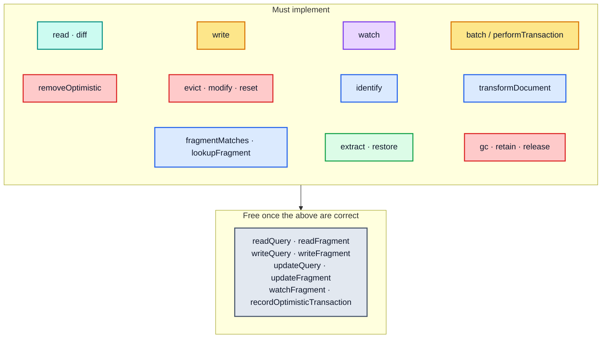

# Part 9 — Invariants and a re-implementation checklist

[Documentation](../README.md) › [Architecture guide](README.md) · [← Part 8](08-client-pipeline.md) · [Performance guide →](../performance/README.md)

This part is the specification distilled. If a re-implementation satisfies every invariant
here and passes `docs/probes/cache-behavior-probe.mjs`, it is behaviourally compatible with
`InMemoryCache` for the surface Apollo Client itself depends on.

## 9.1 The invariants

Each invariant names the part that derives it and the failure mode of violating it.

### Storage

| # | Invariant | Derived in | Violation shows up as |
| --- | --- | --- | --- |
| S1 | The store is a **flat** `Record<string, StoreObject>`; nesting exists only inside non-normalizable values. | [Part 2](02-normalized-store.md) | unbounded duplication; cross-query updates stop propagating |
| S2 | Every normalizable object is replaced by `{ __ref: id }` at its parent's field. Reference identity is the *string*, not the object. | [Part 2](02-normalized-store.md), [4.5](04-store-writer.md#45-identification-and-the-keyobject-back-channel) | `===` comparisons on `Reference` objects silently fail |
| S3 | A field's storage key is `getStoreFieldName(typename, fieldName, args, directives, keyArgs)`, not the field's response name. | [3.3](03-policies.md#33-field-identity-getstorefieldname) | two argument sets collide; aliases produce phantom fields |
| S4 | `ROOT_QUERY`, `ROOT_MUTATION`, `ROOT_SUBSCRIPTION` are ordinary entries plus a few special cases: always garbage-collection roots, always "existing" (`lookup` returns `{}`), `__typename` synthesised on read, exempt from the dangling-reference check, and `identify` maps a `Query`-typed object to `ROOT_QUERY`. | [2.2](02-normalized-store.md#22-reading-a-field-through-the-chain), [2.9](02-normalized-store.md#29-garbage-collection), [3.2](03-policies.md#32-entity-identity-policiesidentify), [5.3](05-store-reader.md#53-execselectionsetimpl) | roots get garbage-collected; reads of an empty cache report dangling references |
| S5 | `extract()` output round-trips through `restore()`: the entities, plus the *set* of `__META.extraRootIds` (sorted). Retain *counts* are not preserved; each extra root id is retained once. | [7.11](07-method-reference.md#711-extract), [7.12](07-method-reference.md#712-restore) | SSR hydration loses `retain` state |
| S6 | Writing a field to the value it already holds (`===` or deep-equal per `storeObjectReconciler`) must **not** dirty it. | [2.6](02-normalized-store.md#26-writes-merge-and-storeobjectreconciler) | broadcast storms; infinite render loops |

### Layers

| # | Invariant | Derived in | Violation shows up as |
| --- | --- | --- | --- |
| L1 | Layers form a singly-linked parent chain; lookup walks child→parent and stops at the first level that has the `dataId` (including a tombstone). | [2.1](02-normalized-store.md#21-the-layer-chain), [2.2](02-normalized-store.md#22-reading-a-field-through-the-chain) | optimistic data leaks into non-optimistic reads |
| L2 | `optimisticData` is **never** the `Root`: it is the `Stump` when no layer exists, and the top `Layer` otherwise. Optimistic and non-optimistic reads therefore never share memo entries. | [2.1](02-normalized-store.md#21-the-layer-chain) | optimistic readers from before the first layer are not invalidated by that layer's writes |
| L3 | The `Stump` is created in `init()` and is **never removable** (`Stump.removeLayer` returns `this`), so optimistic reads always have a stable `CacheGroup`. | [2.1](02-normalized-store.md#21-the-layer-chain) | optimistic dependencies get dropped when the last layer pops |
| L4 | Removing a layer **replays** every surviving layer above it, in order, and dirties the fields whose values change. | [2.10](02-normalized-store.md#210-layer-removal-and-replay) | rollback leaves stale optimistic values visible |
| L5 | The optimistic `CacheGroup` has the root group as its `parent`. `depend` chains upward (an optimistic read registers in both groups); `dirty` never chains. So a root write invalidates optimistic readers, and a layer write leaves non-optimistic readers alone. | [2.4](02-normalized-store.md#24-cachegroup--the-dependency-graph) | optimistic reads miss root writes, or root reads see optimistic invalidations |

### Dependency tracking and reactivity

| # | Invariant | Derived in | Violation shows up as |
| --- | --- | --- | --- |
| D1 | Every field *read* registers a dependency on `(dataId, storeFieldName)` in the reading group (and its parent group), plus the bare field name for fields with arguments. | [2.4](02-normalized-store.md#24-cachegroup--the-dependency-graph), [5.7](05-store-reader.md#57-what-a-read-leaves-behind) | reads go stale after a write |
| D2 | Every field *write that changed something* dirties `(dataId, storeFieldName)` in the **writing group only**, plus the bare field name when the field has arguments and no key function. | [2.4](02-normalized-store.md#24-cachegroup--the-dependency-graph), [2.6](02-normalized-store.md#26-writes-merge-and-storeobjectreconciler) | over-invalidation of non-optimistic readers, or stale readers of argument variants |
| D3 | Deleting an entity dirties each deleted field and then `(dataId, "__exists")`, with `forget`. | [2.7](02-normalized-store.md#27-modify--user-controlled-field-surgery), [2.8](02-normalized-store.md#28-evict--deletion-across-the-layer-chain) | dangling-reference reads keep returning cached results |
| D4 | `broadcastWatches` is a no-op while `txCount > 0`; the count is decremented in a `finally`. | [6.3](06-reactivity.md#63-txcount--broadcast-batching), [6.4](06-reactivity.md#64-batch--the-transactional-api) | a throwing `update` function permanently silences the cache |
| D5 | A watch callback fires only when the new diff is **not** `equal` to `watch.lastDiff` — unless `lastDiff` was cleared. | [6.2](06-reactivity.md#62-broadcastwatch-and-the-equality-gate) | either missed updates or infinite loops, depending on direction |
| D6 | `watch({ immediate: true })` fires the callback synchronously during `watch()`, before returning the unsubscribe function. | [6.1](06-reactivity.md#61-watch), [7.6](07-method-reference.md#76-watch) | first render misses data |
| D7 | `onWatchUpdated` returning `false` suppresses that watch's callback for this broadcast only. | [6.4](06-reactivity.md#64-batch--the-transactional-api), [8.6](08-client-pipeline.md#86-refetchqueries--the-batch-and-collect-protocol) | `refetchQueries`' skip semantics break |

### Reads

| # | Invariant | Derived in | Violation shows up as |
| --- | --- | --- | --- |
| R1 | Reads are memoized per `CacheGroup` on `(selectionSet, parent dataId or object, varString)`, and the memo is invalidated purely through the dependency graph. | [5.1](05-store-reader.md#51-the-two-memoized-functions) | quadratic re-reads, or stale reads |
| R2 | While the memo is warm, unchanged subtrees come back `===`-identical and only the changed path is new. This is what consumers comparing by reference rely on. (`resultCaching: false` and LRU eviction give it up; the equality gates still prevent spurious callbacks.) | [5.6](05-store-reader.md#56-immutability-and-knownresults), [5.7](05-store-reader.md#57-what-a-read-leaves-behind) | memoized components and selectors re-run on every broadcast |
| R3 | Results are deeply frozen under `__DEV__`. | [1.7](01-foundations.md#17-maybedeepfreeze--the-immutability-contract), [5.6](05-store-reader.md#56-immutability-and-knownresults) | accidental mutation corrupts the store |
| R4 | A dangling `Reference` inside a **list** is filtered out and the read stays `complete`; a dangling reference in a **singular** field makes the read incomplete with a `Dangling reference` `MissingFieldError`. | [5.4](05-store-reader.md#54-execsubselectedarrayimpl) | either spurious incompleteness or silently-missing list items |
| R5 | An incomplete read returns `null` when `returnPartialData` is `false` (the `read` default) and the partial tree otherwise (the `diff` default), or `null` if nothing at all was readable; `diff` always reports `complete` and `missing`. | [5.2](05-store-reader.md#52-diffqueryagainststore), [7.1](07-method-reference.md#71-read) | `read` and `diff` diverge |
| R6 | Every non-root result object carries `__typename`, even when the query did not select it. | [5.3](05-store-reader.md#53-execselectionsetimpl) | consumers that key on `__typename` break |

### Writes

| # | Invariant | Derived in | Violation shows up as |
| --- | --- | --- | --- |
| W1 | The write is two-phase: `processSelectionSet` stages `incomingById` without touching the store, then phase 2 merges it. A failure in phase 1 leaves the store untouched; phase 2 is not atomic (a throwing merge function leaves earlier entities written). | [4.1](04-store-writer.md#41-writetostore--the-driver) | a failed normalization leaves the store half-written |
| W2 | Every entity in one write is merged **once**, however many times it appears in the payload. | [4.1](04-store-writer.md#41-writetostore--the-driver), [4.7](04-store-writer.md#47-the-duplicate-guard-and-the-isfresh-short-circuit) | O(occurrences) merges; `merge` functions run repeatedly |
| W3 | `context.written` skips an entity already processed with the same `SelectionSetNode` (the first occurrence wins); the `isFresh` check skips staging (and so the phase-2 merge) for an entity object the reader handed out unchanged, after its fields have been traversed. | [4.7](04-store-writer.md#47-the-duplicate-guard-and-the-isfresh-short-circuit) | duplicate work, or a different winner for repeated entities |
| W4 | User `merge` functions run during `applyMerges`, after normalization, with `existing` read through the same store the write targets. | [4.6](04-store-writer.md#46-mergetree-and-applymerges) | pagination helpers see references they cannot resolve |
| W5 | `overwrite: true` suppresses `warnAboutDataLoss` and passes `existing: undefined` to custom merge functions (`merge: true`/`false` ignore it). | [3.5](03-policies.md#35-merge-functions), [8.3](08-client-pipeline.md#83-fetch-policies-as-a-cache-interaction-table) | refetches append instead of replacing |
| W6 | Writing to a `Layer` writes only to that layer; parent layers are never mutated. The `Stump` is the exception: it forwards writes to the `Root`. | [2.1](02-normalized-store.md#21-the-layer-chain) | optimistic writes become permanent |

### Policies

| # | Invariant | Derived in | Violation shows up as |
| --- | --- | --- | --- |
| P1 | `identify` returns `[id, keyObject?]`; a key function may return a falsy value to mean "not normalizable". | [3.2](03-policies.md#32-entity-identity-policiesidentify) | objects that should stay embedded get IDs |
| P2 | `keyFields` order is the **specifier's** order in the resulting id string; nested object values are key-sorted by `extractKeyPath`'s normalizer. | [3.2](03-policies.md#32-entity-identity-policiesidentify) | ids differ between writes of the same entity |
| P3 | `keyArgs`/`keyFields` are resolved through the type-policy inheritance chain (supertypes contribute, subtypes win). | [3.1](03-policies.md#31-lazy-materialisation-and-supertype-inheritance) | interface-level policies are ignored |
| P4 | `read` functions run inside `cacheSlot`, so reactive variables read there register a dependency. | [3.4](03-policies.md#34-readfield--the-field-read-entry-point), [6.6](06-reactivity.md#66-reactive-variables) | `makeVar` updates do not propagate |
| P5 | `fragmentMatches` matches an exact typename, then searches `possibleTypes` upwards. Only while writing, and only for `possibleTypes` entries that are patterns, does it fall back to fuzzy matching (development builds warn once per inferred pair). Without `possibleTypes`, a non-exact type condition never matches. | [3.6](03-policies.md#36-fragmentmatches--type-condition-resolution) | interface fragments silently never match |

## 9.2 Build order for a re-implementation

The dependency graph is strict: each stage builds only on the stages above it. Most stages
can be checked in isolation against the
[behaviour probe](../probes/cache-behavior-probe.mjs) sections listed in their box (the
section numbers the probe prints).

```mermaid
flowchart TB
    S1["<b>1. Primitives</b><br/>canonicalStringify · DeepMerger<br/>deep equality · maybeDeepFreeze<br/><i>probe 3, 15: canonical keys, immutability</i>"]:::store
    S2["<b>2. Dependency engine</b><br/>Entry graph · dep() · wrap()<br/>bounded LRU + Trie key maker"]:::memo
    S3["<b>3. EntityStore.Root</b><br/>flat map · merge · lookup<br/>CacheGroup depend/dirty<br/><i>probe 1, 2: normalization, identity</i>"]:::store
    S4["<b>4. Policies</b><br/>identify · getStoreFieldName<br/>readField · fragmentMatches<br/><i>probe 2, 3, 11, 12</i>"]:::api
    S5["<b>5. StoreWriter</b><br/>two-phase write · MergeTree<br/>merge functions<br/><i>probe 3, 10: field keys, merge functions</i>"]:::write
    S6["<b>6. StoreReader</b><br/>memoized executeSelectionSet<br/>missing tree · canRead filtering<br/><i>probe 4, 5, 13: result caching,<br/>diff, dangling references</i>"]:::read
    S7["<b>7. Watches + broadcast</b><br/>watch · maybeBroadcastWatch<br/>txCount batching<br/><i>probe 7: broadcast gating</i>"]:::memo
    S8["<b>8. Layers</b><br/>Stump · Layer · removeLayer replay<br/>batch optimistic modes<br/><i>probe 6: optimistic layers</i>"]:::dirty
    S9["<b>9. Lifecycle</b><br/>modify · evict · gc<br/>retain/release · extract/restore<br/><i>probe 8, 9, 13, 14</i>"]:::dirty
    S10["<b>10. Client integration</b><br/>transformDocument idempotence<br/>writable evict/modify/reset<br/>watcher/lastOwnDiff passthrough"]:::ext

    S1 --> S2 --> S3 --> S4 --> S5 --> S6 --> S7 --> S8 --> S9 --> S10

    classDef api fill:#dbeafe,stroke:#2563eb,stroke-width:2px,color:#0f172a
    classDef read fill:#ccfbf1,stroke:#0d9488,stroke-width:2px,color:#0f172a
    classDef write fill:#fde68a,stroke:#d97706,stroke-width:2px,color:#0f172a
    classDef store fill:#dcfce7,stroke:#16a34a,stroke-width:2px,color:#0f172a
    classDef memo fill:#e9d5ff,stroke:#7c3aed,stroke-width:2px,color:#0f172a
    classDef dirty fill:#fecaca,stroke:#dc2626,stroke-width:2px,color:#0f172a
    classDef ext fill:#e2e8f0,stroke:#475569,stroke-width:2px,color:#0f172a
```

Stage 2 is the one most often underestimated. For performance, **the memo graph is the
cache's change-detection mechanism**: invariants D1–D3 and R1–R2 are what let a broadcast
skip unaffected watches entirely and hand out `===`-stable subtrees. It is not needed for
*correctness*. `resultCaching: false` is a supported mode that disables it, and
`InMemoryCache` still behaves correctly: every broadcast recomputes every watch, and the
equality gates (`broadcastWatch`'s `equal`, then `ObservableQuery`'s own `equal`) keep
unchanged results from reaching subscribers. What a reader without the memo graph loses is
speed (the 5 000-entity warm read in the performance guide goes from microseconds to tens
of milliseconds) and reference stability for consumers that compare by `===`.

## 9.3 Cross-boundary requirements

A replacement cache that only satisfies Parts 2–7 will still misbehave inside Apollo Client
unless it also honours these:

| Requirement | Why | Part |
| --- | --- | --- |
| `transformDocument` must be idempotent **and** return `===`-stable documents | it is applied twice around user transforms; document identity keys every downstream memo | [8.1](08-client-pipeline.md#81-document-transforms--what-the-cache-sees-is-not-what-you-wrote) |
| `evict`, `modify` and `reset` must be instance-assignable | `QueryInfo` monkey-patches them to count destructive operations; the feud breaker depends on it | [8.4](08-client-pipeline.md#84-queryinfomarkqueryresult--the-write-path-and-the-feud-breaker) |
| `Cache.WatchOptions` must be passed through to `onWatchUpdated` **by reference**, preserving unknown extension fields | `watcher` and `lastOwnDiff` are set by client code on the same object | [8.2](08-client-pipeline.md#82-observablequery--the-caches-principal-client), [8.6](08-client-pipeline.md#86-refetchqueries--the-batch-and-collect-protocol) |
| The `diff` object handed to `onWatchUpdated` must be the **same object** later handed to `watch.callback` | gate 1 compares by reference | [8.2](08-client-pipeline.md#82-observablequery--the-caches-principal-client) |
| `batch` must call `onWatchUpdated` for every dirtied watch and respect a `false` return | `refetchQueries`' skip semantics | [8.6](08-client-pipeline.md#86-refetchqueries--the-batch-and-collect-protocol) |
| Optimistic and non-optimistic `diff` results must differ while an optimistic layer changes a query's data | `ObservableQuery.notify` compares the two to avoid network requests during an optimistic update. (`fromOptimisticTransaction` is set by `InMemoryCache` but read by nothing in Apollo Client 4.2.11.) | [7.2](07-method-reference.md#72-diff), [8.7](08-client-pipeline.md#87-broadcast--notify--reobserve) |
| `assumeImmutableResults` should be `true`, and honestly so | `ApolloClient` defaults its own option to it; nothing in `src/` branches on it, so it is a declaration to application code | [7.18](07-method-reference.md#718-what-inmemorycache-deliberately-does-not-implement) |
| `getMemoryInternals` is optional | absent → the dev tool reports fewer sections, nothing breaks | [8.11](08-client-pipeline.md#811-memory-internals--the-caches-own-telemetry) |

## 9.4 The minimum viable surface

For a cache that only needs to work with `ApolloClient` (not with third-party code reaching
into `cache.policies`), implementing these eleven groups of methods is sufficient; the
remaining `ApolloCache` surface is inherited or optional. The client itself calls
everything in the first ten groups; `gc`, `retain` and `release` are called only by
application code.

`resolvesClientField` is genuinely optional (it degrades local-state handling of `@client`
fields backed by cache `read` functions), and `gc`/`retain`/`release` are never called by
the client itself — only by application code — but omitting them turns the cache into an
unbounded leak for any application that evicts.

## 9.5 Where to look when something is wrong

| Symptom | First suspect | Part |
| --- | --- | --- |
| Component re-renders on every unrelated write | the result really changes each time (for example a `read` function whose value is not stable), `@client @export` or forced resolvers (they clear `watch.lastDiff`, [§8.2](08-client-pipeline.md#82-observablequery--the-caches-principal-client)), or a consumer comparing by `===` after memo entries were lost (R2) | [5.6](05-store-reader.md#56-immutability-and-knownresults), [6.2](06-reactivity.md#62-broadcastwatch-and-the-equality-gate), [8.2](08-client-pipeline.md#82-observablequery--the-caches-principal-client) |
| Update written but component never re-renders | dependency not registered (D1), or `txCount` leak (D4) | [2.4](02-normalized-store.md#24-cachegroup--the-dependency-graph), [6.3](06-reactivity.md#63-txcount--broadcast-batching) |
| "Cache data may be lost" warning | field returned a non-normalized object where one was previously stored | [4.8](04-store-writer.md#48-warnaboutdataloss) |
| Read comes back partial after a successful write | a `read`/`merge` function dropped a field — see `warnAboutPartialCacheResult` | [8.4](08-client-pipeline.md#84-queryinfomarkqueryresult--the-write-path-and-the-feud-breaker) |
| Optimistic update never rolls back | layer replay (L4) or `removeOptimistic` id mismatch | [2.10](02-normalized-store.md#210-layer-removal-and-replay), [8.5](08-client-pipeline.md#85-mutations--optimistic-layer-final-write-root-field-scrub) |
| Two queries fight, network request loop | feud breaker disabled — check that `evict`/`modify`/`reset` are patchable | [8.4](08-client-pipeline.md#84-queryinfomarkqueryresult--the-write-path-and-the-feud-breaker) |
| List grows on refetch instead of replacing | `refetchWritePolicy` / `overwrite` not threaded to the writer | [8.3](08-client-pipeline.md#83-fetch-policies-as-a-cache-interaction-table) |
| Entity duplicated under two ids | `keyFields` ordering (P2) or a missing `__typename` | [3.2](03-policies.md#32-entity-identity-policiesidentify) |
| `makeVar` update ignored | `read` function not invoked inside `cacheSlot` (P4) | [3.4](03-policies.md#34-readfield--the-field-read-entry-point), [6.6](06-reactivity.md#66-reactive-variables) |
| Data disappears after `gc()` | missing `retain`, or `__META.extraRootIds` lost on restore (S5) | [2.9](02-normalized-store.md#29-garbage-collection), [7.12](07-method-reference.md#712-restore) |

<!-- nav:bottom -->

---

| ← Previous | Up | Next → |
| :-- | :-: | --: |
| [Part 8 — The cache in the Apollo Client pipeline](08-client-pipeline.md) | [Architecture guide](README.md) | [Performance guide](../performance/README.md) |
