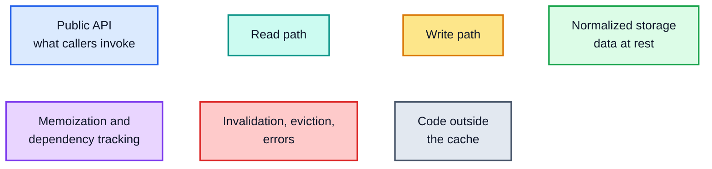

# Apollo Client `InMemoryCache` — Architecture Deep Dive

[Documentation home](../README.md) › Architecture

> **Source of truth.** Everything in this guide is derived from the `apollo-client-sm`
> submodule, pinned at `ba511be` (`@apollo/client@4.2.11`). Paths are relative to
> `apollo-client-sm/src/`. Snippets preserve the source semantics exactly, but are
> lightly condensed for reading: multi-line call signatures are re-wrapped, non-essential
> type annotations and casts are dropped, and omitted bodies are marked with `// ...`.
> Read the cited file when you need the exact text.
>
> **Companion material.** The [performance guide](../performance/README.md) covers the cost
> model of every path described here.
> [`probes/cache-behavior-probe.mjs`](../probes/cache-behavior-probe.mjs) is an executable
> oracle: 78 assertions that pin the observable behaviour documented in this guide. Run it
> from the repository root with
> `node --conditions=development docs/probes/cache-behavior-probe.mjs`.

## How to read this guide

The chapters are **topologically ordered**: nothing is explained before its dependencies.
Section numbers such as §2.4 refer to this guide; they are links wherever they appear.

| Part | Chapter | Contents | Depends on |
| --- | --- | --- | --- |
| 0 | [Orientation](00-orientation.md) | Mental model, file map, vocabulary | — |
| 1 | [Foundations](01-foundations.md) | `optimism`, `Trie`, LRU caches, `@wry/equality`, `DeepMerger`, `canonicalStringify`, `maybeDeepFreeze` | — |
| 2 | [The normalized store](02-normalized-store.md) | `EntityStore`, `Root`/`Stump`/`Layer`, `CacheGroup` | 1 |
| 3 | [`Policies`](03-policies.md) | Identity, field keys, read/merge functions, `fragmentMatches` | 1, 2 |
| 4 | [`StoreWriter`](04-store-writer.md) | The write path | 1, 2, 3 |
| 5 | [`StoreReader`](05-store-reader.md) | The read path | 1, 2, 3 |
| 6 | [Reactivity](06-reactivity.md) | Watches, broadcast, transactions, optimistic layers, reactive variables | 2, 4, 5 |
| 7 | [Method-by-method reference](07-method-reference.md) | Every `ApolloCache` method as implemented by `InMemoryCache` | 2–6 |
| 8 | [The cache in the Apollo Client pipeline](08-client-pipeline.md) | Who calls the cache, when, and why | 7 |
| 9 | [Invariants and a re-implementation checklist](09-invariants-and-checklist.md) | The specification, distilled | all |

## Diagram legend

Every diagram uses one palette. Learn it once:

Arrow conventions: a **solid arrow** is a synchronous call or a data hand-off; a
**dotted arrow** is a dependency registration or an invalidation signal. Diagrams that
are too dense to label every edge put the details in a table next to them.

**Start here:** [Part 0 — Orientation](00-orientation.md)
