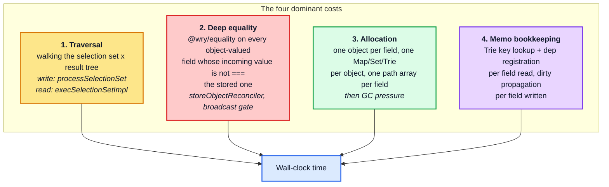
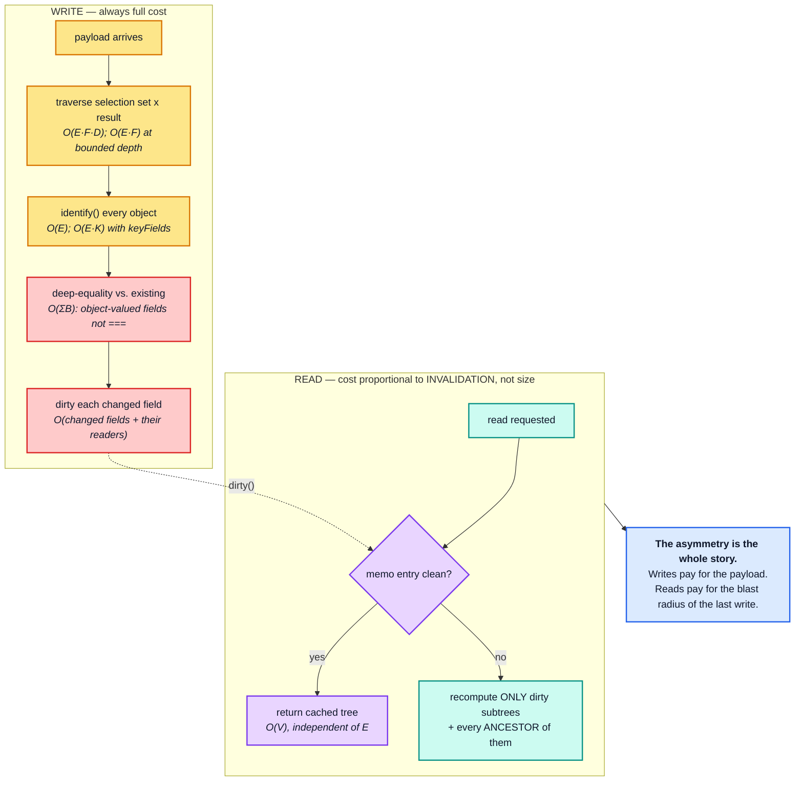

# Part 1 — The cost model in one page

[Documentation](../README.md) › [Performance guide](README.md) · [← Performance guide](README.md) · [Part 2 →](02-write-path.md)

## 1.1 The four costs that matter

Almost all `InMemoryCache` time is one of four things. Everything else is noise.

The single most important structural fact:

> **Reads are memoized per subtree; writes are not memoized.**
>
> A warm read of a 5 000-entity list costs microseconds. A write of the same
> data — even a byte-for-byte identical one — costs tens of milliseconds. For a fresh
> payload, such as a network response, there is no "nothing changed" fast path, because the
> writer cannot know nothing changed until it has normalized the payload and compared every
> field. (The one shortcut, `isFresh`, applies only to entity objects that are the very
> objects the reader handed out — the `readQuery` → edit → `writeQuery` pattern — and
> even then it skips the merge into the store, not the traversal:
> [architecture §4.7](../architecture/04-store-writer.md#47-the-duplicate-guard-and-the-isfresh-short-circuit).)

## 1.2 Headline complexity table

Symbols are defined in the [notation table](README.md#conventions): `E` objects, `F`
fields per object, `D` depth, `N` list length, `S` store entries, `W` watches, `L`
optimistic layers, `B` value size, `A` argument size, `V` variables size, `K` key-field
reads.
A few rows need a symbol of their own; those are defined under the table.

| Operation | Complexity | Memoized? | Dominant term |
| --- | --- | --- | --- |
| `write` (entities are new) | `O(V + E · F · D)`; `O(V + E · F)` when depth is bounded. Add `O(A)` per field with arguments and `O(K)` per object with `keyFields` | no | traversal + `identify` + allocation + dirtying every field |
| `write` (overwrite, identical payload) | the same, plus `O(ΣB)` | no | `storeObjectReconciler` → `equal()` |
| `read` / `diff` (cold) | `O(V + E · F)` from the root store; up to `O(V + E · F · L)` through `L` layers. Add `O(A)` per field with arguments | — | traversal + one `depend` per field + `mergeDeepArray` |
| `read` / `diff` (warm, nothing dirty) | `O(V)` — independent of `E` | **yes** | serializing the variables + one `Trie` lookup |
| `read` after `k` dirty entities | `O(k · F)` plus every ancestor entry: `O(N)` for a list ancestor near the root, `O(D²)` for a chain of `D` ancestors ([§3.3](03-read-path.md#33-invalidation-blast-radius--the-single-most-important-read-path-concept)) | partial | recompute the invalidated entries and every ancestor |
| `broadcast` (nothing relevant dirty) | `O(W · V)` | yes | one memo-key build + `maybeBroadcastWatch` memo hit per watch |
| `broadcast` (relevant write, one shared document) | one re-read + `O(W · P)` | partial | one re-read, then one `equal(lastDiff.result, diff.result)` per watch |
| `broadcast` (relevant write, `W` distinct documents) | `W` re-reads + `O(W · P)` | no sharing | one re-read per document ([§4.5](04-dependency-graph-and-broadcast.md#45-memo-fragmentation-by-document-identity)) |
| `modify` (single id) | `O(F + ΣB)` on the root store; add `O(L)` with `optimistic: true` | — | one modifier call per field + `equal()` on the changed values + dirtying |
| `evict` (single id) | `O(F)`; with layers `O(L + F · L′)`, at worst `O(L · F)` | — | delete every field + dirtying |
| `gc()` | never less than `O(S)`: `O(S + R)` when every entity's reference memo is valid, `O(S · F)` right after a write that touched every entity; the store copy is made once per store in the chain, `O((L + 2) · S)` with layers | no | mark-and-sweep over the whole store |
| `extract()` | `O(S)`; `O((L + 2) · S)` for `extract(true)` with layers | no | `toObject` (a shallow copy of the entity map) + `__META` |
| `restore()` | `O(S · F)` | no | one merge per entity, no normalization; every field is walked for dirtying, and the snapshot objects are adopted by reference |
| `removeOptimistic` (top layer) | `O(L + e · L + B_ℓ)` | no | walk the chain, dirty the layer's fields |
| `removeOptimistic` (bottom of `L`) | the same, plus `L − 1` layer replays | no | **replay every layer above** |

Symbols used only in this table:

| Symbol | Meaning |
| --- | --- |
| `ΣB` | total size of the object-valued incoming field values (references, lists, embedded objects, JSON scalars) that are not `===` the stored ones. `equal()` walks each of them completely when they are equal, and stops at the first difference otherwise |
| `k` | entities with at least one dirtied field |
| `P` | the part of the new result that `equal()` has to walk: every container rebuilt by the re-read, with all of its keys. For one changed item in a list of `N` that is the root object, the list (`N` elements) and the item, so `P = O(N + F)` |
| `L′` | stores in the optimistic chain that hold the evicted entity (at most `L + 2`) |
| `R` | `{ __ref }` references held by the reachable entities |
| `e`, `B_ℓ` | entities in the removed layer, and the total size of their field values |

Two costs are deliberately left out of the rows. Every mutating call (`write`, `modify`,
`evict`, `removeOptimistic`, `batch`) ends with a broadcast unless it runs inside a
transaction; that cost is the `broadcast` rows. And every dirtied field costs one step
per memo entry that read it, plus the upward marking of those entries' ancestors
([§4.1](04-dependency-graph-and-broadcast.md#41-depend-and-dirty)). User `read`, `merge`
and modifier functions add whatever they themselves cost.

## 1.3 Measured: the shape of the curves

One list of `n` normalized entities, six scalar fields each, measured end to end:

| `n` | write cold | write identical payload | read cold | read warm | read after 1 dirty field |
| --- | --- | --- | --- | --- | --- |
| 100 | 1.50 ms | 796 µs | 1.56 ms | **2.9 µs** | 187 µs |
| 1 000 | 8.79 ms | 7.75 ms | 15.70 ms | **2.5 µs** | 1.66 ms |
| 5 000 | 44.00 ms | 39.65 ms | 78.63 ms | **2.7 µs** | 8.87 ms |
| 20 000 | 182.46 ms | 164.33 ms | 333.45 ms | **2.5 µs** | 45.08 ms |

Three readings, in descending order of importance:

1. **The warm-read column is flat.** 2.5–2.9 µs whether the list holds 100 entities or
   20 000. That is the memo graph doing its job, and it is why the read path rarely shows
   up in a profile of a healthy application.
2. **Writing a byte-identical payload costs 90 % of a cold write** — 164 ms against 182 ms
   at `n = 20 000`. Polling an unchanged response is almost as expensive as receiving a new
   one.
3. **One dirty field costs 7–9.5× less than a cold read but still scales linearly.** 45 ms
   to re-read a 20 000-entity list after a single field changed. Memoization improves the
   constant here, not the exponent ([§3.3](03-read-path.md#33-invalidation-blast-radius--the-single-most-important-read-path-concept)).

> **Reading the `scale` column** in the tables that follow: it is the growth factor
> between two adjacent rows divided by their size ratio. `1.00n` is linear at any step. A
> constant cost shows up as `1/ratio` (`0.10n` for a 10× step, `0.25n` for 4×, `0.50n` for
> 2×), and a quadratic cost as the ratio itself (`10n` for a 10× step, `4n` for 4×, `2n`
> for 2×), so always read it together with the step size. It is the number to trust:
> absolute timings vary by machine, growth rates do not. (The steps used by the probe
> are 10×, 5× and 4× for most tables, and 2× for the last depth row.)

## 1.4 The one diagram to remember

<!-- nav:bottom -->

---

| ← Previous | Up | Next → |
| :-- | :-: | --: |
| [Performance guide](README.md) | [Performance guide](README.md) | [Part 2 — The write path](02-write-path.md) |
