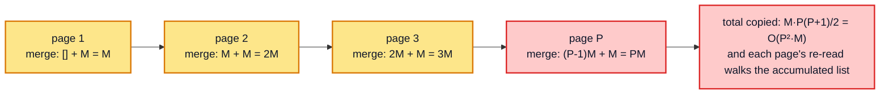

# Part 2 — The write path

[Documentation](../README.md) › [Performance guide](README.md) · [← Part 1](01-cost-model.md) · [Part 3 →](03-read-path.md)

## 2.1 Where the time goes

`StoreWriter.writeToStore` ([architecture §4.1](../architecture/04-store-writer.md#41-writetostore--the-driver)) is two phases. Phase 1 is pure computation over the
payload; phase 2 touches the store.

```mermaid
flowchart TB
    START["writeToStore(store, { query, result, dataId, variables })"]:::api

    subgraph phase1["Phase 1 — staging (no store mutation)"]
        direction TB
        P1A["canonicalStringify(variables) → varString<br/><i>once per write, O(V)</i>"]:::memo
        P1B["processSelectionSet — recursive, once per object occurrence<br/><b>per object:</b> new Set, new Map, new Trie<br/><b>per field:</b> new path array (length D), getStoreFieldName,<br/>getChildMergeTree, getMergeFunction, DeepMerger.merge"]:::write
        P1C["policies.identify(result) per object occurrence<br/><i>default id: a string concat;<br/>keyFields: K key paths + JSON.stringify</i>"]:::write
        P1D["duplicate guard + isFresh, then<br/>context.incomingById: Map#lt;dataId, staged#gt;<br/><i>duplicates collapse here, after their<br/>fields were already processed</i>"]:::store
        P1A --> P1B --> P1C --> P1D
    end

    subgraph phase2["Phase 2 — effectful merge"]
        direction TB
        P2A["for each staged entity (distinct dataId):<br/>applyMerges (user merge functions)"]:::write
        P2B["__DEV__ only: warnAboutDataLoss<br/><i>per field with a selection set</i>"]:::dirty
        P2C["store.merge(dataId, storeObject)<br/><b>new DeepMerger per entity</b><br/><b>equal() per object-valued field<br/>that is not === the stored value</b>"]:::dirty
        P2D["group.dirty(dataId, storeFieldName)<br/>per field that actually changed"]:::memo
        P2A --> P2B --> P2C --> P2D
    end

    START --> phase1 --> phase2 --> BC["broadcastWatches() unless txCount #gt; 0"]:::memo

    classDef api fill:#dbeafe,stroke:#2563eb,stroke-width:2px,color:#0f172a
    classDef write fill:#fde68a,stroke:#d97706,stroke-width:2px,color:#0f172a
    classDef store fill:#dcfce7,stroke:#16a34a,stroke-width:2px,color:#0f172a
    classDef memo fill:#e9d5ff,stroke:#7c3aed,stroke-width:2px,color:#0f172a
    classDef dirty fill:#fecaca,stroke:#dc2626,stroke-width:2px,color:#0f172a
```



Phase 1 is proportional to the **payload**, not to the number of distinct entities. The
duplicate guard (`context.written`, [architecture §4.7](../architecture/04-store-writer.md#47-the-duplicate-guard-and-the-isfresh-short-circuit))
and the `isFresh` check run at the *end* of `processSelectionSet`, after the object's fields
have been processed and every child object has been recursed into. An entity that appears
three times in a payload is traversed and identified three times and staged once; the
probe counts this in its section 1 (three occurrences of an entity with one child: six
`identify` calls). Phase 2 is proportional to the distinct entities staged.

## 2.2 The per-entity and per-field allocation budget

This is the part most people underestimate. Reading `processSelectionSet` allocation by
allocation:

```ts
private processSelectionSet({ dataId, result, selectionSet, context, mergeTree, path }) {
  let incoming: StoreObject = {};                    // 1 object per object
  // ...
  const fieldNodeSet = new Set<FieldNode>();          // 1 Set per object

  this.flattenFields(selectionSet, result, context, typename)  // 1 Map + 1 Trie per object
    .forEach((context, field) => {
      const path = [...currentPath, field.name.value];          // 1 array of length D per FIELD
      // ...
      const storeFieldName = policies.getStoreFieldName({...}); // string build; canonicalStringify if args
      const childTree = getChildMergeTree(mergeTree, storeFieldName);
      let incomingValue = this.processFieldValue(value, field, context, childTree, path);
      const merge = policies.getMergeFunction(typename, field.name.value, childTypename);
      incoming = context.merge(incoming, { [storeFieldName]: incomingValue }); // 1 object per FIELD
    });
```

And inside `processFieldValue`, for a list:

```ts
if (isArray(value)) {
  return value.map((item, i) => {
    const value = this.processFieldValue(item, field, context, getChildMergeTree(mergeTree, i), [...path, i]);
    maybeRecycleChildMergeTree(mergeTree, i);
    return value;
  });
}
```

Per write of `E` objects with `F` fields each, at depth up to `D`:

| Allocation | Count | Note |
| --- | --- | --- |
| `incoming` store object | `2E` | the initial `{}`, plus the one copy the write's shared `DeepMerger` makes on the first field (see below) |
| `Set<FieldNode>` | `E` | |
| `Map<FieldNode, TContext>` (from `flattenFields`) | `E` | |
| `Trie` (`limitingTrie`) | `E` | fragment-revisit guard, discarded immediately |
| `readField` closure and `{ ...result, ...incoming }` | `E` each | the spread, made by `identify` for the key function, copies `O(F)` properties |
| single-key object `{ [storeFieldName]: value }` | `E · F` | fed to `DeepMerger` |
| `path` array of length ≤ `D` | `E · F`, plus one per list element | `[...currentPath, name]` per field, `[...path, i]` per list element |
| `MergeTree` node | up to `E · F`, plus one per list element | recycled via `maybeRecycleChildMergeTree` |
| `DeepMerger` for `store.merge` | one per distinct staged entity | phase 2 |

> **The `path` array is the sneaky one.** `[...currentPath, field.name.value]` copies the
> whole path at every field, so each field costs `O(D)` time and words, and a write costs
> `O(E · F · D)`. For a flat list the items sit at `D = 2` and the copy is negligible. For
> a chain of `D` nested entities, level `d` copies a path of length `d` for each of its
> `F` fields, so the chain costs `O(F · D²)` in total. The constant is tiny (copying
> pointers), so the quadratic term only becomes visible at depths of several hundred: see
> the `write normalized` column of the depth table in
> [§3.3](03-read-path.md#33-invalidation-blast-radius--the-single-most-important-read-path-concept).

The one thing that is *not* re-allocated: `context.merge` is a single
`makeProcessedFieldsMerger()` for the whole write, and `DeepMerger.shallowCopyForMerge`
tracks `pastCopies` in a `Set`, so a given `incoming` object is copied **once** and then
mutated in place for the remaining `F − 1` fields. Building an entity is `O(F)`, not
`O(F²)`.

```ts
public shallowCopyForMerge<T>(value: T): T {
  if (isNonNullObject(value)) {
    if (!this.pastCopies.has(value)) {
      value = Array.isArray(value) ? value.slice(0) : { __proto__: Object.getPrototypeOf(value), ...value };
      this.pastCopies.add(value);
    }
  }
  return value;
}
```

The trade-off is memory: `pastCopies` retains every intermediate object for the duration of
the write, so peak memory during a large write is proportional to the payload, not to the
delta.

## 2.3 The deep-equality tax

The line with the largest potential cost on the write path is in `entityStore.ts`:

```ts
function storeObjectReconciler(existingObject, incomingObject, property) {
  const existingValue = existingObject[property];
  const incomingValue = incomingObject[property];
  // Wherever there is a key collision, prefer the incoming value, unless
  // it is deeply equal to the existing value. It's worth checking deep
  // equality here (even though blindly returning incoming would be
  // logically correct) because preserving the referential identity of
  // existing data can prevent needless rereading and rerendering.
  return equal(existingValue, incomingValue) ? existingValue : incomingValue;
}
```

`equal` is `@wry/equality`'s cycle-tolerant deep comparison. `DeepMerger` calls the
reconciler for **every incoming field that the stored entity already has and whose value is
not `===` the stored one**. For data arriving fresh off the network, unchanged primitives
(strings, numbers, booleans) *are* `===`, so they are skipped before the reconciler is even
called. Every object-valued field is a fresh object, though: `Reference`s (the writer makes
a new `{ __ref }` object each time), lists, embedded objects, and JSON scalars all pay for
`equal()`.

It does *not* run when the entity is new: `EntityStore.merge` calls
`new DeepMerger(storeObjectReconciler).merge(existing, incoming)`, and with no `existing`
there is nothing to reconcile. That is why creating an entity and overwriting it with
identical data cost about the same ([§2.7](#27-measured-write-scaling)): a creation dirties
every field, an overwrite compares every field instead.

This is a deliberate trade: pay `O(B)` on the write to preserve referential identity, so
the read path's memo entries stay valid and React does not re-render. The comment says so
explicitly. `equal()` walks the whole value when the two values are equal and stops at the
first difference when they are not, so the costs below are for the *unchanged* case, the
one that polling produces:

| Field value shape | Equality cost when unchanged |
| --- | --- |
| scalar (`string`, `number`, `boolean`) | never reaches `equal()` — it is `===` |
| `Reference` (`{ __ref }`) | `O(1)` — one key |
| array of `Reference` of length `N` | `O(N)` (`O(1)` when the lengths differ) |
| **embedded object blob of size `B`** | `O(B)` — full recursive walk |
| **array of embedded blobs**, total size `B` | `O(B)` |

> **Consequence.** A single large untyped JSON blob stored in one cache field is
> deep-compared *in its entirety* on every write that touches that field, even when the
> field is unchanged. This is the number-one cause of "why is writing my unchanged payload
> so slow" (see [§7.4](07-structural-stress.md#74-the-untyped-blob-pathology)).

## 2.4 Field-key construction

`getStoreFieldName` ([architecture §3.3](../architecture/03-policies.md#33-field-identity-getstorefieldname)) builds the storage key. Without arguments it is the field name;
with arguments it goes through `getStoreKeyName` → `canonicalStringify`.

It is worth being precise about what `canonicalStringify` memoizes, because it is easy to
assume more than it does:

```ts
// utilities/internal/canonicalStringify.ts
const keys = Object.keys(value);
if (keys.every(everyKeyInOrder)) return value;   // fast path: already sorted
const unsortedKey = JSON.stringify(keys);
let sortedKeys = sortingMap.get(unsortedKey);    // LRU of 1 000 KEY-SET PERMUTATIONS
```

The LRU maps a **key-set permutation** (`'["type","limit"]'`) to the sorted array of those
same keys. It does **not** memoize the serialized output. So:

- the full `JSON.stringify` walk runs on **every** call — `O(A)` for arguments of size
  `A`, always;
- what is saved is `keys.sort()`, and only for objects whose keys were not already in
  order. The per-object `Object.keys`, the order check and, for an unsorted object, the
  `JSON.stringify(keys)` lookup key and a re-ordered copy of the object still happen on
  every call;
- the LRU is bounded by the number of distinct object **shapes** in the app, not by the
  number of distinct argument *values*, so it rarely fills up. Fresh variable objects on
  every render cost nothing extra here. (`cache.gc()` empties it.)

There is no memoization one level up either: `Policies.getStoreFieldName` is called
per field per object on both the read and the write path (on the read path, once per
field of every memo entry that recomputes) and rebuilds the key every time. Argument cost
is therefore `O(A)` per field occurrence: it scales with the *size of the argument
structure*, not with how many distinct values it takes. Separately, every `write`,
`read` and `diff` serializes the whole `variables` object once into `varString`, the
memo-key component: `O(V)` per call.

The probe writes one root field whose single argument is an object nested `d` levels
deep (each level has three keys, so `A` grows linearly with `d`), over a one-item result:

| `d` | write, same `variables` object | scale | write, **fresh** `variables` object each call | scale |
| --- | --- | --- | --- | --- |
| 1 | 33.6 µs | — | 34.9 µs | — |
| 8 | 43.0 µs | 0.16 | 44.5 µs | 0.16 |
| 32 | 79.9 µs | 0.46 | 80.6 µs | 0.45 |
| 128 | 247.6 µs | 0.77 | 245.0 µs | 0.76 |

The two columns agree within the run-to-run noise, which is the direct confirmation that
nothing is memoized per *value* — reusing the same `variables` object buys nothing. Cost
tracks the size of the argument structure: the `scale` column rises towards `1.00` as the
argument grows and the fixed cost of the one-item write stops dominating.

Argument **count** looks free in the probe, but only because of where the arguments sit:
0, 2, 8 and 24 arguments on the one root field over a 50-item result write in 912.2 µs,
612.0 µs, 588.7 µs and 511.7 µs. The times do not grow with the count: the first row is
the section's first measurement and carries its warm-up, and the others fall as the
process warms. That is because the one key is built a constant number of times per
operation and the 50-item traversal dominates. Count is part of `A`: the same 24 arguments
on a field selected on every list item would be paid once per item.

The resulting key is the fully serialized, key-sorted form, which is also what makes
`feed(type: "top", limit: 10)` and `feed(limit: 10, type: "top")` collide correctly:

```
search({"filter":{"a":2,"nested":{"a":2,"nested":{"a":2,"m":3,"z":1},"z":1},"z":1}})
```

## 2.5 Identity extraction

Every object with a selection set pays `policies.identify` on write. The probe writes
2 000 books, each with an `id`, an `isbn`, a `title` and two embedded objects (`author`,
`published`), under five configurations. Every normalizing row stores the same 2 001
entries, so the rows differ only in how the id is computed (`K` is the number of
key-field reads per book):

| `keyFields` configuration | `K` | store entries | write | vs. default | rewrite, identical payload | vs. default |
| --- | --- | --- | --- | --- | --- | --- |
| default (`__typename` + `id`) | — | 2 001 | 59.44 ms | 1.00× | 61.12 ms | 1.00× |
| `["isbn"]` | 1 | 2 001 | 64.47 ms | 1.08× | 66.24 ms | 1.08× |
| `["isbn", "title"]` | 2 | 2 001 | 68.47 ms | 1.15× | 69.66 ms | 1.14× |
| `["isbn", "author", ["name"]]` (nested path) | 3 | 2 001 | 73.24 ms | 1.23× | 73.18 ms | 1.20× |
| `false` (books stay embedded) | — | 1 | 48.71 ms | 0.82× | 53.14 ms | 0.87× |

The ranking follows directly from `key-extractor.ts`, and each normalizing row costs
`O(K)` per object on top of the same traversal:

- **default `__typename` + `id`** — `defaultDataIdFromObject` reads two properties,
  concatenates a string, and records `{ id }` as the key object. Nothing else in the cache
  is this cheap, which is the practical argument for just having an `id`.
- **`keyFields: ["isbn"]`** — the specifier is compiled once (cached by its JSON), but per
  object the compiled function runs `collectSpecifierPaths` (a fresh `DeepMerger`),
  extracts every key path through `context.readField` (the full `Policies.readField`
  machinery, once per step of each path), `normalize`s the value (a no-op for a scalar),
  and `JSON.stringify`s the key object. Each extra key-field read adds to the cost, as
  the `["isbn", "title"]` row shows.
- **nested path (`["isbn", "author", ["name"]]`)** — `["author", ["name"]]` is one path of
  two steps: `readField("author")` on the book, then `readField("name")` on the embedded
  author. Only the extracted scalar goes into the key; the author object is not
  serialized.
- **`keyFields: false`** — `identify` still runs, but its key function returns `undefined`
  immediately. The books then stay *embedded* in `ROOT_QUERY.books`, so the write skips
  per-book staging, `store.merge` and references, which is why it is the cheapest row.
  The cost moves into the parent field: every rewrite runs one `equal()` over the whole
  list ([§2.3](#23-the-deep-equality-tax)). For this shape that is still cheaper than
  re-staging 2 000 entities, but it grows with the list and invalidates the whole field
  when anything in it changes ([§7.3](07-structural-stress.md#73-typed-normalized-versus-untyped-embedded-data)).

## 2.6 Merge functions

`applyMerges` ([architecture §4.6](../architecture/04-store-writer.md#46-mergetree-and-applymerges)) walks the `MergeTree` after normalization. A user `merge` function
turns a field into a black box for the writer:

| Consequence | Why |
| --- | --- |
| the field's existing value is read back from the store | `existing` must be materialized before the call |
| the writer cannot skip the field | `merge` may produce anything |
| `equal()` still runs on the result | `store.merge` reconciles the merge function's output with the stored value |
| pagination helpers copy the whole list | `[...existing, ...incoming]` is `O(N)` per page |

A `merge` on a list field turns each incremental page write from `O(page)` into
`O(accumulated list)`. Loading `P` pages of `M` items each copies `M · P(P + 1) / 2` items,
`O(P² · M)` in total. That is usually acceptable (`P` is small), but it is the reason
infinite scroll degrades. The `equal()` that `store.merge` runs on the merged list is cheap
while the list grows: two arrays of different lengths are unequal after one length check.
It walks the whole list only when a write leaves the length unchanged, such as a refetch of
a page that is already loaded. The read side grows the same way: every page dirties the
list field, so each watcher of it re-reads the accumulated list, `O(i · M)` for page `i`
([§3.3](03-read-path.md#33-invalidation-blast-radius--the-single-most-important-read-path-concept)).



## 2.7 Measured: write scaling

`writeQuery` into a list of `N` normalized entities (`F = 8` fields each):

| `N` | cold | scale | identical payload | scale | one field changed | scale |
| --- | --- | --- | --- | --- | --- | --- |
| 100 | 1.95 ms | — | 1.42 ms | — | 1.34 ms | — |
| 1 000 | 15.99 ms | 0.82 | 13.86 ms | 0.97 | 13.83 ms | 1.04 |
| 5 000 | 83.41 ms | 1.04 | 75.95 ms | 1.10 | 72.18 ms | 1.04 |
| 20 000 | 349.28 ms | 1.05 | 322.07 ms | 1.06 | 317.53 ms | 1.10 |

Writes are **linear in `N` and insensitive to what actually changed**. The three columns
stay close at every size, because the traversal, the `identify` calls, the per-field
allocations and the store merge all happen regardless — dirtying fields is the only part
a no-op write avoids.

> For a fresh payload there is no "nothing changed" fast path: the writer only learns that
> the payload is unchanged by normalizing it and comparing field by field. (The `isFresh`
> shortcut only applies to objects the reader itself handed out, and it skips the merge,
> not the traversal.) This is the single most useful fact for reasoning about polling and
> subscription workloads.

The `N = 100` cold cell is the first measurement in its process, so the probe
re-measures the same kind of write later in the same process:

| write of 100 entities | time |
| --- | --- |
| cold `N = 100`, as measured first in the table above | 1.95 ms |
| the same write, re-measured into a **brand-new** cache | 1.53 ms |
| into a primed but **empty** cache | 1.57 ms |
| overwriting 100 **existing** entities | 1.44 ms |

Two effects can inflate that cell, neither of them per-entity work. The first is **JIT**:
the table's cold `N = 100` is the first measurement the process makes, and re-measuring
the same write later costs 22 % less. The second would be **one-time per-cache setup** —
transforming the document, materializing type policies, allocating a fresh
`StoreReader`/`StoreWriter` — which is what separates a brand-new cache from a primed one.
In this run it is not visible: the primed write (1.57 ms) is no faster than the brand-new
one (1.53 ms), so at this size the setup cost is within the run-to-run noise.

Creating entities and overwriting them cost about the same: 1.57 ms against 1.44 ms for
100 entities, overwriting being 8 % cheaper in this run (and 8 % cheaper at `N = 20 000`
in the scaling table above, where the cold column also pays the per-cache setup):

> **Creating `N` entities costs roughly what overwriting `N` identical ones costs.** A
> creation dirties every field; an overwrite compares every incoming field with the stored
> one instead (and runs `equal()` on the object-valued ones). Per-entity write cost
> depends little on whether the entity already existed.

<!-- nav:bottom -->

---

| ← Previous | Up | Next → |
| :-- | :-: | --: |
| [Part 1 — The cost model in one page](01-cost-model.md) | [Performance guide](README.md) | [Part 3 — The read path](03-read-path.md) |
