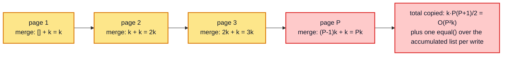

# Part 2 — The write path

[Documentation](../README.md) › [Performance guide](README.md) · [← Part 1](01-cost-model.md) · [Part 3 →](03-read-path.md)

## 2.1 Where the time goes

`StoreWriter.writeToStore` ([architecture §4.1](../architecture/04-store-writer.md#41-writetostore--the-driver)) is two phases. Phase 1 is pure computation over the
payload; phase 2 touches the store.

```mermaid
flowchart TB
    START["writeToStore(store, { query, result, dataId, variables })"]:::api

    subgraph phase1["Phase 1 — staging (no store mutation)"]
        direction TB
        P1A["canonicalStringify(variables) → varString<br/><i>once per write</i>"]:::memo
        P1B["processSelectionSet — recursive<br/><b>per entity:</b> new Set, new Map, new Trie<br/><b>per field:</b> new path array, getStoreFieldName,<br/>getChildMergeTree, getMergeFunction, DeepMerger.merge"]:::write
        P1C["policies.identify(result) per object<br/><i>default id: a string concat;<br/>keyFields: key extraction + JSON.stringify</i>"]:::write
        P1D["context.incomingById: Map#lt;dataId, staged#gt;<br/><i>duplicate entities collapse here</i>"]:::store
        P1A --> P1B --> P1C --> P1D
    end

    subgraph phase2["Phase 2 — effectful merge"]
        direction TB
        P2A["for each staged entity:<br/>applyMerges (user merge functions)"]:::write
        P2B["__DEV__ only: warnAboutDataLoss<br/><i>per field with a selection set</i>"]:::dirty
        P2C["store.merge(dataId, storeObject)<br/><b>new DeepMerger per entity</b><br/><b>equal() per changed field</b>"]:::dirty
        P2D["group.dirty(dataId, storeFieldName)<br/>per field that actually changed"]:::memo
        P2A --> P2B --> P2C --> P2D
    end

    START --> phase1 --> phase2 --> BC["broadcastWatches() unless txCount #gt; 0"]:::memo

    classDef api fill:#dbeafe,stroke:#2563eb,stroke-width:2px,color:#0f172a
    classDef write fill:#fde68a,stroke:#d97706,stroke-width:2px,color:#0f172a
    classDef store fill:#dcfce7,stroke:#16a34a,stroke-width:2px,color:#0f172a
    classDef memo fill:#e9d5ff,stroke:#7c3aed,stroke-width:2px,color:#0f172a
    classDef dirty fill:#fecaca,stroke:#dc2626,stroke-width:2px,color:#0f172a
```



## 2.2 The per-entity and per-field allocation budget

This is the part most people underestimate. Reading `processSelectionSet` allocation by
allocation:

```ts
private processSelectionSet({ dataId, result, selectionSet, context, mergeTree, path }) {
  let incoming: StoreObject = {};                    // 1 object per entity
  // ...
  const fieldNodeSet = new Set<FieldNode>();          // 1 Set per entity

  this.flattenFields(selectionSet, result, context, typename)  // 1 Map + 1 Trie per entity
    .forEach((context, field) => {
      const path = [...currentPath, field.name.value];          // 1 array of length D per FIELD
      // ...
      const storeFieldName = policies.getStoreFieldName({...}); // string build; canonicalStringify if args
      const childTree = getChildMergeTree(mergeTree, storeFieldName);
      let incomingValue = this.processFieldValue(value, field, context, childTree, path);
      const merge = policies.getMergeFunction(typename, field.name.value, childTypename);
      incoming = context.merge(incoming, { [storeFieldName]: incomingValue }); // 1 object per FIELD
    });
```

And inside `processFieldValue`, for a list:

```ts
if (isArray(value)) {
  return value.map((item, i) => {
    const value = this.processFieldValue(item, field, context, getChildMergeTree(mergeTree, i), [...path, i]);
    maybeRecycleChildMergeTree(mergeTree, i);
    return value;
  });
}
```

Per write of `E` entities with `F` fields each, at depth `D`, containing lists of total
length `N`:

| Allocation | Count | Note |
| --- | --- | --- |
| `incoming` store object | `E` | |
| `Set<FieldNode>` | `E` | |
| `Map<FieldNode, TContext>` (from `flattenFields`) | `E` | |
| `Trie` (`limitingTrie`) | `E` | fragment-revisit guard, discarded immediately |
| single-key object `{ [storeFieldName]: value }` | `E · F` | fed to `DeepMerger` |
| `path` array of length ≤ `D` | `E · F` + `N` | `[...currentPath, name]` and `[...path, i]` |
| `MergeTree` node | up to `E · F` | recycled via `maybeRecycleChildMergeTree` |
| `DeepMerger` for `store.merge` | `E` | one per entity, in phase 2 |

> **The `path` array is the sneaky one.** `[...currentPath, field.name.value]` copies the
> whole path at every field, so a selection set of depth `D` allocates
> `O(D)` words per field and `O(E · F · D)` words per write. Depth is therefore
> **quadratic-ish in allocation** even though the traversal itself is linear. Section 7.1
> measures this.

The one thing that is *not* re-allocated: `context.merge` is a single
`makeProcessedFieldsMerger()` for the whole write, and `DeepMerger.shallowCopyForMerge`
tracks `pastCopies` in a `Set`, so a given `incoming` object is copied **once** and then
mutated in place for the remaining `F − 1` fields. Building an entity is `O(F)`, not
`O(F²)`.

```ts
public shallowCopyForMerge<T>(value: T): T {
  if (isNonNullObject(value)) {
    if (!this.pastCopies.has(value)) {
      value = Array.isArray(value) ? value.slice(0) : { __proto__: Object.getPrototypeOf(value), ...value };
      this.pastCopies.add(value);
    }
  }
  return value;
}
```

The trade-off is memory: `pastCopies` retains every intermediate object for the duration of
the write, so peak memory during a large write is proportional to the payload, not to the
delta.

## 2.3 The deep-equality tax

The most expensive single line on the write path is in `entityStore.ts`:

```ts
function storeObjectReconciler(existingObject, incomingObject, property) {
  const existingValue = existingObject[property];
  const incomingValue = incomingObject[property];
  // Wherever there is a key collision, prefer the incoming value, unless
  // it is deeply equal to the existing value. It's worth checking deep
  // equality here (even though blindly returning incoming would be
  // logically correct) because preserving the referential identity of
  // existing data can prevent needless rereading and rerendering.
  return equal(existingValue, incomingValue) ? existingValue : incomingValue;
}
```

`equal` is `@wry/equality`'s cycle-tolerant deep comparison. It runs for **every field of
every entity whose incoming value is not `===` the stored value**. For data arriving fresh
off the network, unchanged primitives (strings, numbers, booleans) *are* `===`, so they are
skipped before the reconciler is even called. Every object-valued field is a fresh object,
though: `Reference`s, lists, embedded objects, and JSON scalars all pay for `equal()`.

It does *not* run when the entity is new: `EntityStore.merge` calls
`new DeepMerger(storeObjectReconciler).merge(existing, incoming)`, and with no `existing`
there is nothing to reconcile. That is why creating an entity and overwriting it with
identical data cost about the same ([§2.7](#27-measured-write-scaling)) — one pays for dirtying, the other for comparing.

This is a deliberate trade: pay `O(size of the field value)` on the write to preserve
referential identity, so the read path's memo entries stay valid and React does not
re-render. The comment says so explicitly. But it means:

| Field value shape | Equality cost |
| --- | --- |
| scalar (`string`, `number`) | `O(1)` |
| `Reference` (`{ __ref }`) | `O(1)` — one key |
| array of `Reference` of length `N` | `O(N)` |
| **embedded object blob of size `B`** | `O(B)` — full recursive walk |
| **array of embedded blobs**, total size `B` | `O(B)` |

> **Consequence.** A single large untyped JSON blob stored in one cache field is
> deep-compared *in its entirety* on every write that touches that field, even when the
> field is unchanged. This is the number-one cause of "why is writing my unchanged payload
> so slow" (see [§7.4](07-structural-stress.md#74-the-untyped-blob-pathology)).

## 2.4 Field-key construction

`getStoreFieldName` ([architecture §3.3](../architecture/03-policies.md#33-field-identity-getstorefieldname)) builds the storage key. Without arguments it is the field name;
with arguments it goes through `getStoreKeyName` → `canonicalStringify`.

It is worth being precise about what `canonicalStringify` memoizes, because it is easy to
assume more than it does:

```ts
// utilities/internal/canonicalStringify.ts
const keys = Object.keys(value);
if (keys.every(everyKeyInOrder)) return value;   // fast path: already sorted
const unsortedKey = JSON.stringify(keys);
let sortedKeys = sortingMap.get(unsortedKey);    // LRU of 1 000 KEY-SET PERMUTATIONS
```

The LRU maps a **key-set permutation** (`'["type","limit"]'`) to the sorted array of those
same keys. It does **not** memoize the serialized output. So:

- the full `JSON.stringify` walk runs on **every** call — `O(size of args)`, always;
- what is saved is the recursive `keys.sort()`, and only for objects whose keys were not
  already in order;
- the LRU is bounded by the number of distinct object **shapes** in the app, not by the
  number of distinct argument *values*, so it essentially never fills up. Fresh variable
  objects on every render cost nothing extra here.

There is no memoization one level up either: `Policies.getStoreFieldName` is called
per field per entity on both the read and the write path and rebuilds the key every time.
Argument cost is therefore paid per field occurrence, and it scales with the *size of the
argument structure*, not with how many distinct values it takes:

| argument nesting depth `d` | write, same `variables` object | write, **fresh** `variables` object each call |
| --- | --- | --- |
| 1 | 18.0 µs | 17.0 µs |
| 8 | 23.9 µs | 24.9 µs |
| 32 | 49.1 µs | 53.5 µs |
| 128 | 150.3 µs | 154.3 µs |

The two columns are identical within noise, which is the direct confirmation that nothing is
memoized per *value* — reusing the same `variables` object buys nothing. Cost tracks the
size of the argument structure, close to linearly.

Argument **count**, by contrast, vanishes into the noise as soon as there is a real result
to traverse: 0, 2, 8 and 24 arguments on a field over a 50-item result all write in
259–305 µs. Large or deep arguments cost; many shallow ones do not.

The resulting key is the fully serialized, key-sorted form, which is also what makes
`feed(type: "top", limit: 10)` and `feed(limit: 10, type: "top")` collide correctly:

```
search({"filter":{"a":2,"nested":{"a":2,"nested":{"a":2,"m":3,"z":1},"z":1},"z":1}})
```

## 2.5 Identity extraction

Every normalizable object pays `policies.identify` on write. Cost by configuration:

| `keyFields` configuration | write, 2 000 books | vs. default |
| --- | --- | --- |
| default (`__typename` + `id`) | 21.64 ms | 1.00× |
| `["isbn"]` | 27.94 ms | 1.29× |
| `["isbn", "title", "year"]` | 29.76 ms | 1.37× |
| `["isbn", "author", ["name"]]` (nested path) | 30.88 ms | 1.43× |
| `false` (object stays embedded) | 21.69 ms | 1.00× |

The ranking follows directly from `key-extractor.ts`:

- **default `__typename` + `id`** — two property reads, one string concat. Nothing else in
  the cache is this cheap, which is the practical argument for just having an `id`.
- **`keyFields: ["isbn"]`** — the specifier is compiled once, but per object the compiled
  function runs `collectSpecifierPaths` (a fresh `DeepMerger`), extracts every path through
  `context.readField` (the full `Policies.readField` machinery, once per key path),
  `normalize`s the value, and `JSON.stringify`s the key object. Adding more flat key paths
  grows this roughly linearly (1.29× for one, 1.37× for three).
- **nested path (`["isbn", "author", ["name"]]`)** — additionally descends into the
  sub-object via `extractKeyPath`, and `normalize`s (key-sorts) the extracted value.
- **`keyFields: false`** — `identify` still runs, but its key function returns `undefined`
  immediately, so the cost is the same as the default. The object then stays *embedded*,
  which moves the cost to the parent field's deep equality ([§2.3](#23-the-deep-equality-tax))
  on later writes. Not free, just moved.

## 2.6 Merge functions

`applyMerges` ([architecture §4.6](../architecture/04-store-writer.md#46-mergetree-and-applymerges)) walks the `MergeTree` after normalization. A user `merge` function
turns a field into a black box for the writer:

| Consequence | Why |
| --- | --- |
| the field's existing value is read back from the store | `existing` must be materialized before the call |
| the writer cannot skip the field | `merge` may produce anything |
| `equal()` still runs on the result | `store.merge` reconciles the merge function's output |
| pagination helpers copy the whole list | `[...existing, ...incoming]` is `O(N)` per page |

A `merge` on a list field turns each incremental page write from `O(page)` into
`O(accumulated list)`, so loading `P` pages of size `k` costs `O(P² · k)` in total. That is
usually acceptable (`P` is small), but it is the reason infinite scroll degrades:



## 2.7 Measured: write scaling

`writeQuery` into a list of `n` normalized entities:

| `n` | cold | scale | identical payload | scale | one field changed | scale |
| --- | --- | --- | --- | --- | --- | --- |
| 100 | 1.50 ms | — | 796 µs | — | 757 µs | — |
| 1 000 | 8.79 ms | 0.59n | 7.75 ms | 0.97n | 7.62 ms | 1.01n |
| 5 000 | 44.00 ms | 1.00n | 39.65 ms | 1.02n | 39.68 ms | 1.04n |
| 20 000 | 182.46 ms | 1.04n | 164.33 ms | 1.04n | 166.83 ms | 1.05n |

Writes are **linear in `n` and insensitive to what actually changed**. The three columns
converge as `n` grows, because the traversal, the `identify` calls, the per-field
allocations and the `equal()` comparisons all happen regardless — dirtying fields is the
only part a no-op write avoids, and it is the cheapest part.

> For a fresh payload there is no "nothing changed" fast path: the writer only learns that
> the payload is unchanged by normalizing it and comparing field by field. (The `isFresh`
> shortcut only applies to objects the reader itself handed out, and it skips the merge,
> not the traversal.) This is the single most
> useful fact for reasoning about polling and subscription workloads.

The `n = 100` cold cell looks anomalous — it drags the next row's `scale` well below `1.00n`
— so the probe re-measures the same three writes later in the process, once everything has
warmed up:

| write of 100 entities | time |
| --- | --- |
| cold `n = 100`, as measured first in the table above | 1.50 ms |
| the same write, re-measured into a **brand-new** cache | 875 µs |
| into a primed but **empty** cache | 840 µs |
| overwriting 100 **existing** entities | 718 µs |

Two effects, neither of them per-entity work. The first is **JIT**: the table's cold
`n = 100` is the first measurement the process makes, and re-measuring the identical
operation later costs 40 % less. The second is **one-time per-cache setup** — transforming
the document, materializing type policies, allocating a fresh `StoreReader`/`StoreWriter` —
which is the ~34 µs gap between the brand-new and primed caches.

With both removed, creating entities and overwriting them cost about the same: 840 µs
against 718 µs for 100 entities, overwriting being about 15 % cheaper in this run (and
10 % cheaper at `n = 20 000` in the scaling table above):

> **Creating `n` entities costs roughly what overwriting `n` identical ones costs.** The
> dirtying a creation performs is worth about as much as the `equal()` calls an overwrite
> performs. Per-entity write cost depends little on whether the entity already existed.

<!-- nav:bottom -->

---

| ← Previous | Up | Next → |
| :-- | :-: | --: |
| [Part 1 — The cost model in one page](01-cost-model.md) | [Performance guide](README.md) | [Part 3 — The read path](03-read-path.md) |
