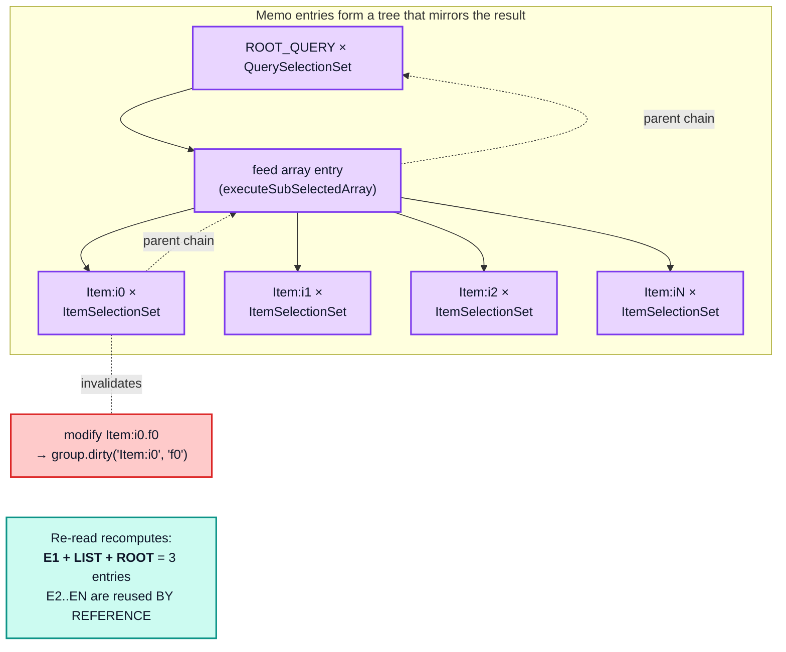

# Part 3 — The read path

[Documentation](../README.md) › [Performance guide](README.md) · [← Part 2](02-write-path.md) · [Part 4 →](04-dependency-graph-and-broadcast.md)

## 3.1 The memo graph *is* the read path

`StoreReader` wraps two functions with `optimism`'s `wrap` ([architecture §5.1](../architecture/05-store-reader.md#51-the-two-memoized-functions)):

```ts
this.executeSelectionSet = wrap((options) => { /* ... */ }, {
  max: cacheSizes["inMemoryCache.executeSelectionSet"] || defaultCacheSizes["inMemoryCache.executeSelectionSet"],
  keyArgs: execSelectionSetKeyArgs,
  makeCacheKey(selectionSet, parent, context) {
    if (supportsResultCaching(context.store)) {
      return context.store.makeCacheKey(selectionSet, isReference(parent) ? parent.__ref : parent, context.varString);
    }
  },
});
```

The memo key is `(selectionSetNode, dataId | object, varString)`, resolved through
`EntityStore.makeCacheKey` → `group.keyMaker.lookupArray(arguments)`, a three-level `Trie`
walk. Every (selection set, entity, variables) triple is one memo entry; an embedded object
is keyed by the stored object itself.

> This is why result caching is worth so much: a warm read is a handful of `Trie` node
> lookups, not a tree traversal.

Turning the memo graph off is the cleanest way to price it. Over 5 000 entities:

| | `resultCaching: true` | `resultCaching: false` | ratio |
| --- | --- | --- | --- |
| warm read | 1.8 µs | 28.33 ms | **16 000× slower** |
| write | 45.07 ms | 39.54 ms | 0.88× (12 % *cheaper*) |

Memoization is a read-path optimization **paid for on the write path** through dependency
bookkeeping. The read-side win is four orders of magnitude; the write-side cost is a modest
constant factor. That trade is the central design decision of the whole cache, and it is
why `resultCaching: false` is a debugging tool rather than a tuning knob.

## 3.2 The cost of a cold read

`execSelectionSetImpl` per object (entity or embedded object):

```ts
const objectsToMerge: Record<string, any>[] = [];      // 1 array per object
const missingMerger = new DeepMerger();                // 1 merger per object, even when nothing is missing
const workSet = new Set(selectionSet.selections);      // 1 Set per object

workSet.forEach((selection) => {
  // ... per field:
  let fieldValue = policies.readField({ fieldName, field, variables, from: objectOrReference }, context);
  // ... recursion for object/array fields
  if (fieldValue !== void 0) {
    objectsToMerge.push({ [resultName]: fieldValue });  // 1 object per FIELD
  }
});

const result = mergeDeepArray(objectsToMerge);         // 1 more DeepMerger; one merge per field
const frozen = maybeDeepFreeze(finalResult);           // dev only: full recursive freeze
if (frozen.result) this.knownResults.set(frozen.result, selectionSet);
```

Per object read: **one `Set`, two `DeepMerger`s (the second only when there is more than
one field to merge), one array, `F` single-key objects**, plus `F` `readField` calls. Each
`readField` builds the field's store key (`O(A)` with arguments), reads the value, and
registers a dependency with `group.depend(dataId, storeFieldName)` — two with arguments
([§4.1](04-dependency-graph-and-broadcast.md#41-depend-and-dirty)). A `Reference` also
costs one `store.has` check, which registers an `__exists` dependency. So a cold read is
`O(F)` per object and `O(E · F)` in total; a repeated (entity, selection set) pair is a
memo hit after its first occurrence.

On an optimistic read (`optimistic: true`) every one of those lookups starts at the top of
the layer chain: `EntityStore.get` checks the store it was called on and, if that store
does not hold the field, calls its parent, registering a dependency at every level. With
`L` layers a field lookup costs up to `O(L)`, so a cold optimistic read is up to
`O(E · F · L)` ([Part 5](05-layers-and-optimistic-updates.md)).

The symmetry with the write path is not accidental — both are "traverse the selection set,
allocate one object per field, merge them". The difference is only that the reader's result
is memoized.

## 3.3 Invalidation blast radius — the single most important read-path concept

A read costs nothing when its memo entry is clean. So the real question is never "how big is
my query" but **"how much of my memo graph does a write invalidate?"**



**Invalidation always propagates upward to the root**, never sideways:

| Change | Memo entries whose body re-executes |
| --- | --- |
| 1 field of 1 leaf entity in a flat list of `N` | `3` — the entity, the array, the root |
| 1 field of 1 entity at depth `D` | `D + 1` — the entity and its `D` ancestor entries |
| 1 field of `k` entities in a flat list | `k + 2` |
| a scalar field of `ROOT_QUERY` | `1` — the root entry; its child entries are memo hits |

(All four rows are counted by the probe or were verified by counting
`execSelectionSetImpl` and `execSubSelectedArrayImpl` calls.)

**Entries recomputed is not the same as work done.** Only three entries re-execute after a
point change in a list of `N`, but one of them is the array entry, and re-executing it
means a `filter` pass with `N` `canRead` calls plus an `N`-element `map` whose per-element
`executeSelectionSet` calls are memo *hits*. A memo hit is cheap — a three-level `Trie`
lookup, an `optimism` dirty check, and re-registering the child under its parent — but it
is not free, so the re-read is still `O(N)`.

In general, a re-executed entry costs its own fields, `O(F)`, plus one memo lookup per
child entry. On top of that, `optimism` 0.18.1 has a bookkeeping cost that depends on
*depth*. When a child entry registers as clean under a parent that is itself only
"dirty by child" (not dirty itself), the parent reports clean to *its* parent, and so on
up to the root. In a re-read every ancestor of the change is in that state, so each clean
child costs one step per level above it. An entry at depth `D` with `c` child entries
therefore costs `O(F + c · D)`:

- a list of `N` near the root costs `O(N)` (measured: `2N + 1` clean reports for a list at
  depth 1, against `N + 1` on a cold read);
- a chain of `D` nested entities costs `Σ d = O(D²)` (measured: `(D + 1)(D + 2) / 2`
  clean reports after a leaf change, against `D + 1` on a cold read).

The counts come from an instrumented copy of `optimism` (verified, not in the probe). A
cold read does not pay the climb: new entries are dirty themselves, so a clean report
stops at the first parent.

`readQuery` over a list of `N` normalized entities (`F = 8`: `__typename`, `id` and six
scalar fields):

| `n` | cold | scale | warm | scale | after 1 dirty field | scale |
| --- | --- | --- | --- | --- | --- | --- |
| 100 | 1.56 ms | — | 2.9 µs | — | 187 µs | — |
| 1 000 | 15.70 ms | 1.01n | 2.5 µs | 0.09n | 1.66 ms | 0.89n |
| 5 000 | 78.63 ms | 1.00n | 2.7 µs | 0.21n | 8.87 ms | 1.07n |
| 20 000 | 333.45 ms | 1.06n | 2.5 µs | 0.23n | 45.08 ms | 1.27n |

Read the `after 1 dirty` column against `cold`: at every size the re-read is **7–9.5× cheaper**
than a cold read and **scales the same way**. That factor is the value of structure sharing;
the linearity is the cost of the monolithic array entry.

Depth behaves completely differently. A single chain of `d` nested entities:

| `d` | write normalized | scale | read cold | scale | read warm | scale | **read after leaf change** | scale |
| --- | --- | --- | --- | --- | --- | --- | --- | --- |
| 4 | 68.2 µs | — | 74.4 µs | — | 2.8 µs | — | 71.7 µs | — |
| 16 | 170.5 µs | 0.63n | 206.4 µs | 0.69n | 2.7 µs | 0.24n | 220.6 µs | 0.77n |
| 64 | 610.2 µs | 0.89n | 737.3 µs | 0.89n | 2.4 µs | 0.22n | 1.26 ms | 1.43n |
| 128 | 1.15 ms | 0.94n | 1.37 ms | 0.93n | 2.4 µs | 0.50n | **3.45 ms** | 1.37n |

Two things stand out.

- **The leaf-change re-read scales superlinearly in `d`.** Its `scale` column climbs to
  ~1.4 while `read cold` stays at ~0.9 (linear); over `d = 16…128` that is roughly `d^1.3`.
  Invalidating the leaf marks every ancestor as having a dirty child, and in optimism 0.18.1
  every such ancestor reruns completely on the next read
  ([architecture §1.1](../architecture/01-foundations.md#entry--the-dependency-graph)): it
  forgets its old child edges and dependencies, re-registers them, and rebuilds its result.
  A cold read does the same per-level work without the forget step. The measurements show
  the re-read growing faster than linearly and overtaking the cold read, and the shape
  reproduces on a different machine and Node version; the probe does not isolate which
  part of the per-level work grows with depth.
- **From `d = 16` upward, re-reading after a leaf change already costs more than a cold read
  of the entire chain**, and the gap widens: 2.5× at `d = 128`. The memo graph is not merely
  useless in this shape — it is a net cost.

Note also that `read warm` stays flat at ~2.5 µs regardless of depth. Depth is free when
nothing changed and disproportionately expensive when something did.

So the rule is sharper than "depth is expensive":

> **Breadth costs a linear factor with a small constant. Depth costs a superlinear factor
> and, past a point, more than recomputing from scratch.** Point mutations at the bottom of
> deep normalized chains are the single worst shape for the read path.

## 3.4 Structure sharing

The reason breadth is cheap is that untouched subtrees are returned by reference. Modifying
one field of one entity in a list of 500 and comparing the previous result tree against the
new one:

```
identical (===) array elements reused: 499/500
top-level result object reused:        false
feed array reused:                     false
```

Every untouched element object comes back **by reference**. That is what keeps React
re-renders proportional to what actually changed, and it is also what makes the write
path's deep-equality tax ([§2.3](02-write-path.md#23-the-deep-equality-tax)) worth paying: `storeObjectReconciler` preserving
`existingValue` is what allows the reader's memo entries to survive.

Note what is *not* shared: the enclosing array. `executeSubSelectedArray` is one memo entry
for the whole array, so any element change rebuilds the array object (a shallow `map`) even
though every untouched element is reused. Consumers must therefore compare
element-by-element, not array-by-array — which is exactly what
`ObservableQuery`'s `equal(previousResult.data, diff.result)` does.

## 3.5 Arrays

`execSubSelectedArrayImpl` does two passes:

```ts
if (field.selectionSet) {
  array = array.filter((item) => item === undefined || context.store.canRead(item));
}
array = array.map((item, i) => { /* recurse */ });
```

- **`filter` allocates a second array** and calls `canRead` per element. `canRead` on a
  `Reference` is `store.has(__ref)`, which walks the layer chain until a store holds the
  entity (`O(L)` on an optimistic read) and registers an `__exists` dependency. So an
  `N`-element list of references registers `N` extra dependencies beyond the per-field
  ones.
- **`map` allocates a third array.** For a list of references with a sub-selection, each
  element then goes through `executeSelectionSet` (memoized).
- **Every non-empty list goes through `executeSubSelectedArray`**, including a list of
  scalars with no sub-selection: it is `map`ped into a new array, so a cold read of such a
  list is `O(N)`, not a property lookup ([§7.5](07-structural-stress.md#75-arrays-of-arrays)).
- **Nested arrays recurse into `executeSubSelectedArray`**, each level being its own memo
  entry keyed by `(fieldNode, arrayObject, varString)`. The key is the **array instance
  stored in the cache**. When a write replaces the outer array, its inner arrays are new
  objects too, so every inner array entry misses.

The probe's shape here is not an array of arrays but a list of `G` group entities, each
with a list field of `R` row entities (`G × R` rows in total):

| shape | write | scale | read cold | scale | read warm | scale | 1 row dirty | scale |
| --- | --- | --- | --- | --- | --- | --- | --- | --- |
| 10 × 10 | 596 µs | — | 838 µs | — | 2.6 µs | — | 78.1 µs | — |
| 10 × 100 | 4.52 ms | 0.76n | 8.62 ms | 1.03n | 2.3 µs | 0.09n | 306 µs | 0.39n |
| 100 × 100 | 47.74 ms | 1.06n | 88.20 ms | 1.02n | 2.1 µs | 0.09n | 570 µs | 0.19n |
| 100 × 500 | 251.86 ms | 1.06n | 472.01 ms | 1.07n | **2.21 ms** | **207.39n** | 2.27 ms | 0.80n |

Everything is linear in the total element count except one cell. The `100 × 500` warm read
is **three orders of magnitude** slower than every other warm read, and its scale column
reads `207.39n`.

That is not an array-nesting effect. `100 × 500` rows + 100 groups + `ROOT_QUERY` = 50 101
entities, just over the 50 000 `executeSelectionSet` limit — so the LRU trim that follows
every read evicts entries this query needs, and the next "warm" read recomputes them. This is the LRU cliff of [§4.3](04-dependency-graph-and-broadcast.md#43-the-memo-lru-cliff), reached by accident from a shape that
looks entirely unremarkable. It is the single best argument for checking memo sizes before
blaming the cache.

## 3.6 The dev-build tax

Same 5 000-entity shape, production build against development build:

| | production | development | ratio |
| --- | --- | --- | --- |
| write | 45.01 ms | 45.50 ms | 1.01× |
| read cold | 79.76 ms | 88.21 ms | 1.11× |
| results frozen | `false` | `true` | — |

`maybeDeepFreeze` walks every returned object recursively, and `getFieldValue` calls it on
every field value read out of the store:

```ts
public getFieldValue = <T = StoreValue>(objectOrReference, storeFieldName) =>
  maybeDeepFreeze(
    isReference(objectOrReference) ? this.get(objectOrReference.__ref, storeFieldName)
    : objectOrReference && objectOrReference[storeFieldName]
  ) as SafeReadonly<T>;
```

It does **not** short-circuit on already-frozen objects: `deepFreeze` skips re-freezing a
frozen object but still walks all of its children. Every recomputed level therefore walks
its whole result subtree, including children reused from the memo, and every
`getFieldValue` walks the stored value it returns. After one field changes in a
1 000-item list, a development re-read walks about 2 000 objects (verified: 2 006): the new
result tree plus the stored list of references. The tax is proportional to the size of
what is recomputed and read, not just to what is new.

Because every recomputed entry walks its whole subtree, the tax also grows with depth. On
a cold read, each of the `D` entries of a chain freezes everything below it, so a
development read of a chain of `D` entities walks `O(D²)` objects (verified: 186, 626 and
2 274 objects for `D` = 16, 32 and 64), where the production read is `O(D)`. Never profile
the development build.

<!-- nav:bottom -->

---

| ← Previous | Up | Next → |
| :-- | :-: | --: |
| [Part 2 — The write path](02-write-path.md) | [Performance guide](README.md) | [Part 4 — The dependency graph and broadcast](04-dependency-graph-and-broadcast.md) |
