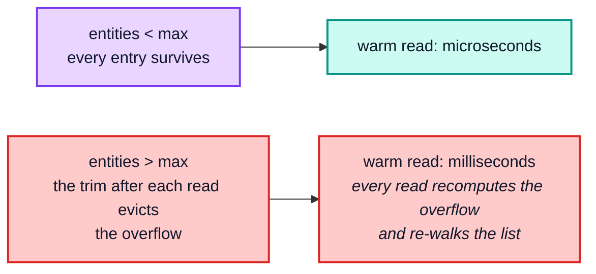
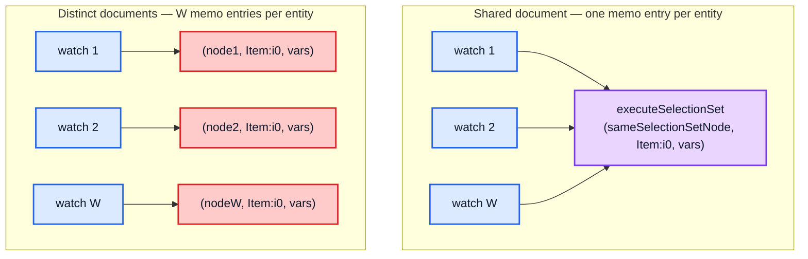

# Part 4 — The dependency graph and broadcast

[Documentation](../README.md) › [Performance guide](README.md) · [← Part 3](03-read-path.md) · [Part 5 →](05-layers-and-optimistic-updates.md)

## 4.1 `depend` and `dirty`

```ts
public depend(dataId: string, storeFieldName: string) {
  if (this.d) {
    this.d(makeDepKey(dataId, storeFieldName));
    const fieldName = fieldNameFromStoreName(storeFieldName);
    if (fieldName !== storeFieldName) {
      // Fields with arguments that contribute extra identifying
      // information to the fieldName (thus forming the storeFieldName)
      // ...
      this.d(makeDepKey(dataId, fieldName));
    }
    if (this.parent) {
      this.parent.depend(dataId, storeFieldName);
    }
  }
}
```

Two costs hide here:

1. **A field with arguments registers *two* dependencies** — one on
   `feed({"offset":0})` and one on the bare `feed`. The bare one is what lets a single
   `dirty(id, "feed")` reach readers of every argument variant: `cache.evict({ id,
   fieldName: "feed" })` does that, and so does a write to a field without `keyArgs`.
   (`cache.modify({ fields: { feed } })` does not need it: it visits and dirties each
   variant's full key.) It doubles the dependency count for argument-bearing fields.
2. **`depend` recurses to parent groups.** Reading through the optimistic `Stump` registers
   every dependency in both the stump's group and the root's group, so an optimistic read
   holds twice the dependencies of a root read. The *calls* grow with the layer chain:
   `EntityStore.get` calls `depend` in every store it passes on its way down, so a field
   lookup that walks `L` layers makes `O(L)` `depend` calls (the duplicates are no-ops in
   the dependency `Set`, but each call still costs a key build and a `Set` insert).

The other side is `dirty`. `group.dirty(dataId, storeFieldName)` visits every memo entry
that registered that dependency and marks it dirty; each newly dirty entry then marks its
parents as having a dirty child, climbing until it reaches an ancestor that is already
marked. So one dirtied field costs `O(entries that read it + their not-yet-marked
ancestors)`. A dependency on `__exists` is *forgotten* instead of dirtied: its entries are
dropped from the memo entirely and their parents are dirtied.

## 4.2 Optimistic reads maintain a *second* set of memo entries

This is the least obvious cost in the whole cache, and it applies to every application
whether or not it uses optimistic updates.

`InMemoryCache.init()` carries a comment that has not been true since the `Stump` was
introduced:

```ts
// When no optimistic writes are currently active, cache.optimisticData ===
// cache.data, so there are no additional layers on top of the actual data.
// ...
this.optimisticData = rootStore.stump;
```

`optimisticData` is **never** the `Root` outside a `batch` update (while the update of a
`batch` whose `optimistic` option is `false` or a layer id runs, `data` and
`optimisticData` both point at the same store): with zero optimistic
layers it is the `Stump`, and with layers it is the top layer, which shares the `Stump`'s
group. The `Stump` owns its own
`CacheGroup`, hence its own `keyMaker` `Trie`, hence its own memo entries, even with zero
optimistic layers active:

```
optimisticData === data      : false
optimisticData constructor   : Stump
groups are the same object   : false
optimistic group's parent    : the root group

executeSelectionSet memo entries, 2 000-entity list, ZERO optimistic layers:
  after write                  : 0
  after optimistic:false diff  : 2001
  after optimistic:true  diff  : 4002   (+2001 new)
  root result === optimistic result : false
```

And the second read gets no benefit from the first:

| | time |
| --- | --- |
| first `optimistic: true` diff, *after* a warm root read | 52.77 ms |
| the same diff once warm | 1.7 µs |

A warm root read buys the first optimistic read nothing at all — it is a full cold read.
(After that, both sets stay warm independently; a write invalidates only the affected
entries in each.)

The consequence is structural, not incidental:

| Caller | `optimistic` | Memo set used |
| --- | --- | --- |
| `ObservableQuery`'s cache watch | `true` (hard-coded) | optimistic |
| `QueryManager.fetchQueryByPolicy`'s `readCache` | `true` | optimistic |
| `QueryInfo.markQueryResult`'s before/after diffs | `true` | optimistic |
| `cache.readQuery` / `readFragment` | `false` (default) | root |
| `QueryInfo.markMutationResult`'s `ROOT_MUTATION` diff | `false` | root |
| `ObservableQuery.notify`'s comparison | both | **both** |

So a watched query whose notifications run both diffs costs **two entries per entity**,
not one, and a `cache.readQuery` from application code does not warm anything the watch
will use. For such queries, the `executeSelectionSet` limit of 50 000 is effectively
25 000 entities, which matters given [§4.3](#43-the-memo-lru-cliff) below.

## 4.3 The memo LRU cliff

Every memo is a **bounded** LRU. Exceeding a bound is not a gentle degradation:

Warm read cost as one query's entity count crosses the `executeSelectionSet` limit of
50 000:

| entities in the result | memo entries held | warm read | over the limit? |
| --- | --- | --- | --- |
| 10 101 | 10 101 | 1.8 µs | no |
| 40 101 | 40 101 | 1.7 µs | no |
| 49 101 | 49 101 | 1.7 µs | no |
| 50 101 | 50 000 | **2.17 ms** | **yes** |
| 60 101 | 50 000 | **116.95 ms** | **yes** |

1.7 µs at 49 101 entities; 2.17 ms — 1 300× more — at 50 101. Nothing about the data
changed; one thousand extra entities crossed a threshold.

Past the bound it keeps getting worse: 2.17 ms at 1 % over, 117 ms at 20 % over.

The mechanism is precise. `optimism` trims its LRUs only when the outermost memoized call
returns ([architecture §1.3](../architecture/01-foundations.md#13-wrycaches--the-lru-behind-every-memo)),
so a read never loses entries *during* its own traversal. At the end, the entries touched
earliest (the first list items) are the oldest, and the trim evicts exactly the overflow.
Evicting an entry also dirties its parents, so the next "warm" read re-walks the list and
recomputes those evicted items; they become the newest, and the trim evicts the next-oldest
ones. Every read therefore recomputes **about as many entities as the overflow** plus the
list ancestors. The probe counts this with the limit lowered to 1 000 (its section 9): a
flat list of 1 101 entities recomputes 102 entries per warm read, 1 501 entities 502, and
3 001 entities 2 002. With `X` entries over the limit, a "warm" read costs
`O(X · F)` for the recomputed entities plus a re-walk of every list on the path to them
(`O(N)` for a flat list of `N`). The jump at the threshold is abrupt because crossing it
turns a microsecond memo hit into that re-walk; beyond it, the cost grows with `X`.



Two ways to hit it without noticing: one very large list, or (more commonly) many
moderately-sized queries whose combined entity × selection-set product exceeds the bound —
remembering to double the count for watched queries per [§4.2](#42-optimistic-reads-maintain-a-second-set-of-memo-entries).

## 4.4 Broadcast fan-out

One write with `w` watchers registered on the same query, over a 2 000-entity list:

| `w` | write that **dirties** what they watch | scale | write that touches **nothing** they watch | scale |
| --- | --- | --- | --- | --- |
| 1 | 22.57 ms | — | 101.4 µs | — |
| 10 | 22.18 ms | 0.10n | 136.4 µs | 0.13n |
| 50 | 22.28 ms | 0.20n | 273.7 µs | 0.40n |
| 200 | 23.20 ms | 0.26n | 695.9 µs | 0.64n |

The two columns behave differently, and both results are useful.

The **relevant** column is flat: 200 watchers cost 3 % more than one. Note what the
absolute number is made of — most of those 22 ms is the write of the 2 000-entity list
itself, and the *marginal* cost is about 3 µs per additional watcher. The watches share
`StoreReader` memo entries, so the first one processed recomputes the invalidated subtrees
and the remaining `W − 1` get memo hits. Broadcast cost is therefore governed by *how much
was invalidated*, not by how many watchers there are — as long as they share a document
([§4.5](#45-memo-fragmentation-by-document-identity)). The final `equal(lastDiff.result, diff.result)` in `broadcastWatch` stays cheap for
the same reason structure sharing keeps React fast: untouched subtrees come back `===` and
`equal` short-circuits on them ([§3.4](03-read-path.md#34-structure-sharing)).

The **unrelated** column grows, but at roughly 3 µs per watcher — it is a per-watch
constant, not a per-watch re-read. That is the memo gate (gate 1 in
[architecture Part 6](../architecture/06-reactivity.md)):
`maybeBroadcastWatch` is itself memoized, so a watch whose dependencies were not dirtied
returns its cached value without computing a diff at all. The per-watch constant is the
memo-key construction (`canonicalStringify` of `{ optimistic, id, variables }` plus a
`Trie` lookup). Its key is built from the *store's* `CacheGroup` — the
`Stump`'s group for `optimistic: true` watches, the root's otherwise:

```ts
makeCacheKey: (c: Cache.WatchOptions) => {
  const store = c.optimistic ? this.optimisticData : this.data;
  if (supportsResultCaching(store)) {
    const { optimistic, id, variables } = c;
    return store.makeCacheKey(
      c.query,
      // ...if their callbacks are different, the (identical) result needs to
      // be delivered to each distinct callback. See issue #5733.
      c.callback,
      canonicalStringify({ optimistic, id, variables })
    );
  }
},
```

<sub>`inMemoryCache.ts` — `maybeBroadcastWatch`'s `makeCacheKey`</sub>

`c.callback` is part of the key on purpose, so `W` watchers on one query occupy `W` distinct
`maybeBroadcastWatch` entries even though they share every `StoreReader` entry underneath.
Budget for that against `cacheSizes["inMemoryCache.maybeBroadcastWatch"]`
([§9.3](09-optimization-playbook.md#93-tuning-knobs-the-cache-actually-exposes)). Both
columns grow by the same ~3 µs per watcher; the gap between them is the cost of the write
itself (a 2 000-entity list against a single small entity), not per-watcher work. That is
the practical meaning of the shared memo: `W` watchers of one document cost one re-read
plus `W` cheap checks.

## 4.5 Memo fragmentation by document identity

Hold the watcher count fixed at 50 and vary only whether they share a document node:

| 50 watchers, one write | time |
| --- | --- |
| all on the **same** document | 22.78 ms |
| on 50 **structurally identical but separately parsed** documents | **3.37 s** |

**148× slower for the same query text, the same variables, and the same data.**

This is the sharpest performance cliff in the whole cache, and it is invisible in the data:
the memo key includes the `SelectionSetNode` **object**, so two structurally identical
queries parsed separately share **nothing**.



Three mechanisms normally prevent this, and all three must be working:

| Mechanism | What it de-duplicates |
| --- | --- |
| `graphql-tag`'s own document cache | identical `gql` template literals |
| `DocumentTransform`'s `WeakCache` | repeated `transformDocument` of the same input node |
| `InMemoryCache.addTypenameTransform`'s cache | the `__typename`-adding pass |

Building documents dynamically (string interpolation into `gql`, per-render document
construction, or a custom `DocumentTransform` with `cache: false` that is not itself
memoized) defeats all three, multiplies memo entries by the number of distinct documents,
and pushes the entry count past the 50 000-entry LRU, at which point every broadcast
recomputes a large share of every read ([§4.3](#43-the-memo-lru-cliff)).

## 4.6 Batching

100 writes with 1 watcher on a 2 000-entity list:

| | time |
| --- | --- |
| 100 separate writes (100 broadcasts) | 5.42 ms |
| the same 100 writes inside one `cache.batch` | 1.54 ms |
| | **3.5× faster** |

`txCount` ([architecture §6.3](../architecture/06-reactivity.md#63-txcount--broadcast-batching)) suppresses broadcasts inside a transaction. The saving is not the writes —
those cost the same — it is the **avoided re-reads**: each broadcast recomputes every dirty
watcher's diff, and a diff over a large list is the dominant term.

<!-- nav:bottom -->

---

| ← Previous | Up | Next → |
| :-- | :-: | --: |
| [Part 3 — The read path](03-read-path.md) | [Performance guide](README.md) | [Part 5 — Layers and optimistic updates](05-layers-and-optimistic-updates.md) |
