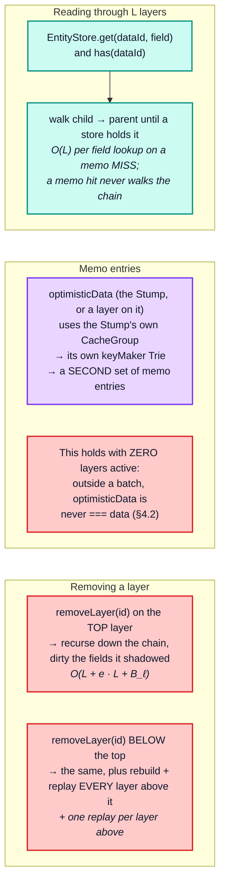

# Part 5 — Layers and optimistic updates

[Documentation](../README.md) › [Performance guide](README.md) · [← Part 4](04-dependency-graph-and-broadcast.md) · [Part 6 →](06-lifecycle-operations.md)

`k` stacked optimistic layers over a 2 000-entity store:

| `k` | add + remove all | scale | warm read through | scale | remove the bottom one | scale | unwind **LIFO** | scale | unwind **FIFO** | scale |
| --- | --- | --- | --- | --- | --- | --- | --- | --- | --- | --- |
| 1 | 77.8 µs | — | 7.8 µs | — | 6.3 µs | — | 6.3 µs | — | 8.1 µs | — |
| 4 | 198.1 µs | 0.64n | 6.3 µs | 0.20n | 46.0 µs | 1.82n | 10.4 µs | 0.41n | 92.9 µs | 2.86n |
| 16 | 1.67 ms | 2.11n | 6.7 µs | 0.26n | 182.1 µs | 0.99n | 27.0 µs | 0.65n | 1.42 ms | 3.82n |
| 64 | 25.48 ms | 3.81n | 7.4 µs | 0.28n | 734.8 µs | 1.01n | **81.9 µs** | 0.76n | **24.43 ms** | 4.30n |

The last two columns are the same stack of 64 layers torn down in opposite orders:

> **Unwinding LIFO costs 82 µs. Unwinding FIFO costs 24.4 ms — 298× more.**

`Layer.removeLayer` recurses to its parent first, and if the parent chain changed it
rebuilds itself with `parent.addLayer(this.id, this.replay)` — whose constructor calls
`replay(this)`, re-running the layer's write. Popping the top layer still recurses down the
whole chain, but no parent changes, so nothing is rebuilt: `O(k)` cheap calls per pop, and
a full LIFO unwind is `O(k²)` *trivial* calls, which is why it measures in microseconds.
Removing the bottom layer rebuilds and **replays** every layer above it, so a full FIFO
unwind is `O(k²)` *replays*, each one a real write. The `add+remove` column uses the FIFO order, which is why it
inherits the same quadratic scale.

The `read through` column is **flat**, which is not a contradiction: the read is warm, so it
is a memo hit at the top of the chain and never walks the layers at all. The `O(k)` lookup
chain is only paid on a memo miss.

Three distinct costs:

The practical rules that fall out:

- **Keep optimistic layers short-lived and few.** `QueryInfo` does this by construction: one
  layer per in-flight mutation, removed in the same `batch` that writes the server result
  ([architecture §8.5](../architecture/08-client-pipeline.md#85-mutations--optimistic-layer-final-write-root-field-scrub)).
- **Remove layers in LIFO order.** Measured at 298× on a stack of 64 (82 µs against
  24.4 ms). Removing the bottom of a stack replays everything above it.
- **A notification that re-reads the cache does two diffs.** `ObservableQuery.notify` compares the optimistic
  and non-optimistic reads ([architecture §8.7](../architecture/08-client-pipeline.md#87-broadcast--notify--reobserve)). Contrary to what the stale comment in
  `init()` suggests, these never share memo entries ([§4.2](04-dependency-graph-and-broadcast.md#42-optimistic-reads-maintain-a-second-set-of-memo-entries)) — the second diff is a genuine
  second read, cheap only because it is separately memoized.
- **A layer write invalidates only optimistic readers; a root write invalidates both.**
  The layer's writes dirty the optimistic group, and only the entries that read the written
  fields. A root write dirties the root group, and that reaches optimistic readers too,
  because `depend` chains upward: every optimistic read also registered in the root group.
  (`dirty` itself never propagates between groups.)

<!-- nav:bottom -->

---

| ← Previous | Up | Next → |
| :-- | :-: | --: |
| [Part 4 — The dependency graph and broadcast](04-dependency-graph-and-broadcast.md) | [Performance guide](README.md) | [Part 6 — Lifecycle operations](06-lifecycle-operations.md) |
