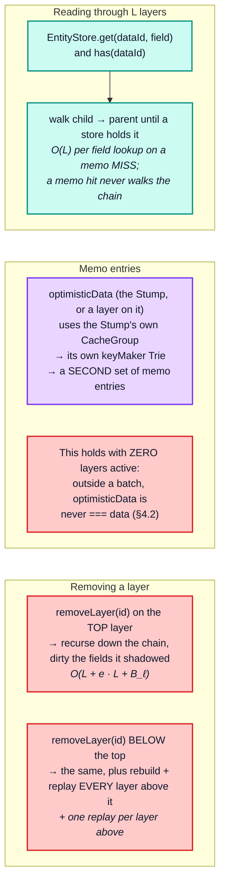

# Part 5 — Layers and optimistic updates

[Documentation](../README.md) › [Performance guide](README.md) · [← Part 4](04-dependency-graph-and-broadcast.md) · [Part 6 →](06-lifecycle-operations.md)

`L` stacked optimistic layers over a 2 000-entity list. Each layer is one
`recordOptimisticTransaction` that writes one field of one entity (`Item:i0.f0`, with
`writeFragment`), as an optimistic mutation response typically does; the list itself is
untouched (the probe's section 7):

| `L` | add + remove all | scale | cold read through | scale | warm read through | scale | remove the bottom one | scale | unwind **LIFO** | scale | unwind **FIFO** | scale |
| --- | --- | --- | --- | --- | --- | --- | --- | --- | --- | --- | --- | --- |
| 1 | 307.7 µs | — | 130.67 ms | — | 83.7 µs | — | 17.4 µs | — | 19.0 µs | — | 22.6 µs | — |
| 4 | 426.3 µs | 0.35 | 224.70 ms | 0.43 | 80.2 µs | 0.24 | 54.9 µs | 0.79 | 30.3 µs | 0.40 | 109.5 µs | 1.21 |
| 16 | 1.74 ms | 1.02 | 565.92 ms | 0.63 | 77.0 µs | 0.24 | 173.1 µs | 0.79 | 48.9 µs | 0.40 | 1.23 ms | 2.82 |
| 64 | 37.55 ms | 5.41 | 2.03 s | 0.89 | 75.0 µs | 0.24 | 583.0 µs | 0.84 | **201.7 µs** | 1.03 | **39.29 ms** | 7.96 |

The last two columns are the same stack of 64 layers torn down in opposite orders:

> **Unwinding LIFO costs 201.7 µs. Unwinding FIFO costs 39.29 ms — 195× more.**

`Layer.removeLayer` recurses to its parent first, and if the parent chain changed it
rebuilds itself with `parent.addLayer(this.id, this.replay)` — whose constructor calls
`replay(this)`, re-running the layer's update. Popping the top layer still recurses down
the whole chain, but no parent changes, so nothing is rebuilt: `O(L)` cheap calls per pop,
and a full LIFO unwind is `O(L²)` *trivial* calls, which is why it measures in
microseconds. Removing the bottom layer rebuilds and **replays** every layer above it —
`L − 1` replays, which is why the `remove the bottom one` column grows about linearly (its
scale sits a little below `1.00` because part of each removal is fixed cost) — so a full
FIFO unwind is `L(L − 1) / 2` *replays*, each one a real write. The `add + remove all`
column uses the FIFO order, which is why it inherits the same quadratic growth.

Each replay's write looks entities up through the chain below it, until it reaches a store
that holds them. Here every layer holds `Item:i0`, so each lookup stops one store down and
a replay costs the same at any depth. Measured on its own, outside the probe, the cost per
replay is flat at about 10 µs from `L` = 16 to 256 (verified), so a FIFO unwind is
`Θ(L²)`. Inside the table the FIFO column grows faster than that from 16 to 64 layers
(scale 7.96, and above `4.00` in every run), because a replay there costs about twice the
standalone figure. The `L = 64` cells come late in a long process (after, among others,
the cold reads through 64 layers); the probe does not isolate which part of that process
state slows them. If the layers below did not hold the entity, each replay would walk
further, up to `O(L)` stores, and a FIFO unwind could approach `O(L³)` store visits.

The `cold read through` column is the first optimistic read after stacking. Every field
read walks down the chain until a store holds the field, so it grows with `L`: `O(L)` per
field lookup on a memo miss, `O(E · F · L)` for the read. The `warm read through` column is
**flat**, which is not a contradiction: the read is warm, so it is a memo hit at the top of
the chain and never walks the layers at all. (Its absolute value is higher than the warm
reads of [§3.3](03-read-path.md#33-invalidation-blast-radius--the-single-most-important-read-path-concept)
because each repetition is the first memo hit after building a fresh cache: that first hit
costs about 70 µs with or without layers, and repeated hits a few microseconds, verified.)

Three distinct costs:

The practical rules that fall out:

- **Keep optimistic layers short-lived and few.** `QueryInfo` does this by construction: one
  layer per in-flight mutation, removed in the same `batch` that writes the server result
  ([architecture §8.5](../architecture/08-client-pipeline.md#85-mutations--optimistic-layer-final-write-root-field-scrub)).
- **Remove layers in LIFO order.** Measured at 195× on a stack of 64 (201.7 µs against
  39.29 ms). Removing the bottom of a stack replays everything above it.
- **A notification that re-reads the cache does two diffs.** `ObservableQuery.notify` compares the optimistic
  and non-optimistic reads ([architecture §8.7](../architecture/08-client-pipeline.md#87-broadcast--notify--reobserve)). Contrary to what the stale comment in
  `init()` suggests, these never share memo entries ([§4.2](04-dependency-graph-and-broadcast.md#42-optimistic-reads-maintain-a-second-set-of-memo-entries)) — the second diff is a genuine
  second read, cheap only because it is separately memoized.
- **A layer write invalidates only optimistic readers; a root write invalidates both.**
  The layer's writes dirty the optimistic group, and only the entries that read the written
  fields. A root write dirties the root group, and that reaches optimistic readers too,
  because `depend` chains upward: every optimistic read also registered in the root group.
  (`dirty` itself never propagates between groups.)

<!-- nav:bottom -->

---

| ← Previous | Up | Next → |
| :-- | :-: | --: |
| [Part 4 — The dependency graph and broadcast](04-dependency-graph-and-broadcast.md) | [Performance guide](README.md) | [Part 6 — Lifecycle operations](06-lifecycle-operations.md) |
