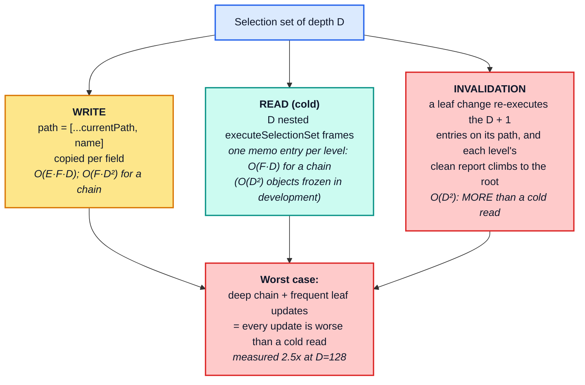
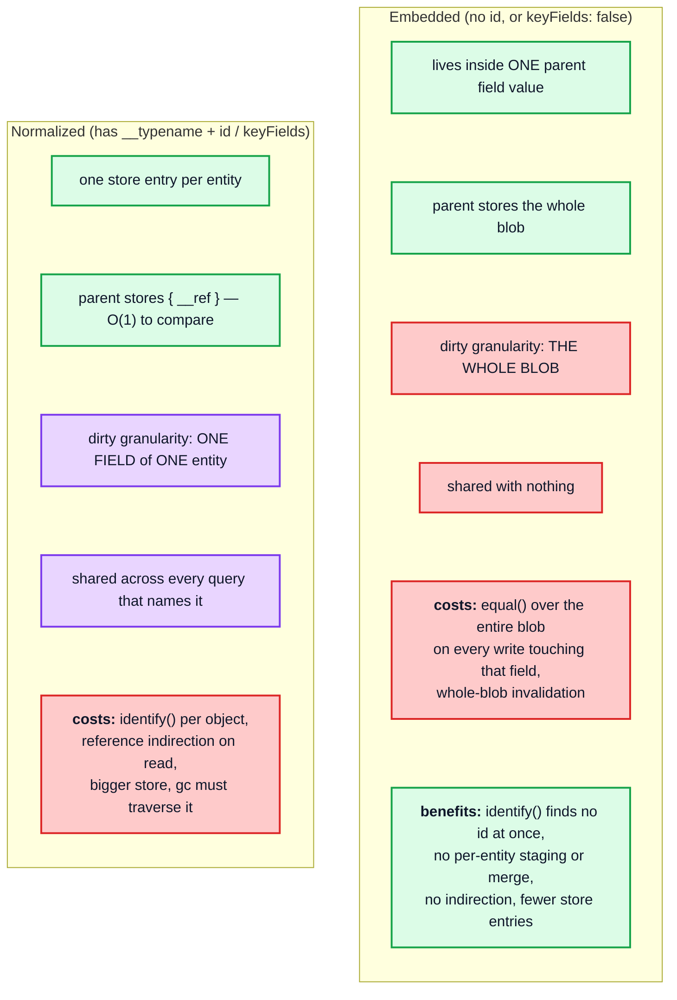
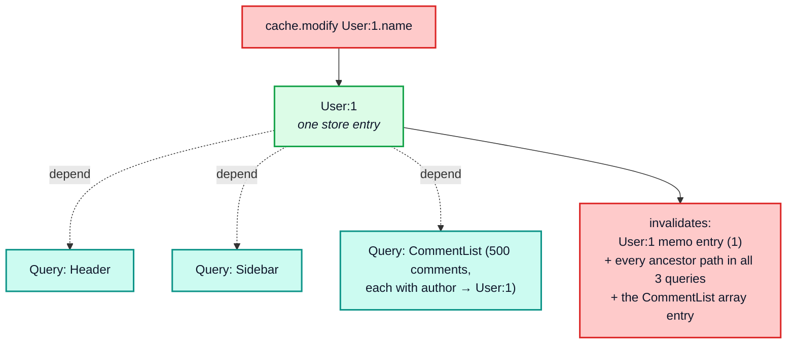

# Part 7 — Structural properties that stress the hot paths

[Documentation](../README.md) › [Performance guide](README.md) · [← Part 6](06-lifecycle-operations.md) · [Part 8 →](08-worst-case-shapes.md)

This is the core of the question: **given deeply nested typed and untyped objects and
arrays, what shapes hurt, and which hot path do they hurt?**

## 7.0 The stress matrix

| # | Structural property | Primary hot path stressed | Cost | Symptom |
| --- | --- | --- | --- | --- |
| 1 | **Deep normalized chains** (`D` large) | read invalidation, write `path` allocation | point mutation → every ancestor reruns, `O(D²)` in total ([§3.3](03-read-path.md#33-invalidation-blast-radius--the-single-most-important-read-path-concept)); write `O(F · D²)` path copying | one field changes, the whole path recomputes — soon costing *more* than a cold read |
| 2 | **Wide lists of entities** (`N` large) | write traversal, cold read, array memo entry | `O(N · F)` cold; `O(N)` with a small constant per point update; `O(N)` per watch for the broadcast `equal()` | slow first paint, slow writes |
| 3 | **Large embedded (untyped) blobs** | `storeObjectReconciler` → `equal()` | `O(B)` per write, *especially* when unchanged | identical payload writes are slow |
| 4 | **Total entities > memo capacity** | `executeSelectionSet` LRU | **cliff**: every warm read recomputes the overflow and re-walks the list | sudden, size-triggered slowdown |
| 5 | **Watched queries whose notifications read both ways** | duplicate optimistic memo set | 2× memo entries per entity | memo capacity exhausted at half the expected size |
| 6 | **Arrays of arrays** | `executeSubSelectedArray` memo keying | one memo entry per array instance; a changed value replaces every inner array | every inner array is re-read after any change to the field |
| 7 | **High entity fan-in** (many parents → same entity) | dirty fan-out through the memo graph | the shared entity entry recomputes once, but every parent entry containing it reruns | one mutation re-renders everything that shows the entity |
| 8 | **Many fields per entity** (`F` large) | per-field allocation, `mergeDeepArray` | `O(F)` objects per object per read *and* write | GC pressure |
| 9 | **Argument-heavy fields** | `canonicalStringify`, double `depend` | `O(A)` key building per field occurrence + 2× dependencies | slow writes with complex filters |
| 10 | **Polymorphic fragments** | `fragmentMatches`, `flattenFields` re-visits | selection sets flattened per `(clientOnly, deferred)` flavor | write cost grows with fragment count |
| 11 | **Many distinct documents** | memo key fragmentation | `W ×` memo entries, LRU thrash | broadcasts recompute large parts of every read |
| 12 | **`merge` functions on lists** | `applyMerges` | `O(accumulated)` per page | pagination degrades quadratically |
| 13 | **Deep optimistic layer stacks** | `get` / `lookup` chain, layer replay | `O(L)` per field lookup on a memo miss; removing the bottom layer replays `L − 1` layers, a full FIFO unwind `O(L²)` | janky optimistic UI |
| 14 | **Self-referential entity graphs** (A → B → A through references) | none in particular: recursion follows the finite query, and the store holds references, not cycles | bounded by query depth | no special cost |

Row 4 is the one that produces *sudden* rather than gradual degradation, and row 5 brings
it closer: a watched query that keeps two memo sets uses the configured limit twice as
fast.

## 7.1 Depth (the worst offender)

Depth hurts in three independent places:



Compare with breadth: a leaf update in a list of `N` re-executes 3 memo entries regardless
of `N`, and the re-read is `O(N)`. A leaf update at depth `D` re-executes `D + 1`, and the
re-read is `O(D²)`. **Depth converts a point mutation into something more expensive than
recomputing the whole chain from scratch; breadth does not**
([§3.3](03-read-path.md#33-invalidation-blast-radius--the-single-most-important-read-path-concept)).

The mitigation is not to flatten the schema — it is to make sure the deep path is *not* the
one that changes often, or to read the deep entity directly (`cache.readFragment` /
`useFragment` on the leaf entity) so the component subscribes to a shallow selection set
rooted at the leaf rather than to the whole chain.

## 7.2 Breadth

Breadth is the friendly dimension. Writes and cold reads are linear, warm reads are
constant, and point updates are linear with a small constant (7–9.5× cheaper than a cold
read, [§3.3](03-read-path.md#33-invalidation-blast-radius--the-single-most-important-read-path-concept)).

Where breadth *does* bite:

- **The array memo entry is monolithic.** `executeSubSelectedArray` produces one entry for
  the whole array, so any element change rebuilds an `N`-element array (a shallow `map`,
  plus a `filter` pass with `N` `canRead` calls).
- **`canRead` registers `N` `__exists` dependencies** per array read.
- **Every watch pays `O(N)` in the broadcast gate.** After the re-read, `broadcastWatch`
  compares the new result with the watch's previous one using `equal()`, which walks the
  rebuilt array's `N` elements even though each is `===`
  ([§4.4](04-dependency-graph-and-broadcast.md#44-broadcast-fan-out)).
- **Cold reads after `resetResultCache`** are `O(N · F)` with no shortcut.

So `N` is a factor on every broadcast that touches the list (once for the shared re-read,
and once more per watch), even though the per-element work is reused.

## 7.3 Typed (normalized) versus untyped (embedded) data

This is the central design choice, and it trades write cost against invalidation
granularity.



The same `n` objects with 6 scalar fields each, once normalized and once embedded in a
single field:

| `n` | write normalized | write embedded | read warm normalized | read warm embedded |
| --- | --- | --- | --- | --- |
| 100 | 874 µs | 711 µs | 2.9 µs | 3.0 µs |
| 1 000 | 8.14 ms | 5.86 ms | 2.5 µs | 2.5 µs |
| 5 000 | 44.10 ms | 28.91 ms | 2.6 µs | 2.6 µs |

Store entries at `n = 2 000`:

```
normalized: 2001 entries (1 root + n entities)
embedded:      1 entry   (root only — the whole list lives in one field)
```

Embedding writes about **1.5× faster** at `n = 5 000` (no id to compute, no per-entity
staging and merge, no reference indirection) and reads identically fast when warm. What it gives up is not speed, it is **granularity**: the whole
list is one cache field, so changing one element dirties all of it, and nothing is shared
with any other query. The 1.5× is the price of per-entity invalidation.

The rule of thumb that follows:

| Data | Prefer |
| --- | --- |
| shared, individually updated, referenced by several queries | **normalized** |
| a settings object, a chart series, a geometry payload, an opaque JSON column | **embedded** |
| large **and** written once, read often | **embedded** — one `equal()` on write, free thereafter |

Rewriting unchanged content does not change this ranking. The embedded form pays `equal()`
over the whole list on every rewrite, but the normalized form pays the traversal,
`identify`, staging and per-entity merge instead. A direct check with 5 000 small objects
(the same shape as the table) measured an identical rewrite at 17.0 ms embedded against
22.9 ms normalized. Choose normalization for granularity and sharing, not to make
rewrites cheaper; to make rewrites of a large unchanged value cheap, see
[§7.4](#74-the-untyped-blob-pathology).

## 7.4 The untyped-blob pathology

The worst realistic shape is a large untyped object under a field that is rewritten often:

```graphql
query Dashboard {
  dashboard {
    __typename
    id
    layout      # a 500 KB untyped JSON blob, unchanged between polls
    widgets { __typename id value }
  }
}
```

Every poll writes `layout` again. `storeObjectReconciler` runs `equal(existingLayout,
incomingLayout)` over the entire 500 KB structure, concludes it is unchanged, returns
`existingValue`, and dirties nothing. **The cache does exactly the right thing and pays the
full price to discover it.**

Two ways out, in order of preference:

1. **Don't select the field when it isn't needed.** The cheapest work is work not done.
2. **A `merge` function that returns `existing` when a version/hash field is unchanged**,
   short-circuiting the deep comparison:

   ```ts
   typePolicies: {
     Dashboard: {
       fields: {
         layout: {
           merge(existing, incoming) {
             return existing && existing.version === incoming.version ? existing : incoming;
           },
         },
       },
     },
   }
   ```

   The `merge` function runs *before* `store.merge`. When it returns the stored object
   itself, `store.merge` sees an incoming value `===` the existing one and never calls
   `storeObjectReconciler`, so the `O(blob)` comparison becomes `O(1)` (in production;
   development builds still deep-freeze `existing` when handing it to the merge function,
   and clone the incoming scalar).

Normalizing the blob (`keyFields` on its type) does not help. A JSON scalar such as
`layout` above has no selection set, so it cannot be normalized. And if an object blob is
normalized, the writer still traverses it and `store.merge` still compares each of the
entity's object-valued fields, so the comparison work only moves into the entity.

## 7.5 Arrays of arrays

Nested arrays are the one place where the memo key works against you:

```ts
makeCacheKey({ field, array, context }) {
  if (supportsResultCaching(context.store)) {
    return context.store.makeCacheKey(field, array, context.varString);
  }
}
```

The key includes **the array instance from the store**, not its contents. That is correct
and fast — but it means an inner array's memo entry is only reused while the exact same
array object remains in the store. Rewriting the outer field with a structurally equal but
freshly allocated outer array produces a new outer array *only if* `equal()` says it
changed; if any element differs, the whole outer array is replaced and **every inner array
gets a new identity**, invalidating all of their memo entries at once.

Arrays of arrays of **plain scalars**, with no entities and no sub-selection, behave
completely differently from the normalized matrix in [§3.5](03-read-path.md#35-arrays)
(`G` inner arrays of `R` strings each):

| `G × R` | write into an empty field | scale | rewrite with an equal copy | scale | read cold | scale | read warm | scale |
| --- | --- | --- | --- | --- | --- | --- | --- | --- |
| 10 × 100 | 6.8 µs | — | — | — | — | — | 2.2 µs | — |
| 100 × 100 | 7.0 µs | 0.10 | — | — | — | — | 2.1 µs | 0.10 |
| 100 × 1 000 | 6.7 µs | 0.10 | — | — | — | — | 2.1 µs | 0.10 |

Writing into an empty field and reading warm are **constant**, at 100 000 elements.
Rewriting and reading cold are linear.

A list of scalars with **no sub-selection** is the degenerate — and cheapest — case to
*write*. `processFieldValue` returns immediately:

```ts
if (!field.selectionSet || value === null) {
  // In development, we need to clone scalar values so that they can be
  // safely frozen with maybeDeepFreeze in readFromStore.ts. In production,
  // it's cheaper to store the scalar values directly in the cache.
  return __DEV__ ? cloneDeep(value) : value;
}
```

In production the array from the network response is stored **by reference** (the probe
checks `cache.extract().ROOT_QUERY.matrix === theOriginalArray`), so writing a
100 000-element nested scalar array into an empty field is `O(1)`.

Reading it back is not free, though. `execSelectionSetImpl` hands every non-empty array to
`executeSubSelectedArray`, with or without a sub-selection, and that function `map`s the
array into a new one and recurses into nested arrays. A cold read therefore copies the
whole structure, `O(G · R)`, and leaves one memo entry per array instance: 101
`executeSubSelectedArray` entries for a `100 × 1 000` matrix (the probe counts them). Only
the warm read, a memo hit on the root entry, is `O(1)`.

Four caveats follow directly:

- **In development the write is `O(size)`** — `cloneDeep` copies the entire structure so
  `maybeDeepFreeze` cannot freeze the caller's object. Another reason not to profile the
  development build.
- **Overwriting is `O(size)`** even in production, because `storeObjectReconciler` runs
  `equal()` against the stored array.
- **A cold read is `O(size)`**, as above, and it copies every array.
- **It is atomic.** There is no way to update one element: any change replaces the whole
  value, dirties the single field, and gives every inner array a new identity, so all of
  their memo entries miss on the next read.

## 7.6 Fan-in: many parents referencing one entity

Normalization's benefit is de-duplication; its cost is that a single entity update fans out
to every reader.



Because memo entries are keyed by `(selectionSet, dataId, varString)`, the `User:1 ×
AuthorFields` entry is shared by all 500 comments, and it recomputes **once**. The comment
entries do not depend on `User:1`'s fields directly, but each of them is a *parent* of that
shared entry in the memo graph, so each one reruns on the next read
([architecture §1.1](../architecture/01-foundations.md#entry--the-dependency-graph)).
Verified: after changing `User:1.name` under 500 comments, 502 `executeSelectionSet`
entries recompute (the author, all 500 comments, and the root), plus the list entry. Each
comment rerun is cheap, since its own fields and the author come from memo hits, but the
work is proportional to the fan-in. Keeping it that cheap requires the author fragment to
be the same node everywhere ([§4.5](04-dependency-graph-and-broadcast.md#45-memo-fragmentation-by-document-identity)).

`@nonreactive` does **not** change any of this. The cache ignores the directive: the
entries still depend on the entity, recompute, and the cache watch still fires. What
`@nonreactive` changes is one level up. `ObservableQuery` (and `useFragment` /
`watchFragment`) compare consecutive results with `equalByQuery`, which skips fields under
`@nonreactive`, so the component does not re-render for them
([architecture §8.9](../architecture/08-client-pipeline.md#89-data-masking)). It saves
renders, not cache work.

## 7.7 Argument-heavy fields

The measurements are in [§2.4](02-write-path.md#24-field-key-construction). The summary:
**the key costs `O(A)` per field occurrence, whatever the values are.** Going from a 1-level
to a 128-level nested argument object takes the write from 18.0 µs to 150.3 µs, and using a
fresh `variables` object every call changes nothing. Going from 0 to 24 arguments is lost
in the noise in the probe, but only because those arguments sit on the one root field and
are paid a constant number of times per operation; on a field selected for every list
item they would be paid once per item.

Costs, in order:

1. `canonicalStringify(args)` — a full `JSON.stringify` walk of the argument structure on
   every call ([§2.4](02-write-path.md#24-field-key-construction)). Only the *key sorting*
   is memoized, and only by shape, so the cost is `O(A)` and is paid per field occurrence,
   not per distinct value.
2. `Policies.getStoreFieldName` is not memoized, so step 1 runs once per field per object
   on the write path, and once per field of every recomputed memo entry on the read path.
3. The resulting `storeFieldName` string is long. `makeDepKey` concatenates it with the
   `dataId` on every `depend` and `dirty`, and `fieldNameFromStoreName` runs a regular
   expression over it, so its length is paid on those accesses too.
4. `group.depend` registers **two** dependencies for argument-bearing fields.

`keyArgs` is the mitigation: restricting the key to the arguments that actually partition
the data both shortens the key and collapses variants that would otherwise be separate
cache fields.

## 7.8 Polymorphism and fragments

`flattenFields` guards against re-flattening with a `Trie` keyed by
`(selectionSet, clientOnly, deferred)`:

```ts
const visitedNode = limitingTrie.lookup(selectionSet, inheritedContext.clientOnly, inheritedContext.deferred);
if (visitedNode.visited) return;
visitedNode.visited = true;
```

So the same fragment can be flattened up to four times per object (the four flavors of
`clientOnly × deferred`). The `Trie` itself is allocated per `processSelectionSet` call —
per object — which makes fragment-heavy queries pay a fixed setup cost per object, plus one
`fragmentMatches` call per fragment per object.

On the read side, `execSelectionSetImpl` flattens fragments into a `Set` and calls
`policies.fragmentMatches(fragment, typename)` per fragment per recomputed object. An exact type
match returns immediately. Otherwise, with `possibleTypes` configured, it searches the
supertype sets upwards, caching positive answers but not negative ones
([architecture §3.6](../architecture/03-policies.md#36-fragmentmatches--type-condition-resolution)).
Without `possibleTypes` a non-exact type condition simply returns `false`: no search, no
warning. Fuzzy (pattern) subtype matching never runs on the read side.

## 7.9 Repeated entities and cycles

`context.written[dataId]` is an **array** of selection sets, and the comment explains why:

```ts
// Avoid processing the same entity object using the same selection
// set more than once. We use an array instead of a Set since most
// entity IDs will be written using only one selection set, so the
// size of this array is likely to be very small, meaning indexOf is
// likely to be faster than Set.prototype.has.
const sets = context.written[dataId] || (context.written[dataId] = []);
if (sets.indexOf(selectionSet) >= 0) return dataRef;
```

That assumption breaks in one specific shape: **one entity written through many different
selection sets in a single operation** — for instance a query that spreads a dozen
different fragments on the same object at different points in the tree. Then `indexOf` is a
linear scan of a growing array, executed once per occurrence of the entity. With `m`
occurrences under `m` different selection sets the scans cost `0 + 1 + … + (m − 1)`, which
is `O(m²)`. `m` is small in practice; it is worth knowing the bound exists.

The guard also saves less than its name suggests. It runs at the *end* of
`processSelectionSet`, after the occurrence's fields have been processed and every child
object below it has been recursed into and identified. What it skips is staging the
occurrence into `incomingById` (so the first occurrence's values win). A payload that
repeats the same entity `m` times with the same selection set therefore pays `m`
traversals of it and one staging ([§2.1](02-write-path.md#21-where-the-time-goes); the
probe's section 1 counts the `identify` calls).

Cycles themselves are safe, and not because of `context.written`. The write recursion
follows the query's selection sets, which are finite, so it ends at the query's depth
whatever the data looks like. In the store, entities point at each other only through
`{ __ref }` strings, so reference cycles (A → B → A) are just data. `findChildRefIds`
walks them with a `workSet`, and `equal` would tolerate cyclic JavaScript values if any
reached it.

<!-- nav:bottom -->

---

| ← Previous | Up | Next → |
| :-- | :-: | --: |
| [Part 6 — Lifecycle operations](06-lifecycle-operations.md) | [Performance guide](README.md) | [Part 8 — Worst-case shapes and a stress corpus](08-worst-case-shapes.md) |
