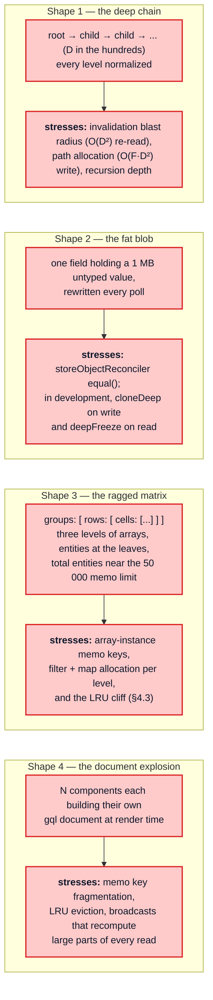

# Part 8 — Worst-case shapes and a stress corpus

[Documentation](../README.md) › [Performance guide](README.md) · [← Part 7](07-structural-stress.md) · [Part 9 →](09-optimization-playbook.md)

## 8.1 The four adversarial payloads

## 8.2 A stress-test corpus for a re-implementation

Any `InMemoryCache` replacement should be benchmarked against these axes, in this order,
because each isolates one hot path:

| Axis | Vary | Holds constant | Detects a regression in | In the probe |
| --- | --- | --- | --- | --- |
| breadth | `N` = 100 → 20 000 | `F`, `D` = 2 | traversal, allocation per entity | yes (sections 1–3) |
| depth | `D` = 4 → 512 | `F` | invalidation propagation, path allocation | yes (section 4) |
| fields | `F` = 2 → 64 | `E`, `D` | per-field allocation, `mergeDeepArray` | **no** |
| blob size | `B`: embedded bytes 1 KB → 1 MB | everything else | `equal()` cost | **no** |
| array nesting | 1 → 3 levels | total elements | `executeSubSelectedArray` keying | partly: 2 levels (section 5) |
| arguments | `A`: 0 → 24 args, nested 1 → 128 levels, on a root field *and* on a per-item field | result size | `canonicalStringify` | partly: root field only (section 10) |
| watchers | `W` = 1 → 200, shared vs. distinct docs | store size | broadcast fan-out, memo sharing | yes (section 6) |
| layers | `L` = 1 → 64, LIFO vs. FIFO removal | store size | layer chain walk, replay | yes (section 7) |
| store size | `S` = 1 000 → 100 000 | operation | `gc`, `extract` | partly: 1 000 → 20 000 (section 12) |
| dirty fraction | 0% → 100% of entities changed | `E` | dirty propagation, re-read cost | **no** (only a single changed field) |
| memo capacity | entities either side of the LRU limit | query shape | eviction policy, cliff behaviour | yes (section 9) |
| optimistic vs. root reads | same query, both `optimistic` values | store size | memo-set separation ([§4.2](04-dependency-graph-and-broadcast.md#42-optimistic-reads-maintain-a-second-set-of-memo-entries)) | yes (section 8) |

The probe covers nine of these axes fully or partly (last column); the fields, blob-size
and dirty-fraction axes still need benchmarks of their own. The two measurements that most
often reveal a broken re-implementation are **"read after 1 dirty"** (proves the memo graph
is wired correctly) and **"write identical"** (proves that an unchanged write dirties
nothing; if it does not, every identical write recomputes every affected watch).

<!-- nav:bottom -->

---

| ← Previous | Up | Next → |
| :-- | :-: | --: |
| [Part 7 — Structural properties that stress the hot paths](07-structural-stress.md) | [Performance guide](README.md) | [Part 9 — Optimization playbook](09-optimization-playbook.md) |
