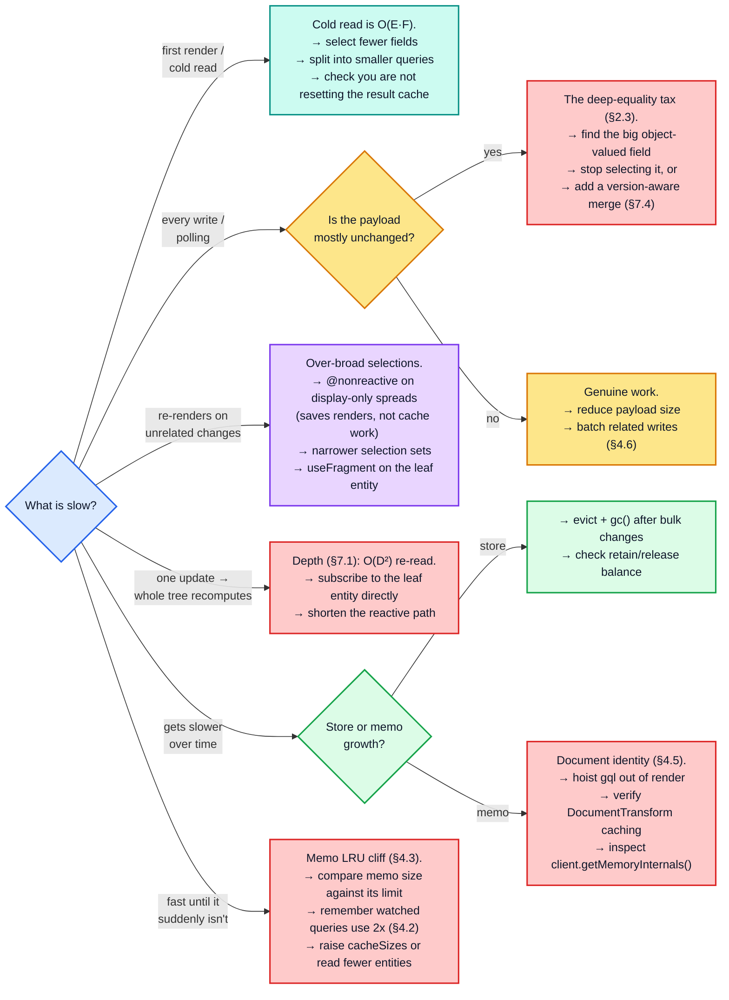

# Part 9 — Optimization playbook

[Documentation](../README.md) › [Performance guide](README.md) · [← Part 8](08-worst-case-shapes.md) · [Part 10 →](10-memory.md)

## 9.1 Decision tree

## 9.2 Diagnostics

| Question | How to answer it |
| --- | --- |
| Are my memo caches thrashing? | `client.getMemoryInternals()` (dev only) — compare `inMemoryCache.executeSelectionSet` size against its 50 000 limit. A size pinned exactly at the limit means you are over the cliff ([§4.3](04-dependency-graph-and-broadcast.md#43-the-memo-lru-cliff)) |
| How many entities does my store hold? | `Object.keys(cache.extract()).length` |
| Is a write actually changing anything? | write twice, compare `cache.extract()` — identical output means the second write was pure cost |
| Which field is the fat one? | sort `JSON.stringify(value).length` over `cache.extract().ROOT_QUERY` and each entity |
| Is a query re-reading when it should not? | run the write inside `cache.batch({ update, onWatchUpdated })` and log from `onWatchUpdated`: it is called for every watch the write dirtied, before the equality gate. (A plain `watch.callback` only fires when the result actually changed.) |
| Am I profiling the right build? | `Object.isFrozen(cache.readQuery(...))` — `true` means you are on the development build |
| Is my optimistic memo set doubling my footprint? | diff `cache["storeReader"]["executeSelectionSet"].size` around a `cache.diff({ optimistic: true })` — a non-zero delta after a warm root read confirms [§4.2](04-dependency-graph-and-broadcast.md#42-optimistic-reads-maintain-a-second-set-of-memo-entries) |

## 9.3 Tuning knobs the cache actually exposes

| Knob | Effect | When to change it |
| --- | --- | --- |
| `cacheSizes["inMemoryCache.executeSelectionSet"]` | read memo capacity (default 50 000) | large stores with many distinct queries — remember watched queries consume two entries per entity ([§4.2](04-dependency-graph-and-broadcast.md#42-optimistic-reads-maintain-a-second-set-of-memo-entries)) |
| `cacheSizes["inMemoryCache.executeSubSelectedArray"]` | array memo capacity (default 10 000) | many long lists, or arrays of arrays (one entry per inner array, [§7.5](07-structural-stress.md#75-arrays-of-arrays)) |
| `cacheSizes["inMemoryCache.maybeBroadcastWatch"]` | broadcast memo capacity (default 5 000) | more than a few thousand simultaneous watches |
| `cacheSizes["canonicalStringify"]` | key-sort memo, one entry per argument **shape** (default 1 000) | rarely — it is bounded by distinct object shapes, not values ([§2.4](02-write-path.md#24-field-key-construction)) |
| `resultCaching: false` | disables the memo graph entirely | debugging only — see the measured cost in [§3.1](03-read-path.md#31-the-memo-graph-is-the-read-path) |
| `typePolicies[T].keyFields` | identity extraction cost and normalization granularity | see [§7.3](07-structural-stress.md#73-typed-normalized-versus-untyped-embedded-data) |
| `typePolicies[T].fields[f].keyArgs` | shortens store field keys, collapses variants | argument-heavy fields |
| `possibleTypes` | required for interface/union fragments to match at all: without it, only exact type names match | any interface/union usage |

The three `inMemoryCache.*` sizes are read when the memoized functions are created: in the
`InMemoryCache` constructor, and again whenever the result cache is reset (`restore`,
`reset`, `gc({ resetResultCache: true })`). Set them before constructing the cache.

## 9.4 What a Rust/WASM re-implementation should target

Ranked by expected impact. The probe measures end-to-end costs, not per-function shares,
so this ranking is an inference from those measurements and from the code, and it shifts
with the shape of the data:

1. **`equal()` in `storeObjectReconciler`** — a hot spot whenever large object-valued
   fields (lists, embedded objects, JSON scalars) are rewritten. A Rust implementation can
   compare interned/hashed values instead of walking structures. Hashing the incoming value
   is still `O(B)`, but it can happen once, while the response is decoded, and the
   comparison itself becomes `O(1)`: the `O(B)` JavaScript walk per unchanged field
   disappears.
2. **Allocation churn** — one object per field on both paths, plus a `path` array per field
   (`O(D)` each, [§2.2](02-write-path.md#22-the-per-entity-and-per-field-allocation-budget)).
   Arena allocation and index-based paths remove essentially all of it.
3. **The traversal itself** — `processSelectionSet` / `execSelectionSetImpl`. A compiled
   selection-set plan (resolved field keys, merge functions, and key extractors bound once
   per document instead of per entity) removes the repeated `getStoreFieldName`,
   `getMergeFunction`, and `flattenFields` work.
4. **`canonicalStringify`** — replaceable with a structural hash; only the *stability* of
   the key matters, not its readability, except where it appears in `extract()` output. That
   caveat is real: store field keys are part of the serialized snapshot format (S5 in the
   architecture document's invariants), so the human-readable form must be preserved at the
   `extract`/`restore` boundary even if an internal representation differs.
5. **The memo graph** — the least attractive target for raw speed on warm reads, which
   are already microseconds (`Trie` lookups plus `Set`/`Map`-based dirty propagation), and
   the part whose semantics are hardest to preserve. Invariants R1, R2 and D1–D3 in the
   architecture document are the contract. The exception is invalidation in deep chains
   ([§3.3](03-read-path.md#33-invalidation-blast-radius--the-single-most-important-read-path-concept)),
   where a leaf change costs `O(D²)` in `optimism`'s clean-report bookkeeping and more than
   a cold read; a port that stops the upward report at the first ancestor still being
   recomputed makes it `O(D)` while keeping the same observable behaviour.

> The asymmetry from [§1.1](01-cost-model.md#11-the-four-costs-that-matter) is the guiding principle for a port: **optimize the write path,
> preserve the read path's semantics exactly.** Warm reads already cost the same at any
> result size; the value a re-implementation adds is on the side that has no memoization to
> hide behind.

<!-- nav:bottom -->

---

| ← Previous | Up | Next → |
| :-- | :-: | --: |
| [Part 8 — Worst-case shapes and a stress corpus](08-worst-case-shapes.md) | [Performance guide](README.md) | [Part 10 — Memory](10-memory.md) |
