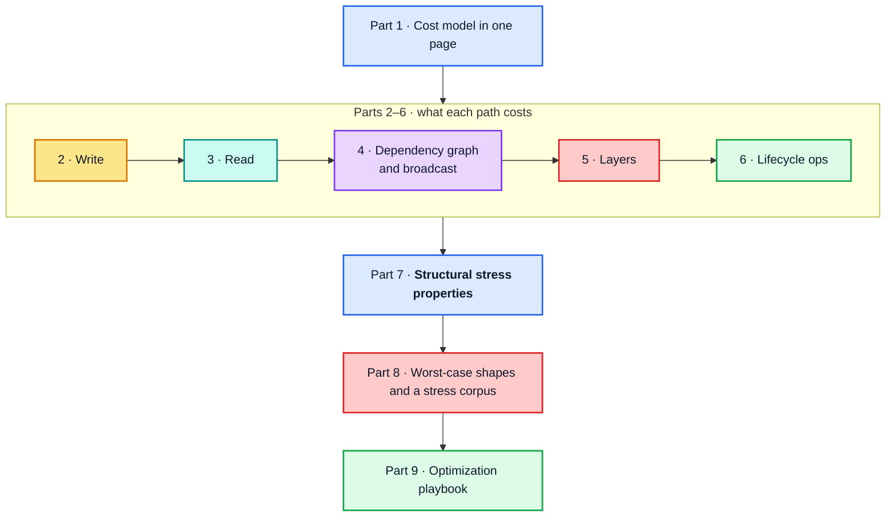

# Apollo Client `InMemoryCache` — Performance Deep Dive

[Documentation home](../README.md) › Performance

> **Companion to** the [architecture guide](../architecture/README.md). That guide
> explains *what* every path does; this one explains *what every path costs*, *which
> paths dominate*, and *which shapes of data make them dominate harder*.
>
> **Source of truth.** `apollo-client-sm` at `ba511be` (`@apollo/client@4.2.11`).
>
> **Measurements.** Every table and timing in this guide comes from
> [`probes/cache-performance-probe.mjs`](../probes/cache-performance-probe.mjs), whose full
> output is committed at [`probes/cache-performance-probe.log`](../probes/cache-performance-probe.log).
> The few checks made outside the probe are labelled "verified" in the text; they are
> counts, not timings, so they do not vary from run to run.
>
> **How the numbers are aggregated.** Timings vary from run to run, so no number in this
> guide is a single measurement. Each one is a **median of medians**:
>
> 1. inside one run, an operation is repeated 25 times after 3 untimed warm-ups, and the
>    run keeps the median of the 25 timings;
> 2. every section of the probe runs in **its own fresh Node process**, and the whole
>    probe is run **5 times**; the guide reports the median of the 5 per-run medians.
>
> Medians rather than means, because a single GC pause or JIT recompilation can
> multiply one sample and would drag a mean with it. Fresh processes, for two reasons.
> Across processes, JIT state and heap layout differ, and one process can be slow as a
> whole. And within one long process the same operation gets slower in later sections
> (the same 5 000-entity write measured 1.7× slower at the end of a single-process run
> than at its start), so sections run in one process would not be comparable. Where the
> guide states a ratio between two operations, both come from the same section. The committed log
> ends with the **run-to-run spread** of every measurement, so you can see how far each
> number moves between runs.
>
> The committed log was produced on Node v22.22.2, linux/x64, **production build**.
> Treat the absolute values as indicative and the **growth rates and ratios** as the
> real result: absolute timings depend on the machine, growth rates do not.

## Running the probe

From the repository root:

```bash
node --expose-gc docs/probes/cache-performance-probe.mjs --runs=5
```

`--runs=R` measures every section in its own fresh process, `R` times, and reports the
median across the runs, as described above. Without it the probe makes a single run in
one process. `--sections=1,13` limits a run to some sections. Add `--quick`
for a faster, coarser run, or `--json` for machine-readable output suitable for tracking
regressions in CI (with `--runs`, the JSON holds each measurement's median, minimum,
maximum and per-run values). The probe deliberately runs the production build; its
last measured section measures the development-build overhead in a child process.

## How to read this guide

**Part 7 is the answer to "what shapes stress the hot paths".** Parts 2–6 build the cost
model it depends on. If you only want the conclusion, read Part 1 and Part 7.



| Part | Chapter | Question it answers |
| --- | --- | --- |
| 1 | [The cost model in one page](01-cost-model.md) | Which costs matter, and how do they grow? |
| 2 | [The write path](02-write-path.md) | Where does a write spend its time? |
| 3 | [The read path](03-read-path.md) | What does a cold read cost, and how far does one change spread? |
| 4 | [The dependency graph and broadcast](04-dependency-graph-and-broadcast.md) | What do `depend`/`dirty`, the memo LRU and broadcast fan-out cost? |
| 5 | [Layers and optimistic updates](05-layers-and-optimistic-updates.md) | What does each optimistic layer add? |
| 6 | [Lifecycle operations](06-lifecycle-operations.md) | What do `gc`, `evict`, `extract` and `restore` cost? |
| 7 | [Structural properties that stress the hot paths](07-structural-stress.md) | Which data shapes make the hot paths slow? |
| 8 | [Worst-case shapes and a stress corpus](08-worst-case-shapes.md) | What should a benchmark suite contain? |
| 9 | [Optimization playbook](09-optimization-playbook.md) | What should I change, and what should a re-implementation target? |

## Conventions

**Section references.** A plain §N.M refers to this guide. A reference written
"architecture §N.M" points into the [architecture guide](../architecture/README.md).
Both are links.

**The `scale` column.** It is the growth factor between two adjacent rows divided by their
size ratio: `1.00` is linear, `1/ratio` is constant, and a quadratic step reads as the
size ratio itself. See [§1.3](01-cost-model.md#13-measured-the-shape-of-the-curves) for
the full legend.

**Notation.** Every complexity in this guide is written with the symbols below. A chapter
that needs an extra symbol defines it where it is used. The first column of every
measured table names the symbol it varies.

| Symbol | Meaning |
| --- | --- |
| `E` | **objects** in the payload (write) or result tree (read) that have a sub-selection: entities *and* embedded objects, counted once per occurrence, plus the root object |
| `F` | **fields** selected per object, after fragments are flattened (`__typename` and `id` count) |
| `D` | **depth** of an object: the number of steps (field names and list indices) on the path from the root object down to it. A list item under `ROOT_QUERY.feed` has `D = 2`; the leaf of a chain of `D` nested entities has depth `D`. It is also the number of read memo entries above the object's own entry |
| `N` | **length** of one list field |
| `S` | **store entries**: the number of `dataId` keys in the normalized store, `ROOT_QUERY` included |
| `W` | registered **watches** (`cache.watch` calls; one per active `ObservableQuery`) |
| `L` | optimistic **layers** stacked above the permanent `Stump` |
| `B` | **size of a value**: the number of objects, arrays and primitives in a stored or incoming field value (a JSON scalar, an embedded object, a list) |
| `A` | **size of a field's arguments**, counted the same way |
| `V` | **size of an operation's variables**, counted the same way |
| `K` | **key-field reads** a `keyFields` specifier makes per object: one per step of every key path (`["isbn"]` makes one, `["isbn", "author", ["name"]]` makes three) |

`O(...)` is an upper bound on the work in these symbols. Where a bound hides a factor
that matters in practice (a per-level chain walk, a per-watch comparison), the chapter
states it separately rather than folding it into a constant.

**Start here:** [Part 1 — The cost model in one page](01-cost-model.md)
