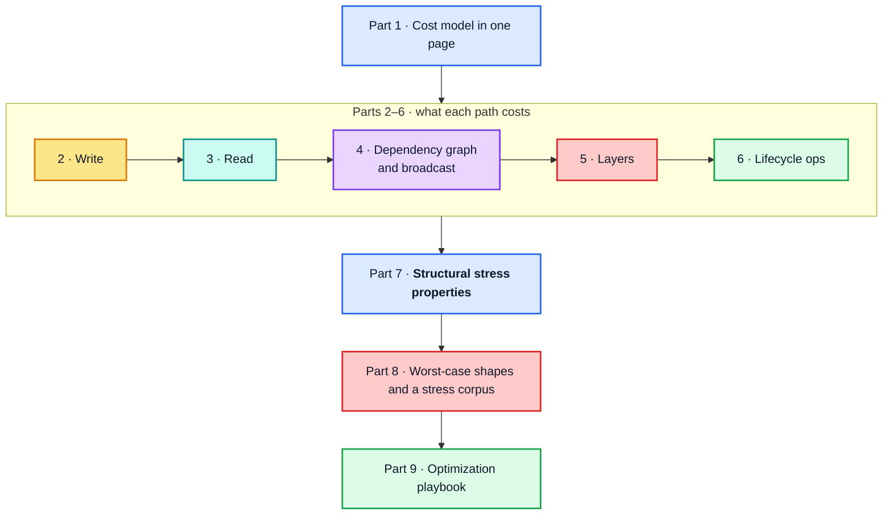

# Apollo Client `InMemoryCache` — Performance Deep Dive

[Documentation home](../README.md) › Performance

> **Companion to** the [architecture guide](../architecture/README.md). That guide
> explains *what* every path does; this one explains *what every path costs*, *which
> paths dominate*, and *which shapes of data make them dominate harder*.
>
> **Source of truth.** `apollo-client-sm` at `ba511be` (`@apollo/client@4.2.11`).
>
> **Measurements.** Every table and timing in this guide comes from
> [`probes/cache-performance-probe.mjs`](../probes/cache-performance-probe.mjs), whose full
> output is committed at [`probes/cache-performance-probe.log`](../probes/cache-performance-probe.log).
> The few one-off checks made outside the probe are labelled "verified" or "a direct check"
> in the text and do not appear in the log.
>
> The committed log records 165 medians on Node v22.14.0, linux/x64, **production
> build**. Treat the absolute values as indicative and the **growth rates and ratios**
> as the real result: a re-run on darwin/arm64 with Node 24.6 reproduced the same
> shapes with different absolute timings.

## Running the probe

From the repository root:

```bash
node --expose-gc docs/probes/cache-performance-probe.mjs
```

Add `--quick` for a faster, coarser run, or `--json` for machine-readable output suitable
for tracking regressions in CI. The probe deliberately runs the production build; its last
section measures the development-build overhead in a child process.

## How to read this guide

**Part 7 is the answer to "what shapes stress the hot paths".** Parts 2–6 build the cost
model it depends on. If you only want the conclusion, read Part 1 and Part 7.



| Part | Chapter | Question it answers |
| --- | --- | --- |
| 1 | [The cost model in one page](01-cost-model.md) | Which costs matter, and how do they grow? |
| 2 | [The write path](02-write-path.md) | Where does a write spend its time? |
| 3 | [The read path](03-read-path.md) | What does a cold read cost, and how far does one change spread? |
| 4 | [The dependency graph and broadcast](04-dependency-graph-and-broadcast.md) | What do `depend`/`dirty`, the memo LRU and broadcast fan-out cost? |
| 5 | [Layers and optimistic updates](05-layers-and-optimistic-updates.md) | What does each optimistic layer add? |
| 6 | [Lifecycle operations](06-lifecycle-operations.md) | What do `gc`, `evict`, `extract` and `restore` cost? |
| 7 | [Structural properties that stress the hot paths](07-structural-stress.md) | Which data shapes make the hot paths slow? |
| 8 | [Worst-case shapes and a stress corpus](08-worst-case-shapes.md) | What should a benchmark suite contain? |
| 9 | [Optimization playbook](09-optimization-playbook.md) | What should I change, and what should a re-implementation target? |

## Conventions

**Section references.** A plain §N.M refers to this guide. A reference written
"architecture §N.M" points into the [architecture guide](../architecture/README.md).
Both are links.

**The `scale` column.** It is the growth factor between two adjacent rows divided by their
size ratio: `1.00n` is linear, and a quadratic step reads as the size ratio itself. See
[§1.3](01-cost-model.md#13-measured-the-shape-of-the-curves) for the full legend.

**Notation.**

| Symbol | Meaning |
| --- | --- |
| `E` | number of distinct **entities** touched by an operation |
| `F` | number of **fields** selected per entity |
| `D` | **depth** of the selection set / result tree |
| `N` | **length** of a list field |
| `W` | number of registered **watches** |
| `L` | number of stacked optimistic **layers** |
| `S` | total size of the **store** (number of `dataId` entries) |

**Start here:** [Part 1 — The cost model in one page](01-cost-model.md)
