# RFC 0001, Level 2: how data moves

[Documentation home](../../README.md) › [RFC 0001](README.md) · [← Level 1: the idea](README.md) · [Level 3: the design in depth →](03-design-in-depth.md)

## 4. The example application

### 4.1 What the support board does

| Feature | Apollo API the app uses | Cache calls it causes |
| --- | --- | --- |
| the board, polled every 5 s | `useQuery(BOARD, { variables: { status: "OPEN" }, pollInterval: 5000 })` | a `watch`, then per response `batch` → `writeQuery` → `diff`, and a broadcast |
| an "open tickets" badge | `useQuery(OPEN_COUNT)`: `tickets(status: OPEN) { id }` | a second watch over the same list |
| the detail pane of one ticket | `useFragment({ fragment: TICKET_DETAIL, from: ticket })` | `identify`, then `watchFragment`, which is a `watch` |
| reassigning a ticket | `useMutation(ASSIGN, { optimisticResponse })` | `recordOptimisticTransaction` (a layer), then `batch` with `removeOptimistic` |
| a ticket created by this agent | the mutation's `update` function calls `cache.modify` | `modify`, and a nested `writeFragment` |
| the activity log, with "load more" | `fetchMore({ variables: { offset: 20 } })` | `batch` → `writeQuery`, merged by a descriptor |
| forgetting a closed ticket | `cache.evict` and `cache.gc` | `evict`, `gc` |
| server rendering | one cache per request, `extract` on the server, `restore` in the browser | `extract`, `restore`, `[Symbol.dispose]` |

The other operations:

```graphql
query OpenCount { tickets(status: OPEN) { id } }

fragment TicketDetail on Ticket { id title status assignee { id name } meta }

mutation Assign($id: ID!, $userId: ID!) {
  assignTicket(id: $id, userId: $userId) { id assignee { id name } }
}

query Activity($ticketId: ID!, $offset: Int!, $limit: Int!) {
  activity(ticketId: $ticketId, offset: $offset, limit: $limit) { id at text }
}
```

The configuration is the "after" of [§3.3](README.md#33-what-an-application-changes): `tickets` has
no policy, so every argument is part of its store key; `activity` is keyed by `ticketId`
alone and merged with `{ list: "offset" }`; and a `ticket(id)` field is redirected to the
`Ticket` entity when `ROOT_QUERY` does not hold it.

### 4.2 Its traffic through the cache

Every arrow below is a call path in Apollo Client 4.2.11
([Apollo architecture §8.0](../../research/architecture/08-client-pipeline.md#80-the-call-map)). None of them
changes: `InMemoryCacheRs` receives exactly the calls `InMemoryCache` receives.

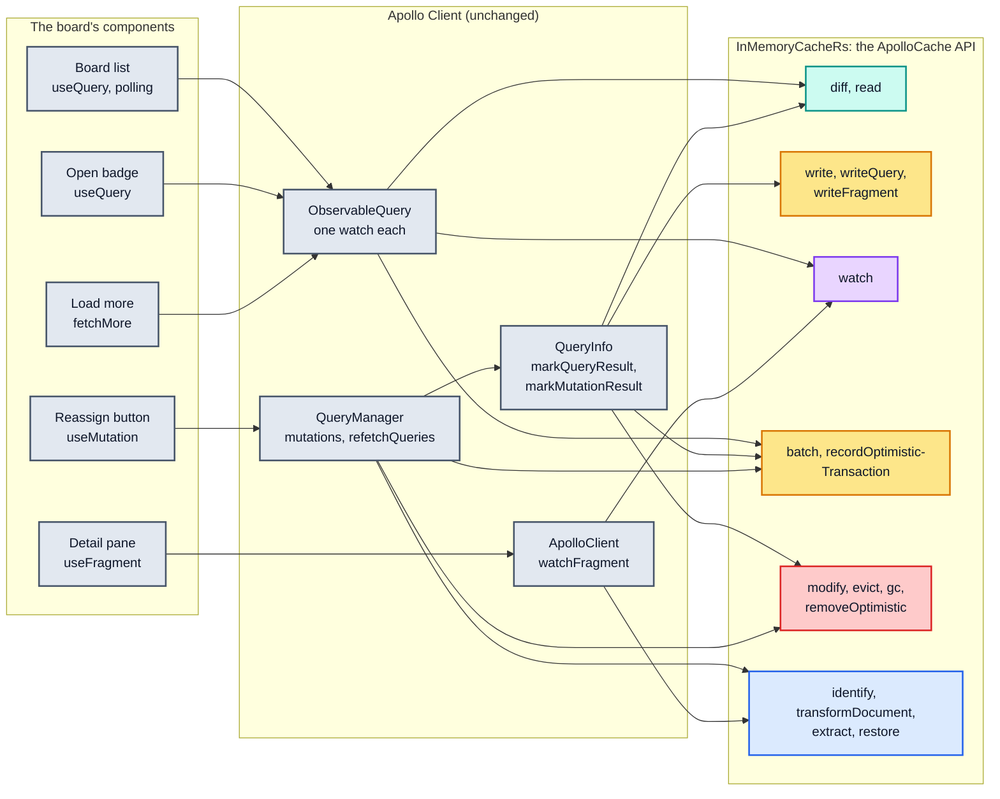

## 5. Walkthroughs: ten flows through one application

Each walkthrough follows one thing the board does, from the Apollo Client call to the
Rust engine and back. It says what `InMemoryCache` does at that point, draws what
`InMemoryCacheRs` does, and ends with what differs. The walkthroughs stay at the level of
"who does what"; the Level 3 section linked at the end of each one has the mechanism.

In the sequence diagrams, participants are boxed by owner: Apollo Client or the
application, the JavaScript side of `InMemoryCacheRs`, and the Rust engine. A message
between the JavaScript box and the Rust box crosses the boundary, and a dashed arrow is a
return value.

### 5.1 Constructing the cache

**In `InMemoryCache`**, the constructor stores the configuration, builds `Policies`, the
`Root` store with its `Stump`, and the reader and writer. Functions are accepted wherever a
policy allows them.

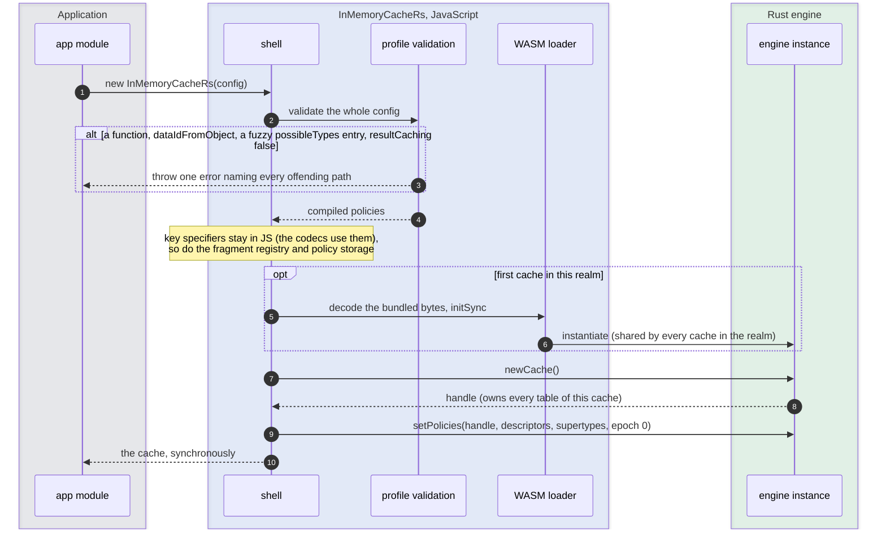

**What differs**

- **Validation throws**, at construction and in `cache.policies.addTypePolicies`, with an
  error that lists every offending path and links the migration guide. The whole argument
  is validated before any of it applies ([§7.3](03-design-in-depth.md#73-validation-and-the-policy-table)).
- **The WASM instance is created once per realm**, synchronously, from bytes shipped in the
  package; every cache shares it ([§16](03-design-in-depth.md#16-packaging-and-initialization)). This is not
  implemented yet: today the package throws on construction outside Jest and the probes
  (ADR 0001, F18).
- **Each cache is a handle** into the shared instance. Everything the cache allocates in
  Rust belongs to that handle, which is what makes disposal possible
  ([§14](03-design-in-depth.md#14-memory-and-ownership)).

### 5.2 The first response: a cold write

The board mounts with an empty cache. `cache-first` finds nothing, the network answers
with 5 000 tickets, and `QueryInfo.markQueryResult` writes them inside a `batch`
([Apollo architecture §8.4](../../research/architecture/08-client-pipeline.md#84-queryinfomarkqueryresult--the-write-path-and-the-feud-breaker)).

**In `InMemoryCache`**, `StoreWriter` walks the result along the query, builds a
`StoreObject` per entity, identifies each object, computes each field's store key, and
merges the result into the `Root` field by field, dirtying every new field
([Apollo architecture §4.9](../../research/architecture/04-store-writer.md#49-the-full-write-end-to-end)).
For 5 000 entities of eight scalar fields, the probe's shape, that is 83.41 ms and 92 MiB of
allocation.

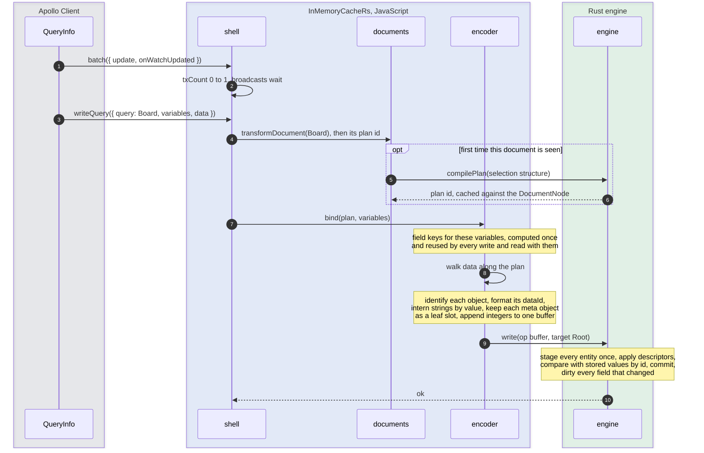

What the encoder hands over, for the first ticket. The format is experiment E10's to
decide, so this is only an illustration:

```text
JS interns strings by value; Rust only ever sees their ids:
  "Ticket:T1" = s12   "Login fails" = s14   "User:U7" = s16   'tickets({"status":"OPEN"})' = s30

WRITE    target=Root  plan=p1  binding=b1
ENTITY   s12                         Ticket:T1
  FIELD  __typename  STR   s3        "Ticket"
  FIELD  id          STR   s13       "T1"
  FIELD  title       STR   s14       "Login fails"
  FIELD  status      STR   s15       "OPEN"
  FIELD  assignee    REF   s16       User:U7
  FIELD  meta        SLOT  1         the JSON object itself stays in JS
ENTITY   s16                         User:U7
  FIELD  __typename  STR   s4        "User"
  FIELD  id          STR   s17       "U7"
  FIELD  name        STR   s18       "Ada"
  ... 4 999 more tickets ...
ENTITY   s0                          ROOT_QUERY
  FIELD  __typename  STR   s5        "Query"
  FIELD  s30         LIST  5000      REF s12, REF s19, ...
END
```

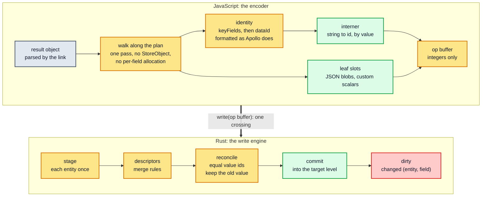

**What differs**

- **One crossing per write**, carrying integers. Rust never walks the JS object and never
  decodes a string ([contract 4](../../adr/0004-declarative-policies-rust-engine.md#4-the-contracts)).
- **Ids and field keys are still Apollo's strings**, formatted by the same JS functions
  Apollo uses, so `extract()` output and `cache.identify()` stay byte for byte the same
  ([§8](03-design-in-depth.md#8-names-entity-ids-field-keys-and-interned-strings)).
- **The JSON blob is not copied or interned.** It stays in JS as the application's own
  object, and Rust stores its slot id ([§13](03-design-in-depth.md#13-the-frontier-the-javascript-objects-the-design-keeps)).
- **The rest of the write is Rust's**, with Apollo's semantics: two phases, each entity
  merged once, descriptors instead of merge functions ([§10](03-design-in-depth.md#10-the-write-engine)).
- The target for the encoder alone is 10 ms at this size, about 12 % of Apollo's cold
  write ([§19](04-getting-there.md#19-performance-and-memory-targets)).

### 5.3 Reading it back and watching it

Still inside the `batch`, `QueryInfo` reads the query back with `diff`, so that the data it
returns is the cache's version (read descriptors applied). Then the `batch` ends and the
broadcast delivers the result to the board's watch.

**In `InMemoryCache`**, `StoreReader.diffQueryAgainstStore` walks the query over the store.
Each selection set on each entity is an `optimism` memo entry that records every
`(entity, field)` it read, and each entry builds a new object (deeply frozen in development
builds, R3)
([Apollo architecture §5.1](../../research/architecture/05-store-reader.md#51-the-two-memoized-functions)).

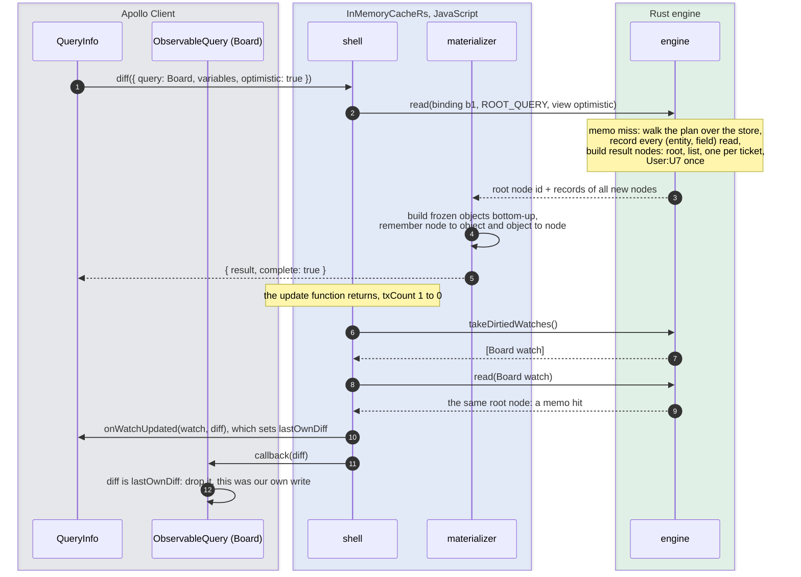

What exists after the read, on each side of the boundary:

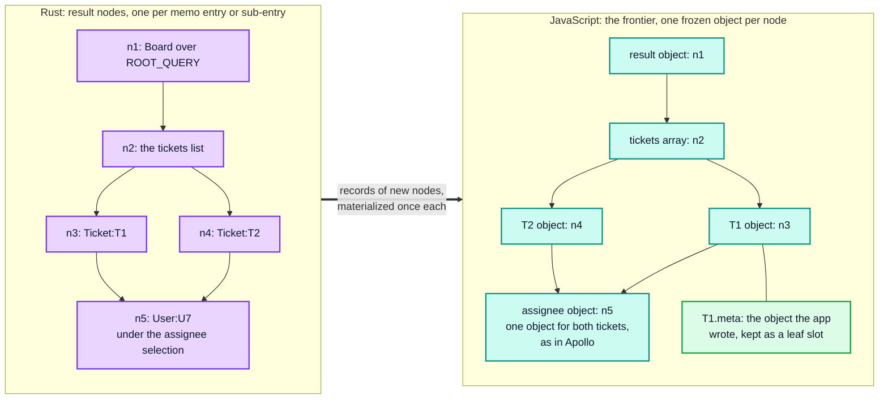

**Registering a watch.** `cache.watch(options)` binds the query's plan to its variables,
registers the watch in Rust's watch registry, and keeps a JS map from the `WatchOptions`
object to the watch id. The object itself is never copied, because Apollo Client sets
fields on it (`watcher`, `lastDiff`, `lastOwnDiff`) and expects to get the same object back
in `onWatchUpdated` ([§9.3](../../research/architecture/09-invariants-and-checklist.md#93-cross-boundary-requirements)).
`immediate: true` delivers the first result before `watch` returns (D6).

**What differs**

- **The memo and the dependency records are Rust's**, as integer pairs, rather than an
  `optimism` entry with a dependency-key string per field. That is where Apollo's
  4.4 KiB per entity per memo set goes ([§11](03-design-in-depth.md#11-the-reader-and-the-result-memo)).
- **JS builds each result object once**, when a read first returns its node, and reuses it
  for as long as the node lives. The same node always means the same object
  ([§13](03-design-in-depth.md#13-the-frontier-the-javascript-objects-the-design-keeps)).
- **The broadcast asks Rust which watches were dirtied**, rather than visiting every
  registered watch ([§12](03-design-in-depth.md#12-invalidation-and-broadcast)).

### 5.4 The next poll: one ticket changed

Five seconds later the poll returns the same 5 000 tickets, except that T1's title is now
"Login fails on Safari". As always after `JSON.parse`, every `meta` field is a new object,
equal to the stored one.

**In `InMemoryCache`**, the whole payload is written again (72.18 ms for the probe's
5 000-entity shape), the read-back recomputes T1, the list and the root (19.53 ms), and the
broadcast visits every watch.

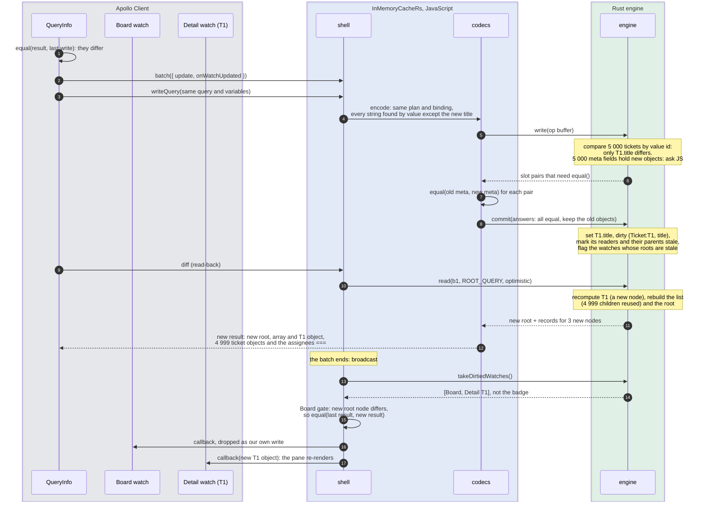

Which result nodes change, and which JS objects survive:

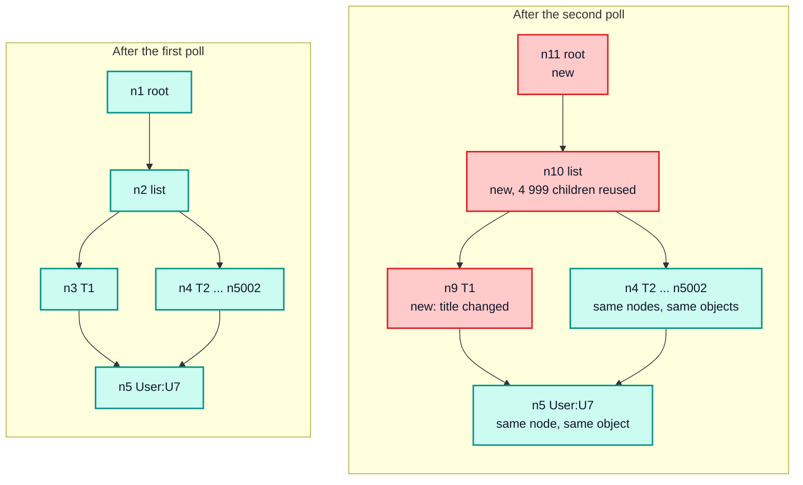

Which watches the broadcast touches:

| Watch | `InMemoryCache` | `InMemoryCacheRs` |
| --- | --- | --- |
| Board | memo entry dirty → `diff` → `equal()` walk of the list → callback, dropped as its own write | the same steps; the re-read is Rust's and materializes 3 nodes |
| Detail (T1) | dirty → `diff` → `equal()` → callback → re-render | the same |
| Badge (reads only ids) | visited: a memo key is built (`canonicalStringify` and a `Trie` lookup), the entry is clean, so it stops there (gate 1) | not visited: it is not in the dirtied set |

**What differs**

- **Unchanged fields cost a comparison of two integers.** A list of references is one
  hash-consed value, so an unchanged list of 5 000 references compares in `O(1)`
  ([§9.3](03-design-in-depth.md#93-values-the-arena-and-two-ids-per-value)).
- **The JSON blobs still cost an `equal()` each**, in JS, as in Apollo. Polling hands over
  every blob as a new object, so this is a real cost that E10 measures
  ([§10.3](03-design-in-depth.md#103-leaf-slots-and-the-two-phase-commit)).
- **The re-read is proportional to what changed**, plus `O(N)` to build the new list array
  from cached children, which Apollo pays too. The target is 1 ms against 19.53 ms
  ([§19](04-getting-there.md#19-performance-and-memory-targets)).
- **The equality gate is skipped outright when the root node is the same** and runs
  Apollo's `equal()` otherwise. A node id can prove equality, never inequality
  ([§12.3](03-design-in-depth.md#123-the-broadcast-loop-and-its-gates)).

### 5.5 A poll where nothing changed

Through an `ObservableQuery`, an identical poll never reaches the cache: `QueryInfo` skips
the write ([§2.3](README.md#23-where-the-time-and-the-memory-go)). An identical payload still
arrives from other sources: a second query over the same tickets, a subscription,
`writeQuery` in application code, or the first poll after an `evict` or `modify` (which
reset the feud breaker).

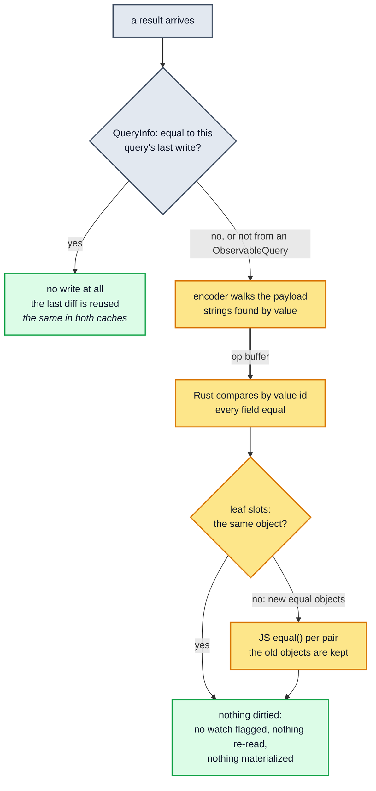

| Cost of an identical 5 000-ticket write | `InMemoryCache` (75.95 ms) | `InMemoryCacheRs` |
| --- | --- | --- |
| traversal | `processSelectionSet`, a `StoreObject` and a path array per entity and field | one encoder pass writing integers |
| identity | `identify` per object | the same, in the encoder |
| comparison | `equal()` on every object-valued field that is not `===`: lists, embedded objects, blobs | one integer comparison per field; `equal()` only for blobs |
| dirtying, re-read, broadcast | none | none |

### 5.6 A user edit through `cache.modify`

An agent creates a ticket, and the mutation's `update` function appends it to the cached
list, a pattern from Apollo's documentation:

```ts
update(cache, { data }) {
  cache.modify({
    fields: {
      tickets(existing = []) {
        const ref = cache.writeFragment({ data: data.createTicket, fragment: NEW_TICKET });
        return [...existing, ref];
      },
    },
  });
}
```

**In `InMemoryCache`**, `modify` looks up the entity, calls the modifier for each field
with the stored value, and merges the changed fields at the end
([Apollo architecture §2.7](../../research/architecture/02-normalized-store.md#27-modify--user-controlled-field-surgery)).
The nested `writeFragment` is an ordinary write that happens while `modify` is running.

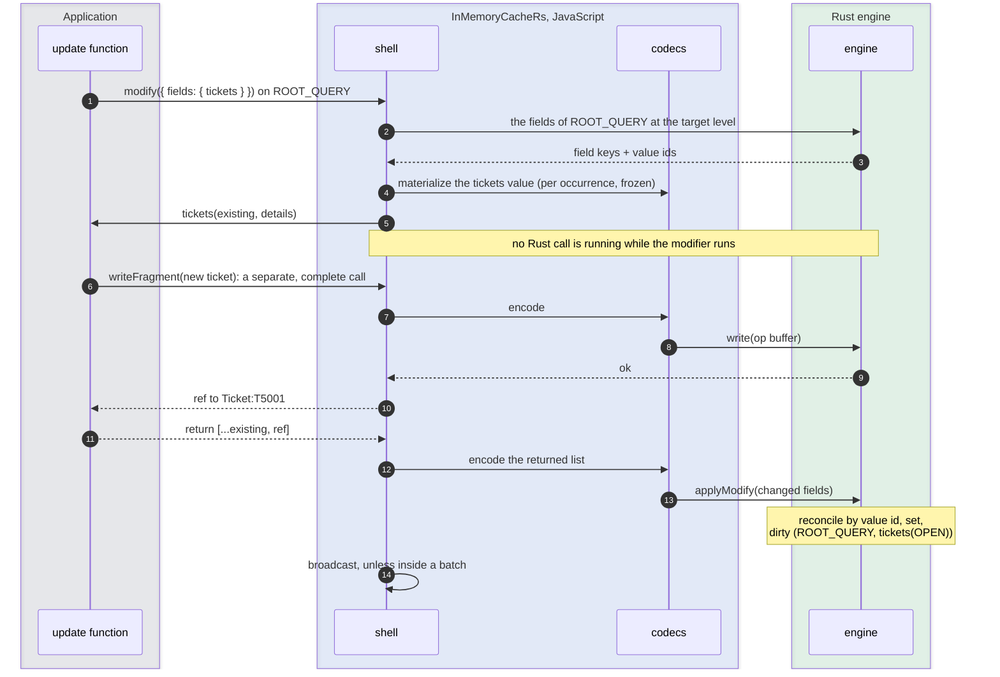

**What differs**

- **The modifier runs between Rust calls, never inside one.** That is why it may call back
  into the cache (`writeFragment` above, `readField`, `identify`) with no re-entrancy
  machinery: the engine is idle whenever user code runs
  ([§6.3](03-design-in-depth.md#63-the-call-discipline-rust-calls-no-javascript)).
- **`existing` is frozen in every build.** Apollo freezes it only in development; in
  production, `existing.push(ref)` changes Apollo's store in place with no broadcast. Here
  the store is in Rust, so a mutated JS copy would silently disagree with it, and freezing
  turns the mistake into a `TypeError`. This is a registered drift
  ([§13.4](03-design-in-depth.md#134-values-handed-to-modifiers), [drift register](../../compatibility.md#decided-registered-when-implemented)).
- **Returning the value received changes nothing**, and returning an equal copy is encoded,
  gets the same value id and dirties nothing, as Apollo's reconciler does. `modify` still
  returns `true` in that case, as Apollo's does.

### 5.7 An optimistic mutation, confirmed or rolled back

The agent reassigns T2 to Grace (`User:U9`). The UI must show the change at once, then keep
the server's answer, or revert if the server refuses.

**In `InMemoryCache`**, `recordOptimisticTransaction` adds a `Layer` above the `Stump`, and
the mutation's writes land in it. Optimistic reads see the layer, root reads do not. On
success, one `batch` writes the server result to the `Root` and removes the layer; on
failure, `removeOptimistic` removes it. Removing a layer that is not on top replays every
layer above it ([Apollo architecture §6.5](../../research/architecture/06-reactivity.md#65-optimistic-lifecycle-end-to-end),
[§8.5](../../research/architecture/08-client-pipeline.md#85-mutations--optimistic-layer-final-write-root-field-scrub)).

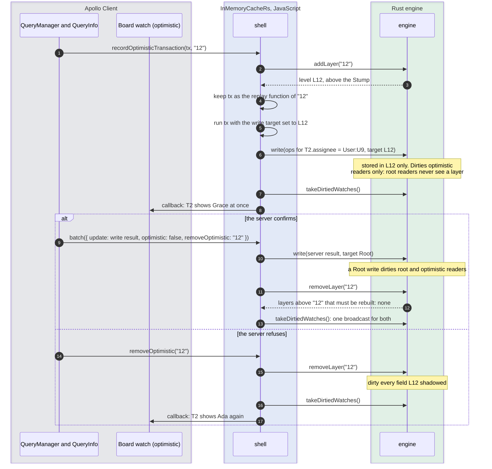

The store's levels at the three moments:

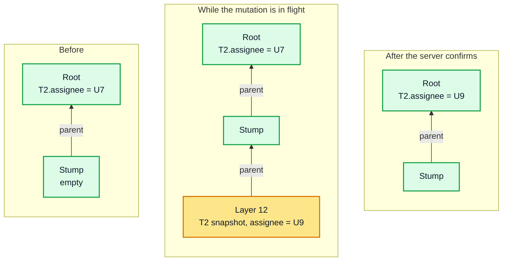

**Two mutations in flight.** If the agent reassigns T2 (layer "12") and then T3 (layer
"13"), and "12" is confirmed first, layer "13" sits above the removed one and must be
rebuilt on the new parent by running its update function again. **Proposed** protocol,
since Rust cannot call the update function itself: `removeLayer("12")` drops the layer,
dirties what it shadowed and returns `["13"]`; the shell calls `addLayer("13")` and runs the
stored replay function with the write target set to the new level. This has to reproduce
Apollo's order and dirtying exactly (L4); [§9.1](03-design-in-depth.md#91-levels-root-stump-and-layers) has the
details and [Q3](04-getting-there.md#23-open-questions) asks the reviewers to check it.

**What differs**

- **Layers, their snapshots and tombstones live in Rust**; the update and replay functions
  stay in JS and run between Rust calls ([§9.1](03-design-in-depth.md#91-levels-root-stump-and-layers)).
- **Optimistic and root reads keep separate memo entries and separate objects**, as in
  Apollo (L2), so `ObservableQuery` can still tell an optimistic result from a root one
  ([§9.3 of the Apollo architecture guide](../../research/architecture/09-invariants-and-checklist.md#93-cross-boundary-requirements)).

### 5.8 Loading more: `fetchMore` and a merge descriptor

The activity log of T1 shows 20 entries; "load more" calls
`fetchMore({ variables: { offset: 20 } })`. With a field policy doing the merging, `fetchMore`
writes the new page with the combined variables inside a `batch`, and the original query
re-reads (`core/ObservableQuery.ts:958-987`).

**In `InMemoryCache`**, `offsetLimitPagination(["ticketId"])` gives `activity` the store key
`activity:{"ticketId":"T1"}` for every page (a `keyArgs` array produces the
`field:{...}` form, where a field with no policy gets `field({...})`), and its `merge`
function splices the new page into the existing array at `args.offset`.

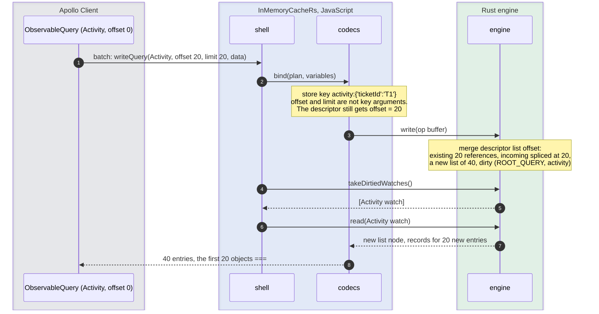

**What differs**

- **The merge rule is a descriptor that Rust runs**, `{ list: "offset" }`, with the exact
  semantics of `offsetLimitPagination`, including the holes it leaves when a page arrives
  out of order ([§7.2](03-design-in-depth.md#72-descriptors)).
- **Descriptors are tested against Apollo's helpers**, by twins of Apollo's tests that run
  the helper on `InMemoryCache` and the descriptor on `InMemoryCacheRs`
  ([§18](04-getting-there.md#18-how-correctness-is-proved)).
- **Writing back what was read stays safe.** A `readQuery` followed by a `writeQuery` of
  the same result must not append the page twice. Apollo prevents it with `isFresh`, and
  so does this design ([§10.2](03-design-in-depth.md#102-isfresh-writing-back-what-was-read)).

### 5.9 Deleting: `evict` and `gc`

A closed ticket leaves the board for good: `cache.evict({ id: "Ticket:T2" })`, then
`cache.gc()`.

**In `InMemoryCache`**, `evict` deletes the entity in the `Root` and in every layer, and
dirties each deleted field and then the entity's existence. The list that still references
T2 filters the dangling reference out on the next read (R4). `gc()` marks from the roots and
the retained ids and sweeps the rest. The memo entries that held T2 stay until the LRU
drops them: after `evict` and `gc()`, 21 of 46 MiB are still held
([Apollo performance §10.5](../../research/performance/10-memory.md#105-reclamation)).

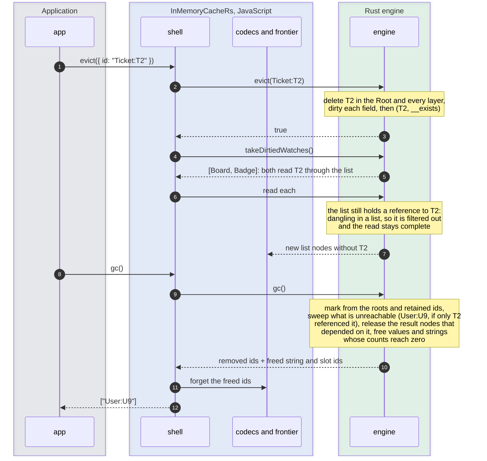

**What differs**

- **Memory follows the data.** Result nodes that depend on an evicted or collected entity
  are released with it, and every table is reference-counted, so interned strings and
  stored values go when their last holder goes ([§14](03-design-in-depth.md#14-memory-and-ownership)).
- **`gc()` still marks from the roots**, as Apollo's does; its semantics (roots, retain
  counts, `__META.extraRootIds`) are tier 2.

### 5.10 Server rendering: `extract`, `restore` and disposal

The board is rendered on the server, one cache per request, and hydrated in the browser.

```ts
// server: one cache per request, freed when the block ends
export async function renderBoard(request: Request) {
  using cache = new InMemoryCacheRs(config);
  const client = new ApolloClient({ link: makeLink(request), cache, ssrMode: true });
  try {
    const html = await renderApp(client);
    return { html, state: cache.extract() };
  } finally {
    client.stop();
  }
}

// browser
const cache = new InMemoryCacheRs(config).restore(window.__APOLLO_STATE__);
```

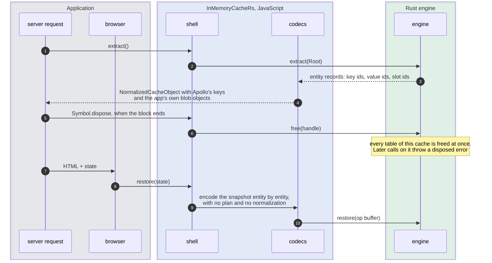

**What differs**

- **`extract()` is a materialization**, `O(S · F)` in the store's size, where Apollo's is a
  shallow copy, `O(S)`. SSR pays it once per page ([ADR 0004, consequences](../../adr/0004-declarative-policies-rust-engine.md#consequences)).
- **`restore()` no longer adopts the snapshot's objects by reference**, a tier-3 change.
  Offset lists come back with `null` where a page was missing, as they do through JSON in
  Apollo ([§7.2](03-design-in-depth.md#72-descriptors)).
- **Disposal is deterministic.** JavaScript's garbage collector cannot see WASM memory, and a
  `FinalizationRegistry` callback may run late or never, so a server that builds a cache per
  request would leak with a finalizer alone. `cache[Symbol.dispose]()` frees everything the
  cache owns; the finalizer is a fallback. `ApolloClient` never disposes its cache, so the
  application does ([§14](03-design-in-depth.md#14-memory-and-ownership); [AGENTS.md](../../../AGENTS.md#package-boundaries)).
- **Open:** a snapshot has no selection sets, so `restore()` cannot tell an embedded object
  from a JSON blob ([Q4](04-getting-there.md#23-open-questions)).

### 5.11 Who did what

| Flow | JS shell | Codecs | Rust engine | User code, run between Rust calls |
| --- | --- | --- | --- | --- |
| construct | validate, load the WASM once | | new handle, policy table | |
| write | `txCount`, `batch`, document to plan | encode, intern, keep blobs as slots, compare slot pairs | stage, descriptors, reconcile, commit, dirty | |
| read, `diff` | document to plan | bind variables, materialize new nodes | memo lookup, read, record dependencies | |
| broadcast | loop over dirtied watches, gates, `onWatchUpdated` | materialize | dirtied watch set, reads | watch callbacks |
| `modify` | orchestrate the modifier calls | materialize values, encode returns | fields in, reconcile, dirty | modifiers |
| optimistic | layer ids, replay functions, write target | | layers, snapshots, tombstones, dirtying | update and replay functions |
| `evict`, `gc` | | forget freed ids | delete, mark and sweep, release | |
| `extract`, `restore` | | materialize, encode | walk or load the store | |
| dispose | the disposed flag | drop the frontier | free the handle | |

<!-- nav:bottom -->

---

| ← Previous | Up | Next → |
| :-- | :-: | --: |
| [Level 1: the idea](README.md) | [RFC 0001](README.md) | [Level 3: the design in depth](03-design-in-depth.md) |
