# RFC 0001, Level 3: the design in depth

[Documentation home](../../README.md) › [RFC 0001](README.md) · [← Level 2: how data moves](02-how-data-moves.md) · [Level 4: getting there →](04-getting-there.md)

## 6. Components, responsibilities and the boundary

### 6.1 The component map

This is [ADR 0004's boundary diagram](../../adr/0004-declarative-policies-rust-engine.md#3-the-boundary),
with each component's job written into its box. The rest of Level 3 takes the components
one at a time.

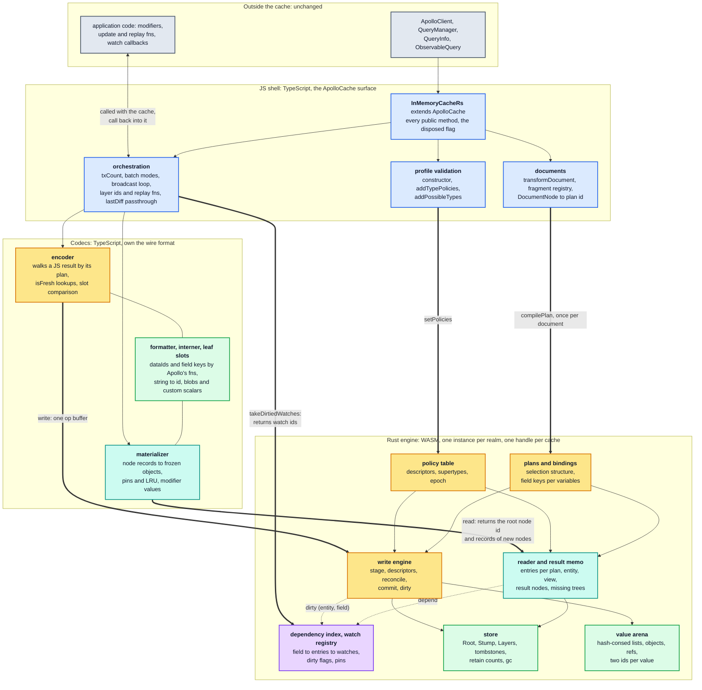
```mermaid
flowchart TB
    subgraph outside["Outside the cache: unchanged"]
        direction LR
        AC["ApolloClient, QueryManager,<br/>QueryInfo, ObservableQuery"]:::ext
        APP["application code: modifiers,<br/>update and replay fns, watch callbacks"]:::ext
    end

    subgraph shell["JS shell: TypeScript, the ApolloCache surface"]
        direction LR
        API["<b>InMemoryCacheRs</b> extends ApolloCache<br/>every public method, the disposed flag"]:::api
        ORCH["<b>orchestration</b><br/>txCount, batch modes, broadcast loop,<br/>layer ids and replay fns, lastDiff passthrough"]:::api
        DOC["<b>documents</b><br/>transformDocument, fragment registry,<br/>DocumentNode to plan id"]:::api
        VAL["<b>profile validation</b><br/>constructor, addTypePolicies,<br/>addPossibleTypes"]:::api
    end

    subgraph codecs["Codecs: TypeScript, own the wire format"]
        direction LR
        ENC["<b>encoder</b><br/>walks a JS result by its plan,<br/>isFresh lookups, slot comparison"]:::write
        FMT["<b>formatter, interner, leaf slots</b><br/>dataIds and field keys by Apollo's fns,<br/>string to id, blobs and custom scalars"]:::store
        MAT["<b>materializer</b><br/>node records to frozen objects,<br/>pins and LRU, modifier values"]:::read
    end

    subgraph rust["Rust engine: WASM, one instance per realm, one handle per cache"]
        direction LR
        POL["<b>policy table</b><br/>descriptors, supertypes, epoch"]:::write
        PLAN["<b>plans and bindings</b><br/>selection structure,<br/>field keys per variables"]:::write
        WR["<b>write engine</b><br/>stage, descriptors, reconcile,<br/>commit, dirty"]:::write
        RD["<b>reader and result memo</b><br/>entries per plan, entity, view,<br/>result nodes, missing trees"]:::read
        DEP["<b>dependency index, watch registry</b><br/>field to entries to watches,<br/>dirty flags, pins"]:::memo
        ST["<b>store</b><br/>Root, Stump, Layers, tombstones,<br/>retain counts, gc"]:::store
        VA["<b>value arena</b><br/>hash-consed lists, objects, refs,<br/>two ids per value"]:::store
    end

    AC --> API
    APP <-->|"called with the cache,<br/>call back into it"| ORCH
    API --> ORCH & DOC & VAL
    ORCH --> ENC & MAT
    ENC --- FMT
    FMT --- MAT
    VAL ==>|"setPolicies"| POL
    DOC ==>|"compilePlan, once per document"| PLAN
    ENC ==>|"write: one op buffer"| WR
    MAT ==>|"read: returns the root node id<br/>and records of new nodes"| RD
    ORCH ==>|"takeDirtiedWatches:<br/>returns watch ids"| DEP
    POL --> WR & RD
    PLAN --> WR & RD
    WR --> ST & VA
    RD --> ST
    WR -.->|"dirty (entity, field)"| DEP
    RD -.->|"depend"| DEP

    classDef api fill:#dbeafe,stroke:#2563eb,stroke-width:2px,color:#0f172a
    classDef read fill:#ccfbf1,stroke:#0d9488,stroke-width:2px,color:#0f172a
    classDef write fill:#fde68a,stroke:#d97706,stroke-width:2px,color:#0f172a
    classDef store fill:#dcfce7,stroke:#16a34a,stroke-width:2px,color:#0f172a
    classDef memo fill:#e9d5ff,stroke:#7c3aed,stroke-width:2px,color:#0f172a
    classDef ext fill:#e2e8f0,stroke:#475569,stroke-width:2px,color:#0f172a
```

### 6.2 Responsibilities, component by component

| Component | Side | Owns | Does | Never does |
| --- | --- | --- | --- | --- |
| `InMemoryCacheRs` | JS | the handle, the disposed flag, policy `storage` | implements every `ApolloCache` method; keeps `evict`, `modify` and `reset` assignable on the instance, because `QueryInfo` wraps them | hold store data |
| orchestration | JS | `txCount`, the map from `WatchOptions` to watch id, layer ids and their replay functions | runs `batch` in its three modes, the broadcast loop and its gates, and all user code, between Rust calls | call user code while a Rust call is running |
| documents | JS | a `WeakMap` from `DocumentNode` to plan id, the transform caches | runs `transformDocument` (idempotent, `===`-stable, [§9.3](../../research/architecture/09-invariants-and-checklist.md#93-cross-boundary-requirements)) and compiles each document once | parse or print documents on a hot path |
| profile validation | JS | the compiled key specifiers | validates a whole configuration argument before any of it applies; throws with every offending path | warn and continue |
| encoder | JS | a reused op buffer | walks a result by its plan, identifies objects, looks up `isFresh`, compares leaf slots with `equal()` | decide merges or dirtying |
| materializer | JS | node id to frozen object; object to node (a `WeakMap`); the pin set and the LRU | builds objects for new nodes only, freezes each once, caches values for modifiers by occurrence | read the store |
| formatter, interner, slots | JS | the string table, the slot table | formats ids, field keys, `extract()` keys and missing-field messages with Apollo's functions, once per distinct value | let Rust decode UTF-8 on a hot path |
| policy table | Rust | descriptors, supertypes (`possibleTypes`), the policy epoch | answers "which rule applies to this field" and "does this type match that condition" | run a function |
| plans and bindings | Rust | compiled selection structures; bindings of a plan to variables | gives every field of a plan its field key id for one set of variables and one policy epoch | format a string |
| write engine | Rust | staging arenas, reused by the next write | stages, applies descriptors, reconciles, commits, dirties | call out, or commit a write it could not finish |
| store | Rust | Root, Stump, Layers, tombstones, retain counts | lookups through the level chain; `evict`, `gc`, `extract` walks | keep a JS object |
| value arena | Rust | hash-consed values, each with a representation id and an equivalence id | makes equality of lists, references and embedded objects `O(1)` | intern JSON blobs |
| reader and result memo | Rust | memo entries and their result nodes; missing trees | reads a plan over the store, records dependencies, reuses clean entries | build a JS object |
| dependency index, watch registry | Rust | field to entries to watches; dirty flags; reachability counts for pins | propagates dirtiness upward, reports dirtied watches | decide whether a callback fires |

### 6.3 The call discipline: Rust calls no JavaScript

**Why it matters.** In Apollo, your policy functions run in the middle of a read or a
write, can read the cache from there, and can throw
([ADR 0001, F6, F12, F14](../../adr/0001-js-rust-wasm-boundary.md#established-facts)). A Rust
engine that had to call them would be suspended mid-operation, holding borrows over its own
tables, while JavaScript re-entered it. With wasm-bindgen that re-entry fails with
"recursive use of an object detected", and a throw that unwinds through Rust leaves the
object unusable for good (experiment E7, F15). ADR 0001 therefore designed a resumable write
engine that flushed a dirty report before every callout and resumed afterwards. Declarative
policies remove the callouts, so every exported operation now runs to completion and
returns, and that whole machine is gone
([ADR 0004, revisited decisions](../../adr/0004-declarative-policies-rust-engine.md#every-earlier-decision-revisited)).

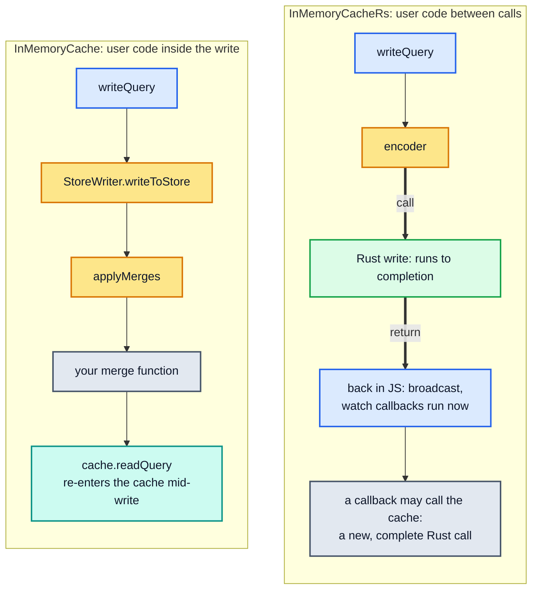
```mermaid
flowchart LR
    subgraph before["InMemoryCache: user code inside the write"]
        direction TB
        A1["writeQuery"]:::api
        A2["StoreWriter.writeToStore"]:::write
        A3["applyMerges"]:::write
        A4["your merge function"]:::ext
        A5["cache.readQuery<br/>re-enters the cache mid-write"]:::read
        A1 --> A2 --> A3 --> A4 --> A5
    end

    subgraph after["InMemoryCacheRs: user code between calls"]
        direction TB
        B1["writeQuery"]:::api
        B2["encoder"]:::write
        B3["Rust write: runs to completion"]:::store
        B4["back in JS: broadcast,<br/>watch callbacks run now"]:::api
        B5["a callback may call the cache:<br/>a new, complete Rust call"]:::ext
        B1 --> B2
        B2 ==>|"call"| B3
        B3 ==>|"return"| B4
        B4 --> B5
    end

    before ~~~ after

    classDef api fill:#dbeafe,stroke:#2563eb,stroke-width:2px,color:#0f172a
    classDef read fill:#ccfbf1,stroke:#0d9488,stroke-width:2px,color:#0f172a
    classDef write fill:#fde68a,stroke:#d97706,stroke-width:2px,color:#0f172a
    classDef store fill:#dcfce7,stroke:#16a34a,stroke-width:2px,color:#0f172a
    classDef ext fill:#e2e8f0,stroke:#475569,stroke-width:2px,color:#0f172a
```

User code that remains is operation-level, and it already runs between cache calls in
Apollo: modifiers inside `modify`, `update` functions inside `batch`, replay functions when
a layer is rebuilt, and watch callbacks during a broadcast
([Apollo architecture §6.4](../../research/architecture/06-reactivity.md#64-batch--the-transactional-api)).

**The one exception: comparing leaf slots.** A JSON blob or a custom scalar is compared with
`@wry/equality`'s `equal()` in JavaScript, and `equal()` runs the values' getters, `valueOf`
and iterators. Apollo runs the same code at the same step. So a write that meets a changed
slot is two-phase, and JS drives both phases, so Rust still calls nothing
([contract 2](../../adr/0004-declarative-policies-rust-engine.md#4-the-contracts)):

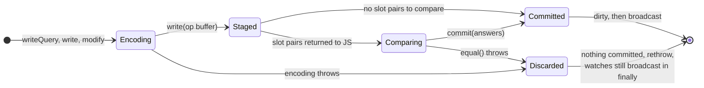
```mermaid
stateDiagram-v2
    direction LR
    [*] --> Encoding : writeQuery, write, modify
    Encoding --> Staged : write(op buffer)
    Staged --> Committed : no slot pairs to compare
    Staged --> Comparing : slot pairs returned to JS
    Comparing --> Committed : commit(answers)
    Comparing --> Discarded : equal() throws
    Encoding --> Discarded : encoding throws
    Committed --> [*] : dirty, then broadcast
    Discarded --> [*] : nothing committed, rethrow,<br/>watches still broadcast in finally
```

While a write is in `Encoding` or `Comparing`:

- a cache call that mutates throws a checked re-entrancy error;
- a read sees the store as it was before the write;
- a throw discards the staged write. Nothing of it is committed, the original value is
  rethrown whatever it is, and watches are still broadcast in `finally`; a callback that
  throws there replaces it, as in Apollo.

Apollo's production build would have committed the entities before the throw (W1 says its
phase 2 is not atomic). Committing nothing is a registered tier-3 drift
([drift register](../../compatibility.md#decided-registered-when-implemented)), pinned by
the case that reaches it with supported data: a JSON blob nested about 10 000 levels deep,
on which `equal()` overflows the stack. Values with getters, Proxies or custom coercion
are unsupported, documented and not detected, because detecting them would run their traps
([U8](../../compatibility.md#u8-written-values-that-are-not-plain-data)).

### 6.4 What crosses the boundary

A call from JS into a wasm-bindgen export with integer arguments costs about 5 ns, the
same as a JS method call (F20, experiment E9). The cost of the boundary is in the data it
carries, so the data crosses as integers, in bulk, once per operation
([contract 4](../../adr/0004-declarative-policies-rust-engine.md#4-the-contracts)).

| Crossing | Direction | When | Carries | Size |
| --- | --- | --- | --- | --- |
| compiled document | JS → Rust | once per transformed `DocumentNode` | the selection structure, as ids | `O(selections)` |
| binding | JS → Rust | once per plan, variables and policy epoch | a field key id per field, per-typename overrides, descriptor arguments, redirect targets | `O(fields)` |
| policies | JS → Rust | construction, `addTypePolicies`, `addPossibleTypes` | descriptors, supertypes, the epoch | `O(policies)` |
| write | JS → Rust | once per write | the op buffer | `O(E · F)` |
| slot pairs, then answers | Rust → JS → Rust | a write that meets changed leaf slots | pairs of slot ids, then one bit each | `O(changed slots)` |
| read | JS → Rust → JS | `read`, `diff`, each dirtied watch | in: binding, root id, view; out: root node id plus records of nodes JS has not seen | `O(new nodes)` |
| dirtied watches | Rust → JS | once per broadcast | watch ids | `O(dirtied)` |
| modifier values | Rust → JS → Rust | `modify` | fields as ids out; changed fields as an op buffer back | `O(F)` |
| freed ids | Rust → JS | with the return of `gc`, `evict`, writes that release values | string and slot ids JS can drop (**Proposed**) | `O(freed)` |
| dropped nodes | JS → Rust | with the next call after the LRU drops objects | node ids whose records must be sent again if needed (**Proposed**) | `O(dropped)` |
| warnings | Rust → JS | development builds | codes and ids; JS formats and prints the text | small |

**What never crosses:** a JS object, a string's bytes, or a per-field call on a hot path.

### 6.5 An interface sketch

**Proposed**, and only to make the boundary concrete for review. The names, the encodings
and the split into calls are what experiments E10 and E11 and the vertical slice decide.
This is how the shell would see the Rust engine through wasm-bindgen:

```ts
// One module instance per realm (ADR 0003); one handle per cache (contract 14).
declare function newCache(): CacheHandle;

interface CacheHandle {
  // configuration and documents
  setPolicies(table: Uint32Array, epoch: number): void;
  compilePlan(structure: Uint32Array): PlanId;
  bind(plan: PlanId, binding: Uint32Array): BindingId;

  // writes: JS drives both phases, so Rust never calls JS
  write(ops: Uint32Array, target: LevelId): WriteOutcome; // Committed | NeedsSlotAnswers(pairs)
  commit(answers: Uint8Array): void;
  abort(): void;

  // reads: the root node id; records of unseen nodes land in a shared buffer
  read(binding: BindingId, rootId: StrId, view: View): NodeId;

  // watches and broadcast
  watch(binding: BindingId, rootId: StrId, view: View): WatchId;
  unwatch(watch: WatchId): void;
  takeDirtiedWatches(): Uint32Array;
  delivered(watch: WatchId, root: NodeId): void; // moves the pin (§13.2)

  // lifecycle
  fieldsOf(entity: StrId, level: LevelId): Uint32Array; // for modify
  applyModify(ops: Uint32Array, level: LevelId): boolean;
  evict(entity: StrId, field: StrId, level: LevelId): boolean;
  gc(): Uint32Array;
  retain(entity: StrId): number;
  release(entity: StrId): number;
  addLayer(id: StrId): LevelId;
  removeLayer(id: StrId): Uint32Array; // the layer ids above it, to replay
  extract(level: LevelId): void; // records into the shared buffer
  restore(ops: Uint32Array): void;
  reset(): void;

  free(): void; // cache[Symbol.dispose]() calls this
}
```

Every method either returns a value or throws a checked error. None takes a callback.

## 7. Configuration: the declarative profile

### 7.1 What is accepted

An Apollo configuration that uses only the "accepted" column runs on `InMemoryCacheRs`
unchanged ([ADR 0004 §1](../../adr/0004-declarative-policies-rust-engine.md#1-the-declarative-profile)).

| Option | Accepted | Rejected at construction |
| --- | --- | --- |
| `keyFields` | a key specifier array, `false` | functions |
| `keyArgs` | a key specifier array (with `@directive` and `$variable` paths), `false` | functions |
| `merge` (field or type) | `true`, `false`, a merge descriptor | functions |
| `read` | a read descriptor | functions |
| `queryType`, `mutationType`, `subscriptionType` | as Apollo | |
| `possibleTypes` | exact type names | pattern entries, which Apollo compiles into a `RegExp` |
| `dataIdFromObject` | none: the default `__typename:id` / `_id` is built in | any value |
| `fragments` (the fragment registry) | as Apollo | |
| `resultCaching` | `true`, Apollo's default and the only mode | `false` |
| `cache.policies` | `addTypePolicies`, `addPossibleTypes` (same shapes and validation), `identify`, `fragmentMatches(fragment, typename)` | every other member |
| values written | passive data: JSON values and plain `Date`s | nothing is rejected; getters, Proxies, custom coercion and other classes are unsupported |

### 7.2 Descriptors

A descriptor names a behaviour that the cache implements in Rust, with the exact semantics
of the Apollo helper or idiom it replaces. The catalogue comes from Apollo's caching and
state-management guides, its pagination helpers, and the 43 `read` and `merge` functions
in Apollo's own policy tests ([ADR 0004 §2](../../adr/0004-declarative-policies-rust-engine.md#2-the-descriptor-vocabulary)).
Each descriptor is a plain object whose behaviour names are exported enums (`ListMerge`,
`ListRead`, `Connection`, `Dedupe`, `Keep`, `RedirectWhen`, `SortOrder`), the way Apollo
exports `NetworkStatus`; the enums and the reasons for their shape are in
[ADR 0004 §2](../../adr/0004-declarative-policies-rust-engine.md#2-the-descriptor-vocabulary).

**Choosing a merge descriptor**, starting from what your `merge` function does:

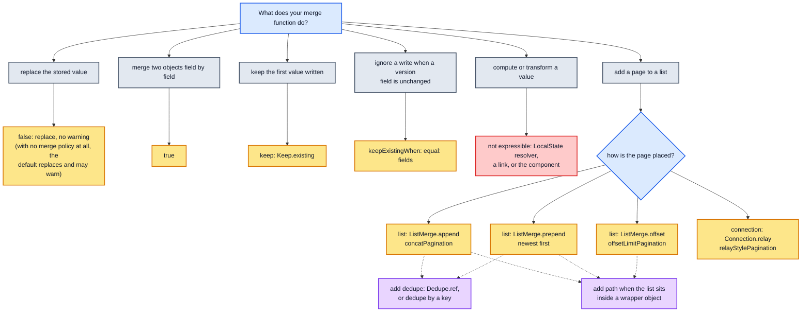
```mermaid
flowchart TB
    Q["What does your merge function do?"]:::api
    R1["replace the stored value"]:::ext
    R2["merge two objects field by field"]:::ext
    R3["add a page to a list"]:::ext
    R4["keep the first value written"]:::ext
    R5["ignore a write when a version<br/>field is unchanged"]:::ext
    R6["compute or transform a value"]:::ext

    D1["false: replace, no warning<br/>(with no merge policy at all, the<br/>default replaces and may warn)"]:::write
    D2["true"]:::write
    D4["keep: Keep.existing"]:::write
    D5["keepExistingWhen: equal: fields"]:::write
    D6["not expressible: LocalState resolver,<br/>a link, or the component"]:::dirty

    P1{"how is the page placed?"}:::api
    L1["list: ListMerge.append<br/>concatPagination"]:::write
    L2["list: ListMerge.prepend<br/>newest first"]:::write
    L3["list: ListMerge.offset<br/>offsetLimitPagination"]:::write
    L4["connection: Connection.relay<br/>relayStylePagination"]:::write
    X1["add dedupe: Dedupe.ref,<br/>or dedupe by a key"]:::memo
    X2["add path when the list sits<br/>inside a wrapper object"]:::memo

    Q --> R1 --> D1
    Q --> R2 --> D2
    Q --> R3 --> P1
    Q --> R4 --> D4
    Q --> R5 --> D5
    Q --> R6 --> D6
    P1 --> L1 & L2 & L3 & L4
    L1 & L2 -.-> X1
    L1 & L2 & L3 -.-> X2

    classDef api fill:#dbeafe,stroke:#2563eb,stroke-width:2px,color:#0f172a
    classDef write fill:#fde68a,stroke:#d97706,stroke-width:2px,color:#0f172a
    classDef memo fill:#e9d5ff,stroke:#7c3aed,stroke-width:2px,color:#0f172a
    classDef dirty fill:#fecaca,stroke:#dc2626,stroke-width:2px,color:#0f172a
    classDef ext fill:#e2e8f0,stroke:#475569,stroke-width:2px,color:#0f172a
```

| Merge descriptor | Replaces |
| --- | --- |
| `true` / `false` | `merge: true` (`mergeObjects`) / `merge: false` (replace, no data-loss warning) |
| `{ list: ListMerge.append }`, `{ list: ListMerge.prepend }` | `concatPagination()`, `[...existing, ...incoming]`, and the newest-first form |
| `{ list: …, dedupe: Dedupe.ref }`, `{ list: …, dedupe: { by: KeySpecifier } }` | appending only references, or only items with a key, not already present |
| `{ list: ListMerge.offset, offsetArg? }` | `offsetLimitPagination()`: splice at `args[offsetArg]`, leaving holes before it; append when there are no `args` |
| `{ …a list descriptor, path: "items" }` | a list inside a wrapper object |
| `{ connection: Connection.relay }` | `relayStylePagination()`, read and merge together |
| `{ keep: Keep.existing }` | first write wins: `existing ?? incoming` |
| `{ keepExistingWhen: { equal: [fieldNames] } }` | the version guard of [Apollo performance §7.4](../../research/performance/07-structural-stress.md#74-the-untyped-blob-pathology); the one descriptor with no Apollo helper |

| Read descriptor | Replaces |
| --- | --- |
| `{ default: <JSON value> }` | `read(existing = value)` |
| `{ redirect: { typename, keyArgs: { keyField: argName } }, when?: RedirectWhen.always \| RedirectWhen.missing }` | a cache redirect with `toReference`; `RedirectWhen.missing` is the `existing ?? toReference(…)` form |
| `{ list: ListRead.slice, offsetArg?, limitArg? }` | reading one page out of an offset-merged list |
| `{ list: ListRead.sort, by: KeySpecifier, order?: SortOrder }` | sorting a list by a field of its items |
| `{ connection: Connection.relay }` | the read half of `relayStylePagination()` |

**Rules.** Pagination and connection descriptors default `keyArgs` to `false`, as the
helpers do. A field with both a read and a merge descriptor counts as defining both (for
the implicit `keyArgs: false`). A read and a merge descriptor on one field must agree on
their list mode. A list keeps holes distinct from `null`; after a JSON round trip the holes
are `null`s. The catalogue grows by amending ADR 0004, one descriptor at a time, each with
the Apollo tests it mirrors. Adopters propose candidates with a
[descriptor request](https://github.com/convict-git/fast-gql-cache-rs/issues/new?template=descriptor-request.yml); one qualifies when it is an
idiom other applications share, not one application's logic.

**What stays out** because no closed vocabulary covers it without becoming a programming
language: computed fields (use an `@client` field with a `LocalState` resolver, or a
selector), fields backed by reactive variables (`useReactiveVar`, or local state written
with `writeQuery`), value transforms on read or write (a link, the component, or the
server), and accumulating state (outside the cache).

### 7.3 Validation and the policy table

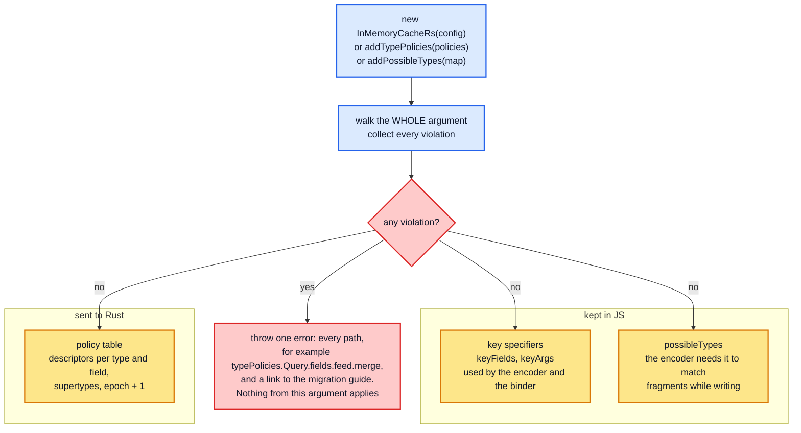
```mermaid
flowchart TB
    IN["new InMemoryCacheRs(config)<br/>or addTypePolicies(policies)<br/>or addPossibleTypes(map)"]:::api
    WALK["walk the WHOLE argument<br/>collect every violation"]:::api
    BAD{"any violation?"}:::dirty
    THROW["throw one error: every path,<br/>for example typePolicies.Query.fields.feed.merge,<br/>and a link to the migration guide.<br/>Nothing from this argument applies"]:::dirty
    subgraph js["kept in JS"]
        KS["key specifiers<br/>keyFields, keyArgs<br/>used by the encoder and the binder"]:::write
        PT["possibleTypes<br/>the encoder needs it to match<br/>fragments while writing"]:::write
    end
    subgraph rs["sent to Rust"]
        RT["policy table<br/>descriptors per type and field,<br/>supertypes, epoch + 1"]:::write
    end

    IN --> WALK --> BAD
    BAD -->|"yes"| THROW
    BAD -->|"no"| KS & PT
    BAD -->|"no"| RT

    classDef api fill:#dbeafe,stroke:#2563eb,stroke-width:2px,color:#0f172a
    classDef write fill:#fde68a,stroke:#d97706,stroke-width:2px,color:#0f172a
    classDef dirty fill:#fecaca,stroke:#dc2626,stroke-width:2px,color:#0f172a
```

- **TypeScript users see the rejected shapes as compile errors**, because
  `InMemoryCacheRsConfig` is this package's own type, not an extension of Apollo's.
- **The error is thrown, not logged.** There is no warn-and-ignore mode (maintainer).
- **A subtype's policy is built from its supertypes the first time it is used**, and later
  changes to a supertype do not reach it, as in Apollo (`cache/inmemory/policies.ts:649-669`).
  The Rust table keeps that first-use snapshot rather than compiling eagerly.
- **The policy epoch governs new bindings only.** Like Apollo, a policy change does not
  invalidate results already memoized ([§8.2](#82-field-keys-and-bindings)).
- **`possibleTypes` lives on both sides** (**Proposed**): the encoder needs it to decide
  which fragments apply to an object while it writes, and the reader needs it while it
  reads. It is small, and it changes only through `addPossibleTypes`.
- The profile, its validation and the migration guide ship at step 2, on top of today's
  delegating cache, so adopters can check their configuration before the engine exists.
  After v1, the migration skill rewrites imperative `typePolicies` into the profile, from
  the same catalogue and validation
  ([ADR 0004, maintainer decisions](../../adr/0004-declarative-policies-rust-engine.md#maintainer-decisions)).

## 8. Names: entity ids, field keys and interned strings

Some strings are observable, so they must be exactly Apollo's: entity ids (`cache.identify`,
`extract()` keys, `evict({ id })`), store field names (`extract()`, modifier `details`),
and missing-field messages. They are built by the same JavaScript functions Apollo uses,
once per distinct value, interned, and Rust computes over the ids
([contract 5](../../adr/0004-declarative-policies-rust-engine.md#4-the-contracts)).

### 8.1 Entity ids

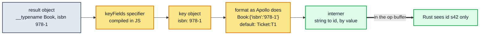
```mermaid
flowchart LR
    OBJ["result object<br/>__typename Book, isbn 978-1"]:::ext
    KF["keyFields specifier<br/>compiled in JS"]:::write
    KO["key object<br/>isbn: 978-1"]:::write
    FMT["format as Apollo does<br/>Book:{'isbn':'978-1'}<br/>default: Ticket:T1"]:::write
    INT["interner<br/>string to id, by value"]:::store
    RS["Rust sees id s42 only"]:::store
    OBJ --> KF --> KO --> FMT --> INT
    INT ==>|"in the op buffer"| RS

    classDef write fill:#fde68a,stroke:#d97706,stroke-width:2px,color:#0f172a
    classDef store fill:#dcfce7,stroke:#16a34a,stroke-width:2px,color:#0f172a
    classDef ext fill:#e2e8f0,stroke:#475569,stroke-width:2px,color:#0f172a
```

The encoder already holds each entity's key values while it walks the result, so it
evaluates `keyFields` and formats the id itself, with `JSON.stringify` of the key object in
the specifier's order (P2), or `__typename:id` by default. Rust never sees `keyFields`.

### 8.2 Field keys and bindings

A field's store key depends on its arguments, and also on the policy of the entity's
typename. Under one selection set, a `Widget` whose `value` field has `keyArgs: false`
stores `value`, while a `Gadget` whose `value` has `keyArgs: ["x"]` stores
`value:{"x":1}` (review #15). So a plan is **bound** once per `(plan, variables, policy
epoch)`: the binder computes, for every field, a default key plus overrides for the
typenames whose policies define that field, and Rust picks by typename while it reads or
writes, without asking JS.

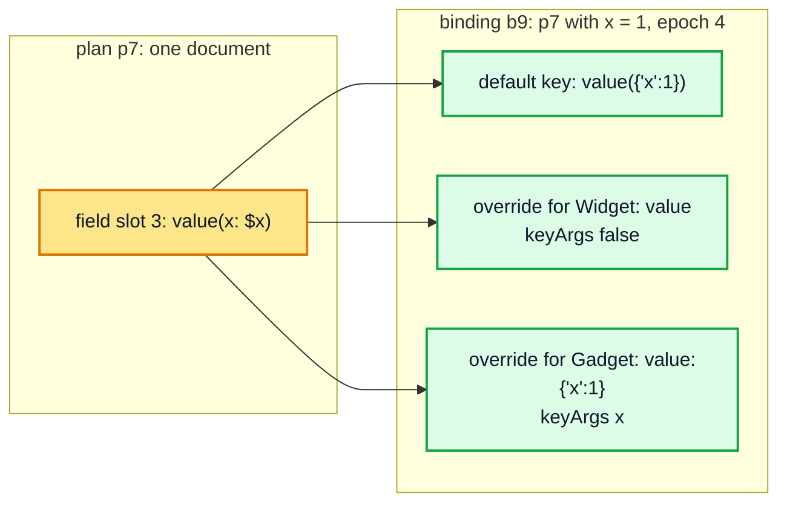
```mermaid
flowchart LR
    subgraph plan["plan p7: one document"]
        F1["field slot 3: value(x: $x)"]:::write
    end
    subgraph binding["binding b9: p7 with x = 1, epoch 4"]
        DEF["default key: value({'x':1})"]:::store
        O1["override for Widget: value<br/>keyArgs false"]:::store
        O2["override for Gadget: value:{'x':1}<br/>keyArgs x"]:::store
    end
    F1 --> DEF & O1 & O2

    classDef write fill:#fde68a,stroke:#d97706,stroke-width:2px,color:#0f172a
    classDef store fill:#dcfce7,stroke:#16a34a,stroke-width:2px,color:#0f172a
```

- A typename first met after the binding was made takes the default.
- A policy change bumps the epoch, and new bindings use the new policies. Results memoized
  under an older binding stay, as they do in Apollo (#17).
- Redirect targets (`ticket(id: "T1")` → `Ticket:T1`) are computed by the binder too, since
  the arguments are known once the variables are.
- This split is a prototype candidate that E10 measures, with redirects, composite keys and
  sorting over interned strings as its test cases. Sorting is the awkward one: Rust holds
  ids, not text, so a `ListRead.sort` over string fields needs an order that JS provides.

### 8.3 Interned strings

Every string value, not only keys, is interned by value in JS (`Map` from string to id), so
Rust never decodes UTF-8 on a hot path, and an unchanged string compares as an integer.
Ids are reference-counted by Rust and freed when their last holder goes; an id that is
reused carries a generation, so a stale lookup can never alias a new string
([contract 14](../../adr/0004-declarative-policies-rust-engine.md#4-the-contracts)).

## 9. The store

The store keeps Apollo's model: a flat map of entities, a durable `Root`, a permanent
`Stump`, and optimistic `Layer`s above it
([Apollo architecture Part 2](../../research/architecture/02-normalized-store.md)). What changes is where it
lives and how values are represented.

### 9.1 Levels: Root, Stump and Layers

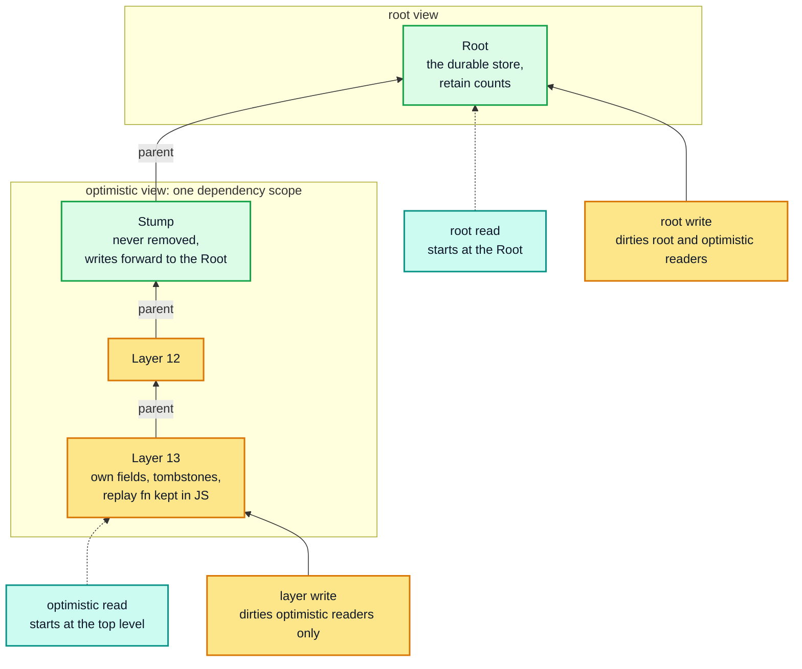
```mermaid
flowchart BT
    subgraph opt["optimistic view: one dependency scope"]
        direction BT
        L2["Layer 13<br/>own fields, tombstones,<br/>replay fn kept in JS"]:::write
        L1["Layer 12"]:::write
        ST["Stump<br/>never removed,<br/>writes forward to the Root"]:::store
    end
    subgraph root["root view"]
        RT["Root<br/>the durable store,<br/>retain counts"]:::store
    end
    L2 -->|"parent"| L1 -->|"parent"| ST -->|"parent"| RT

    OR["optimistic read<br/>starts at the top level"]:::read -.-> L2
    RR["root read<br/>starts at the Root"]:::read -.-> RT
    RW["root write<br/>dirties root and optimistic readers"]:::write --> RT
    LW["layer write<br/>dirties optimistic readers only"]:::write --> L2

    classDef read fill:#ccfbf1,stroke:#0d9488,stroke-width:2px,color:#0f172a
    classDef write fill:#fde68a,stroke:#d97706,stroke-width:2px,color:#0f172a
    classDef store fill:#dcfce7,stroke:#16a34a,stroke-width:2px,color:#0f172a
```

- **Two views, two memo sets.** Optimistic reads start at the top level (the `Stump` when
  there is no layer) and root reads at the `Root`. They never share memo entries or result
  objects (L2), because `ObservableQuery` compares the two to avoid network requests during
  an optimistic update ([§9.3](../../research/architecture/09-invariants-and-checklist.md#93-cross-boundary-requirements)).
- **Dirtying follows L5.** An optimistic read depends on its fields in both scopes, so a
  root write dirties root and optimistic readers, and a layer write dirties optimistic
  readers only.
- **A layer snapshots the whole entity it writes**, so a later root write to a field it did
  not write stays hidden from optimistic reads, as in Apollo (F9, experiment E2). The
  per-field alternative is a registered *candidate* drift, not a decision
  ([drift register](../../compatibility.md#candidates)).
- **`batch({ optimistic })` keeps its three modes**: a string adds a layer and runs the
  update into it, `false` runs it against the `Root`, and `true` (the default) only batches
  broadcasts ([Apollo architecture §6.4](../../research/architecture/06-reactivity.md#64-batch--the-transactional-api)).
  The shell implements the modes by choosing the write target level for the calls the
  update function makes.

**Removing a layer that is not on top** (**Proposed**). Apollo rebuilds every layer above
the removed one by calling its replay function again, against the new parent (L4,
[Apollo architecture §2.10](../../research/architecture/02-normalized-store.md#210-layer-removal-and-replay)).
The replay functions are JS, so the shell drives the rebuild:

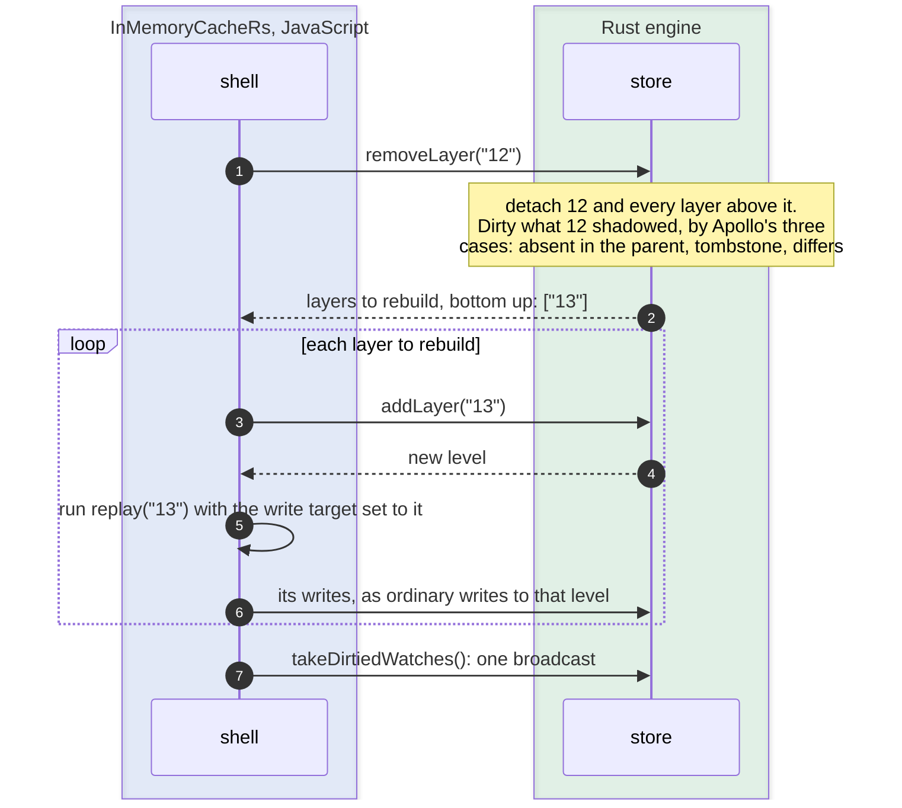
```mermaid
sequenceDiagram
    autonumber
    box rgba(37, 99, 235, 0.10) InMemoryCacheRs, JavaScript
        participant SH as shell
    end
    box rgba(22, 163, 74, 0.10) Rust engine
        participant RS as store
    end

    SH->>RS: removeLayer("12")
    Note over RS: detach 12 and every layer above it.<br/>Dirty what 12 shadowed, by Apollo's three<br/>cases: absent in the parent, tombstone, differs
    RS-->>SH: layers to rebuild, bottom up: ["13"]
    loop each layer to rebuild
        SH->>RS: addLayer("13")
        RS-->>SH: new level
        SH->>SH: run replay("13") with the write target set to it
        SH->>RS: its writes, as ordinary writes to that level
    end
    SH->>RS: takeDirtiedWatches(): one broadcast
```

Whether this reproduces Apollo's dirtying exactly, including for fields the rebuilt layer
writes to the same value it held before, is [Q3](04-getting-there.md#23-open-questions). Probe section 6
(layer A writes "optimistic-A", layer B appends "+B", removing A yields "server+B") and
Apollo's `optimistic.ts` suite are the oracle.

### 9.2 The state of one entity and one field

The state model is ADR 0001's contract 3, kept unchanged
([contract 10](../../adr/0004-declarative-policies-rust-engine.md#4-the-contracts)). At each
level, an entity is in one of three states, and each field of an entity snapshot in one
of two:

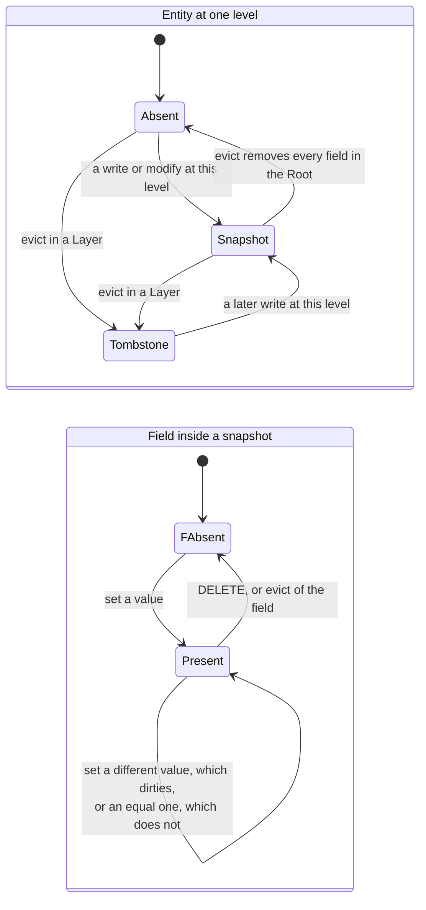
```mermaid
stateDiagram-v2
    direction LR
    state "Entity at one level" as E {
        [*] --> Absent
        Absent --> Snapshot : a write or modify at this level
        Snapshot --> Absent : evict removes every field in the Root
        Absent --> Tombstone : evict in a Layer
        Snapshot --> Tombstone : evict in a Layer
        Tombstone --> Snapshot : a later write at this level
    }
    state "Field inside a snapshot" as F {
        [*] --> FAbsent
        FAbsent --> Present : set a value
        Present --> Present : set a different value, which dirties,<br/>or an equal one, which does not
        Present --> FAbsent : DELETE, or evict of the field
    }
```

- **Absent** asks the parent level; a **tombstone** (layers only) hides the parent's entity;
  a **snapshot** holds this level's own fields.
- A present field may hold `undefined` at any level. A layer keeps it as a mask; the `Root`
  drops it at once, since `resultCaching` is always on.
- `lookup`, `toObject` and `modify` see only a snapshot's own fields. `DELETE` and
  `INVALIDATE` are instructions, never stored values.
- Own-property presence, stored-value identity, reconciliation equality and invalidation are
  **four separate contracts**, and no encoding may collapse two of them into one.

### 9.3 Values: the arena, and two ids per value

Everything Rust stores that has structure (lists, references, embedded objects with a
selection set) lives in a **value arena**, interned bottom-up by the ids of its children
(**hash-consing**). Two equal structures are one value with one id, so comparing a stored
list with an incoming one is one integer comparison, however long the list
([Apollo performance §9.4](../../research/performance/09-optimization-playbook.md#94-what-a-rustwasm-re-implementation-should-target), item 1).

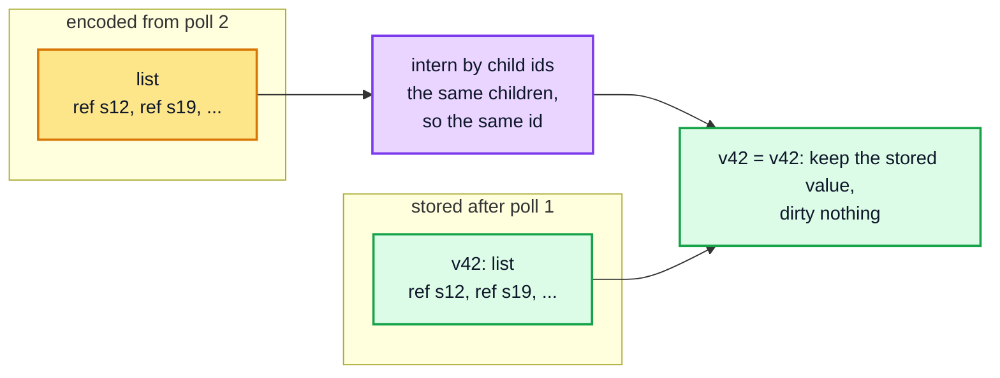
```mermaid
flowchart LR
    subgraph poll1["stored after poll 1"]
        V42["v42: list<br/>ref s12, ref s19, ..."]:::store
    end
    subgraph poll2["encoded from poll 2"]
        IN["list<br/>ref s12, ref s19, ..."]:::write
    end
    H["intern by child ids<br/>the same children,<br/>so the same id"]:::memo
    K["v42 = v42: keep the stored value,<br/>dirty nothing"]:::store
    IN --> H --> K
    V42 --> K

    classDef write fill:#fde68a,stroke:#d97706,stroke-width:2px,color:#0f172a
    classDef store fill:#dcfce7,stroke:#16a34a,stroke-width:2px,color:#0f172a
    classDef memo fill:#e9d5ff,stroke:#7c3aed,stroke-width:2px,color:#0f172a
```

Apollo reconciles with `@wry/equality` (`-0` equals `0`, `NaN` equals `NaN`) but dirties by
`!==`, and each field keeps the sign it was written with. One id cannot express both rules,
so each value has two:

- a **representation id**, by `Object.is`: `-0` and `+0` differ;
- an **equivalence id**, with `-0` read as `0` and one canonical `NaN`. Equal equivalence ids
  mean reconciliation keeps the existing value.

| Stored | Written | Kept | Dirtied | As Apollo (F10, E4) |
| --- | --- | --- | --- | --- |
| `7` | `7` | the stored `7` | no | yes |
| `-0` | `0` | the stored `-0` | no | yes |
| `NaN` | `NaN` | the stored `NaN` | **yes**: `NaN !== NaN` | yes |
| a list holding `NaN` | an equal list | the stored list, by reference | no | yes (#37) |
| a list of 5 000 references | an equal new array | the stored list | no; `O(1)` here, an `O(N)` `equal()` in Apollo | yes |
| a JSON blob | an equal new object | the stored object | no; `equal()` in JS, as in Apollo | yes |

JSON blobs and custom scalars are deliberately **not** interned: interning costs `O(B)` on
every write where `equal()` stops at the first difference, doubles the blob's memory, and
loses the written object's identity. They are leaf slots ([§10.3](#103-leaf-slots-and-the-two-phase-commit)).

## 10. The write engine

### 10.1 The pipeline

Each stage keeps one or more of Apollo's write invariants
([Apollo architecture §9.1](../../research/architecture/09-invariants-and-checklist.md#91-the-invariants),
Writes).

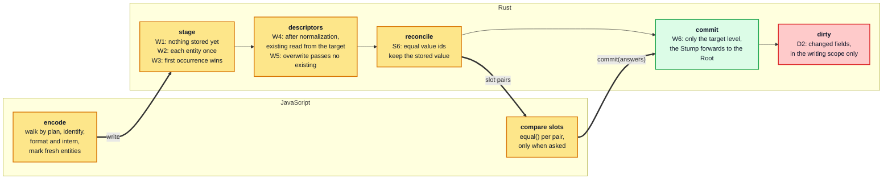
```mermaid
flowchart LR
    subgraph js["JavaScript"]
        direction TB
        E1["<b>encode</b><br/>walk by plan, identify,<br/>format and intern,<br/>mark fresh entities"]:::write
        E2["<b>compare slots</b><br/>equal() per pair,<br/>only when asked"]:::write
    end
    subgraph rs["Rust"]
        direction TB
        S1["<b>stage</b><br/>W1: nothing stored yet<br/>W2: each entity once<br/>W3: first occurrence wins"]:::write
        S2["<b>descriptors</b><br/>W4: after normalization,<br/>existing read from the target<br/>W5: overwrite passes no existing"]:::write
        S3["<b>reconcile</b><br/>S6: equal value ids<br/>keep the stored value"]:::write
        S4["<b>commit</b><br/>W6: only the target level,<br/>the Stump forwards to the Root"]:::store
        S5["<b>dirty</b><br/>D2: changed fields,<br/>in the writing scope only"]:::dirty
        S1 --> S2 --> S3 --> S4 --> S5
    end
    E1 ==>|"write"| S1
    S3 ==>|"slot pairs"| E2
    E2 ==>|"commit(answers)"| S4

    classDef write fill:#fde68a,stroke:#d97706,stroke-width:2px,color:#0f172a
    classDef store fill:#dcfce7,stroke:#16a34a,stroke-width:2px,color:#0f172a
    classDef dirty fill:#fecaca,stroke:#dc2626,stroke-width:2px,color:#0f172a
```

- **Staging** writes into arenas that the next write reuses, so a write allocates nothing
  per field in steady state (Apollo allocates 18.8 KiB per entity per write, about 97 % of
  it garbage, [Apollo performance §10.3](../../research/performance/10-memory.md#103-allocation-what-an-operation-throws-away)).
- **Descriptors** see `existing` through the level being written, and `overwrite: true`
  (a refetch with `refetchWritePolicy: "overwrite"`) hands them no `existing`, as Apollo
  hands custom merge functions `undefined` (W5).
- **Development warnings** (the data-loss warning, missing fields) are returned as codes and
  ids, and JS formats and prints them, so their text stays Apollo's.

### 10.2 `isFresh`: writing back what was read

A common pattern reads a query, changes something, and writes the result back. Apollo's
writer recognizes an entity object that its reader handed out unchanged and skips staging
it, so its merge functions do not run again. Without that, writing back through an append
merge appends the page twice (F3, [experiment E1](../../adr/0001-js-rust-wasm-boundary.md#evidence)):

```js
// Post.tags has a merge function that appends: [...existing, ...incoming]
cache.writeQuery({ query, data: { post: { __typename: "Post", id: 1, tags: ["a"] } } });
const r = cache.readQuery({ query });
cache.writeQuery({ query, data: r });                             // tags: ["a"]       merge calls: 0
cache.writeQuery({ query, data: JSON.parse(JSON.stringify(r)) }); // tags: ["a", "a"]  merge calls: 1
```

This design keeps it ([contract 6](../../adr/0004-declarative-policies-rust-engine.md#4-the-contracts)):

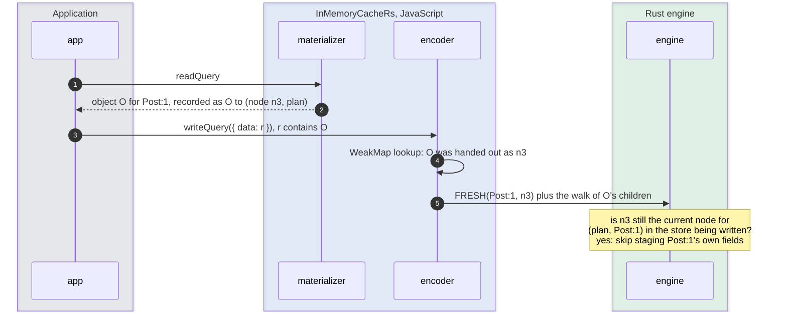
```mermaid
sequenceDiagram
    autonumber
    box rgba(71, 85, 105, 0.10) Application
        participant APP as app
    end
    box rgba(37, 99, 235, 0.10) InMemoryCacheRs, JavaScript
        participant MAT as materializer
        participant ENC as encoder
    end
    box rgba(22, 163, 74, 0.10) Rust engine
        participant RS as engine
    end

    APP->>MAT: readQuery
    MAT-->>APP: object O for Post:1, recorded as O to (node n3, plan)
    APP->>ENC: writeQuery({ data: r }), r contains O
    ENC->>ENC: WeakMap lookup: O was handed out as n3
    ENC->>RS: FRESH(Post:1, n3) plus the walk of O's children
    Note over RS: is n3 still the current node for<br/>(plan, Post:1) in the store being written?<br/>yes: skip staging Post:1's own fields
```

- **"Current" is exact** because an entity-level memo entry gets a new node every time it
  recomputes, even when the new content is equal
  ([§11.2](#112-memo-entries-and-result-nodes)). So after an `INVALIDATE` and a reread,
  writing back the result read *before* runs the merges again, and writing back the
  reread one does not, as in Apollo (`[1, 1]` against `[1]`, review #12).
- **The encoder still walks the subtree below a fresh entity**, because Apollo processes the
  children before it tests the parent's freshness, so a child can still be written
  (`cache/inmemory/writeToStore.ts:359-369`, `:478-483`, review #40). Skipping the walk
  needs its own proof, which does not exist yet.

### 10.3 Leaf slots and the two-phase commit

A field stored without a selection set (a JSON blob, a custom scalar, a `Date`) is kept as
the application's own object in a **leaf slot** in JS, and Rust stores the slot id. A read
returns that very object, as Apollo's production build does, and a `Date` keeps its
identity (F5). When a write meets a slot field that is already stored:

| Incoming | What happens | Cost |
| --- | --- | --- |
| the same object (`===`) | unchanged; nothing crosses | `O(1)` |
| a different object | Rust stages the write and returns the pair; JS runs `equal()`; Rust commits with the answer | `O(B)`, stopping at the first difference, as in Apollo |

Polling hands every blob over as a new object, so a board with a `meta` blob per ticket pays
5 000 `equal()` calls per poll, in either cache. E10 measures comparing all pairs in one
pass against Apollo's order (one entity at a time, each committed before the next). A
descriptor that looks inside a blob (`keepExistingWhen`) gets the named fields extracted by
the encoder, which already holds the object.

### 10.4 Errors and re-entrancy

| Situation | Behaviour |
| --- | --- |
| a cache call that mutates, made while a write is being encoded or compared | a checked re-entrancy error |
| a cache read made at that time | sees the store as it was before the write |
| `equal()` throws, or a blob overflows the stack | the staged write is discarded, nothing is committed, the original value is rethrown, watches are broadcast in `finally` (registered drift of W1) |
| a callback throws during that `finally` broadcast | its error replaces the original, as in Apollo |
| a node id counter would pass 2⁵³ | a checked error; ids never wrap ([§12.3](#123-the-broadcast-loop-and-its-gates)) |
| a bug in the engine (a panic) | a trap; the instance is poisoned ([§15](#15-failure-model)) |
| any call on a disposed cache | a checked "disposed" error |

## 11. The reader and the result memo

### 11.1 Plans and bindings

A **plan** is a compiled selection structure: the fields, the nested selections, the type
conditions of fragments and the directives that matter, for one transformed
`DocumentNode`, compiled once and cached against the document object. A **binding** is a
plan applied to one set of variables and one policy epoch ([§8.2](#82-field-keys-and-bindings)).
Reads and writes both run over bindings, so the per-field work Apollo repeats on every
object (`getStoreFieldName`, `getMergeFunction`, `flattenFields`) happens once per binding
([Apollo performance §9.4](../../research/performance/09-optimization-playbook.md#94-what-a-rustwasm-re-implementation-should-target), item 3).

Until step 6, plans are per document object, exactly as Apollo's memo is per
`SelectionSetNode`. Sharing one plan between separately parsed identical documents removes
the 128× cliff of [Apollo performance §4.5](../../research/performance/04-dependency-graph-and-broadcast.md#45-memo-fragmentation-by-document-identity),
but it is observable: after `addTypePolicies`, Apollo keeps a warmed document's old result
while a newly parsed identical document reads the new one (review #17). So it needs its own
oracle case and a register entry.

### 11.2 Memo entries and result nodes

A **memo entry** is keyed by `(plan node, entity or embedded parent, view)` within one
binding, so the variables are part of the key, as they are in Apollo's
`(selectionSet, parent, varString)` key (R1). It holds one **result node**: a record of ids (scalars inline, string ids, slot ids, child node ids). A
read of a clean entry is a lookup. A read of a dirty entry recomputes it, and its children
are lookups unless they are dirty too.

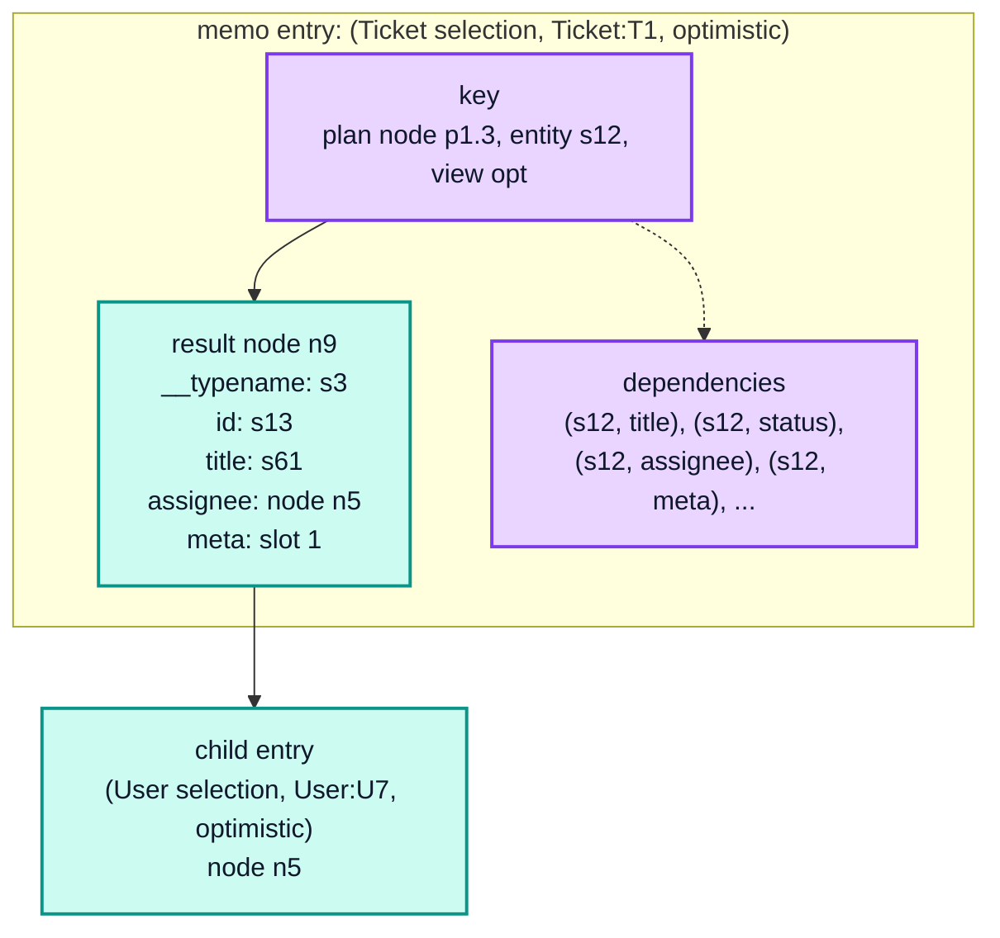
```mermaid
flowchart TB
    subgraph entry["memo entry: (Ticket selection, Ticket:T1, optimistic)"]
        direction LR
        K["key<br/>plan node p1.3, entity s12, view opt"]:::memo
        N["result node n9<br/>__typename: s3<br/>id: s13<br/>title: s61<br/>assignee: node n5<br/>meta: slot 1"]:::read
        D["dependencies<br/>(s12, title), (s12, status),<br/>(s12, assignee), (s12, meta), ..."]:::memo
        K --> N
        K -.-> D
    end
    CH["child entry<br/>(User selection, User:U7, optimistic)<br/>node n5"]:::read
    N --> CH

    classDef read fill:#ccfbf1,stroke:#0d9488,stroke-width:2px,color:#0f172a
    classDef memo fill:#e9d5ff,stroke:#7c3aed,stroke-width:2px,color:#0f172a
```

**Nodes are stable per memo entry, not shared globally** ([§5 of ADR 0004](../../adr/0004-declarative-policies-rust-engine.md#5-where-javascript-objects-live-the-frontier)):

- **Below the entity level** (lists, embedded objects), an entry that recomputes to equal
  content keeps its old node: Rust compares the new content with the old shallowly, scalars
  by id and children by node id. Nothing above it changes. `optimism` has this
  short-circuit, but Apollo can rarely use it, because its reader builds a new object on
  every run.
- **At the entity level**, an entry that recomputes always gets a new node, even when the
  content is equal, because `isFresh` tests entity-level objects and Apollo's write-back
  semantics depend on it (maintainer's decision, [§10.2](#102-isfresh-writing-back-what-was-read)).
- **Deliberately not shared**: equal embedded objects in two places, and optimistic and
  root reads of the same data. Sharing them would change identity in ways Apollo never
  does and would make the `isFresh` map ambiguous. Stored *values*, which nobody sees as
  objects, are hash-consed ([§9.3](#93-values-the-arena-and-two-ids-per-value)).

### 11.3 When an entry recomputes

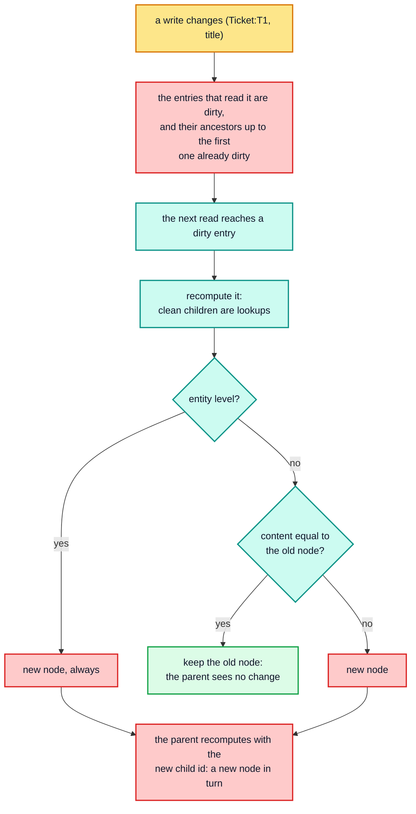
```mermaid
flowchart TB
    W["a write changes (Ticket:T1, title)"]:::write
    D["the entries that read it are dirty,<br/>and their ancestors up to the first<br/>one already dirty"]:::dirty
    R["the next read reaches a dirty entry"]:::read
    RC["recompute it:<br/>clean children are lookups"]:::read
    LV{"entity level?"}:::read
    NEW["new node, always"]:::dirty
    EQ{"content equal to<br/>the old node?"}:::read
    KEEP["keep the old node:<br/>the parent sees no change"]:::store
    NEW2["new node"]:::dirty
    UP["the parent recomputes with the<br/>new child id: a new node in turn"]:::dirty

    W --> D --> R --> RC --> LV
    LV -->|"yes"| NEW --> UP
    LV -->|"no"| EQ
    EQ -->|"yes"| KEEP
    EQ -->|"no"| NEW2 --> UP

    classDef read fill:#ccfbf1,stroke:#0d9488,stroke-width:2px,color:#0f172a
    classDef write fill:#fde68a,stroke:#d97706,stroke-width:2px,color:#0f172a
    classDef store fill:#dcfce7,stroke:#16a34a,stroke-width:2px,color:#0f172a
    classDef dirty fill:#fecaca,stroke:#dc2626,stroke-width:2px,color:#0f172a
```

The rebuilt list in [§5.4](02-how-data-moves.md#54-the-next-poll-one-ticket-changed) is this rule at work: T1's
entry gets a new node, so the list's content changes (one child id differs), so the list
and the root get new nodes, and the 4 999 other tickets keep theirs.

### 11.4 Missing data

Missing trees (which fields could not be read, and why) are built in Rust from ids, and
their messages ("Can't find field 'x' on Y object") are formatted in JS by Apollo's own
code. The reader keeps Apollo's read invariants
([Apollo architecture §9.1](../../research/architecture/09-invariants-and-checklist.md#91-the-invariants),
Reads):

- **R4**: a dangling reference in a list is filtered out and the read stays complete; in a
  singular field it makes the read incomplete.
- **R5**: `read` returns `null` for an incomplete result unless `returnPartialData`; `diff`
  always reports `complete` and `missing`.
- **R6**: every non-root result object carries `__typename`.
- Read descriptors apply here: a `default` fills a missing field, a `redirect` follows a
  reference the binder computed, `slice` and `sort` shape a list, `relay` derives
  `pageInfo`.

## 12. Invalidation and broadcast

### 12.1 Dependencies

A read registers, for each field it reads, a dependency on `(entity, storeFieldName)`, on
the bare field name for a field with arguments, and on the entity's existence
(`__exists`). These are integer pairs in Rust, where Apollo keeps a key string and a `Set`
per field per entry. D1 to D3 and L5 are the specification
([contract 8](../../adr/0004-declarative-policies-rust-engine.md#4-the-contracts)).

### 12.2 Dirtying, and why it stays `O(D)`

A write dirties the entries that depend on a changed field, and propagation climbs to the
parents, stopping at the first ancestor that is already dirty. Dirtying a leaf at depth `D`
costs `O(D)`.

Apollo's quadratic cost is elsewhere, in the **re-read**. When a child entry registers as
clean under a parent that is only "dirty by a child", `optimism` reports clean to *its*
parent, and so on to the root; after a leaf change in a chain of `D` entities that is
exactly `D(D + 1) / 2` reports: 2 080 at `D = 64`
([Apollo performance §3.3](../../research/performance/03-read-path.md#33-invalidation-blast-radius--the-single-most-important-read-path-concept)).
The Rust reader has no "dirty by a child" state to report through, so its re-read is
`O(D)` too. E11 measures the re-read at `D` = 64 to 512, not only the dirtying.

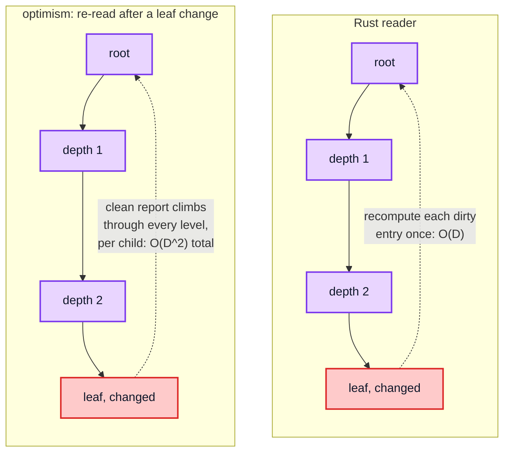
```mermaid
flowchart LR
    subgraph apollo["optimism: re-read after a leaf change"]
        direction TB
        A0["root"]:::memo
        A1["depth 1"]:::memo
        A2["depth 2"]:::memo
        A3["leaf, changed"]:::dirty
        A0 --> A1 --> A2 --> A3
        A3 -.->|"clean report climbs<br/>through every level,<br/>per child: O(D^2) total"| A0
    end
    subgraph rust["Rust reader"]
        direction TB
        B0["root"]:::memo
        B1["depth 1"]:::memo
        B2["depth 2"]:::memo
        B3["leaf, changed"]:::dirty
        B0 --> B1 --> B2 --> B3
        B3 -.->|"recompute each dirty<br/>entry once: O(D)"| B0
    end
    apollo ~~~ rust

    classDef memo fill:#e9d5ff,stroke:#7c3aed,stroke-width:2px,color:#0f172a
    classDef dirty fill:#fecaca,stroke:#dc2626,stroke-width:2px,color:#0f172a
```

### 12.3 The broadcast loop and its gates

Apollo has three gates between a write and a watch callback
([Apollo architecture §6.2](../../research/architecture/06-reactivity.md#62-broadcastwatch-and-the-equality-gate)):
the memo gate (the watch's entry is clean), `onWatchUpdated` returning `false`, and the
equality gate. This design keeps all three, and changes how the first and the last are
decided.

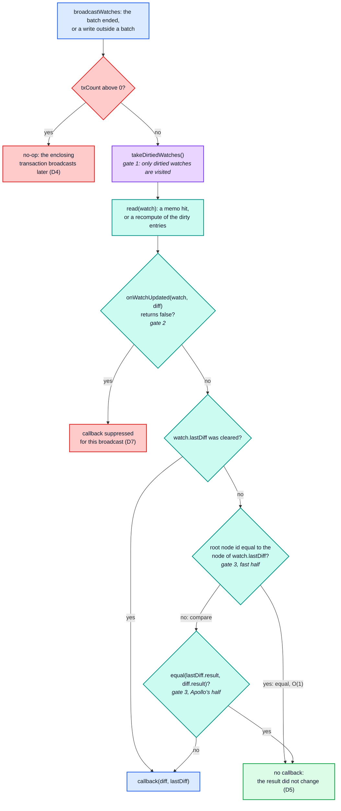
```mermaid
flowchart TB
    T["broadcastWatches: the batch ended,<br/>or a write outside a batch"]:::api
    TX{"txCount above 0?"}:::dirty
    NOOP["no-op: the enclosing<br/>transaction broadcasts later (D4)"]:::dirty
    TAKE["takeDirtiedWatches()<br/><i>gate 1: only dirtied watches are visited</i>"]:::memo
    RD["read(watch): a memo hit,<br/>or a recompute of the dirty entries"]:::read
    OWU{"onWatchUpdated(watch, diff)<br/>returns false?<br/><i>gate 2</i>"}:::read
    SUP["callback suppressed<br/>for this broadcast (D7)"]:::dirty
    LD{"watch.lastDiff was cleared?"}:::read
    FIRE["callback(diff, lastDiff)"]:::api
    SAME{"root node id equal to the<br/>node of watch.lastDiff?<br/><i>gate 3, fast half</i>"}:::read
    EQ{"equal(lastDiff.result, diff.result)?<br/><i>gate 3, Apollo's half</i>"}:::read
    SKIP["no callback:<br/>the result did not change (D5)"]:::store

    T --> TX
    TX -->|"yes"| NOOP
    TX -->|"no"| TAKE --> RD --> OWU
    OWU -->|"yes"| SUP
    OWU -->|"no"| LD
    LD -->|"yes"| FIRE
    LD -->|"no"| SAME
    SAME -->|"yes: equal, O(1)"| SKIP
    SAME -->|"no: compare"| EQ
    EQ -->|"yes"| SKIP
    EQ -->|"no"| FIRE

    classDef api fill:#dbeafe,stroke:#2563eb,stroke-width:2px,color:#0f172a
    classDef read fill:#ccfbf1,stroke:#0d9488,stroke-width:2px,color:#0f172a
    classDef store fill:#dcfce7,stroke:#16a34a,stroke-width:2px,color:#0f172a
    classDef memo fill:#e9d5ff,stroke:#7c3aed,stroke-width:2px,color:#0f172a
    classDef dirty fill:#fecaca,stroke:#dc2626,stroke-width:2px,color:#0f172a
```

- **Gate 1 visits only dirtied watches.** Apollo's loop visits every registered watch and
  builds a memo key for each (about 2 µs per watch,
  [Apollo performance §4.4](../../research/performance/04-dependency-graph-and-broadcast.md#44-broadcast-fan-out));
  here an unrelated write wakes no watch at all.
- **Gate 3 has a fast half.** The same root node id means the same content, so the callback
  is skipped in `O(1)`. Different ids mean "compare": the gate runs `equal()` on the two
  materialized results, which is cheap because unchanged children are `===` and `equal()`
  checks `===` before it walks. A node id can prove equality, never inequality, so it can
  skip work but never suppress a callback `equal()` would allow
  ([contract 9](../../adr/0004-declarative-policies-rust-engine.md#4-the-contracts)).
- **"Same id" is sound because node ids are never reused.** They count up from 0, cross as
  `f64` (exact to 2⁵³), and running out is a checked error. A freed node's id can outlive it
  in a `lastDiff` or the `isFresh` map without ever matching a new node.
- **A cleared `lastDiff` fires the callback**, as in Apollo. `ObservableQuery` clears it on
  purpose for queries with `@client @export` variables or forced resolvers
  ([Apollo architecture §8.2](../../research/architecture/08-client-pipeline.md#82-observablequery--the-caches-principal-client)).

### 12.4 `batch`, `onWatchUpdated` and the client's own writes

These are the cross-boundary requirements of
[Apollo architecture §9.3](../../research/architecture/09-invariants-and-checklist.md#93-cross-boundary-requirements),
and they are the shell's job:

- **The `WatchOptions` object passes through by reference**, extension fields included
  (`watcher`, `lastOwnDiff`), because client code sets them on the same object.
- **The `diff` object handed to `onWatchUpdated` is the one later handed to the callback.**
  `QueryInfo` stamps `watch.lastOwnDiff = diff` there, and `ObservableQuery` drops its own
  write by comparing the callback's argument with it by reference.
- **`batch` calls `onWatchUpdated` for every watch its update dirtied**, and only those.
  Apollo finds the watches that were already dirty before the update with a pre-pass that
  reads them with callbacks suppressed, then re-dirties them afterwards
  ([Apollo architecture §6.4](../../research/architecture/06-reactivity.md#64-batch--the-transactional-api)).
  **Proposed:** with dirty flags in Rust, the pre-pass becomes set operations. Take (and
  clear) the dirty set before the update; after it, broadcast the watches the update
  flagged, calling `onWatchUpdated`; then flag again the watches of the first set that
  were not delivered just now, as Apollo's `alreadyDirty` re-dirtying does
  (`cache/inmemory/inMemoryCache.ts`, `batch`). The pre-pass then needs no read. The only
  difference this RFC can find is which memo entries are warm afterwards
  ([Q6](04-getting-there.md#23-open-questions)).
- **`evict`, `modify` and `reset` stay instance-assignable**, because `QueryInfo` wraps them
  to count destructive operations for its feud breaker.

## 13. The frontier: the JavaScript objects the design keeps

Object identity is observable in a few places: read results (R2, React snapshots, memoized
children), write-backs (`isFresh`), leaf values the application wrote, and values handed to
modifiers. The design keeps a JS object exactly there, and Rust holds everything else as
ids. The JS side of that split is the **frontier**
([ADR 0004 §5](../../adr/0004-declarative-policies-rust-engine.md#5-where-javascript-objects-live-the-frontier)).

### 13.1 Its three parts

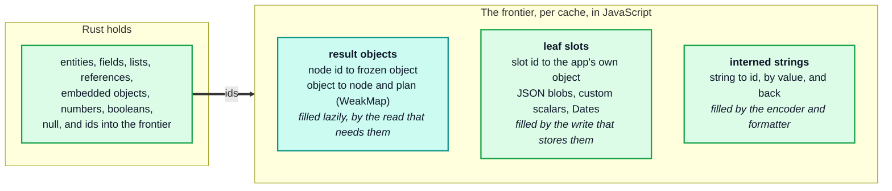
```mermaid
flowchart LR
    subgraph frontier["The frontier, per cache, in JavaScript"]
        direction TB
        RO["<b>result objects</b><br/>node id to frozen object<br/>object to node and plan (WeakMap)<br/><i>filled lazily, by the read that needs them</i>"]:::read
        LS["<b>leaf slots</b><br/>slot id to the app's own object<br/>JSON blobs, custom scalars, Dates<br/><i>filled by the write that stores them</i>"]:::store
        IS["<b>interned strings</b><br/>string to id, by value, and back<br/><i>filled by the encoder and formatter</i>"]:::store
    end
    subgraph rs["Rust holds"]
        R["entities, fields, lists, references,<br/>embedded objects, numbers, booleans,<br/>null, and ids into the frontier"]:::store
    end
    R ==>|"ids"| frontier

    classDef read fill:#ccfbf1,stroke:#0d9488,stroke-width:2px,color:#0f172a
    classDef store fill:#dcfce7,stroke:#16a34a,stroke-width:2px,color:#0f172a
```

- **It is updated synchronously, and lazily.** It changes only inside the cache call that
  needs it: a write fills slots and strings; a read, `diff` or broadcast materializes only
  the nodes it is about to return that are new. A batch of 100 writes followed by one
  broadcast materializes once, which is the saving `batch` exists for (53× in Apollo's
  probe, [Apollo performance §4.6](../../research/performance/04-dependency-graph-and-broadcast.md#46-batching)).
- **Each object is frozen once**, when it is materialized. Apollo's development build
  re-walks subtrees with `maybeDeepFreeze` on every read
  ([Apollo performance §3.6](../../research/performance/03-read-path.md#36-the-dev-build-tax)).
- **It is disposable, except the slots.** Dropping a result object costs a
  re-materialization from Rust's nodes, never a re-read of the store and never a wrong
  answer (contract 1). Slots are the store's data, referenced by id, and live as long as
  the store holds them.

### 13.2 Lifetime: pinned plus LRU

The frontier keeps a result object for as long as someone can still compare against it
(maintainer, 2026-09-26):

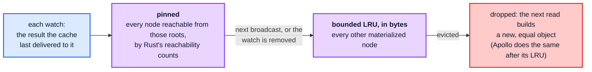
```mermaid
flowchart LR
    W["each watch:<br/>the result the cache<br/>last delivered to it"]:::api
    PIN["<b>pinned</b><br/>every node reachable from those roots,<br/>by Rust's reachability counts"]:::memo
    LRU["<b>bounded LRU, in bytes</b><br/>every other materialized node"]:::memo
    DROP["dropped: the next read builds<br/>a new, equal object<br/>(Apollo does the same after its LRU)"]:::dirty
    W --> PIN
    PIN -->|"next broadcast, or the<br/>watch is removed"| LRU
    LRU -->|"evicted"| DROP

    classDef api fill:#dbeafe,stroke:#2563eb,stroke-width:2px,color:#0f172a
    classDef memo fill:#e9d5ff,stroke:#7c3aed,stroke-width:2px,color:#0f172a
    classDef dirty fill:#fecaca,stroke:#dc2626,stroke-width:2px,color:#0f172a
```

- The pin follows the cache's own record of what it delivered, not the watch object's
  `lastDiff` field, because `ObservableQuery` clears that field itself
  (`core/ObservableQuery.ts:684`).
- A pin is a performance measure only. `evict` and `gc` may free a pinned node's record; its
  id stays valid for comparison because ids are never reused.
- A `WeakRef` variant (keep identity exactly as long as any object holds the result) stays
  available if the memory probe shows the LRU evicting objects that are still held.

### 13.3 Identity, case by case

The full table has 17 cases ([ADR 0004, every identity case](../../adr/0004-declarative-policies-rust-engine.md#every-identity-case)).
The ones an application meets most:

| Case | `InMemoryCache` | `InMemoryCacheRs` |
| --- | --- | --- |
| warm re-read, nothing written | the same root object (R2) | the same node, the same object |
| one field of one item in a list of `N` changes | new root, list and item; `N − 1` items `===` | the same |
| an identical payload is rewritten | nothing dirtied; the same objects | nothing dirtied; nothing materialized |
| `INVALIDATE`, or an `evict` that removes nothing | new, equal objects; the gate walks them and skips the callback | a new entity-level node, as in Apollo; embedded objects and lists below it keep their nodes |
| a component holds a result the memo has evicted | the next read builds a new object, which can cost a render | kept while a watch's last delivered result reaches it; otherwise the LRU |
| optimistic and root reads of the same data | different objects (L2) | different objects |
| a JSON blob is read | the object the application wrote (production) | the same object, from its slot |
| development builds | subtrees re-frozen on every read | each object frozen once |

In no case does the design keep fewer objects stable than Apollo; in some it keeps more. What
it adds is cost: materializing new nodes, and a JS lookup per child when a node is built.
E11 measures that.

### 13.4 Values handed to modifiers

Modifiers, `readField` inside modifiers, and `extract()` receive materialized store values
through a cache keyed by **occurrence**: the level that owns the value, the entity, the
store field name and the field's version, never the value id alone. So two equal lists
stored on two entities come out as two arrays, as in Apollo, and one occurrence comes out as
the same array across `modify` calls and through `readField` (review #11, #12).

These values are **frozen in every build** (maintainer's decision), a registered drift:
Apollo freezes them only in development, and in production a modifier that pushes onto the
array it received changes Apollo's store in place, with no broadcast. Here the store is in
Rust, so the push would change only the JS copy. Leaf slots are never frozen: they are the
application's own objects.

## 14. Memory and ownership

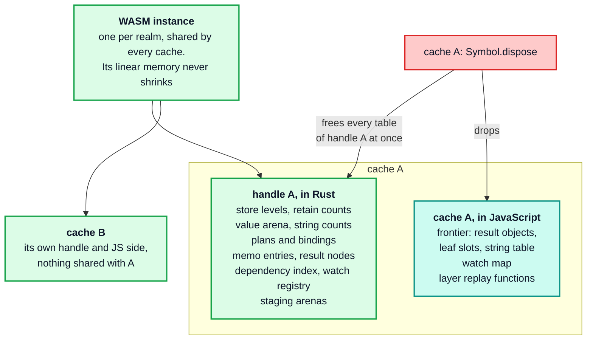
```mermaid
flowchart TB
    INST["<b>WASM instance</b><br/>one per realm, shared by every cache.<br/>Its linear memory never shrinks"]:::store

    subgraph A["cache A"]
        direction LR
        HA["<b>handle A, in Rust</b><br/>store levels, retain counts<br/>value arena, string counts<br/>plans and bindings<br/>memo entries, result nodes<br/>dependency index, watch registry<br/>staging arenas"]:::store
        JA["<b>cache A, in JavaScript</b><br/>frontier: result objects,<br/>leaf slots, string table<br/>watch map<br/>layer replay functions"]:::read
    end

    HB["<b>cache B</b><br/>its own handle and JS side,<br/>nothing shared with A"]:::store
    DISP["cache A: Symbol.dispose"]:::dirty

    INST --> HA
    INST --> HB
    DISP -->|"frees every table<br/>of handle A at once"| HA
    DISP -->|"drops"| JA

    classDef read fill:#ccfbf1,stroke:#0d9488,stroke-width:2px,color:#0f172a
    classDef store fill:#dcfce7,stroke:#16a34a,stroke-width:2px,color:#0f172a
    classDef dirty fill:#fecaca,stroke:#dc2626,stroke-width:2px,color:#0f172a
```

**Ownership** ([contract 14](../../adr/0004-declarative-policies-rust-engine.md#4-the-contracts),
[AGENTS.md](../../../AGENTS.md#package-boundaries)):

- Every table belongs to one cache handle. Nothing is shared between caches, although they
  share the instance.
- Every holder of an id is counted: store values, result nodes and their parents, plans,
  materialization records, and a staged write while JS compares its slots. Slot and string
  ids that are reused carry a generation; node ids are never reused.
- `cache[Symbol.dispose]()` frees every table of the handle at once, so
  `using cache = new InMemoryCacheRs()` works. It is idempotent, and any later call throws a
  checked "disposed" error rather than touching freed memory. A `FinalizationRegistry` is a
  fallback only, for caches nobody disposes.
- `ApolloClient` never disposes its cache (`stop()` and `clearStore()` do not), so the
  migration and SSR guides say who calls it.

**What this design does about Apollo's memory**
([ADR 0004 §7](../../adr/0004-declarative-policies-rust-engine.md#7-memory)):

| Apollo, measured | This design |
| --- | --- |
| result caching is almost 14 times the store | result nodes are records of ids, and dependencies are integer pairs; JS objects exist only for results handed out |
| a cold write of 5 000 entities allocates 92 MiB | a reused op buffer and reused staging arenas |
| memo bounds count entries, not bytes, so a rolling window and document churn grow until the limits | the result memo is bounded in bytes, and results that reference an evicted or collected entity go with it |
| `evict` plus `gc()` leaves 21 of 46 MiB | `evict` and `gc` release the result nodes that depend on what they remove |
| a watched query pays for two memo sets, even with no layer | a later step builds the optimistic set from the root set's content when no layer shadows the data, still with its own nodes (ADR 0004 names step 4 in §7 and step 6 in its migration order, [Q9](04-getting-there.md#23-open-questions)) |

**What this design adds, and must bound**

- **Linear memory never shrinks.** Its high-water mark stays with the application, so the
  memory probe checks that a second cache reuses it, and CI reports it.
- **Interned strings and the value arena grow with everything ever written**, unless they
  are reclaimed. Both are reference-counted, and the probe's plateau checks exist to catch
  a table that only grows.
- **Disposal must return the heap to its baseline.** The memory probe checks,
  deterministically, that building and disposing many caches does, and reports what is left
  to the finalizer path separately. This check is a release blocker.

**Measuring it.** The memory probe reports bytes in use, allocation traffic, and physical
reservation (the high-water mark and RSS) separately; a build that cannot report one says
"unavailable", never zero. Steady workloads run at two lengths, and the leak metric is
bytes per operation across them ([benchmarking](../../benchmarking.md#memory)).

## 15. Failure model

```mermaid
stateDiagram-v2
    direction LR
    [*] --> Ready : new InMemoryCacheRs()
    Ready --> InCall : a call into Rust
    InCall --> Ready : returns, or a checked error
    InCall --> Staged : a write needs slot answers
    Staged --> Ready : commit or discard
    InCall --> Poisoned : trap (a panic in Rust)
    Staged --> Poisoned : trap
    Ready --> Disposed : Symbol.dispose
    Poisoned --> [*] : every cache in the realm<br/>refuses further calls
    Disposed --> [*] : later calls throw disposed
```

- **Panic-free is a target**, enforced with checked inputs, `Result`s, an audit and tests
  ([contract 12](../../adr/0004-declarative-policies-rust-engine.md#4-the-contracts)).
- **A trap poisons every cache in the realm.** With `panic = "abort"`, the wasm32 default, a
  trap skips destructors in the shared allocator and interner, so no cache on that
  instance can be trusted afterwards. This is a conservative policy, not something an
  experiment forced: in E7, another object still worked after a panic.
- **A trap is recognized by a flag** that the shell sets around its own Rust calls, never by
  the error's class, since user code can throw a `WebAssembly.RuntimeError` too.
- **Memory views are re-acquired after every call that can grow memory**, because
  `WebAssembly.Memory#grow` detaches every view over the old buffer (F13, experiment E6).
- **Checked errors leave the cache usable.** Re-entrancy, a disposed cache, a discarded
  write, an exhausted id space: each throws, and the next call works.

## 16. Packaging and initialization

`new InMemoryCacheRs(config)` must work exactly like `new InMemoryCache(config)`:
synchronous, with no setup step ([ADR 0003](../../adr/0003-wasm-initialization.md)).

```mermaid
flowchart LR
    subgraph pkg["the npm package"]
        IDX["dist/index.js<br/>exports InMemoryCacheRs<br/>and InMemoryCacheRsConfig only"]:::api
        B64["the release .wasm<br/>as a base64 string<br/>in a JS module"]:::store
        GLUE["wasm-bindgen glue<br/>initSync"]:::store
    end
    C1["first construction<br/>in this realm"]:::api
    DEC["decode the bytes,<br/>initSync: compile and<br/>instantiate synchronously"]:::write
    INST["the instance,<br/>reused by every later cache"]:::store
    IDX --> C1 --> DEC
    B64 --> DEC
    GLUE --> DEC
    DEC --> INST

    classDef api fill:#dbeafe,stroke:#2563eb,stroke-width:2px,color:#0f172a
    classDef write fill:#fde68a,stroke:#d97706,stroke-width:2px,color:#0f172a
    classDef store fill:#dcfce7,stroke:#16a34a,stroke-width:2px,color:#0f172a
```

- **One ESM build** serves browsers, Node and SSR. Jest keeps its mapping to the
  self-initializing nodejs build until it can use the same path.
- **A size budget.** Chrome compiles synchronously on the main thread only up to 8 MB (since
  Chrome 115; it refused anything over 4 KB before). ADR 0003 has the build fail at 1 MB, a
  limit to revisit with measurements, because synchronous compilation blocks the main thread for
  longer as the module grows. The budget is split into raw module size, transfer size and
  first-construction time; nothing enforces it in CI yet (review #31).
- **Formatting stays in JS partly to stay under the budget**
  ([ADR 0004, revisited decisions](../../adr/0004-declarative-policies-rust-engine.md#every-earlier-decision-revisited)):
  the application already ships Apollo's formatting functions, and a Rust copy would add
  bytes to the module.
- **A Content Security Policy must allow `'wasm-unsafe-eval'`**
  ([U11](../../compatibility.md#u11-content-security-policies-without-wasm-unsafe-eval)),
  and runtimes without WebAssembly keep `InMemoryCache`
  ([U9](../../compatibility.md#u9-runtimes-without-webassembly)).
- **No public initializer.** If the bundled bytes prove too costly, the escape hatch is a
  static `InMemoryCacheRs.init(source)`, never a new export.
- **Not implemented yet.** Today the published entry imports the web-target glue and nothing
  initializes it, so construction throws outside Jest and the probes (F18). The vertical
  slice implements this section (step 3).

<!-- nav:bottom -->

---

| ← Previous | Up | Next → |
| :-- | :-: | --: |
| [Level 2: how data moves](02-how-data-moves.md) | [RFC 0001](README.md) | [Level 4: getting there](04-getting-there.md) |
