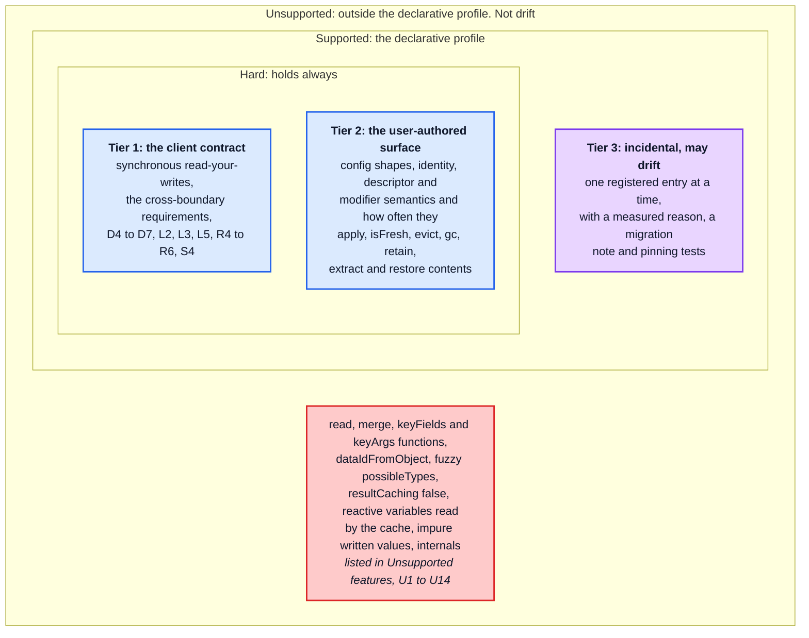
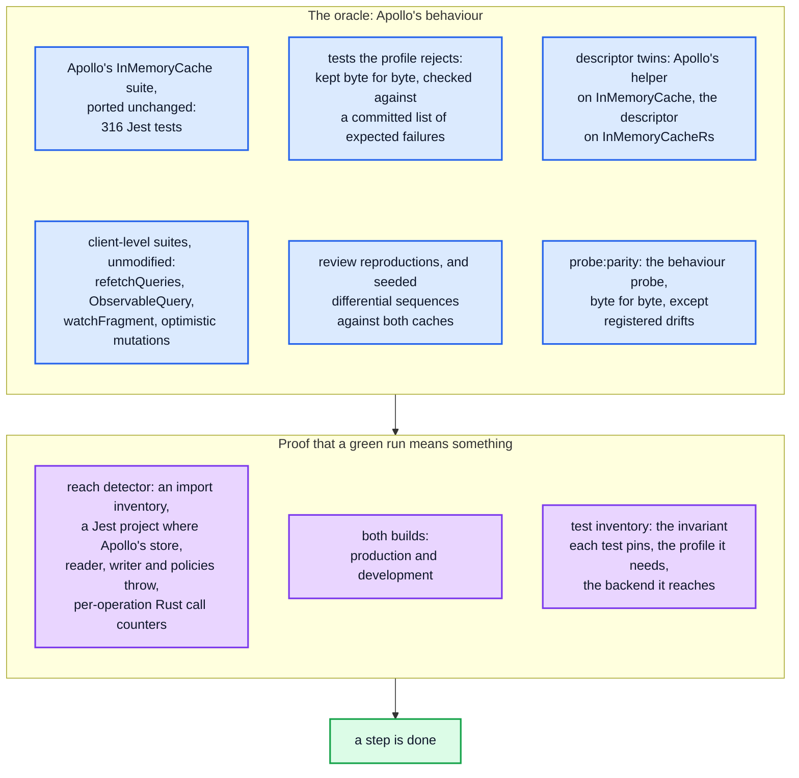
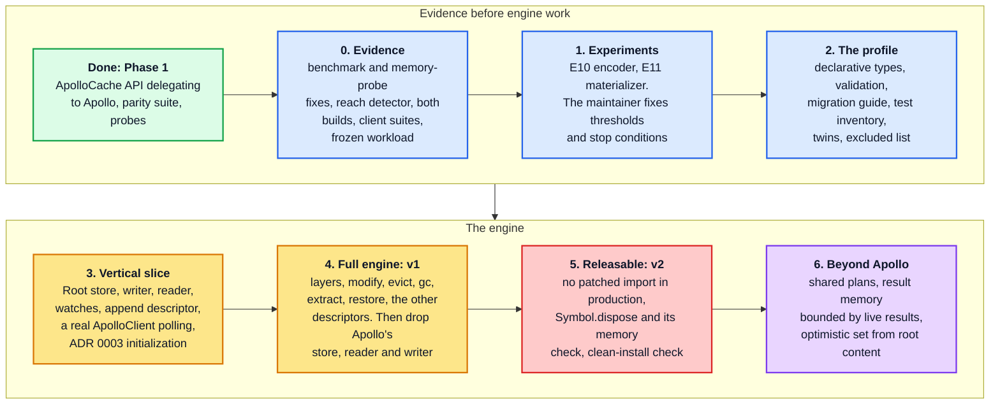

# RFC 0001, Level 4: getting there

[Documentation home](../../README.md) › [RFC 0001](README.md) · [← Level 3: the design in depth](03-design-in-depth.md)

## 17. Compatibility

The target is close to `InMemoryCache`, not byte-identical
([ADR 0002](../../adr/0002-compatibility-target.md), amended by
[ADR 0004](../../adr/0004-declarative-policies-rust-engine.md#compatibility-amends-adr-0002)).
Every behaviour falls in one of four places:

**Decided drifts**, each registered with its pinning test in the PR that implements it
([drift register](../../compatibility.md#decided-registered-when-implemented)):

| `InMemoryCache` | `InMemoryCacheRs` | Explained in |
| --- | --- | --- |
| a write that throws while comparing stored values has already committed the entities before it (production) | nothing from that write is committed; the original value is rethrown and watches still broadcast | [§6.3](03-design-in-depth.md#63-the-call-discipline-rust-calls-no-javascript) |
| values handed to modifiers are frozen in development only | frozen in every build; leaf slots never | [§13.4](03-design-in-depth.md#134-values-handed-to-modifiers) |

**Consequences that are tier 3 without a register entry of their own yet**: `extract()`
materializes (`O(S · F)`) where Apollo copies (`O(S)`); `restore()` stops adopting the
caller's objects by reference; `extract()` twice returns the same objects only while the
value cache holds them ([ADR 0004, consequences](../../adr/0004-declarative-policies-rust-engine.md#consequences)).

**Candidates** that the Rust core would find cheaper, none adopted: per-field optimistic
layers, `NaN` treated as unchanged, looser development-warning text and order, any stable
`extract()` key order ([drift register, candidates](../../compatibility.md#candidates)).

**For adopters**, [Unsupported features](../../unsupported.md) lists what the profile leaves out,
how an application notices, and what to use instead. A migration guide expands on it at
step 2.

## 18. How correctness is proved

Apollo's own tests are the oracle, and they are never rewritten to fit
([ADR 0004, the oracle](../../adr/0004-declarative-policies-rust-engine.md#compatibility-amends-adr-0002),
[src/__tests__/README.md](../../../src/__tests__/README.md)). A green run counts only for tests
proved to reach Rust.

- **Tests whose configuration the profile rejects stay as they are**, in a separate Jest
  project, checked against a committed list of test ids expected to fail with the profile
  error. Any other failure, or a listed test that starts passing, fails CI. The list holds
  ids and reasons, never assertions. By a provisional pattern count, 46 of the 266 `it(`
  call sites configure a function, a pagination helper or a reactive variable.
- **Five suites drive Apollo's `StoreReader` and `StoreWriter` directly** (`diffAgainstStore`,
  `readFromStore`, `writeToStore`, `roundtrip`, `recordingCache`), so they need twins that
  go through the public API before they can judge this engine.
- **The reach detector must first classify today's code as not reaching Rust.** Today
  every test passes because the cache delegates to Apollo, which proves the scaffold, not
  the engine.
- **The client-level suites** run with every Apollo import mapped to the one installed
  build, and a startup check that it is one.
- **Changed and new tests carry an annotation** saying where they come from and whether the
  implementation or the behaviour changed.

## 19. Performance and memory targets

The numbers are **guideposts, not gates**: they say how far off an approach is, so that a
miss sends the work to an alternative (a `JSON.stringify` ingestion, a `WeakRef` frontier,
a different op format) rather than into engine work on a weak boundary. The maintainer fixes
the thresholds, and the stop conditions, after E10 and E11
([ADR 0004, migration order](../../adr/0004-declarative-policies-rust-engine.md#migration-order-and-gates)).
Correctness is the one hard gate.

| Stage | What is measured | Apollo at `N` = 5 000 | Guidepost |
| --- | --- | --- | --- |
| E10, the encoder | encode probe section 1's payload into an op buffer: formatting, interning, typename-dependent bindings, both ids per value, slot comparison, repeated polls | cold write 83.41 ms, 92 MiB allocated | ≤ 10 ms (about 12 %); ≤ 4.6 MiB allocated (5 %) |
| E11, the materializer | materialize section 2's result from node records, cold and after one dirty field; pins, LRU, freezing; the re-read at depth 64 to 512 | read cold 155.23 ms; after one dirty field 19.53 ms | ≤ 25 ms cold (16 %); ≤ 1 ms after one dirty field |
| the vertical slice | writes: cold, identical, one field changed | 83.41, 75.95, 72.18 ms | at least 2× faster each; the aim is 4× |
| | section 2 reads | warm 3.8 µs | none slower; warm within 2× of 3.8 µs |
| | a broadcast to 200 watchers after a relevant write | 95.99 ms (2 000 entities) | at least 2× faster |
| | memory | per entity: store 662 B, root read's memo 4 366 B; per write: 18.8 KiB allocated | store plus root memo at most half; a watched query at most half; allocation per write at most a quarter |
| v1, the full engine | everything the probes measure | | nothing slower than Apollo beyond noise, no memory larger, and every memory check passing, including the three Apollo fails: the rolling window plateaus, document churn plateaus, `evict` plus `gc()` returns the memory |
| step 6 | the cliffs | 7.42 s for 50 separately parsed documents; the 50 000-entry LRU cliff | removed, each change measured and merged on its own |

**How they are measured.** On a synthetic workload frozen before any implementation
(step 0): polling first (cold write, identical rewrite, one item changed, 1 % changed, full
replacement; 0, 1 and 200 watchers; shared and separately parsed documents; batched and
not), with pagination and optimistic updates as regression cases, at sizes from 100 to
20 000. Every result from it is labelled synthetic. Each experiment is measured inside real
write, read-back and broadcast sequences, not alone. Whether the main thread comes back
sooner in a browser is measured at the slice, as frame and long-task latency with their
tails, before any claim about interactivity. The measurement rules are in
[benchmarking.md](../../benchmarking.md).

**Stop conditions**, fixed after E10 and E11: the codecs' share of Apollo's end-to-end cost
on the primary sequences, and any agreed oracle case that could only pass by letting
application code run inside a Rust call.

## 20. Where we are, and the plan

**Today** (2026-09-27):

- `InMemoryCacheRs` implements the whole `ApolloCache` API by delegating to Apollo's own
  `EntityStore`, `Policies`, `StoreReader` and `StoreWriter`, some reached through a
  development-only `patch-package` patch of `@apollo/client` (Phase 1,
  [AGENTS.md](../../../AGENTS.md#implementation-strategy)). The Rust crate is a stub: an interop
  marker and heap statistics.
- Apollo's `InMemoryCache` suite is ported and passes (316 Jest tests), and
  `npm run probe:parity` matches Apollo's output byte for byte. Both hold because nothing
  reaches Rust yet.
- The performance and memory probes, the `benchmark` PR workflow and the tarball check
  (`npm run check:pack`) exist.
- The package cannot construct a cache outside Jest and the probes (F18).

| Step | Hard gate | Performance changes? |
| --- | --- | --- |
| 0. evidence | the benchmark fails, rather than passing with a note, when a base did not build or a measurement is missing; an A/A calibration gives the noise band (a local pilot saw ±2.4 % to ±8.1 %); the workload is frozen | no |
| 1. experiments | recorded scripts and output, as E1–E9 were | no: prototypes |
| 2. the profile | configuration checks run on today's delegating cache, so adopters can check their configuration before the engine exists | no |
| 3. vertical slice | every ported test the slice's features reach, and the oracle cases that still apply (F3 with the append descriptor, F10, W1, W2) | first |
| 4. full engine, **v1** | the full declarative oracle, the client-level suites and `probe:parity`, in both builds | yes |
| 5. releasable, **v2** | no production import of a patched symbol (vendoring Apollo's modules does not count: `makeVar`'s registry is module-private); `cache[Symbol.dispose]()` and its deterministic memory check; a clean project installs the tarball and constructs, writes, reads and watches under Node, a browser and SSR | — |
| 6. beyond Apollo | each change measured and merged alone, with an oracle case and a register entry where it is observable | yes |

Nothing is released for production use before v2. Throughout, the `.wasm` stays within its
size budget, and every PR labelled `benchmark` runs the memory probe beside the performance
probe.

## 21. Risks and drawbacks

| Risk | Why it matters | What contains it |
| --- | --- | --- |
| the codecs are too slow | they are the only per-field JavaScript left; if encoding and materializing cost close to Apollo's write, the design loses its point | E10 and E11 run before any engine work, inside real sequences, with stop conditions |
| the descriptor catalogue does not cover an adopter | that adopter cannot migrate | by design; the catalogue grows by amendment, the error at construction and the migration guide say so up front |
| two kinds of identity (node ids and JS objects) drift apart | a stale id matching a new node would suppress a callback or skip a write | node ids are never reused; slot and string ids carry generations; differential tests against Apollo |
| the frontier holds more than Apollo's memo in some shapes | memory would regress where it was meant to shrink | pins plus a byte-bounded LRU; the memory probe; the `WeakRef` variant in reserve |
| linear memory never shrinks, one instance per realm | a peak stays; a trap stops every cache in the realm | probe checks of the high-water mark; panic-free audit and tests |
| blob-heavy payloads | `equal()` per changed blob stays in JS, as in Apollo | measured in E10; `keepExistingWhen` for versioned blobs |
| `extract()` costs `O(S · F)` | SSR pays it once per page | measured; accepted in ADR 0004 |
| synchronous compilation | blocks the main thread at first construction | the size budget and a first-construction measurement; a static `init` as the escape hatch |
| layer replay across the boundary | the most intricate protocol, not specified yet | [Q3](#23-open-questions); Apollo's `optimistic.ts` suite and probe section 6 |
| Apollo moves on | the oracle and the patch are pinned to 4.2.11 | an upgrade is its own change, re-verified against the new oracle |
| two languages and a WASM toolchain | more to build and to keep reproducible | pinned toolchains (`rust-toolchain.toml`, `.nvmrc`), CI builds from them |

## 22. Alternatives considered

Each was weighed in an ADR; the link has the full argument.

| Alternative | Verdict | Why |
| --- | --- | --- |
| a JS side eventually consistent with a Rust store | rejected | reads and writes are synchronous, and Apollo reads its own writes in one call stack (F1, [ADR 0001](../../adr/0001-js-rust-wasm-boundary.md#considered-options)) |
| functions allowed, a hybrid engine (ADR 0001 as it stood) | rejected | keeps the resumable engine and the JS reader, and can only reach the write path ([ADR 0004](../../adr/0004-declarative-policies-rust-engine.md#considered-options)) |
| pay for what you use: functions allowed, declarative fields fast | rejected | keeps every callout mechanism, and one `read` function keeps an application's reader in JS |
| fall back to Apollo's cache when a configuration has functions | rejected | that fallback *is* `InMemoryCache`, and it doubles what must be tested |
| V0: a Rust store under Apollo's reader and writer | dropped | it measures a per-field boundary this design never ships |
| Rust walks the JS result object itself | rejected | a crossing per property and a UTF-16 to UTF-8 copy per string |
| Rust returns JSON text and JS calls `JSON.parse` | measured in E11 as the alternative | fast to decode, but rebuilds every object, giving up identity, `isFresh` and R2 |
| a JS mirror of the whole store, patched by every write | rejected | every entity twice, a JS patch per changed field, layers mirrored too, and no help for reads |
| global hash-consing of results | rejected for results, kept for stored values | it would alias objects Apollo keeps apart |
| JSON blobs interned in Rust | rejected | `O(B)` per write, double the memory, lost identity |
| a pure-JS engine under the same profile | rejected (maintainer) | Rust-WASM is a product constraint |
| a store in a worker | rejected | every cache API is synchronous |
| an exported `initSync`, an async `create()`, top-level `await` | rejected | each adds a setup step or makes construction async ([ADR 0003](../../adr/0003-wasm-initialization.md#considered-options)) |

## 23. Open questions

Q1 comes from ADR 0004. The others are raised by this RFC while explaining the design;
each names the section it came from.

| # | Question | Raised in | Needed by |
| --- | --- | --- | --- |
| Q1 | **Descriptor spelling.** Plain objects (`merge: { list: "append" }`), or helper-style constructors named after Apollo's (`offsetLimitPagination()`), which make migration an import change but need an export beyond the two allowed, or static methods on `InMemoryCacheRs`? | [ADR 0004](../../adr/0004-declarative-policies-rust-engine.md#open-questions-for-the-maintainer) | step 2 |
| Q2 | **Weighting the frozen workload.** Through an `ObservableQuery`, an identical poll never reaches the cache (`QueryInfo`'s feud breaker, `core/QueryInfo.ts:159`, `:281`). Should the polling workload weight "one item changed" and "1 % changed" over "identical rewrite", and name the sources that do produce identical writes (other queries over the same data, subscriptions, `writeQuery`, the first poll after `evict` or `modify`)? | [§2.3](README.md#23-where-the-time-and-the-memory-go), [§5.5](02-how-data-moves.md#55-a-poll-where-nothing-changed) | step 0 |
| Q3 | **The layer replay protocol.** Is "Rust detaches the layers above and returns their ids; JS replays each into a new level" enough to reproduce Apollo's dirtying exactly? In particular: a field the old layer wrote and the rebuilt one does not, and a field the rebuilt layer writes with the value the old one held. | [§9.1](03-design-in-depth.md#91-levels-root-stump-and-layers), [§5.7](02-how-data-moves.md#57-an-optimistic-mutation-confirmed-or-rolled-back) | step 4 |
| Q4 | **Writes without a plan.** `restore()` and `modify()` of a field that holds nothing yet carry no selection set, so the encoder cannot tell an embedded object from a JSON blob. Store such values structurally (a later read can serve both a selection and a whole-value read from structure, but a blob loses the written object's identity), or as slots (identity kept, but a later read with a selection set cannot see inside)? | [§5.10](02-how-data-moves.md#510-server-rendering-extract-restore-and-disposal) | step 4 |
| Q5 | **Freed ids and dropped nodes.** Rust must tell JS which string and slot ids it freed, and JS must tell Rust which materialized nodes its LRU dropped. Piggyback both on the next call's arguments and return value, or make them explicit calls? | [§6.4](03-design-in-depth.md#64-what-crosses-the-boundary) | step 3 |
| Q6 | **`batch`'s pre-pass as set operations.** Is anything observable lost when the pre-pass stops reading the already-dirty watches? | [§12.4](03-design-in-depth.md#124-batch-onwatchupdated-and-the-clients-own-writes) | step 3 |
| Q7 | **`getMemoryInternals`.** It is optional ([§9.3 of the architecture guide](../../architecture/09-invariants-and-checklist.md#93-cross-boundary-requirements)) and its shape is tier 3. Report the Rust tables in a new shape, or omit it? | [§14](03-design-in-depth.md#14-memory-and-ownership) | step 4 |
| Q8 | **Sorting interned strings.** `{ list: "sort" }` over a string field needs an order, and Rust holds ids, not text. Should JS maintain an order rank per interned string, or should sorting happen in the materializer? | [§8.2](03-design-in-depth.md#82-field-keys-and-bindings) | E10 |
| Q9 | **An ADR inconsistency.** ADR 0004's memory table puts "build the optimistic set from the root set's content" at step 4, and its migration order lists it under step 6. Which is it? | [§14](03-design-in-depth.md#14-memory-and-ownership) | step 4 |
| Q10 | **`possibleTypes` on both sides.** The encoder needs it to match fragments while writing and the reader while reading. Is keeping a copy on each side, both updated by `addPossibleTypes`, acceptable? | [§7.3](03-design-in-depth.md#73-validation-and-the-policy-table) | step 2 |

---

## Appendix A. Glossary

This project's terms. Apollo's (`dataId`, `storeFieldName`, `Reference`, layer,
`CacheGroup`, …) are in [architecture §0.4](../../architecture/00-orientation.md#04-vocabulary).

| Term | Meaning |
| --- | --- |
| **binding** | a plan applied to one set of variables and one policy epoch: a store field key for every field, per-typename overrides, descriptor arguments and redirect targets ([§8.2](03-design-in-depth.md#82-field-keys-and-bindings)) |
| **codecs** | the encoder and the materializer, with the formatter, interner and leaf slots they share: the only per-field JavaScript left |
| **declarative profile** | the configuration `InMemoryCacheRs` accepts: key arrays, descriptors, exact `possibleTypes`, no functions ([§7.1](03-design-in-depth.md#71-what-is-accepted)) |
| **descriptor** | a named behaviour from a closed catalogue, standing in for a `merge` or `read` function ([§7.2](03-design-in-depth.md#72-descriptors)) |
| **drift** | a registered tier-3 difference from `InMemoryCache`, with a reason, a migration note and pinning tests ([§17](#17-compatibility)) |
| **E10, E11** | the boundary experiments on the encoder and the materializer ([§19](#19-performance-and-memory-targets)) |
| **encoder** | the JS component that walks a result by its plan and writes the op buffer ([§5.2](02-how-data-moves.md#52-the-first-response-a-cold-write)) |
| **equivalence id** | a value's id under Apollo's reconciliation rules (`-0` is `0`, one `NaN`) ([§9.3](03-design-in-depth.md#93-values-the-arena-and-two-ids-per-value)) |
| **frontier** | the JavaScript objects the design keeps: result objects, leaf slots, interned strings ([§13](03-design-in-depth.md#13-the-frontier-the-javascript-objects-the-design-keeps)) |
| **handle** | one cache's share of the WASM instance; it owns every table the cache allocates in Rust ([§14](03-design-in-depth.md#14-memory-and-ownership)) |
| **hash-consing** | interning structures bottom-up by the ids of their children, so equal structures share one id |
| **leaf slot** | a value stored without a selection set (a JSON blob, a custom scalar, a `Date`), kept as the application's own object in JS and referenced by id ([§10.3](03-design-in-depth.md#103-leaf-slots-and-the-two-phase-commit)) |
| **level** | one store in the chain: the Root, the Stump, or a Layer ([§9.1](03-design-in-depth.md#91-levels-root-stump-and-layers)) |
| **materializer** | the JS component that turns node records into frozen objects, once per node ([§5.3](02-how-data-moves.md#53-reading-it-back-and-watching-it)) |
| **memo entry** | a cached read of one plan node over one entity or embedded parent, in one view; it holds one result node ([§11.2](03-design-in-depth.md#112-memo-entries-and-result-nodes)) |
| **node, node id** | a result node: a record of ids that one memo entry produced. Node ids are never reused |
| **occurrence** | where a stored value lives (level, entity, field key, version), which keys the values handed to modifiers ([§13.4](03-design-in-depth.md#134-values-handed-to-modifiers)) |
| **op buffer** | the integer buffer one write crosses the boundary in ([§5.2](02-how-data-moves.md#52-the-first-response-a-cold-write)) |
| **oracle** | Apollo's behaviour, as its tests, the probes and differential runs pin it ([§18](#18-how-correctness-is-proved)) |
| **pin** | the frontier's hold on the objects reachable from what the cache last delivered to each watch ([§13.2](03-design-in-depth.md#132-lifetime-pinned-plus-lru)) |
| **plan** | a compiled selection structure for one transformed document ([§11.1](03-design-in-depth.md#111-plans-and-bindings)) |
| **poisoned** | the state of every cache in a realm after a trap in the engine ([§15](03-design-in-depth.md#15-failure-model)) |
| **policy epoch** | a counter bumped by each policy change; new bindings use the newest ([§7.3](03-design-in-depth.md#73-validation-and-the-policy-table)) |
| **reach detector** | the tooling that proves a test exercises Rust rather than Apollo's delegated code ([§18](#18-how-correctness-is-proved)) |
| **representation id** | a value's id under `Object.is`, so `-0` and `+0` differ ([§9.3](03-design-in-depth.md#93-values-the-arena-and-two-ids-per-value)) |
| **shell** | the TypeScript class and orchestration that implement the `ApolloCache` API ([§6](03-design-in-depth.md#6-components-responsibilities-and-the-boundary)) |
| **twin** | a test that runs one of Apollo's scenarios with Apollo's helper on `InMemoryCache` and a descriptor on `InMemoryCacheRs` ([§18](#18-how-correctness-is-proved)) |
| **v1, v2** | the correctness milestone (the full engine passes the oracle) and the releasability milestone (no patch, disposal, clean install) ([§20](#20-where-we-are-and-the-plan)) |
| **view** | root or optimistic: which level a read starts from, and which memo set it uses ([§9.1](03-design-in-depth.md#91-levels-root-stump-and-layers)) |

## Appendix B. Where each decision is explained

| Decision | Recorded in | Explained here |
| --- | --- | --- |
| the declarative profile | [ADR 0004 §1](../../adr/0004-declarative-policies-rust-engine.md#1-the-declarative-profile) | [§3.3](README.md#33-what-an-application-changes), [§7.1](03-design-in-depth.md#71-what-is-accepted) |
| the descriptor vocabulary | [ADR 0004 §2](../../adr/0004-declarative-policies-rust-engine.md#2-the-descriptor-vocabulary) | [§7.2](03-design-in-depth.md#72-descriptors) |
| the boundary | [ADR 0004 §3](../../adr/0004-declarative-policies-rust-engine.md#3-the-boundary) | [§3.1](README.md#31-before-and-after), [§6](03-design-in-depth.md#6-components-responsibilities-and-the-boundary) |
| contract 1, one store | [ADR 0004 §4](../../adr/0004-declarative-policies-rust-engine.md#4-the-contracts) | [§1](README.md#1-summary), [§13.1](03-design-in-depth.md#131-its-three-parts) |
| contract 2, Rust calls no JavaScript | ADR 0004 §4 | [§6.3](03-design-in-depth.md#63-the-call-discipline-rust-calls-no-javascript), [§10.4](03-design-in-depth.md#104-errors-and-re-entrancy) |
| contract 3, synchronous read-your-writes | ADR 0004 §4, ADR 0001 F1 | [§3.4](README.md#34-goals-and-non-goals), [§5.3](02-how-data-moves.md#53-reading-it-back-and-watching-it) |
| contract 4, bulk crossings | ADR 0004 §4 | [§6.4](03-design-in-depth.md#64-what-crosses-the-boundary) |
| contract 5, observable bytes formatted in JS | ADR 0004 §4 | [§8](03-design-in-depth.md#8-names-entity-ids-field-keys-and-interned-strings) |
| contract 6, `isFresh` | ADR 0004 §4 | [§10.2](03-design-in-depth.md#102-isfresh-writing-back-what-was-read) |
| contract 7, identity | ADR 0004 §4 | [§11.2](03-design-in-depth.md#112-memo-entries-and-result-nodes), [§13.3](03-design-in-depth.md#133-identity-case-by-case) |
| contract 8, invalidation | ADR 0004 §4 | [§12.1](03-design-in-depth.md#121-dependencies), [§12.2](03-design-in-depth.md#122-dirtying-and-why-it-stays-od) |
| contract 9, the equality gate | ADR 0004 §4 | [§12.3](03-design-in-depth.md#123-the-broadcast-loop-and-its-gates) |
| contract 10, the state model | ADR 0004 §4, ADR 0001 contract 3 | [§9.2](03-design-in-depth.md#92-the-state-of-one-entity-and-one-field), [§9.3](03-design-in-depth.md#93-values-the-arena-and-two-ids-per-value) |
| contract 11, leaf slots | ADR 0004 §4 | [§10.3](03-design-in-depth.md#103-leaf-slots-and-the-two-phase-commit) |
| contracts 12 and 13, panic-free, memory views | ADR 0004 §4 | [§15](03-design-in-depth.md#15-failure-model) |
| contract 14, ownership and disposal | ADR 0004 §4 | [§14](03-design-in-depth.md#14-memory-and-ownership) |
| the frontier | [ADR 0004 §5](../../adr/0004-declarative-policies-rust-engine.md#5-where-javascript-objects-live-the-frontier) | [§13](03-design-in-depth.md#13-the-frontier-the-javascript-objects-the-design-keeps) |
| a network write, end to end | [ADR 0004 §6](../../adr/0004-declarative-policies-rust-engine.md#6-a-network-write-end-to-end) | [§5.2](02-how-data-moves.md#52-the-first-response-a-cold-write)–[§5.4](02-how-data-moves.md#54-the-next-poll-one-ticket-changed) |
| memory | [ADR 0004 §7](../../adr/0004-declarative-policies-rust-engine.md#7-memory) | [§14](03-design-in-depth.md#14-memory-and-ownership), [§19](#19-performance-and-memory-targets) |
| compatibility tiers | [ADR 0002](../../adr/0002-compatibility-target.md), amended | [§17](#17-compatibility) |
| the oracle | [ADR 0004, compatibility](../../adr/0004-declarative-policies-rust-engine.md#compatibility-amends-adr-0002) | [§18](#18-how-correctness-is-proved) |
| migration order and gates | [ADR 0004](../../adr/0004-declarative-policies-rust-engine.md#migration-order-and-gates) | [§19](#19-performance-and-memory-targets), [§20](#20-where-we-are-and-the-plan) |
| synchronous initialization | [ADR 0003](../../adr/0003-wasm-initialization.md) | [§16](03-design-in-depth.md#16-packaging-and-initialization) |
| the maintainer's decisions of the review | [ADR 0004, review](../../adr/0004-declarative-policies-rust-engine.md#review-of-2026-09-26) | throughout, where each applies |

## Appendix C. Further reading

| To learn | Read |
| --- | --- |
| how `InMemoryCache` works, part by part | the [architecture guide](../../architecture/README.md) |
| what each of its paths costs, and why | the [performance guide](../../performance/README.md) |
| Apollo's invariants, which this design keeps | [architecture §9.1](../../architecture/09-invariants-and-checklist.md#91-the-invariants) |
| the facts and experiments behind the boundary | [ADR 0001, established facts](../../adr/0001-js-rust-wasm-boundary.md#established-facts) and [evidence](../../adr/0001-js-rust-wasm-boundary.md#evidence) |
| what adopters give up, and what they use instead | [Unsupported features](../../unsupported.md) |
| where the cache deliberately differs | the [drift register](../../compatibility.md) |
| how performance is measured and compared | [benchmarking.md](../../benchmarking.md) |
| how the ported tests are kept honest | [src/__tests__/README.md](../../../src/__tests__/README.md) |

## Provenance

Written by `claude` on 2026-09-27, for review by the maintainer and contributing agents,
from ADRs 0001 to 0004, the architecture and performance guides, the probes' committed
output, and Apollo Client's source in `apollo-client-sm` at `ba511be`
(`@apollo/client@4.2.11`). Claims about Apollo that this RFC adds to those documents were
checked against that source: the feud breaker (`core/QueryInfo.ts:159-178`, `:252-322`),
`fetchMore`'s cache write (`core/ObservableQuery.ts:958-987`), `batch`'s re-dirtying of
already-dirty watches (`cache/inmemory/inMemoryCache.ts`, `batch`), the store field key
format for `keyArgs` arrays (`cache/inmemory/key-extractor.ts:163-173`) and the default
entity id (`cache/inmemory/helpers.ts`, `defaultDataIdFromObject`). Nothing in this RFC has
been measured for the new design; every number about it is a target.

<!-- nav:bottom -->

---

| ← Previous | Up | Next → |
| :-- | :-: | --: |
| [Level 3: the design in depth](03-design-in-depth.md) | [RFC 0001](README.md) |  |
