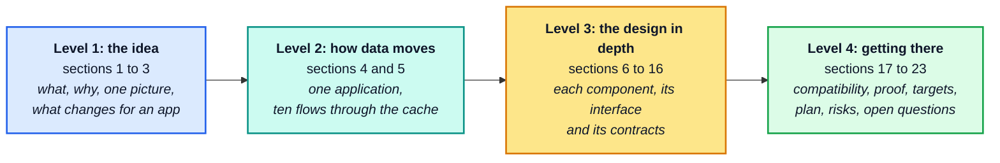
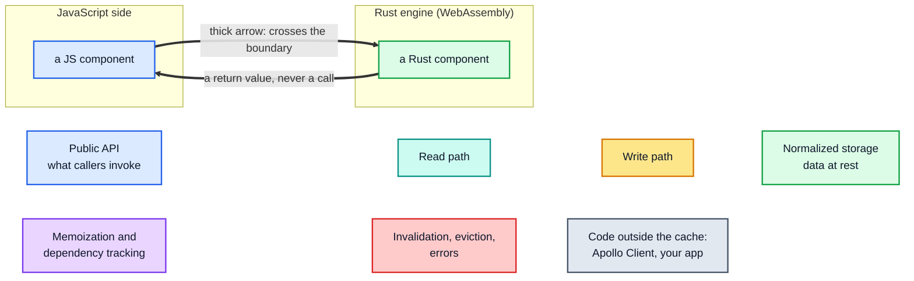
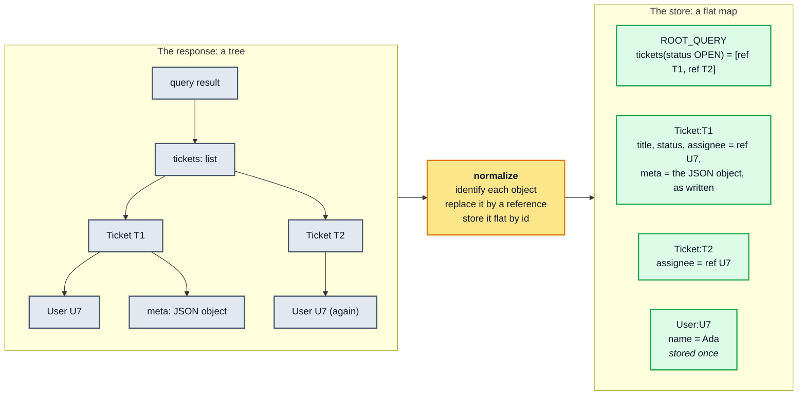
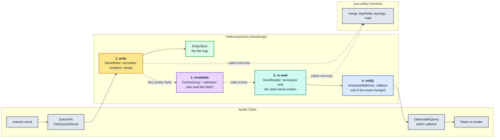
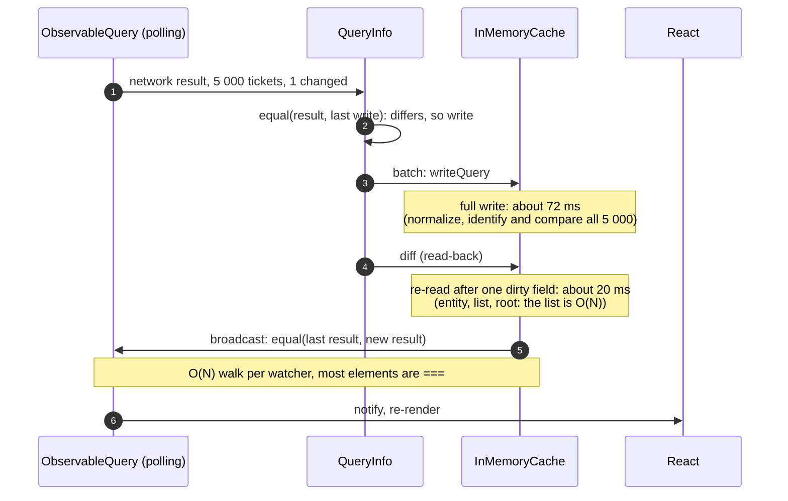
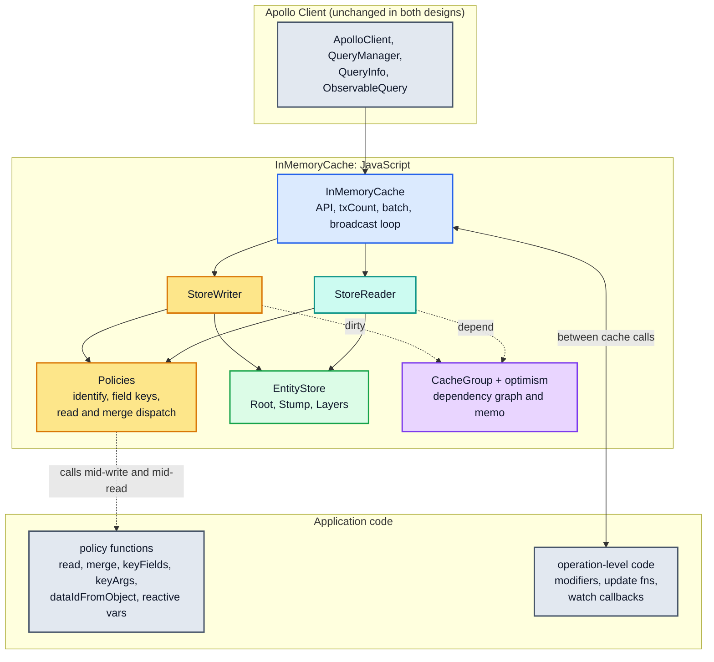
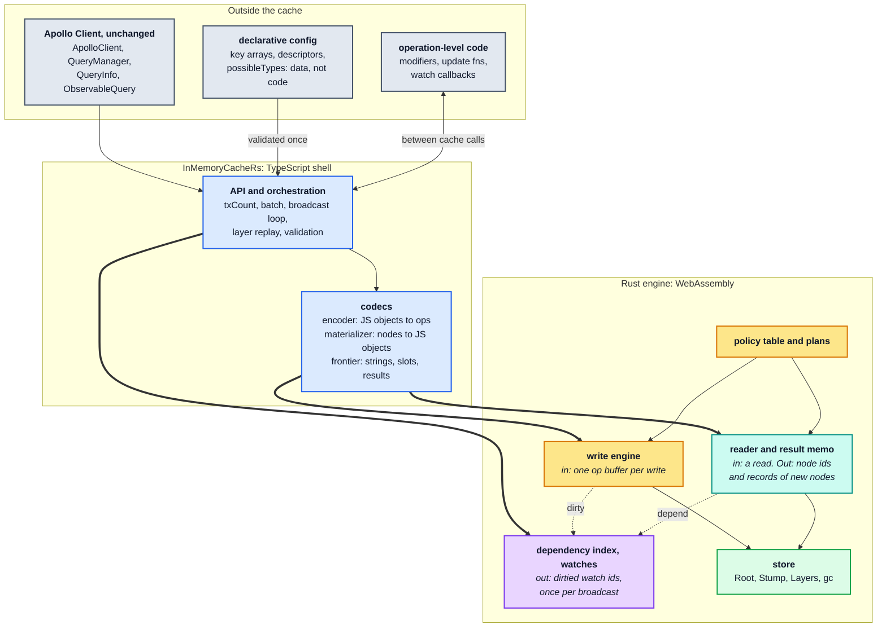

# RFC 0001: The architecture of `InMemoryCacheRs`

[Documentation home](../../README.md) › RFC 0001 · [Level 2: how data moves →](02-how-data-moves.md)

| | |
| --- | --- |
| **Status** | Draft, open for review |
| **Date** | 2026-09-27 |
| **Author** | `claude`, for the maintainer |
| **Reviewers** | the maintainer, and contributing agents |
| **Rests on** | [ADR 0001](../../adr/0001-js-rust-wasm-boundary.md) (amended), [ADR 0002](../../adr/0002-compatibility-target.md) (amended), [ADR 0003](../../adr/0003-wasm-initialization.md), [ADR 0004](../../adr/0004-declarative-policies-rust-engine.md) (accepted 2026-09-27) |
| **Describes** | the target design, as it stands at v2, the first release. Today's code is the delegating scaffold of Phase 1 ([§20](04-getting-there.md#20-where-we-are-and-the-plan)) |

> **What this document is.** The ADRs record decisions and the evidence for them, one
> question at a time. This RFC explains the system those decisions add up to. It starts
> from what an Apollo Client user already knows and goes down, section by section, to the
> contracts between the parts. It repeats details where a walkthrough needs them, and
> links the ADR paragraph each one comes from.
>
> **The ADRs win.** Where this RFC and an ADR disagree, the RFC is wrong. The few things
> the ADRs leave open and this RFC fills in are marked **Proposed**. Questions for the
> reviewers are marked **Open** and collected in [§23](04-getting-there.md#23-open-questions).

## How to read this RFC

The RFC goes deeper one level at a time, one file per level. Each level assumes the one
before it and nothing more, so you can stop at any level and still have a complete, if
coarser, picture.



| Level | Sections | Written for | Assumes |
| --- | --- | --- | --- |
| 1 | [§1](#1-summary)–[§3](#3-the-proposal-in-one-picture) | everyone | you use Apollo Client and have written a type policy |
| 2 | [§4](02-how-data-moves.md#4-the-example-application)–[§5](02-how-data-moves.md#5-walkthroughs-ten-flows-through-one-application) | reviewers of the design | Level 1 |
| 3 | [§6](03-design-in-depth.md#6-components-responsibilities-and-the-boundary)–[§16](03-design-in-depth.md#16-packaging-and-initialization) | contributors to the engine and the shell | Level 2, and the Apollo internals each section links |
| 4 | [§17](04-getting-there.md#17-compatibility)–[§23](04-getting-there.md#23-open-questions) | the maintainer, and anyone planning work | Level 3 |

**Markers.** A statement that an ADR decides links that ADR. **Proposed** marks what this
RFC adds, for review. **Open** marks a question with no answer yet.

**Words.** Apollo's own terms (`dataId`, `storeFieldName`, layer, `CacheGroup`, …) mean
what [architecture §0.4](../../architecture/00-orientation.md#04-vocabulary) says they mean,
and Apollo's invariants are cited by their ids (S1, R2, D5, …) from
[architecture §9.1](../../architecture/09-invariants-and-checklist.md#91-the-invariants). This
project's own terms (plan, frontier, leaf slot, node, …) are defined where they first
appear and collected in [Appendix A](04-getting-there.md#appendix-a-glossary).

### Diagram legend

The diagrams reuse the [architecture guide's palette](../../architecture/README.md#diagram-legend),
so a colour means the same thing in every document of this repository. This RFC adds two
conventions, for the boundary between JavaScript and Rust.



- A **solid arrow** is a synchronous call or a data hand-off; a **dotted arrow** is a
  dependency registration or an invalidation signal (as in the architecture guide).
- A **thick arrow** crosses the JS ↔ WASM boundary. Every one that points into Rust is a
  call from JavaScript, and every one that points out of Rust is that call's return value.
  Rust never calls JavaScript ([§6.3](03-design-in-depth.md#63-the-call-discipline-rust-calls-no-javascript)),
  so no diagram in this RFC has an arrow that starts in Rust and is not a return.
- A **subgraph** is an owner: the code inside it belongs to that side of the boundary, or
  to Apollo Client, or to the application.
- There is no "boundary exception" style. The design has no sanctioned way around the
  boundary, and a diagram that needs one has found a bug.

## Contents

- **Level 1: the idea**
  - [1. Summary](#1-summary)
  - [2. Why: what `InMemoryCache` does, and what it costs](#2-why-what-inmemorycache-does-and-what-it-costs)
  - [3. The proposal in one picture](#3-the-proposal-in-one-picture)
- **Level 2: how data moves**
  - [4. The example application](02-how-data-moves.md#4-the-example-application)
  - [5. Walkthroughs: ten flows through one application](02-how-data-moves.md#5-walkthroughs-ten-flows-through-one-application)
- **Level 3: the design in depth**
  - [6. Components, responsibilities and the boundary](03-design-in-depth.md#6-components-responsibilities-and-the-boundary)
  - [7. Configuration: the declarative profile](03-design-in-depth.md#7-configuration-the-declarative-profile)
  - [8. Names: entity ids, field keys and interned strings](03-design-in-depth.md#8-names-entity-ids-field-keys-and-interned-strings)
  - [9. The store](03-design-in-depth.md#9-the-store)
  - [10. The write engine](03-design-in-depth.md#10-the-write-engine)
  - [11. The reader and the result memo](03-design-in-depth.md#11-the-reader-and-the-result-memo)
  - [12. Invalidation and broadcast](03-design-in-depth.md#12-invalidation-and-broadcast)
  - [13. The frontier: the JavaScript objects the design keeps](03-design-in-depth.md#13-the-frontier-the-javascript-objects-the-design-keeps)
  - [14. Memory and ownership](03-design-in-depth.md#14-memory-and-ownership)
  - [15. Failure model](03-design-in-depth.md#15-failure-model)
  - [16. Packaging and initialization](03-design-in-depth.md#16-packaging-and-initialization)
- **Level 4: getting there**
  - [17. Compatibility](04-getting-there.md#17-compatibility)
  - [18. How correctness is proved](04-getting-there.md#18-how-correctness-is-proved)
  - [19. Performance and memory targets](04-getting-there.md#19-performance-and-memory-targets)
  - [20. Where we are, and the plan](04-getting-there.md#20-where-we-are-and-the-plan)
  - [21. Risks and drawbacks](04-getting-there.md#21-risks-and-drawbacks)
  - [22. Alternatives considered](04-getting-there.md#22-alternatives-considered)
  - [23. Open questions](04-getting-there.md#23-open-questions)
- **Appendices**
  - [A. Glossary](04-getting-there.md#appendix-a-glossary)
  - [B. Where each decision is explained](04-getting-there.md#appendix-b-where-each-decision-is-explained)
  - [C. Further reading](04-getting-there.md#appendix-c-further-reading)

---

# Level 1: the idea

## 1. Summary

`InMemoryCacheRs` replaces Apollo Client's `InMemoryCache` for applications that write a
lot: polling dashboards, live feeds, subscriptions, large lists that refresh. You construct
it where you constructed `InMemoryCache`. `ApolloClient`, the React hooks and your queries
stay as they are.

Inside, it is a different machine. Apollo's cache is JavaScript all the way down, and it
calls your policy functions (`read`, `merge`, `keyFields`, `keyArgs`) from the middle of
its reads and writes. `InMemoryCacheRs` asks for **declarative** policies instead: key
arrays, and behaviours picked by name from a fixed catalogue, with no functions. In
exchange, everything that is hot moves into one Rust engine compiled to WebAssembly: the
normalized store, the write engine, the reader, the memo of results, and the invalidation
that decides which components update. A thin TypeScript shell keeps the `ApolloCache` API
and runs the user code that still exists, which is code at the level of whole operations:
`modify` modifiers, `update` functions and watch callbacks.

Three rules carry the whole design:

1. **One store, in Rust.** JavaScript keeps an object only where someone could notice its
   identity: the results the cache hands out, the JSON values the application wrote, and
   strings ([contract 1](../../adr/0004-declarative-policies-rust-engine.md#4-the-contracts),
   [frontier](../../adr/0004-declarative-policies-rust-engine.md#5-where-javascript-objects-live-the-frontier)).
2. **Rust calls no JavaScript.** Every call goes from JS into Rust and returns. User code
   runs in JS between those calls, where it already runs in Apollo: between cache calls
   ([contract 2](../../adr/0004-declarative-policies-rust-engine.md#4-the-contracts)).
3. **Data crosses in bulk, as integers.** A write crosses once, as a buffer of ids and
   numbers. A read comes back as node ids, plus records for the nodes JS has not seen yet
   ([contract 4](../../adr/0004-declarative-policies-rust-engine.md#4-the-contracts)).

**Nothing about this design has been measured yet.** Every performance statement in this
RFC is a target, which the boundary experiments of step 1 test before any engine work
([§19](04-getting-there.md#19-performance-and-memory-targets)). Correctness against Apollo's own test suite is
the one hard gate ([§18](04-getting-there.md#18-how-correctness-is-proved)).

## 2. Why: what `InMemoryCache` does, and what it costs

### 2.1 A refresher, with the example used throughout

Every flow in this RFC runs through one small application, a **support board**. It lists
the open tickets, polls for changes every five seconds, and lets an agent reassign a
ticket. Its main query:

```graphql
query Board($status: Status!) {
  tickets(status: $status) {
    id
    title
    status
    assignee { id name }
    meta          # a JSON scalar: an arbitrary object the server attaches
  }
}
```

A response, cut to two tickets (the real board has thousands):

```json
{
  "tickets": [
    { "__typename": "Ticket", "id": "T1", "title": "Login fails", "status": "OPEN",
      "assignee": { "__typename": "User", "id": "U7", "name": "Ada" },
      "meta": { "priority": 2, "tags": ["auth"] } },
    { "__typename": "Ticket", "id": "T2", "title": "Slow search", "status": "OPEN",
      "assignee": { "__typename": "User", "id": "U7", "name": "Ada" },
      "meta": { "priority": 1, "tags": [] } }
  ]
}
```

What `InMemoryCache` stores, as `cache.extract()` prints it:

```jsonc
{
  "ROOT_QUERY": {
    "__typename": "Query",
    "tickets({\"status\":\"OPEN\"})": [{ "__ref": "Ticket:T1" }, { "__ref": "Ticket:T2" }]
  },
  "Ticket:T1": { "__typename": "Ticket", "id": "T1", "title": "Login fails", "status": "OPEN",
                 "assignee": { "__ref": "User:U7" }, "meta": { "priority": 2, "tags": ["auth"] } },
  "Ticket:T2": { "__typename": "Ticket", "id": "T2", "title": "Slow search", "status": "OPEN",
                 "assignee": { "__ref": "User:U7" }, "meta": { "priority": 1, "tags": [] } },
  "User:U7":   { "__typename": "User", "id": "U7", "name": "Ada" }
}
```



Three details of that store matter for everything that follows:

1. **Entities are stored flat, by id.** Both tickets point at one `User:U7` record. Rename
   Ada once and every query that shows her updates. The id comes from `__typename` and
   `id` by default, or from a type's `keyFields`
   ([architecture §3.2](../../architecture/03-policies.md#32-entity-identity-policiesidentify)).
2. **A field with arguments is stored under a key that includes them.**
   `tickets({"status":"OPEN"})` is a *store field name*: the field name plus its arguments,
   serialized in a canonical order. The closed tickets would sit beside it under
   `tickets({"status":"CLOSED"})`. A field policy's `keyArgs` decides which arguments count
   ([architecture §3.3](../../architecture/03-policies.md#33-field-identity-getstorefieldname)).
3. **A value without a selection set is stored as the object you gave.** `meta` is a JSON
   scalar, so the cache does not look inside it, except to compare it with the previous
   value on the next write. Objects *with* a selection set and no id are stored embedded in
   their parent rather than flat.

### 2.2 The loop: write, invalidate, re-read, notify

A power user knows the outside of this loop: a response arrives, and every `useQuery` whose
data changed re-renders, and no other. The inside is what this RFC changes, so here it is
once, in Apollo's terms.



1. **Write.** The writer walks the response along the query, identifies every object,
   compares each incoming field with the stored one, and stores what differs.
2. **Invalidate.** Every result the cache has handed out remembers exactly which
   `(entity, field)` pairs it read. A changed field marks those results stale, and their
   parents with them.
3. **Re-read.** The next read recomputes only the stale parts and reuses the rest by
   reference, which is why unchanged parts of a result stay `===` (R2).
4. **Notify.** Each watch whose result may have changed is re-read and compared with the
   result it last delivered. Its callback runs only if they differ (D5).

The two dotted arrows into your policy functions are the constraint that shaped Apollo's
design: your functions run in the middle of steps 1 and 3, can read the cache from there,
and can throw. [Architecture §0.5](../../architecture/00-orientation.md#05-the-whole-machine-in-one-diagram)
has the full version of this loop.

### 2.3 Where the time and the memory go

The [performance guide](../../performance/README.md) measured every path of Apollo's cache
(production build, medians of five fresh-process runs; the absolute numbers depend on the
machine, the ratios do not). For a list of 5 000 entities of eight fields each:

| What happens | `InMemoryCache` | Why it costs that |
| --- | --- | --- |
| write the list for the first time | 83.41 ms | walk every field, identify every object, allocate, dirty every field |
| write it again with one entity changed | 72.18 ms | a write has no incremental path: it normalizes and compares everything before it knows what changed |
| write it again, identical | 75.95 ms | the same work; it only avoids dirtying ([§1.3](../../performance/01-cost-model.md#13-measured-the-shape-of-the-curves)) |
| read it, nothing changed since the last read | **3.8 µs** | a memo hit: why reads rarely show up in a profile |
| read it after one field changed | 19.53 ms | recompute the entity, the list and the root; rebuilding the list is `O(N)` ([§3.3](../../performance/03-read-path.md#33-invalidation-blast-radius--the-single-most-important-read-path-concept)) |
| notify 200 watchers of one query after a relevant write (2 000 entities) | 95.99 ms | one shared re-read, then an `equal()` walk of the list per watcher ([§4.4](../../performance/04-dependency-graph-and-broadcast.md#44-broadcast-fan-out)) |
| notify 50 watchers of identical but separately parsed documents (2 000 entities) | 7.42 s, against 58.12 ms for one shared document | the memo is keyed by the document *object*, and 50 copies overflow its LRU ([§4.5](../../performance/04-dependency-graph-and-broadcast.md#45-memo-fragmentation-by-document-identity)) |

And memory ([performance Part 10](../../performance/10-memory.md)):

| What is kept | `InMemoryCache` |
| --- | --- |
| the normalized store | 662 B per entity |
| the memo entries and result of one read | 4 366 B per entity, 6.6 times the store |
| the store plus a query that is read and also watched (a watch reads optimistically, so it keeps a second memo set) | 9 800 B per entity, **14.8 times the store** |
| a cold write of 5 000 entities | allocates 92 MiB, keeps 3 MiB of it |
| `evict` plus `gc()` | leaves 21 of 46 MiB behind: dirty memo entries keep their last results |

The shape behind those numbers is one asymmetry
([performance §1.4](../../performance/01-cost-model.md#14-the-one-diagram-to-remember)):
**reads are memoized and writes are not.** A write pays for its whole payload, and the
reactions to it (the re-read and the broadcast) pay for its blast radius. A write-heavy
application pays on exactly the side that Apollo cannot memoize.

Here is what one polling tick of the board costs today, with one ticket out of 5 000
changed:



The numbers come from separate probe sections, so they are not added up here: the frozen
workload of step 0 measures the real sequence ([§19](04-getting-there.md#19-performance-and-memory-targets)).

> **A detail that changes what "polling" costs.** When a poll returns exactly what this
> `ObservableQuery` wrote last time, Apollo Client does not write at all. `QueryInfo`'s
> "feud breaker" deep-compares the result with its last write (a cost of Apollo Client,
> the same with either cache) and skips the write when they are equal ([architecture §8.4](../../architecture/08-client-pipeline.md#84-queryinfomarkqueryresult--the-write-path-and-the-feud-breaker);
> `core/QueryInfo.ts:159`, `:265`, `:281`). So for a polling query the expensive case is
> not "nothing changed" but "almost nothing changed", which the table's 72.18 ms row
> measures. An identical payload still reaches the cache from other sources: a second
> query over the same entities, a subscription, `writeQuery` in application code, or the
> first poll after an `evict` or `modify` ([§5.5](02-how-data-moves.md#55-a-poll-where-nothing-changed)).

### 2.4 Who this is for

The premise comes from the maintainer (2026-09-26): this cache is for write-heavy
applications that want performance more than flexibility. Giving up custom `read` and
`merge` functions and function-valued keys is worth it if the rest of the mental model
stays close to `InMemoryCache`
([ADR 0004, context](../../adr/0004-declarative-policies-rust-engine.md#context)).

| A good fit | A poor fit, and the reason |
| --- | --- |
| polling dashboards and boards like the example | `read` functions that compute or transform values ([U1](../../compatibility.md#u1-read-functions)) |
| subscriptions and live feeds that rewrite overlapping data | `merge` functions the descriptor catalogue cannot express ([U2](../../compatibility.md#u2-merge-functions)) |
| large normalized lists, refreshed often | `keyFields`/`keyArgs` functions, `dataIdFromObject` ([U3](../../compatibility.md#u3-keyfields-and-keyargs-functions), [U4](../../compatibility.md#u4-dataidfromobject)) |
| many components watching overlapping data | reactive variables read inside type policies ([U5](../../compatibility.md#u5-reactive-variables-read-by-the-cache)) |
| servers that build a cache per request and must get the memory back | runtimes without WebAssembly, or a CSP without `'wasm-unsafe-eval'` ([U9](../../compatibility.md#u9-runtimes-without-webassembly)–[U11](../../compatibility.md#u11-content-security-policies-without-wasm-unsafe-eval)) |
| | code that reaches into `InMemoryCache` internals or tests `instanceof InMemoryCache` ([U12](../../compatibility.md#u12-instanceof-inmemorycache)–[U14](../../compatibility.md#u14-cachepolicies-beyond-four-methods)) |

An application whose policies really need the right column should keep `InMemoryCache`.
That is by design, and [Unsupported features](../../compatibility.md#unsupported-features)
says so before anyone migrates. The column is narrower than it looks, though. Most
function-valued policies have a declarative form: key arrays for `keyFields` and
`keyArgs`, and descriptors for Apollo's pagination helpers and the common `merge` and
`read` idioms. After v1, the migration skill rewrites them for you, and an idiom other
applications share that the catalogue lacks can be requested as a descriptor
([§3.3](#33-what-an-application-changes)).

## 3. The proposal in one picture

### 3.1 Before and after

**Before: `InMemoryCache`.** One JavaScript cache. Your policy functions are called from
inside its reader and writer, so the reader, the writer, the store and the memo have to
live together, in JavaScript, where those functions can run.



**After: `InMemoryCacheRs`.** Policies are data, so nothing calls back into application
code mid-read or mid-write. The reader, the writer, the store, the memo and invalidation
all move to Rust. JavaScript keeps the API, the orchestration, the operation-level user
code, and two codecs that translate between JS objects and the engine's integers.



Where each part of Apollo's cache goes:

| In `InMemoryCache` | In `InMemoryCacheRs` | Side |
| --- | --- | --- |
| `InMemoryCache`: the API, `txCount`, `batch`, the broadcast loop | the shell, with the same responsibilities | JS |
| `Policies`: identity, field keys | the codecs format ids and field keys with Apollo's own functions ([§8](03-design-in-depth.md#8-names-entity-ids-field-keys-and-interned-strings)) | JS |
| `Policies`: `read`/`merge` dispatch, `possibleTypes` | the policy table: descriptors and supertypes ([§7](03-design-in-depth.md#7-configuration-the-declarative-profile)); the encoder keeps its own copy of `possibleTypes` | Rust, and JS |
| `StoreWriter` | the encoder walks the JS result; the write engine does the rest ([§10](03-design-in-depth.md#10-the-write-engine)) | JS, then Rust |
| `EntityStore`: `Root`, `Stump`, `Layer` | the store ([§9](03-design-in-depth.md#9-the-store)) | Rust |
| `StoreReader` and the `optimism` memo | the reader and its result memo, in Rust; the materializer builds the JS objects ([§11](03-design-in-depth.md#11-the-reader-and-the-result-memo)) | Rust, then JS |
| `CacheGroup` dependencies, `maybeBroadcastWatch` | the dependency index and the watch registry ([§12](03-design-in-depth.md#12-invalidation-and-broadcast)) | Rust |
| policy `storage` | stays, because modifiers receive it | JS |
| `transformDocument`, the fragment registry | unchanged | JS |
| `makeVar` | unchanged for `useReactiveVar`; the cache no longer reads variables ([U5](../../compatibility.md#u5-reactive-variables-read-by-the-cache)) | JS |

### 3.2 The trade

| You give up | You get (targets, not measurements) |
| --- | --- |
| `read` and `merge` functions, replaced by a catalogue of descriptors ([§7.2](03-design-in-depth.md#72-descriptors)) | writes at least 2× faster than Apollo's at the vertical slice, with 4× as the aim ([§19](04-getting-there.md#19-performance-and-memory-targets)) |
| `keyFields`/`keyArgs` functions and `dataIdFromObject`, replaced by key arrays | a broadcast to many watchers at least 2× faster |
| fuzzy `possibleTypes`, `resultCaching: false`, reactive variables read by the cache | result caching kept as integer records in Rust, not a JS object graph: at most half of Apollo's memory per watched query |
| `cache.policies` beyond four methods, `instanceof InMemoryCache`, internals | `evict` and `gc()` that give the memory back |
| runtimes without WebAssembly | `cache[Symbol.dispose]()`: deterministic release for a cache built per request |
| a few tier-3 behaviours, each registered ([§17](04-getting-there.md#17-compatibility)) | later, no cliff for separately parsed documents and no 50 000-entry LRU cliff (step 6) |

### 3.3 What an application changes

For a configuration that uses only keys and the common policies, the change is the import
and the policy spelling. The support board, before and after:

```ts
// Before: InMemoryCache
import { InMemoryCache } from "@apollo/client";
import { offsetLimitPagination } from "@apollo/client/utilities";

const cache = new InMemoryCache({
  typePolicies: {
    Query: {
      fields: {
        activity: offsetLimitPagination(["ticketId"]),
        ticket: {
          read(existing, { args, toReference }) {
            return existing ?? toReference({ __typename: "Ticket", id: args?.id });
          },
        },
      },
    },
  },
});
```

```ts
// After: InMemoryCacheRs (descriptor spelling not final, open question 1)
import { ApolloClient } from "@apollo/client";
import { InMemoryCacheRs } from "fast-gql-cache-rs";

const cache = new InMemoryCacheRs({
  typePolicies: {
    Query: {
      fields: {
        activity: { keyArgs: ["ticketId"], merge: { list: "offset" } },
        ticket: {
          read: { redirect: { typename: "Ticket", keyArgs: { id: "id" } }, when: "missing" },
        },
      },
    },
  },
});

const client = new ApolloClient({ link, cache }); // unchanged
```

A configuration that still contains a function does not half-work: the constructor
throws, naming every offending path, and TypeScript rejects it at compile time
([§7.3](03-design-in-depth.md#73-validation-and-the-policy-table)).

That rewrite doesn't have to be done by hand. After v1, the **migration skill**, an agent
skill for coding agents such as Claude Code and Cursor, turns imperative `typePolicies`
like the ones above into their declarative form and points to the replacement for anything
that has none
([ADR 0004, maintainer decisions](../../adr/0004-declarative-policies-rust-engine.md#maintainer-decisions)).
A policy that expresses a shared idiom the catalogue lacks can be
[requested as a descriptor](https://github.com/convict-git/fast-gql-cache-rs/issues/new?template=descriptor-request.yml).

### 3.4 Goals and non-goals

**Goals**

- A drop-in cache for the declarative profile: the client contract (tier 1) and the
  user-authored surface (tier 2) hold as they do in `InMemoryCache`
  ([ADR 0002](../../adr/0002-compatibility-target.md#the-tiers), amended by ADR 0004).
- Faster writes and broadcasts, and less memory, for write-heavy workloads, measured
  against Apollo on a frozen workload.
- Memory that comes back: after `evict`/`gc`, and deterministically when a cache is
  disposed.
- A synchronous API and a synchronous constructor, with no setup step
  ([ADR 0003](../../adr/0003-wasm-initialization.md)).

**Non-goals**

- Running arbitrary policy functions. Applications that need them keep `InMemoryCache`.
- A JavaScript fallback engine, or a pure-JS engine built as a control. Rust-WASM is a
  product constraint (maintainer).
- A store hosted in a worker. Every cache API is synchronous (ADR 0001, F1).
- Byte-identical incidental behaviour. Tier 3 may drift, one registered entry at a time.
- A faster warm read. Apollo's is already a few microseconds; it must stay flat and within
  2× of Apollo's, not get faster.
- Reading response bytes directly. The cache never sees bytes; the link parses them
  (ADR 0001, F17).

<!-- nav:bottom -->

---

| ← Previous | Up | Next → |
| :-- | :-: | --: |
|  | [RFC 0001](README.md) | [Level 2: how data moves](02-how-data-moves.md) |
